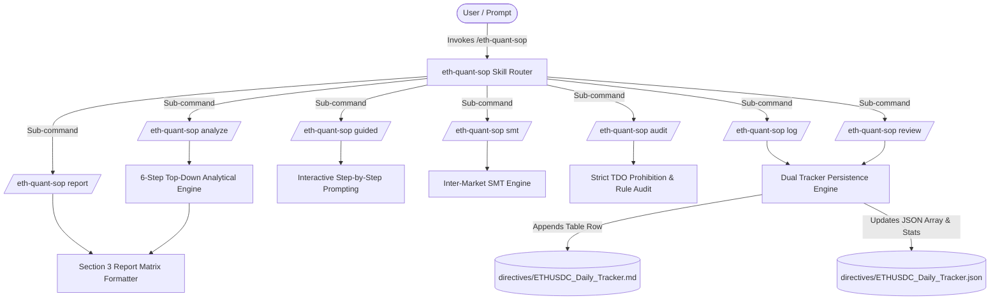
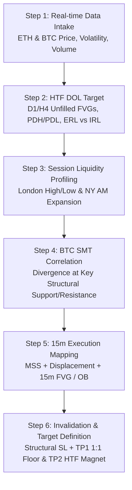
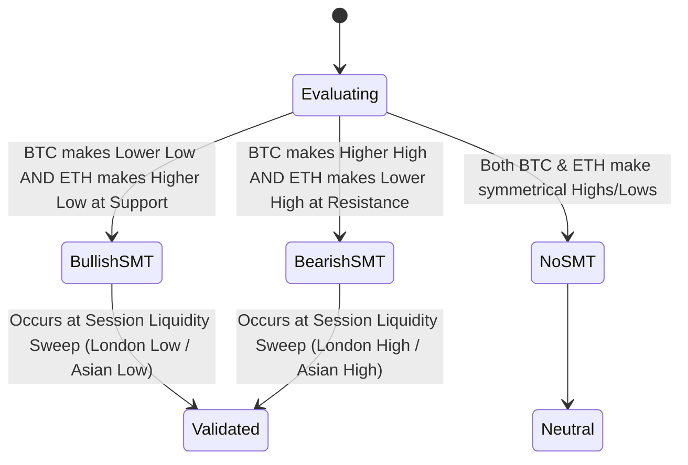

# 🏛️ ETHUSDC.p Quantitative Analysis SOP — Skill Architectural Blueprint & Guide

> **Document Type:** Skill Architectural Blueprint & Operational Guide  
> **Version:** 1.0.0  
> **Target Asset:** `ETHUSDC.p` (Primary) & `BTCUSDC.p` (Inter-Market Correlation)  
> **Skill Root:** `.agents/skills/eth-quant-sop/`  

---

## 1. Executive Summary & Purpose

The **`eth-quant-sop`** skill transforms the static *ETHUSDC.p Quantitative Analysis Framework & AI Agent SOP* into an executable, interactive quant engine capability within Antigravity and Gemini Sparks.

This blueprint documents the end-to-end architecture, mathematical definitions, 7-command sub-system mechanics, guardrails, and data schemas governing the skill.

---

## 2. System Architecture & Data Flow



---

## 3. Quantitative Analytical Hierarchy (6-Step Pipeline)



### Mathematical & Structural Definitions

#### 1. Draw on Liquidity (DOL)
$$\text{DOL} \in \{\text{PDH}, \text{PDL}, \text{FVG}_{\text{D1}}, \text{FVG}_{\text{H4}}, \text{ERL}, \text{IRL}\}$$
Price moves systematically from Internal Range Liquidity (IRL: FVGs) to External Range Liquidity (ERL: Swing Highs/Lows) and vice versa.

#### 2. BTC SMT Divergence State Machine



* **Bullish SMT Equation:**
  $$\Delta \text{Low}_{\text{BTC}} < 0 \quad \text{AND} \quad \Delta \text{Low}_{\text{ETH}} \ge 0 \quad \text{at Key Support}$$
* **Bearish SMT Equation:**
  $$\Delta \text{High}_{\text{BTC}} > 0 \quad \text{AND} \quad \Delta \text{High}_{\text{ETH}} \le 0 \quad \text{at Key Resistance}$$

#### 3. 15m Market Structure Shift (MSS) & Displacement
- **MSS:** Clean candle body close past the most recent 15m inner swing high (for long) or low (for short) following a liquidity sweep.
- **Displacement:** Energetic expansion candle where body comprises $\ge 70\%$ of candle range, creating a 3-candle imbalance (FVG).

---

## 4. Sub-Command Execution Specifications

### 1. `/eth-quant-sop analyze` (or `direct`)
* **Behavior:** Executes all 6 analytical steps non-interactively.
* **Output:** Standardized Section 3 Markdown Matrix Report containing Market Context, HTF DOL, Session Profile, SMT Status, Trade Narrative, and Risk Parameters.

### 2. `/eth-quant-sop guided`
* **Behavior:** Interactively prompts the user step by step (Steps 1 through 6).
* **Usage:** Ideal when price action is unfolding in real time or when manual confirmation of SMT divergence is required.

### 3. `/eth-quant-sop smt`
* **Behavior:** Focuses strictly on Step 4. Inspects BTC vs ETH swing highs/lows at current session levels.
* **Output:** SMT Validation Card with SMT Status (`BULLISH_SMT`, `BEARISH_SMT`, or `NONE`), Key Levels, and Divergence Context.

### 4. `/eth-quant-sop log`
* **Behavior:** Ingests setup parameters and appends the setup record into both `directives/ETHUSDC_Daily_Tracker.md` and `directives/ETHUSDC_Daily_Tracker.json`.
* **Output:** Confirmation badge with entry ID (e.g., `ETH-20260808-01`) and updated tracker summary stats.

### 5. `/eth-quant-sop review`
* **Behavior:** Executed at session close (e.g., 16:00 EST / NY close). Prompts or updates existing setup entries with final outcome (`Success`, `Stop Out`, `No Trigger`) and price action commentary.

### 6. `/eth-quant-sop audit`
* **Behavior:** Scans analysis text or trade plans to ensure 100% compliance with SOP rules:
  1. **TDO Prohibition:** Rejects any reference to True Day Open or Cairo TDO.
  2. **Invalidation Check:** Verifies structural Stop Loss is explicitly declared.
  3. **Target Check:** Verifies TP targets anchor to HTF DOL.
  4. **SMT Location:** Verifies SMT occurs at valid liquidity pools.

### 7. `/eth-quant-sop report`
* **Behavior:** Converts unstructured chart notes, bullet points, or raw technical observations into the exact standardized Section 3 report matrix table.

---

## 5. Strict Guardrails & Anti-Patterns

| Guardrail Rule | Enforced Requirement | Failure Action |
| :--- | :--- | :--- |
| **NO TDO / Cairo TDO** | Zero mention of `True Day Open`, `TDO`, or `Cairo TDO`. | `audit` command flags as VIOLATION; prompt engine rejects reference. |
| **Session Anchor Only** | All intraday sweeps must reference London High/Low or NY AM expansion. | Re-anchors analysis to London/NY session markers. |
| **Explicit Invalidation** | Must state exact numerical price level for Stop Loss. | Prompts user for structural low/high anchor. |
| **SMT Confluence** | SMT divergence must occur at key liquidity levels. | Flags un-anchored divergence as low probability. |

---

## 6. Data Schemas & Persistence Formats

### Markdown Tracker Schema (`directives/ETHUSDC_Daily_Tracker.md`)
```markdown
| Date | Time (UTC) | Setup Type | HTF DOL Target | SMT Divergence | Invalidation | TP Targets | Outcome | Notes on Price Action |
| :--- | :--- | :--- | :--- | :--- | :--- | :--- | :--- | :--- |
| 2026-08-08 | 16:14 | SMT Div + 15m MSS | PDH ($3,520.00) | Bullish SMT vs BTC | $3,425.00 | TP1: $3,485 / TP2: $3,520 | PENDING | London Low swept into 15m BISI FVG |
```

### JSON Tracker Schema (`directives/ETHUSDC_Daily_Tracker.json`)
```json
{
  "version": "1.0.0",
  "symbol": "ETHUSDC.p",
  "lastUpdated": "2026-08-08T16:14:00Z",
  "stats": {
    "totalSetups": 1,
    "success": 0,
    "stopOut": 0,
    "noTrigger": 0,
    "winRate": 0.0
  },
  "entries": [
    {
      "id": "ETH-20260808-01",
      "date": "2026-08-08",
      "time": "16:14",
      "symbol": "ETHUSDC.p",
      "setupType": "SMT Divergence + 15m MSS",
      "htfDol": "PDH ($3,520.00)",
      "smtStatus": "Bullish SMT vs BTC",
      "entryRange": [3440.0, 3448.5],
      "invalidation": 3425.0,
      "tp1": 3485.0,
      "tp2": 3520.0,
      "outcome": "PENDING",
      "dolReached": false,
      "notes": "London Low swept into 15m BISI FVG"
    }
  ]
}
```

---

## 7. Troubleshooting & Edge Case Playbook

### Scenario A: SMT Divergence without 15m MSS
* **Condition:** SMT divergence forms between BTC and ETH, but 15m market structure has not broken.
* **Resolution:** Hold status at `ACTIVE_WATCH`. Do NOT issue trade entry parameters until a clean 15m MSS candle body close occurs.

### Scenario B: HTF DOL Reached Before 15m Entry Retest
* **Condition:** Price expands directly to HTF DOL target without retesting the 15m FVG or Order Block.
* **Resolution:** Mark setup outcome in tracker as `NO_TRIGGER / EXPIRED`. Do NOT chase price.

### Scenario C: Opposing HTF Bias vs LTF Session Sweep
* **Condition:** Daily trend is Bearish, but London Low is swept with Bullish SMT.
* **Resolution:** Treat setup as a **Counter-Trend Internal Retest to Premium FVG** (TP1 floor is mandatory exit; do NOT target new All-Time Highs).

---

## 📑 Linked References
- **Main Skill Contract:** [SKILL.md](../SKILL.md)
- **SOP Standard Document:** [sop_reference.md](sop_reference.md)
- **Daily Tracker (Markdown):** [directives/ETHUSDC_Daily_Tracker.md](file:///c:/My%20Files/Work/Lab/Gem_Charts_Data/directives/ETHUSDC_Daily_Tracker.md)
- **Daily Tracker (JSON):** [directives/ETHUSDC_Daily_Tracker.json](file:///c:/My%20Files/Work/Lab/Gem_Charts_Data/directives/ETHUSDC_Daily_Tracker.json)
