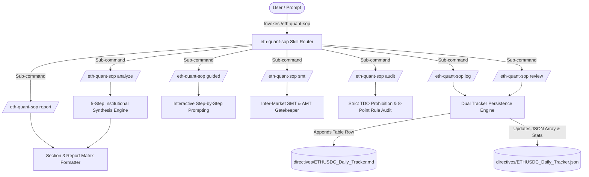
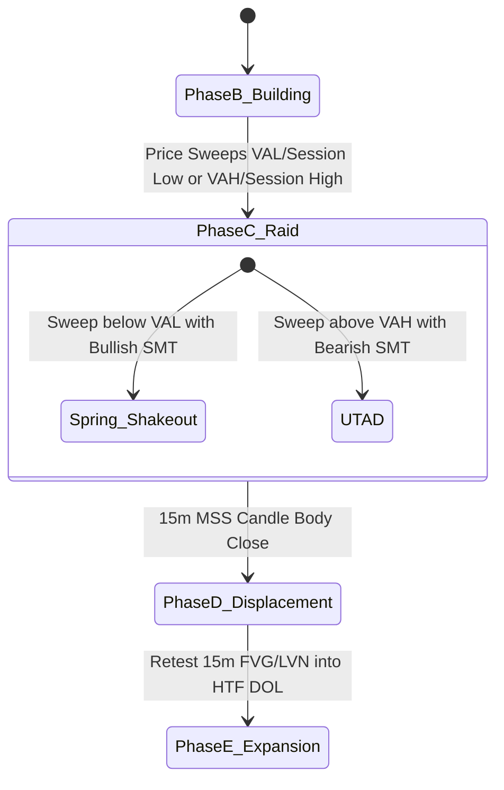

# 🏛️ Institutional Synthesis Framework — Skill Architectural Blueprint & Guide

> **Document Type:** Skill Architectural Blueprint & Operational Guide  
> **Version:** 2.0.0  
> **Target Asset:** `ETHUSDC.p` (Primary) & `BTCUSDC.p` (Inter-Market SMT Correlation)  
> **Skill Root:** `.agents/skills/eth-quant-sop/`  

---

## 1. Executive Summary & Purpose

The **`eth-quant-sop`** skill transforms the **Institutional Synthesis Framework: ETHUSDC.p Quantitative Analysis SOP** into an executable, interactive quant engine capability within Antigravity and Gemini Sparks.

It systematically synthesizes four foundational institutional paradigms:
1. **Pure ICT Time & Price Engine:** Kill-Zones, PD Arrays, and strict TDO prohibition.
2. **Auction Market Theory (AMT) & Volume Profiling:** Value Area Extremes (VAH/VAL), HVN avoidance, and LVN volume vacuums.
3. **The Wyckoff Method:** Phase C liquidity raids (Spring/UTAD) and Phase D displacement (SOS/SOW).
4. **Market Microstructure & SMT Gatekeeper:** Open Interest (OI) expansion, CVD Delta confirmation, and BTC vs ETH SMT divergence.

---

## 2. System Architecture & Data Flow



---

## 3. Quantitative Analytical Hierarchy (5-Step Pipeline)

```mermaid
flowchart TD
    S1[Step 1: HTF Narrative & DOL<br/>D1/H4 Trend, PDH/PDL, HTF FVGs, Liquidation Clusters] --> S2[Step 2: Session & Value Profiling<br/>London/NY Highs/Lows, VAH/VAL Extremes, LVN Vacuums]
    S2 --> S3[Step 3: Temporal Execution Gate<br/>London/NY AM Killzones 0-90m, Pre-News & DEAD_ZONE Filter]
    S3 --> S4[Step 4: Liquidity Raid & SMT Confirmation<br/>Wyckoff Phase C Spring/UTAD + BTC/ETH SMT Gatekeeper]
    S4 --> S5[Step 5: Micro Execution & Microstructure<br/>15m Phase D SOS/SOW MSS + FVG/LVN + OI/CVD Backing]
    S5 --> S6[Two-Stage Trailing Stop Management<br/>Stage 1: Displacement Base SL | Stage 2: 70% TP1 then M15 HL SL]
```

---

## 4. Mathematical & Structural Definitions

### 1. Draw on Liquidity (DOL) & Liquidation Clusters
$$\text{DOL} \in \{\text{PDH}, \text{PDL}, \text{FVG}_{\text{D1}}, \text{FVG}_{\text{H4}}, \text{ERL}, \text{IRL}, \text{LiqCluster}_{\text{High/Low}}\}$$
Price moves systematically from Internal Range Liquidity (IRL: FVGs) to External Range Liquidity (ERL: Swing Highs/Lows) and seeks high-density liquidation clusters.

### 2. Auction Market Theory (AMT) & Volume Profiling
- **Value Area Extremes:**
  $$\text{Long Target Entry} \le \text{VAL} \quad (\text{Discounted Value Auction})$$
  $$\text{Short Target Entry} \ge \text{VAH} \quad (\text{Premium Value Auction})$$
- **High Volume Node (HVN):** Region of high trading density / fair value agreement. Trade execution inside HVNs is **strictly prohibited**.
- **Low Volume Node (LVN):** Region of thin liquidity (volume vacuum). Entry FVGs must overlap LVNs to ensure rapid, uninhibited directional expansion.

### 3. Wyckoff Method State Machine


### 4. Market Microstructure & Institutional Backing
- **Open Interest (OI) Delta:** $\Delta \text{OI} > 0$ during the 15m displacement indicates genuine institutional position building (not merely retail liquidation cascades).
- **Cumulative Volume Delta (CVD) Absorption:** A divergence where price makes lower lows while CVD forms higher lows indicates passive limit order absorption by institutional buyers.

### 5. Inter-Market SMT Divergence Equations
- **Bullish SMT Equation:**
  $$\Delta \text{Low}_{\text{BTC}} < 0 \quad \text{AND} \quad \Delta \text{Low}_{\text{ETH}} \ge 0 \quad \text{at Support / VAL}$$
- **Bearish SMT Equation:**
  $$\Delta \text{High}_{\text{BTC}} > 0 \quad \text{AND} \quad \Delta \text{High}_{\text{ETH}} \le 0 \quad \text{at Resistance / VAH}$$

### 6. Two-Stage Trailing Stop Protocol
- **Stage 1 (Pre-TP1 / In-Flight):**
  $$\text{SL} = \text{Protected Displacement Base} \quad (\text{Strictly NO trailing to IRL / micro-swings})$$
- **Stage 2 (Post-TP1 / Runner Phase):**
  $$\text{Bank } 70\% \text{ at TP1 (ERL)} \implies \text{SL} = \text{Confirmed M15 Structural Higher Low / Lower High}$$

---

## 5. Sub-Command Execution Specifications

### 1. `/eth-quant-sop analyze` (or `direct`)
* **Behavior:** Executes all 5 institutional synthesis steps non-interactively.
* **Output:** Standardized Section 3 Markdown Matrix Report containing Market Context, HTF DOL, Session Profile, SMT Status, Trade Narrative, and Two-Stage Risk Parameters.

### 2. `/eth-quant-sop guided`
* **Behavior:** Interactively prompts the user step by step through Steps 1 to 5 + Risk Protocol.
* **Usage:** Ideal during live trading sessions when evaluating unfolding sweeps at VAH/VAL or confirming SMT divergence.

### 3. `/eth-quant-sop smt`
* **Behavior:** Focuses strictly on Step 4. Inspects BTC vs ETH swing highs/lows at current session levels / Value Area Extremes.
* **Output:** SMT Validation Card with SMT Status (`BULLISH_SMT`, `BEARISH_SMT`, or `NONE`), Value Area Location, and Divergence Context.

### 4. `/eth-quant-sop log`
* **Behavior:** Ingests setup parameters and appends the setup record into both `directives/ETHUSDC_Daily_Tracker.md` and `directives/ETHUSDC_Daily_Tracker.json`.
* **Output:** Confirmation badge with entry ID (e.g., `ETH-20260814-01`) and updated tracker summary stats.

### 5. `/eth-quant-sop review`
* **Behavior:** Executed at session close (16:00 EST / NY close). Updates existing setup entries with final outcome (`Success`, `Stop Out`, `No Trigger`) and price action commentary.

### 6. `/eth-quant-sop audit`
* **Behavior:** Scans analysis text or trade plans to ensure 100% compliance with SOP rules:
  1. **TDO Prohibition:** Verifies zero mention of True Day Open or Cairo TDO.
  2. **Killzone Timing:** Confirms entry window is within London (02:00–05:00 EST) or NY AM (08:00–11:00 EST).
  3. **AMT Alignment:** Verifies longs are below VAL and shorts above VAH (rejecting HVN entries).
  4. **Wyckoff Phase C/D:** Verifies Spring/UTAD sweep and displacement body close (MSS).
  5. **Microstructure:** Verifies OI/CVD institutional backing.
  6. **SMT Gatekeeper:** Verifies presence of inter-market divergence.
  7. **Two-Stage Risk SL:** Verifies Stage 1 displacement base SL and Stage 2 M15 HL trailing rule.
  8. **HTF Order Flow:** Verifies alignment with 1H/H4 trend (no counter-trend longs in 1H bearish trend).

### 7. `/eth-quant-sop report`
* **Behavior:** Converts unstructured chart notes, bullet points, or raw technical observations into the exact standardized Section 3 report matrix table.

---

## 6. Strict Guardrails & Anti-Patterns

| Guardrail Rule | Enforced Requirement | Failure Action |
| :--- | :--- | :--- |
| **NO TDO / Cairo TDO** | Zero mention of `True Day Open`, `TDO`, or `Cairo TDO`. | `audit` flags as CRITICAL VIOLATION; prompt engine rejects reference. |
| **HTF Order Flow Veto** | 15m Counter-Trend Bullish SMT signals strictly VETOED when 1H/H4 Order Flow is Bearish. | Forces focus exclusively on HTF Bearish Retests (shorting HTF Supply for SSL targets). |
| **AMT Value Area Extremes** | Longs below VAL, Shorts above VAH. No entries inside HVNs. | Rejects entries situated inside high-density volume acceptance nodes. |
| **Killzone Gate & DEAD_ZONE** | Trades executed only during London/NY AM Killzones (0–90m window). No entries during 12:00–13:30 EST. | Flags temporal violation and sets status to ABORT/WAIT. |
| **Mandatory SMT Gatekeeper** | SMT divergence between ETH and BTC is required for execution. | Blocks execution if both assets are moving in symmetrical unison. |
| **Two-Stage Trailing Stop** | SL anchored to Protected Displacement Base until TP1 banked (70%). | Prohibits premature trailing into internal range liquidity or micro-wicks. |

---

## 7. Data Schemas & Persistence Formats

### Markdown Tracker Schema (`directives/ETHUSDC_Daily_Tracker.md`)
```markdown
| Date | Time (UTC) | Setup Type | HTF DOL Target | SMT Divergence | Invalidation | TP Targets | Outcome | Notes on Price Action |
| :--- | :--- | :--- | :--- | :--- | :--- | :--- | :--- | :--- | :--- |
| 2026-08-14 | 16:14 | Wyckoff Spring + SMT + 15m MSS | PDH ($3,520.00) | Bullish SMT vs BTC at VAL | $3,425.00 | TP1: $3,485 / TP2: $3,520 | PENDING | London Low swept below VAL into 15m BISI FVG / LVN with CVD absorption |
```

### JSON Tracker Schema (`directives/ETHUSDC_Daily_Tracker.json`)
```json
{
  "version": "2.0.0",
  "symbol": "ETHUSDC.p",
  "lastUpdated": "2026-08-14T16:14:00Z",
  "stats": {
    "totalSetups": 1,
    "success": 0,
    "stopOut": 0,
    "noTrigger": 0,
    "winRate": 0.0
  },
  "entries": [
    {
      "id": "ETH-20260814-01",
      "date": "2026-08-14",
      "time": "16:14",
      "symbol": "ETHUSDC.p",
      "setupType": "Wyckoff Phase C Spring + SMT + 15m MSS",
      "htfDol": "PDH ($3,520.00)",
      "smtStatus": "Bullish SMT vs BTC at VAL",
      "entryRange": [3440.0, 3448.5],
      "invalidation": 3425.0,
      "tp1": 3485.0,
      "tp2": 3520.0,
      "stage1Sl": 3425.0,
      "stage2Sl": "M15 Structural HL post-TP1",
      "outcome": "PENDING",
      "dolReached": false,
      "notes": "London Low swept below VAL into 15m BISI FVG / LVN with CVD absorption"
    }
  ]
}
```

---

## 8. Troubleshooting & Edge Case Playbook

### Scenario A: SMT Divergence without 15m Phase D Displacement (MSS)
* **Condition:** SMT divergence forms between BTC and ETH at VAL, but 15m market structure has not broken with strong displacement.
* **Resolution:** Hold status at `ACTIVE_WATCH`. Do NOT enter until a clean 15m candle body close (Phase D SOS) creates a confirmed FVG overlapping an LVN.

### Scenario B: Price Trades Inside High Volume Node (HVN)
* **Condition:** Setup forms inside the Value Area Point of Control (POC) or HVN.
* **Resolution:** **REJECT SETUP.** Trading inside HVNs leads to chop and poor risk-reward. Require price to expand to Value Area Extremes (VAL/VAH).

### Scenario C: Opposing HTF Bias vs LTF Session Sweep
* **Condition:** 1H/H4 HTF Trend is Bearish, but London Low is swept below VAL with Bullish SMT.
* **Resolution:** **STRICTLY VETO LONG SETUPS.** Do NOT generate counter-trend long trades. Treat the 15m SMT bounce strictly as liquidity engineering for 1H Bearish Supply. Analysis must focus exclusively on primary HTF Short Retests.

---

## 📑 Linked References
- **Main Skill Contract:** [SKILL.md](../SKILL.md)
- **SOP Standard Document:** [resources/sop_reference.md](../resources/sop_reference.md)
- **Canonical SOP Directive:** [directives/ETHUSDC.p Quantitative Analysis Framework & AI Agent Skill SOP.md](file:///c:/My%20Files/Work/Lab/Gem_Charts_Data/directives/ETHUSDC.p%20Quantitative%20Analysis%20Framework%20&%20AI%20Agent%20Skill%20SOP.md)
- **Daily Tracker (Markdown):** [directives/ETHUSDC_Daily_Tracker.md](file:///c:/My%20Files/Work/Lab/Gem_Charts_Data/directives/ETHUSDC_Daily_Tracker.md)
- **Daily Tracker (JSON):** [directives/ETHUSDC_Daily_Tracker.json](file:///c:/My%20Files/Work/Lab/Gem_Charts_Data/directives/ETHUSDC_Daily_Tracker.json)
