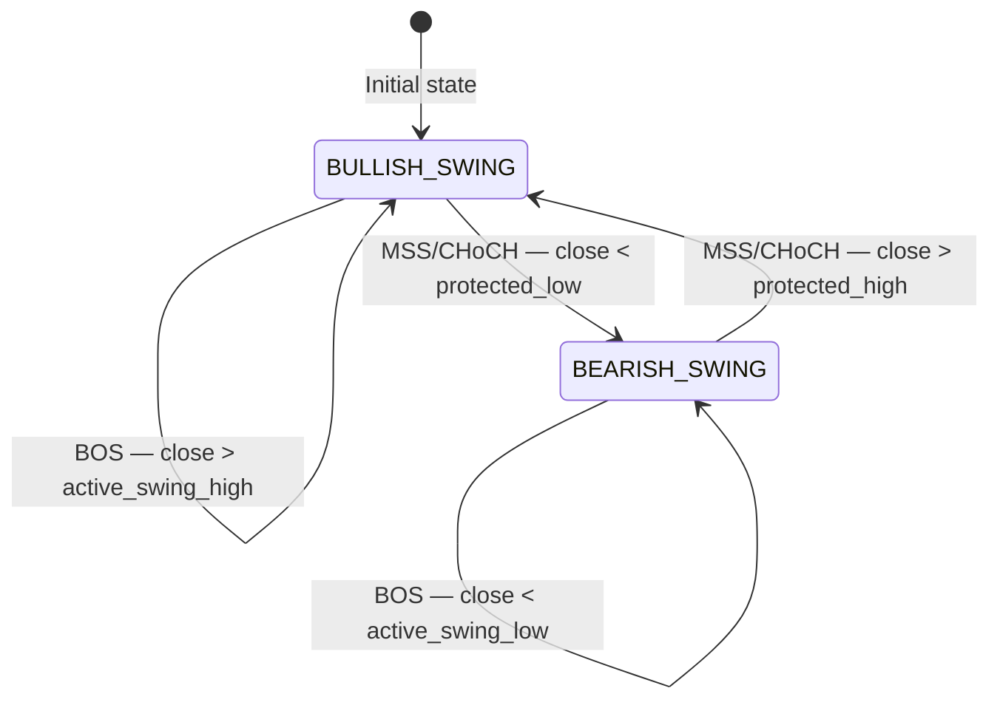
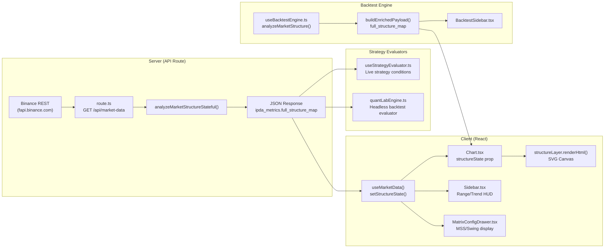

# CURRENT_STRUCTURE_MAP.md
## Pre-Refactor Codebase Map — Market Structure Engine (V11.0.4)

> **Purpose**: Complete microscopic documentation of the **current** Market Structure system prior to teardown/rewrite.  
> **Generated**: 2026-06-03 · **Source of Truth**: `src/lib/structureEngine.ts` (1,203 lines / 45 KB)

---

## Table of Contents

1. [The Core Calculation Engine (Math & Logic)](#1-the-core-calculation-engine-math--logic)
2. [The State Machine & Range Builders](#2-the-state-machine--range-builders)
3. [The Visual Rendering Pipeline](#3-the-visual-rendering-pipeline)
4. [Downstream Consumers & Dependency Map](#4-downstream-consumers--dependency-map)
5. [Full API Serialization Contract](#5-full-api-serialization-contract)
6. [Known Lessons & Constraints](#6-known-lessons--constraints)

---

## 1. The Core Calculation Engine (Math & Logic)

### 1.1 File & Class Architecture

| Component | Location | Purpose |
|---|---|---|
| `MarketStructureEngine` (class) | [`structureEngine.ts:125–707`](file:///c:/My%20Files/Work/Lab/Gem_Charts_Data/src/lib/structureEngine.ts#L125-L707) | Single-pass FSM that processes candles one at a time |
| `analyzeMarketStructure()` (function) | [`structureEngine.ts:711–1154`](file:///c:/My%20Files/Work/Lab/Gem_Charts_Data/src/lib/structureEngine.ts#L711-L1154) | Public wrapper — instantiates two engines (MACRO + INNER), builds zigzag/ranges |
| `analyzeMarketStructureStateful()` (function) | [`structureEngine.ts:1162–1202`](file:///c:/My%20Files/Work/Lab/Gem_Charts_Data/src/lib/structureEngine.ts#L1162-L1202) | Stateful caching layer — accumulates candles across polling intervals on the server |

### 1.2 Fractal/Swing Detection — `detect_pivots(t, N_t)`

**Function**: [`structureEngine.ts:252–317`](file:///c:/My%20Files/Work/Lab/Gem_Charts_Data/src/lib/structureEngine.ts#L252-L317)

**Algorithm**: Standard N-bar fractal detection with dynamic window width.

```
For a candle at index check_idx = t - N_t:
  is_swing_high = TRUE if ALL candles within ±N_t have LOWER highs
  is_swing_low  = TRUE if ALL candles within ±N_t have HIGHER lows
```

**Key behaviors:**
- `check_idx` must satisfy `check_idx >= N_t` (sufficient left-side lookback)
- Inside-bar candles (flagged `inside_bar = true`) are **skipped entirely** — never act as pivots
- Confirmed pivots are appended to `this.confirmed_pivots: Pivot[]`
- When a newly detected high equals `active_swing_high`, a corresponding low is auto-confirmed via [`confirm_corresponding_low()`](file:///c:/My%20Files/Work/Lab/Gem_Charts_Data/src/lib/structureEngine.ts#L319-L331) — and vice versa

### 1.3 Volatility-Adjusted Adaptive Window ($N_t$)

**Function**: [`calculate_adaptive_n()`](file:///c:/My%20Files/Work/Lab/Gem_Charts_Data/src/lib/structureEngine.ts#L166-L210)

**Mathematics**:
```
ratio = ATR(14, t) / MedianATR(100, t)
N_t = floor(N_base × (2.0 − ratio))
N_t = clamp(N_t, N_min, N_max)
```

**Scale-invariant defaults** (when no custom overrides):

| Timeframe | `N_base` | `N_min` | `N_max` |
|---|---|---|---|
| 1m | 3 | 2 | 8 |
| 5m | 5 | 3 | 12 |
| 15m+ | 6 | 3 | 15 |

**NaN Guard**: If `ATR`, `MedianATR`, or the computed result is `NaN`, falls back to `N_base`.

### 1.4 Inside Bar Filtering

**Function**: [`is_inside_bar()`](file:///c:/My%20Files/Work/Lab/Gem_Charts_Data/src/lib/structureEngine.ts#L213-L219)

```
Inside Bar = current.high <= mother.high AND current.low >= mother.low
```

- The `last_mother_bar_index` tracks the last non-inside bar
- Inside bars are tagged with `candle.inside_bar = true` and **skipped** in pivot detection, inducement gate evaluation, and FSM transition checks
- This prevents false pivot detection from narrow consolidation candles

### 1.5 ATR & Volume Helpers

| Function | Location | Formula |
|---|---|---|
| [`compute_tr()`](file:///c:/My%20Files/Work/Lab/Gem_Charts_Data/src/lib/structureEngine.ts#L564-L574) | L564 | `max(H-L, |H-prevC|, |L-prevC|)` |
| [`compute_atr()`](file:///c:/My%20Files/Work/Lab/Gem_Charts_Data/src/lib/structureEngine.ts#L576-L589) | L576 | Rolling mean of TR over `len` periods |
| [`compute_median_atr()`](file:///c:/My%20Files/Work/Lab/Gem_Charts_Data/src/lib/structureEngine.ts#L591-L605) | L591 | Median of last 100 ATR snapshots |
| [`compute_volume_sma()`](file:///c:/My%20Files/Work/Lab/Gem_Charts_Data/src/lib/structureEngine.ts#L607-L617) | L607 | Rolling mean of volume over `len` |

### 1.6 Inducement (IDM) Confirmation Gate

**Function**: [`update_inducement_gates()`](file:///c:/My%20Files/Work/Lab/Gem_Charts_Data/src/lib/structureEngine.ts#L347-L445)

**Purpose**: Prevents a swing from being "confirmed" until either:
1. A pullback sweeps the **Inducement Level** (IDM), OR
2. A **V-Reversal Override** fires (aggressive displacement without pullback)

**Bullish Swing flow** (trend = `BULLISH_SWING`):
```
1. When price makes new high → candidate_high = current.high
2. Locate last pullback low → set active_idm_level
3. When price sweeps below active_idm_level:
   → Confirm swing high = candidate_high
   → Fire SWING_HIGH_CONFIRMED event
4. V-Reversal: If no confirmed high yet AND aggressive bearish candle
   (body_ratio >= 0.85, volume_expansion >= 2.0):
   → Force-confirm candidate_high as swing high
```

**IDM Location Algorithms**:
- [`locate_last_pullback_low()`](file:///c:/My%20Files/Work/Lab/Gem_Charts_Data/src/lib/structureEngine.ts#L620-L661): Searches backward for a candle dipping below a preceding candle's low, then requires pullback depth ≥ `0.5 × ATR(14)`
- [`locate_last_pullback_high()`](file:///c:/My%20Files/Work/Lab/Gem_Charts_Data/src/lib/structureEngine.ts#L664-L706): Mirror logic for bearish IDM

---

## 2. The State Machine & Range Builders

### 2.1 FSM State Transitions

**Function**: [`evaluate_state_transitions()`](file:///c:/My%20Files/Work/Lab/Gem_Charts_Data/src/lib/structureEngine.ts#L447-L531)

**States**: `BULLISH_SWING` | `BEARISH_SWING`



**BOS (Break of Structure) — Trend Continuation**:
- **Bullish**: `current.close > active_swing_high`
- **Bearish**: `current.close < active_swing_low`
- On BOS: `protected_low/high` is promoted to anchor the new dealing range

**MSS vs CHoCH (Market Structure Shift / Change of Character)**:
- **Triggered when**: price closes beyond the **protected** level (the defended swing)
- **MSS classification**: body_ratio ≥ `mss_body_ratio` (default 0.70) AND volume_expansion ≥ `displacement_vef` (default 1.50)
- **CHoCH classification**: Same trigger but the candle fails the displacement qualification
- Both are treated as MSS in the zigzag builder, but `displacementConfirmed` differentiates them

**Sharp Departure Validation**: [`check_pending_departures()`](file:///c:/My%20Files/Work/Lab/Gem_Charts_Data/src/lib/structureEngine.ts#L534-L561)
- After a BOS/MSS fires, it's tracked as a `pending_break`
- Within **5 candles**: if `|close - breakLevel| >= sharp_departure_mult × ATR` → departure confirmed
- After 5 candles: departure **failed** → event marked `invalidated = true`

### 2.2 Dual-Pass Architecture

**PASS 1 — Macro Engine** ([`structureEngine.ts:762–787`](file:///c:/My%20Files/Work/Lab/Gem_Charts_Data/src/lib/structureEngine.ts#L762-L787)):
- Uses the user's configured `N_min` / `N_max` (or timeframe-scaled defaults)
- Produces the "parent" dealing range, trend, and zigzag

**PASS 2 — Inner Engine** ([`structureEngine.ts:789–813`](file:///c:/My%20Files/Work/Lab/Gem_Charts_Data/src/lib/structureEngine.ts#L789-L813)):
- Hard-coded `adaptiveNMin=1`, `adaptiveNMax=3` for tight sub-wave detection
- Completely independent — processes the **same** normalized candles
- Produces `innerSwings`, `innerZigzag` arrays

### 2.3 Zigzag Construction

**Macro Zigzag** ([`structureEngine.ts:841–903`](file:///c:/My%20Files/Work/Lab/Gem_Charts_Data/src/lib/structureEngine.ts#L841-L903)):
1. Filter to `confirmed` swings only
2. **Alternating filter**: Collapse consecutive same-type swings → keep highest HIGH or lowest LOW
3. Walk pairs `[from, to]` → resolve BOS/MSS/CHoCH via `registered_events`
4. Track `latestMSS` pointer

**Inner Zigzag** ([`structureEngine.ts:905–951`](file:///c:/My%20Files/Work/Lab/Gem_Charts_Data/src/lib/structureEngine.ts#L905-L951)):
- Same alternating+classification algorithm on `innerEngine.confirmed_pivots`

### 2.4 Dealing Range Builders

**Macro Dealing Range** ([`structureEngine.ts:953–982`](file:///c:/My%20Files/Work/Lab/Gem_Charts_Data/src/lib/structureEngine.ts#L953-L982)):
```
high = last alternating HIGH swing price
low  = last alternating LOW swing price
equilibrium = (high + low) / 2
current_status = price > eq ? 'PREMIUM' : 'DISCOUNT'
```
Fallback: `"AWAITING_IDM_SWEEP"` if insufficient confirmed swings

**Internal Dealing Range** ([`structureEngine.ts:984–1108`](file:///c:/My%20Files/Work/Lab/Gem_Charts_Data/src/lib/structureEngine.ts#L984-L1108)):

Three-tier priority cascade:

| Priority | Condition | Range Computation |
|---|---|---|
| 1. iMSS Anchoring (V10.43) | Active confirmed iMSS exists inside macro range | Origin price of iMSS → extreme price since → builds range |
| 2. Standard Internal | Confirmed macro swings exist strictly between macro H/L | Last internal HIGH + last internal LOW → builds range |
| 3. Micro Fallback (V10.36) | No Layer 2 internals available | Uses PASS 2 inner-engine swings filtered to macro range |

**Internal Zigzag** ([`structureEngine.ts:1006–1011`](file:///c:/My%20Files/Work/Lab/Gem_Charts_Data/src/lib/structureEngine.ts#L1006-L1011)):
- Subset of **macro zigzag** segments where `from.price` and `to.price` both fall strictly inside the macro dealing range bounds

### 2.5 Fallback Anchor Confirmation

[`structureEngine.ts:771–787`](file:///c:/My%20Files/Work/Lab/Gem_Charts_Data/src/lib/structureEngine.ts#L771-L787): If the IDM gate **never fired** (no confirmed pivots), the engine degrades gracefully:
- Finds absolute highest HIGH + absolute lowest LOW among all detected pivots
- Force-confirms them so the chart always has at least one dealing range

### 2.6 Exported Interfaces

| Interface | Location | Key Fields |
|---|---|---|
| [`StructuralSwing`](file:///c:/My%20Files/Work/Lab/Gem_Charts_Data/src/lib/structureEngine.ts#L22-L41) | L22 | `t, price, type, grade, colorValidated, structure_type, confirmed` |
| [`ZigZagSegment`](file:///c:/My%20Files/Work/Lab/Gem_Charts_Data/src/lib/structureEngine.ts#L43-L64) | L43 | `from, to, label, trendBefore, trendAfter, displacementConfirmed` |
| [`StructuralDealingRange`](file:///c:/My%20Files/Work/Lab/Gem_Charts_Data/src/lib/structureEngine.ts#L66-L75) | L66 | `high, low, equilibrium, current_status, anchor_high_swing, anchor_low_swing` |
| [`MarketStructureAnalysis`](file:///c:/My%20Files/Work/Lab/Gem_Charts_Data/src/lib/structureEngine.ts#L77-L113) | L77 | Full output bundle — macro + inner layers |
| [`Pivot`](file:///c:/My%20Files/Work/Lab/Gem_Charts_Data/src/lib/structureEngine.ts#L115-L121) | L115 | `type, index, price, confirmed, timestamp` |

---

## 3. The Visual Rendering Pipeline

### 3.1 Layer Registration & Visibility

| File | Purpose |
|---|---|
| [`registry.ts`](file:///c:/My%20Files/Work/Lab/Gem_Charts_Data/src/lib/chartLayers/registry.ts) | `LayerRegistry` class — registers `structureLayer` alongside fvg, magnets, sessions, displacement |
| [`store.ts`](file:///c:/My%20Files/Work/Lab/Gem_Charts_Data/src/lib/chartLayers/store.ts) | Zustand persisted store — controls 5 visibility flags for structure sub-layers |

**Visibility Flags** (all default `true`, persisted to `localStorage: 'gem-chart-layers-store'`):

| Flag | HUD Label | Controls |
|---|---|---|
| `structure` | STRUCTURE (parent toggle) | Master kill switch for all structure visuals |
| `structure_major` | MAJ | 5-bar fractal horizontal price ceilings/floors + hollow circles |
| `structure_inner` | INN | 3-bar fractal diamond markers + inner zigzag dashed path |
| `structure_int` | INT | Internal breach rays (dashed horizontal levels from unconfirmed macro swings) |
| `structure_istr` | iSTR | Internal Structure (iMSS/iBOS badges + volatility suppression) |

**HUD Component**: [`ChartLayerHud.tsx`](file:///c:/My%20Files/Work/Lab/Gem_Charts_Data/src/components/ChartLayerHud.tsx) — glass-capsule floating toggle panel, top-right corner

### 3.2 Coordinate Mapping — Price/Time to SVG Pixels

**File**: [`structureLayer.ts`](file:///c:/My%20Files/Work/Lab/Gem_Charts_Data/src/lib/chartLayers/plugins/structureLayer.ts) (591 lines)

The layer's `renderHtml(context)` method receives a `context` object containing:
- `chart` — lightweight-charts `IChartApi`
- `series` — lightweight-charts `ISeriesApi<'Candlestick'>`
- `activeCandles`, `theme`, `themeSettings`, `data`
- `structureState` — the pre-computed `MarketStructureAnalysis` object (injected at L42)

**Coordinate functions used**:
```typescript
x = timeScale.timeToCoordinate(Math.floor(pt.t / 1000))  // ms → unix sec → pixel X
y = series.priceToCoordinate(pt.price)                     // price → pixel Y
```

**Critical**: Timestamps in the structure analysis are **milliseconds**. The chart API expects **seconds**. Division by 1000 with `Math.floor()` is applied at every coordinate mapping call.

### 3.3 Visual Elements Rendered

The SVG canvas renders 7 element groups in this exact Z-order:

| Order | Element | Condition | Key |
|---|---|---|---|
| A1 | Inner Zigzag Path | `showInternalSwings && showInner` | Dashed accent-colored lines between inner-engine swings |
| A2 | Dealing Range Shadow Box | `dr.anchor_high_swing && dr.anchor_low_swing` | Tinted rectangle spanning macro range, colored by trend |
| A3 | Equilibrium Midline | Same as A2 | Dashed `4,4` line at 50% + "EQUILIBRIUM (0.50)" label |
| A4 | Horizontal Price Levels | `showMajor` for MAJOR, `showInternalSwings` for INTERNAL | Solid/dashed lines from swing X to breach X or right edge |
| A5 | Expansion Trace Rays | *(array exists but currently empty)* | Reserved for unconfirmed swing projections |
| A6 | BOS/MSS Breach Badges | `showMajor` | Pill-shaped badges at break coordinates; amber for unconfirmed MSS |
| A6b | iMSS/iBOS Badges | `showIstr && !isVolatilitySuppressed` | Smaller dashed badges at internal break coordinates |
| A7 | Equal Highs/Lows (SMT) | Always | Gold horizontal lines + hollow circles at EQH/EQL anchors |
| B | Major Swing Circles | `showMajor` or `showInternalSwings` | Hollow 4.5px circles, color depends on confirmed/internal/color-validated |
| C | Inner Swing Diamonds | `showInner` | Solid 3.5px diamonds at 3-bar fractals |
| D | Volatility Suppression Badge | `isVolatilitySuppressed` | Amber top-right warning: "⚠️ iSTR VOLATILITY: NOISE SUPPRESSED" |

### 3.4 Volatility Suppression Gate

```typescript
rangeHeight = internalDealingRange.high - internalDealingRange.low
isVolatilitySuppressed = rangeHeight > 0 && atr > 0 && rangeHeight < atr * multiplier
// multiplier = themeSettings.structure_istr_atr_multiplier (default: 1.5)
```

When suppressed: iSTR badges and Internal swing circles are **hidden**, and the amber warning badge is shown.

### 3.5 Theme-Aware Color Resolution

All colors resolve dynamically from `themeSettings` with dark/light fallbacks:

| Token | Dark Default | Light Default |
|---|---|---|
| `swing_high` | `rgba(239, 68, 68, 0.85)` | `rgba(225, 29, 72, 0.85)` |
| `swing_low` | `rgba(80, 255, 175, 0.85)` | `rgba(5, 150, 105, 0.85)` |
| `swing_high_internal` | `rgba(239, 68, 68, 0.45)` | `rgba(225, 29, 72, 0.45)` |
| `swing_low_internal` | `rgba(80, 255, 175, 0.45)` | `rgba(5, 150, 105, 0.45)` |
| `bos` | `rgba(168, 85, 247, 0.85)` | `rgba(79, 70, 229, 0.85)` |
| `mss` | `rgba(80, 255, 175, 0.85)` | `rgba(5, 150, 105, 0.85)` |
| Unconfirmed MSS | `rgba(251, 191, 36, 0.85)` | `rgba(217, 119, 6, 0.85)` |

---

## 4. Downstream Consumers & Dependency Map

### 4.1 Data Flow Architecture



### 4.2 Direct Importers of `structureEngine.ts`

| File | Import | Usage |
|---|---|---|
| [`route.ts`](file:///c:/My%20Files/Work/Lab/Gem_Charts_Data/src/app/api/market-data/route.ts#L7) | `analyzeMarketStructureStateful` | Server-side stateful analysis per `(symbol, interval)` |
| [`useMarketData.ts`](file:///c:/My%20Files/Work/Lab/Gem_Charts_Data/src/hooks/useMarketData.ts#L6) | `analyzeMarketStructure, MarketStructureAnalysis` | Client-side fallback if server map unavailable |
| [`useBacktestEngine.ts`](file:///c:/My%20Files/Work/Lab/Gem_Charts_Data/src/hooks/useBacktestEngine.ts#L17) | `analyzeMarketStructure` | Offline backtest replay |
| [`quantLabEngine.ts`](file:///c:/My%20Files/Work/Lab/Gem_Charts_Data/src/lib/quantLabEngine.ts#L5) | `analyzeMarketStructure` | Headless server-side backtest evaluator |
| [`structureLayer.ts`](file:///c:/My%20Files/Work/Lab/Gem_Charts_Data/src/lib/chartLayers/plugins/structureLayer.ts#L4) | `StructuralSwing, ZigZagSegment` (types only) | Visual rendering type contracts |

### 4.3 `full_structure_map` Consumers (via `ipda_metrics`)

These files access `ipda_metrics.full_structure_map.*` at runtime:

| File | Fields Accessed |
|---|---|
| [`useStrategyEvaluator.ts`](file:///c:/My%20Files/Work/Lab/Gem_Charts_Data/src/hooks/useStrategyEvaluator.ts) | `.structural_events`, `.subTrend`, `.internalDealingRange`, `.zigzag`, `.dealingRange`, `.swings` |
| [`quantLabEngine.ts`](file:///c:/My%20Files/Work/Lab/Gem_Charts_Data/src/lib/quantLabEngine.ts) | `.zigzag`, `.subTrend`, `.internalDealingRange`, `.dealingRange`, `.swings` |
| [`Chart.tsx`](file:///c:/My%20Files/Work/Lab/Gem_Charts_Data/src/components/Chart.tsx) | `.swings[0].t` (context anchor timestamp) |
| [`Sidebar.tsx`](file:///c:/My%20Files/Work/Lab/Gem_Charts_Data/src/components/Sidebar.tsx) | `.dealingRange`, `.internalDealingRange`, `structureState.currentTrend`, `.internalTrend` |
| [`MatrixConfigDrawer.tsx`](file:///c:/My%20Files/Work/Lab/Gem_Charts_Data/src/components/MatrixConfigDrawer.tsx) | `.zigzag` (MSS lookup), `.swings`, `.dealingRange` |

### 4.4 Strategy Evaluator Metric Bindings

The following **strategy condition metrics** directly consume structure data (identical logic in [`useStrategyEvaluator.ts`](file:///c:/My%20Files/Work/Lab/Gem_Charts_Data/src/hooks/useStrategyEvaluator.ts) and [`quantLabEngine.ts`](file:///c:/My%20Files/Work/Lab/Gem_Charts_Data/src/lib/quantLabEngine.ts)):

| Metric | Structure Data Source |
|---|---|
| `MSS` | `full_structure_map.zigzag` → filter `label === 'MSS'` → check `displacementConfirmed` |
| `BOS` | `full_structure_map.zigzag` → last segment → check `label === 'BOS'` |
| `MARKET_TREND` | `global_anchors.current_trend` ‖ `current_trend` |
| `SUB_TREND` | `global_anchors.sub_trend` ‖ `full_structure_map.subTrend` |
| `INTERNAL_TREND` | `internal_context.trend` ‖ `internal_market_trend` |
| `INTERNAL_MSS` | `internal_context.market_structure_shift` ‖ `internal_structure_shift` |
| `INTERNAL_PRICING` | `internal_context.pricing_status` ‖ `internalDealingRange.current_status` |
| `LOCAL_PRICING` | `internal_context.pricing_status` (with RUNAWAY override) |
| `EQUILIBRIUM_STATUS` | `global_anchors.current_status` ‖ `pricing_context.local_dealing_range.current_status` |
| `PRICE_IN_OTE` | `global_anchors` ‖ `full_structure_map.dealingRange` → Fibonacci retracement zones |
| `STRUCTURE_TYPE` | `full_structure_map.swings` → last swing → `.structure_type` |
| `MARKET_VELOCITY` | `ipda_metrics.market_velocity` |
| `MSS_CONFIRMED` | `ipda_metrics.market_structure_shift` (boolean) |

### 4.5 `useMarketData` — Client-Side Structure State Management

[`useMarketData.ts:666–695`](file:///c:/My%20Files/Work/Lab/Gem_Charts_Data/src/hooks/useMarketData.ts#L666-L695)

**Two-path hydration strategy**:

1. **Server path** (preferred): If `data.ipda_metrics.full_structure_map` exists, it's set directly as `structureState`
2. **Client fallback**: If the server map is absent, runs `analyzeMarketStructure()` client-side using the active candle series, `contextAnchorTimestamp`, `globalAnchors`, and `engineSettings`

**Context Anchor**:
- Established **once** on first successful load: `anchor = activeCandles[0].t`
- Prevents lookback truncation drift during polling

**Reset behavior**: On `selectedInterval` change, both `contextAnchorTimestamp` and `structureState` are reset to `null`

---

## 5. Full API Serialization Contract

### 5.1 Server-Side Serialization (`route.ts`)

The API response at `ipda_metrics.full_structure_map` contains:

```typescript
full_structure_map: {
  swing_points:                Pivot[],                  // Raw confirmed pivot array
  structural_events:           any[],                    // BOS/MSS/CHoCH event log
  swings:                      StructuralSwing[],        // Macro swings (all grades)
  zigzag:                      ZigZagSegment[],          // Macro zigzag
  innerSwings:                 StructuralSwing[],        // Pass 2 inner swings
  innerZigzag:                 ZigZagSegment[],          // Pass 2 inner zigzag
  currentTrend:                'BULLISH' | 'BEARISH' | 'UNSET',
  subTrend:                    'BULLISH' | 'BEARISH' | 'UNSET',
  dealingRange:                StructuralDealingRange,
  internalTrend:               'BULLISH' | 'BEARISH' | 'UNSET',
  internalZigzag:              ZigZagSegment[],          // Macro zigzag filtered to range
  latestInternalMSS:           ZigZagSegment | null,
  internal_market_structure_shift: boolean,
  internalDealingRange:        StructuralDealingRange,
  latestMSS:                   ZigZagSegment | null,
  market_structure_shift:      boolean,
  market_structure_shift_direction: 'BULLISH' | 'BEARISH' | 'UNSET' | null
}
```

### 5.2 Top-Level `ipda_metrics` Fields from Structure

Additionally, these fields are **promoted** to `ipda_metrics` root level:

```typescript
ipda_metrics: {
  market_structure_shift:           boolean,
  market_structure_shift_direction: string | null,
  current_trend:                    string,
  internal_market_trend:            string,
  internal_structure_shift:         boolean,
  expansion_mode:                   string,
  market_velocity:                  number,
  runaway_origin_price:             number | null,
  internal_context: {
    trend:              string,
    high:               number,
    low:                number,
    equilibrium:        number,
    pricing_status:     string,
    anchor_high_swing:  StructuralSwing | null,
    anchor_low_swing:   StructuralSwing | null
  },
  global_anchors: {
    high:               number,
    low:                number,
    equilibrium:        number,
    current_status:     string,
    anchor_high_swing:  StructuralSwing | null,
    anchor_low_swing:   StructuralSwing | null,
    current_trend:      string,
    sub_trend:          string
  }
}
```

### 5.3 Serialization Parity

The `full_structure_map` serialization is **identical** across three code paths:
1. [`route.ts:1067–1085`](file:///c:/My%20Files/Work/Lab/Gem_Charts_Data/src/app/api/market-data/route.ts#L1067-L1085) — Live API
2. [`useBacktestEngine.ts:369–387`](file:///c:/My%20Files/Work/Lab/Gem_Charts_Data/src/hooks/useBacktestEngine.ts#L369-L387) — Client backtest replay
3. [`quantLabEngine.ts:248–266`](file:///c:/My%20Files/Work/Lab/Gem_Charts_Data/src/lib/quantLabEngine.ts#L248-L266) — Headless server backtest

> **⚠️ CRITICAL**: Any structural changes to `MarketStructureAnalysis` or `full_structure_map` **MUST** be updated in all three serialization sites simultaneously.

### 5.4 Stateful Caching Layer (Server)

[`structureEngine.ts:1156–1202`](file:///c:/My%20Files/Work/Lab/Gem_Charts_Data/src/lib/structureEngine.ts#L1156-L1202)

```typescript
const accumulatedCandlesCache = new Map<string, Candle[]>();  // Key: "SYMBOL_INTERVAL"
const contextAnchorCache = new Map<string, number>();
const globalAnchorsCache = new Map<string, any>();
```

- On `isInit=true`: All caches for the key are **purged**
- On polling updates: New candles are merged (deduped by timestamp), sorted, and capped at **10,000 candles**
- The accumulated array is then passed to `analyzeMarketStructure()` as a whole

---

## 6. Known Lessons & Constraints

### 6.1 Historical Bugs (from `directives/02_lessons.md`)

| Lesson | Issue | Resolution |
|---|---|---|
| **Lesson 14** | UTC/Cairo timezone contamination in structural calculations | Engine core operates at **UTC-Zero**. Display layer applies `Africa/Cairo` formatting independently |
| **NaN Drift** | $N_t$ volatility index produced `NaN` from zero-division in `median_atr` | Added `isNaN()` guards at every ATR computation stage |
| **Binance 418** | Rate limiting caused fetch failures → structural state goes stale | Offline Simulation Mode with `generateMockCandles()` fallback |

### 6.2 Engine Configuration (User-Tunable)

All configurable via [`EngineSettings`](file:///c:/My%20Files/Work/Lab/Gem_Charts_Data/src/hooks/useMarketData.ts#L297-L309) in the settings drawer and persisted to Neon PostgreSQL:

| Setting | Default | Effect |
|---|---|---|
| `atrPeriod` | 14 | ATR window for pivot detection |
| `adaptiveNMin` | 3 | Minimum pivot fractal lookback |
| `adaptiveNMax` | 15 | Maximum pivot fractal lookback |
| `mssBodyRatio` | 0.70 | Min body/range ratio for MSS displacement |
| `displacementVef` | 1.50 | Min volume expansion factor for MSS |
| `sharpDepartureMult` | 1.50 | ATR multiplier for sharp departure confirmation |
| `structure_istr_atr_multiplier` | 1.5 | Volatility suppression gate multiplier (in `themeSettings`) |

### 6.3 Refactor Risk Areas

> [!CAUTION]
> **High-Risk Dependencies**: The following systems will break if the `MarketStructureAnalysis` interface shape changes:
> 1. **Strategy Evaluator** — 13+ metrics read from `full_structure_map` and `ipda_metrics` root fields
> 2. **Three serialization sites** — `route.ts`, `useBacktestEngine.ts`, `quantLabEngine.ts` must remain in sync
> 3. **Visual Layer** — `structureLayer.ts` reads `.swings`, `.zigzag`, `.internalZigzag`, `.dealingRange`, `.innerZigzag` directly
> 4. **HUD/Sidebar** — `Sidebar.tsx`, `MatrixConfigDrawer.tsx` both have dual-path access (`structureState?.X || ipda_metrics?.full_structure_map?.X`)
> 5. **Zustand Store** — 5 visibility flags hardcoded to specific layer ID strings

> [!IMPORTANT]
> **Must Preserve During Rewrite**:
> - The `full_structure_map` JSON contract shape (or introduce a versioned migration)
> - The `analyzeMarketStructure()` function signature (4 importers)
> - The `StructuralSwing`, `ZigZagSegment`, `StructuralDealingRange` type shapes (used by visual layer)
> - The stateful caching behavior for `analyzeMarketStructureStateful()` (per-symbol-per-interval isolation)
> - The inner/macro dual-pass independence (clients toggle them independently via Zustand)
