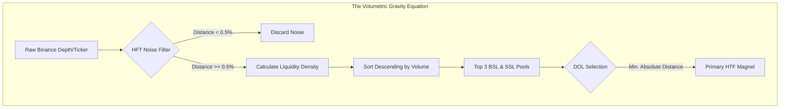

# 🧠 Quegar Quant Engine: Capability Map & Liquidity Audit (v10.30)

> **MANDATE:** Full-Spectrum Quant Engine Audit & Liquidity Logic Mapping
> **FOCUS:** Volumetric Gravity, Shadow Metrics, Structural Hierarchy, Statistical Veto (OLS).

---

## 1. The Volumetric Gravity Equation

The engine's `orderFlowEngine.ts` computes the exact gravitational pull of order book liquidity.

### Liquidity Density & The 0.5% Noise Filter
The engine fetches live Order Book depth (1000 levels). Before calculating gravitational pull, it mathematically strips out high-frequency trading (HFT) noise using a strict 0.5% threshold filter from the live mark price:
- **BSL Filter:** `(price - livePrice) / livePrice >= 0.005`
- **SSL Filter:** `(livePrice - price) / livePrice >= 0.005`

### Draw on Liquidity (DOL) & Primary Magnet Selection
The "Liquidity Density" is calculated by evaluating the sheer volume (`quantity`) sitting at each price node. The engine sorts these nodes in descending order of volume (`parseFloat(b[1]) - parseFloat(a[1])`), selecting the top 3 densest pools as `BSL_Magnets` and `SSL_Magnets`. 
The **Primary Magnet** is established dynamically in `route.ts` by reducing an array of Higher Time Frame (HTF) distances (PWH, PWL, PMH, PML, DAILY_SIBI, DAILY_BISI) to find the absolute minimum distance (`nearest_htf_magnet`).

---

## 2. Shadow Metrics (The Unused Power)

A microscopic scan of the `ipda_metrics` and `order_flow_engine` data payloads reveals significant institutional computations flowing into the frontend but **hidden** from the `EquationBuilder.tsx` and UI conditions.

| Shadow Metric | Source / Object | Calculated Value | Missing from UI? |
| :--- | :--- | :--- | :--- |
| **Liquidation Proximity** | `liquidation_events` | Aggregates 1hr purged USD. Triggers `LIQUIDITY_SWEPT` if > $1M. | Yes (Not an active gate) |
| **Smart Money Divergence** | `smart_money_sentiment`| Cross-checks Top Long/Short Ratio (<1.0) vs Retail Funding Rate (>0.0001). | Yes |
| **Cumulative Volume Delta (CVD)** | `volume_delta` | Granular `taker_buy_vol - taker_sell_vol` in `displacementEngine.ts`. | Yes (Only generic 'ACTIVE' exposed) |
| **OLS Confidence Level** | `statistical_validation`| Rigorous `p-value` calculations evaluating displacement likelihood. | Yes (Completely hidden) |
| **TPO / Asian Range Devs** | `projected_targets` | Calculates ± 1.5, 2.0, and 2.5 SDs of the Asian Range. | Yes |
| **Runaway Velocity Override** | `expansion_mode` | Triggers `RUNAWAY` state when `anomaly_multiplier > 4.0` | Yes |

---

## 3. Structural Hierarchy & SMT Traps

### Parent-Child Wave Logic (Local Dealing Range)
The engine utilizes a strict temporal and volumetric span classification to separate Major from Internal Swings within `structureEngine.ts`:
- **Major Swings:** Require a `volMultiplier >= 2.0`, translating to a pristine 5-bar fractal formation. These establish the true `LOCAL_PRICING` equilibrium (Premium/Discount).
- **Internal Swings:** Identified by a `volMultiplier < 2.0` (3-bar fractals) OR by the *Containment Rule* (if a swing forms entirely within the active Major Range High/Low boundaries). 

### SMT Divergence & The Tick-Tolerance
The `smtEngine.ts` performs real-time relative strength crossovers between `ETH` and `BTC`.
- **Divergence Logic:** If `ethTarget.l < ethRefLow` (ETH makes lower low) BUT `btcTarget.l > btcRefLow` (BTC makes higher low), it triggers `BULLISH_CONFIRMED`.
- **Equal Highs/Lows Tolerance:** Engineered Liquidity traps are calculated using a dynamic tick-tolerance buffer based on Volatility: `0.2 * ATR(15m)`. If ATR is unavailable, it hard-defaults to a `0.50` tick tolerance.

---

## 4. The Statistical Veto (OLS Deep-Dive)

The Flow-State engine utilizes a pure Python `statsmodels` backend (`quant_engine_api.py`) to bypass retail volume trickery.

### Python-to-TypeScript Communication Schema
The Next.js backend transmits raw 16-candle historical arrays containing segmented `taker_buy_vol` and `taker_sell_vol`. The Python OLS engine calculates a 14-period rolling volume average, extracts the "NY Dead Zone" localized time dummy variables, and regressions the `anomaly_multiplier` against the `future_return`.

### p-value to Confidence Translation
The OLS engine returns a strict confidence dictionary:
- `p-value < 0.05` → **HIGH** Confidence
- `p-value < 0.15` *(e.g., $0.07$)* → **MEDIUM** Confidence
- `p-value >= 0.15` → **LOW** Confidence
*Note: A 95% Confidence Interval flag requires `p-value < 0.15` AND a `t_statistic > 1.96`.*

### The Runaway Market Override
If the `anomaly_multiplier` exceeds `4.0` AND there are $\ge 2$ unmitigated FVGs in the dominant direction (detected via `market_velocity`), the `structureEngine.ts` vetoes standard retracement logic. It forces `expansion_mode = 'RUNAWAY'`, bypassing the `OTE` retracement gate until price sweeps the `runaway_origin_price`.

---

## 5. Future Implementation Roadmap

Based on the highly potent but hidden "Shadow Metrics" currently calculated in the background, we can introduce 3 powerful Institutional Veto Gates to the `EquationBuilder.tsx` to 10x strategic accuracy.

1. **The Liquidation Sweep Gate (`LIQUIDATION_FILTER`)**
   - **Logic:** Prevent trade execution unless `liquidation_events.status == 'LIQUIDITY_SWEPT'`.
   - **Why:** Ensures we only enter the market *after* late-stage retail has been purged ($>1M USD Liquidated), providing the necessary fuel for institutional expansion.

2. **Smart Money Sponsorship Veto (`SMART_MONEY_SYNC`)**
   - **Logic:** Mandate that `smart_money_divergence == true`.
   - **Why:** Filters out fakeouts by ensuring Top Accounts (Binance Long/Short Ratio < 1.0) are actively positioned *against* the retail crowd (Funding Rate > 0.0001).

3. **Algorithmic Confidence Floor (`OLS_CONFIDENCE_GATE`)**
   - **Logic:** Require `statistical_validation.confidence_level` to be `HIGH` or `MEDIUM` (`p-value < 0.15` + `t_statistic > 1.96`).
   - **Why:** Replaces the generic "ACTIVE_BULLISH" filter with hard statistical probability, entirely eliminating trades triggered by algorithmic noise or low-probability retail volume spikes.
