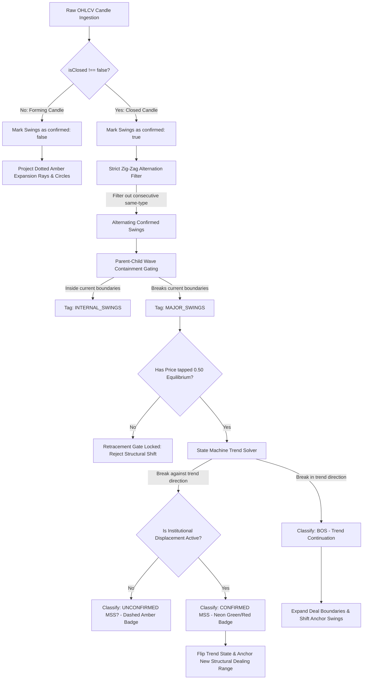

# 🏛️ Flow-State Market Structure Engine: Engineering Map & Logic Specification (V10.29)

This engineering document serves as the absolute mathematical and logical **Source of Truth** for the Flow-State Market Structure Engine. It defines the complete structural logic chain, moving chronologically from raw candlestick ingestion, through fractal validation and wave hierarchy state transitions, to the finalized Bloomberg-style visualization layers. Future AI Agents and human developers must adhere strictly to these rules to maintain zero-repainting stability, backtest-to-live parity, and algorithmic integrity.

---

## 🗺️ System-Wide Structural Pipeline



---

## 1. The 5-Bar Fractal Math (Foundational Anchors)

The foundation of all structural parsing relies on identifying local high and low points. Standard retail chart analysis suffers from "pennant bias" and subjective drawdowns; the Flow-State engine resolves this through a strict, high-fidelity 5-bar mathematical scan.

### 1.1 Strict Mathematical Scan
A candlestick at index $i$ is classified as a raw extreme if and only if it represents the absolute highest high or lowest low within a 5-candle window centered on $i$.

*   **Swing High (Peak) scan at index $i$:**
    $$h_i > h_{i-1} \quad \text{AND} \quad h_i > h_{i-2} \quad \text{AND} \quad h_i > h_{i+1} \quad \text{AND} \quad h_i > h_{i+2}$$
*   **Swing Low (Valley) scan at index $i$:**
    $$l_i < l_{i-1} \quad \text{AND} \quad l_i < l_{i-2} \quad \text{AND} \quad l_i < l_{i+1} \quad \text{AND} \quad l_i < l_{i+2}$$

### 1.2 Color-Lock Signature Validation
To prevent "Outside Bar" anomalies (where a single volatile candle forms a new high and low simultaneously, causing coordinate collapse), the engine enforces the **Institutional Color Lock** (§1 of the Quant Logic):
*   **Swing High Color Signature:**
    $$\text{Candle } i \text{ must be RED } (c_i < o_i) \quad \text{AND} \quad \text{Candle } i-1 \text{ must be GREEN } (c_{i-1} > o_{i-1})$$
*   **Swing Low Color Signature:**
    $$\text{Candle } i \text{ must be GREEN } (c_i > o_i) \quad \text{AND} \quad \text{Candle } i-1 \text{ must be RED } (c_{i-1} < o_{i-1})$$

Any raw fractal extreme that fails this color signature is instantly rejected as retail market-maker noise and is not allowed to anchor structural ranges.

### 1.3 The 2-Bar Confirmation Lag
A 5-bar fractal centered at index $i$ cannot be confirmed until the two subsequent candles (at indices $i+1$ and $i+2$) have fully closed.
*   **Unconfirmed State (Amber Circle):**
    When the current live-edge candle is at index $i+1$ or $i+2$, the candle at index $i$ is mathematically a candidate. Because these succeeding candles are still forming (`isClosed: false` or not yet printed), the swing is flagged as:
    ```typescript
    confirmed: false
    ```
    Visually, this is rendered as a dotted amber circle with a horizontal dotted ray projecting forward to warn developers of an "Active Price Expansion."
*   **Confirmed State (Neon Green / Rose Red):**
    Only when the candle at $i+2$ closes (`c.isClosed !== false`), the swing is transitioned to:
    ```typescript
    confirmed: true
    ```
    This flips the visual layer to a solid colored outline and stabilizes the mathematical coordinate.
*   **Anti-Repainting Imperative:**
    By locking the state machine, trend calculations, and dealing ranges strictly to `confirmed: true` swings, the engine achieves **0% repainting**. Live signals cannot flash and vanish on raw, open-candle wicks.

---

## 2. State Machine & Wave Hierarchy

Raw confirmed pivots are highly volatile. Without filtering, consecutive peaks and valley containment checks would produce unreadable visual noise. The engine routes swings through a two-stage filter.

### 2.1 Strict Zig-Zag Alternation Filter
The state machine mandates that all structural swing points must strictly alternate between peaks and valleys:
$$\text{HIGH} \leftrightarrow \text{LOW} \leftrightarrow \text{HIGH} \leftrightarrow \text{LOW}$$

If consecutive swings of the same type are detected, the engine executes a resolution check to discard the weaker extreme:
*   **Consecutive HIGHs:**
    If swing $S_n$ and $S_{n+1}$ are both `HIGH`, the engine compares their price values:
    $$\text{If } S_{n+1}.\text{price} > S_n.\text{price} \implies \text{Discard } S_n, \quad \text{Retain } S_{n+1}$$
    $$\text{If } S_{n+1}.\text{price} \le S_n.\text{price} \implies \text{Discard } S_{n+1}, \quad \text{Retain } S_n$$
*   **Consecutive LOWs:**
    If swing $S_n$ and $S_{n+1}$ are both `LOW`, the engine compares their price values:
    $$\text{If } S_{n+1}.\text{price} < S_n.\text{price} \implies \text{Discard } S_n, \quad \text{Retain } S_{n+1}$$
    $$\text{If } S_{n+1}.\text{price} \ge S_n.\text{price} \implies \text{Discard } S_{n+1}, \quad \text{Retain } S_n$$

This resolution ensures that only the absolute peak or absolute trough of an expansion move remains registered.

### 2.2 Parent-Child Wave Containment (Wave Hierarchy)
Once alternation is achieved, swings are classified hierarchically into **MAJOR** (Parent Dealing Range) or **INTERNAL** (Child Sub-Wave) waves based on boundary containment.

```
                    [MAJOR SWING HIGH] - Parent Range Ceiling
                           /\
                          /  \       [INTERNAL HIGH]
                         /    \            /\
                        /      \  ________/  \______ [INTERNAL LOW] (Tapped EQ, Rejected)
                       /        \/
                      /    [INTERNAL LOW]
                     /
  [MAJOR SWING LOW] / - Parent Range Floor
```

*   **Boundary Lock:**
    The active Major Range is bounded by the most recent validated alternating pivots:
    $$\text{Active Range Ceiling} = \text{currentMajorHigh}$$
    $$\text{Active Range Floor} = \text{currentMajorLow}$$
*   **Containment Rule:**
    Any confirmed swing $S$ whose price lies entirely within these active boundaries is tagged as an `INTERNAL` sub-wave:
    $$\text{If } S.\text{price} \ge \text{currentMajorLow} \quad \text{AND} \quad S.\text{price} \le \text{currentMajorHigh} \implies S.\text{structure\_type} = \text{'INTERNAL'}$$
*   **Boundary Expansion:**
    A swing is classified as `MAJOR` if and only if it breaches the current active boundaries:
    $$\text{If } S.\text{type} = \text{'HIGH'} \quad \text{AND} \quad S.\text{price} > \text{currentMajorHigh} \implies \text{New Ceiling Established}$$
    $$\text{If } S.\text{type} = \text{'LOW'} \quad \text{AND} \quad S.\text{price} < \text{currentMajorLow} \implies \text{New Floor Established}$$
*   **Trend & Range Isolation:**
    Only `MAJOR` swings can anchor the structural dealing range or trigger trend transitions inside `useStrategyEvaluator.ts`. Minor internal retracements (`INTERNAL`) are informational visual aids only.

---

## 3. Structural Shift Logic (BOS vs MSS)

Trend direction is not classified by simple, blind price motion. Upward breaks are not universally BOS, and downward breaks are not universally MSS. Labeling depends entirely on the **Contextual Trend State Machine**.

### 3.1 Contextual Trend State Machine
The engine maintains an active state variable:
$$\text{currentTrend} \in \{\text{'BULLISH'}, \text{'BEARISH'}, \text{'UNSET'}\}$$

When a new confirmed `MAJOR` swing breaches a prior boundary, the break is classified under strict contextual rules:

| Current Trend | Break Direction | Classification | State After Break | Action |
| :--- | :--- | :--- | :--- | :--- |
| **`BULLISH`** | Close above prior Swing High | **BOS** (Continuation) | `BULLISH` | Extend range upwards |
| **`BULLISH`** | Close below prior Swing Low | **MSS** (Reversal) | `BEARISH` | Flip Trend & Lock range |
| **`BEARISH`** | Close below prior Swing Low | **BOS** (Continuation) | `BEARISH` | Extend range downwards |
| **`BEARISH`** | Close above prior Swing High | **MSS** (Reversal) | `BULLISH` | Flip Trend & Lock range |

### 3.2 The Retracement Gate (0.50 Equilibrium Rule)
A Market Structure Shift (MSS) or Break of Structure (BOS) is **mathematically invalid** unless the price has first retraced to tap or exceed the 50% Equilibrium midline of the active dealing range:
$$\text{Tapped EQ} \iff \text{Price}_t \le \text{Equilibrium} \quad (\text{for Bullish Range})$$
$$\text{Tapped EQ} \iff \text{Price}_t \ge \text{Equilibrium} \quad (\text{for Bearish Range})$$

If price breaks out of the range without first tapping Equilibrium, it is flagged as a *Premature Expansion*. The old anchors remain locked, and the break is rejected.

### 3.3 MSS Displacement Gating (Soft Gate)
Reversals are dangerous due to retail trendline wicks. To protect capital, the engine gates MSS validations based on volume momentum at the exact breach index:

*   **Confirmed MSS (Vibrant Neon Green / Rose Red):**
    Triggered when a trend-reversing break occurs while `displacement_sponsorship` is **ACTIVE** (backed by heavy Taker Volume $\ge 2.0x$ the 14-period average, accompanied by rising Open Interest).
    *   *System Action:* Sets `market_structure_shift: true` inside the SWR payload, unlocking strategy execution triggers.
*   **Unconfirmed MSS (Dashed Amber):**
    Triggered when a trend-reversing break occurs while volume displacement is **INACTIVE** or in **CONSOLIDATION**.
    *   *System Action:* Renders the level as a dashed amber line with an `"MSS?"` badge. The strategy builder **vetoes and ignores** the setup.

---

## 4. The Pricing Matrix (EQU/Premium/Discount)

Once the structural dealing range is anchored on alternating Major swings, the engine maps the internal price spectrum.

```
  [MAJOR HIGH Anchor]  ====================================================== 1.0 (Premium Boundary)
                       |
                       |   PREMIUM ZONE  (Buys Vetoed / Sells Allowed)
                       |
  [Equilibrium Midline]------------------------------------------------------ 0.5 (Neutral Center)
                       |
                       |   DISCOUNT ZONE (Sells Vetoed / Buys Allowed)
                       |
  [MAJOR LOW Anchor]   ====================================================== 0.0 (Discount Boundary)
```

### 4.1 Equilibrium Calculation
The Equilibrium level represents the exact mathematical midpoint of the active range:
$$\text{Equilibrium} = \frac{\text{dealingRange.high} + \text{dealingRange.low}}{2}$$

### 4.2 LOCAL_PRICING Derivation
The current live tick price is cross-referenced with the active dealing range to establish the local pricing premium status:
$$\text{LOCAL\_PRICING} = \begin{cases} 
\text{'PREMIUM'} & \text{if } \text{price}_{\text{live}} > \text{Equilibrium} \\
\text{'DISCOUNT'} & \text{if } \text{price}_{\text{live}} < \text{Equilibrium} \\
\text{'EQUILIBRIUM'} & \text{if } \text{price}_{\text{live}} = \text{Equilibrium} 
\end{cases}$$

### 4.3 The Strategy Veto Gate (IPDA Core Doctrine)
To prevent buying the ceiling of ranges or selling the floor, the engine implements a strict strategy veto gate. Custom strategies evaluate inputs against both Macro Day Open (`true_day_open_0700`) and the Local Pricing Matrix:

*   🟢 **BUYS are STRICTLY LOCKED (Vetoed) if:**
    $$\text{Price} > \text{true\_day\_open\_0700} \quad \text{AND} \quad \text{LOCAL\_PRICING} = \text{'PREMIUM'}$$
*   🔴 **SELLS are STRICTLY LOCKED (Vetoed) if:**
    $$\text{Price} < \text{true\_day\_open\_0700} \quad \text{AND} \quad \text{LOCAL\_PRICING} = \text{'DISCOUNT'}$$

*   **The Runaway Market Override Exception:**
    If the engine enters `RUNAWAY` expansion mode (sequential unmitigated FVGs $\ge 2$ and volume displacement $\ge 4.0x$), custom strategies with `momentum_override` activated bypass the veto gate. This allows taking sponsored breakout entries in Premium (for longs) or Discount (for shorts) because of high velocity momentum.

---

## 5. Backtest Replay Symmetry

To guarantee that historical backtests yield 100% identical results to live execution, the replay engine (`useBacktestEngine.ts`) emulates the live-edge candle physics exactly.

### 5.1 Preventing Look-Ahead Bias
In live trading, the current candle is always forming and its final close values are unknown. During historical replays, however, all future candles are already stored in memory. If the scanning engine is allowed to read future candles, it will identify 5-bar fractals early, creating "ghost wins" that cannot be executed in live conditions.

### 5.2 The `isClosed` Emulation Gate
Inside `buildEnrichedPayload`, the replay engine slices the historical candle array up to the current replayed step index $k$:
*   **Historical Candles ($0 \le i < k$):**
    Flagged as fully closed:
    ```typescript
    candles[i].isClosed = true
    ```
*   **Active Live-Edge Candle ($i = k$):**
    Forcefully flagged as open/forming:
    ```typescript
    candles[k].isClosed = false
    ```

When `runEquilibriumStateMachine` runs, the `isCandleClosed(idx)` safety check evaluates candle status:
```typescript
const isCandleClosed = (idx: number): boolean => {
  if (idx < 0 || idx >= candles.length) return false;
  return candles[idx].isClosed !== false;
};
```
*   **Result:** A potential 5-bar fractal at index $k-2$ will check if the subsequent candles at $k-1$ and $k$ are closed. Because $k$ is flagged as `isClosed: false`, the confirmation check fails. The swing point remains in an amber `confirmed: false` state, successfully emulating the live-edge 2-bar lag buffer. Repainting and forward-looking triggers are completely eliminated from backtests.

---

## 6. Technical Payload & Visual Mappings

### 6.1 JSON Payload Specifications

#### A. Confirmed Major Swing
```json
{
  "t": 1774872000000,
  "price": 3482.50,
  "type": "HIGH",
  "grade": "MAJOR",
  "colorValidated": true,
  "candle_index": 242,
  "timestamp": "2026-05-28T09:00:00.000Z",
  "structure_type": "MAJOR",
  "confirmed": true
}
```

#### B. Unconfirmed Expansion Swing
```json
{
  "t": 1774882800000,
  "price": 3512.75,
  "type": "HIGH",
  "grade": "MAJOR",
  "colorValidated": true,
  "candle_index": 254,
  "timestamp": "2026-05-28T12:00:00.000Z",
  "structure_type": "MAJOR",
  "confirmed": false
}
```

#### C. Local Dealing Range Object
```json
{
  "high": 3482.50,
  "low": 3310.25,
  "equilibrium": 3396.38,
  "current_status": "PREMIUM",
  "anchor_high_swing": {
    "t": 1774872000000,
    "price": 3482.50,
    "type": "HIGH",
    "grade": "MAJOR",
    "colorValidated": true,
    "confirmed": true
  },
  "anchor_low_swing": {
    "t": 1774857600000,
    "price": 3310.25,
    "type": "LOW",
    "grade": "MAJOR",
    "colorValidated": true,
    "confirmed": true
  }
}
```

---

### 6.2 SVG Visual Mapping Rules
All visual parameters are rendered on a hardware-accelerated SVG layer positioned above the chart. They adapt dynamically to theme settings SWR configurations.

| Element | SVGAccess / Tag | Color Setting (Dark Mode) | Color Setting (Light Mode) | Stroke / Weight | Dash Pattern | Termination Rule |
| :--- | :--- | :--- | :--- | :--- | :--- | :--- |
| **Confirmed Ceiling** | `<line>` | `themeSettings.dark_chart_swing_high` or `rgba(239, 68, 68, 0.85)` (Red) | `themeSettings.light_chart_swing_high` or `rgba(225, 29, 72, 0.85)` | `1.5px` | Solid | Terminates at the timestamp of the first confirmed swing that breaches it; else extends to the right edge. |
| **Confirmed Floor** | `<line>` | `themeSettings.dark_chart_swing_low` or `rgba(80, 255, 175, 0.85)` (Green) | `themeSettings.light_chart_swing_low` or `rgba(5, 150, 105, 0.85)` | `1.5px` | Solid | Terminates at the timestamp of the first confirmed swing that breaches it; else extends to the right edge. |
| **Internal Ceiling** | `<line>` | `themeSettings.dark_chart_swing_high_internal` or `rgba(239, 68, 68, 0.45)` | `themeSettings.light_chart_swing_high_internal` or `rgba(225, 29, 72, 0.45)` | `0.9px` | `strokeDasharray: '3,3'` | Contained swing ceiling. Terminates at first breach or right edge. |
| **Internal Floor** | `<line>` | `themeSettings.dark_chart_swing_low_internal` or `rgba(80, 255, 175, 0.45)` | `themeSettings.light_chart_swing_low_internal` or `rgba(5, 150, 105, 0.45)` | `0.9px` | `strokeDasharray: '3,3'` | Contained swing floor. Terminates at first breach or right edge. |
| **Equilibrium Mid** | `<line>` | `rgba(255, 255, 255, 0.25)` | `rgba(0, 0, 0, 0.25)` | `1.0px` | `strokeDasharray: '4,4'` | Spans horizontally across the active Dealing Range. |
| **Shadow Box** | `<rect>` | Green mix (`rgba(80, 255, 175, 0.04)`) for Bullish; Red mix (`rgba(239, 68, 68, 0.04)`) for Bearish. | Same low-opacity mix. | None | Solid fill | Spans vertically from floor to ceiling, horizontally from oldest anchor to current candle. |
| **Expansion Ray** | `<line>` | `rgba(251, 191, 36, 0.65)` (Amber Warning) | `rgba(217, 119, 6, 0.65)` | `1.0px` | `strokeDasharray: '2,3'` | Projects from the unconfirmed swing to the current candle. |
| **Major Swing Dot** | `<circle>` | Matches Ceiling/Floor colors (Red/Green). Amber for unconfirmed. | Matches Ceiling/Floor. | `1.5px` (solid); `1.2px` (dashed) | None for confirmed; `2,2` for unconfirmed | Centered at swing extreme, radius `4.5px`. |
| **Inner Swing Dot** | `<polygon>` | `themeSettings.dark_accent` or `#a855f7` (Purple) | `themeSettings.light_accent` or `#4f46e5` | `1.0px` | Solid diamond shape | Diamond coordinates centered at swing extreme, radius `3.5px`. |
| **BOS Badge** | `<g>` rect + text | `themeSettings.dark_chart_bos` or `rgba(168, 85, 247, 0.85)` (Purple) | `themeSettings.light_chart_bos` or `rgba(79, 70, 229, 0.85)` | `0.5px` border | Solid badge | Positioned at breach timestamp, offset `12px` above/below the broken level. |
| **MSS Badge** | `<g>` rect + text | `themeSettings.dark_chart_mss` or `rgba(80, 255, 175, 0.85)` (Green) | `themeSettings.light_chart_mss` or `rgba(5, 150, 105, 0.85)` | `0.5px` border | Solid badge | Positioned at breach timestamp, offset `12px` above/below the broken level. |

---

## 7. Execution Scenarios

### Scenario A: A Bullish Continuation (BOS)
The asset is in an established bullish trend, consolidates within a Dealing Range, and subsequently breaks out to print a Break of Structure (BOS).

#### 1. Initial State
*   `currentTrend` = `BULLISH`
*   `dealingRange` = `{ high: 150.00, low: 100.00, equilibrium: 125.00 }`
*   Last High Anchor: $150.00$ at index $i=100$.
*   Last Low Anchor: $100.00$ at index $i=120$.

#### 2. Price Action Step-by-Step
1.  **Equilibrium Tap:**
    Price retraces from $145.00$ down to $120.00$ (taps the $125.00$ Equilibrium midline into the Discount Zone). The Retracement Gate is now **UNLOCKED**.
2.  **Expansion Leg:**
    Price bounces from $120.00$ and rallies aggressively, breaking above the active range ceiling of $150.00$ to print a local high at $155.00$ (candle index $i=140$).
3.  **Validation Buffer:**
    The engine waits for candles $i=141$ and $i=142$ to close. During this lag, the high at $155.00$ is flagged as `confirmed: false`, rendering as an amber circle with a dotted expansion ray.
4.  **Confirmation:**
    Candle $i=142$ closes. The high at $155.00$ is now `confirmed: true`.
5.  **Classification Scan:**
    The engine detects that a confirmed high of $155.00$ has breached the prior confirmed High Anchor of $150.00$.
    *   *Condition Check:* Since `currentTrend` is `BULLISH` and the break is in the upward direction, the segment is classified as a **BOS**.
6.  **State Transition:**
    *   `currentTrend` remains `BULLISH`.
    *   The prior ceiling line at $150.00$ is terminated precisely at the timestamp of candle $140$.
    *   A purple horizontal badge labeled `"BOS"` is rendered at index $140$, offset $12\text{px}$ above the $150.00$ level.
    *   The Dealing Range shifts to anchor the new High at $155.00$:
        $$\text{New Range} = \{ \text{high}: 155.00, \text{low}: 120.00, \text{equilibrium}: 137.50 \}$$

---

### Scenario B: A Bearish Trend Reversal (MSS)
The asset is in an established bullish trend, reaches a local top, and violently breaks down past the local floor to print a Market Structure Shift (MSS).

#### 1. Initial State
*   `currentTrend` = `BULLISH`
*   `dealingRange` = `{ high: 200.00, low: 160.00, equilibrium: 180.00 }`
*   Last High Anchor: $200.00$ at index $i=50$.
*   Last Low Anchor: $160.00$ at index $i=70$.

#### 2. Price Action Step-by-Step
1.  **Equilibrium Tap:**
    Price retraces from $195.00$ down to $175.00$ (taps the $180.00$ Equilibrium midline into the Discount Zone). The Retracement Gate is now **UNLOCKED**.
2.  **Breakout Leg:**
    Price fails to expand above $200.00$. Institutional sellers step in, creating a violent downward displacement leg that drives the price down to break below the active floor of $160.00$, printing a local low at $150.00$ (index $i=90$).
3.  **Displacement Scanning:**
    At index $90$, the 14-period rolling volume average check detects that the volume displacement multiplier is active:
    $$\text{Taker Sell Volume} \ge 2.5 \times \text{Average Buy/Sell Volume} \implies \text{displacement\_sponsorship} = \text{'ACTIVE'}$$
4.  **Validation Buffer:**
    The engine waits for candles $i=91$ and $i=92$ to close. The low at $150.00$ remains unconfirmed (`confirmed: false`), rendering as an amber circle with a dotted horizontal expansion ray.
5.  **Confirmation:**
    Candle $i=92$ closes. The low at $150.00$ is now `confirmed: true`.
6.  **Classification Scan:**
    The engine detects that a confirmed low of $150.00$ has breached the prior confirmed Low Anchor of $160.00$.
    *   *Condition Check:* Since `currentTrend` was `BULLISH` and the break is in the downward direction (against the trend), the segment is classified as a **Market Structure Shift (MSS)**.
    *   *Displacement Check:* Since `displacement_sponsorship` is `ACTIVE`, the MSS is flagged as **displacementConfirmed: true**.
7.  **State Transition:**
    *   `currentTrend` is flipped to **`BEARISH`** inside the state machine core.
    *   The prior floor line at $160.00$ is terminated precisely at the timestamp of candle $90$.
    *   An emerald-green horizontal badge labeled `"MSS"` is rendered at index $90$, offset $12\text{px}$ below the $160.00$ level.
    *   `market_structure_shift` inside the SWR metrics payload is set to `true`, and `market_structure_shift_direction` is set to `'BEARISH'`.
    *   A new Bearish Structural Dealing Range is established, anchored by the High at $195.00$ (the swing high prior to the break) and the new Low at $150.00$:
        $$\text{New Range} = \{ \text{high}: 195.00, \text{low}: 150.00, \text{equilibrium}: 172.50 \}$$
    *   Any custom strategy waiting for a Bearish Shift on SWR is instantly cleared to execute Sell/Short entries on subsequent retracements into Premium.
