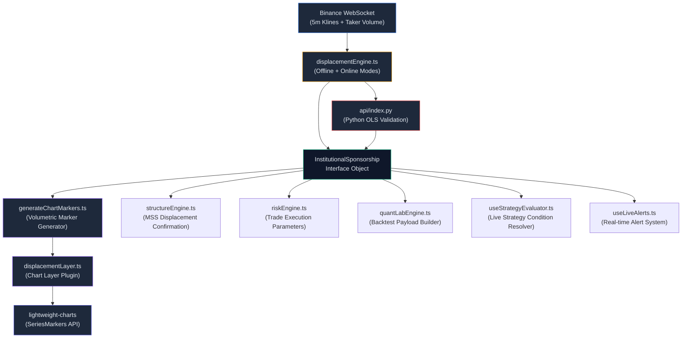
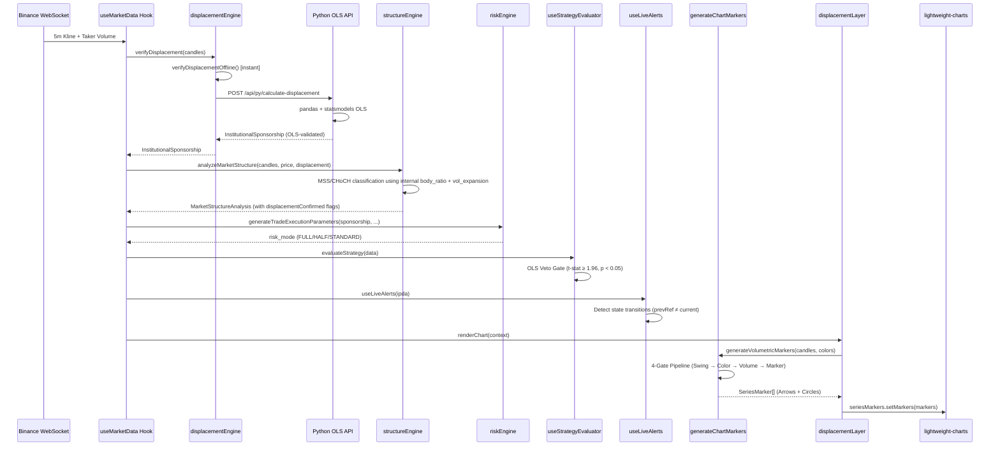

# 📊 SYSTEM DOCUMENTATION: Volumetric Sponsorship

> **Version:** V11.1 · **Engine:** Flow-State Quant Engine  
> **Last Updated:** 2026-06-06  
> **Canonical Source Files:**  
> [`displacementEngine.ts`](file:///c:/My%20Files/Work/Lab/Gem_Charts_Data/src/lib/displacementEngine.ts) · [`generateChartMarkers.ts`](file:///c:/My%20Files/Work/Lab/Gem_Charts_Data/src/utils/generateChartMarkers.ts) · [`displacementLayer.ts`](file:///c:/My%20Files/Work/Lab/Gem_Charts_Data/src/lib/chartLayers/plugins/displacementLayer.ts) · [`api/index.py`](file:///c:/My%20Files/Work/Lab/Gem_Charts_Data/api/index.py)

---

## Table of Contents

1. [Conceptual Overview](#1-conceptual-overview)
2. [System Architecture](#2-system-architecture)
3. [The Displacement Engine — Institutional Sponsorship Detection](#3-the-displacement-engine)
4. [The Volumetric Marker Generator — Arrows & Circles](#4-the-volumetric-marker-generator)
5. [Visual Rendering Pipeline — The Displacement Layer](#5-visual-rendering-pipeline)
6. [The Python OLS Statistical Validation Backend](#6-the-python-ols-statistical-validation-backend)
7. [Downstream Consumers — Risk, Structure, Strategy](#7-downstream-consumers)
8. [Full Data Flow Diagram](#8-full-data-flow-diagram)
9. [Appendix: Constants, Thresholds & Calibration](#9-appendix)

---

## 1. Conceptual Overview

Volumetric Sponsorship is the engine's mechanism for detecting **institutional displacement** — moments when Smart Money actors aggressively commit directional capital, creating anomalous volume signatures that distinguish genuine trend moves from retail noise.

The system expresses two fundamentally different signal classes on the chart:

| Visual | Shape | Meaning | Mathematical Gate |
|--------|-------|---------|-------------------|
| **▲ / ▼ Arrow** | `arrowUp` / `arrowDown` | **Institutional Sponsorship** — Directional volume (body-weighted) increased vs. the prior candle at a structural swing point | `dirVolMid > dirVolPrev` |
| **● Circle** | `circle` | **SMT Trap / Sweep** — Raw volume increased but directional conviction did NOT. Suggests a liquidity grab without institutional follow-through | `rawVol↑` but `dirVol↓` |

> [!IMPORTANT]
> The Arrow is the **only** visual signal that confirms institutional commitment. A Circle warns of a potential trap where volume expanded without proportional body displacement — a hallmark of engineered liquidity sweeps.

---

## 2. System Architecture

The Volumetric Sponsorship system spans **four architectural layers**, from raw market data to rendered chart pixels:



### 2.1 Layer Definitions

| Layer | File | Responsibility |
|-------|------|----------------|
| **L1 — Detection** | `displacementEngine.ts` | Computes `InstitutionalSponsorship` from raw candle + taker volume data |
| **L2 — Statistical Validation** | `api/index.py` | OLS regression via `statsmodels` to validate displacement significance |
| **L3 — Visual Generation** | `generateChartMarkers.ts` | Produces Arrow/Circle markers from candle geometry + volume math |
| **L4 — Chart Rendering** | `displacementLayer.ts` | Plugs markers into `lightweight-charts` SeriesMarkers API |

---

## 3. The Displacement Engine

> **Source:** [`displacementEngine.ts`](file:///c:/My%20Files/Work/Lab/Gem_Charts_Data/src/lib/displacementEngine.ts)

### 3.1 The `InstitutionalSponsorship` Interface

```typescript
export interface InstitutionalSponsorship {
  status: 'ACTIVE_BULLISH' | 'ACTIVE_BEARISH' | 'INACTIVE' | 'CONSOLIDATION';
  anomaly_multiplier: number;
  volume_delta: number;
  statistical_validation: {
    t_statistic: number;
    p_value: number;
    confidence_level: 'HIGH' | 'MEDIUM' | 'LOW';
    confidence_interval_95: boolean | 'CONSOLIDATION';
    confidence_interval_95_strict?: boolean | 'CONSOLIDATION';
  };
}
```

This interface is the **single source of truth** for displacement state across the entire engine. Every downstream consumer (risk, structure, strategy, alerts) reads this exact shape.

### 3.2 Offline Detection Algorithm — `verifyDisplacementOffline()`

The offline engine runs entirely in TypeScript with zero external dependencies. It executes on every candle update cycle.

#### Input Requirements

- **Minimum candles:** 16 (14 for rolling average + 1 latest closed + 1 current open)
- **Required fields per candle:** `t`, `o`, `h`, `l`, `c`, `taker_buy_vol`, `taker_sell_vol`

#### Step-by-Step Algorithm

**Step 1 — Volatility Filter (Consolidation Gate)**

```
minPrice = min(candles[*].l)
maxPrice = max(candles[*].h)
volatilityRange = (maxPrice - minPrice) / (minPrice + 1e-9)

IF volatilityRange < 0.001 → status = 'CONSOLIDATION'
```

> [!NOTE]
> The `1e-9` epsilon prevents division-by-zero on zero-priced assets. The 0.1% threshold was empirically calibrated against ETH/USDC 5-minute data to filter out noise-dominated micro-ranges.

**Step 2 — Identify Latest Closed Candle**

```
latestClosed = candles[length - 2]  // Binance's last candle is OPEN (incomplete)
prior14 = candles[length-16 .. length-2]  // 14-candle lookback window
```

> [!CAUTION]
> The `-2` index offset is critical. Binance WebSocket Kline data always includes the **currently forming** candle as the last element. Using `length - 1` would calculate displacement against incomplete (still-accumulating) volume data, producing false positives.

**Step 3 — Rolling Volume Averages**

```
avgBuyVol  = Σ(prior14[*].taker_buy_vol) / 14
avgSellVol = Σ(prior14[*].taker_sell_vol) / 14
```

**Step 4 — Directional Classification + Anomaly Detection**

```
isBullish = latestClosed.c > latestClosed.o  (green candle)
isBearish = latestClosed.c < latestClosed.o  (red candle)

volMultiplier = 2.0 (ETH) | 2.5 (non-ETH)

IF NOT consolidation:
  IF isBullish AND latestBuyVol > (avgBuyVol × volMultiplier):
    status = 'ACTIVE_BULLISH'
    anomaly_multiplier = latestBuyVol / avgBuyVol
    
  ELSE IF isBearish AND latestSellVol > (avgSellVol × volMultiplier):
    status = 'ACTIVE_BEARISH'
    anomaly_multiplier = latestSellVol / avgSellVol
```

#### Volume Delta

```
volume_delta = latestBuyVol - latestSellVol
```

A positive delta indicates net buying pressure; negative indicates net selling pressure.

### 3.3 The Volume Multiplier Calibration

| Symbol Class | Multiplier | Rationale |
|-------------|------------|-----------|
| ETH pairs | **2.0×** | ETH/USDC 5m candles concentrate higher taker volume per bar; 2× threshold avoids over-filtering legitimate displacement |
| Non-ETH pairs | **2.5×** | Other symbols have lower per-bar volume density; 2.5× filters out normal fluctuation more aggressively |

The multiplier means: the latest closed candle's directional taker volume must exceed **2× to 2.5× the 14-bar rolling average** to qualify as institutional displacement.

### 3.4 Online Detection — `verifyDisplacement()` (Async + Python)

The online path wraps the offline engine with a fallback to the Python OLS backend:

```
1. Compute offline result (instant, always available)
2. POST candles to /api/py/calculate-displacement (1.2s timeout)
3. IF Python response OK → return OLS-validated result
4. ELSE → return offline result (graceful degradation)
```

> [!TIP]
> The 1.2-second `AbortController` timeout ensures the UI never blocks on the Python microservice. In production on Vercel, the Python endpoint runs as a Serverless Function with cold-start overhead; the offline engine provides instant fallback.

---

## 4. The Volumetric Marker Generator — Arrows & Circles

> **Source:** [`generateChartMarkers.ts`](file:///c:/My%20Files/Work/Lab/Gem_Charts_Data/src/utils/generateChartMarkers.ts)

This is the **visual classification engine** that determines whether a candle swing earns an Arrow (institutional) or a Circle (trap/sweep). It operates on pure candle geometry — completely independent from the `InstitutionalSponsorship` interface.

### 4.1 Input Interface

```typescript
interface MarkerCandle {
  t: number;  // Unix timestamp
  o: number;  // Open
  h: number;  // High
  l: number;  // Low
  c: number;  // Close
  v: number;  // Total volume
  volumetric_signal?: 'ARROW_UP' | 'ARROW_DOWN' | 'CIRCLE_UP' | 'CIRCLE_DOWN' | null; // Pre-calculated signal
}

interface MarkerColors {
  sponsorshipColor: string;     // Arrow color (theme-adaptive)
  bullishSweepColor: string;    // Bullish circle color
  bearishSweepColor: string;    // Bearish circle color
}
```

> [!NOTE]
> The `volumetric_signal` key is pre-calculated on the backend API handler (`/api/market-data`) and within the Backtest Replay day-loader (`useBacktestEngine.ts`) via the generic annotator `annotateCandlesWithVolumetricSignals()`. This allows downstream consumers (like backtest snapshot exports and external scripts) to read the active marker state directly from the candle JSON without repeating the sliding-window geometry math.


### 4.2 The 4-Gate Classification Pipeline

The generator iterates through candles with a sliding 3-candle window `[prev, mid, curr]` starting at index `i = 2`. Each candle must pass **all four gates** sequentially:

---

#### GATE 1 — Structural Swing Check

```
isSwingLow  = mid.l < prev.l  AND  mid.l < curr.l
isSwingHigh = mid.h > prev.h  AND  mid.h > curr.h

IF NOT (isSwingLow OR isSwingHigh) → SKIP candle
```

This is a **3-bar fractal** detection. The middle candle must form a local extremum relative to both neighbors. This gate eliminates ~80-90% of candles from further processing.

```
         ┌──┐
    ┌──┐ │  │ ┌──┐
    │  │ │  │ │  │         ← Swing HIGH: mid.h > prev.h AND mid.h > curr.h
    └──┘ │  │ └──┘
         └──┘
         prev mid  curr

    ┌──┐         ┌──┐
    │  │ ┌──┐    │  │
    │  │ │  │    │  │      ← Swing LOW: mid.l < prev.l AND mid.l < curr.l
    └──┘ │  │    └──┘
         └──┘
         prev mid  curr
```

---

#### GATE 2 — Directional Shift Check (Color Lock)

```
isMidBullish  = mid.c > mid.o    (green candle)
isMidBearish  = mid.c < mid.o    (red candle)
isPrevBullish = prev.c > prev.o  (green candle)
isPrevBearish = prev.c < prev.o  (red candle)

isValidBullishShift = isSwingLow  AND isMidBullish AND isPrevBearish
isValidBearishShift = isSwingHigh AND isMidBearish AND isPrevBullish

IF NOT (isValidBullishShift OR isValidBearishShift) → SKIP candle
```

This implements the **Institutional Color Lock** doctrine from `03_quant_logic.md §1`:

- A bullish reversal swing requires a **red→green** color transition at a swing low
- A bearish reversal swing requires a **green→red** color transition at a swing high

This filter eliminates trend-continuation swings that lack the opposing candle signature, ensuring only **counter-trend reversals** with proper institutional color validation receive markers.

```
  VALID Bullish Shift:           VALID Bearish Shift:
  
  ┌──────┐                              ┌──────┐
  │ RED  │  ┌──────┐            ┌──────┐│ RED  │
  │ prev │  │GREEN │            │GREEN ││ mid  │
  └──────┘  │ mid  │            │ prev │└──────┘
            └──────┘            └──────┘
  
  ✓ Swing Low + Red→Green      ✓ Swing High + Green→Red
```

---

#### GATE 3 — Volumetric Calculations (The Core Mathematics)

This gate computes two parallel volume metrics and compares them between the `prev` and `mid` candles:

##### 3A — Body Ratio (Directional Conviction Coefficient)

```
bodyRatioMid  = |mid.c  - mid.o|  / (mid.h  - mid.l)     if (mid.h  ≠ mid.l)  else 0
bodyRatioPrev = |prev.c - prev.o| / (prev.h - prev.l)     if (prev.h ≠ prev.l) else 0
```

The **Body Ratio** measures what fraction of the candle's total range was committed directionally (body vs. total wick range). Values:
- `1.0` = Marubozu (no wicks) — maximum directional conviction
- `0.5` = Body occupies half the range — moderate conviction  
- `0.0` = Doji (open ≈ close) — zero directional conviction

##### 3B — Directional Volume (Body-Weighted Volume)

```
dirVolMid  = mid.v  × bodyRatioMid
dirVolPrev = prev.v × bodyRatioPrev
```

**Directional Volume** weights raw volume by the candle's body ratio. This is the engine's key insight: a candle with 1000 volume and a 90% body ratio commits `900` units directionally, while a candle with 1500 volume and a 30% body ratio only commits `450` units directionally — **despite having more raw volume**.

##### 3C — Raw Volume Comparison

```
isRawVolIncrease = mid.v > prev.v
isDirVolIncrease = dirVolMid > dirVolPrev
```

These two booleans create the **2×2 classification matrix** that determines the visual marker:

| `isDirVolIncrease` | `isRawVolIncrease` | Result | Visual |
|---|---|---|---|
| ✅ `true` | ✅ `true` | **Institutional Sponsorship** | **▲ / ▼ Arrow** |
| ✅ `true` | ❌ `false` | **Institutional Sponsorship** | **▲ / ▼ Arrow** |
| ❌ `false` | ✅ `true` | **SMT Trap / Sweep** | **● Circle** |
| ❌ `false` | ❌ `false` | No signal | *nothing rendered* |

> [!IMPORTANT]
> **The Arrow gate (`isDirVolIncrease`) is dominant.** If directional volume increased — regardless of whether raw volume increased or decreased — the signal is always an Arrow. The Circle is produced ONLY when raw volume expanded but directional conviction dropped, which is the mathematical signature of a **liquidity sweep without institutional follow-through**.

---

#### GATE 4 — Marker Generation

```
markerTime = mid.t > 10 digits ? floor(mid.t / 1000) : mid.t  // ms→s normalization

IF isDirVolIncrease:
  → Arrow marker:
    shape:    'arrowUp' (bullish) | 'arrowDown' (bearish)
    position: 'belowBar' (bullish) | 'aboveBar' (bearish)
    color:    sponsorshipColor (theme-adaptive neutral)

ELSE IF isRawVolIncrease:
  → Circle marker:
    shape:    'circle'
    position: 'belowBar' (bullish) | 'aboveBar' (bearish)
    color:    bullishSweepColor (green tint) | bearishSweepColor (red tint)
```

### 4.3 The Mathematical Intuition — Why Body-Weighting Matters

Consider two scenarios at a swing low:

**Scenario A — Institutional Displacement (Arrow):**
```
prev: O=100, C=98, H=101, L=97.5, V=500  → bodyRatio = |98-100|/|101-97.5| = 0.571 → dirVol = 285.7
mid:  O=97,  C=100, H=100.5, L=96.8, V=480  → bodyRatio = |100-97|/|100.5-96.8| = 0.811 → dirVol = 389.2

isDirVolIncrease = 389.2 > 285.7 = TRUE → ▲ ARROW
```
Despite LOWER raw volume (480 < 500), the mid candle commits MORE volume directionally. This is the hallmark of Smart Money — efficient, high-conviction deployment.

**Scenario B — Liquidity Sweep (Circle):**
```
prev: O=100, C=98, H=101, L=97.5, V=500  → bodyRatio = 0.571 → dirVol = 285.7
mid:  O=97,  C=97.5, H=100, L=96, V=700  → bodyRatio = |97.5-97|/|100-96| = 0.125 → dirVol = 87.5

isRawVolIncrease = 700 > 500 = TRUE
isDirVolIncrease = 87.5 > 285.7 = FALSE → ● CIRCLE
```
Much MORE raw volume (700 vs 500), but the candle has massive wicks and a tiny body — the volume was absorbed by counter-parties. This is the mathematical fingerprint of a **stop hunt**: retail stops triggered, volume surged, but no institutional actor committed directionally.

---

## 5. Visual Rendering Pipeline — The Displacement Layer

> **Source:** [`displacementLayer.ts`](file:///c:/My%20Files/Work/Lab/Gem_Charts_Data/src/lib/chartLayers/plugins/displacementLayer.ts)

### 5.1 Layer Registration

```typescript
export const displacementLayer: ChartLayer = {
  id: 'displacement',
  name: 'Displacement Signals',
  description: 'MSS, Institutional Sponsorship, and SMT divergence markers',
  icon: 'TrendingUp',
  // ...
};
```

The layer implements the `ChartLayer` interface from the plugin architecture ([`types.ts`](file:///c:/My%20Files/Work/Lab/Gem_Charts_Data/src/lib/chartLayers/types.ts)), exposing `renderChart()` and `clearChart()` lifecycle hooks.

### 5.2 Theme-Adaptive Color Resolution

The marker colors are dynamically resolved from the user's Appearance Studio theme settings:

```typescript
// Arrow color — matches primary text color for maximum contrast
const sponsorshipColor = theme === 'dark'
  ? (themeSettings?.dark_text_title || '#ffffff')      // White on dark
  : (themeSettings?.light_text_title || '#020617');     // Near-black on light

// Bullish circle — swing low accent color
const bullishSweepColor = theme === 'dark'
  ? (themeSettings?.dark_chart_swing_low || '#50ffaf')  // Mint green
  : (themeSettings?.light_chart_swing_low || '#059669'); // Emerald

// Bearish circle — swing high accent color
const bearishSweepColor = theme === 'dark'
  ? (themeSettings?.dark_chart_swing_high || '#ffb4ab')  // Salmon
  : (themeSettings?.light_chart_swing_high || '#e11d48'); // Rose
```

### 5.3 Color Design Rationale

| Marker | Color Source | Design Intent |
|--------|------------|---------------|
| **Arrow** | `text_title` (neutral) | Arrows represent **confirmed institutional commitment** — they use the strongest contrast color (white/black) to signal authority and certainty |
| **Bullish Circle** | `chart_swing_low` (green) | Circles at swing lows use the same green as the structural swing dots, creating visual cohesion — "something happened here, but it's NOT confirmed" |
| **Bearish Circle** | `chart_swing_high` (red) | Same principle: visual cohesion with the bearish structural elements |

> [!TIP]
> The Arrow's neutral color is intentional — it does NOT signal direction through color. Direction is communicated purely through **position** (above/below bar) and **shape** (arrowUp/arrowDown). This prevents visual confusion with the directional Circle colors.

### 5.4 Rendering Execution

```typescript
renderChart(context) {
  const { seriesMarkers, activeCandles, theme, themeSettings, storage } = context;

  // 1. Sort candles chronologically (lightweight-charts requires sorted markers)
  const sortedData = [...activeCandles].sort((a, b) => a.t - b.t);

  // 2. Generate markers through the volumetric pipeline
  const markers = generateVolumetricMarkers(sortedData, { ...colors });

  // 3. Push to lightweight-charts SeriesMarkers plugin
  seriesMarkers.setMarkers(markers);
  storage.set('hasMarkers', true);
}
```

### 5.5 Cleanup Protocol

```typescript
clearChart(context) {
  const { seriesMarkers, storage } = context;
  if (seriesMarkers && storage.get('hasMarkers')) {
    seriesMarkers.setMarkers([]);
    storage.delete('hasMarkers');
  }
}
```

The `storage` map tracks whether markers were applied, preventing unnecessary `setMarkers([])` calls on layers that were never rendered.

---

## 6. The Python OLS Statistical Validation Backend

> **Source:** [`api/index.py`](file:///c:/My%20Files/Work/Lab/Gem_Charts_Data/api/index.py)

### 6.1 Purpose

The Python backend provides **statistical validation** of displacement events using Ordinary Least Squares (OLS) regression via `statsmodels`. It answers the question: *"Is the anomaly multiplier a statistically significant predictor of future returns?"*

### 6.2 OLS Model Specification

```
y = future_return (1-candle forward % change)
X = [anomaly_multiplier, volume_delta, is_dead_zone] + constant

Model: y ~ β₀ + β₁·anomaly_multiplier + β₂·volume_delta + β₃·is_dead_zone + ε
```

#### Feature Engineering

| Feature | Formula | Purpose |
|---------|---------|---------|
| `volume_delta` | `taker_buy_vol - taker_sell_vol` | Net buying/selling pressure |
| `rolling_vol_14` | `SMA(volume, 14)` | Baseline volume reference |
| `anomaly_multiplier` | `volume / (rolling_vol_14 + 1e-5)` | How many standard volumes above normal |
| `is_dead_zone` | `hour=12 OR (hour=13 AND min≤30)` NY time | NY Lunch session flag |
| `future_return` | `pct_change(close).shift(-1)` | 1-candle forward return (OLS target) |

#### Regression Window

```
reg_df = df.iloc[14:-1]  // Drop first 14 (rolling warmup) + last 1 (incomplete future return)
Minimum rows: 10 (below this, OLS is skipped → defaults to LOW confidence)
```

### 6.3 Statistical Validation Thresholds

The OLS output produces `t_statistic` and `p_value` for the `anomaly_multiplier` coefficient:

| Confidence Level | p-value Threshold | Meaning |
|---|---|---|
| **HIGH** | `p < 0.05` | Anomaly multiplier is a statistically significant predictor at 95% confidence |
| **MEDIUM** | `0.05 ≤ p < 0.15` | Borderline significance — use with caution |
| **LOW** | `p ≥ 0.15` | No statistical evidence that volume anomaly predicts returns |

#### Confidence Interval Flags

```python
# Standard gate (backward compatible)
confidence_interval_95 = (p_value < 0.15) AND (t_statistic > 1.96)

# Strict gate (used by STRICT sensitivity mode)
confidence_interval_95_strict = (p_value < 0.05) AND (t_statistic > 1.96)
```

### 6.4 Consolidation Short-Circuit

```python
if is_consolidation:
    t_statistic = 0.0
    p_value = 1.0
    confidence_interval_95 = "CONSOLIDATION"
    confidence_interval_95_strict = "CONSOLIDATION"
```

When the volatility range is below 0.1%, OLS is bypassed entirely. Low-volatility environments produce singular/near-collinear design matrices that generate unreliable statistics.

---

## 7. Downstream Consumers

### 7.1 Risk Engine — Trade Execution Parameters

> **Source:** [`riskEngine.ts`](file:///c:/My%20Files/Work/Lab/Gem_Charts_Data/src/lib/riskEngine.ts) · [`generateTradeExecutionParameters()`](file:///c:/My%20Files/Work/Lab/Gem_Charts_Data/src/lib/riskEngine.ts#L87-L145)

```typescript
const isSponsorshipActive = institutional_sponsorship.status.includes("ACTIVE");
const isConfidenceValidated = institutional_sponsorship.statistical_validation
                                .confidence_interval_95 === true;

if (target_status.includes("PENDING") && isSponsorshipActive) {
  if (isConfidenceValidated) {
    risk_mode = "FULL_MACRO_RISK";         // ✅ Green light
  } else {
    risk_mode = "HALF_RISK_OR_STAND_DOWN"; // ⚠️ Downgrade: Active but unvalidated
  }
}
```

**Decision Matrix:**

| Sponsorship Status | OLS Validated | Target Status | → Risk Mode |
|---|---|---|---|
| ACTIVE | ✅ `true` | PENDING | `FULL_MACRO_RISK` |
| ACTIVE | ❌ `false` | PENDING | `HALF_RISK_OR_STAND_DOWN` |
| INACTIVE | — | PENDING | `STANDARD_RISK` |
| — | — | EXHAUSTED | `HALF_RISK_OR_STAND_DOWN` |

### 7.2 Structure Engine — MSS Displacement Confirmation

> **Source:** [`structureEngine.ts`](file:///c:/My%20Files/Work/Lab/Gem_Charts_Data/src/lib/structureEngine.ts) · [`ZigZagSegment.displacementConfirmed`](file:///c:/My%20Files/Work/Lab/Gem_Charts_Data/src/lib/structureEngine.ts#L63)

The Structure Engine uses displacement in two ways:

**A. MSS vs CHoCH Classification (Internal)**

```typescript
const body_ratio = |close - open| / (high - low);
const volume_expansion = volume / volumeSMA(20);
const is_displaced = body_ratio >= 0.70 && volume_expansion >= 1.50;
const event_type = is_displaced ? 'MSS' : 'CHoCH';
```

This is the engine's **own** displacement check using body ratio (≥70%) and volume expansion (≥1.5× SMA20). It determines whether a structural break is labeled MSS (Market Structure Shift) or CHoCH (Change of Character).

**B. ZigZag Segment Confirmation Flag**

```typescript
displacementConfirmed: label === 'MSS' && !ev?.sharp_departure_failed
```

The `displacementConfirmed` flag on zigzag segments is set when an MSS event passed both the displacement gate AND the sharp departure requirement (price must move ≥1.5× ATR within 5 candles of the break).

### 7.3 Strategy Evaluator — OLS Veto Gate

> **Source:** [`quantLabEngine.ts`](file:///c:/My%20Files/Work/Lab/Gem_Charts_Data/src/lib/quantLabEngine.ts#L634-L647) · [`useStrategyEvaluator.ts`](file:///c:/My%20Files/Work/Lab/Gem_Charts_Data/src/hooks/useStrategyEvaluator.ts#L453-L454)

The strategy evaluator applies a **statistical veto** before any trade entry:

```typescript
const sensitivity = strategy.conditions.statistical_sensitivity || 'STRICT';

if (sensitivity === 'STRICT') {
  if (tStat < 1.96 || pVal >= 0.05) return false;  // ❌ VETOED
}
if (sensitivity === 'RELAXED') {
  if (tStat < 1.65 || pVal >= 0.15) return false;  // ❌ VETOED
}
// sensitivity === 'OFF' → no veto applied
```

| Sensitivity Mode | t-stat Threshold | p-value Threshold | Use Case |
|---|---|---|---|
| `STRICT` | ≥ 1.96 | < 0.05 | Production trading — maximum statistical rigor |
| `RELAXED` | ≥ 1.65 | < 0.15 | Backtesting exploration — allows borderline signals |
| `OFF` | — | — | Pure price action mode — ignores OLS entirely |

### 7.4 Live Alerts — Sponsorship State Transitions

> **Source:** [`useLiveAlerts.ts`](file:///c:/My%20Files/Work/Lab/Gem_Charts_Data/src/hooks/useLiveAlerts.ts#L111-L120)

```typescript
const sponsorshipStatus = ipda.institutional_sponsorship?.status;
if (sponsorshipStatus && prevSponsorshipRef.current &&
    sponsorshipStatus !== prevSponsorshipRef.current) {
  pushAlert(`🌊 FLOW STATE: Institutional Sponsorship is now ${sponsorshipStatus}`);
}
```

Alerts fire on **state transitions only** (e.g., `INACTIVE → ACTIVE_BULLISH`), not on every data refresh. The `useRef` pattern prevents alert storms during rapid WebSocket updates.

### 7.5 Strategy Condition Resolver — DISPLACEMENT Metric

> **Source:** [`quantLabEngine.ts`](file:///c:/My%20Files/Work/Lab/Gem_Charts_Data/src/lib/quantLabEngine.ts#L353-L367)

The strategy customizer exposes two displacement-related metrics:

| Metric | Returns | Description |
|--------|---------|-------------|
| `DISPLACEMENT` | `'ACTIVE_BULLISH'`, `'ACTIVE_BEARISH'`, `'INACTIVE'` | Direction-aware sponsorship status |
| `DISPLACEMENT_VALUE` | `number` | Raw `anomaly_multiplier` value (e.g., `3.45`) |

---

## 8. Full Data Flow Diagram



---

## 9. Appendix: Constants, Thresholds & Calibration

### 9.1 All Hardcoded Constants

| Constant | Value | Location | Purpose |
|----------|-------|----------|---------|
| Minimum candles | 16 | `displacementEngine.ts:17` | Rolling window (14) + latest closed (1) + current open (1) |
| Consolidation threshold | 0.001 (0.1%) | `displacementEngine.ts:36` | Price range below which market is deemed non-directional |
| ETH volume multiplier | 2.0× | `displacementEngine.ts:64` | Anomaly threshold for ETH pairs |
| Non-ETH volume multiplier | 2.5× | `displacementEngine.ts:64` | Anomaly threshold for other symbols |
| OLS minimum rows | 10 | `api/index.py:118` | Below this, OLS regression is skipped |
| Rolling volume window | 14 | `api/index.py:86` | Period for `rolling_vol_14` SMA |
| HIGH confidence p-value | < 0.05 | `api/index.py:130` | 95% confidence level |
| MEDIUM confidence p-value | < 0.15 | `api/index.py:132` | ~85% confidence level |
| Confidence interval t-stat | > 1.96 | `api/index.py:138` | Standard 95% CI critical value |
| Strict CI p-value | < 0.05 | `api/index.py:139` | Combined with t > 1.96 |
| Python timeout | 1200ms | `displacementEngine.ts:94` | AbortController for fetch fallback |
| MSS body ratio | ≥ 0.70 | `structureEngine.ts:130` | Min body/range ratio for displacement classification |
| MSS volume expansion | ≥ 1.50× | `structureEngine.ts:131` | Min volume/SMA20 ratio for displacement |
| Sharp departure multiplier | ≥ 1.50× ATR | `structureEngine.ts:132` | Post-break price travel requirement |
| Sharp departure max bars | 5 | `structureEngine.ts:539` | Maximum bars to confirm departure |
| Strategy STRICT veto | t ≥ 1.96, p < 0.05 | `quantLabEngine.ts:643` | Trade entry statistical gate |
| Strategy RELAXED veto | t ≥ 1.65, p < 0.15 | `quantLabEngine.ts:645` | Relaxed trade entry gate |

### 9.2 OLS Regressor Variables

| Variable | Type | Formula |
|----------|------|---------|
| `anomaly_multiplier` | Independent | `V_i / SMA(V, 14)` |
| `volume_delta` | Independent | `taker_buy_vol - taker_sell_vol` |
| `is_dead_zone` | Independent (binary) | `1 if NY hour=12 OR (hour=13 AND min≤30)` |
| `future_return` | Dependent (target) | `pct_change(close).shift(-1)` |
| `const` | Intercept | Added via `sm.add_constant()` |

### 9.3 Default Fallback Colors

| Marker | Dark Mode Default | Light Mode Default | Theme Override Key |
|--------|---|---|---|
| Arrow (Sponsorship) | `#ffffff` | `#020617` | `dark_text_title` / `light_text_title` |
| Circle (Bullish) | `#50ffaf` | `#059669` | `dark_chart_swing_low` / `light_chart_swing_low` |
| Circle (Bearish) | `#ffb4ab` | `#e11d48` | `dark_chart_swing_high` / `light_chart_swing_high` |

---

> **End of Document.** This documentation is the canonical reference for the Volumetric Sponsorship subsystem. All modifications to the engines listed above must be reflected here.
