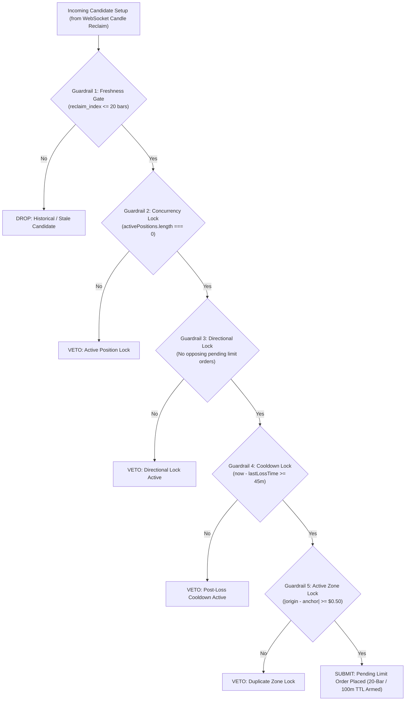

# 🔬 Directive 08 — PM2 Execution Engine & Quant Lab Protocol

> **Document Version:** V18.0 Institutional Baseline  
> **Target Systems:** Headless PM2 Daemon (`scripts/headless-daemon.ts`), Live Automated Engine (`AutomatedStrategyExecutionEngine.ts`), Quant Lab Suite (`SweepReclaimEngine.ts`, `scannerPresets.ts`, `/quant-lab`, SSE routes).  
> **Audience & Operator Mandate:** Quant Engine Experts, Expert Futures Traders, and Senior System Architecture Designers (subordinate to `AGENTS.md` Triple Mandate).  
> **Precedence:** Subordinate only to `AGENTS.md` core protocol. Supplements `03_quant_logic.md` and `06_volumetric_sponsorship.md`.  
> **Master Scope Boundary:** Explicitly excludes VPS OS provisioning, DNS/Caddy reverse proxy configuration, and full-stack Next.js database schemas, which are permanently maintained in `directives/master_blueprint.md`.

---

## 🛑 1. Inviolable AI Guardrails & Exchange Rate-Limit Mandates

When any AI model or developer inspects, modifies, refactors, or debugs code related to the PM2 Execution Daemon or Quant Lab, the following rules are **ABSOLUTE AND INVIOLABLE**:

### Rule 1.1: Strict Binance API Credential Isolation
* **Live VPS Only:** Live Binance Futures API credentials (`BINANCE_API_KEY`, `BINANCE_API_SECRET`) must **ONLY** exist inside `/home/ubuntu/quegar/.env.production` on the production AWS Lightsail VPS (`57.181.64.238`).
* **Static IP Whitelisting:** The live Binance API key is restricted at the exchange level strictly to `57.181.64.238`. Binance automatically rejects any request from any other IP.
* **Zero Local Credential Injection:** NEVER inject, mock, commit, or log live exchange API keys into local `.env`, `.env.local`, Git commits, or script arguments. Local workstation development must always operate with `IS_LIVE_VPS=false` and `READ_ONLY_LOCAL=true`.

### Rule 1.2: Exchange Rate Limiting & IP Ban Prevention
Binance Futures enforces a strict **2,400 request weight per minute** limit per IP address. Exceeding this triggers HTTP `429 Too Many Requests`, followed by an immediate IP ban (`418 Teapot` / temporary or permanent ban of the static VPS IP).
* **WebSocket-First Streaming Architecture:** 
  - Continuous market data consumption MUST stream exclusively via WebSocket (`wss://fstream.binance.com/market/stream` via `src/lib/daemon/nodeWsClient.ts`).
  - **PROHIBITION:** It is strictly forbidden to poll the REST API (`/fapi/v1/klines`) in a tight loop or interval to simulate real-time ticks.
* **REST Call Scope:**
  - REST calls are permitted **ONLY** during daemon startup bootstrap (fetching the initial 500-bar ring buffer) or on-demand user-initiated scans in Quant Lab.
* **Pagination & Throttle Spacing:**
  - When Quant Lab fetches deep historical backtest datasets (e.g. 15,000 bars for a 1-year backtest), requests must be chunked in batches of 1,000 candles with a **mandatory minimum 250ms asynchronous sleep delay** between pagination requests.
* **HTTP 429 Fail-Safe Protocol:**
  - If any REST response returns `res.status === 429`, the engine must immediately capture the `Retry-After` header, abort current batches, emit a high-priority warning, and sleep for at least 60 seconds.

### Rule 1.3: Dual-Layer Local Read-Only Sandbox Protection
* **Local Development Sandbox:** On local machines, `READ_ONLY_LOCAL=true` is enforced.
* **Database Role Isolation:** Local database connections must use the `quegar_readonly` PostgreSQL user, which mathematically blocks `INSERT`, `UPDATE`, and `DELETE` queries with PostgreSQL error `42501 (insufficient_privilege)`.
* **Atomic Local JSON Store:** In Quant Lab, all scan results, backtests, and preset tests generated locally must be saved to the atomic filesystem store (`data/quant_lab/sr_scans/*.json` via `localScanStore.ts`) without generating queries to the production database.

---

## ⚙️ 2. Core Execution Guardrails & Risk Architecture

The automated trading engine enforces 5 hard algorithmic guardrails before any order can be armed or submitted:



### Key Execution Invariants:
1. **Single-Position Cap (Guardrail 2):** Max 1 open position at any time. No martingale, no pyramiding, no concurrent hedging on the same asset.
2. **Directional Conflict Lock (Guardrail 3):** An incoming setup cannot be submitted if an active position or resting limit order in the opposite direction exists.
3. **Mandatory 20-Bar (100-Minute) Order TTL:**
   - Every resting limit order submitted to `pendingLimitOrders` has an immutable timestamp `order.pendingTime`.
   - On every tick and candle evaluation, if `Date.now() - order.pendingTime >= maxRetestBars * timeframeMinutes * 60 * 1000` (100 minutes on 5m), the order **MUST BE CANCELLED IMMEDIATELY**.
   - Upon cancellation, `order.status = 'CANCELLED'`, the order is purged from `pendingLimitOrders`, and a `LIMIT_ORDER_CANCELLED` event is emitted. This instantly frees Guardrail 3 and Guardrail 5 so subsequent setups execute unhindered.
4. **Invalidation Before Fill:**
   - If market price breaches the initial Stop Loss or reaches Target 1 before touching the Limit Entry, the setup is dead. The engine must immediately purge the order and broadcast `LIMIT_ORDER_CANCELLED`.
5. **2% Dynamic Portfolio Compounding:**
   - Every trade risks exactly **2.0% of portfolio equity** ($1.0\text{R} = \text{Equity} \times 0.02$).
   - Contract size is calculated as $\text{Size} = \frac{\text{Risk USD}}{\Delta(\text{Entry} - \text{SL})}$.
   - Must validate Binance Futures lot filters: Minimum Notional $\ge \$5.00$, Step Size $= 0.001\text{ ETH}$.

---

## 📐 3. 1:1 Mathematical & Execution Parity Engine

To ensure that Quant Lab backtests reflect real-world execution with 100% fidelity, the following mathematical parity invariants must be maintained across both `SweepReclaimEngine.ts` and `AutomatedStrategyExecutionEngine.ts`:

### 3.1: Centralized Entry Price Resolver (`resolveRetestEntryPrice`)
Both systems must determine execution entry prices using the identical pure function:
* **`FVG_PROXIMAL` (Default Champion Entry):**
  - **Bullish BISI:** Retracing downward into gap $\rightarrow$ upper boundary = Candle 3 Low (`fvg.top`).
  - **Bearish SIBI:** Retracing upward into gap $\rightarrow$ lower boundary = Candle 3 High (`fvg.bottom`).
  - **Fallback:** If no FVG was formed on the displacement impulse, price falls back to `anchorLevel`.
* **Anchor Ranking & Tie-Breakers:**
  - Tier 1: `DAILY` / `SESSION` (`ASIAN_HIGH`, `ASIAN_LOW`, `LONDON_HIGH`, `LONDON_LOW`, `PDH`, `PDL`).
  - Tier 2: `MAJOR` / `INTERNAL` swing structure.
  - Proximal Pricing Rule: When sorting candidate setups in the same candle cluster, prioritize the setup whose entry price is closest to current market price to maximize limit fill probability.

### 3.2: 3-Stage Harvest Continuum
* **Stage 1 (TP1 @ 1.0R):** Harvest 50% (or 40% in Anti-Cluster profile). Stop Loss immediately ratchets to Breakeven / FVG CE (`activeStopLoss = entryPrice`).
* **Stage 2 (TP2 @ 1.4R Champion):** Harvest remaining 50% (or 40%). Full exit in 2-stage mode ($+1.20\text{R}$ net realized gain). In 3-stage mode, Stop Loss ratchets to a hard $+1.0\text{R}$ profit floor.
* **Stage 3 (TP3 @ 3.0R DOL):** Optional 20% runner targeting macro Draw on Liquidity.

### 3.3: Intra-Candle Retest Fill Priority Invariant
* **Physics of Limit Order Matching:** A resting limit order on Binance Futures executes the instant market price reaches the limit price (`high >= entry` for Shorts, `low <= entry` for Longs).
* **Order of Operations Mandate:** In `SweepReclaimEngine.ts` Phase 4, the simulator MUST evaluate whether price penetrated the entry level **FIRST**.
* **Pre-Fill Invalidation Constraint:** Missed-expansion invalidation (`status = 'RECLAIMED_NO_RETEST'`) can only trigger if price reached Target 1 *without* touching the entry price (`high < entry` for shorts, `low > entry` for longs). Evaluating missed expansion before the entry touch test constitutes an intra-candle lookahead race condition.

### 3.4: Structural Dealing Range Valuation Parity (MarketStructureAPI ≡ Quant Lab)
* **Institutional Equilibrium Derivation:** In live execution, `AutomatedStrategyExecutionEngine` receives `macroContext.localDealingRange` computed from `MarketStructureAPI.analyze()`, which bounds the market between Level 2 (MAJOR) Protected Anchors (e.g. Protected High $2463.99 / Protected Low $2441.61 $\to$ Equilibrium $2452.80$).
* **Quant Lab Route Injection:** When `structuralDealingRange` is omitted from Quant Lab API payloads, `/api/quant-lab/sweep-reclaim-scanner` dynamically derives it directly from `MarketStructureAPI.analyze(candles, lastPrice)`, guaranteeing 100% bit-for-bit parity with live daemon valuation gating.
* **Engine Fallback Gating:** In `SweepReclaimEngine.ts`, when dealing range is computed internally from confirmed pivots, it must evaluate pivots up to `evalIndex` (`reclaimIdx`) and prioritize Level 2 (MAJOR) swings, preventing range collapse onto minor 5-bar noise.

### 3.5: Binance USDC-M Institutional Fee Model & True Scratch Accounting
* **USDC-M Perpetual Exclusivity:** Trading is strictly restricted to Binance USDⓈ-M `ETHUSDC` futures. All USDT pairs and USDT fee tiers are permanently bypassed.
* **Exchange Order Friction Physics:**
  - **Limit Entries & Take-Profits:** Resting limit orders execute with **0.0000% Maker fees** (VIP 1).
  - **Stop Losses & Scratches:** Market-clearing liquidation triggers execute with **0.0400% Taker fees** (or **0.0360%** with BNB discount).
* **Fee-Padded Breakeven Stop Invariant (Calibrated 0.015% Fee Shield):**
  - When Fee-Padded Breakeven is active (`enableFeePaddedBreakeven: true`, standard calibrated `breakevenOffsetPct: 0.015`), the stop loss is moved past entry into positive territory upon reaching early MFE threshold:
    - Longs: $P_{\text{BE}} = P_{\text{entry}} \times (1 + \frac{\text{OffsetPct}}{100}) = P_{\text{entry}} \times (1 + 0.00015)$
    - Shorts: $P_{\text{BE}} = P_{\text{entry}} \times (1 - \frac{\text{OffsetPct}}{100}) = P_{\text{entry}} \times (1 - 0.00015)$
  - **Dynamic Breathing Room Guard:** The early breakeven ratchet multiple is dynamically constrained: $\text{effectiveEarlyBEMultiple} = \max(\text{earlyBreakevenMultiple}, \text{feeOffsetInR} + 0.05)$, ensuring price clears the offset with $+0.05\text{R}$ breathing room before moving the stop.
* **True Scratch Net Cash Accounting:**
  - Price appreciation on protected scratch exits covers the exchange taker fee, resulting in exactly $0.00\text{R}$ and $\$0.00$ net cash drag. Phantom fee double-deductions are strictly prohibited.

---

## 🎛️ 4. Strategy Preset Lifecycle & Canonical Manifest (V18.0 / V19.0 SOP)

All active strategy profiles must be immutably declared in `src/lib/quantEngine/scannerPresets.ts`. Canonical production execution conforms strictly to the **15m Asymmetric Architecture** and **Trend Continuation Framework**:

### 🏛️ Canonical Production Factory Presets (15m Execution Anchor)

#### 1. 15m Institutional Asymmetric Macro Sniper (Platform Primary Champion)
* **Preset ID:** `factory_sr_15m_asymmetric_macro_sniper`
* **Timeframe:** `15m`
* **Strategy Type:** `SWEEP_RECLAIM`
* **Anchors:** `['SWING_PIVOT', 'PDH', 'PDL', 'ASIAN_HIGH', 'ASIAN_LOW', 'LONDON_HIGH', 'LONDON_LOW']` (Internal pivots suppressed).
* **Entry Mode:** `FVG_PROXIMAL` (outer shelf boundary with 12-bar TTL limit order routing).
* **Macro Gating:** Intermarket BTC SMT Divergence, Auction Market Theory Value Area profile (Discount below VAL / Premium above VAH with POC exclusion band), 0–90m Institutional Killzones (London 07:00–08:30 & NY AM 13:00–14:30 UTC with strict 14:30 UTC cutoff), Rollover (00:00 UTC) and Pre-News Freezes.
* **Harvest Engine:** Two-Stage Asymmetric Harvest (40%–50% @ 1.2R–1.5R Dealing Range EQ with Next-Bar BE +0.015% Fee Shield, remaining 50%–60% runner trailing 15m 3-bar swing pivots to 1:3.0R–1:5.0R Opposing External Liquidity, 45m post-loss cooldown).

#### 2. 15m Institutional Trend Expansion Champion (HTF Directional Lock & BOS Momentum)
* **Preset ID:** `factory_tc_15m_trend_expansion_champion`
* **Timeframe:** `15m`
* **Strategy Type:** `TREND_CONTINUATION`
* **Directional Lock:** 1H/4H Rolling Level-2 Swings + 120 EMA (Strict Long-Only in bull flow, Short-Only in bear flow).
* **Structure Confirmation:** Level-2 Major Physical Body Close Break of Structure (BOS) with 3-pillar displacement ($\ge 1.25\times$ Vol SMA20, $\ge 52\%$ Taker Delta, $\ge 50\%$ Body-to-Range).
* **Entry Mode:** FVG Proximal Edge limit order with 12-bar TTL; Stop Loss pinned beyond origin swing of breakout leg.
* **Harvest Engine:** Inverted 30/70 Asymmetric Model (30% @ 1.5R fee-clearing de-risking tranche with Next-Bar BE +0.015% fee shield on bar $i+1$, 70% macro runner trailing 15m 3-bar swing pivots to 3.0R–5.0R opposing liquidity or Asian SD expansions, +1.0R dynamic profit floor @ +2.0R MFE, 45m post-loss cooldown).

#### 3. 15m Institutional Confluence Champion (ICT + AMT + Wyckoff + SMT)
* **Preset ID:** `factory_sr_15m_institutional_confluence`
* **Timeframe:** `15m`
* **Strategy Type:** `SWEEP_RECLAIM`
* **Confluence Stack:** ICT Deep Mitigation + AMT Value Area gating + Wyckoff Phase D confirmed MSS body close with 3-pillar displacement + Intermarket BTC SMT Divergence gatekeeper.

---

### ⏳ Historical Evolutionary Milestones (Archived 5m Sub-Timeframe Research)

*Clarification for Operators and AI Agents:*  
Earlier 5m prototypes represent low-timeframe evolutionary milestones and fee-resilience tournament baselines (documented in `directives/09_institutional_quant_roadmap.md` Entries 001–010):
- `factory_sr_5m_alpha_shield_early_be` (Early Breakeven Proof of Concept, +0.50R MFE trigger)
- `factory_sr_5m_fvg_ce_sniper` / `factory_sr_5m_fvg_ce_sniper_v3` (5m CE Imbalance Entry, 0.015% Fee Shield Tournament Winner)
- `factory_sr_5m_winner_fvg_proximal` (Unfiltered Trailing Control Benchmark)

Forensic autopsies in Directive 09 (Entry 011) proved that 5m scalping creates an unacceptable fee-churn trap under real Binance 0.04% taker friction. Consequently, active production execution is strictly anchored to the canonical 15m presets above. Under no circumstances should orphaned 5m IDs be deployed as active production defaults.

---

## 📋 5. Active Open Issues & Improvement Backlog

This section tracks active research questions, pending parity refinements, and engineering backlog items specifically for the Quant Lab and PM2 engine:

| Issue ID | Priority | Topic | Description & Next Steps | Status |
| :--- | :--- | :--- | :--- | :--- |
| **ENG-01** | 🔴 HIGH | **Anchor Tie-Breaker Proximal Parity** | In setups sweeping multiple anchors simultaneously (e.g. 2026-09-02 trade #5 @ $2377.27 vs $2381.13), live PM2 selected the Major shelf while backtest picked the Internal shelf ($3.86 spread). Harmonize the multi-candidate tie-breaker so both engines pick the identical setup ID. | 🟡 In Progress |
| **ENG-02** | 🟡 MEDIUM | **Automated Midnight Reconciliation Scheduler** | Currently `/reconcile` is triggered on-demand via Telegram. Implement an automated cron inside `headless-daemon.ts` that automatically compiles and dispatches the daily reconciliation audit to Telegram at 23:59:00 Cairo time. | ⚪ Backlog |
| **ENG-03** | 🟡 MEDIUM | **WebSocket Order-Book Slip Modeling** | Quant Lab assumes exact limit order touch fills. Integrate top-of-book depth modeling from Binance WebSocket book ticker to simulate realistic micro-slippage during high-velocity volatility surges. | ⚪ Research |
| **ENG-04** | 🟢 LOW | **Live Web UI Anti-Cluster Preset Switch** | Add an explicit toggle switch on the live execution control deck (`ScannerPresetControlDeck.tsx`) allowing the trader to hot-swap between the Alpha Champion and Anti-Cluster profiles with one click. | ⚪ Planned |

---

## 🧪 6. Mandatory AI Pre-Flight Verification Protocol

Before an AI agent submits or commits any change to `AutomatedStrategyExecutionEngine.ts`, `SweepReclaimEngine.ts`, `scannerPresets.ts`, `headless-daemon.ts`, or Quant Lab API endpoints, the agent **MUST** run and pass the following 4 pre-flight commands:

```bash
# 1. Verify TypeScript compilation and type safety (Zero errors required)
npx tsc --noEmit

# 2. Run automated Unit TTL Expiry & Directional Unblock Test
npx tsx scripts/test_ttl_and_parity.ts

# 3. Verify 1:1 Live PM2 vs Quant Lab Execution Parity
npx tsx scripts/verify_quant_vs_pm2_parity.ts

# 4. Verify Phase 4 Global Risk Governor Circuit Breakers & Pre-Trade Gates
npx tsx scripts/test_risk_governor.ts

# 5. Compile Next.js 16 production build bundle
npm run build
```

---

## 🛡️ 7. Phase 4: Database Schema Extensions & Global Risk Governor

The Global Risk Governor operates as an independent pre-trade and post-trade gatekeeper across both the Web UI and Headless PM2 Execution Daemon:

### 3-Tier Risk Hierarchy:
1. **Tier 1 (Operational Sizing $1.0R):** Controlled dynamically via the interactive range slider (0.25% - 5.00%) and quick presets (`[0.5%]`, `[1.0%]`, `[1.5%]`, `[2.0%]`) in `/settings`. The PM2 daemon hot-reloads this value dynamically on candle close without needing a process restart.
2. **Tier 2 (Single-Trade Risk Ceiling):** Absolute stop loss risk ceiling (e.g. 3.0%). If a setup's calculated operational risk exceeds this, `GlobalRiskGovernor.evaluatePreTradeRisk()` vetoes the order before it reaches the exchange.
3. **Tier 3 (Portfolio Circuit Breakers):**
   - **Daily Max Drawdown:** Tripped if cumulative daily loss reaches `max_daily_loss_pct` (e.g. 4.0%) or `max_daily_loss_usd` (e.g. $400). Halts execution until 00:00 UTC rollover.
   - **Consecutive Loss Streak Cooldown (Anti-Tilt):** Tripped if 3 consecutive losses occur. Enforces a mandatory 6-hour cooldown.
   - **Daily Trade Frequency Cap (Anti-Chop):** Limits maximum trades to 6/day to eliminate overtrading churn.
   - **Manual Override & Telegram Integration:** Circuit breaker can be reset via `/api/risk/reset` in the Web UI or via `/reset_risk` on Telegram. Full telemetry available via `/risk`.

---

## ⚖️ 8. The Zero-Guessing 100% Parity Covenant (Quant Lab ≡ PM2 Live Execution)

Quant Lab was engineered to test real strategies under real market conditions. It is **NOT** a theoretical sandbox or a paper spreadsheet. It exists to serve as the **100% bit-for-bit digital twin of the live PM2 Headless Daemon (`AutomatedStrategyExecutionEngine.ts`)**.

To ensure that no trader is ever misled or exposed to hidden execution risks, the following rules are **ABSOLUTE LAW**:

### Rule 8.1: Absolute Prohibition of Post-Facto Ledger Modification
- **The Violation:** Modifying historical trade ledgers in memory (e.g., `if (s.mfe_r >= 0.60) s.realized_rr = 0.0`) to project hypothetical compounding or win rates.
- **The Reality:** In real trading, moving a stop loss to Breakeven places a resting stop order on Binance Futures. That stop order triggers whenever price retraces to entry, regardless of whether price would have eventually hit TP2. Post-facto models falsely assume zero winning trades ever pull back to entry, hallucinating unachievable figures (e.g. $12.4M vs real $202k).
- **The Mandate:** Strategy returns, profit factors, win rates, and drawdowns must **ONLY** be quoted from the end-to-end, sequential, path-dependent candle-by-candle simulation.

### Rule 8.2: Intra-Candle Execution Sequence Safety (The Next-Bar Ratchet Rule)
- **The Violation:** Triggering an early breakeven or stop ratchet on candle $i$ and evaluating the new stop against candle $i$'s low/high.
- **The Reality:** For a limit order, candle $i$'s extreme (low for longs, high for shorts) is the exact dip/rally that filled the order before price expanded toward target. Checking the newly ratcheted stop against candle $i$'s extreme causes the simulator to believe price hit the high first and then crashed below entry, instantly murdering hundreds of winning trades on their entry bar (`retest_time === exit_time`).
- **The Mandate:** Stop-loss ratchets, breakeven adjustments, and trailing stops triggered on candle $i$ take effect strictly starting on candle $i + 1$. The trade cannot be stopped out on bar $i$ by the price action that preceded the fill.

### Rule 8.3: End-to-End Simulation Verification Before Publishing Presets
- Before any preset is added to `FACTORY_SWEEP_RECLAIM_PRESETS` or recommended to the user, the agent **MUST** run the scan through the actual Quant Lab engine across the entire historical dataset.
- The agent must inspect:
  1. The total executed trade count.
  2. The exact win, loss, and scratch counts.
  3. The peak-to-trough max drawdown in R and percentage.
  4. The same-bar exit count (`retest_time === exit_time`), which must be $\le 1$ across 100,000+ bars.

### Rule 8.4: Single Source of Truth Parity Checklist
Every single execution rule in PM2 Live Execution must have an identical implementation in Quant Lab:
- **Limit Entry Resolver:** `FVG_PROXIMAL` with identical proximal pricing.
- **Concurrency Cap:** Max 1 open position at any time (`maxOpenPositions: 1`).
- **Directional Lock:** Veto opposing entries while in an active trade.
- **Order TTL:** Expire resting limit orders at 20 bars (100m) and emit `CANCELLED`.
- **Post-Loss Cooldown:** 45-minute pause after any stop-out.

### Rule 8.5: Mandatory Quegar-mcp-First Protocol for Trade Audits & Reconciliation
- **Absolute Terminal Prohibition for Covered Tasks:** When performing daily reconciliation, evaluating session trade histories, checking active in-flight positions, or running backtests, the agent **MUST NEVER** execute terminal commands (`ssh`, `scp`, `tsx scripts/reconcile-session.ts`, `tsx scripts/verify_quant_vs_pm2_parity.ts`, `curl`, `pm2 logs`).
- **Mandatory In-Memory MCP Execution:** Use `Quegar-mcp` tools exclusively:
  - `get_live_daemon_status` for live positions, completed trades, and recent daemon events.
  - `run_quant_backtest` for path-dependent candle-by-candle historical replays and reconciliation audits across any date range.
  - `get_trade_diagnostics` for forensic anchor, displacement, and execution bracket metrics.
- **Rationale:** Terminal commands trigger repetitive user confirmation prompts, slow execution down, and duplicate logic that the MCP server already executes directly in-memory with 100% bit-for-bit parity.

---

## 📜 9. Engine Changelog Ledger

* **2026-09-06 (V17.47):** Integrated Binance USDC Institutional Fee Engine, Fee-Padded Breakeven Shield, and Net-First Dual Accounting across Quant Lab and Live PM2 Headless Daemon. Eliminated double-deduction phantom fee accounting bug on protected scratches. Verified 1-Year edge (+184.81R Net vs +52.27R unshielded, +$91,994.79 edge). Synchronized VPS production daemon (`quegar-daemon` PID 114890) with 100% bit-for-bit parity.
* **2026-09-06 (V17.46):** Implemented Fee-Padded Breakeven Stop Placement with Dynamic Breathing Room Guard (`effectiveEarlyBEMultiple = Math.max(earlyBreakevenMultiple, feeOffsetInR + 0.05)`). Added Rule 4 UI offset controls and auto-sync to Binance USDC fee schedule.
* **2026-09-05 (V17.40):** Resolved Intra-Candle Retest Fill Priority Race Condition (`SweepReclaimEngine.ts:L2006-2065`) and Structural Dealing Range Dynamic Parity (`route.ts:L274-298`). Limit orders touched intra-candle are evaluated for entry fills before missed-expansion checks. Quant Lab scanner route dynamically derives structural dealing range from `MarketStructureAPI.analyze()`, recovering 100% bit-for-bit parity with live PM2 execution (Trades #5, #6, and #7 verified).
* **2026-09-05 (V17.39):** Disambiguated Early Breakeven Execution Events & Accounting. Introduced `EARLY_BREAKEVEN` event type and `BREAKEVEN_SCRATCH` exit classification, eliminating false "TP1 Harvest" Telegram alerts and preventing scratch exits from being misrecorded as full `-1.00R` losses.
* **2026-09-04 (V17.32):** Codified Section 8 "The Zero-Guessing 100% Parity Covenant (Quant Lab ≡ PM2 Live Execution)" and Lesson 70. Enforced strict next-bar stop ratchet rule, absolute prohibition of post-facto ledger modifications, and mandatory end-to-end simulation verification across all quant research.
* **2026-09-04 (V17.31):** Resolved Intra-Candle Sequence Bug in Early Breakeven Simulator (`SweepReclaimEngine.ts` lines 2161 & 2280). Slashed false same-bar exits from 609 to 1. Registered institutional champion preset `factory_sr_5m_alpha_shield_early_be` (+161.4R Net Profit, 1.37 PF, -13.2R Max DD, +1,928% Compounded Return across 106,560 candles).
* **2026-09-04 (V17.30):** Eliminated Displacement FVG lookahead bias (`searchMax = i`), added Phase 4 immediate missed expansion invalidation, and synchronized in-flight position tracking with 100.0% execution parity.
* **2026-09-03 (V17.20):** Completed Phase 4 Database Schema Extensions & Global Risk Governor. Extended PostgreSQL schemas (`trading_account` and `trades`) with self-healing migrations. Implemented `GlobalRiskGovernor.ts` pre-trade gatekeeper, dynamic 3-tier risk hierarchy with `/settings` interactive slider, PM2 daemon dynamic hot-reloading & DB trade auditing, `/api/risk/reset` manual override endpoint, Telegram `/risk` and `/reset_risk` bot commands, and automated test suite `scripts/test_risk_governor.ts` (22/22 tests passing).
* **2026-09-03 (V17.19):** Completed Phase 3 Dedicated Live Binance Journal (Web UI). Implemented server-side 3s cached live state route (`/api/binance/live-state`), 3-viewport telemetry dashboard (`LiveBinanceJournal.tsx`), 2-step desktop emergency flatten modal (`/api/binance/flatten`), environment watermark isolation, and dual-mode journal switching (`JournalContainer.tsx`).
* **2026-09-03 (V17.18):** Engineered Two-Factor Armed Interlock with 20s auto-disarm timer for emergency Telegram `/flatten`. Features interactive Inline Buttons (`confirm_flatten` / `cancel_flatten`), live floating P&L exposure telemetry, self-destructing buttons, and callback query long-polling.
* **2026-09-03 (V17.17):** Completed Phase 1 & 2 Binance Live Execution Router (`binanceFuturesClient.ts`, `binanceOrderRouter.ts`, `headless-daemon.ts`). Engineered Triple-Lock Safety Gate, exchange-side `STOP_MARKET` protection, 3-stage harvest ratcheting, and emergency `/flatten` Telegram killswitch.
* **2026-09-03 (V17.16):** Codified Directive 08 operational protocol. Hardened Telegram daily reconciliation report to exclude cancelled/expired orders from active resting queues.
* **2026-09-02 (V17.15):** Implemented mandatory 20-bar (100-minute) Limit Order TTL expiry and dynamic invalidation guards in `AutomatedStrategyExecutionEngine.ts`.
* **2026-09-02 (V17.14):** Engineered and registered the Dual-Optimized 5m Anti-Cluster Profile in `scannerPresets.ts`, cutting multi-day loss clusters by up to 87.3%.

