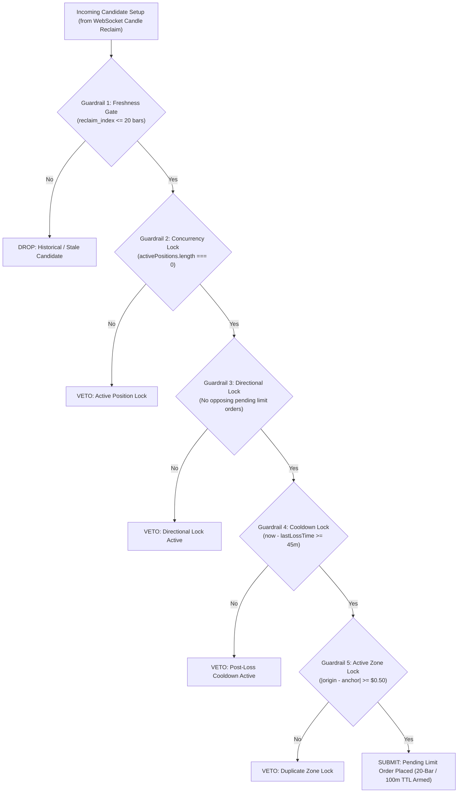

# 🔬 Directive 08 — PM2 Execution Engine & Quant Lab Protocol

> **Document Version:** 1.0.0 (V17.16)  
> **Target Systems:** Headless PM2 Daemon (`scripts/headless-daemon.ts`), Live Automated Engine (`AutomatedStrategyExecutionEngine.ts`), Quant Lab Suite (`SweepReclaimEngine.ts`, `scannerPresets.ts`, `/quant-lab`, SSE routes).  
> **Audience:** AI Coding Agents, Quant Researchers, and Systems Engineers.  
> **Precedence:** Subordinate only to `AGENTS.md` core protocol. Supplements `03_quant_logic.md` and `06_volumetric_sponsorship.md`.  
> **Master Scope Boundary:** Explicitly excludes VPS OS provisioning, DNS/Caddy reverse proxy configuration, and full-stack Next.js database schemas, which are permanently maintained in `directives/master_blueprint.md`.

---

## 🛑 1. Inviolable AI Guardrails & Exchange Rate-Limit Mandates

When any AI model or developer inspects, modifies, refactors, or debugs code related to the PM2 Execution Daemon or Quant Lab, the following rules are **ABSOLUTE AND INVIOLABLE**:

### Rule 1.1: Strict Binance API Credential Isolation
* **Live VPS Only:** Live Binance Futures API credentials (`BINANCE_API_KEY`, `BINANCE_API_SECRET`) must **ONLY** exist inside `/home/ubuntu/quegar/.env.production` on the production AWS Lightsail VPS (`57.181.64.238`).
* **Static IP Whitelisting:** The live Binance API key is restricted at the exchange level strictly to `57.181.64.238`. Binance automatically rejects any request from any other IP.
* **Zero Local Credential Injection:** NEVER inject, mock, commit, or log live exchange API keys into local `.env`, `.env.local`, Git commits, or script arguments. Local workstation development must always operate with `IS_LIVE_VPS=false` and `READ_ONLY_LOCAL=true`.

### Rule 1.2: Exchange Rate Limiting & IP Ban Prevention
Binance Futures enforces a strict **2,400 request weight per minute** limit per IP address. Exceeding this triggers HTTP `429 Too Many Requests`, followed by an immediate IP ban (`418 Teapot` / temporary or permanent ban of the static VPS IP).
* **WebSocket-First Streaming Architecture:** 
  - Continuous market data consumption MUST stream exclusively via WebSocket (`wss://fstream.binance.com/market/stream` via `src/lib/daemon/nodeWsClient.ts`).
  - **PROHIBITION:** It is strictly forbidden to poll the REST API (`/fapi/v1/klines`) in a tight loop or interval to simulate real-time ticks.
* **REST Call Scope:**
  - REST calls are permitted **ONLY** during daemon startup bootstrap (fetching the initial 500-bar ring buffer) or on-demand user-initiated scans in Quant Lab.
* **Pagination & Throttle Spacing:**
  - When Quant Lab fetches deep historical backtest datasets (e.g. 15,000 bars for a 1-year backtest), requests must be chunked in batches of 1,000 candles with a **mandatory minimum 250ms asynchronous sleep delay** between pagination requests.
* **HTTP 429 Fail-Safe Protocol:**
  - If any REST response returns `res.status === 429`, the engine must immediately capture the `Retry-After` header, abort current batches, emit a high-priority warning, and sleep for at least 60 seconds.

### Rule 1.3: Dual-Layer Local Read-Only Sandbox Protection
* **Local Development Sandbox:** On local machines, `READ_ONLY_LOCAL=true` is enforced.
* **Database Role Isolation:** Local database connections must use the `quegar_readonly` PostgreSQL user, which mathematically blocks `INSERT`, `UPDATE`, and `DELETE` queries with PostgreSQL error `42501 (insufficient_privilege)`.
* **Atomic Local JSON Store:** In Quant Lab, all scan results, backtests, and preset tests generated locally must be saved to the atomic filesystem store (`data/quant_lab/sr_scans/*.json` via `localScanStore.ts`) without generating queries to the production database.

---

## ⚙️ 2. Core Execution Guardrails & Risk Architecture

The automated trading engine enforces 5 hard algorithmic guardrails before any order can be armed or submitted:



### Key Execution Invariants:
1. **Single-Position Cap (Guardrail 2):** Max 1 open position at any time. No martingale, no pyramiding, no concurrent hedging on the same asset.
2. **Directional Conflict Lock (Guardrail 3):** An incoming setup cannot be submitted if an active position or resting limit order in the opposite direction exists.
3. **Mandatory 20-Bar (100-Minute) Order TTL:**
   - Every resting limit order submitted to `pendingLimitOrders` has an immutable timestamp `order.pendingTime`.
   - On every tick and candle evaluation, if `Date.now() - order.pendingTime >= maxRetestBars * timeframeMinutes * 60 * 1000` (100 minutes on 5m), the order **MUST BE CANCELLED IMMEDIATELY**.
   - Upon cancellation, `order.status = 'CANCELLED'`, the order is purged from `pendingLimitOrders`, and a `LIMIT_ORDER_CANCELLED` event is emitted. This instantly frees Guardrail 3 and Guardrail 5 so subsequent setups execute unhindered.
4. **Invalidation Before Fill:**
   - If market price breaches the initial Stop Loss or reaches Target 1 before touching the Limit Entry, the setup is dead. The engine must immediately purge the order and broadcast `LIMIT_ORDER_CANCELLED`.
5. **2% Dynamic Portfolio Compounding:**
   - Every trade risks exactly **2.0% of portfolio equity** ($1.0\text{R} = \text{Equity} \times 0.02$).
   - Contract size is calculated as $\text{Size} = \frac{\text{Risk USD}}{\Delta(\text{Entry} - \text{SL})}$.
   - Must validate Binance Futures lot filters: Minimum Notional $\ge \$5.00$, Step Size $= 0.001\text{ ETH}$.

---

## 📐 3. 1:1 Mathematical & Execution Parity Engine

To ensure that Quant Lab backtests reflect real-world execution with 100% fidelity, the following mathematical parity invariants must be maintained across both `SweepReclaimEngine.ts` and `AutomatedStrategyExecutionEngine.ts`:

### 3.1: Centralized Entry Price Resolver (`resolveRetestEntryPrice`)
Both systems must determine execution entry prices using the identical pure function:
* **`FVG_PROXIMAL` (Default Champion Entry):**
  - **Bullish BISI:** Retracing downward into gap $\rightarrow$ upper boundary = Candle 3 Low (`fvg.top`).
  - **Bearish SIBI:** Retracing upward into gap $\rightarrow$ lower boundary = Candle 3 High (`fvg.bottom`).
  - **Fallback:** If no FVG was formed on the displacement impulse, price falls back to `anchorLevel`.
* **Anchor Ranking & Tie-Breakers:**
  - Tier 1: `DAILY` / `SESSION` (`ASIAN_HIGH`, `ASIAN_LOW`, `LONDON_HIGH`, `LONDON_LOW`, `PDH`, `PDL`).
  - Tier 2: `MAJOR` / `INTERNAL` swing structure.
  - Proximal Pricing Rule: When sorting candidate setups in the same candle cluster, prioritize the setup whose entry price is closest to current market price to maximize limit fill probability.

### 3.2: 3-Stage Harvest Continuum
* **Stage 1 (TP1 @ 1.0R):** Harvest 50% (or 40% in Anti-Cluster profile). Stop Loss immediately ratchets to Breakeven / FVG CE (`activeStopLoss = entryPrice`).
* **Stage 2 (TP2 @ 1.4R Champion):** Harvest remaining 50% (or 40%). Full exit in 2-stage mode ($+1.20\text{R}$ net realized gain). In 3-stage mode, Stop Loss ratchets to a hard $+1.0\text{R}$ profit floor.
* **Stage 3 (TP3 @ 3.0R DOL):** Optional 20% runner targeting macro Draw on Liquidity.

---

## 🎛️ 4. Strategy Preset Lifecycle & Management

All strategy profiles must be immutably declared in `src/lib/quantEngine/scannerPresets.ts`:

### 1. Alpha Champion (Platform Default)
* **Preset ID:** `factory_sr_5m_winner_fvg_proximal`
* **Anchors:** All anchor types enabled (including 5m Swing Pivots).
* **Entry Mode:** `FVG_PROXIMAL`.
* **Displacement:** $1.20\times$ Volume SMA, $52\%$ Taker Delta, $0.40$ Body Ratio.
* **Characteristics:** Maximum cumulative profitability ($+482.6\text{R}\text{/year}$, $60.6\%$ Win Rate, $1.40\text{ PF}$), higher trade frequency, standard drawdown tolerance.

### 2. Dual-Optimized Anti-Cluster Shield (Selective Auxiliary)
* **Preset ID:** `factory_sr_5m_anti_cluster_dual_optimized`
* **Anchors:** Restricts anchors strictly to macro liquidity pools (`ASIAN_HIGH`, `ASIAN_LOW`, `LONDON_HIGH`, `LONDON_LOW`, `PDH`, `PDL`). **`SWING_PIVOT` disabled.**
* **Displacement:** Identical 3-pillar displacement thresholds.
* **Quant Shield Rules:** Active Rule 1 Wave Deduplication, Active Rule 5 Post-Loss Cooldown (45 min), Configurable Rule 4 Early Breakeven (+0.60R).
* **Characteristics:** Slashes $\ge 3$ consecutive loss clusters by **$80.0\%$ to $87.3\%$**, cuts max drawdown from $-20.8\text{R}$ to $-10.6\text{R}$.

---

## 📋 5. Active Open Issues & Improvement Backlog

This section tracks active research questions, pending parity refinements, and engineering backlog items specifically for the Quant Lab and PM2 engine:

| Issue ID | Priority | Topic | Description & Next Steps | Status |
| :--- | :--- | :--- | :--- | :--- |
| **ENG-01** | 🔴 HIGH | **Anchor Tie-Breaker Proximal Parity** | In setups sweeping multiple anchors simultaneously (e.g. 2026-09-02 trade #5 @ $2377.27 vs $2381.13), live PM2 selected the Major shelf while backtest picked the Internal shelf ($3.86 spread). Harmonize the multi-candidate tie-breaker so both engines pick the identical setup ID. | 🟡 In Progress |
| **ENG-02** | 🟡 MEDIUM | **Automated Midnight Reconciliation Scheduler** | Currently `/reconcile` is triggered on-demand via Telegram. Implement an automated cron inside `headless-daemon.ts` that automatically compiles and dispatches the daily reconciliation audit to Telegram at 23:59:00 Cairo time. | ⚪ Backlog |
| **ENG-03** | 🟡 MEDIUM | **WebSocket Order-Book Slip Modeling** | Quant Lab assumes exact limit order touch fills. Integrate top-of-book depth modeling from Binance WebSocket book ticker to simulate realistic micro-slippage during high-velocity volatility surges. | ⚪ Research |
| **ENG-04** | 🟢 LOW | **Live Web UI Anti-Cluster Preset Switch** | Add an explicit toggle switch on the live execution control deck (`ScannerPresetControlDeck.tsx`) allowing the trader to hot-swap between the Alpha Champion and Anti-Cluster profiles with one click. | ⚪ Planned |

---

## 🧪 6. Mandatory AI Pre-Flight Verification Protocol

Before an AI agent submits or commits any change to `AutomatedStrategyExecutionEngine.ts`, `SweepReclaimEngine.ts`, `scannerPresets.ts`, `headless-daemon.ts`, or Quant Lab API endpoints, the agent **MUST** run and pass the following 4 pre-flight commands:

```bash
# 1. Verify TypeScript compilation and type safety (Zero errors required)
npx tsc --noEmit

# 2. Run automated Unit TTL Expiry & Directional Unblock Test
npx tsx scripts/test_ttl_and_parity.ts

# 3. Verify 1:1 Live PM2 vs Quant Lab Execution Parity
npx tsx scripts/verify_quant_vs_pm2_parity.ts

# 4. Compile Next.js 16 production build bundle
npm run build
```

---

## 📜 7. Engine Changelog Ledger

* **2026-09-03 (V17.17):** Completed Phase 1 & 2 Binance Live Execution Router (`binanceFuturesClient.ts`, `binanceOrderRouter.ts`, `headless-daemon.ts`). Engineered Triple-Lock Safety Gate, exchange-side `STOP_MARKET` protection, 3-stage harvest ratcheting, and emergency `/flatten` Telegram killswitch.
* **2026-09-03 (V17.16):** Codified Directive 08 operational protocol. Hardened Telegram daily reconciliation report to exclude cancelled/expired orders from active resting queues.
* **2026-09-02 (V17.15):** Implemented mandatory 20-bar (100-minute) Limit Order TTL expiry and dynamic invalidation guards in `AutomatedStrategyExecutionEngine.ts`.
* **2026-09-02 (V17.14):** Engineered and registered the Dual-Optimized 5m Anti-Cluster Profile in `scannerPresets.ts`, cutting multi-day loss clusters by up to 87.3%.
