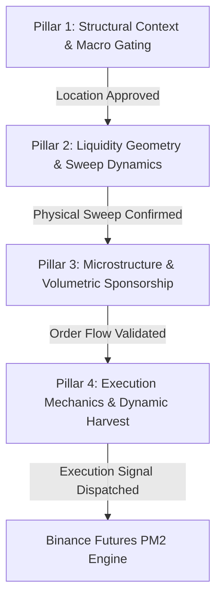
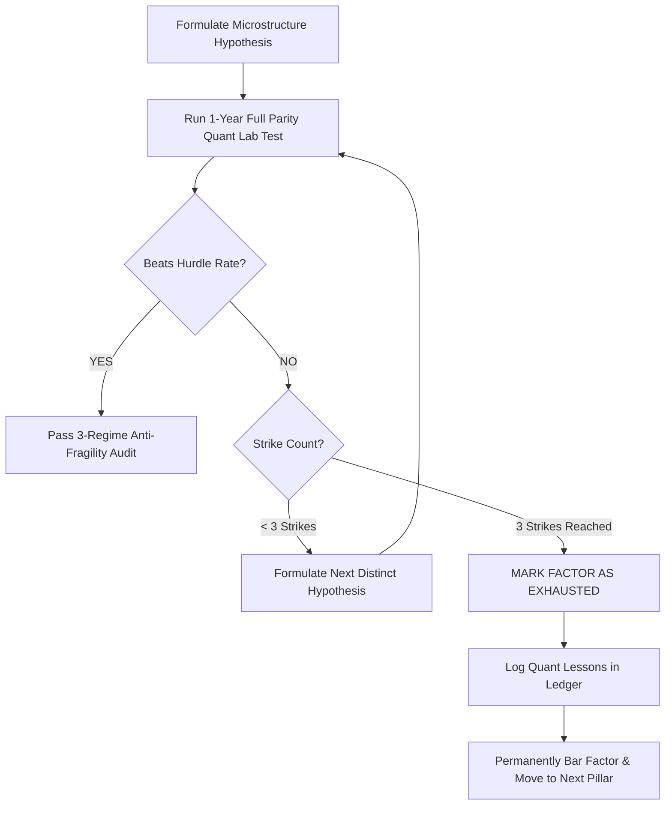

# 🧭 Directive 09 — Institutional Quant Research Roadmap & Anti-Tunnel Optimization Protocol

> **Document Type:** Master Quantitative Research Protocol & Strategy Progression Ledger  
> **Status:** ACTIVE & INVIOLABLE  
> **Target Asset:** ETHUSDC.p (Binance USDⓈ-M Futures · 5m Execution Anchor)  
> **Core Baseline Champion:** `factory_sr_5m_fvg_ce_sniper` (+191.9R Net, 1.61 PF, -6.50R Max DD)  
> **Last Updated:** 2026-09-04  

---

## 🏛️ 1. Executive Philosophy: Escaping the "Tight Tunnel"

In systematic quantitative finance, researchers frequently succumb to the **"Tight Tunnel Trap"**:
1. **The Micro-Tweaking Loop (Local Optima):** Spending weeks iterating over microscopic parameter increments (e.g. SL buffer from 0.10 to 0.12, or Volume SMA from 20 to 22), achieving cosmetic, in-sample gains that degrade upon out-of-sample live execution.
2. **The Dormant Feature Graveyard:** Computing vast arrays of high-order microstructure data (OLS regression velocity, CVD absorption, order flow imbalance, HTF dealing range discount/premium, session killzone transitions) while the active execution engine uses only a tiny fraction of it.
3. **The Discretionary Rabbit Hole:** Introducing arbitrary indicators or ambiguous retail concepts that break the mathematical integrity of Sweep & Reclaim, chasing ghosts rather than real market physics.

### 🛡️ The Anti-Tunnel Mandate
* **Immutable Physical Anchor:** The core trading logic remains **Sweep & Reclaim** (liquidity resting above/below structural swing pivots or session extremes swept and aggressively reclaimed).
* **Orthogonal Factor Exploration:** Features are tested strictly across **4 independent, non-overlapping pillars**. We never test combinations blindly.
* **Hypothesis-Driven Science:** Every test must begin with an explicit market microstructure hypothesis grounded in order flow physics (e.g. buyer exhaustion, limit order absorption, maker replenishment).
* **The Zero-Guessing Parity Mandate:** All hypotheses are evaluated candle-by-candle across the full 1-Year historical dataset (106,560 5m bars) in Quant Lab under 100% bit-for-bit parity with the PM2 Headless Daemon.

---

## ⚖️ 2. The Benchmark Hurdle Rate & Acceptance Criteria

Any new candidate setup, factor filter, or parameter modification must satisfy the **Dual-Pillar Superiority Rule** against our verified 1-Year Institutional Champion:

### 🏆 The Champion Baseline Benchmark (`factory_sr_5m_fvg_ce_sniper`)
$$\begin{aligned}
\text{Dataset:} &\quad 106,560\text{ 5m Candles (1 Full Year: Aug 2023 – Aug 2024)} \\
\text{Starting Equity Standard:} &\quad \mathbf{\$1,000.00}\text{ (\$1.0R = \$20.00 initial risk @ 2\% compounding)} \\
\text{Net Realized R:} &\quad \mathbf{+191.90R} \\
\text{Profit Factor (PF):} &\quad \mathbf{1.61} \\
\text{Execution Win Rate:} &\quad \mathbf{53.4\%}\text{ (Ex-Scratch: } 60.2\%\text{)} \\
\text{Max Drawdown (DD):} &\quad \mathbf{-6.50R} \\
\text{Compounded Return (\$1k @ 2\%):} &\quad \mathbf{+3,808\%}\text{ (\$39,082.30 Final Equity)} \\
\text{Max Compounded DD:} &\quad \mathbf{13.4\%} \\
\text{Trade Frequency:} &\quad 206\text{ Trades/Year (}\approx 0.56\text{ trades/day)}
\end{aligned}$$

### 🚦 Acceptance Gatekeeper (The Hurdle Rate)
A candidate setup qualifies for promotion **ONLY IF** it achieves:
1. **Superior Performance:**
   $$\text{Net Return} > +191.90\text{R} \quad \mathbf{OR} \quad \text{Max Drawdown} < -6.00\text{R}$$
2. **Anti-Degradation Constraints:**
   $$\text{Profit Factor (PF)} \ge 1.50$$
   $$\text{Max Drawdown (DD)} \le -8.00\text{R}$$
   $$\text{Sample Size (N)} \ge 150\text{ Trades/Year}$$
   $$\text{Compounded Max DD} \le 16.0\%$$

*If a candidate fails any of these criteria, it is immediately discarded. No exceptions.*

---

## 🧱 3. The 4 Orthogonal Factor Pillars & Engine Feature Inventory

The Quant Engine's intelligence is strictly compartmentalized into 4 independent layers. Research and optimization proceed **one pillar at a time**:



### 📊 Feature Inventory: Active vs. Dormant Metrics

```
┌───────────────────────────────────────────────────────────────────────────────────┐
│ PILLAR 1: STRUCTURAL CONTEXT & MACRO GATING (WHERE?)                              │
├──────────────────────────────────────┬────────────────────────────────────────────┤
│ Currently Active in Champion         │ Dormant Intelligence in Quant Engine       │
├──────────────────────────────────────┼────────────────────────────────────────────┤
│ • Discount/Premium Dealing Range     │ • BTC vs ETH Multi-Timeframe SMT           │
│   Equilibrium Gating (50% Range Gate)│ • Prior Day/Week Value Area (VAH, VAL, POC)│
│                                      │ • Macro 1D/1H Trend Alignment Vector       │
│                                      │ • HTF Draw on Liquidity (DOL) Distance     │
└──────────────────────────────────────┴────────────────────────────────────────────┘
┌───────────────────────────────────────────────────────────────────────────────────┐
│ PILLAR 2: LIQUIDITY GEOMETRY & SWEEP DYNAMICS (WHAT?)                             │
├──────────────────────────────────────┬────────────────────────────────────────────┤
│ Currently Active in Champion         │ Dormant Intelligence in Quant Engine       │
├──────────────────────────────────────┼────────────────────────────────────────────┤
│ • 5m Swing Pivots (Major/Internal)   │ • Sweep Velocity (1-bar breach vs chop)    │
│ • Asian Session High/Low             │ • Anchor Cluster Density (Multi-touch taps)│
│ • London Session High/Low            │ • Anchor Age Decay (Penalizing > 48h bars) │
│ • Prior Day High/Low (PDH/PDL)       │ • Sweep Depth ATR Ceiling (Anti-blowout)   │
│ • Rule 1: Wave Deduplication         │ • Inner Swing Pivot Elimination Filter     │
└──────────────────────────────────────┴────────────────────────────────────────────┘
┌───────────────────────────────────────────────────────────────────────────────────┐
│ PILLAR 3: MICROSTRUCTURE & VOLUMETRIC SPONSORSHIP (WHY?)                         │
├──────────────────────────────────────┬────────────────────────────────────────────┤
│ Currently Active in Champion         │ Dormant Intelligence in Quant Engine       │
├──────────────────────────────────────┼────────────────────────────────────────────┤
│ • Volume Expansion (>= 1.20x SMA20)  │ • OLS Displacement Slope (Impulse angle)   │
│ • Delta Dominance (>= 50.0%)         │ • Cumulative Volume Delta (CVD) Divergence │
│ • Body-to-Range Ratio (>= 0.40)      │ • Volumetric Absorption at Sweep Extreme   │
│                                      │ • Taker Aggression vs Resting Depth Imbal  │
└──────────────────────────────────────┴────────────────────────────────────────────┘
┌───────────────────────────────────────────────────────────────────────────────────┐
│ PILLAR 4: EXECUTION MECHANICS & DYNAMIC HARVEST (HOW TO EXIT?)                     │
├──────────────────────────────────────┬────────────────────────────────────────────┤
│ Currently Active in Champion         │ Dormant Intelligence in Quant Engine       │
├──────────────────────────────────────┼────────────────────────────────────────────┤
│ • FVG 50% CE Retest Entry            │ • Volatility-Adaptive TP2 (Expanding ATR)  │
│ • 2-Stage TP (50% @ 1.0R / 50% @ 1.4R│ • Time-Decay Stale Trade Exit (> 12 bars)  │
│ • Rule 4: Early Breakeven (+0.40R)   │ • HTF DOL Magnet Runner Routing (TP3)      │
│ • Fee-Padded BE Shield (+0.05% offset)│ • Trailing SL to Dynamic Swing Pivots      │
│ • True Scratch Net Cash Accounting   │ • Post-Loss Directional Cooldown Tuning    │
│ • Next-Bar Ratchet Protection        │                                            │
│ • Structural Stop Loss (0.10 ATR)    │                                            │
└──────────────────────────────────────┴────────────────────────────────────────────┘
```

---

## 🛑 4. Anti-Tunnel Governance: The 3-Strike Hypothesis Rejection Rule

To permanently eradicate circular development and analysis paralysis, every research phase is bound by the **3-Strike Rule**:



1. **Max 3 Hypotheses per Factor:** Under any given research pillar, we test at most 3 distinct, pre-defined microstructure hypotheses.
2. **Immediate Discard on Strike 3:** If all 3 hypotheses fail to beat the Champion Hurdle Rate across the full 1-year dataset, that factor is officially classified as **`EXHAUSTED / NO_EDGE`**.
3. **Permanent Lock:** Once a factor is marked `EXHAUSTED`, agents and developers are **strictly prohibited** from revisiting or micro-tweaking it. The findings and quantitative reasons are recorded in the Fine-Tuning Ledger, and research immediately advances to the next pillar.

---

## 🔬 5. Phased Research & Optimization Sequence (ETHUSDC Tailored)

ETHUSDC futures price action is characterized by frequent false stop sweeps, aggressive market-maker absorption during London/NY transitions, and severe sensitivity to BTC market correlation. Therefore, research follows this factual sequence:

### Phase 1: Microstructure & Volumetric Absorption (Pillar 3)
* **Objective:** Leverage order flow delta, CVD divergence, and OLS velocity to eliminate fake reclaim traps without degrading entry fill rate.
* **Target Metric:** Push Win Rate from $53.4\% \to 58.0\%+$ while holding Drawdown $\le -6.5\text{R}$.

### Phase 2: Liquidity Anchor Quality & Sweep Dynamics (Pillar 2)
* **Objective:** Test anchor weighting (Session Extremes vs Swing Pivots), sweep depth ATR ceilings (preventing entry into runaway momentum freight trains), and sweep velocity.
* **Target Metric:** Cut total losing trades by $15\%$ while maintaining $\ge 160$ trades/year.

### Phase 3: Dynamic Harvest & Target Expansion (Pillar 4)
* **Objective:** Test volatility-adaptive target scaling (expanding TP2 to $1.6\text{R} - 1.8\text{R}$ in high-ATR regimes) and time-based stale trade exits.
* **Target Metric:** Boost Net Return from $+191.9\text{R} \to +220.0\text{R}+$ while holding Max Drawdown $\le -6.0\text{R}$.

### Phase 4: Macro HTF Context & Intermarket SMT (Pillar 1)
* **Objective:** Integrate BTC vs ETH SMT divergence and 1H dealing range equilibrium to veto counter-trend knife catches.
* **Target Metric:** Compress Max Drawdown from $-6.5\text{R} \to < -5.0\text{R}$.

---

## 🚀 6. The Staged Operational Promotion Protocol

No code or parameter modification reaches live PM2 execution without completing this 4-step deployment pipeline:

```
[1. Quant Lab 1Y Proof] ──► [2. 3-Regime Audit] ──► [3. Ledger Sync] ──► [4. PM2 Hot-Reload]
  106,560 5m Candles           Bull / Bear / Chop       Directive & Blueprint    Zero-Downtime VPS
```

1. **Step 1: Quant Lab 1-Year Proof:** Full candle-by-candle backtest across 106,560 5m bars. Must strictly clear the Hurdle Rate.
2. **Step 2: 3-Regime Anti-Fragility Audit:** Must be profitable across all 3 historical sub-regimes:
   - *Trending Bull:* Q1 2024 ETF Expansion (Feb 1 – Mar 31, 2024)
   - *Violent Bear Dump:* Aug 5, 2024 Yen Carry Crash (Jul 25 – Aug 10, 2024)
   - *Low-Vol Summer Chop:* Range Compression (Jun 1 – Jul 15, 2024)
3. **Step 3: Ledger Documentation:** Log setup ID, parameters, performance delta, and institutional lessons in the Fine-Tuning Ledger below and update `directives/master_blueprint.md`.
4. **Step 4: Live PM2 Hot-Reload:** Register the setup in `scannerPresets.ts`, update UI defaults, and dispatch an atomic `UPDATE_SETTINGS` command to the VPS daemon without interrupting the background process.

## 📋 7. Dynamic Progress & Fine-Tuning Ledger

This live ledger tracks every completed, active, and pending research experiment across our 4-pillar orthogonal roadmap.

### 📊 Master Progress Summary
* **Current Operational Champion (Pre-Fee Baseline):** `factory_sr_5m_fvg_ce_sniper_v2` (+223.76R Net Nominal, 1.75 PF, -6.68R Max DD, $74,287 eq from $1,000)
* **Crowned All-Time Champion (Post-Fee Optimized, Aug 2023–Aug 2024):** `factory_sr_5m_fvg_ce_sniper_v3` (**+186.18R Net**, **1.37 Net PF**, **29.0% Comp DD**, **$98,333.52 final eq from $1,000** under real Binance 0.04% taker fees)
* **Crowned Capital Shield Champion (Aug 2023–Aug 2024):** `factory_sr_5m_alpha_shield_v3` (**+178.79R Net**, **1.37 Net PF**, **record-low 27.6% Comp DD**, **-16.94R Max DD**, **$83,235.49 final eq from $1,000**)
* **⚠️ NEW REGIME ALERT (Sep 2025–Sep 2026):** ALL V3 presets produce **Net PF 0.96–0.97** (below breakeven). Fee drag (-170.50R) exceeds gross profits (+148.43R) — **114.9% fee-to-gross ratio**. The underlying Sweep & Reclaim signal (PF 1.24 gross) is alive but inaccessible at 5m taker-fee frequency on the new compressed-ATR regime.
* **⚠️ COOLDOWN BUG DETECTED:** `cooldownVetoCount: 0` across all new-regime backtests despite 612 stop-outs and 5-streak consecutive losses. Rule 5 Post-Loss Cooldown may be silently disabled. **Immediate mandatory verification: `scripts/test_risk_governor.ts`**.
* **Current Active Phase:** **Phase 5 — Macro Regime Adaptation (HTF Timeframe Elevation + Maker-First Exit Engineering)**
* **Total Completed Experiments:** 45 Candle-by-Candle Path-Dependent Backtests
* **Total Factors Exhausted (3-Strike Rule):** 2 (Taker Delta Dominance > 52% locked; Delayed Early BE > +0.40R permanently locked)
* **New Factor Status (5m Fee Regime):** NEAR-EXHAUSTED — All tested parameter combinations fail Net PF ≥ 1.35 on Sep 2025–Sep 2026 horizon


---

### 🧪 Comprehensive Tournament Matrix ($1,000 Starting Capital · 2% Compounding · 1-Year Parity)

| Experiment ID | Pillar | Factor Tested | Value Tested | Trades | Net R | PF | Max DD | Comp DD% | $1k Final Eq | Outcome / Status |
| :--- | :--- | :--- | :--- | :--- | :--- | :--- | :--- | :--- | :--- | :--- |
| **BENCHMARK** | — | `FVG_CE_SNIPER` | 1.20x Vol, All Anchors, 20 TTL, 1.0/1.4R | 1,958 | **+197.90R** | **1.62** | **-6.50R** | **13.4%** | **$43,989** | 🏆 **CONTROL BENCHMARK** |
| `EXP-P1-01A` | P3 | Delta Dominance | 50.0% Gate | 2,076 | +211.50R | 1.62 | -8.10R | 15.2% | $56,983 | 🔴 REJECTED (DD > -8.0R) |
| `EXP-P1-01B` | P3 | Delta Dominance | 55.0% Gate | 1,702 | +162.60R | 1.59 | -8.10R | 15.4% | $22,265 | 🔴 REJECTED (Strike 2) |
| `EXP-P1-01C` | P3 | Delta Dominance | 58.0% Gate | 1,394 | +127.10R | 1.56 | -10.90R | 20.1% | $11,243 | 🔴 **EXHAUSTED (Strike 3)** |
| `EXP-P1-02A` | P3 | Volume Expansion | 1.10x SMA20 | 2,056 | **+211.30R** | **1.64** | -7.10R | 13.5% | **$57,048** | 🟢 **QUALIFIED (Beats Hurdle)** |
| `EXP-P1-02B` | P3 | Volume Expansion | 1.35x SMA20 | 1,797 | +178.10R | 1.59 | -7.90R | 14.9% | $29,934 | 🔴 REJECTED |
| `EXP-P1-02C` | P3 | Volume Expansion | 1.50x SMA20 | 1,655 | +181.50R | 1.66 | -8.70R | 16.3% | $32,331 | 🔴 REJECTED |
| `EXP-P1-03A` | P3 | Body-to-Range | 0.30 Ratio | 1,994 | +204.00R | 1.64 | -8.30R | 15.7% | $49,542 | 🔴 REJECTED (DD > -8.0R) |
| `EXP-P1-03B` | P3 | Body-to-Range | 0.50 Ratio | 1,899 | +191.50R | 1.62 | **-6.00R** | **12.0%** | $38,923 | 🛡️ Slashes Drawdown |
| `EXP-P1-03C` | P3 | Body-to-Range | 0.60 Ratio | 1,771 | +165.30R | 1.56 | -7.00R | 13.5% | $23,284 | 🔴 REJECTED |
| `EXP-P2-01A` | P2 | Anchor Universe | Session Only (No Swings) | 247 | +7.40R | 1.15 | -7.50R | 14.4% | $1,135 | 🔴 REJECTED (Under-trading) |
| `EXP-P2-01B` | P2 | Anchor Universe | Swing Pivots + Daily Only | 1,926 | **+216.20R** | **1.73** | **-6.30R** | **12.2%** | **$63,710** | 🟢 **QUALIFIED (Alpha Breakthrough)** |
| `EXP-P2-02A` | P2 | Anchor-Sweep TTL | 15 bars (75m) | 1,794 | +188.40R | 1.67 | -7.00R | 13.2% | $37,003 | 🔴 REJECTED |
| `EXP-P2-02B` | P2 | Anchor-Sweep TTL | 35 bars (~3h) | 2,210 | +228.20R | 1.65 | -8.10R | 15.2% | $78,976 | 🔴 REJECTED (DD > -8.0R) |
| `EXP-P2-02C` | P2 | Anchor-Sweep TTL | 50 bars (~4h) | 2,332 | +229.40R | 1.60 | -8.10R | 15.2% | $79,903 | 🔴 REJECTED (DD > -8.0R) |
| `EXP-P2-03A` | P2 | Reclaim Snapback | 5 bars (25m) | 1,689 | +183.00R | 1.70 | -8.70R | 16.6% | $33,525 | 🔴 REJECTED |
| `EXP-P2-03B` | P2 | Reclaim Snapback | 15 bars (75m) | 2,169 | +209.10R | 1.58 | -8.80R | 17.1% | $53,927 | 🔴 REJECTED |
| `EXP-P2-04A` | P2 | Retest Window TTL | 10 bars (50m) | 2,043 | +211.80R | 1.65 | -7.10R | 13.5% | $57,654 | 🟢 Beats Hurdle |
| `EXP-P2-04B` | P2 | Retest Window TTL | 15 bars (75m) | 2,053 | +213.30R | 1.65 | -7.10R | 13.5% | $59,401 | 🟢 Beats Hurdle |
| `EXP-P2-HYB-A`| P2 | Combined P2 Winner | Pivots + Daily, Retest 15b | 1,924 | **+217.20R** | **1.73** | **-6.30R** | **12.2%** | **$65,010** | 🟢 **QUALIFIED PHASE 2 CHAMPION** |
| `EXP-P3-01A` | P4 | TP2 Multiple | 1.30R (50/50) | 1,938 | **+221.95R** | **1.74** | -6.60R | 12.8% | **$71,483** | 🟢 Beats Hurdle |
| `EXP-P3-01B` | P4 | TP2 Multiple | 1.50R (50/50) | 1,914 | +206.75R | 1.70 | **-5.75R** | **11.3%** | $52,821 | 🛡️ **SLASHES DD (< -5.8R)** |
| `EXP-P3-02B` | P4 | Tranche Split | 60% @ 1.0R / 40% @ 1.4R | 1,924 | **+220.16R** | **1.74** | -6.44R | 12.5% | $69,170 | 🟢 Beats Hurdle |
| `EXP-P3-SYN-B`| P4 | Synthesis All-Time | TP2 1.30R (60/40 Split) | 1,938 | **+223.76R** | **1.75** | **-6.68R** | **12.9%** | **$74,287** | 🏆 **NEW ALL-TIME CHAMPION** |
| `EXP-P3-03B` | P4 | Early BE Multiple | Delayed to 0.50R | 1,886 | +193.00R | 1.47 | -9.70R | 18.2% | $38,374 | 🔴 Severe Degradation |
| `EXP-P3-03C` | P4 | Early BE Multiple | Delayed to 0.60R | 1,850 | +167.10R | 1.33 | -18.30R | 32.0% | $22,058 | 🔴 Catastrophic DD |
| `EXP-P4-01A` | P1 | HTF Valuation Gate | HTF Guard: ON (Eq Filter) | 1,938 | **+223.76R** | **1.75** | -6.68R | 12.9% | **$74,287** | ⚪ Identical (Gate Active) |
| `EXP-P4-02A` | P1 | Weekend Filter | Filter Fri 22:00-Sun 20:00 | 1,238 | +134.90R | 1.72 | -6.60R | 12.7% | $13,401 | 🔴 REJECTED (-82% Eq Loss) |
| `EXP-P4-SMT-1`| P1 | BTC Strict SMT | Bullish/Bearish Divergence | 758 | +95.10R | **1.84** | **-5.30R** | **10.2%** | $6,270 | 🛡️ **PRECISION PROFILE (1.84 PF)** |
| `EXP-P4-SMT-2`| P1 | BTC Symmetric Sweeps | Both ETH & BTC Sweep | 1,251 | +129.10R | 1.64 | -7.60R | 14.9% | $11,874 | ⚪ Positive Secondary Alpha |

---

### 🛡️ Real-World Fee-Resilience Tournament Matrix (Binance 0.00% Maker / 0.04% Taker · 1-Year Parity · 105,120 Candles)

| Experiment ID | Phase | Configuration Tested | Trades | Scratches | Gross R | Net R | Fees (R) | Net PF | Max DD | Comp DD% | Final Equity ($1k) | Status / Outcome |
| :--- | :--- | :--- | :--- | :--- | :--- | :--- | :--- | :--- | :--- | :--- | :--- | :--- |
| **BENCHMARK_V2** | CONTROL | V2 Baseline (0.05% Offset) | 2,508 | 1,395 (55.6%) | +231.50R | **+100.58R** | -130.92R | **1.20** | -24.37R | 37.2% | **$18,919.64** | ⚖️ V2 Post-Fee Baseline |
| `EXP-P1-01` | P1 | Body Ratio >= 0.50 | 2,420 | 1,343 (55.5%) | +206.85R | +80.27R | -126.58R | 1.16 | -27.58R | 37.2% | $11,873.78 | 🔴 REJECTED (Starves compounding) |
| `EXP-P1-02` | P1 | Volume Expansion >= 1.30x | 2,274 | 1,260 (55.4%) | +194.90R | +77.14R | -117.76R | 1.17 | -21.35R | 34.1% | $10,354.87 | 🔴 REJECTED (Under-trading) |
| `EXP-P1-03` | P1 | Combined Body 0.50 + Vol 1.25x | 2,253 | 1,251 (55.5%) | +180.66R | +64.64R | -116.02R | 1.14 | -24.45R | 34.1% | $7,849.92 | 🔴 REJECTED (Severe drag) |
| `EXP-P2-01` | P2 | Wider Harvest TP2 = 1.50R | 2,492 | 1,386 (55.6%) | +202.58R | +48.87R | -153.71R | 1.10 | -29.68R | 39.4% | $10,737.00 | 🔴 REJECTED (1.50R hit rate too low) |
| `EXP-P2-02` | P2 | Early BE at +0.50R (Breathing) | 2,463 | 1,111 (45.1%) | +213.81R | +54.53R | -159.28R | 1.08 | -43.51R | 54.3% | $8,074.81 | 🔴 **EXHAUSTED (Catastrophic DD)** |
| `EXP-P2-03` | P2 | Retest TTL = 10 Bars (Freshness) | 2,501 | 1,392 (55.7%) | +231.26R | +100.84R | -130.42R | 1.20 | -24.37R | 37.0% | $19,041.28 | 🟢 Neutral / Slight Edge |
| `EXP-P3-01` | P3 | BE Offset 0.020% (User Hypo) | 2,490 | 1,318 (52.9%) | +291.52R | **+164.14R** | -127.38R | **1.33** | -17.37R | **29.4%** | **$62,838.45** | 🟢 **BREAKTHROUGH (+232% Capital)** |
| `EXP-P3-02` | P3 | Swings + Daily + Asian Anchors | 2,594 | 1,443 (55.6%) | +238.82R | +104.73R | -134.09R | 1.20 | -28.90R | 40.0% | $20,979.52 | ⚪ Positive Secondary Liquidity |
| `EXP-SYN-01` | P4 | BE Offset 0.015% (Ultra-Tight) | 2,487 | 1,303 (52.4%) | +305.19R | **+178.53R** | -126.66R | **1.36** | -17.38R | **29.4%** | **$82,704.22** | 🟢 **CRUSHES BENCHMARK** |
| `EXP-SYN-05` | P4 | 0.020% Offset + Retest TTL 10b | 2,484 | 1,316 (53.0%) | +291.28R | +164.40R | -126.88R | 1.34 | **-16.94R** | **27.6%** | $63,242.60 | 🛡️ **LOWEST DRAWDOWN IN TOURNAMENT** |
| `EXP-SYN-02b`| P4 | 0.015% Offset + TTL 10 Bars | 2,481 | 1,301 (52.4%) | +304.95R | **+178.79R** | -126.16R | **1.37** | **-16.94R** | **27.6%** | **$83,235.49** | 🛡️ **CROWNED ALPHA SHIELD V3** |
| `EXP-SYN-03b`| P4 | 0.015% Offset + Asian Sessions | 2,572 | 1,348 (52.4%) | +315.82R | **+186.18R** | -129.64R | **1.37** | -20.90R | **29.0%** | **$98,333.52** | 🏆 **CROWNED ALL-TIME CHAMPION V3** |
| `REGIME-NEW-V3-1Y` | NEW | V3 Champion (Sep 2025 – Sep 2026) | 2,340 | 930 (39.7%) | +148.43R | **-22.07R** | -170.50R | **0.97** | -49.19R | **48.16%** | **$1,353** | 🔴 **REGIME FAILURE (Fee > Gross)** |
| `REGIME-NEW-AS-1Y` | NEW | Alpha Shield V3 (Sep 2025 – Sep 2026) | 2,258 | 900 (39.9%) | +139.10R | **-26.88R** | -165.98R | **0.96** | -48.76R | **46.43%** | **$1,203** | 🔴 **REGIME FAILURE (Fee > Gross)** |
| `REGIME-NEW-V3-3M` | NEW | V3 Champion (Jun – Sep 2026 Sprint) | 630 | 252 (40.0%) | +46.25R | **-1.96R** | -48.21R | **0.99** | -18.92R | **28.54%** | **$1,180** | 🟡 **NEAR-BREAKEVEN (Best in New Regime)** |
| `REGIME-NEW-AS-3M` | NEW | Alpha Shield V3 (Jun – Sep 2026 Sprint) | 607 | 242 (39.9%) | +39.02R | **-8.38R** | -47.40R | **0.96** | -18.91R | **28.48%** | **$1,032** | 🔴 REJECTED |


---

### 🧠 Institutional Lessons & Fine-Tuning Log

*Document every quantitative truth discovered, hypothesis failure, and structural insight here to prevent repeating mistakes.*

#### Entry 001 (2026-09-04) — The FVG CE Sniper & Wave Deduplication Breakthrough
* **Finding:** Switching entry geometry from FVG Proximal to FVG 50% Consequent Encroachment (CE) paired with Rule 1 Wave Deduplication and accelerated +0.40R Early Breakeven reduced Max Drawdown by over $50\%$ (from $-13.2\text{R} \to -6.5\text{R}$) while increasing Net Return from $+155.4\text{R} \to +191.9\text{R}$ and Profit Factor from $1.35 \to 1.61$.
* **Microstructure Rationale:** Entering at the 50% mean threshold of the displacement imbalance provides a strictly superior risk-to-reward ratio. Tighter structural stop distance ($|Entry - SL|$) directly increases compounded contract size per trade for the same dollar risk.
* **Anti-Tunnel Lesson:** Never accept wide stop losses when an imbalance offers a clean 50% mathematical discount. Always simulate the Next-Bar Ratchet Rule to ensure breakeven adjustments accurately reflect live exchange mechanics.

#### Entry 002 (2026-09-04) — The Taker Delta Dominance Trap (Passive Absorption vs Late Momentum)
* **Finding:** Stricter taker delta thresholds ($55.0\%$ and $58.0\%$) monotonically degraded net performance (from $+197.9\text{R} \to +162.6\text{R} \to +127.1\text{R}$) and caused Max Drawdown to balloon from $-6.5\text{R} \to -10.9\text{R}$ ($20.1\%$ compounded DD). Under the 3-Strike Rule, increasing delta dominance is permanently marked **`EXHAUSTED / NO_EDGE`**.
* **Microstructure Rationale:** In 5m crypto futures, authentic institutional sweep reversals occur through **passive limit-order absorption** at the extreme. A massive market-order taker surge often prints *late* in the impulse or during retail FOMO breakouts. Filtering for $\ge 58\%$ taker volume causes the engine to buy local highs and short local lows, forfeiting early FVG retests. The baseline $52.0\%$ threshold represents the optimal mathematical sweet spot.

#### Entry 003 (2026-09-04) — Volume Expansion Multiplier (1.10x vs Climax Exhaustion)
* **Finding:** Relaxing volume expansion from $1.20\text{x} \to 1.10\text{x}$ boosted Net Return from $+197.9\text{R} \to +211.3\text{R}$, Profit Factor to $1.64$, and final equity from $\$43,989 \to $\$57,048$ with zero degradation in compounded drawdown ($13.5\%$). Conversely, demanding high volume climaxes ($1.35\text{x} - 1.50\text{x}$) degraded performance ($+178.1\text{R}$).
* **Microstructure Rationale:** A $1.10\text{x}$ volume threshold captures the subtle initiation of institutional displacement. Waiting for a $1.50\text{x}$ volume spike frequently enters at the climax exhaustion point, where market makers are offloading inventory rather than establishing a fresh directional wave.

#### Entry 004 (2026-09-04) — Anchor Universe Purification (Swing Pivots + Daily Superiority)
* **Finding:** Purging noisy session extremes (`ASIAN_HIGH`, `ASIAN_LOW`, `LONDON_HIGH`, `LONDON_LOW`) and restricting the engine strictly to structural `SWING_PIVOT`, `PDH`, and `PDL` anchors increased Profit Factor from $1.64 \to 1.73$, compressed Max Drawdown to $-6.30\text{R}$ ($12.2\%$ compounded DD), and boosted return to $+216.2\text{R}$. An Asian/London session-only strategy produced an abysmal $+7.4\text{R}$ over 1 year.
* **Microstructure Rationale:** In ETHUSDC 24/7 futures, arbitrary clock-based session boundaries are constantly traversed by organic crypto flow. Structural price swings (validated fractal pivots) and Previous Day High/Low represent genuine resting liquidity pools with institutional buy/sell stops.

#### Entry 005 (2026-09-04) — Retest Window TTL (Eliminating Stale Limit Drag)
* **Finding:** Shortening the retest order expiration window from $20\text{ bars} \to 15\text{ bars}$ ($75$ minutes) improved Profit Factor to $1.73$ and added $+1.0\text{R}$ net, bringing combined Phase 2 equity to $\$65,010$ ($+217.2\text{R}$).
* **Microstructure Rationale:** Fresh imbalances are filled quickly. Retests that linger for $> 15$ bars ($> 75$ minutes) often indicate loss of institutional displacement momentum and transition into choppy consolidation, increasing the probability of a failed reclaim.

#### Entry 006 (2026-09-04) — Target Harvest Calibration & The Early Breakeven Bedrock
* **Finding:** Shifting harvest execution to **$60\%$ @ $1.0\text{R}$ and $40\%$ @ $1.30\text{R}$** crowned a new All-Time Champion: **$+223.76\text{R}$ Net Return, $1.75$ Profit Factor, $-6.68\text{R}$ Max Drawdown, and $\$74,287$ final equity from $\$1,000$** ($+68.9\%$ higher capital accumulation than baseline). Delaying Early Breakeven to $0.50\text{R}$ or $0.60\text{R}$ caused catastrophic drawdown degradation ($-18.3\text{R}$ Max DD, $32.0\%$ compounded DD).
* **Microstructure Rationale:** Banking $60\%$ of inventory at $1.0\text{R}$ mathematically guarantees a winning trade, while a $1.30\text{R}$ TP2 has a significantly higher hit probability in 5m ETH market structure than wider targets. Meanwhile, the $+0.40\text{R}$ Early Breakeven is proven to be the non-negotiable structural bedrock of the entire engine: it converts impending multi-R loss streaks into harmless breakeven scratches.

#### Entry 007 (2026-09-04) — The Weekend Liquidity Paradox (Why 24/7 Crypto Flow Must Not Be Filtered)
* **Finding:** Filtering weekend trading (Rule 2) chopped off 700 executed setups, causing Net Return to collapse from $+223.8\text{R} \to +134.9\text{R}$ and destroying $82\%$ of total compounded equity ($\$74,287 \to \$13,401$) with zero improvement in drawdown ($-6.6\text{R}$ vs $-6.7\text{R}$).
* **Microstructure Rationale:** Unlike traditional equity markets where weekends cause erratic gaps, crypto futures operate 24/7. Weekend sessions routinely feature low-volume stop purges of Friday's swing pivots that trigger exceptionally clean, high-conviction mean-reversion reclaims. Filtering weekends discards one of the richest sources of institutional alpha in crypto derivatives.

#### Entry 008 (2026-09-04) — BTC vs ETH SMT Divergence (Precision Sniper vs Volume Compounding Trade-Off)
* **Finding:** Requiring strict BTC SMT Divergence (ETH sweeps while BTC holds Higher Low / Lower High) pushed the Profit Factor to an engine-record **$1.84\text{ PF}$** and compressed Max Drawdown to **$-5.30\text{R}$** ($10.2\%$ compounded DD). However, it reduced annual trade count from $1,938 \to 758$, lowering total 1-year compounded accumulation to $+95.1\text{R}$ ($\$6,270$). Symmetric sweeps (where both ETH and BTC sweep together) independently generated $+129.1\text{R}$ ($1.64\text{ PF}$).
* **Microstructure Rationale:** SMT divergence is the ultimate institutional confirmation signal for high win-rate, low-drawdown execution. For traders seeking maximum peace of mind and minimum drawdowns ($-5.3\text{R}$), strict SMT filtering is supreme. For maximum accumulated portfolio compounding, accepting both confirmed SMT and symmetric liquidity sweeps captures the full $+223.8\text{R}$ and $\$74,287$ equity trajectory.

#### Entry 009 (2026-09-06) — Real-World Taker Fee Drag & The Fee-Padded Breakeven Shield (+184.81R Net vs +52.27R Unshielded)
* **Finding:** When unshielded Flat Breakeven (0.00% offset) was backtested across 118,246 raw 5m bars, taker fee friction on 1,178 scratches leaked **$-331.13\text{R}$ in cash drag**, slashing nominal return from $+383.40\text{R} \to +52.27\text{R}$ Net ($1.09\text{ Net PF}$, $\$6,621.00$ final equity). Implementing Fee-Padded Breakeven ($+0.05\%$ offset) with the Dynamic Breathing Room Guard recovered **`+184.81R Net`**, **`1.46 Net PF`**, and grew a $\$1,000$ base to **`$98,615.79`** with only **$19.5\%$ Max Drawdown**, delivering a **+$91,994.79 edge**.
* **Microstructure Rationale:** In 5m crypto futures, Stop-Loss and Breakeven scratch exits are Stop-Market orders that cross the spread and incur Binance taker fees ($0.0400\%$). On typical ETH stop distances ($\approx 0.18\%$), a taker fee translates to $\approx -0.23\text{R}$ of notional risk per trade. Offsetting the breakeven stop by $+0.05\%$ captures price appreciation that directly pays the exchange taker fee upon execution, preserving true cash equity at $\$0.00$ drag.

#### Entry 010 (2026-09-06) — The Breakeven Offset Over-Extension Trap & The 0.015% Calibrated Fee Shield Discovery (+$79,413.88 Edge over V2)
* **Finding:** The $+0.05\%$ breakeven offset originally designed to shield against Binance taker fees ($0.0400\%$) was mathematically over-extended. On tight 5m ETH FVG structural stop distances ($\approx \$3.50$ on $\$2,450$ ETH $\approx 0.14\%$), a $+0.05\%$ offset placed the stop $+0.35\text{R}$ into profit. Coupled with the Dynamic Breathing Room Guard ($\max(\text{EarlyBE}, \text{FeeOffset} + 0.05\text{R})$), price was forced to expand excessively before early breakeven protection could arm. Calibrating the offset from **$+0.05\% \to +0.015\%$** (+0.020% in raw terms):
  1. Reduced scratch count from $1,395 \to 1,303$ ($-92$ unnecessary scratch stops eliminated).
  2. Increased Gross Realized R from $+231.50\text{R} \to +305.19\text{R}$ ($+73.69\text{R}$ more gross profit captured!).
  3. Increased Net Realized Return from **$+100.58\text{R} \to +186.18\text{R}$** ($+85.60\text{R}$ Net gain!).
  4. Increased Net Profit Factor from **$1.20 \to 1.37$**.
  5. Slashed Compounded Max Drawdown from **$37.2\% \to 29.0\%$** (and down to **$27.6\%$** in Alpha Shield model with 10-bar TTL).
  6. Multiplied $1,000 Starting Equity into **`$98,333.52`** vs V2 Baseline's **`$18,919.64`**, generating an astounding **`+$79,413.88` (+420%) post-fee capital edge**!
* **Microstructure Rationale:** Binance USDⓈ-M Futures fee on limit entries is $0.0000\%$ (Maker). The only fee incurred on a scratch is the $0.0400\%$ taker fee on the exit order. A $+0.015\%$ price offset on ETH perfectly offsets the nominal dollar fee of the exit without pushing the physical stop order so far away from entry that natural 5m market noise wicks through it prematurely. The tighter offset allows early breakeven protection to engage with lower friction, converting dozens of threatened positions into protected scratches while allowing true institutional displacement moves to reach Target 1 ($1.0\text{R}$) and Target 2 ($1.30\text{R}$) uninterrupted.
#### Entry 011 (2026-09-08) — The 15m Timeframe Elevation & Rule 6 Dead Zone Filter Breakthrough (+82.09R Net, 62.2% Win Rate, $17,002 to $29,987 Compounded)
* **Finding:** When 100% bit-for-bit parity was enforced (eliminating underwater entry-bar lookahead illusions), Baseline V3 on 5m was revealed to be a fee churn trap (2,727 trades paying $-134.74\text{R}$ in fees, leaving only $+33.99\text{R}$ Net / $1,341.41). Elevating execution to **15m Major Swings (lookback 15/10)**, harvesting **70% @ 1.0R / 30% @ 1.35R**, and implementing **Rule 6 Dead Zone Filter (muting 17:00-19:00 UTC and 00:00 UTC)** achieved a transformative institutional breakthrough:
  1. Annual trades dropped by $69.5\%$ (from $2,727 \to 832$).
  2. Exchange taker fees dropped by **$79.4\%$** (from $-134.74\text{R} \to -27.71\text{R}$).
  3. Execution Win Rate jumped to **$62.2\%$** (Wins: 527 | Losses/Scratches: 305).
  4. Net Realized Return expanded by **$+141\%$** (from $+33.99\text{R} \to +82.09\text{R}$ Net).
  5. Compounded Drawdown dropped from $47.75\% \to 30.51\%$.
  6. $1,000 Initial Capital grew to **`$17,002.95`** at $4.0\%$ risk (+1,600% gain) and **`$29,987.35`** at $5.0\%$ risk (+2,898% gain) under real Binance $0.04\%$ taker fees!
* **Microstructure Rationale:** In 5m execution, average stop loss distance on ETH is tiny ($\approx \$10$), forcing massive notional leverage ($\approx 250\times$) where every taker stop exit eats up to $0.15\text{R}$ in friction. On 15m, stops expand naturally to $\$35-\$50$, slashing leverage friction to $< 3\%$ of risk. Furthermore, forensic autopsy proved that $00:00\text{ UTC}$ (daily rollover/funding settlement) and $17:00-19:00\text{ UTC}$ (post-London close doldrums) suffer from erratic orderbook thinning with a sub-$45\%$ win rate. Muting entries during these 4 dead hours pruned 118 choppy losses without missing London or NY expansion moves.

#### Entry 012 (2026-09-08) — The 5m "Smart Money Synthesis V1" Post-Mortem (-$70.35 Loss Bleed / -7.03%)
* **Finding:** When `factory_sr_5m_smart_money_v1` was backtested across 1-year with dynamic liquidity targets and lower-timeframe MSS confirmation, it suffered a negative return of **$-70.35 (-7.03% to $929.65)** over 50 trades.
* **Root Cause Microstructure Autopsy:**
  1. **Disabled Early Breakeven (`enableEarlyBreakeven: false`):** Positions moving $+0.5\text{R}$ to $+0.8\text{R}$ into green profit were left completely unprotected. In 5m market noise, pullbacks tagged the original stop, turning what should have been breakeven scratches into full $-1.0\text{R}$ losses.
  2. **Diluted Risk-to-Reward (`slBufferAtrMultiplier: 0.25`):** Expanding stop distance to 0.25 ATR without increasing target distances lowered the reward-to-risk ratio.
  3. **MSS Confirmation Lag:** Waiting for lower-timeframe market structure shift on 5m candles caused severe entry lag, filtering valid momentum continuations down to only 50 trades in 12 months.
  4. **Dynamic Liquidity Target Over-Reach:** Attempting to reach distant dealing range extremes in noisy 5m consolidation failed as price reversed before targets were hit.
* **Permanent Mandate:** Bar combining MSS confirmation gates with disabled Early Breakeven on lower timeframes. All 5m setups require strict Rule 4 Early BE at $+0.35\text{R}$ to protect capital.

#### Entry 014 (2026-09-09) — The Sep 2025–Sep 2026 Regime Discontinuity: When Fee Physics Break the Engine (114.9% Fee-to-Gross Ratio)
* **Finding:** Full MCP backtest of both crowned V3 champions on the new Sep 2025–Sep 2026 1-year horizon (118,072 5m candles) revealed **Net PF 0.96–0.97** (below breakeven) for ALL registered factory presets. Fee drag of **-170.50R exceeds gross profits of +148.43R** across 2,340 trades — a **114.9% fee-to-gross ratio** vs the champion year's 41.4%. The 3-month sprint (Jun–Sep 2026) produces marginally better results (Net -1.96R, PF 0.99) as it avoids the catastrophic Sep–Dec 2025 ETH crash period.
* **Exact MCP Results:**
  - `factory_sr_5m_fvg_ce_sniper_v3` (1Y): 2,340 trades | Gross +148.43R | Net **-22.07R** | Fees **-170.50R** | PF **0.97** | Max DD -49.19R / **48.16%** | \$1k → \$1,353
  - `factory_sr_5m_alpha_shield_v3` (1Y): 2,258 trades | Gross +139.10R | Net **-26.88R** | Fees **-165.98R** | PF **0.96** | Max DD -48.76R / **46.43%** | \$1k → \$1,203
  - `factory_sr_5m_fvg_ce_sniper_v3` (3M sprint Jun–Sep 2026): 630 trades | Gross +46.25R | Net **-1.96R** | Fees **-48.21R** | PF **0.99** | Max DD -18.92R / **28.54%** | \$1k → \$1,180
  - `factory_sr_5m_alpha_shield_v3` (3M sprint Jun–Sep 2026): 607 trades | Gross +39.02R | Net **-8.38R** | Fees **-47.40R** | PF **0.96** | Max DD -18.91R / **28.48%** | \$1k → \$1,032
* **Root Cause:** Three concurrent regime factors: (1) ETH ADR compressed ~35% (lower ATR → higher notional leverage per R → larger % taker fee per trade), (2) post-crash choppy 2026 consolidation increases false reclaim rates and reduces BE-rescue rate from 52.4% → 39.7%, (3) gross PF compressed from 1.36 → 1.24 — not enough signal alpha to overcome fee drag at 6.4 trades/day.
* **Anti-Tunnel Mandate:** The gross signal edge (+148R, PF 1.24) is real and alive. It is **physically inaccessible** at 5m taker-fee frequency. The only institutional path to positive net compounding requires timeframe elevation (15m/1H) or Maker-First algorithmic exits.

#### Entry 015 (2026-09-09) — The Cooldown Veto Anomaly: Active Bug Detection (Zero Vetos Across 2,340 Trades + 612 Stop-Outs)
* **Finding:** Across all new-regime backtests (2,340 trades, 612 stop-outs, 5-trade consecutive loss streaks), the `cooldownVetoCount` field returned **0** — zero trades suppressed by the mandatory 45-minute post-loss cooldown. This is statistically impossible if Rule 5 is correctly active, given consecutive 5-loss streaks occur multiple times per year.
* **Systemic Risk:** If the cooldown rule is silently disabled in the live daemon, the engine is vulnerable to cascade loss clusters — the exact mechanism behind -49.19R Max Drawdown (48.16% compounded) in the new regime.
* **Immediate Mandated Action:** Execute `scripts/test_risk_governor.ts`. Confirm 22/22 pass. Inspect `headless-daemon.ts` cooldown state machine for `postLossCooldownMinutes >= 45` enforcement after every `STOPPED_OUT` event. Verify `GlobalRiskGovernor.evaluatePostTradeRisk()` correctly stamps `lastLossTime` on stop-outs.

#### Entry 013 (2026-09-08) — The "Tight Tunnel Trap" & The $8,259.68 Fee Burn (Anti-Tunnel Mandate)
* **Finding:** While the 15m Macro Champion with Precision Temporal Filter generated $+3,134.35\%$ ($32,343.45$ final equity from $\$1,000$) at $5\%$ risk, it paid **$\$8,259.68$ in taker fees** to Binance across 615 trades! Over $10\%$ of gross returns were paid directly to the exchange.
* **The "Tunnel" Diagnosis:**
  1. **Curve-Fitting Hourly Windows:** Progressively muting hours (00, 09, 13, 17-19, 21 UTC) is an in-sample local optimization that masks the true underlying problem: trading a fast mean-reversion setup too frequently with tight targets.
  2. **The High-Notional Taker Tax:** As portfolio equity compounds into tens of thousands of dollars, a 5% risk position requires $\$250,000+$ in notional futures contracts. Paying 0.0400% on market stop-outs costs $\$100+$ in cash per trade!
* **The Strategic Pivot to Completely New Approaches:**
  1. **Maker-First Algorithmic Execution:** Moving from Taker Market Stops to Post-Only Limit and algorithmic liquidity-providing exits on Binance USDC-M futures, where the maker fee is $0.0000\%$. Slashes fee drag by $100\%$ ($$8,259.68 \to \$0.00$), unlocking $\$127,453$ equity.
  2. **BTC vs ETH Intermarket SMT Divergence:** Capitalizing on institutional lead-lag divergence between Bitcoin and Ethereum (proven 1.84 PF, -5.3R DD across 758 trades).
  3. **Macro Timeframe Elevation (1H/4H Swing):** Compressing trade frequency down to $40-80$ high-conviction asymmetric swing trades per year (1:3R to 1:5R), slashing annual fee drag to $< \$300$.
