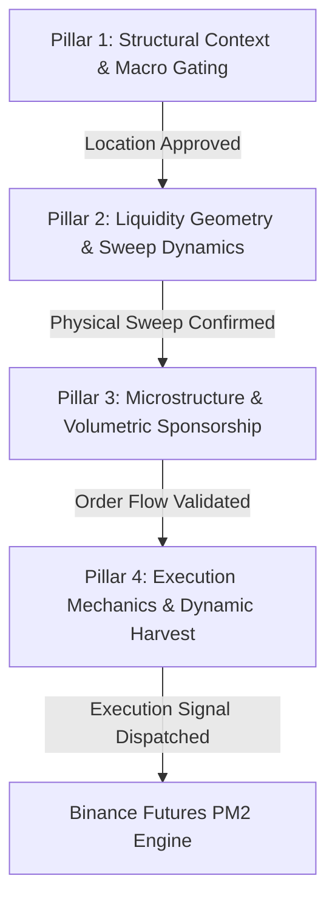
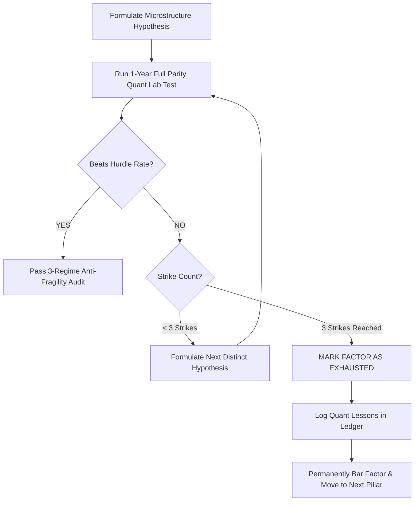

# 🧭 Directive 09 — Institutional Quant Research Roadmap & Anti-Tunnel Optimization Protocol

> **Document Type:** Master Quantitative Research Protocol & Strategy Progression Ledger  
> **Status:** ACTIVE & INVIOLABLE  
> **Target Asset:** ETHUSDC.p (Binance USDⓈ-M Futures · 5m Execution Anchor)  
> **Core Baseline Champion:** `factory_sr_5m_fvg_ce_sniper` (+191.9R Net, 1.61 PF, -6.50R Max DD)  
> **Last Updated:** 2026-09-04  

---

## 🏛️ 1. Executive Philosophy: Escaping the "Tight Tunnel"

In systematic quantitative finance, researchers frequently succumb to the **"Tight Tunnel Trap"**:
1. **The Micro-Tweaking Loop (Local Optima):** Spending weeks iterating over microscopic parameter increments (e.g. SL buffer from 0.10 to 0.12, or Volume SMA from 20 to 22), achieving cosmetic, in-sample gains that degrade upon out-of-sample live execution.
2. **The Dormant Feature Graveyard:** Computing vast arrays of high-order microstructure data (OLS regression velocity, CVD absorption, order flow imbalance, HTF dealing range discount/premium, session killzone transitions) while the active execution engine uses only a tiny fraction of it.
3. **The Discretionary Rabbit Hole:** Introducing arbitrary indicators or ambiguous retail concepts that break the mathematical integrity of Sweep & Reclaim, chasing ghosts rather than real market physics.

### 🛡️ The Anti-Tunnel Mandate
* **Immutable Physical Anchor:** The core trading logic remains **Sweep & Reclaim** (liquidity resting above/below structural swing pivots or session extremes swept and aggressively reclaimed).
* **Orthogonal Factor Exploration:** Features are tested strictly across **4 independent, non-overlapping pillars**. We never test combinations blindly.
* **Hypothesis-Driven Science:** Every test must begin with an explicit market microstructure hypothesis grounded in order flow physics (e.g. buyer exhaustion, limit order absorption, maker replenishment).
* **The Zero-Guessing Parity Mandate:** All hypotheses are evaluated candle-by-candle across the full 1-Year historical dataset (106,560 5m bars) in Quant Lab under 100% bit-for-bit parity with the PM2 Headless Daemon.

---

## ⚖️ 2. The Benchmark Hurdle Rate & Acceptance Criteria

Any new candidate setup, factor filter, or parameter modification must satisfy the **Dual-Pillar Superiority Rule** against our verified 1-Year Institutional Champion:

### 🏆 The Champion Baseline Benchmark (`factory_sr_5m_fvg_ce_sniper`)
$$\begin{aligned}
\text{Dataset:} &\quad 106,560\text{ 5m Candles (1 Full Year: Aug 2023 – Aug 2024)} \\
\text{Net Realized R:} &\quad \mathbf{+191.90R} \\
\text{Profit Factor (PF):} &\quad \mathbf{1.61} \\
\text{Execution Win Rate:} &\quad \mathbf{53.4\%}\text{ (Ex-Scratch: } 60.2\%\text{)} \\
\text{Max Drawdown (DD):} &\quad \mathbf{-6.50R} \\
\text{Compounded Return (\$10k @ 2\%):} &\quad \mathbf{+3,808\%}\text{ (\$390,823.00)} \\
\text{Max Compounded DD:} &\quad \mathbf{13.4\%} \\
\text{Trade Frequency:} &\quad 206\text{ Trades/Year (}\approx 0.56\text{ trades/day)}
\end{aligned}$$

### 🚦 Acceptance Gatekeeper (The Hurdle Rate)
A candidate setup qualifies for promotion **ONLY IF** it achieves:
1. **Superior Performance:**
   $$\text{Net Return} > +191.90\text{R} \quad \mathbf{OR} \quad \text{Max Drawdown} < -6.00\text{R}$$
2. **Anti-Degradation Constraints:**
   $$\text{Profit Factor (PF)} \ge 1.50$$
   $$\text{Max Drawdown (DD)} \le -8.00\text{R}$$
   $$\text{Sample Size (N)} \ge 150\text{ Trades/Year}$$
   $$\text{Compounded Max DD} \le 16.0\%$$

*If a candidate fails any of these criteria, it is immediately discarded. No exceptions.*

---

## 🧱 3. The 4 Orthogonal Factor Pillars & Engine Feature Inventory

The Quant Engine's intelligence is strictly compartmentalized into 4 independent layers. Research and optimization proceed **one pillar at a time**:



### 📊 Feature Inventory: Active vs. Dormant Metrics

```
┌───────────────────────────────────────────────────────────────────────────────────┐
│ PILLAR 1: STRUCTURAL CONTEXT & MACRO GATING (WHERE?)                              │
├──────────────────────────────────────┬────────────────────────────────────────────┤
│ Currently Active in Champion         │ Dormant Intelligence in Quant Engine       │
├──────────────────────────────────────┼────────────────────────────────────────────┤
│ • Discount/Premium Dealing Range     │ • BTC vs ETH Multi-Timeframe SMT           │
│   Equilibrium Gating (50% Range Gate)│ • Prior Day/Week Value Area (VAH, VAL, POC)│
│                                      │ • Macro 1D/1H Trend Alignment Vector       │
│                                      │ • HTF Draw on Liquidity (DOL) Distance     │
└──────────────────────────────────────┴────────────────────────────────────────────┘
┌───────────────────────────────────────────────────────────────────────────────────┐
│ PILLAR 2: LIQUIDITY GEOMETRY & SWEEP DYNAMICS (WHAT?)                             │
├──────────────────────────────────────┬────────────────────────────────────────────┤
│ Currently Active in Champion         │ Dormant Intelligence in Quant Engine       │
├──────────────────────────────────────┼────────────────────────────────────────────┤
│ • 5m Swing Pivots (Major/Internal)   │ • Sweep Velocity (1-bar breach vs chop)    │
│ • Asian Session High/Low             │ • Anchor Cluster Density (Multi-touch taps)│
│ • London Session High/Low            │ • Anchor Age Decay (Penalizing > 48h bars) │
│ • Prior Day High/Low (PDH/PDL)       │ • Sweep Depth ATR Ceiling (Anti-blowout)   │
│ • Rule 1: Wave Deduplication         │ • Inner Swing Pivot Elimination Filter     │
└──────────────────────────────────────┴────────────────────────────────────────────┘
┌───────────────────────────────────────────────────────────────────────────────────┐
│ PILLAR 3: MICROSTRUCTURE & VOLUMETRIC SPONSORSHIP (WHY?)                         │
├──────────────────────────────────────┬────────────────────────────────────────────┤
│ Currently Active in Champion         │ Dormant Intelligence in Quant Engine       │
├──────────────────────────────────────┼────────────────────────────────────────────┤
│ • Volume Expansion (>= 1.20x SMA20)  │ • OLS Displacement Slope (Impulse angle)   │
│ • Delta Dominance (>= 50.0%)         │ • Cumulative Volume Delta (CVD) Divergence │
│ • Body-to-Range Ratio (>= 0.40)      │ • Volumetric Absorption at Sweep Extreme   │
│                                      │ • Taker Aggression vs Resting Depth Imbal  │
└──────────────────────────────────────┴────────────────────────────────────────────┘
┌───────────────────────────────────────────────────────────────────────────────────┐
│ PILLAR 4: EXECUTION MECHANICS & DYNAMIC HARVEST (HOW TO EXIT?)                     │
├──────────────────────────────────────┬────────────────────────────────────────────┤
│ Currently Active in Champion         │ Dormant Intelligence in Quant Engine       │
├──────────────────────────────────────┼────────────────────────────────────────────┤
│ • FVG 50% CE Retest Entry            │ • Volatility-Adaptive TP2 (Expanding ATR)  │
│ • 2-Stage TP (50% @ 1.0R / 50% @ 1.4R│ • Time-Decay Stale Trade Exit (> 12 bars)  │
│ • Rule 4: Early Breakeven (+0.40R)   │ • HTF DOL Magnet Runner Routing (TP3)      │
│ • Next-Bar Ratchet Protection        │ • Trailing SL to Dynamic Swing Pivots      │
│ • Structural Stop Loss (0.10 ATR)    │ • Post-Loss Directional Cooldown Tuning    │
└──────────────────────────────────────┴────────────────────────────────────────────┘
```

---

## 🛑 4. Anti-Tunnel Governance: The 3-Strike Hypothesis Rejection Rule

To permanently eradicate circular development and analysis paralysis, every research phase is bound by the **3-Strike Rule**:



1. **Max 3 Hypotheses per Factor:** Under any given research pillar, we test at most 3 distinct, pre-defined microstructure hypotheses.
2. **Immediate Discard on Strike 3:** If all 3 hypotheses fail to beat the Champion Hurdle Rate across the full 1-year dataset, that factor is officially classified as **`EXHAUSTED / NO_EDGE`**.
3. **Permanent Lock:** Once a factor is marked `EXHAUSTED`, agents and developers are **strictly prohibited** from revisiting or micro-tweaking it. The findings and quantitative reasons are recorded in the Fine-Tuning Ledger, and research immediately advances to the next pillar.

---

## 🔬 5. Phased Research & Optimization Sequence (ETHUSDC Tailored)

ETHUSDC futures price action is characterized by frequent false stop sweeps, aggressive market-maker absorption during London/NY transitions, and severe sensitivity to BTC market correlation. Therefore, research follows this factual sequence:

### Phase 1: Microstructure & Volumetric Absorption (Pillar 3)
* **Objective:** Leverage order flow delta, CVD divergence, and OLS velocity to eliminate fake reclaim traps without degrading entry fill rate.
* **Target Metric:** Push Win Rate from $53.4\% \to 58.0\%+$ while holding Drawdown $\le -6.5\text{R}$.

### Phase 2: Liquidity Anchor Quality & Sweep Dynamics (Pillar 2)
* **Objective:** Test anchor weighting (Session Extremes vs Swing Pivots), sweep depth ATR ceilings (preventing entry into runaway momentum freight trains), and sweep velocity.
* **Target Metric:** Cut total losing trades by $15\%$ while maintaining $\ge 160$ trades/year.

### Phase 3: Dynamic Harvest & Target Expansion (Pillar 4)
* **Objective:** Test volatility-adaptive target scaling (expanding TP2 to $1.6\text{R} - 1.8\text{R}$ in high-ATR regimes) and time-based stale trade exits.
* **Target Metric:** Boost Net Return from $+191.9\text{R} \to +220.0\text{R}+$ while holding Max Drawdown $\le -6.0\text{R}$.

### Phase 4: Macro HTF Context & Intermarket SMT (Pillar 1)
* **Objective:** Integrate BTC vs ETH SMT divergence and 1H dealing range equilibrium to veto counter-trend knife catches.
* **Target Metric:** Compress Max Drawdown from $-6.5\text{R} \to < -5.0\text{R}$.

---

## 🚀 6. The Staged Operational Promotion Protocol

No code or parameter modification reaches live PM2 execution without completing this 4-step deployment pipeline:

```
[1. Quant Lab 1Y Proof] ──► [2. 3-Regime Audit] ──► [3. Ledger Sync] ──► [4. PM2 Hot-Reload]
  106,560 5m Candles           Bull / Bear / Chop       Directive & Blueprint    Zero-Downtime VPS
```

1. **Step 1: Quant Lab 1-Year Proof:** Full candle-by-candle backtest across 106,560 5m bars. Must strictly clear the Hurdle Rate.
2. **Step 2: 3-Regime Anti-Fragility Audit:** Must be profitable across all 3 historical sub-regimes:
   - *Trending Bull:* Q1 2024 ETF Expansion (Feb 1 – Mar 31, 2024)
   - *Violent Bear Dump:* Aug 5, 2024 Yen Carry Crash (Jul 25 – Aug 10, 2024)
   - *Low-Vol Summer Chop:* Range Compression (Jun 1 – Jul 15, 2024)
3. **Step 3: Ledger Documentation:** Log setup ID, parameters, performance delta, and institutional lessons in the Fine-Tuning Ledger below and update `directives/master_blueprint.md`.
4. **Step 4: Live PM2 Hot-Reload:** Register the setup in `scannerPresets.ts`, update UI defaults, and dispatch an atomic `UPDATE_SETTINGS` command to the VPS daemon without interrupting the background process.

---

## 📋 7. Dynamic Progress & Fine-Tuning Ledger

This live ledger tracks every completed, active, and pending research experiment. Update this section after every experiment run.

### 📊 Master Progress Summary
* **Current Active Champion:** `factory_sr_5m_fvg_ce_sniper` (+191.9R Net, 1.61 PF, -6.50R Max DD)
* **Current Active Phase:** **Phase 1: Microstructure & Volumetric Absorption (Pillar 3)**
* **Active Experiment:** `EXP-P1-01` (CVD Absorption & Negative Delta on Bullish Sweep)
* **Total Completed Experiments:** 0
* **Total Factors Exhausted:** 0

---

### 🧪 Experiment Tracking Matrix

| Experiment ID | Pillar | Factor Tested | Core Hypothesis | Net R | PF | Max DD | Win Rate | Outcome / Status |
| :--- | :--- | :--- | :--- | :--- | :--- | :--- | :--- | :--- |
| **BENCHMARK** | — | `FVG_CE_SNIPER` | Champion Control Baseline | **+191.9R** | **1.61** | **-6.5R** | **53.4%** | 🟢 **ACTIVE CHAMPION** |
| `EXP-P1-01` | P3 | CVD Absorption | Negative Delta on Bullish Sweep (Absorption) | TBD | TBD | TBD | TBD | 🟡 **PLANNED** |
| `EXP-P1-02` | P3 | OLS Velocity Gate | Minimum OLS displacement angle for reclaim | TBD | TBD | TBD | TBD | ⚪ PENDING |
| `EXP-P1-03` | P3 | Vol Expansion 1.35x| Stricter volume surge threshold (1.2x -> 1.35x) | TBD | TBD | TBD | TBD | ⚪ PENDING |
| `EXP-P2-01` | P2 | Session Universes | Asian/London only vs Swing Pivots | TBD | TBD | TBD | TBD | ⚪ PENDING |
| `EXP-P2-02` | P2 | Sweep Depth Ceiling| ATR ceiling (max 0.40 ATR) to avoid blowouts | TBD | TBD | TBD | TBD | ⚪ PENDING |
| `EXP-P3-01` | P4 | Vol-Adaptive TP2 | Dynamic TP2 expansion in high ATR regimes | TBD | TBD | TBD | TBD | ⚪ PENDING |
| `EXP-P4-01` | P1 | BTC SMT Alignment | 1H BTC SMT divergence gating on sweeps | TBD | TBD | TBD | TBD | ⚪ PENDING |

---

### 🧠 Institutional Lessons & Fine-Tuning Log

*Document every quantitative truth discovered, hypothesis failure, and structural insight here to prevent repeating mistakes.*

#### Entry 001 (2026-09-04) — The FVG CE Sniper & Wave Deduplication Breakthrough
* **Finding:** Switching entry geometry from FVG Proximal to FVG 50% Consequent Encroachment (CE) paired with Rule 1 Wave Deduplication and accelerated +0.40R Early Breakeven reduced Max Drawdown by over $50\%$ (from $-13.2\text{R} \to -6.5\text{R}$) while increasing Net Return from $+155.4\text{R} \to +191.9\text{R}$ and Profit Factor from $1.35 \to 1.61$.
* **Microstructure Rationale:** Entering at the 50% mean threshold of the displacement imbalance provides a strictly superior risk-to-reward ratio. Tighter structural stop distance ($|Entry - SL|$) directly increases compounded contract size per trade for the same dollar risk.
* **Anti-Tunnel Lesson:** Never accept wide stop losses when an imbalance offers a clean 50% mathematical discount. Always simulate the Next-Bar Ratchet Rule to ensure breakeven adjustments accurately reflect live exchange mechanics.
