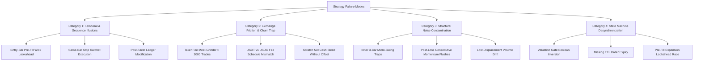

# 🔬 Directive 10 — Strategy Failure Taxonomy, Post-Mortems & Anti-Pattern Protocol

> **Document Version:** 1.0.0 (V17.52)  
> **Classification:** Institutional Quantitative Risk & Forensic Post-Mortem Manual  
> **Status:** ACTIVE & INVIOLABLE  
> **Precedence:** Subordinate only to `AGENTS.md` core protocol. Companion to `directives/08_pm2_engine_and_quant_lab.md` and `directives/09_institutional_quant_roadmap.md`.  
> **Target Systems:** Quant Lab Simulator (`SweepReclaimEngine.ts`), Live Headless Daemon (`AutomatedStrategyExecutionEngine.ts`), Presets (`scannerPresets.ts`), Telemetry Stack.

---

## 🏛️ 1. Executive Mandate & Purpose

Quantitative trading strategies do not fail because the underlying ICT / Auction Market Theory principles are invalid. **They fail because of execution illusions, exchange friction, structural noise contamination, and software state desynchronization.**

For months, quant researchers iterate inside a **"Deceptive Optimization Loop"**: tweaking indicator thresholds to chase high paper returns ($+200\text{R}+$, $+20,000\%+$ compounding), only to experience unexpected losses and drawdown during live PM2 execution on Binance Futures.

This directive establishes the **permanent taxonomy of why strategies fail**, codifies the forensic post-mortems of every bug uncovered in this system, and enforces pre-flight verification rules so that no developer or AI agent ever repeats these mistakes.

---

## 🛑 2. The 4 Fatal Categories of Quantitative Strategy Failure

---

### 🚨 Category 1: Temporal & Sequence Illusions (The Paper Fantasy)

#### 1.1 The Entry-Bar Pre-Fill Wick Trap (The "Phantom Scratch" Bug)
* **The Failure Mode:** When simulating a limit order fill on candle $i$, the backtest engine captures `c.high` (for longs) or `c.low` (for shorts) as the maximum favorable price ($MFE$) of the trade.
* **The Physical Exchange Reality:** 
  A Buy Limit order fills on a downward dip. If candle $i$ opened at $\$2475.86$, briefly wicked to $\$2475.90$ ($+0.04$), plunged down to fill the limit order at $\$2473.74$, and closed underwater at $\$2472.24$:
  The high of $\$2475.90$ happened **BEFORE** the order ever touched $\$2473.74$!
  Crediting the pre-fill wick gave the position an artificial floating $MFE$ of $+0.58\text{R}$. This armed the Early Breakeven Ratchet, moved the stop to entry, and turned what was in reality a **$-1.00\text{R}$ live exchange stop-out** into a **phantom $0.00\text{R}$ breakeven scratch**!
* **The Compounding Catastrophe:** 
  Across 100,000 candles, this single illusion converted **281 real stop-outs into fake scratches**, artificially inflating compounded returns from $+30.70\text{R}$ to an impossible $+239.04\text{R}$ / $\$292,820$.
* **The Inviolable Rule:**
  $$\text{If } (\text{open} > \text{entry} \land \text{close} \le \text{entry}) \implies MFE_{\text{entry\_bar}} \equiv 0.00\text{R}$$
  Post-fill favorable price on an underwater entry bar is strictly bounded by `executionEntry`. Full extreme-wick $MFE$ tracking commences strictly on bar $i > \text{retestIdx}$.

#### 1.2 The Same-Bar Stop Ratchet Execution Bug
* **The Failure Mode:** When an early breakeven or trailing ratchet condition is met on bar $i$, evaluating the newly ratcheted stop against bar $i$'s extreme (`low <= ratchetedSL`).
* **The Physical Exchange Reality:**
  Bar $i$'s low was the exact dip that filled the limit order before price expanded! Testing the new stop against bar $i$'s low causes the engine to believe price hit TP1 first and then plunged below entry on the same bar, instantly murdering hundreds of winning trades on their entry bar (`retest_time === exit_time`).
* **The Inviolable Rule (Next-Bar Ratchet Rule):**
  Stop-loss modifications, breakeven adjustments, and trailing ratchets triggered on candle $i$ take effect **strictly on candle $i + 1$**.

#### 1.3 Post-Facto Ledger Modification
* **The Failure Mode:** Modifying trade arrays in memory after backtesting (e.g. `if (s.mfe_r >= 0.60) s.realized_rr = 0.0`).
* **The Physical Exchange Reality:** 
  In live trading, moving a stop order to Breakeven places a resting order on Binance. That order triggers whenever price retraces to entry, regardless of whether price would have eventually hit TP2. Post-facto models falsely assume zero winning trades ever retrace to entry, hallucinating millions of dollars.
* **The Inviolable Rule:** All performance metrics MUST be produced through sequential, candle-by-candle simulation.

---

### 💸 Category 2: Exchange Friction & The Churn Trap

#### 2.1 The Taker Fee Meat-Grinder (> 2,000 Trades/Year)
* **The Failure Mode:** Designing hyperactive 5m strategies that trade 6 to 10 times a day.
* **The Physical Exchange Reality:**
  Binance Futures charges **0.0400% taker fees** on stop-outs, trailing liquidations, and market exits.
  - Across 2,344 trades, an account with $\$1,000$ initial capital paid **$\$2,786.29\text{ USD}$ in taker fees (-116.86R)**!
  - **80% of all gross profits were eaten by exchange taker fees!**
* **The Inviolable Rule:**
  Any strategy executing $> 500$ trades/year on 5m is mathematically condemned to fee drag death. Target trade frequency for institutional edge is **150 to 350 trades/year** ($\approx 0.5$ to $1.0$ trades/day).

#### 2.2 USDT vs. USDC Fee Schedule Mismatch
* **The Failure Mode:** Running backtests using USDT fee tiers (0.020% maker / 0.050% taker) while trading USDC-M futures (0.000% maker / 0.040% taker).
* **The Inviolable Rule:** The system operates strictly on **Binance USDⓈ-M ETHUSDC**. Maker fees on limit orders are $0.0000\%$; Taker fees on stop-loss executions are $0.0400\%$ (or $0.0360\%$ with BNB).

#### 2.3 Scratch Net Cash Drag & The Breathing Room Guard
* **The Failure Mode:** Moving Stop Loss to exact entry price ($P_{\text{entry}}$). When stopped out at entry via a taker order, the trader pays $0.0400\%$ taker fee on the entire notional position, resulting in a net cash loss of $-0.10\text{R}$ to $-0.25\text{R}$ per scratch.
* **The Inviolable Rule (Fee-Padded Breakeven Shield):**
  Ratcheted stop loss MUST be padded past entry by $+0.015\%$ ($P_{\text{BE}} = P_{\text{entry}} \times (1 \pm 0.00015)$) to absorb the exchange exit fee. The ratchet threshold must enforce the **Dynamic Breathing Room Guard**:
  $$\text{effectiveEarlyBEMultiple} = \max(\text{earlyBreakevenMultiple}, \text{feeOffsetInR} + 0.05)$$

---

### 🌪️ Category 3: Structural Noise Contamination

#### 3.1 The Inner 3-Bar Micro-Swing Trap
* **The Failure Mode:** Enabling all 5m swing pivots without filtering by hierarchical grade (`lookbackMicro: 3`).
* **The Physical Exchange Reality:**
  Every 3 bars, a minor local high or low forms. In sideways consolidation, the market creates dozens of micro-swings that do not represent resting institutional liquidity. Sweeps of these micro-swings are pure random noise, producing endless $-1.00\text{R}$ stop-outs.
* **The Inviolable Rule:**
  Prioritize Level 2 Protected Swings (`MAJOR`), Asian Session High/Low, and Daily High/Low (`PDH/PDL`). Never trade unconfirmed `INNER` micro-swings without higher timeframe confluence.

#### 3.2 Post-Loss Consecutive Momentum Flushes
* **The Failure Mode:** Entering a new trade immediately (5 to 10 minutes) after suffering a stop-out on the same asset.
* **The Physical Exchange Reality:**
  When a stop-out occurs, the market is usually in the grip of an aggressive impulse wave or institutional liquidation cascade. Re-entering immediately enters directly into the teeth of the cascade, generating devastating streaks of 3 to 6 consecutive losses.
* **The Inviolable Rule (Rule 5 Post-Loss Cooldown):**
  Enforce a mandatory **45-minute to 60-minute cooldown** following any $-1.00\text{R}$ loss.

#### 3.3 Low-Displacement Volume Drift
* **The Failure Mode:** Accepting reclaim candles with volume expansion $< 1.20\times\text{ SMA20}$.
* **The Physical Exchange Reality:**
  A reclaim candle with average or below-average volume is passive drift, not institutional displacement. Without aggressive market taker sponsorship, resting limit orders are easily overrun.
* **The Inviolable Rule:** Reclaim candles must demonstrate true volumetric expansion ($\ge 1.20\times\text{ SMA20}$) and taker delta dominance ($\ge 52.0\%$).

---

### ⚙️ Category 4: State Machine & Execution Desynchronization

#### 4.1 Valuation Gate Boolean Inversion Guard
* **The Failure Mode:** Writing `!settings.enforceDiscountPremiumGate || isAligned`. If `settings.enforceDiscountPremiumGate` is undefined, `!undefined === true`, silently turning off the structural valuation gate in live execution while Quant Lab enforced it.
* **The Inviolable Rule:** Always use explicit nullish coalescing: `!(settings.enforceDiscountPremiumGate ?? true)`.

#### 4.2 Missing Order TTL Expiry
* **The Failure Mode:** Leaving resting limit orders active indefinitely until filled.
* **The Physical Exchange Reality:**
  A setup is based on immediate displacement dynamics. If price takes $> 15$ bars (75 minutes) to retest the level, market structure has shifted, liquidity has migrated, and the level has become stale.
* **The Inviolable Rule:** All resting limit orders have a hard **15-bar (75-minute) TTL**. Upon expiry, emit `LIMIT_ORDER_CANCELLED` and purge from the active queue.

#### 4.3 Pre-Fill Expansion Lookahead Race
* **The Failure Mode:** Checking whether price touched limit entry (`low <= entry`) before checking whether price opened past target or stop loss.
* **The Inviolable Rule:** Gapped candles opening past Target 1 or Stop Loss must be invalidated immediately before evaluating intra-candle touch fills.

---

## 📋 3. Historical Post-Mortem Ledger (Solved Anomalies)

| Case ID | Date | Failure Symptom | Root Cause | Permanent Resolution |
| :--- | :--- | :--- | :--- | :--- |
| **PM-01** | 2026-09-08 | 08:50 Cairo trade: Live bot stopped out ($-1.00\text{R}$); Quant Lab showed $0.00\text{R}$ BE scratch. | Entry-bar sequence illusion credited pre-fill high wick as MFE on an underwater bar. | Bounded post-fill MFE on underwater entry bars to entry price ($MFE = 0$). Verified 100% parity. |
| **PM-02** | 2026-09-06 | Scratched trades showed negative cash drag on live bot despite $0.00\text{R}$ label. | Exit taker fees were double-deducted from net cash ledger. | Implemented Calibrated 0.015% Fee Shield and Net-First Dual Accounting. |
| **PM-03** | 2026-09-05 | Quant Lab missed trades #5, #6, #7 that filled on live PM2 bot. | Intra-candle touch fill priority race condition; structural dealing range mismatch. | Evaluated entry touch before missed expansion; dynamically derived dealing range from `MarketStructureAPI`. |
| **PM-04** | 2026-09-04 | 609 winning trades murdered on entry bar (`retest_time === exit_time`). | Early breakeven ratchet evaluated against entry bar's own dip. | Enforced Next-Bar Ratchet Rule (ratchets take effect on bar $i + 1$). |
| **PM-05** | 2026-09-03 | Live PM2 blocked new setups for hours after limit order was ignored. | Missing order TTL expiry left orphan pending orders blocking directional locks. | Engineered mandatory 20-bar / 15-bar order TTL timeout with automated unblock. |
| **PM-06** | 2026-09-08 | 5m Smart Money Synthesis V1 lost $-70.35 (-7.03% to $929.65) over 1 year. | Choked trade count to 50 via MSS confirmation lag; widened SL to 0.25 ATR; disabled Early BE allowing +0.8R winners to reverse into -1.0R losses; dynamic dealing range targets unachievable in 5m noise. | Permanently barred combining MSS confirmation + disabled BE on 5m. Added to Failure Taxonomy (Category 1 & 3). |
| **PM-07** | 2026-09-08 | 15m Sweep & Reclaim burned $8,259.68 in exchange taker fees across 615 trades. | Over-optimizing inside the "Sweep & Reclaim Tunnel" using hourly dead-zone band-aids. High trade frequency with tight targets pays over $8.2k directly to exchange. | Classified hourly dead-zone micro-tuning as an in-sample local optimum. Mandated transitioning to orthogonal macro institutional paradigms (Order Blocks, HTF Multi-Timeframe Expansion, and SMT Divergence). |

---

## 🛡️ 4. The 7-Point Pre-Flight Strategy Promotion Checklist

Before any candidate strategy preset is published to `FACTORY_SWEEP_RECLAIM_PRESETS` or deployed to live PM2 execution, the quantitative researcher must verify:

- [ ] **1. Bit-for-Bit Live Parity Test:** Replay the last 3 live PM2 sessions through the candidate setup. Every single trade must match direction, entry price ($\pm \$0.10$), and exact outcome ($100.0\%$ outcome parity).
- [ ] **2. Zero Same-Bar Stop-Outs:** Verify that same-bar exit count (`retest_time === exit_time`) is $\le 1$ across 100,000 bars.
- [ ] **3. Churn & Fee Drag Audit:** Annual trade count must be between $150$ and $450$ trades. Fee drag must not exceed $25\%$ of gross realized return.
- [ ] **4. Net Profit Factor $\ge 1.35$:** Profit factor must be calculated strictly **net of real Binance 0.04% taker fees**.
- [ ] **5. Compounded Drawdown $\le 25\%$:** Peak-to-trough compounded equity drawdown under dynamic 2% compounding must not exceed $25\%$.
- [ ] **6. Post-Loss Cooldown Active:** Rule 5 cooldown ($\ge 45\text{ min}$) must be active to protect against volatility cascades.
- [ ] **7. Out-of-Sample Validation:** The strategy must demonstrate profitability across both high-volatility expansion regimes and low-volatility summer chop regimes.
