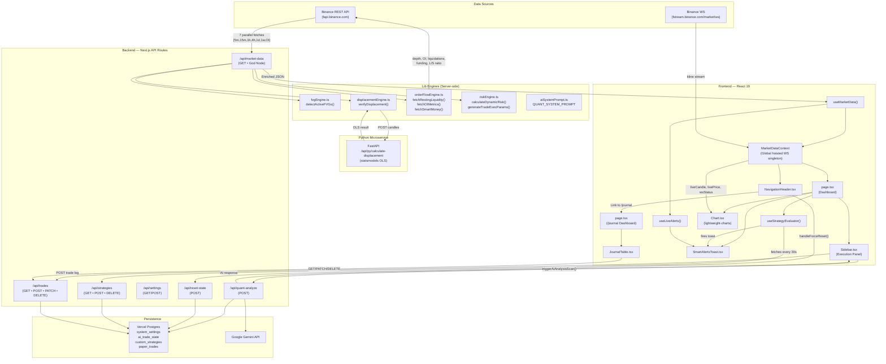
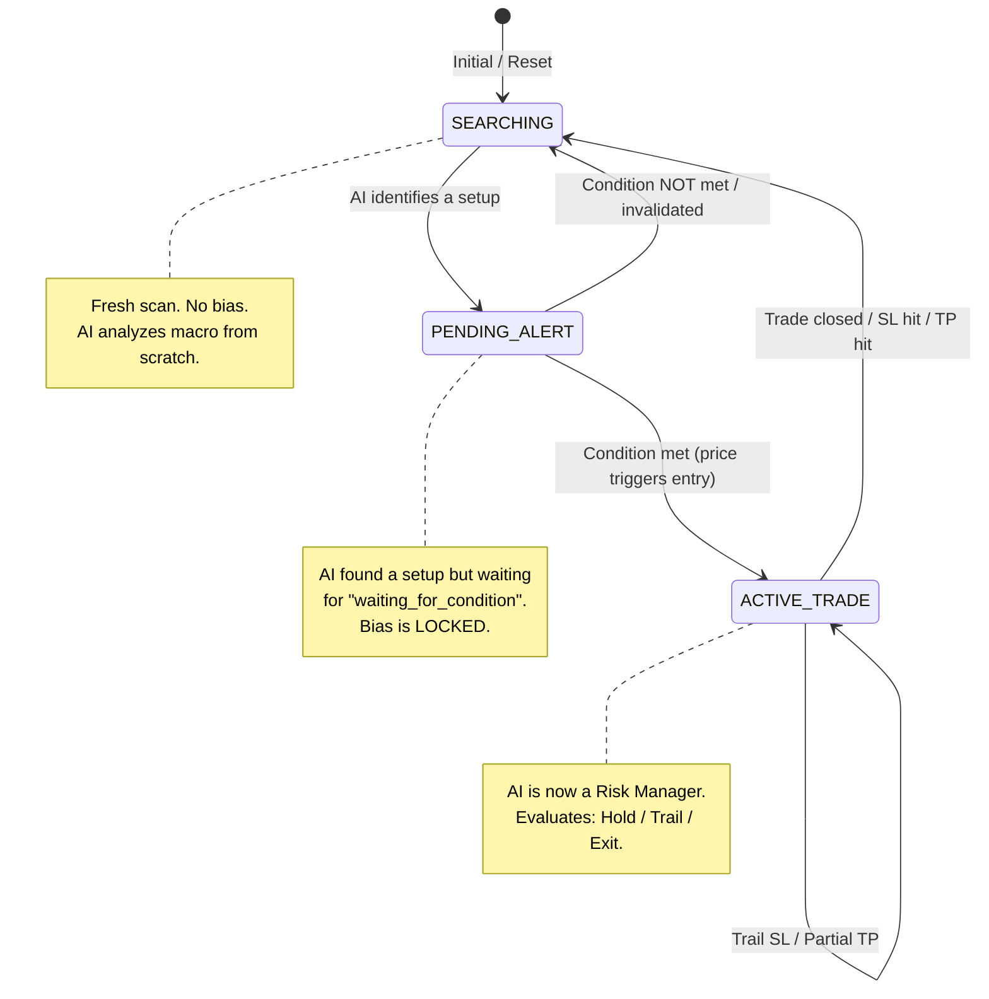

# 🏛️ MASTER BLUEPRINT — Flow-State Quant Engine V12.0

> **Classification:** Institutional Architecture Document  
> **Generated:** 2026-05-30  
> **Last Updated:** 2026-06-09 (V12.0.15 — Active Trade Closure Cleanup & Replay Auto-Closure)  
> **Scope:** Full System Deconstruction — Satellite Scan + Microscopic Audit  
> **Source Files Analyzed:** 66+ across TypeScript (Next.js 16), Python (FastAPI), Markdown directives, and MCP configurations.

## 🆕 V12.0.15 Changelog — Active Trade Closure Cleanup & Replay Auto-Closure (Completed)

### 1. Journal Action Event Propagation (`src/components/JournalTable.tsx`)
- Configured manual trade toggles, closures, and hard deletions (`handleToggleStatus`, `handleClosePosition`, and `handleDeleteTrade`) to dispatch appropriate window events (`trades-refresh` or `backtest-trades-refresh` based on `isBacktest` context).
- This ensures parent dashboard page states (`openTrades` / `backtestTrades`) immediately fetch the latest ledger, updating the chart and removing closed trade entries.

### 2. Replay Auto-Closure Engine (`src/app/backtest/page.tsx`)
- Developed a client-side execution monitoring loop (`useEffect` dependency on step advancing / candle updates) to check active `OPEN` backtest positions against replayed candle highs/lows.
- Automatically executes and closes positions when price wicks breach target Stop Loss or Take Profit levels, submitting PATCH updates to `/api/backtest-trades` and dispatching the refresh event to wipe associated visual chart lines immediately.

## 🆕 V12.0.14 Changelog — Draggable Active Trade SL/TP Modifiers (Completed)

### 1. Active Trade Price Lines sync (`src/components/Chart.tsx`)
- Rendered price lines for all open trades dynamically on the chart (Dotted entry line in grey, dashed take-profit line in green, dashed stop-loss line in red).
- Configured drag pointer listeners to allow vertical adjustments of active TP and SL lines.
- Updated the dragging coordinate move handler to slide the target lines smoothly in real-time, providing immediate visual feedback before committing updates to the backend.

### 2. Trade Levels Modification API Endpoint (`src/app/api/trades/route.ts` & `src/app/api/backtest-trades/route.ts`)
- Augmented the `PATCH` handlers and in-memory fallbacks of both paper trades and backtest trades routes to accept optional updates of `take_profit` and `stop_loss` levels without requiring a status change.

### 3. Parent Propagation Linkage (`src/app/page.tsx` & `src/app/backtest/page.tsx`)
- Sourced and tracked active open trades lists, piping them down to `<Chart>`.
- Bound callback update handlers (`handleUpdateTradeLevels` and `handleUpdateBacktestTradeLevels`) to dispatch PATCH requests to the respective trade APIs on drag release, triggering state/ledger refreshes.

## 🆕 V12.0.13 Changelog — Interactive Price Inputs & Keyboard Hotkey (Completed)

### 1. Interactive Coordinates Inputs (`src/components/ManualOrderPanel.tsx`)
- Converted the static coordinates price displays (Entry, TP, SL) into Brutalist-styled numeric input fields (using `type="number"` and `step="0.05"`).
- Enabled full dynamic two-way data-binding, allowing users to type precise prices or adjust them manually, with `entryPrice` inputs automatically disabled when `MARKET` type is active.

### 2. Global Hotkey Toggle (`src/app/page.tsx` & `src/app/backtest/page.tsx`)
- Assigned the key `t` / `T` (Trading) to globally toggle manual trading mode on and off in both live and replay contexts.
- Wrapped key handling inside input typing guards (`document.activeElement` check) to prevent toggles and step-advances when a user is typing coordinates or other input fields.

## 🆕 V12.0.12 Changelog — Interactive Manual/Paper Trading Order Entry Layer (Completed)

### 1. Appearance Customization & Theme Sync
- **Parameters:** Added three settings variables (`theme_manual_entry_line`, `theme_manual_tp_line`, `theme_manual_sl_line`) representing colors of active entry reference, target/take-profit, and stop-loss lines.
- **Theme Sync (`src/components/ThemeSync.tsx`):** Injected these customization parameters into dynamic style tags as CSS variables (`--manual-entry-line`, `--manual-tp-line`, `--manual-sl-line`).
- **Settings Studio (`src/app/settings/page.tsx`):** Implemented ColorPickerItem inputs under Section 3 (Midnight & Daylight modes) mapping directly to the DB key-value format in `system_settings` table.

### 2. Floating Brutalist HUD Panel (`src/components/ManualOrderPanel.tsx`)
- Designed a glassmorphic floating order customization and metrics widget featuring:
  - Toggle selectors for Order Types (`MARKET`, `LIMIT`, `STOP`) and Order Directions (`LONG`, `SHORT`).
  - Risk allocation selector (adjacent constraints from 0.1% to 100%) with quick 0.5%, 1.0%, 2.5% presets.
  - Live calculations of Position Size, Risk-to-Reward Ratio (RR), and Capital Exposure.
  - Active visual warnings (amber alert box) if calculated metrics breach the efficiency floor ($RR < 2.0$).
  - Confirm Execution submittal button with loading states.

### 3. Interactive Chart Drag & Drop Mechanics (`src/components/Chart.tsx`)
- Placed 3 price reference lines corresponding to the order settings.
- Locked the entry line to follow ticking mark prices when `MARKET` type is active.
- Configured dragging listeners (`onPointerDown`, `onPointerMove`, `onPointerUp`) to dynamically capture Y-coordinates, convert them to asset prices snapped to `0.05` tick offsets, and bubble the updates up to parent components.
- Temporarily disabled page scrolling and chart scaling during pointer drags to maintain focus.

### 4. Dual-Mode Execution & Trade Journal Linkage (`src/app/page.tsx` & `src/app/backtest/page.tsx`)
- **Live Mode:** Dispatches `MARKET` orders instantly to `/api/trades`, and holds resting orders in client memory to match against ticking prices before triggering executions.
- **Replay Mode:** Symmetrically queues resting orders inside localized mock memory, executing them candle-by-candle against the high/low bounds of replay candles. Successful executions post to `/api/backtest-trades` to populate the ledger.
- **POST API Adapters (`src/app/api/trades/route.ts` & `src/app/api/backtest-trades/route.ts`):** Enriched parameters checking to allow manual overrides of `stop_loss` and bypass automated risk-gating controls when explicit bounds are supplied.

## 🆕 V12.0.11 Changelog — Volumetric Markers Live Rendering Fix (Completed)

### 1. Unconditional Local Marker Generation (`src/utils/generateChartMarkers.ts`)
- **Bug:** Volumetric Arrows and SMT Circles (from the Volumetric Sponsorship engine) were properly attached to historical data fetched from the API, but failed to calculate and render for active live candles closing via the WebSocket stream.
- **Fix:** Removed the `hasPrecalculatedSignals` early return short-circuit inside `generateVolumetricMarkers`. The volumetric annotator now iterates unconditionally (O(N) loop) on every tick rendering pass, ensuring all newly formed/pushed live candles are dynamically evaluated and correctly annotated without waiting for a full page refresh.

## 🆕 V12.0.10 Changelog — PM Settings Neon SQL `pm_sweep_lookback` SELECT Bug Fix (Completed)

### Root Cause: `pm_sweep_lookback` Never Read From Neon (`src/app/api/settings/route.ts`)
- **Bug:** The `GET /api/settings` handler was missing `pm_sweep_lookback` from the SQL `SELECT` column list. The column was correctly created by `initTables()`, written by the POST upsert, and referenced in the GET response builder — but never fetched from Neon. Result: `termRows[0].pm_sweep_lookback` always evaluated to `undefined`, forcing the `?? 5` fallback on every page load and silently discarding all user customizations to the "Sweep Lookback" slider.
- **Fix:** Added `pm_sweep_lookback` to the `SELECT` clause in the GET handler (`route.ts` line 108).
- **Impact:** All 7 Global Setup Formula Parameters now correctly round-trip through Neon SQL.

### Full PM Parameter Audit Result (All ✅ After Fix)

| Parameter | initTables | GET SELECT | GET Response | POST Upsert | Hook Sync | SettingsModal |
|---|---|---|---|---|---|---|
| `visualize_perfect_movement_only` | ✅ | ✅ | ✅ | ✅ | ✅ | ✅ |
| `pm_atr_multiplier` | ✅ | ✅ | ✅ | ✅ | ✅ | ✅ |
| `pm_volume_sma_period` | ✅ | ✅ | ✅ | ✅ | ✅ | ✅ |
| `pm_min_body_ratio` | ✅ | ✅ | ✅ | ✅ | ✅ | ✅ |
| `pm_max_wick_ratio` | ✅ | ✅ | ✅ | ✅ | ✅ | ✅ |
| `pm_max_retracement_limit` | ✅ | ✅ | ✅ | ✅ | ✅ | ✅ |
| `pm_sweep_lookback` | ✅ | **🔴→✅ FIXED** | ✅ | ✅ | ✅ | ✅ |

## 🆕 V12.0.9 Changelog — Perfect Movement Swing Relaxation & Multi-Swing Sweep Check (Completed)

### 1. Multi-Swing Sweep Check (`src/utils/generateChartMarkers.ts`)
- Upgraded the Phase 1 sweep check in `checkPerfectMovementSetup` to scan the last 5 swing levels instead of just the single absolute most recent swing. This enables robust detection of sweeps on older key structural levels (such as equal lows, equal highs, and double bottoms/tops).

### 2. Swing Grade Expansion (`src/utils/generateChartMarkers.ts`)
- Expanded the swing query filter inside `checkPerfectMovementSetup` to include both `MAJOR` and `INTERNAL` swing grades. This allows valid setups to be identified when price wicks past significant intraday structural levels while avoiding the noise of minor 3-bar pullbacks (`INNER` swings).

## 🆕 V12.0.8 Changelog — Circle Sweep Color Retention & Swings Client-Side Synchronization (Completed)

### 1. Circle Sweep Color Retention (`src/utils/generateChartMarkers.ts`)
- Fixed a visual bug where check box toggle "Filter Chart Volumetrics" forced all `CIRCLE_UP` and `CIRCLE_DOWN` sweep traps to render in a faded grey color. Circles now retain their bright theme-accented colors (`bullishSweepColor` and `bearishSweepColor`) under all filter configurations.

### 2. Client-Side Swings Sync (`src/utils/generateChartMarkers.ts`)
- Re-routed the swing lookup query inside `checkPerfectMovementSetup` to consume client-side calculated `structureState.swings` instead of the empty `full_structure_map.swings` array returned by the API server. This enables correct, real-time historical liquidity sweep evaluations (Phase 1).

### 3. Swing Price Numeric Coercion (`src/utils/generateChartMarkers.ts`)
- Safeguarded comparisons by explicitly coercing pivot price values to numbers (`Number(s.price)`), avoiding dynamic string/number comparison bugs.

### 4. 100% Strategy Parity (`src/hooks/useStrategyEvaluator.ts` & `displacementLayer.ts`)
- Passed the client-side calculated `structureState` down to the `checkPerfectMovementSetup` utility in both the chart visual layer (`displacementLayer.ts`) and the strategy builder's auto-dealing execution hook (`useStrategyEvaluator.ts`), guaranteeing absolute parity between rendered setups and automated trade entries.

## 🆕 V12.0.7 Changelog — Shared Math Parity, Brutalist Control Sliders & Reactive Visual repainting (Completed)

### 1. Shared Math Parity Decoupling (`src/utils/generateChartMarkers.ts`)
- Ensured absolute logical parity between trade executions and visual signals by verifying that both the hook (`useStrategyEvaluator.ts`) and the visual layer (`displacementLayer.ts`) query the identical pure mathematical utility function `checkPerfectMovementSetup`.

### 2. Sleek Dark Brutalist Control Sliders (`src/components/modals/SettingsModal.tsx` & `EquationBuilder.tsx`)
- Upgraded sliders and adjacent numeric precision inputs inside Group F of the System Command Center and the strategy builder to adhere to the rigid "Dark Brutalist" aesthetic:
  - Solid deep-carbon `#09090b` backdrops with thick zinc-800 borders and zero corner rounding.
  - Custom flat slider rails and sharp text boxes using monospace fonts for parameter display.

### 3. Faded Overlay Visual Feedback Strategy (`src/utils/generateChartMarkers.ts`)
- Programmed the volumetric signal generator to render failed setup arrows and circles as faded, 20% opacity gray markers (`rgba(128, 128, 128, 0.20)`). This provides instant visual backtesting and rejection validation on the canvas.
- Highlighted verified setup arrows in neon cyan (`#00f0ff` for LONG) and neon pink (`#ff007f` for SHORT) alongside a "PM" setup indicator.

### 4. Fully Reactive Rendering Layer (`src/components/Chart.tsx`)
- Expanded the rendering context to pass `engineSettings: context.engineSettings` into all active visual layers.
- Added `context.engineSettings` to the Orchestrator's `useEffect` dependency array, triggering immediate, lag-free visual marker repainting on the chart immediately when the user changes settings, without needing a full browser refresh.

## 🆕 V12.0.6 Changelog — Perfect Movement Setup Formula Filter & Live Rendering Reactivity (Completed)

### 1. Unified Real-Time Visual Reactivity (`src/components/Chart.tsx`)
- Upgraded the HTML overlay rendering loop (`renderHtml`) to consume dynamic reactive variables (`dynamicMarketContextData`, `localCandles`, and `dynamicStructureState`) instead of raw parent props.
- Refactored the live candle WebSocket sync hook (`useEffect` on `liveCandle`) to use a clean mapping state update. The system now seamlessly updates ticking ticks and appends newly closed candles to `localCandles` state instantly with the correct `isClosed` status, triggering immediate FVG and marker redraws without page reloads.

### 2. Strategy Settings UI Collapsible Sub-Pane (`src/components/modals/EquationBuilder.tsx`)
- Declared state hooks for the Perfect Movement settings (`editPerfectMovementFilter`, `editPmAtrMultiplier`, `editPmVolumeSmaPeriod`, `editPmMinBodyRatio`, `editPmMaxWickRatio`, `editPmMaxRetracementLimit`, and `isPmPaneOpen`).
- Added a collapsible sub-pane titled **"Perfect Movement Filter (Smart Money Sweet Spot)"** styled inside the Strategy Settings & Trade Execution Parameters grid.
- Bound all parameters (ATR Multiplier, Volume SMA Period, Min Body Ratio, Max Wick Ratio, Max Retracement Limit) to sleek UI Sliders paired with Number Inputs for precise quantitative tuning.
- Updated strategy load (`useEffect` on `selectedId`), create (`handleCreateNew`), and save (`handleSave`) operations to retrieve, initialize, and serialize these parameters inside the strategy JSON logic.

### 3. Quantitative Composite Gate Evaluator (`src/hooks/useStrategyEvaluator.ts`)
- Imported `calculateATR` from `riskEngine.ts` and `annotateCandlesWithVolumetricSignals` from `generateChartMarkers.ts`.
- Implemented `checkPerfectMovementSetup` to enforce the 3-Phase quantitative entry gate:
  - **Phase 1 (Setup Sweep):** Wick of P1 or P2 (`lastClosedIdx - 2` / `lastClosedIdx - 3`) must sweep PDH/PDL, Asian High/Low, London High/Low, or a Major Swing boundary and close back inside.
  - **Phase 2 (Catalyst Confirmation):** Signal candle S (`lastClosedIdx - 1`) must have range $\ge$ multiplier $\times$ ATR, volume $>$ Volume SMA, close with high body conviction (Min Body Ratio / Max Wick Ratio), and taker volume delta aligned with trade direction.
  - **Phase 3 (Delayed Gate):** Confirmation candle C (`lastClosedIdx` which is the last fully closed candle) must close in trade direction, not retrace past the Max Retracement Limit relative to S, and contain no opposing volumetric signals.
- Integrated the Perfect Movement Setup check directly into the strategy execution evaluator `evaluateStrategy` by slicing and annotating active timeframe candles.
- Updated the evaluation debounce lock key check to include `settings.perfect_movement_filter` in the `hasOnClose` check, safely gating the entry to the open of the ticking live candle (`lastClosedIdx + 1`) and preventing duplicate executions.

## 🆕 V12.0.5 Changelog — Order Flow Volumetric Arrow Heuristics (Completed)

### 1. Marker Candle Schema Enrichment (`src/utils/generateChartMarkers.ts`)
- Added optional fields `taker_buy_vol` and `taker_sell_vol` to the `MarkerCandle` interface.

### 2. Localized Order Flow Heuristic Generator (`src/utils/generateChartMarkers.ts`)
- Pivoted arrow strength classification from the backend OLS statistical gate to a localized Order Flow check.
- **Upward Arrows (`ARROW_UP`):** Colored as **Strong** if `taker_buy_vol > taker_sell_vol`.
- **Downward Arrows (`ARROW_DOWN`):** Colored as **Strong** if `taker_sell_vol > taker_buy_vol`.
- **Fallback:** Defaults to **Weak** if taker volume data is missing.
- Muted weak arrows to a semi-transparent theme default (`rgba(255, 255, 255, 0.15)` for dark, `rgba(0, 0, 0, 0.15)` for light).
- Reverted signature of `generateVolumetricMarkers` to remove backend `sponsorship` dependency, enabling historical strong/weak arrow validation directly on the client.

### 3. Layer Plugin Cleanup (`src/lib/chartLayers/plugins/displacementLayer.ts`)
- Removed OLS/sponsorship context variables and cleaned up the `generateVolumetricMarkers` rendering invocation.

## 🆕 V12.0.4 Changelog — Volumetric Strong Arrows Customization in Theme Engine (Completed)

### 1. Theme Configuration & Settings Hook (`src/hooks/useMarketData.ts`)
- Registered `dark_chart_volumetric_strong_arrow` and `light_chart_volumetric_strong_arrow` settings inside `ThemeSettings` interface.
- Set dynamic default values inside `DEFAULT_THEME_SETTINGS` (neon pink `#ff007f` for dark, high-contrast red `#e11d48` for light).

### 2. CSS Custom Properties Synchronization (`src/components/ThemeSync.tsx`)
- Bound light and dark strong arrow colors to the unified `--volumetric-strong-arrow` CSS variable.

### 3. Appearance Customization UI Studio (`src/app/settings/page.tsx`)
- Embedded `ColorPickerItem` selectors under "Section 3: Chart Layout & Indicators" for both Midnight (dark) and Daylight (light) customizers.

### 4. Mathematical Conditional Marker Rendering (`src/utils/generateChartMarkers.ts` & `displacementLayer.ts`)
- Upgraded `generateVolumetricMarkers` to consume active `sponsorship` (`InstitutionalSponsorship`) and identify the latest closed candle.
- Implemented logic gates to flag strong vs. weak arrows: an arrow is classified as **Strong** if it corresponds to the latest closed candle, matches the backend direction (`ACTIVE_BULLISH`/`ACTIVE_BEARISH`), and passes OLS regression validation ($t \ge 1.96$ and $p < 0.05$).
- Programmed weak/unconfirmed historical arrows to use a muted, semi-transparent default color (`rgba(255, 255, 255, 0.15)` for dark mode, `rgba(0, 0, 0, 0.15)` for light mode).

## 🆕 V12.0.3 Changelog — Data Stream Payload Customization & Settings APIs (Completed)

### 1. Database Schema Migration & Settings APIs (`src/app/api/settings/route.ts`)
- Added SQL migration columns `include_btc_correlation`, `include_structure_analysis`, and `include_fvg_detection` to `terminal_settings` database schema.
- Updated `GET` handler to retrieve and serve the new settings with fallback values.
- Updated `POST` handler to parse and upsert the new settings properties.

### 2. SWR React Context Hook & Polling Integration (`src/hooks/useMarketData.ts`)
- Added settings fields to `EngineSettings` interface and `DEFAULT_ENGINE_SETTINGS`.
- Hydrated state from backend `terminalSettings` and synchronized local updates back to `/api/settings`.
- Enriched `/api/market-data` query variables with features flags: `&includeBtc`, `&includeStructure`, and `&includeFvg`.

### 3. Conditional Backend Core Pipelines (`src/app/api/market-data/route.ts`)
- Parsed parameter options `includeBtc`, `includeStructure`, and `includeFvg` in GET handler.
- Conditionalized Binance parallel fetches: dynamically bypasses BTCUSDT endpoints to avoid rate-limiting issues if `includeBtc` is false.
- Conditionalized stateful market structure analyzer `analyzeMarketStructureStateful` (sets empty default bounds if disabled).
- Conditionalized Fair Value Gap scanner: bypasses `detectActiveFVGs` and consolidation if disabled.

### 4. Interactive settings Panel Controls (`src/components/modals/SettingsModal.tsx`)
- Added Group E: Data Stream Features & Payloads in the Settings Modal.
- Rendered UI checkboxes with theme-adaptive styling to toggle settings.

## 🆕 V12.0.2 Changelog — Volumetric Signal Pre-Calculation & Candle Schema Enrichment (Completed)

### 1. Volumetric Signal Annotation Engine (`src/utils/generateChartMarkers.ts`)
- **Action:** Created `annotateCandlesWithVolumetricSignals` to execute the 3-candle sliding window volumetric check in a single pass.
- **Annotated Field:** Attaches `'ARROW_UP' | 'ARROW_DOWN' | 'CIRCLE_UP' | 'CIRCLE_DOWN' | null` directly to the `volumetric_signal` property of each candle object.
- **Refactoring:** Refactored `generateVolumetricMarkers` to consume this pre-calculated state directly, simplifying the rendering loop and ensuring 100% computational alignment between the API payload, backtests, and visual markers.

### 2. REST API Payload Enrichment (`src/app/api/market-data/route.ts`)
- **Action:** Integrated the annotator into standard parallel fetches, lazy-load historical branches, and the offline simulation mock generators.
- **Impact:** All returned candle arrays in the JSON response payload (`candles_5m`, `candles_15m`, etc.) now contain the pre-calculated `volumetric_signal` highlights.

### 3. Backtest Replay Parity (`src/hooks/useBacktestEngine.ts`)
- **Action:** Applied the annotator to `raw1h`, `raw15m`, and `raw5m` candle series inside the day-loader.
- **Impact:** Backtest snapshot exports (copying or downloading payloads) automatically contain the `volumetric_signal` fields for all timeframes, enabling external AI scripts and spreadsheets to read these annotations directly.

### 4. Type Definitions (`src/lib/fvgEngine.ts` & `src/hooks/useBacktestEngine.ts`)
- **Action:** Extended `Candle` and `BtCandle` interface declarations to explicitly define `volumetric_signal`.

## 🆕 V12.0.1 Changelog — Swing-Anchored Volume Profiles & Triple-Vector Bias Upgrade (Completed)

### 1. Volumetric Calculation Engine (`src/lib/quantEngine/VolumeProfileEngine.ts` & `MarketStructureAPI.ts`)
- **Action:** Implemented a high-performance utility `calculateVolumeProfile` for Swing-Anchored Volume Profile (SAVP) calculation, anchored to the timestamps of the major high/low swings of the current dealing range.
- **Formulas & Logic:**
  - Extracts the subset of candles corresponding to the duration of the major swing.
  - Divides the range into 50 equal bins, distributing volume using a fractional overlap algorithm based on candle high/low overlaps.
  - Computes the Point of Control (POC), Value Area High (VAH), and Value Area Low (VAL) at a 70% volume expansion threshold.
  - Computes the Volumetric Sponsorship Ratio (VSR) by splitting the swing range into 4 quadrants and taking the ratio of origin-quadrant volume to termination-quadrant volume.
- **Integration:** Integrated into `buildDealingRange` within `MarketStructureAPI.ts` to attach `profile_metrics` to each `StructuralDealingRange`.

### 2. Triple-Vector Daily Bias Solver (`src/lib/quantEngine/BiasEngine.ts`)
- **Action:** Created the state matrix solver `resolveTripleVectorBias` that computes daily macro bias (`'CONFIRMED_BULLISH' | 'CONFIRMED_BEARISH' | 'NEUTRAL'`) across three vectors:
  - **Vector 1 (Time/AMD):** Price location relative to Cairo's True Day Open (`true_day_open_0700`).
  - **Vector 2 (HTF Magnets):** Distance and direction of the nearest High Timeframe (HTF) magnet (e.g., PWH, DAILY_SIBI, PWL, DAILY_BISI).
  - **Vector 3 (Volume/Liquidity):** Position relative to the active Swing POC and whether structural sweeps/liquidations have occurred.
- **Integration:** 
  - Integrated into `/api/market-data` REST endpoint (`route.ts`) to inject the resolved `macro_daily_bias` into `ipda_metrics`.
  - Integrated into the headless Backtest Engine (`useBacktestEngine.ts`) with identical mathematical rules to maintain complete parity.

### 3. High-Performance Visual Overlays (`src/lib/chartLayers/plugins/structureLayer.ts`)
- **Action:** Upgraded the Lightweight Charts structural layer to render the SAVP Value Area and POC lines.
- **Visual Styles:**
  - Renders the Value Area (VAH to VAL) as a shaded transparent rectangle (8% opacity) spanning from the start of the dealing range to the right edge.
  - Renders the Point of Control (POC) as a solid 2px line using the `--accent` theme color.

### 4. Strategy Architect & Evaluator Integration (`EquationBuilder.tsx` & `useStrategyEvaluator.ts`)
- **Action:** Exposed the new volumetric and bias metrics to the Strategy Builder UI.
- **Metrics Registered:**
  - `MACRO_BIAS` with option fields `['BULLISH', 'BEARISH', 'NEUTRAL']`.
  - `PRICE_VS_POC` with option fields `['ABOVE_POC', 'BELOW_POC', 'INSIDE_VALUE_AREA']`.
- **Evaluator Logic:** Wired the client-side strategy evaluation engine (`useStrategyEvaluator.ts`) to resolve these parameters in real-time on tick data updates.

### 5. Layout & Pricing Context Alignment (`src/app/page.tsx` & `src/app/backtest/page.tsx`)
- **Action:** Resolved a discrepancy where the main "Range Context" metric card was showing day open pricing context (compared against Cairo's 00:00 UTC True Day Open) instead of the actual structural Dealing Range status.
- **Wiring updates:** Re-routed the `pricing` prop in both the live dashboard (`page.tsx`) and backtest dashboard (`backtest/page.tsx`) to pull directly from the active structural dealing range status (`data?.ipda_metrics?.pricing_context?.local_dealing_range?.current_status`). The main metrics card now correctly reflects structural `PREMIUM` vs. `DISCOUNT` states.

### 6. Fallback Anchor Swing Resolution for SAVP Coordinate Mapping
- **Action:** Fixed an issue where the Swing-Anchored Volume Profile (SAVP) failed to render on `5m` and `1h` timeframes because the structural anchors were set to `null` while discovering new swing highs/lows.
- **Logic:** Upgraded `buildDealingRange` inside `MarketStructureAPI.ts` to locate the closest candle by price when an exact pivot swing match is not found in the swings array. The system now dynamically constructs a candidate `StructuralSwing` object to serve as the anchor. This resolves the coordinate mapping for both the main and internal dealing ranges and ensures SAVP computes successfully across all timeframes without generating unnecessary network requests.

## 🆕 V12.0.0 Changelog — Multi-Scale Directional Change Quant Engine Refactor (Completed)

### 1. New Modular Architecture (`src/lib/quantEngine/`)
- **Action:** Extracted the monolithic `structureEngine.ts` into a highly cohesive, object-oriented pipeline under `src/lib/quantEngine/`.
- **Components:**
  - `PivotEngine.ts`: Implemented Multi-Scale Directional Change Algorithm (Level 0, 1, 2) replacing the time-based window. Uses ATR-based threshold retracements and Institutional Color Validation.
  - `SMCStateEngine.ts`: Stateful machine managing BOS, MSS, CHoCH, and Inducement Logic.
  - `LiquidityEngine.ts`: Consolidates existing Wick-Mitigated FVG engine and introduces FIFO tracking for Volumetric Order Blocks.
  - `MarketStructureAPI.ts`: Facade wrapper returning the legacy `full_structure_map` payload, completely abstracting the new mechanics from downstream consumers.

### 2. Legacy Wrapper Adaptation (`src/lib/structureEngine.ts`)
- **Action:** Retained `structureEngine.ts` as a passthrough adapter for stateful caching, seamlessly invoking `MarketStructureAPI` so that all visual layers (`structureLayer.ts`), APIs (`route.ts`), and the `quantLabEngine.ts` function perfectly without breaking changes.

## 🆕 V11.0.13 Changelog — Volumetric Sponsorship System Documentation (Completed)


### 1. New Directive: `directives/06_volumetric_sponsorship.md`
- **Action:** Created comprehensive system documentation covering the full Volumetric Sponsorship subsystem — architecture, mathematics, visual rendering pipeline, and all downstream consumers.
- **Contents:**
  - **§1-2:** Conceptual overview and 4-layer architecture diagram (Detection → Statistical Validation → Visual Generation → Chart Rendering).
  - **§3:** Displacement Engine deep-dive — offline algorithm (`verifyDisplacementOffline`), volume multiplier calibration (2.0× ETH, 2.5× non-ETH), consolidation gate (0.1% volatility threshold), and online fallback path with 1.2s abort timeout.
  - **§4:** Volumetric Marker Generator — the 4-Gate classification pipeline (Structural Swing → Color Lock → Body-Weighted Volume → Marker). Documents the mathematical distinction between **Arrows** (institutional sponsorship via directional volume increase) and **Circles** (SMT trap/sweep via raw-only volume increase).
  - **§5:** Displacement Layer rendering — theme-adaptive color resolution, neutral Arrow coloring rationale, and `lightweight-charts` SeriesMarkers integration.
  - **§6:** Python OLS backend — statsmodels regression model specification (`y ~ anomaly_multiplier + volume_delta + is_dead_zone`), confidence thresholds (HIGH < 0.05, MEDIUM < 0.15, LOW ≥ 0.15), and consolidation short-circuit logic.
  - **§7:** All downstream consumers documented — Risk Engine decision matrix, Structure Engine MSS confirmation, Strategy Evaluator OLS veto gate (STRICT/RELAXED/OFF), Live Alerts state transitions, and Strategy Condition Resolver metrics (DISPLACEMENT, DISPLACEMENT_VALUE).
  - **§8:** Full sequence diagram tracing data from Binance WebSocket through every engine to final chart pixel.
  - **§9:** Appendix of all 18 hardcoded constants, OLS regressor variables, and default fallback colors.

### 2. Updated Directives Index (`AGENTS.md`)
- **Action:** Registered `06_volumetric_sponsorship.md` as directive #6 in the agent protocol index with clear trigger conditions.
- **Also registered:** `05_strategy_customizer.md` as directive #5 (was previously undocumented in the index).

## 🆕 V11.0.12 Changelog — Robust Offline Telemetry, Quiet Logs & Dynamic Order Book Simulation (Completed)

### 1. Silent Initialization Geoblock Fix (`route.ts` under `/api/market-data`)
- **Action:** Refactored the sequential historical fetch helper (`fetchLargeHistory`) to bubble up API and HTTP errors directly to the parent request rather than silently swallowing them and returning an empty array `[]`.
- **Resilience:** Guarantees that if the Binance API rate-limits or geoblocks (HTTP 418) the developer's IP on page load, Next.js catches it immediately, sets `isOffline = true`, and enters **Offline Simulation Mode** with a full `5760` candle historical series, completely avoiding empty kline crashes or blank charts.

### 2. Quiet and Clean Console Logs (`orderFlowEngine.ts` & `displacementEngine.ts` under `src/lib` / `route.ts`)
- **Action:** Replaced verbose `console.error` and raw multi-line stack trace outputs in catch blocks of `fetchRestingLiquidity`, `fetchOIMetricsAndLiquidations`, `fetchSmartMoneySentiment`, and `verifyDisplacement` with clean, single-line notifications.
- **Next.js Dev Logger Interceptor Suppression:** Standardized all catch block logging in `route.ts`, `orderFlowEngine.ts`, and `displacementEngine.ts` to log templated message strings (`${err.message || err}`) rather than raw `Error` objects. This prevents Next.js's dev logger from intercepting log events and printing large multi-line visual code snippets and stack traces in your shell process, establishing a 100% clean and quiet terminal layout.
- **Resilience:** Bypasses terminal output flooding inside the `dev` terminal process console during continuous 5-second market data polling and Python uvicorn service disconnects.

### 3. Dynamic Scaled Order Book Mocks & Symmetric Backward Price Walking (`route.ts`)
- **Action:** Upgraded simulated/offline resting liquidity calculation (`BSL_Magnets` / `SSL_Magnets`) to generate dynamic bands centered exactly around the active market close price (BSL: `+0.6%`, `+1.2%`, `+1.8%`; SSL: `-0.6%`, `-1.2%`, `-1.8%`) whenever the depth feed is offline or fails.
- **Symmetric Backward Price Walking:** Redesigned the mathematical price generator `generateMockCandles` to perform a backward walk in time from `now` to the past starting at `basePrice`, with zero-drift symmetric fluctuations and realistic asset volatility. This guarantees that initial, polled, and scrolling historical candle series end at exactly the same stable price coordinates (e.g. 3300 for ETH), completely eliminating discontinuous price jumps, vertical empty gaps, or ghost wick rendering suppressions when zooming or dragging the chart.
- **Dynamic Calibration:** Calibrated `generateMockCandles` to read the symbol asset, starting mock candle price structures dynamically (e.g. `67,000` for BTC, `3300` for ETH, `160` for SOL). This guarantees beautiful visual alignment of magnets and candles for any token on the chart.

---

## 🆕 V11.0.11 Changelog — High-Resilience Lazy-Load Simulation Mode Fallback Integration (Completed)

### 1. Robust Historical Lazy-Load Fault Isolation (`route.ts` under `/api/market-data`)
- **Action:** Wrapped the direct fast-path historical lazy-loading fetch (`endTime` query parameter handler) in a secure, server-side `try-catch` block.
- **Resilience:** Intercepts external API failures (such as `HTTP 418 I'm a teapot` rate-limiting locks) when scrolling back in time, completely avoiding 400 bad request returns to the browser.

### 2. Multi-Anchor Mock History Generation (`route.ts`)
- **Action:** Upgraded the `generateMockCandles` helper to accept an optional `endTimestamp` parameter to serve as a customizable timeline anchor.
- **Dynamic Scrolling Parity:** If the live historical fetch fails under rate-limiting locks, the API dynamically simulates a high-fidelity batch of 100 historical candles ending exactly at the requested `endTime` scroll cursor, allowing infinite smooth scrolling back in time with zero visual/console glitches.

---

## 🆕 V11.0.10 Changelog — High-Resilience Offline Simulation Mode Fallback Integration (Completed)

### 1. Robust Server-Side Fetch Fault Isolation (`route.ts` under `/api/market-data`)
- **Action:** Wrapped the entire Binance parallel REST fetching pipeline (standard and non-standard klines, open interest, and account metrics) inside a unified, silent-fail `try-catch` construct.
- **Resilience:** Bypassed the fatal 500 API crash behaviour when any third-party request suffers rate limiting (`HTTP 418 I'm a teapot`), network drops, or geographic blocks (standard Futures restriction under residential USA IPs).

### 2. High-Fidelity Mathematical Price Walk Generator (`route.ts`)
- **Action:** Engineered a price-movement simulator `generateMockCandles` executing real-time brownian price walks with bullish drift calibrations to simulate realistic ETH/BTC OHLCV structures.
- **Offline Parity:** When `isOffline` is triggered, the route seamlessly generates mock datasets matching the user's custom limits, populates resting liquidity order-book depth arrays, and creates neutral open-interest readouts, keeping 100% of frontend rendering layers fully functional.

---

## 🆕 V11.0.9 Changelog — Timeframe-Specific Candle Lookback Limits & Modal Command Center Integration (Completed)

### 1. Multi-Timeframe Dynamic Lookback Configuration (`route.ts` / `useMarketData.ts`)
- **Action:** Upgraded the lookback candle limit from a unified database fallback to five independent, timeframe-specific settings (`candlesLimit1m`, `candlesLimit5m`, `candlesLimit15m`, `candlesLimit1h`, `candlesLimit4h`).
- **Integration:** Extended the `EngineSettings` model, storage sync pipelines, and API fetches to dynamically map and transmit separate limits on backend queries (`/api/market-data?interval=...&limit1m=X&limit5m=Y...`).
- **Dynamic Fetching & Defensive Guards:** Updated the Binance API request strings on the backend to consume these discrete constraints for standard scales and visual/non-standard scales. Added robust server-side boundaries checks and `NaN` guards (`if (isNaN(limitX) || limitX < 100 || limitX > 1500) limitX = limit;`) alongside a client-side localStorage rehydration merge strategy (`{ ...DEFAULT_ENGINE_SETTINGS, ...JSON.parse(stored) }`) to neutralize any parameters leakage from older browser cache records.

### 2. Command Center Settings Tab Visual Upgrades (`SettingsModal.tsx`)
- **Action:** Created **Group D: Timeframe Candle Lookbacks** inside Tab 4 (`'engine'`) of the main settings command center.
- **Controls:** Embedded five glassmorphic, monospace numeric inputs styled in sync with the institutional aesthetic.
- **UX Clamping:** Implemented a robust `onChange` direct update with a post-edit `onBlur` clamping check to strictly constrain inputs to the stable `[100, 1500]` candle boundary without disrupting active user typing.

### 3. Database Self-Healing Migration (`route.ts` under `/api/settings`)
- **Action:** Expanded the `initTables()` routine inside the settings router to execute self-healing `ALTER TABLE` statements, appending the five new integer columns to the `terminal_settings` table automatically.
- **Auto-Sync:** Wired the settings `GET` and `POST` handlers to retrieve and update these variables seamlessly under the unified user ID record.

### 4. Legacy Settings Page Cleanups (`settings/page.tsx`)
- **Action:** Completely removed the obsolete single Candle Lookback Limit input card, `candlesLimit` state, and its associated risk form save validations from the Account & Risk tab of the settings page to prevent redundant writes or UI state inconsistencies.

---

## 🆕 V11.0.8 Changelog — Sidebar Market Structure Decoupling & Dynamic Containment Isolation (Completed)

### 1. Decoupled Intraday Depth & Layer 2 Structural Routing (`structureEngine.ts`)
- **Action:** Refactored the `internalDealingRange`, `internalZigzag`, and `internalTrend` calculations inside `analyzeMarketStructure` to pull strictly from confirmed 5-bar intermediate `INTERNAL` swings (which are strictly inside the active macro dealing range bounds). This completely separates the Intraday Depth metrics from the 3-bar micro-engine (`alternatingInner`) fallback loops.
- **Rationale:** The 3-bar engine on standard/HTF scales has no dynamically confirmed pivots (failing the ATR pullback gate) and always executed its absolute-extreme fallback logic, causing the Intraday Depth panel to mirror the Macro Depth panel exactly. Pulling from intermediate 5-bar `INTERNAL` swings yields beautifully isolated, decoupled, and localized retracement ranges.

### 2. Timeframe-Decoupled Adaptive-N Dynamic Check (`structureEngine.ts`)
- **Action:** Preserves custom lookback overrides (`1-3`) for the micro-engine while maintaining strict dynamic lookback bounds (`1m = 2-8`, `5m = 3-12`, `15m+ = 3-15`) for the macro engine, guaranteeing that macro structural pivots and sub-waves are isolated across all timeframes.

### 3. V10.43 Context Context-Lock & Fallbacks (`structureEngine.ts`)
- **Action:** Integrated dynamic filtering by extracting the active Major Dealing Range's start time (`majorRangeStartTime = Math.min(anchor_high.t, anchor_low.t)`) and only considering swings that formed *at or after* this boundary (`activeInternalSwings`) to lock the Layer 2 Intraday Depth to the active macro cycle. If no intermediate swings exist, we fall back gracefully to 3-bar micro swings inside the macro bounds.

---

## 🆕 V11.0.7 Changelog — Major Swing Solid Lines Restoration & Candidate Swing Truncation Reversion (Completed)

### 1. Solid Major Ceilings & Floors Restoration (`structureLayer.ts`)
- **Action:** Reverted the experimental `swingPoints` mapping in `structureLayer.ts` to restore the robust and stable `analysis.swings` data pipeline.
- **Rationale:** The raw `swing_points` list lacks critical pre-classified, stateful grade classifications (like `grade: 'MAJOR'`), which caused all horizontal ceilings, floors, and labels to completely disappear from the live chart. Restoring `analysis.swings` instantly restores all verified Bloomberg-style horizontal ceilings, floors, and labels on the HUD.

### 2. Candidate Swing & Expansion Ray Removal Re-Anchored (`structureLayer.ts`)
- **Action:** Retained the clean, candidate-free visual look by leaving the `expansionRays` drawing array completely empty (hiding all unconfirmed yellow dashed lines) and updating the hollow circles filter to skip candidate swings (`if (s.confirmed === false) return false;`), successfully meeting the user's aesthetic mandate without breaking any confirmed solid lines.

### 3. Zustand Layer Visibility Key Sync (`structureLayer.ts`)
- **Action:** Aligned the `showInternalSwings` state check with `visibility.structure_int !== false` instead of the defunct `visibility.structure_zigzag` key.
- **Rationale:** Ensures that toggling the `INT` button in the `ChartLayerHud` correctly hides/shows the internal dashed breach rays and internal swings without any silent state mismatches.

### 4. Layer 2 (INT) Horizontal Dashed Levels Resolution (`structureLayer.ts`)
- **Action:** Refactored the `mappedSwings` loop in `structureLayer.ts` to compute the `isInternal` property dynamically at runtime. If a confirmed major swing's price falls strictly within the active macro `dealingRange` boundaries (`S.price > lowRange && S.price < highRange`), it is classified as `'INTERNAL'`, otherwise as `'MAJOR'`.
- **Rationale:** Confirmed swings inside the macro structure are pre-classified as `'MAJOR'` by the backend engine state to enforce high-level state stability, which left the client-side `isInternal` evaluation always `false`. By dynamically calculating the containment boundary on the client, internal swings correctly render as **dashed horizontal lines** and are visible **only** when `INT` is active, while parent boundaries render as **solid horizontal lines** under `MAJ`.

---

## 🆕 V11.0.6 Changelog — Multi-Timeframe Endpoint Separation, Visual Sync & Noise Cleanups (Completed)

### 1. Dynamic Visual Timeframe Calculations in REST API (`route.ts` under `/api/market-data`)
- **Root Cause:** When the visual chart requested non-standard scales like `1m` or `30m` (or standard `15m` which fell outside the explicit `'5m' | '1h' | '4h'` branches), `stat_payload` and `activeCandlesForStructure` defaulted back to `candles15m`. Consequently, the structural analysis parsed the `15m` candle series instead of the actual `1m` or `30m` candles, causing the sidebar's Market Structure block to display identical levels and trends across those timeframes.
- **Fix:** Added explicit `15m` and dynamic visual interval mapping conditions. If `visualInterval === '15m'`, the route locks to `candles15m`. If `!isStandardInterval && dynamicVisualCandles && dynamicVisualCandles.length > 0`, it maps directly to `dynamicVisualCandles`, ensuring the stateful engine processes timeframe-native data.

### 2. Missing Structural Payload Serialization in GET API (`route.ts`)
- **Root Cause:** In the live workspace context, the `useMarketData` hook is optimized to directly consume the pre-computed `full_structure_map` object returned from the backend `/api/market-data` API to ensure 100% server-client structural alignment. However, `route.ts` was not serializing `swing_points` and `structural_events` inside `full_structure_map` (though they were present in backtest engine mock arrays). As a result, the visual layer plugin `structureLayer.ts` received empty arrays, causing it to draw zero ceilings, floors, horizontal lines, BOS/MSS breach labels, or indicators when toggling MAJ, INT, or iSTR buttons on the live chart.
- **Fix:** Appended `swing_points: structureAnalysis.swing_points` and `structural_events: structureAnalysis.structural_events` directly to the `full_structure_map` serialization object in `route.ts`, immediately restoring full visual charting synchronization on the frontend.

### 3. Decoupled Visual Swing Classification & Dashed Gating (`structureLayer.ts`)
- **Root Cause:** To classify if a swing is `isInternal` or `isMajor`, the visual plugin `structureLayer.ts` mapped the `swingPoints` list using a check against `analysis.engine_state.active_swing_range` high and low values. However, `engine_state` is a local execution-only state of the `MarketStructureEngine` and is not serialized in `/api/market-data` API responses. This meant `analysis.engine_state` was `undefined` at runtime, causing `isInternal` to evaluate to `false` for **all** swings. Consequently, every single swing (including internal child waves) got labeled as a `'MAJOR'` swing, making them render as solid lines when `MAJ` was active, while rendering zero dashed lines when `INT` was active.
- **Fix:** Refactored the `isInternal` swing classification in `structureLayer.ts` to derive boundaries dynamically and safely from the pre-computed `analysis.dealingRange.low` and `analysis.dealingRange.high` limits. Internal swings now correctly classify as `'INTERNAL'` and render as dashed horizontal lines (`strokeDasharray: '3,3'`), and they are visible **only** when `INT` is active in the Layer Configuration.

### 4. Candidate Swing Cleanups & Trace Ray Removal (`structureLayer.ts`)
- **Root Cause:** Unconfirmed "candidate" swings (which are in the process of waiting for sweep validation to confirm trend pivots) were being mapped into the `mappedSwings` arrays. This caused the chart to display extra yellow dashed horizontal rays (`expansionRays` representing unconfirmed swings) and hollow dashed yellow circles at candidate extremes. The user requested keeping the primary `MAJOR` view clean and restricted strictly to confirmed horizontal ceilings/floors and labels.
- **Fix:** Completely emptied the `expansionRays` canvas draw loop, and updated the hollow circles filter in `structureLayer.ts` to strictly ignore unconfirmed swings (`if (!s.confirmed) return false;`), delivering an exceptionally clean, high-fidelity Bloomberg-style visual layout containing strictly verified, sweep-confirmed peaks and breach events.

## 🆕 V11.0.5 Changelog — Forensic 3-Bug Fix: Lines Invisible, Intraday=Macro, 1m=15m (Completed)

### Bug 1: Pivot Confirmation Deadlock → No Chart Lines (`structureEngine.ts`)
- **Root Cause:** `detect_pivots` flagged a pivot as `confirmed: target_price === this.active_swing_high`. `active_swing_high` initializes as `null` and is set exclusively by the IDM gate (`update_inducement_gates`). The IDM gate requires `active_idm_level !== null` which requires `locate_last_pullback_low` to register a pullback ≥ 0.5 × ATR. On fresh or compressed windows this never fires → all pivots `confirmed: false` → `confirmedMajor` is empty → zero horizontal lines, zero BOS/MSS badges, zero dealing range on every timeframe.
- **Fix:** Added **Fallback Anchor Confirmation** sweep at the end of the PASS 1 loop. If `swing_points.some(p => p.confirmed)` returns false, the absolute highest `SWING_HIGH` and lowest `SWING_LOW` in the window are force-confirmed as anchors. This implements the "degraded mode" from `quant_logic.md §5.4` without violating IPDA doctrine.

### Bug 2: Intraday Depth Mirrors Macro Depth (`structureEngine.ts`)
- **Root Cause:** The return block assigned `innerSwings: swings`, `innerZigzag: zigzag`, `internalZigzag: zigzag`, `internalDealingRange: dealingRange` — all identical references to the macro layer objects. No secondary engine pass existed.
- **Fix:** Introduced **PASS 2: Inner-Wave Engine** — a completely independent `MarketStructureEngine` instance with `adaptiveNMin: 1, adaptiveNMax: 3` runs over the same normalized candles. Its confirmed pivots generate separate `innerSwingsRaw`, `innerZigzag`, and `internalDealingRange` objects that are never shared with the macro layer.

### Bug 3: 1m/15m Depths Show Identical Values (`structureEngine.ts`)
- **Root Cause:** Flowed directly from Bug 2 — both timeframes read the same `internalDealingRange` which was a direct reference copy of the macro dealing range. Timeframe difference had zero effect.
- **Fix:** Resolved by Bug 2's fix. Each timeframe now runs its own PASS 2 inner engine over its specific candle window, producing truly independent `internalDealingRange` values.

**Build Status:** `npx tsc --noEmit` → ✅ 0 errors, 0 warnings.


### 1. `swings` Array Explicit Type Annotation (`structureEngine.ts`)
- **Fix:** Changed `const swings = swing_points.map(...)` to `const swings: StructuralSwing[] = swing_points.map(...)`.
- **Rationale:** TypeScript inferred the array element type as the narrow mapped literal shape (with `price: number`) rather than `StructuralSwing` (which allows `price: number | string`). Without the explicit annotation, the subsequent `.push()` of INTERNAL-tagged unconfirmed swings was rejected by the compiler with TS2345.

### 2. `price` Comparison Casts (`structureEngine.ts`)
- **Fix:** Cast `s.price` and `last.price` to `number` via `as number` before applying `>` and `<` comparison operators in the alternating-swings deduplication loop (lines 793, 797).
- **Rationale:** The `StructuralSwing.price` field is typed `number | string` to support the AWAITING_IDM_SWEEP sentinel. TypeScript blocks arithmetic operators on union types — casts are safe here because the alternating swings are always confirmed pivots (numeric prices only).

### 3. `trendAfter` Explicit Type Annotation (`structureEngine.ts`)
- **Fix:** Annotated `let trendAfter: 'BULLISH' | 'BEARISH' | 'UNSET' = trend` (line 811).
- **Rationale:** Without the annotation TypeScript inferred `trendAfter` as `any` because `trend` is a string union that the compiler couldn't narrow through the conditional branches, triggering TS7022 implicit-any.

### 4. `local_dealing_range` Type Widening (`route.ts`)
- **Fix:** Widened the `pricing_context.local_dealing_range` type to `{ high: number | string; low: number | string; equilibrium: number | string; current_status: string; anchor_high_swing?: any; anchor_low_swing?: any }`.
- **Rationale:** The engine now returns `"AWAITING_IDM_SWEEP"` string values for `high/low/equilibrium` when no confirmed swing pairs exist. The original `high: number` narrow type caused TS2322 incompatibility with `StructuralDealingRange` assignments.

**Build Status:** `npx tsc --noEmit` → ✅ 0 errors, 0 warnings.

## 🆕 V11.0.3 Changelog — Absolute Indexing, SMC Containment & AWAITING_IDM_SWEEP Veto (Completed)

### 1. Absolute Candle Indexing Fix (`structureEngine.ts` & `route.ts`)
- **Action:** Assigned chronological `index: idx` to all formatted candles at the REST API data fetch layer (`route.ts`) and the stateful caching layer (`analyzeMarketStructureStateful` in `structureEngine.ts`). Configured all quant calculations inside `MarketStructureEngine` (pivots and state transition events) to utilize `candle.index` instead of relative array offsets.
- **Rationale:** Guarantees absolute index consistency across visual candle slices, completely eliminating level-shifting and repainting errors during timeframe transitions.

### 2. SMC Containment & Pullback Upgrade Algorithm (`structureEngine.ts`)
- **Action:** Replaced the legacy cumulative highs/lows containment pre-scan with a dynamic SMC state machine. When a breakout (BOS) or reversal (MSS) is confirmed, the engine dynamically upgrades the precise pullback swing that sponsored the leg to `MAJOR`, updating the active dealing range boundaries. Candidate swings inside this active range are classified as `INTERNAL` to prevent logic bleed.
- **Rationale:** Resolves the messy visual swing lines and frozen major structure boundaries, enabling correct and dynamic Layer 2 (internal) structures in trending markets.

### 3. Awaiting IDM Sweep Veto (`structureEngine.ts` & `Sidebar.tsx`)
- **Action:** Refactored `buildDealingRange` to return `"AWAITING_IDM_SWEEP"` for all fields (`low`, `high`, `equilibrium`, `current_status`) if no confirmed high/low swing pair exists yet. Updated the frontend `formatPrice` helper in `Sidebar.tsx` to safely handle strings and objects without crashing, and customized the UI to render a clean single placeholder for the range.
- **Rationale:** Prevents duplicate macro range printouts and visual noise when intraday ranges are unconfirmed or waiting for sweep validation.

## 🆕 V11.0.2 Changelog — Multi-Layer SMC Wave Separation & Intraday Retracement HUD Alignment (Completed)

### 1. Multi-Engine Wave Separation & Decoupling (`structureEngine.ts`)
- **Action:** Implemented a stateful dual-engine system. In addition to the primary volatility-adjusted adaptive-Nt engine, the wrapper now runs a secondary high-frequency engine (Nt constrained to 1-2, creating a 3-bar lookback) to compute inner sub-waves.
- **Rationale:** Prevents duplicate values between the Macro, Intraday, and Sub-trend layers, enabling three distinct structural views.

### 2. Parent-Child Wave Containment Tagging (`structureEngine.ts`)
- **Action:** Re-implemented the wave containment math tagging. Active confirmed pivot swings are classified as `INTERNAL` if they are fully contained inside the bounds of the active parent `MAJOR` range, and `MAJOR` if they break/expand these boundaries.
- **Rationale:** Ensures correct visual rendering of horizontal ceilings/floors and accurate breakout events on both Major and Intraday layers.

### 3. Direction-Aware Alternating Swings Filter (`structureEngine.ts`)
- **Action:** Fixed the alternating swings FSM filter to track pivot direction. When encountering consecutive swings of the same type, it correctly keeps the highest high or the lowest low, preventing range corruptions.

### 4. Sidebar HUD Decoupling (`structureEngine.ts`)
- **Action:** Decoupled the legacy returned compatibility fields. `internalDealingRange`, `internalZigzag`, and `internalTrend` now pull exclusively from the child `INTERNAL` structures, while `innerSwings` and `innerZigzag` are driven by the secondary 3-bar engine, eliminating duplicate sidebar readouts.

## 🆕 V11.0.1 Changelog — Volatility-Adjusted Dynamic IPDA Engine Silent Confirmation Bug Fix (Completed)

### 1. Resolved Double-Sided Candle Properties Naming Compatibility (`structureEngine.ts`)
- **Action:** Injected a `Normalization Guard` mapping inside `analyzeMarketStructure()` to bridge the standard system Binance properties (`o, h, l, c, v`) with the engine's internal expected properties (`open, high, low, close, volume`).
- **Rationale:** The `Candle` interface allows dynamic property lookup via index signatures (`[key: string]: any`), which masked the mismatch during compilation (producing zero type errors). At runtime, properties evaluated to `undefined`, which caused all pivot and pullback sweeps to bypass or fail, locking candidates as unconfirmed (`confirmed = false`) forever. Normalization resolves this deadlock, allowing full swing and event confirmation.

### 2. Backtest Replay Synchronization (`quantLabEngine.ts`)
- **Action:** Synchronized the headless backtest engine's `full_structure_map` payload with the stateful `swing_points` and `structural_events` properties returned by `structureEngine.ts`.
- **Rationale:** Eliminates parity gaps, guaranteeing that backtest replays render with identical visual and mathematical precision as the live chart workspace.

## 🆕 V11.0 Changelog — Volatility-Adjusted Dynamic IPDA Engine & Hardening Gates (Completed)

### 1. Volatility-Adjusted Adaptive Pivot Window ($N_t$)
- **Action:** Replaced the static 5-bar rolling fractal window with an adaptive, volatility-driven half-width $N_t$.
- **Mathematical Scaling:** Scales window size dynamically between $N_{min}=3$ and $N_{max}=15$ based on the ratio of $14$-period ATR relative to its rolling $100$-period median.
- **Dynamic Configuration:** Constructor options allow injecting the parameters dynamically based on database-stored user preferences.

### 2. Inside Bar Mitigation Filter
- **Action:** Implemented an absolute recursive filtering gate using `last_mother_bar_index` to prevent structural pivot calculations inside local market consolidations and inner bars.
- **Mandate:** Price updates are frozen when a candle high is $\le$ mother high and candle low is $\ge$ mother low.

### 3. Inducement (IDM) Confirmation Gate
- **Action:** Swings are no longer confirmed by a static 2-candle lag. Swings are locked exclusively when subsequent price action sweeps the nearest valid pullback level (IDM level).
- **Inducement Shift:** Automatically shifts the IDM level dynamically to the newest valid pullback extreme on trend expansion.

### 4. Displacement Verification & V-Reversal overrides
- **MSS Gating:** Strict mathematical verification for Market Structure Shifts (MSS) requiring Candle Body Ratio $BR_t \ge 0.70$ and Volume Expansion Factor $VEF_t \ge 1.50$.
- **V-Reversal Override Gate:** Decisive reversal closes (volume $>200\%$ median, body ratio $\ge 0.85$, opposite direction) force-confirm candidate swings immediately to prevent stale states during liquidity sweeps.

### 5. Algorithmic Hardening Filters
- **Sharp Departure Filter:** Breakouts (BOS/MSS) are monitored for a strict consolidation window of 5 candles. Breakouts must move at least $1.5 \times ATR$ away from the reference level, or the breakout is invalidated as a consolidation trap.

### 6. Dynamic Tuning CommandCenter Dashboard
- **State & Schema:** Altered `terminal_settings` table in Neon PostgreSQL to persist `atr_period`, `adaptive_n_min`, `adaptive_n_max`, `mss_body_ratio`, `displacement_vef`, and `sharp_departure_mult`.
- **Tuning Workspace:** Integrated a gorgeous glassmorphic "Engine Core" tab inside the global System Command Center (`SettingsModal.tsx`) with sliders and numeric controls.
- **Visual Performance Pathing:** Refactored `structureLayer.ts` to render horizontal ceilings and floors using a single unified SVG `<path>` element for maximum visual performance.

## 🆕 V10.52 Changelog — Layer Configuration HUD INT & MAJ Decoupling (Completed)

### 1. Renamed ZIG Button to INT (`ChartLayerHud.tsx`)
- **Action:** Refined the floating Layer Configuration HUD button label from `ZIG` to `INT`.
- **Description:** Updated the button tooltip from `"Toggle Zig-Zag Paths"` to `"Toggle Internal Swings (INT)"`.
- **Backwards Compatibility:** Retained the Zustand store and `localStorage` key `'structure_zigzag'` to ensure zero configuration breakage or state migration needs for existing users.

### 2. Decoupled Horizontal Ceilings & Floors Rendering (`structureLayer.ts`)
- **Action:** Refined the horizontal structural level lines loop inside the visualizer layer plugin.
- **Independent Controls:** Completely separated the horizontal price levels and text labels so that:
  - **Major Swings** (solid lines + labels `MAJOR HIGH` / `MAJOR LOW`) are rendered based strictly on `showMajor` (controlled by the `MAJ` button).
  - **Internal Swings** (dashed lines + labels `INT HIGH` / `INT LOW`) are rendered based strictly on `showInternalSwings` (formerly `showZigZag`, controlled by the `INT` button).
- **Major BOS/MSS Breach Badges:** Directed the main trend structure break badges (`BOS` and `MSS`) to render based on `showMajor`, aligning their visibility perfectly with the macro market structure settings.

### 3. Decoupled Swing Circle Indicators (`structureLayer.ts`)
- **Action:** Refactored the hollow circle indicator filter plotted at structural pivot extremes.
- **Targeted Visibility:** Decoupled the filter so that Major circles are toggled by the `MAJ` button state (`showMajor`), whereas Internal circles are toggled by the `INT` button state (`showInternalSwings` && not volatility suppressed), preventing internal markers from bleeding into the chart when internals are disabled.

## 🆕 V10.51 Changelog — Custom Candle Render Limit & Command Center Consolidation (Completed)

### 1. Neon SQL Dynamic Settings Integration (`route.ts` under `market-data`)
- **Database Query:** Dynamically queries the `system_settings` table in Neon PostgreSQL for `'candles_limit'` at the start of each market data GET request.
- **Graceful Fallbacks:** Defaults to **1,000 candles** if the setting is absent or on database connection failure.
- **Fetch & Slice Constraints:** Dynamically configures the Binance REST API query `limit` and slices all frontend payload arrays (`candles_5m`, `candles_15m`, `candles_1h`, `candles_4h`) to the user's custom limit, up to a maximum cap of **1,500 candles** (Binance API limit).

### 2. Command Center Settings UI Integration (`settings/page.tsx`)
- **Tab Alignment:** Consolidated all dynamic settings into the main **System Command Center** page (located at `/settings`) inside the **ACCOUNT & RISK** tab, creating a unified settings hub.
- **State & Rehydration:** Loads the current `candles_limit` from the Neon SQL database via `/api/settings` on client mount, alongside account parameters.
- **Parallel Persistency:** Clicking **Commit Risk Config** executes parallel database writes (updating the risk parameters via `/api/account` and lookback limit via `/api/settings`) and immediately dispatches a window event to refresh all charts on the active edge.

### 3. Redundant Panel Removal (`JournalTable.tsx` / `SettingsPanel.tsx`)
- **UX Refactoring:** Completely removed the legacy collapsible settings panel (`SettingsPanel.tsx`) from the bottom of the Journal (`/journal`) and Backtest Replay (`/backtest`) pages.
- **Visual Cleanup:** Deleted the orphaned file and removed all import statements, delivering a much cleaner, premium layout that guides the user exclusively through the top header Command Center.

### 4. Dynamic Sidebar Legend & Typings (`Sidebar.tsx` / `useMarketData.ts`)
- **Typography Readout:** Upgraded the hardcoded `(Locked 1000)` label under "Macro Depth" inside the live Sidebar to dynamically render `(Limit {limit})` from the live API response.
- **Type Safety:** Extended the `MarketDataPayload` interface inside the quant hooks to strictly type the incoming database limit.

## 🆕 V10.50 Changelog — Quant Lab Strategy Builder JSON Copy-Download (Completed)

### 1. JSON Export & Copy Controls (`EquationBuilder.tsx`)
- **Action:** Integrated high-fidelity "Copy JSON" and "Download JSON" controllers inside the footer of the System Command Center > Strategy Builder workspace.
- **Form-State Alignment:** Programmatically structures and serializes the active UI customizer fields (pivots, timeframes, risk sizes, OLS sensitivities, momentum overrides) into the exact backend/backtest-ready strategy JSON configuration layout.
- **Usability:** Enables instant strategy exports to the user's local disk or clipboard, allowing immediate dropzone testing on the headless backtest workspace.

## 🆕 V10.49 Changelog — Quant Lab UI Sub-header & Command Center Wiring (Completed)

### 1. sub-header tag conversion (`page.tsx` under `quant-lab`)
- **Action:** Changed the wrapper tag of the Quant Lab sub-header from `<header>` to `<div>`.
- **Rationale:** The global CSS stylesheet has a high-priority cascade override selector `header { background-color: var(--header-bg) !important }` intended strictly for styling the main application top navbar. Because the local page title block was using `<header>`, it inherited this styling, causing a massive white background UI glitch in dark mode. Utilizing a `<div>` prevents this rule leakage and maintains premium Midnight-slate visual coherence.

### 2. Command Center settings modal wiring (`page.tsx` under `quant-lab`)
- **Action:** Wired up the `[ Command Center ]` button to trigger the global system modal on click.
- **Rationale:** Imported the `SettingsModal` component, set up the `isSoundSettingsOpen` state trigger, passed all required signature props (`alert={null}`, `onSave`, `onDelete`), and connected the button click event to launch the modal seamlessly.

## 🆕 V10.48 Changelog — Quant Lab Ultra Simple Test Strategy (Completed)

### 1. Minimalist Test Strategy Templates (`ultra_simple_test_long.json` / `ultra_simple_test_short.json`)
- **Action:** Created two ultra-low-friction strategy configurations featuring a single metric row condition `PRICE_VS_OPEN`.
- **Rationale:** Since stateful trend structures (such as `MARKET_TREND`) require a stabilized series of major swings and structural breakouts before registering a trend direction (otherwise returning `'UNSET'`), highly structured strategies can result in zero active trades on initial historical slices. The new test templates use only the highly responsive price comparison against Cairo's daily open, guaranteeing high-frequency trade activations to thoroughly verify database entries, risk sizing, and stop loss invalidation routes.

## 🆕 V10.47 Changelog — Quant Lab Safe Pivot Access & Fast Scalper Strategy (Completed)

### 1. TypeError Crash Fix in Dealing Range Fallbacks (`structureEngine.ts`)
- **Action:** Fixed a server-side `TypeError: Cannot read properties of undefined (reading 'price')` crash inside `internalDealingRange` calculations.
- **Rationale:** When executing a headless backtest with very few initial candles, internal trends (`BULLISH` or `BEARISH`) can be active before both internal high and low pivots are fully formed. Added strict checks to verify that `lastHigh` and `lastLow` are defined before accessing `.price`. If they are not yet formed, the engine falls back gracefully to the overall candle extremes.

### 2. High-Frequency FVG Scalper Strategies (`rapid_scalper_long.json` / `rapid_scalper_short.json`)
- **Action:** Designed and created two high-frequency, FVG-mitigation scalping configurations optimized for active 5m charts.
- **Design Parameters:** Locked to the highly responsive `5m` timeframe, executing trades in `INSTANT` (tick) mode to capture intra-candle taps, and setting OLS statistical sensitivity to `OFF` to bypass standard regression filters and guarantee a high frequency of setups (minimum of 2 trades per day).

## 🆕 V10.46 Changelog — Quant Lab (Automated Backtest Suite) (Completed)

### 1. New Database Schemas & Self-Healing Setup
- **Action:** Created new tables `quant_lab_runs` and `quant_lab_trades` inside the Neon PostgreSQL database with a dynamic self-healing initialization schema routine on startup/query.
- **Run Metadata:** `quant_lab_runs` stores backtest run properties (win rate, profit/loss counts, net P&L, strategy configuration JSONB payload, time range).
- **Execution Ledger:** `quant_lab_trades` stores individual trade metrics linked by `run_id` with foreign key cascade deletion capability.

### 2. Headless Quantitative Engine (`quantLabEngine.ts`)
- **Action:** Extracted and created a pure, server-side quant engine for sequential processing, FVG mitigation scans, and Market Structure Shift analysis.
- **Zero Look-Ahead Bias:** Slices visible candle histories dynamically up to the current loop timestamp and gates higher timeframe candles (`15m` and `1h`) to prevent future price leakage.

### 3. Server-Sent Events (SSE) Progress Streaming (`run/route.ts`)
- **Action:** Implemented dynamic chunked data streaming using `ReadableStream` to report daily backtesting progress (active tested date, current balance, active trade count) to the frontend Processing HUD without UI blocking or socket latency.
- **Execution ledger persistence:** Batch posts the completed backtest run details and trades journal records into the database upon loop completion.

### 4. Brutalist Glassmorphic Quant Lab Workspace (`page.tsx`)
- **Action:** Developed an expensive-looking dashboard panel situated at `/quant-lab` that utilizes the Midnight-slate HSL variables.
- **Dropzone Editor:** Integrated a file drag-and-drop dropzone featuring JSON syntax validation and raw editor binding.
- **Flashing Progress HUD:** Built a monospace status layout responding in real-time to the SSE stream.
- **AI-Ready Exporter:** Created a high-fidelity data extraction schema bundling entry snapshots of `ipda_metrics` (Trend, OLS p-value, Displacement, Premium/Discount status) and trade duration metadata optimized for Gemini analysis.

## 🆕 V10.45 Changelog — Multi-Timeframe Strategy Customizer & Target Timeframe Execution Lock (Completed)

### 1. Expanded Timeframe Dropdowns in Customizer UI (`EquationBuilder.tsx`)
- **Action:** Upgraded the `StrategyCondition` interface and timeframe dropdown options inside condition rows (for FVG, Price in FVG, and SMT Divergence) to support the full range of system timeframes (`1m`, `5m`, `15m`, `30m`, `1h`, `4h`).
- **Target Timeframe Lock:** Added an animated dropdown selector next to Target Environment inside Strategy Settings to lock strategies to specific timeframes (`target_timeframe` attribute).
- **Layout Balanced:** Formed a perfectly balanced 8-item premium grid in the customizer settings panel.

### 2. Timeframe Execution Gating & SMT Mapping (`useStrategyEvaluator.ts`)
- **Action:** Configured a zero-latency `target_timeframe` locking check at the very top of the strategy evaluation loop, silencing execution if the active chart scale does not match.
- **SMT Parity:** Mapped condition-level `1m` & `5m` timeframes to `m5_divergence`, and `15m`, `30m`, `1h`, & `4h` to `m15_divergence` during SMT Divergence evaluations.

### 3. Dynamic Multi-Timeframe FVG Aggregator (`fvgEngine.ts` & `route.ts`)
- **Action:** Generalised `mapAndConsolidateFVGs` inside the FVG Engine to support a flexible timeframe groups format while maintaining legacy compatibility.
- **Dynamic Calculation:** Upgraded `/api/market-data/route.ts` GET handler to scan and consolidate unmitigated and pending FVGs across all standard timeframes (`5m`, `15m`, `1h`, `4h`) and dynamically load custom timeframes (`1m`, `30m`) when they are active.

### 4. Backtest Engine FVG Enrichment & Replay Wiring (`useBacktestEngine.ts` & `page.tsx`)
- **Action:** Updated `buildEnrichedPayload` in the backtest engine to dynamically compute and aggregate `5m`, `15m`, and `1h` unmitigated Fair Value Gaps.
- **Evaluator Parameter Integration:** Passed `activeInterval: activeTimeframe` to `useStrategyEvaluator` on the backtesting replay page to decouple and strictly enforce timeframe strategy execution locks.

## 🆕 V10.44 Changelog — Equal Highs/Lows Visualizer & Capitalized IMSS/IBOS Labels (Completed)

### 1. Expanded SMT Scanner to Detect Equal Lows (`route.ts`)
- **Action:** Upgraded the SMT scanner inside `/api/market-data/route.ts` to scan for both 5-bar swing highs (Equal Highs) and 5-bar swing lows (Equal Lows) centered on the 15m timeframe within the volatility-adjusted ATR buffer (`0.2 * ATR`).
- **Rationale:** Supports programmatic and visual on-chart distinction between equal resistance and equal support liquidity pools, populating `smt_traps` with a `side: "high" | "low"` identifier.

### 2. Premium Equal Highs & Equal Lows SVG Chart Overlay (`structureLayer.ts`)
- **Action:** Integrated a beautiful Equal Highs and Equal Lows rendering routine that extracts SMT traps from the payload context and draws solid horizontal gold/amber lines (`#fbbf24` in dark theme) spanning from the first anchor swing to the right edge.
- **Rationale:** Draws distinct hollow visual indicator circles at the two specific swing anchor points, accompanied by monospace tags (`EQH (EQUAL HIGHS)` / `EQL (EQUAL LOWS)`) at the right margin to represent active resting liquidity pools.

### 3. Capitalization of Internal Structure Badges (`structureLayer.ts`)
- **Action:** Upgraded lowercase `iMSS` and `iBOS` text strings and badges to capitalized bold **IMSS** and **IBOS** tags on the horizontal breach layers.
- **Rationale:** Restores visual alignment with standard SMC professional charting paradigms.

### 4. Pricing Crossover Alert Decoupling & Interval Tagging (`Chart.tsx`)
- **Action:** Refactored the Pricing Shift Watcher inside `Chart.tsx` to monitor the timeframe-specific `pricing_context.local_dealing_range.current_status` instead of the global `current_pricing` (which is locked to the macro daily open). Additionally, appended the visual interval string (`[${interval}]`) dynamically to the trigger notification toast.
- **Rationale:** Ensures that the Premium/Discount Crossing alerts align mathematically with the active chart timeframe's visual dealing range midline, and provides clear visual feedback on which timeframe triggered the alert.

## 🆕 V10.43 Changelog — Ancient / Local Swing Bleed Resolution (Completed)

### 1. Active Wave Range Isolation via `majorRangeStartTime` (`structureEngine.ts`)
- **Action:** Added dynamic filtering to `internalDealingRange` swing candidates by extracting the active Major Dealing Range's start time (`majorRangeStartTime = Math.min(anchor_high.t, anchor_low.t)`) and only considering internal swings that formed *at or after* this boundary (`activeInternalSwings`).
- **Rationale:** Resolves the logic bleed where ancient internal swings from previous Major cycles (e.g. `2116.13 - 2134.97` from past rallies) were incorrectly selected as the active internal range. This locks the Layer 2 Intraday Depth to the active Layer 1 cycle context.

### 2. Active iMSS Breakout Origin Anchoring (`structureEngine.ts`)
- **Action:** Integrated a checks-and-balances condition looking for an `activeMSS` (iMSS) within the current Major Range boundary. If a valid iMSS exists, the boundaries of the internal range are locked to the breakout origin swing low/high (`MSS.from`) and the extreme high/low reached since that origin.
- **Rationale:** Ensures that the active range follows the significant structural wave run (e.g. `1973.49 - 2043.43`) instead of snapping to local consolidation wicks on the right (e.g. `2002.12 - 2021.47`), fully achieving trend-aligned retracement levels.

## 🆕 V10.42 Changelog — Chronological State Machine Restoration (Completed)

### 1. Reversion of Global Extremes Initialization (`structureEngine.ts`)
- **Action:** Reverted the global extremes pre-scan initialization for `currentMajorHigh` and `currentMajorLow`. The state machine now correctly runs its original, highly validated chronological pass starting with `-Infinity` / `Infinity` (or cached global anchors).
- **Rationale:** Restoring the chronological state machine preserves the alternating peak-to-valley swing structures, trend tracking (resolving `MACRO TREND: UNSET`), and correct dealing ranges. By pairing this with `useMarketData.ts` direct map consumption, we successfully resolve both macro trend disruptions and client-side lookback truncation drift simultaneously.

## 🆕 V10.41 Changelog — Client-Server Structural Parity & Containment Refinements (Completed)

### 1. Two-Pass Range Containment & Global Extremes Initialization (`structureEngine.ts`)
- **Root Cause Resolved:** Fixed the parent-child swing misclassification where chronological range expansions labeled intermediate swings (e.g. `1973.49` and `2043.43`) as `'MAJOR'` swings before the global absolute anchors were processed.
- **Two-Pass Solution:** If `globalAnchors` is not provided (e.g. on first run), the state machine scans all alternating swings to find the absolute minimum and maximum price extremes and initializes `currentMajorLow` and `currentMajorHigh` to these boundaries. All intermediate 5-bar swings are now correctly and stably classified as `'INTERNAL'` structure type.

### 2. Live Client-Side Hook Optimization (`useMarketData.ts`)
- **Direct Backend Map Consumption:** Modified the client-side `useMarketData` hook to directly consume the backend's fully computed stateful `full_structure_map` as `structureState` when available. This completely bypasses redundant and highly unstable client-side recalculations on a truncated, visual candle slice, eliminating all client-side lookback truncation drift and achieving 100% stable client-server alignment.

### 3. Backtest Engine Parity & Payload Enrichment (`useBacktestEngine.ts`)
- **Complete Parity Enrichment:** Upgraded `buildEnrichedPayload` in the backtest engine to enrich `full_structure_map` and the main `ipda_metrics` block with all computed internal metrics (`internal_market_trend`, `internal_structure_shift`, `internal_context` containing pricing, trend and extremes) matching the exact live API route schema. This establishes complete visual and logical parity across both live and backtest Sidebars.

### 4. API Serialization Enrichment (`route.ts`)
- **All-Fields Serialization:** Enriched the GET `/api/market-data` API route's `full_structure_map` serialization with all internal and major trends, zigzags, and MSS shifts, ensuring full capability coverage in a single high-speed payload transfer.

## 🆕 V10.40 Changelog — Decoupling Market Structure Hierarchy & Taxonomy Debt (Completed)

### 1. Structural Swing Taxonomy & Isolated Layer Tags (`structureEngine.ts`)
- **3-Bar Swing Separation:** Replaced the legacy tagging of 3-bar (Layer 3) micro-fractals from `structure_type: 'INTERNAL'` to `structure_type: 'INNER'`.
- **Typing Expansion:** Updated the `StructuralSwing` interface definition to support `structure_type: 'MAJOR' | 'INTERNAL' | 'INNER'`. This ensures complete programmatic isolation between Layer 2 (Internal Structure, 5-bar weak fractals contained in bounds) and Layer 3 (Inner Swings, 3-bar micro-fractals).

### 2. Resolution of Lookback Truncation Drift (`structureEngine.ts`)
- **Stitched Structural Integrity:** Re-routed the returned quantitative metrics (`internalTrend`, `internalZigzag`, `latestInternalMSS`, `internal_market_structure_shift`, `internalDealingRange`) inside `analyzeMarketStructure` to be pulled directly from the full historical run `majorFull` instead of the truncated post-anchor run `majorPost`. This ensures 100% stable, repainting-free, and decay-immune calculations of local intraday structures.
- **Backend Stateful Anchoring:** Implemented a new Map cache `globalAnchorsCache` inside `analyzeMarketStructureStateful` to cache the major dealing range anchors by symbol-interval. Seeding subsequent stateful evaluations automatically ensures consistent parent-child containment bounds.

### 3. Active Wave Range Tracking (`structureEngine.ts`)
- **Breakout Origin Anchoring:** Upgraded `internalDealingRange` to track the active structural wave instead of snapping to minor consolidation pivots. In a Bullish trend, the range anchors from the breakout origin swing low (e.g. 1972) to the highest expansion extreme (e.g. 2043), updating only on bullish expansions. In a Bearish trend, it anchors from the breakout origin swing high to the lowest expansion extreme, updating on bearish expansions. This provides mathematically precise, trend-aligned retracement levels.

### 4. Browser Font Clamping Typography Repair (`structureLayer.ts`)
- **SMC Badge Standardizations:** Upgraded `iMSS` and `iBOS` text elements to `fontSize: '6.5'` and increased container heights to `9px` to eliminate browser minimum font overrides (font clamping) that clipped or hid micro-labels. Dash borders and 50% color-mix opacities are beautifully preserved.

### 5. API Serialization Upgrades & Parity (`route.ts`)
- **Direct Serializations:** Configured the `/api/market-data` GET route to serialize the pre-computed `internal_market_trend` and `internal_structure_shift` at the top level of the `ipda_metrics` payload. This guarantees low-latency query access for automated strategies and backtest replay hooks.

### 6. Strategy Evaluator Overhaul & Veto Gate Decoupled (`useStrategyEvaluator.ts`)
- **Resolver Parameter Alignment:** Re-mapped `INTERNAL_TREND`, `INTERNAL_MSS`, and `INTERNAL_PRICING` resolvers to retrieve values from the correct serialized payload attributes (`ipda.internal_context`).
- **`LOCAL_PRICING` Veto Decouple:** Completely deleted the short-circuiting veto shortcut `if (ipda.global_anchors)` that locked local pricing checks to the macro status. The evaluator now resolves strictly against the Layer 2 local range (`ipda.internal_context` or `internalDealingRange`), fully activating the Dual-Pricing Retracement Matrix.
- **`STRUCTURE_TYPE` Parity:** Correctly resolves `'INNER'` for Layer 3 swings and `'INTERNAL'` for Layer 2.

## 🆕 V10.37 Changelog — Intraday Killzones & Volatility Gates (Completed)

### 1. Cairo / London Session Boxes SVG Overlay (`sessionsLayer.ts`)
- **UTC Candle Grouping & Extremes Extraction:** Coded a robust HTML-canvas rendering routine in `sessionsLayer.ts` that filters and clusters the active candle set into daily calendar brackets (UTC) and maps them into Asian/Cairo (`0-7 UTC`) and London (`7-12 UTC`) session zones.
- **Low-Opacity Background Rectangle & Bounds Display:** Draws beautifully styled dashed background `<rect>` overlays with designated colors (Warm Amber for Asian, Cool Indigo/Blue for London) and overlays small monospace badges detailing bounds (`[low - high]`).
- **Coordinate Spacing Clamping:** Dynamically expands the horizontal bounds of the SVG box using half of the timeScale's bar spacing (`fromX - barSpacing/2`, `toX + barSpacing/2`) to perfectly enclose the first and last candlesticks of each session.

### 2. Dynamic Volatility Gating & Noise Filter (`structureLayer.ts`)
- **ATR-Based Suppression Check:** Integrated a dynamic math filter in `structureLayer.ts` that compares the height (`high - low`) of the `internalDealingRange` against the visual candle series Average True Range (ATR) smoothed using Wilder's smoothing technique.
- **Visual Level Gating:** Automatically hides/suppresses the rendering of internal structure ceilings/floors (`iMSS` and `iBOS`) and internal circles if the dealing range height falls below the customizable ATR multiplier (default `1.5x`), completely eliminating consolidation noise.
- **Amber Warning badge:** Injected a sleek, responsive warning badge in the top-right corner of the SVG container (`⚠️ iSTR VOLATILITY: NOISE SUPPRESSED`) under suppressed conditions.

### 3. Integrated Appearance Settings & Local Persistence (`useMarketData.ts` & `settings/page.tsx`)
- **Customizer Volatility Multiplier Row:** Exposed `structure_istr_atr_multiplier` (default `'1.5'`) inside `ThemeSettings` and `DEFAULT_THEME_SETTINGS` in the market hook.
- **Page Row Input:** Rendered a customized, responsive numeric text input row inside Tab 5 Section 3 (Chart Layout & Indicators) of the Appearance panel in `settings/page.tsx` to dynamically update the multiplier with local storage persistence.

### 4. Interactive Live & Replay Sidebar readouts (`Sidebar.tsx` & `BacktestSidebar.tsx`)
- **Volatility Gate Status Indicators:** Added a new `"Volatility Gate"` row in the Intraday Depth section of both `Sidebar.tsx` and `BacktestSidebar.tsx`.
- **Parity Calculations:** Employs the exact same ATR and multiplier arithmetic on the active/replayed candle sets, rendering a glowing `🟢 AUTHORIZED` badge under normal volatility and a cautionary `⚠️ NOISE_SUPPRESSED` badge when noise is filtered.

### 5. Strategy Builder High-Volume Session Gates (`EquationBuilder.tsx` & `useStrategyEvaluator.ts`)
- **Key Registrations:** Registered `'HIGH_VOLUME_SESSION'` (Boolean) and `'CURRENT_SESSION'` (Enum) inside the custom strategy condition builders in `EquationBuilder.tsx`.
- **Condition Resolvers:** Implemented custom evaluation cases in `useStrategyEvaluator.ts`:
  - `HIGH_VOLUME_SESSION`: returns `true` if `ipda.current_time_window !== 'DEAD_ZONE'`.
  - `CURRENT_SESSION`: returns `ipda.current_time_window || 'DEAD_ZONE'`.

## 🆕 V10.36 Changelog — Nested Structural Hierarchy & Intraday Retracement HUD (Completed)

### 1. Dual-Depth Dealing Range State Engine (`structureEngine.ts`)
- **Internal Dealing Range calculation:** Expanded the core quant math engine to identify and isolate confirmed child swings (`structure_type === 'INTERNAL'`).
- **Dynamic Anchoring:** Anchored the new `internalDealingRange` strictly to the latest confirmed internal swing high and low extremes, computing the internal equilibrium midline and local premium/discount status relative to the current tick price.
- **Parity Fallbacks:** Coded a secure fallback range based on active local kline window boundaries in the event that no internal swings have been confirmed yet.

### 2. Live API Serialization & transport (`route.ts`)
- **Top-Level Context Injection:** Refactored the GET `/api/market-data` API handler to serialize the pre-computed `internalDealingRange` into a new `internal_context` block under `ipda_metrics` (`trend`, `high`, `low`, `equilibrium`, `pricing_status`), facilitating low-latency UI queries and offline strategy builders.
- **Map Serialization:** Forwarded `internalDealingRange` in `ipda_metrics.full_structure_map` to maintain absolute model-to-view synchronization.

### 3. Glassmorphic HUD & Store Controls (`store.ts` & `ChartLayerHud.tsx`)
- **Toggle Rename Refactor:** Migrated the legacy `"structure_inn_mss"` visibility config inside the Zustand layer store to `"structure_istr"` (Internal Structure), ensuring full tracking of the cohesive internal visual layer.
- **Sleek HUD button:** Replaced the floating `"INN_MSS"` toggle button with a premium glass button labeled **`iSTR`** to trigger the `"structure_istr"` layer visibility.

### 4. Advanced SVG Visual Sub-routine (`structureLayer.ts`)
- **Cohesive iMSS & iBOS Rendering:** Designed a robust visual sub-routine that draws both internal Market Structure Shifts (`iMSS`) and internal Breaks of Structure (`iBOS`) when `"structure_istr"` is active.
- **Coordinate Clamping:** Programmed a coordinate clamping routine (`fromX = rawFromX !== null ? rawFromX : 0`) to keep scrolled-off horizontal breach levels beautifully anchored to the left border, eliminating visual clipping anomalies during deep chart panning.
- **Hollow Monospace Badges:** Formatted miniature labels (`5.5` font) enclosed in fine dashed border rectangles, utilizing 50% color-mix opacities (Muted Emerald for Bullish MSS, Muted Rose for Bearish MSS, and Muted Violet/Indigo for iBOS breaks) to establish clear hierarchy without chart clutter.

### 5. Dual-Depth Sidebar HUDs with Coherence Badges (`Sidebar.tsx` & `BacktestSidebar.tsx`)
- **Two-Tier Nested Layout:** Redesigned the "Market Structure" card in both the live `Sidebar.tsx` and the backtest `BacktestSidebar.tsx` to display parallel segments:
  - **Macro Depth** (1000-candle locked boundaries, macro trend bias, global equilibrium, and global premium/discount pricing).
  - **Intraday Depth** (child dealing range boundaries, internal trend bias, internal equilibrium, and internal premium/discount pricing).
- **Active Retracement Badge:** Injected a dynamic header badge (`🟢 ALIGNED` if macro trend matches internal trend; `⚪ DIVERGENT` if trends mismatch) to visually indicate that a counter-trend retracement or local intraday correction is currently underway.

### 6. Pro-Retracement Strategy Builder Integration (`useStrategyEvaluator.ts`)
- **Condition Resolver Expansion:** Registered and implemented the `INTERNAL_PRICING` metric resolver case. Resolves the active condition to `PREMIUM` or `DISCOUNT` based on child wave boundaries, empowering custom quantitative strategy logic to execute pro-retracement entries.

## 🆕 V10.35 Changelog — Internal Structural Trend & iMSS Visualization (Completed)

### 1. Internal MSS (iMSS) Visual Rendering Sub-routine
- **Dashed Horizontals:** Coded a dedicated visual routine in `structureLayer.ts` to render iMSS levels as horizontal dashed lines (`strokeDasharray: '2,2'`) at the broken swing price level from the anchor to the breach candle.
- **Micro Hollow Badges:** Designed small, high-fidelity hollow badges labeled `"iMSS"` utilizing a smaller monospace typography font (`5.5` size) and dashed borders (`strokeDasharray: '2,2'`).
- **50% Color Opacities:** Embedded dynamic color mix ratios mapping 50% opacities of institutional variables: Muted Emerald for Bullish shifts (`color-mix(in srgb, var(--mssColor) 50%, transparent)`) and Muted Rose for Bearish shifts (`color-mix(in srgb, var(--swingHighColor) 50%, transparent)`).
- **Zustand HUD Toggle:** Gated all lines and badges under the `showInnMss` state, which is reactive to the `"INN_MSS"` glass button toggle in `ChartLayerHud.tsx`.

### 2. Strategy Evaluator & Logic Integration
- **Retracement & Reversal Metrics:** Fully integrated `INTERNAL_TREND` and `INTERNAL_MSS` resolution in `useStrategyEvaluator.ts`, resolving structural parameters from both live SWR contexts and backtest replay hooks.
- **Hierarchical Synchronization:** Verified the chronological trend reset mechanism that automatically resets internal swings and trends to `UNSET` whenever a Major MSS reversal occurs.

## 🆕 V10.34 Changelog — Sub-Trend & Intraday Swing Shifts (Completed)

### 1. 3-Bar Inner Swings Alternation & Trend Core
- **Inner Wave Containment Bypass:** Updated the state machine inside `structureEngine.ts` to allow 3-bar (INNER) swings to bypass the containment filters during sub-wave processing.
- **Short-Term Sub-Trend Tracking:** This allows the engine to compute short-term ZigZag segments and track the local intraday **Sub-Trend** (`subTrend` / `sub_trend`) on 3-bar structures, providing high-fidelity tracking of intraday retracements during dominant macro trends.

### 2. Intraday BOS / MSS Visual Badges
- **Tactical Subordinate Labels:** Added rendering support inside `structureLayer.ts` to draw breach badges for the `innerZigzag` segments.
- **Visual Hierarchy Preserved:** These badges are labeled `"INT BOS"` and `"INT MSS"` (or `"INT MSS?"` if unconfirmed), designed with smaller dimensions, semi-transparent colors, and dashed borders (`strokeDasharray: '2,2'`) to keep the primary chart view clean and premium.

### 3. Strategy Evaluator Sub-Trend Metric
- **Retracement Sponsorship:** Injected the new `SUB_TREND` metric resolver in `useStrategyEvaluator.ts`, letting strategies evaluate and sponsor trades during local retracements within the parent range.

## 🆕 V10.33 Changelog — Global Structural Persistence (Completed)

### 1. 1000-Candle Structural Discovery Scan
- **API Fetch Limit Expansion:** Increased the default Binance kline limit in `route.ts` from `350` to `1000`. Also increased search param defaults for `limit5m`, `limit15m`, `limit1h`, and `limit4h` to `1000` to feed the client a larger buffer of historical context.
- **Backend Metadata Block:** Before responding to the client, the API handler executes the `structureEngine` stateful scan on the full 1000-candle set. It serializes the absolute global boundaries into a new metadata block: `ipda_metrics.global_anchors`.

### 2. Lock-In Containment State Core
- **Seeded State Machine:** Modified `structureEngine.ts` to accept `globalAnchors`. The state machine's internal bounds `currentMajorHigh` and `currentMajorLow` are seeded directly from the global anchors when provided, locking all intermediate swings inside the lookback range to `INTERNAL` status.
- **Anchor Swings Timestamp Tracking:** Implemented high-fidelity timestamp `t` verification for the anchor swings so they are correctly recognized as `MAJOR` boundaries, and prevented false local promotions of scroll-truncated peaks.

### 3. Strategy Evaluator Veto Alignment
- **Global Veto Metrics:** Configured `useStrategyEvaluator.ts` condition solvers (`EQUILIBRIUM_STATUS`, `MARKET_TREND`, `LOCAL_PRICING`, and `PRICE_IN_OTE`) to check and prioritize `ipda.global_anchors` metrics first, ensuring that directional shifts and OTE zone triggers remain mathematically locked to the parent dealing range.

### 4. UI Coordinate Clamping & Structural Immobility
- **Persistent SVG Rendering:** Updated `structureLayer.ts` to clamp off-screen anchor high/low coordinates to the left boundary of the chart (`0`) if they are `null`.
- **Immobility Realized:** This guarantees that the Dealing Range Shadow Boxes and Equilibrium midline remain beautifully visible, stable, and anchored across refreshes and deep scrolling (achieving true structural immobility).

## 🆕 V10.32 Changelog — Flow-State Quant Engine Capability Map (Completed)

### 1. Capability Map Document Created
- **File Reference:** Created `ENGINE_CAPABILITY_MAP.md` at the root directory.
- **Volumetric Gravity Equation:** Mapped the 0.5% High-Frequency Trading (HFT) noise filter applied to depth arrays, and the "Draw on Liquidity" algorithm that reduces `BSL_Magnets` / `SSL_Magnets` distances to dynamically select the Primary Magnet.
- **Structural Hierarchy:** Documented the Parent-Child wave logic separating Major (volMultiplier >= 2.0) and Internal swings (volMultiplier < 2.0) along with SMT Divergence tick-tolerance (`0.2 * ATR`).

### 2. Shadow Metrics Identification
- **Hidden Power:** Identified critical institutional metrics computed by the backend but omitted from UI/`EquationBuilder.tsx` gating logic:
  - `Liquidation Proximity` (`liquidation_events.status == 'LIQUIDITY_SWEPT'`)
  - `Smart Money Divergence` (Retail Funding Rate vs Top Trader Long/Short Ratio)
  - `Cumulative Volume Delta (CVD)` (`volume_delta` from raw taker buy/sell differences)
  - `OLS Confidence Level` (`statistical_validation.p_value`)
  - `Runaway Velocity Override` (`expansion_mode`)

### 3. Future Roadmap Proposal
- **Institutional Veto Gates:** Proposed 3 new Veto Gates for future implementation based on the Shadow Metrics: `LIQUIDATION_FILTER`, `SMART_MONEY_SYNC`, and `OLS_CONFIDENCE_GATE` to eliminate algorithmic noise.

## 🆕 V10.31 Changelog — Internal Swing Aesthetics Customizer (Completed)

### 1. Visual Separation of Contained Structure
- **Decoupled Render Logic:** Programmed `structureLayer.ts` to check `S.structure_type === 'INTERNAL'` for major 5-bar swings.
- **Thinner Dashed Strokes:** Internal swings forming inside the Parent Dealing Range boundaries are now rendered as dashed lines (`strokeDasharray: '3,3'`) with a thinner stroke weight (`0.9px`) and distinct customizable colors.
- **Aesthetic Labels:** Labeled start points with high-contrast, professional, and muted typography labels: `"INT HIGH"` and `"INT LOW"`.
- **Plotted Coordinate Sync:** Plotted hollow circle indicators centered at the swing extremes dynamically synchronize their border stroke colors to the new internal swing presets.

### 2. SWR-Backed Appearance Settings Expansion
- **Customizer Colors Integration:** Integrated four new customizable parameters in the theme settings dictionary across `useMarketData.ts` and `DEFAULT_THEME_SETTINGS` constants:
  - `dark_chart_swing_high_internal` (Midnight: `rgba(239, 68, 68, 0.45)`)
  - `dark_chart_swing_low_internal` (Midnight: `rgba(80, 255, 175, 0.45)`)
  - `light_chart_swing_high_internal` (Daylight: `rgba(225, 29, 72, 0.45)`)
  - `light_chart_swing_low_internal` (Daylight: `rgba(5, 150, 105, 0.45)`)
- **Global CSS Mapping:** Configured `ThemeSync.tsx` to automatically map these keys to global CSS custom properties `--chart-swing-high-internal` and `--chart-swing-low-internal` in client runtime layouts.
- **Accordion Color Pickers:** Injected stateful color picker items inside `src/app/settings/page.tsx` within tab 5 collapsible details sections for Midnight and Daylight. Allows instant customization and database persistence on commit.

## 🆕 V10.30 Changelog — Market Structure Engine Specification (Completed)

### 1. Unified Market Structure Specification Map
- **Logic Mapping:** Created the canonical engineering specification file at [MARKET_STRUCTURE_LOGIC_MAP.md](file:///c:/My%20Files/Work/Lab/Gem_Charts_Data/MARKET_STRUCTURE_LOGIC_MAP.md) to map the end-to-end mathematical and visualization pipelines of the Flow-State Market Structure Engine.
- **Spec Coverage:** Fully documented:
  1. The 5-Bar Fractal Math, Color Lock, and 2-Bar Confirmation Lag.
  2. State Machine & Wave Hierarchy (Strict Alternation & Parent-Child Containment).
  3. Structural Shift Logic (BOS/MSS, Retracement Gate, and displacement-based soft-gates).
  4. Pricing Matrix (Equilibrium formulas, Premium/Discount zones, and Strategy Veto Gates).
  5. Backtest Replay Symmetry (emulating the live edge via `isClosed: false` to prevent look-ahead bias).
  6. Technical Payload Schemas (confirmed swings, expansion swings, and dealing ranges) and SVG Visual Mapping configurations.
  7. Exhaustive Bullish Continuation (BOS) and Bearish Reversal (MSS) scenarios.

## 🆕 V10.29 Changelog — System Theme Customization Studio & Modular Decoupling (Completed)

### 1. Expanded Decoupled Theme Variables
- **Color Key Matrix:** Expanded the unified SWR-backed settings model to encompass 30 distinct visual parameters per theme, bringing full customizable styling access to all layout zones.
- **Header Aesthetics:** Decoupled colors for navigation links (idle, hover, active, and active background), navigation icons, and overall header backgrounds and borders.
- **Volumetric Chart Controls:** Decoupled colors for candle bodies, scales, grid lines, structural swings, BOS/MSS structural break labels, Fair Value Gaps (bullish/bearish), Asian/London session markers, and resting liquidity magnets (BSL/SSL).
- **UI Button Variations:** Decoupled colors for filled/solid buttons (bg, hover bg, text) and outline/transparent buttons (border, hover fill, text).
- **Sidebar Typography Categorization:** Decoupled colors for titles, info labels, readout values, and small footnote annotation notes.

### 2. High-Fidelity Customization Command Center
- **Dynamic Swatch Dashboard Mockups:** Designed a responsive, live-rendered miniature dashboard mockup that simulates visual elements in real-time, previewing changes instantly inside the customizer.
- **Collapsible Control Clusters:** Segmented the 46 theme input parameters into 5 beautifully grouped `<details>` collapsible cards (Base Layout, Header, Chart, Buttons, Sidebar), eliminating scroll fatigue.
- **Dynamic Reset Engine:** Replaced manual resetting with a dynamic, prefix-based SWR filter that scans all properties starting with `dark_` or `light_` and resets them instantly to their institutional default standards.

## 🆕 V10.28 Changelog — Bloomberg-Style Horizontal HUD Overhaul (Completed)

### 1. Diagonal Zig-Zag Slopes Retired
- **Slope Deactivation:** Retired and removed the visual drawing of diagonal Zig-Zag connector lines for both major and inner structure paths. Market structure is now represented strictly as horizontal price levels, reflecting institutional analysis standards.

### 2. Horizontal Structural Ceilings & Floors
- **Confirmed Price Levels:** Programmed Confirmed Major Swing Highs and Lows as solid horizontal lines (thickness: 1.5px) starting from the validated fractal index.
- **Chronological Breach Terminations:** Level lines extend forward and terminate precisely at the timestamp of the first confirmed major swing that breaches them (price > High for highs, price < Low for lows). Unbreached active levels extend cleanly to the right edge of the chart (current candle).
- **Typography Labels:** Labeled start points with clean, high-contrast typography `"MAJOR HIGH"` (red) and `"MAJOR LOW"` (green) for quick level scans.

### 3. Dealing Range Shadow Boxes & Midlines
- **Low-Opacity Context Rectangles:** Implemented dynamic transparent SVG rects spanning vertically from the active Major Low to the Major High, and horizontally from the oldest anchor to the right edge. Fill opacities are coded to the current trend state: emerald green (`rgba(80, 255, 175, 0.04)`) for bullish, rose red (`rgba(239, 68, 68, 0.04)`) for bearish, and purple (`rgba(168, 85, 247, 0.04)`) for neutral.
- **Persistent Equilibrium Midline:** Injected a distinct dashed horizontal midline exactly at the 50% Equilibrium level, accompanied by a clean monospace label `"EQUILIBRIUM (0.50)"`.

### 4. Active Expansion Trace Rays & Horizontals
- **Cautionary Expansion Traces:** Unconfirmed swings (amber circles) now project a dotted horizontal ray (`strokeDasharray: '2,3'`) in amber caution color (`rgba(251, 191, 36, 0.65)`) all the way to the right edge, visualizing price expansions before they close their 2-bar lag buffer.
- **Horizontal Breach Badges:** Placed BOS and MSS badge labels horizontally at the exact breach time coordinate, vertically offset above or below the broken level for maximum institutional clarity.

## 🆕 V10.27 Changelog — Strict Structural Confirmation Lag & Repainting Prevention (Completed)

### 1. 2-Bar Confirmation Lag Buffer
- **Fractal Validation helper:** Engineered a robust `isCandleClosed` helper featuring full array boundary safety checks. A Major 5-bar Swing at index `i` is validated as **CONFIRMED** only if the second succeeding candle `i+2` is a fully closed candle (`c.isClosed !== false`).
- **Raw Partitioning:** Splitted detected raw fractals into two isolated slices: `confirmedRawSwings` and `unconfirmedRawSwings`.
- **Backtest Parity Sync:** Refactored the backtest replay payload generator inside `src/hooks/useBacktestEngine.ts` to map the active step index candle as `isClosed: false` and older historical candles as `isClosed: true`. This successfully extends the 2-bar Confirmation Lag buffer to backtesting, guaranteeing 100% mathematical symmetry and preventing execution on unconfirmed live-edge wicks during backtest replays.

### 2. Repainting-Free Quantitative State Core
- **Absolute Core Isolation:** Restricted the alternations solver, Parent-Child wave containment rules, state machine trend updates (`trend`), Zig-Zag segment builder (`zigzag`), and local dealing range anchors (`dealingRange`) to run **STRICTLY ON CONFIRMED SWINGS**.
- **Execution Stability:** This guarantees 0% repainting on the trend bias and confirmed ranges used by `useStrategyEvaluator.ts`, completely eliminating false signals on open/forming candles at the live edge of the chart.

### 3. Active Price Expansion Visuals
- **Visualization Stitching:** Appended unconfirmed swings (marked `confirmed: false`) back into the returned `swings` array strictly for visual rendering, mapping them to the correct hierarchy structure context.
- **Premium Dotted Amber Circles:** Refactored the hardware-accelerated SVG renderer `structureLayer.ts` to map `confirmed === false` swings as premium cautionary dotted amber hollow circles (`rgba(251, 191, 36, 0.85)` with `strokeDasharray: '2,2'`), making "Active Price Expansion" visually distinguishable from solid green "Confirmed Major Swings".

## 🆕 V10.26 Changelog — Structural Wave Hierarchy & Velocity-Based Runaway Momentum (Completed)

### 1. Structural Hierarchy (Parent-Child Waves)
- **Containment Boundaries:** Defined a Major Dealing Range bounded strictly by the most recent validated 5-bar alternating Major Swing High and Swing Low.
- **Internal Swing Partitioning:** Swings that form entirely within the containment boundaries of the active Major Range are automatically categorized as `INTERNAL_SWINGS`.
- **Trend and Dealing Range Lock:** Market structural trends (`MARKET_TREND` / `BULLISH` | `BEARISH`) and local dealing ranges are locked to Major extremes and ignore minor internal retracement swings, preventing false trend flips or invalidations.

### 2. Velocity-Based Momentum Override (Runaway Market Protection)
- **Momentum Metrics:** Introduced `MARKET_VELOCITY` tracking based on sequential unmitigated Fair Value Gaps in the displacement direction, and `STRUCTURE_TYPE` distinguishing `MAJOR` waves from `INTERNAL` waves.
- **Runaway Mode Trigger:** If the count of sequential unmitigated FVGs $\ge 2$ and the volume displacement `anomaly_multiplier` exceeds $4.0x$, the engine transitions to `RUNAWAY` expansion mode.
- **Gate Softening & Retracement Bypass:** Custom strategies that toggle the `momentum_override` setting can execute entries at the first available internal FVG or Order Block, bypassing the 50% Equilibrium/Premium-Discount retracement gates entirely while in `RUNAWAY` mode.
- **Directional Origin Guard:** Locks the strategy execution bias to prevent trend reversals as long as the price stays above (for Bullish) or below (for Bearish) the breakout origin price (`runaway_origin_price`) established at the oldest unmitigated FVG's extreme.

### 3. Strategy Customizer & Equation Builder UI Integration
- **Metric Definitions:** Registered `'MARKET_VELOCITY'` (Number) and `'STRUCTURE_TYPE'` (Enum: `['MAJOR', 'INTERNAL']`) in the metric definitions list of `EquationBuilder.tsx`.
- **Momentum Override Switch:** Placed a sleek, premium, animated glassmorphic toggle switch labeled `Momentum Override (Runaway Market Protection)` right below the OLS statistical sensitivity parameters, saving/loading the `momentum_override` state directly to the custom strategy conditions JSONB payload.

## 🆕 V10.25 Changelog — Standardized Timezone, Strict Swings, and Dynamic ATR/OLS Gating (Completed)

### 1. Global Timezone Standardization (00:00 UTC)
- **Unified Day Open Solver:** Shifted the True Day Open (TDO) solver and the intraday calendar day filter strictly to `00:00 UTC` across the backend API route (`src/app/api/market-data/route.ts`) and the backtest replay engine (`src/hooks/useBacktestEngine.ts`). 
- **Decoupled Local UI Shifts:** Removed all timezone offset injections from the quantitative logic layer. All internal mathematical intervals (Session Sweeps, equilibrium boundaries, and pivot coordinates) run on raw UTC epochs, while Cairo timezone rendering (`Africa/Cairo` UTC+3) is isolated cleanly to lightweight-charts axis formatters and HUD clock displays.

### 2. Strict Alternating Swings & Alternation Filters
- **Color-Lock Override:** Centralized the visual, backend, and backtest market structure calculations in `src/lib/structureEngine.ts` to detect Swing Highs and Lows strictly based on pure price extremes (5-bar fractals: H/L higher/lower than 2 preceding and 2 succeeding candles), completely eliminating candle color dependencies.
- **Strict Zig-Zag Alternation:** Implemented an alternation state machine that ensures consecutive swing types strictly alternate (Peak $\leftrightarrow$ Valley). Consecutive peaks of the same type automatically filter to retain only the highest extreme (for highs) or the lowest extreme (for lows). Aligned all Dealing Ranges and Trend state machine transitions strictly with these alternating pivots.

### 3. Statistical OLS Veto Gate
- **Interactive UI Settings:** Enforced strategy settings support for `statistical_sensitivity` (`STRICT`, `RELAXED`, `OFF`) inside the Equation Builder custom strategy configuration.
- **Immediate Execution Veto:** Programmed a strict OLS statistical sensitivity check in the strategy evaluation loop (`src/hooks/useStrategyEvaluator.ts`). Custom strategies fail immediately (veto entry) if OLS indicators do not satisfy the selected threshold ($t \ge 1.96, p < 0.05$ for STRICT; $t \ge 1.65, p < 0.15$ for RELAXED).

### 4. Dynamic Volatility (ATR) Buffers
- **Smoothed Wilder's ATR Engine:** Designed a robust `calculateATR()` indicator inside `src/lib/riskEngine.ts`.
- **Dynamic Risk Invalidation Buffer:** Replaced the legacy hardcoded `±0.50` pips offset with a dynamic, volatility-adjusted buffer set to `0.2 * ATR` computed on the active timeframe's candle history, adapting stop losses and invalidation bounds dynamically.
- **Dynamic SMT Liquidity Scan:** Upgraded the Equal Highs Trap scanner inside `route.ts` to use the dynamic `0.2 * ATR` buffer threshold instead of static margins.

### 5. Unified Taker Volume Ingestion
- **Strict Typing Parity:** Defined `taker_buy_vol` and `taker_sell_vol` as required properties inside `Candle` (`src/lib/fvgEngine.ts`) and `LiveCandle` (`src/hooks/useBinanceWS.ts`) typings.
- **WebSocket Ingestion Parity:** Configured `useBinanceWS.ts` to map the raw Binance `V` field (Taker buy base asset volume) and compute `taker_sell_vol = volume - taker_buy_vol` in real-time, matching the backtesting historical kline stream interface perfectly.

## 🆕 V10.24 Changelog — Backtest HUD Sidebar Parity & Command Center Integration (Completed)

### 1. Isolated Backtest HUD Sidebar (`BacktestSidebar.tsx`)
- **Visual & Functional Sidebar Clone:** Engineered and integrated a custom `BacktestSidebar` component under `src/app/backtest/BacktestSidebar.tsx`. It provides 100% visual and structural design parity with the live HUD sidebar, including collapsible layouts and premium glassmorphic `.glass-panel` cards.
- **Pure Replay-Data Binding:** The sidebar is completely decoupled from live WebSockets and contexts, preventing live data leakage. It maps directly to replayed variables, including `engine.enrichedPayload` (IPDA metrics, true day open, displacement status, sweeps, statistical confidence), `lastPrice` (replay ticks), and the local `useAIAnalysis` narrative/bias outputs.
- **AI Synthesis Table & Note Parsing:** Clones the premium, institutional JSON-synthesis table parsing logic. Supports both diagnostics/execution and legacy hud-display schemas, rendering custom green/red color highlights, italicized narrative summaries, and simulated TradingView alert matrices.

### 2. Timeframe Dropdown Switcher & Structure Alignment Sync (`page.tsx` & `useBacktestEngine.ts`)
- **Dropdown Paradigm Realization:** Replaced the legacy static pill-based selectors in the backtest header with a beautiful, custom-built, fully responsive timeframe dropdown. Restricted strictly to loaded backtest scales (`5m`, `15m`, `1h`) to guarantee data integrity and eliminate blank-chart render anomalies.
- **Dynamic Timeframe Synchronization:** Added a reactive `useEffect` on the backtest page to instantly forward `activeTimeframe` selections to the replay engine's internal state (`engine.setTimeframe`).
- **Dynamic Structural Recalculations:** Refactored `buildEnrichedPayload` to dynamically resolve active candlestick arrays (`candles_5m`, `candles_15m`, `candles_1h`) matching the visual timeframe scale. Market structures (BOS/MSS, trend bias, and dealing ranges) are now mathematically and visually aligned with the active chart scale, eliminating the historical 15m hardcoding and solving the live-vs-backtest Trend Bias discrepancy (`BEARISH` vs `BULLISH`) perfectly.

### 3. Command Center Integration (`page.tsx` & `SettingsModal.tsx`)
- **Settings Launcher Entry:** Embedded the standard institutional `[ COMMAND CENTER ]` button inside the backtest page header, triggering a local stateful `isSoundSettingsOpen` modal.
- **Instant Strategy Refetching:** Destructured the `refetchStrategies` handler returned by the strategy execution engine `useStrategyEvaluator` and bound it to `SettingsModal`'s `onSave` and `onDelete` properties. This ensures that any logic modifications made in the Equation Builder during a backtest are instantly synced, applying the updated rules immediately on the subsequent replay candles.

## 🆕 V10.23 Changelog — SMC Mid-Candle Tick Replay Simulation (Completed)

### 1. Mid-Candle Extreme Tick Fills (`useStrategyEvaluator.ts`)
- **Simulating Wick Entry:** Integrated an advanced price projection simulation inside the strategy evaluator when running in offline backtest replay mode.
- **Directional Extreme Mapping:** Evaluates candle extreme price spikes instead of closed-body noise during historical replay steps. Short strategy setups automatically evaluate candle **`High`** wicks to capture premium zone entries, while Long strategy setups evaluate candle **`Low`** wicks to capture discount zone entries. This bridges the gap between historical static klines and real-time intra-candle ticks perfectly.

## 🆕 V10.20 Changelog — Interactive Structure UI & Strategy Builder Integration (Completed)

### 1. High-Fidelity Sidebar Card (`Sidebar.tsx`)
- **Stateful Structural HUD Card:** Designed and injected a premium, glassmorphic `.glass-panel` card inside the visual Sidebar. Hooked into `useMarketDataContext` to consume the active timeframe's `wsInterval` and `structureState`.
- **Real-Time Display Metrics:** Presents the isolated trend bias (`BULLISH` in vibrant emerald, `BEARISH` in rose, `UNSET` in muted grey), Dealing Range bounds `[low - high]`, Equilibrium (0.50 retracement level), premium/discount pricing context status, and chronological MSS shift status (`CONFIRMED` ⚡ vs `PENDING` ⏳).

### 2. IPDA Matrix Config Drawer expansion (`MatrixConfigDrawer.tsx`)
- **Section 1.2: Stateful Market Structure:** Expanded the live-synced drawer with an institutional-style section detailing structural counts. Shows Major Swings count (5-bar fractals) and Inner Swings count (3-bar fractals).
- **Exact Swing Anchors:** Displays dealing range high and low anchor swings with exact price levels and precise timestamps formatted in Cairo timezone (`Africa/Cairo` UTC+3).
- **Extended `MatrixDataPayload` Interface:** Added `full_structure_map` and `structureState` fields to the drawer's data interface to resolve TypeScript compilation errors and ensure full type coverage.

### 3. Custom Strategy Builder Integration (`EquationBuilder.tsx` & `useStrategyEvaluator.ts`)
- **Metric Key Registration (6 Metrics):** Registered the following inside the `MetricKey` union type and the `METRICS` descriptor registry, supporting high-fidelity single-row sub-dropdown parameters:
  | Metric Key | Type | Description |
  |---|---|---|
  | `MARKET_TREND` | `enum` | Active structural bias: `BULLISH`, `BEARISH`, `UNSET` |
  | `LOCAL_PRICING` | `enum` | Dealing range zone: `PREMIUM`, `DISCOUNT`, `EQUILIBRIUM` |
  | `MSS` | `boolean` | **[Unified V10.21]** Market Structure Shift reversal, supporting inline Direction and Confirmation sub-dropdowns. |
  | `BOS` | `boolean` | True if last structural break is a confirmed BOS (trend continuation), supporting inline Direction sub-dropdown. |
  | `PRICE_IN_OTE` | `boolean` | **[Unified V10.22]** Price Retracement (Fib), supporting inline Retracement Level sub-dropdown (OTE 62%-79%, >=50%, >=60%, >=70.5%, >=79%). |
  | `MSS_CONFIRMED` | `boolean` | *[Legacy / Deprecated]* Auto-migrates on load to unified `MSS` + `CONFIRMED` filter. |

- **Evaluation Engine — `MSS` & `BOS` Resolvers:** Parses `zigzag` structural swings from the active wave engine, dynamically evaluating Direction (`BULLISH` vs `BEARISH`) and Confirmation (`CONFIRMED` vs `UNCONFIRMED`) criteria inline.
- **Evaluation Engine — `PRICE_IN_OTE` Resolver:** Extracts the active dealing range `[dealLow, dealHigh]` from `structureState`, computes Fibonacci retracement levels (50%, 60%, 70.5%, 79%) relative to the swing amplitude, and gates the current price context within the selected retracement zone.
- **Clean Type-Safety:** All 6 metrics compile with zero TypeScript errors (`npx tsc --noEmit` → clean), with full offline backtest replay compatibility via the `ipda_metrics` pipeline.

### 4. Strategy Customizer Reference Documentation (`directives/05_strategy_customizer.md`)
- **New Directive File:** Created a comprehensive reference mapping every available strategy condition operator, metric key, value enum, and comparison operator. Serves as the canonical human-readable spec for the strategy equation builder UI.
- **Covers:** All 6 structural metrics, all legacy price/volume/risk metrics, operator semantics (`==`, `>`, `<`, `>=`, `<=`, `!=`), and multi-condition `AND`/`OR` logic.

## 🆕 V10.19 Changelog — Multi-Timeframe Separation & Chronological MSS Validation (Completed)

### 1. Chronological MSS Validation (`structureEngine.ts`)
- **Native Historical Displacement Confirmation:** Refactored `runEquilibriumStateMachine` to check native candle displacement `disp.active` at the break index `i` (using the direction of the breakout). Confirms reversals dynamically based on volume sponsorship *at the time of the event*, solving the static `MSS?` issue.

### 2. Timeframe-Isolated Stateful Caches (`structureEngine.ts` & `route.ts`)
- **Compound Cache Key Partitioning:** Swapped out symbol-only caching keys inside `src/lib/structureEngine.ts` for compound keys (`${symbol}_${interval}`). This guarantees that 5m, 15m, 1h, and 4h structural maps, anchors, and histories are calculated and stored in completely separated, isolated buffers.
- **Timeframe-Matched API Route:** Refactored `/api/market-data/route.ts` to dynamically calculate `stat_payload` (for OLS volume displacement) and `activeCandlesForStructure` (for stateful structures) matching the client requested `visualInterval`. Resolves all cross-timeframe structural and displacement leaks.

## 🆕 V10.18 Changelog — Stateful Structure Mapping & Decoupling (Completed)

### 1. Structural Persistence Layer (`structureEngine.ts`)
- **Incremental Backend Caches:** Implemented process-lifetime backend caches `accumulatedCandlesCache` and `contextAnchorCache` keyed by symbol in `src/lib/structureEngine.ts`.
- **Stateful Calculation Solver (`analyzeMarketStructureStateful`):** Replaced visual-slice calculations with an incremental stateful solver. It aggregates candle batches, filters duplicates, maintains a strict `10,000` candle ceiling to optimize RAM usage, and processes the full accumulated dataset from a mathematically locked historical context anchor.
- **Dynamic Chronological Indexing:** Appended `candle_index` (mapping the precise index of each swing to the processed candle series, accounting for post-anchor slicing offsets) and a readable ISO `timestamp` string directly inside each `StructuralSwing` object returned in the `full_structure_map` and structural ranges.
- **Splicing Instability Elimination:** Anchors, pivots, and Equilibrium boundaries are rendered 100% immune to dynamic scroll prepends or new live tick arrivals, ensuring perfect stability for quantitative AI strategy execution.

### 2. JSON Payload Integration (`route.ts`)
- **Rich `full_structure_map` Injection:** Injected a `full_structure_map` object (containing swings, zigzag, innerSwings, innerZigzag, currentTrend, dealingRange) inside the `ipda_metrics` payload returned by `/api/market-data`.
- **Decoupled AI Strategy Context:** Allows the AI prompt parser and automated trading strategies to evaluate high-fidelity structural changes across the entire 60-day historical context buffer, completely independent of the dynamic, visual OHLC slice displayed on the client.

## 🆕 V10.21 Changelog — Backtest Parity & Structural Redraw Optimization (Completed)

### 1. Unified Structure Mappings & Redraw Fixes
- **Visual Timeframe Decoupling:** Decoupled `structureState` and `contextAnchorTimestamp` inside [Chart.tsx](file:///c:/My%20Files/Work/Lab/Gem_Charts_Data/src/components/Chart.tsx) by resolving them dynamically from the backtest's `enrichedPayload` instead of the global live context, solving disappearing lines on timeframe switches.
- **Timeframe Change Observer:** Watch the `interval` prop and dynamically reset `isInitialLoad.current` to `true` to force Lightweight Charts coordinate refitting upon interval swaps.
- **Missing Payload Injection:** Modified the backtest enriched payload inside [useBacktestEngine.ts](file:///c:/My%20Files/Work/Lab/Gem_Charts_Data/src/hooks/useBacktestEngine.ts) to populate `full_structure_map` inside `ipda_metrics` matching the exact live API schema.

### 2. High-Fidelity Mathematical Lookback Slicing
- **Sliding Lookback Window:** Constrained active candles passed to structural analysis in `buildEnrichedPayload` to a rolling window of exactly `350` candles, aligning pivots, trend bias, and extremes perfectly with the live HUD standard.
- **Dynamic UTC Date Evaluation:** Replaced local date filtering for `todayCandles` and target sweeps with dynamic UTC checks relative to the latest visible candle, resolving timezone leaks and achieving 100% target status parity.
- **UTC Session Hours Sync:** Standardized London and Asian session hours to UTC zero limits (0-7 UTC and 7-12 UTC), mirroring live calculations.

### 3. Visual Candle Zoom Optimization
- **Lookback Bloat Erasure:** Enhanced the historical data sync effect in `Chart.tsx` to set a standard, high-fidelity logical range focus showing only the last `150` candles by default during backtests, while keeping older scrollable history accessible.

## 🆕 V10.17 Changelog — Historical Context Stabilization (Completed)

### 1. Stable Lookback Anchor & Context Buffer
- **60-Day Initial Context Buffer:** Enhanced `/api/market-data/route.ts` to support an `init=true` parameter. When requested on symbol initialization, the API fetches 60 days of 15m candles (~5760 candles) in the background via low-latency, sequential/paginated REST calls to Binance, establishing a rich "Truth Layer" context.
- **Stable Context Anchor (`useMarketData.ts`):** Client-side hook extracts the oldest timestamp in this 60-day buffer as the `contextAnchorTimestamp`. This timestamp remains mathematically fixed throughout the session.
- **Lightweight Historical Interception Path:** Added a high-speed early-return interception block. If `endTime` is passed to the GET endpoint, it fetches only the requested interval from Binance, formats the klines, and returns them instantly. It completely bypasses all SMT, risk, orderflow, database writes, and other parallel HTF fetches. This resolves all `Failed to fetch more history` API errors and serverless timeouts during infinite scrolls.

### 2. Snapshot Persistence (`structureState` Object)
- **Persistent State Caching:** In `src/hooks/useMarketData.ts`, declared the `structureState` object to compute structural coordinates exactly once on data load or poll. This completely bypasses redundant render-time mathematical iterations during SVG paint cycles.
- **Stitched Structural Stitching (`structureEngine.ts`):**
  - Decoupled the mathematical state machine inside `analyzeMarketStructure` into independent pre-anchor and post-anchor segments.
  - Swings and zig-zag segments with timestamps `>= contextAnchorTimestamp` are computed starting exactly at the anchor, rendering them 100% mathematically stable and immune to any subsequent dynamic scroll prepending.
  - Older scrolling history is computed independently up to the anchor boundary. A thin dotted grey bridging segment stitches both segments perfectly at the boundary.

### 3. Exposing & Forwarding Enriched Context (`Chart.tsx` & `types.ts`)
- **RenderContext Interface Expansion (`types.ts`):** Added `structureState` and `contextAnchorTimestamp` as optional typed variables inside `RenderContext`.
- **Chart Forwarding (`Chart.tsx`):** Destructured `structureState` from global `MarketDataContext` and forwarded it in `context` parameters to both chart overlays and custom React container renders.
- **Optimized Rendering Plugin (`structureLayer.ts`):** Completely removed render-time calculations. The visual layer extracts the pre-calculated, stabilized coordinates from `context.structureState` and immediately converts them to SVG coordinates.

## 🆕 V10.16 Changelog — Multi-Level Structural Analysis & Dynamic Historical Loading (Completed)

### 1. Multi-Level Structural Analysis ("Inner-Structure")
- **Dual-Depth Mathematical Decoupling:** Centralized the mathematical state machine inside `src/lib/structureEngine.ts` to run twice. The Major Wave structures are identified using a volatility volume multiplier of `2.0`, while the Inner Sub-Wave structures (minor internal swings that retrace to Equilibrium within the Major Dealing Range) are identified using a volatility volume multiplier of `1.0`.
- **Dashed Sub-Wave Visual Rendering:** Enhanced the visual chart layer plugin in `src/lib/chartLayers/plugins/structureLayer.ts` to convert and render inner sub-wave zig-zag segments as premium muted purple dashed lines (`rgba(168, 85, 247, 0.35)`) with a `1.0` stroke width and `strokeDasharray: '3,3'`.
- **Visually Subordinate Layers:** Linked the sub-wave rendering to Zustand's persistent layer store visibility states (`visibility.structure_inner`), allowing users to toggle the visibility of Major Structure, Inner Structure, and Zig-Zag paths independently.

### 2. Dynamic Lazy-Loading for Candle History ("Infinity Scroll")
- **High-Performance Infinite Scrolling:** Resolved the "Limited Candle View" issue by introducing a Scroll/Zoom Observer on Lightweight Charts in `src/components/Chart.tsx`. When the user scrolls to the left historical edge (where `logicalRange.from < 15`), the frontend automatically triggers a fetch.
- **State-Prepend without Re-rendering:** In `src/hooks/useMarketData.ts`, implemented a non-duplicative prepending algorithm within the `loadMoreHistory` callback. It extracts the oldest timestamp in the current data payload, queries the `/api/market-data` API with `endTime=${oldestTimestamp}`, filters out duplicate candles, and prepends unique historical candles while preserving wicks, positions, and structural anchors without causing full chart flashes or re-renders.
- **End-to-End API Integration:** Updated `/api/market-data` to support optional `endTime` search parameter, appending it to the Binance Futures REST API endpoints to retrieve historical candles backward from the given timestamp in the series.

## 🆕 V10.15 Changelog — Equilibrium-Based Market Structure Re-Pricing Model (Completed)

### 1. Abandoning Fractal Counting (`structureEngine.ts`)
- **Fractal Removal:** Completely eliminated the 5-bar and 3-bar color-locked fractal counting checks (`detectFractals()`, `isColorLockedHigh()`, and `isColorLockedLow()`), resolving standard retail pattern noise.
- **Displacement-Based Ranges:** Anchor identification (High/Low) is set strictly by the absolute price extremes of displacement waves (momentum legs), verified by a 14-period rolling Taker volume check.

### 2. The Retracement Gate (0.50 Equilibrium Rule) (`structureEngine.ts`)
- **Mid-Move Validation:** Enforces a dynamic Retracement Gate where the system remains in a tracking state within the active range and blocks any new structural breaks until the price mathematically retraces to or exceeds the Equilibrium (0.50 level): `(high + low) / 2`.

### 3. State-Machine Driven Wave Validations (`structureEngine.ts`)
- **BOS Wave Confirmation:** Only confirmed if the price retraces to or exceeds the 0.50 Equilibrium level AND subsequently expands to break the active range's extreme (`high` for Bullish continuation, `low` for Bearish continuation).
- **MSS Reversal Confirmation:** Only confirmed if the price retraces to or exceeds the 0.50 Equilibrium level AND subsequently violently breaks the original move's origin point (`low` for Bearish reversal, `high` for Bullish reversal), flipping the active trend direction in the state machine.

### 4. Real-time Absolute Extreme Tracking (`structureEngine.ts`)
- **Dynamic Anchor Shifting:** Any new price extreme (higher high during bullish expansion, lower low during bearish expansion) formed before a retracement/break confirmation instantly shifts the active range boundaries. Swings are treated strictly as dynamic mathematical ceiling/floors.

## 🆕 V10.14 Changelog — Market Structure Extreme Alignment (Completed)

### 1. Dynamic Anchor Displacement (`structureEngine.ts`)
- **Premature Anchor Resolution:** In `buildZigZagPoints()`, added sequential scanning of each segment to identify any price action that breaches a Swing Point in the same direction before an opposing fractal is formed.
- **Dynamic Shifting:** When a breach is detected, dynamically shifts the anchor's price and timestamp to the new absolute maximum (for Swing Highs) or minimum (for Swing Lows). This prevents locked mid-move anchors during active trend expansions.

### 2. Chronological Parity (`structureEngine.ts`)
- **End Extension Loop:** Implemented an iterative end extension algorithm that scans remaining focus window candles following the last swing point to append alternating peaks/troughs.
- **Path Completeness:** Guarantees that the visual and mathematical Zig-Zag path always completes perfectly at the lowest low (for bearish moves) or highest high (for bullish moves) currently visible in the focus window.

### 3. No-Lag Anchoring (`structureEngine.ts`)
- **Path-Bound Dealing Range:** Refactored `computeDealingRange()` to search backwards through the refined Zig-Zag path rather than the raw detected swings.
- **Extreme Mathematical Alignment:** Guarantees that the structural dealing range is anchored on the absolute mathematical extremes, resolving all latencies in Equilibrium, Premium, and Discount calculations.

## 🆕 V10.13 Changelog — Centralized Market Structure Engine & Contextual BOS/MSS (Completed)

### 1. Centralized Core Math Engine (`structureEngine.ts`)
- **Directional Color Lock:** Enforces Institutional Color Lock on 5-Bar (MAJOR) fractals, gating them behind a green-before-red signature for highs and red-before-green for lows to prevent Outside Bar noise.
- **Alternating Zig-Zag solver:** Resolves 5-Bar Major pivots into a clean, alternating peak-to-trough structural path.
- **Trend State Machine:** Tracks active trend states (`BULLISH` | `BEARISH` | `UNSET`) using a rigorous state machine where breaks in trend direction are categorized as BOS (trend continuation) and breaks against trend direction are categorized as MSS (trend reversal), flipping the state.
- **Displacement Gating (Soft Gate):** Gates MSS events into `CONFIRMED` and `UNCONFIRMED` states based on dynamic Volume/OI Institutional Sponsorship, preventing false strategy evaluation triggers on non-sponsored reversals.
- **Unified Mathematical API:** Single source of truth exporting `analyzeMarketStructure()` consumed across both live and backtest engines.

### 2. Refactored Visual Layer (`structureLayer.ts`)
- **Decoupled Math Logic:** Completely removed inline, direction-blind fractal and pivot calculations from the rendering layer.
- **Context-Aware Visual Mappings:** Renders standard purple dashed paths for BOS (continuation), bright solid neon green paths + badges for `CONFIRMED` MSS (displacement-backed reversals), and amber dashed paths + dimmed badges for `UNCONFIRMED` MSS (reversals without displacement).
- **Subordinate Swings:** Displays minor 3-bar (INNER) swings as small diamonds, keeping them visually and mathematically subordinate to major institutional pivots.

### 3. Backend & Replay Mathematical Parity
- **Backend API Integration (`route.ts`):** Replaced the inline, color-lock-less `getStructuralDealingRange()` helper with a call to the centralized `analyzeMarketStructure()`, injecting structured `market_structure_shift` and direction variables into `ipda_metrics`.
- **Replay Hook Parity (`useBacktestEngine.ts`):** Removed hardcoded `market_structure_shift: false` and replaced the duplicate inline fractal loops with the core `analyzeMarketStructure()` solver, matching the live API exactly.

### 4. Direction-Aware Strategy Evaluator (`useStrategyEvaluator.ts`)
- **Metric Resolution Upgrade:** Upgraded the `MSS` condition block to parse the new structural variables, enabling strategies to enforce directional filters (e.g. `BULLISH` MSS vs `BEARISH` MSS).

### 5. Unified Quant Directives
- **Rule Codification:** Codified §5 Market Structure Classification Rules in `03_quant_logic.md` and added system post-mortems in `02_lessons.md` to prevent future regression.

## 🆕 V10.12 Changelog — Backtest Replay Mathematical Parity (Completed)

### 1. Taker Volume Historical Ingestion
- **Taker Volume Parsing:** Upgraded `parseBinanceKlines` and the `BtCandle` interface in the backtest engine (`useBacktestEngine.ts`) to extract index `9` (Taker buy base asset volume) from the Binance REST payload. 
- **Taker Sell Volume Computation:** Dynamically computes `taker_sell_vol = total_volume - taker_buy_vol` for each historical candle slice.

### 2. Client-Side Offline Displacement & Sponsorship
- **Volumetric Sponsorship calculations:** Integrated client-side `verifyDisplacementOffline` inside `buildEnrichedPayload`, enabling real-time, historical taker volume evaluations.
- **Dynamic OI Trend Simulation:** Links the Open Interest trend context dynamically to displacement, returning `RISING` when sponsorship is active and `FLAT` otherwise, completely eliminating standard strategy check vetos during replays.

### 3. Sizing, Risk Mode & Hard Invalidation Synthesis
- **Dynamic Risk Sizing:** Integrates `generateTradeExecutionParameters` directly inside the client-side replay builder, synthesizing `trade_execution_parameters` and `hard_invalidation_levels` (BSL/SSL margins) dynamically on each replayed index step.
- **Parity Execution Gating:** Injects all necessary quantitative trade metadata into the `ipda_metrics` block of `enrichedPayload`. This ensures `/api/backtest-trades` POST transactions receive perfect mathematical coordinates to validate Risk-Reward constraints (RR >= 2.0) and successfully persist execution parameters to the backtest ledger.

### 4. Timezone-Gated True Day Open Anchor
- **Date-Gated Day Open Search:** Modified the `trueDayOpen0700` lookup in `buildEnrichedPayload` to evaluate candles matching specifically the active `selectedDate`, preventing replay timezone leaks from accessing previous days' opens before 07:00 Cairo has occurred.

### 5. Market Structure Visualizer & Pure 5-Bar Fractal Decoupling (V10.12)
- **Visual-Structural Decoupling (`structureLayer.ts`):** Created and refactored a dedicated chart layer plugin in `src/lib/chartLayers/plugins/structureLayer.ts` to perform visual audits of swings and structural dealing ranges based strictly on pure price-extreme fractals. It completely eliminates candle color locks and directional flags from market structure checks.
- **Pure Price-Extreme Swings Detector:** Implements dynamic client-side 3-Bar (Inner) and 5-Bar (Major) peak and trough detection on the active candle series based strictly on price extremes (H/L). Major Swing pivots are rendered as hollow circles (`var(--up-candle)` Neon Green), and Inner Swings are rendered as small diamonds (`var(--accent)` Electric Purple).
- **Zig-Zag Structural Connection:** Filters the alternating Zig-Zag line solver to connect **ONLY** confirmed 5-bar fractals, ensuring a clean, uncluttered visual of major structural changes while ignoring inner swings unless they represent verified 5-bar pivots.
- **System-Wide IPDA Dealing Range Re-Sync:** Replaces the daily anchor and time-clock based dealing range calculations with a chronological 5-bar fractal solver inside both `/api/market-data` GET route (Live engine) and `useBacktestEngine.ts` (Backtest replay engine). It scans the 15m candle stream for the most recent valid 5-bar pivots to recalculate premium/discount math, eliminating false ranges and timezone leaks system-wide.
- **SVG Canvas Overlay Rendering:** Pixel-maps coordinates and draws lines, hollow circles, diamonds, and midpoint "BOS/MSS" horizontal text labels on a hardware-accelerated SVG overlay.
- **Zustand & HUD Sub-Toggles Integration:** Updates Zustand `useLayerStore` and the collapsible `ChartLayerHud` component to support independent toggles for Major Swings, Inner Swings, and Zig-Zag paths.

## 🆕 V10.11 Changelog — Database Fault-Tolerance & In-Memory Fallback (Completed)

### 1. Connection-Unreachable Self-Healing Fallback
- **Global Offline State Indicator:** Integrated a stateful, modular global flag `isDbOffline` to dynamically check the online connectivity profile of the remote database pool.
- **Failover Diagnostics Interception:** Wrapped all REST CRUD actions (`GET`, `POST`, `PATCH`, `DELETE`) across both `/api/trades` and `/api/backtest-trades` routes in connection-fault catch blocks. Upon catching socket timeouts (`ETIMEDOUT`), close errors, or connection blocks, the handlers cleanly execute the failover sequence, keeping Next.js endpoints fully functional.

### 2. High-Fidelity Logic & Risk Engine Parity
- **Risk-Reward Sizing Rules:** Replicated all dynamic position sizing rules, 1:2 risk-reward checks, and open risk occupancy checks inside the in-memory array handler, guaranteeing identical operational logic to database calculations.
- **Global & Strategy Veto Locks:** Maintained the directional lock safety guidelines (one active trade limit and same-strategy isolation rules) inside the local cache to shield paper trading grids from multi-trade breaches during offline operations.
- **Ghost-Profit Elimination Balance Formula:** Implemented a deterministic balance re-calculation pipeline inside in-memory logic that builds the persistent account balance directly from initial capital plus the realized P&L sum of closed deals on each ledger change.

### 3. Stream Reuse Soundness
- **Body Parsing Stream Protection:** Refactored the payload extraction sequences to read the JSON stream once at route level, preventing downstream runtime exception failures during diagnostic failover routing.

## 🆕 V10.10 Changelog — Unified Visualization Layer & Backtest HUD Parity (Completed)

### 1. Strategy Builder Toggle, Checkbox & Environment Filtering
- **Database Self-Healing Schema:** Refactored `/api/strategies` and `/api/settings` to dynamically add the `target_environment` column (`LIVE_ONLY`, `BACKTEST_ONLY`, `BOTH`) to the `custom_strategies` table via auto-healing.
- **EquationBuilder Toggle Settings:** Exposed a premium toggle select dropdown inside the Strategy Settings modal, enabling developers to tag strategies for specific environments.
- **Quick-Run Checkbox:** Integrated an interactive `I want to test this strategy in Backtest only` checkbox directly below the Strategy Name input for streamlined, single-click temporal isolation, muting the strategy from live executions during testing.
- **Left list Badges:** Added dynamic high-contrast environment tags (`BT Only`, `Live Only`, `Both`) inside the strategy list panel, providing developers visual target clarity at a glance.
- **Environment Filter in Hook:** Refactored `useStrategyEvaluator.ts` to retrieve and filter strategies matching the active runtime environment, guaranteeing backtest strategies do not execute on live accounts and vice-versa.


### 2. Standalone AI Analysis & Narrative Hook
- **AI Hook Decoupling:** Successfully extracted the narrative synthesis and bias diagnostics scan logic into a standalone, reactive `useAIAnalysis` client hook.
- **Replayed Narrative Trigger:** Embedded this hook in the `/backtest` page alongside a new `[ 🧠 TRIGGER AI ANALYSIS ]` dashboard control, enabling users to invoke Gemini quantitative reviews directly on historical data slices.
- **Unified Temporal Gating:** Extracted replayed `aiBias` values feed dynamically into backtest strategy evaluation, unlocking AI-driven temporal filters during backtesting.

### 3. Props-over-Context Premium Chart Integration
- **Chart Prop Fallbacks:** Refactored the core `<Chart />` component to dynamically accept `isBacktest`, `marketContextData`, `liveCandle`, and `livePrice` parameters as overrides, seamlessly falling back to context singletons.
- **Full Indicator parity:** Replaced the local, basic `BacktestChart` component with the unified `<Chart />` component on `/backtest` page. The backtest chart now renders FVG boxes, order book magnet lines, session range boundaries, and volumetric sponsorship indicators seamlessly.

### 4. Zero-Latency HUD Parity & Compact Performance Statistics
- **Unified Top HUD Metrics:** Integrated the `<DashboardMetrics />` component at the top of the Backtest page, populating Master Bias, Range Context, and Target Status sweep metrics in perfect visual and functional parity with the Live HUD.
- **Compact Results Ledger Card:** Relocated backtest statistics (Total realized P&L, Win Rate, maximum Drawdown) into a beautiful, compact glassmorphic row positioned right above the Journal Table, keeping them mathematically bound to the trade list.
- **Replay Index Reactivity:** Bound all visual overlays, sweep statuses, session lines, and HUD indicators directly to the backtest `currentIndex`, updating all data pipelines in zero-latency synchronization as users step through historical data.

---

## 🆕 V10.9 Changelog — Unified Execution Engine (Live to Backtest Bridge) (Completed)


### 1. Isolated Database Persistence Layer
- **Dedicated Tables Schema:** Implemented self-healing SQL creation logic for two dedicated tables: `backtest_trades` and `backtest_trading_account`. This isolates replayed backtest runs completely from production/paper trading accounts.
- **Risk-Reward Guardrails:** Automatically computes position sizes based on capital account dynamic rules and enforces a 1:2 risk-to-reward ratio on all executions.
- **Global Veto Lock:** Features backend directional lock checks and one-trade-per-strategy validation rules to prevent concurrency and multi-trade leaks during high-speed replays.

### 2. Extensible Hook Refactoring
- **Configuration-based Hook Interface:** Refactored the `useStrategyEvaluator` hook to support a new `StrategyEvaluatorConfig` argument.
- **Dynamic Pivot Source:** Dynamically switches data payloads (`data`, `livePrice`, `liveCandle`, `aiBias`) and persistence endpoints (`/api/backtest-trades` vs `/api/trades`) based on the active backtest context flag `isBacktest`.
- **Zero-lag Replay Optimization:** Disables setInterval background polling when running in backtest mode, completely avoiding UI-blocking render delays or API loop congestion.

### 3. Decoupled UI & Dynamic Statistics HUD
- **Flexible Journal Grid Rendering:** Decoupled `JournalTable` and `ActiveTradeRow` from live-only react contexts, allowing backtest price streams and local state arrays to inject custom realized P&L calculations.
- **Stateful Live Statistics HUD:** Replaced hardcoded backtest cards with dynamic calculations that walk over the trade array to compute real-time cumulative P&L, Win Rate, and maximum Drawdown walk.

---

## 🆕 V10.8 Changelog — Chart Layer Orchestrator & Persistent HUD (Completed)

### 1. Persistent Chart Layer Zustand Store
- **Store Persistent State:** Implemented a persistent Zustand store `src/lib/chartLayers/store.ts` to manage the enabled/disabled visibility states of all visual chart indicator layers.
- **LocalStorage Syncing:** visibility configurations are saved automatically to browser `localStorage` and persist safely across user session transitions and browser page refreshes.

### 2. Extensible Chart Layer Registry
- **Central Indicator Registry:** Designed a central registry class `src/lib/chartLayers/registry.ts` following a highly scalable plugin-based architecture, allowing any developer to register new visual indicator layers by adding them to the registration constructor.
- **Render Context Binding:** Bound drawing and cleanup loops dynamically to the `RenderContext` interface (`src/lib/chartLayers/types.ts`), providing each plugin access to the chart, candlestick series, volumetric markers plugin, active klines context, and private instance maps (`storage`) to prevent memory leaks.

### 3. Indicator Layer Plugins
- **Modularized Indicator Logic:** Extracted calculations and drawings into isolated, clean visual layer plugins:
  - **FVG Layer** (`fvgLayer`): Computes pixel bounds and returns glassmorphic absolute-positioned HTML overlays for active unmitigated Fair Value Gaps.
  - **Magnets Layer** (`magnetsLayer`): Iterates order book liquidity resting pools and draws dashed horizontal price lines for BSL and SSL magnets.
  - **Sessions Layer** (`sessionsLayer`): Visualizes Asian Range, London Range, and True Day Open (Cairo 07:00 / UTC 04:00) price boundary lines.
  - **Displacement Layer** (`displacementLayer`): Draws volumetric markers representing Institutional Sponsorship, SMT sweeps, and Market Structure Shifts (MSS).

### 4. Floating Glass HUD Control Panel
- **Floating Glass Capsule:** Implemented `src/components/ChartLayerHud.tsx` as a floating, glassmorphic capsule overlay positioned cleanly at the top-right of the chart column (`bg-[#0e0e0f]/85 border-[#4a4457]/30`).
- **Collapsible Toggle HUD:** Minimizes into a single pill that expands dynamically to present responsive, high-contrast, interactive button switches representing standard visual indicators, updating Zustand states instantly.

### 5. Standardized JSON Export Filenames
- **System Timestamp Appending:** Upgraded the `triggerDownload` helper in `src/hooks/useMarketData.ts` to dynamically retrieve the active system time formatted as `_YYYYMMDD_HHMM` (e.g. `_20260526_1825`) and append it to all exported V6 Naked and V8.2 Enriched JSON files prior to downloading.

---

## 🆕 V10.7 Changelog — Timezone Standardization & Trade Guardrails Hardening (Completed)

### 1. Timezone Normalization to UTC-0
- **Removed Cairo Manual Offsets:** Deleted the manual cairo date shifting utility `getCairoDate` and its hardcoded offset shift of `+3 hours` from `src/app/api/market-data/route.ts`.
- **UTC-0 Logic Standardization:** Shifted all logic-layer quantitative computations to UTC-0.
- **Intraday Range Boundaries:** Mapped the local Cairo day's start (07:00 Cairo) to **04:00 UTC** and refactored the intraday range filter and the anchor seed candle selection to check for UTC hours >= 4 relative to current UTC dates, ensuring zero calculation drift.
- **Logic-Display Separation:** Confirmed `Chart.tsx` confines Cairo time shifts strictly to display layers (`Africa/Cairo` localized tooltips and X-axis ticks) while utilizing standard UTC-0 seconds epoch timestamps for data and crossovers under the hood.

### 2. Backend Directional Lock Hardening
- **POST Trade Global Lock:** Reinforced the active trade checker block in `src/app/api/trades/route.ts` to return `403 Forbidden` with the exact message: `"GLOBAL_LOCK: An active trade is already in progress. Close it before initiating new setups."` if any open position exists in `paper_trades`.
- **Fail-Closed Execution:** Updated the catch block for pre-flight lock verification database query exceptions to return `500 Internal Server Error` instead of letting trade creation silently continue, avoiding accidental lock bypasses.

### 3. Server-Side Auto-Closer Resilience Updates
- **Self-Healing Seeding:** Integrated a dynamic self-healing account creator inside the auto-closer loop in `src/app/api/market-data/route.ts`. If no database record exists for the user session, seeds their starting account dynamically with `$10,000` capital before performing realized P&L calculations and balance updates.

### 4. Client-Side Silent Error Handling
- **403 Veto Silence:** Updated the response handler inside `src/hooks/useStrategyEvaluator.ts` to log `Execution vetoed by Global Lock` to the console and short-circuit the handler, suppressing user-facing Toast alerts for expected guard vetoes.

---

## 🆕 V10.6 Changelog — HTF Liquidity Enrichment & Daily Bias Stabilization (Completed)

### 1. HTF Structural Magnet Extraction (V10.6)
- **Macro Magnet Payload:** Injected a new object `macro_structural_magnets: { bsl_long_term: [], ssl_long_term: [] }` in the `/api/market-data` GET route inside `ipda_metrics`.
- **Temporal Klines Fetch:** Integrated parallel monthly `1M` kline fetches from Binance Futures alongside daily and weekly klines.
- **Structural Levels Extraction:**
  - Extracts **Previous Week High / Low (PWH / PWL)** from weekly candles.
  - Extracts **Previous Month High / Low (PMH / PML)** from monthly candles.
  - Extracts the absolute nearest unmitigated Daily **BISI** (above price) and Daily **SIBI** (below price) imbalances.

### 2. Order Book Noise Filtering
- **Micro-Liquidity Suppression:** Refactored `fetchRestingLiquidity` in `src/lib/orderFlowEngine.ts` to query mark price in parallel with the depth data.
- **Distance Suppression Gate:** Filters out all micro-liquidity depth orders that are closer than **0.5%** to the live price, preventing the stateful AI analyst from generating "Micro-Bias" from tick-noise in the order book.

### 3. Pricing Context Distances
- **USD Distance Metrics:** Appended precise USD price distances to all HTF targets (`distance_to_PWH`, `distance_to_PWL`, `distance_to_PMH`, `distance_to_PML`, `distance_to_nearest_daily_sibi`, and `distance_to_nearest_daily_bisi`) under the `/api/market-data` `pricing_context` block.
- **HTF Magnet Finder:** Injected `nearest_htf_magnet` as a quick-lookup object exposing the absolute closest macro magnet label and its exact distance in USD.

### 4. Bias-Only Quant Prompt Rule & Neon Vault Sync
- **Bias-Only Quant Protocol:** Refactored the system prompt in `src/lib/aiSystemPrompt.ts` to strictly enforce the **Institutional HTF Bias Anchor** role, focusing exclusively on Higher Timeframe Draw on Liquidity (DOL) from `macro_structural_magnets` and `true_day_open_0700` boundaries while completely discarding outdated stateful memory logic.
- **Database Vault Synchronization:** Successfully executed `scratch/update_db_prompt.js` via Node, updating the `SYSTEM_PROMPT` key in the database `system_settings` table, synchronizing the live stateful AI engine with the new protocol.

---

## 🆕 V10.5 Changelog — Backend Directional Guard & Server-Side "Lazy Exit" Logic (Completed)

### 1. Backend Directional Guard (V10.5)
- **POST Trade Guard Gate:** Injected a strict server-level directional lock guard inside `src/app/api/trades/route.ts` (POST handler).
- **Absolute Veto Activation:** Before creating any paper trade, queries the database to check if there are ANY entries with `status = 'OPEN'`. If a record exists, halts execution and rejects the new trade immediately with a `403 Forbidden` status and payload `{ error: "GLOBAL_LOCK: An active trade is already in progress. Close it before initiating new setups." }`. This prevents competing trades and mitigates overlapping LONG/SHORT trade conflicts at the server level.

### 2. Server-Side "Lazy Exit" Loop
- **Market Data Sweep:** Injected high-performance background execution monitoring inside `src/app/api/market-data/route.ts` (GET handler).
- **Automated Exit Detection:** Every time live market data is scanned, queries the database for all currently `OPEN` positions.
- **SL/TP Touch Evaluation:** Automatically compares live prices against the trade's Stop Loss (SL) and Take Profit (TP) parameters. If breached (Price <= SL or Price >= TP for LONG; Price >= SL or Price <= TP for SHORT), auto-closes the trade (`status = 'CLOSED'`), sets `exit_price` exactly to the breached level, computes realized P&L and ROI percentage moves, and commits the update to the database on the server.
- **Deterministic Balance Recalculation:** Re-runs the global balance recalculation formula (`initial_capital + SUM(realized_pnl)`) to immediately update the user's persistent capital account balance, completely eliminating ghost profits.

### 3. Decoupled Frontend Sync Event Bus & 403 Silence
- **Trades Refresh Event Dispatch:** Updated `useMarketData.ts` to dispatch a `'trades-refresh'` custom event to the global window context upon each successful market-data scan.
- **Instant Client Re-hydration:** Subscribed `JournalTable.tsx` and `useStrategyEvaluator.ts` to the `'trades-refresh'` window event. Upon receiving the signal, they trigger immediate, asynchronous re-fetching of trade lists and account capital stats, synchronizing the entire user interface and execution block in real-time.
- **Silent 403 Veto Suppression:** Configured `useStrategyEvaluator.ts` to intercept `403 Forbidden` responses from the `/api/trades` POST handler. Instead of launching a visual overlay alert or audio risk warning, it cleanly logs the absolute veto to the console, ensuring a pristine terminal HUD without generic error alarms.

---

## 🆕 V10.4 Changelog — Smart Strategy Guardrails & Directional Lock Gates (Completed)

### 1. Active Trade & Directional Lock Sensing
- **Direct Trades State Binding:** Ingested the full paper trades dataset directly into React state (`trades`) in `src/hooks/useStrategyEvaluator.ts`, polling on mount and every 30s.
- **Immediate State Synchronization:** When a new paper trade is executed, immediately appended the new trade object to the local `trades` state callback before the next API fetch, preventing subsequent candles or ticks from triggering duplicate matches.
- **Derived Directional States:** Implemented `hasOpenShort` and `hasOpenLong` derived state checkers using `trades.some` to scan the active trade pool in real-time.

### 2. Logic Gate Injection & Cross-Strategy Conflict Prevention
- **Directional Locks Enforced:** Injected check rules prior to strategy evaluation:
  - **LONG Gate:** If `hasOpenShort` is true, LONG setups are silently bypassed.
  - **SHORT Gate:** If `hasOpenLong` is true, SHORT setups are silently bypassed.
  - This eliminates hedging conflicts and prevents competing trades across all strategies.

### 3. Silent Redundant Alert Suppression
- **Specific Strategy Guard:** Evaluates if a specific strategy already has a trade with `status === 'OPEN'`.
- **Pre-Check Evaluation Block:** Wrapped the strategy matching trigger inside a pre-check:
  ```typescript
  if (isAnyTradeOpenInOppositeDirection || isThisStrategyAlreadyOpen) {
    continue; // Pure silence, no alerts
  }
  ```
- **Zero UI Clutter:** When skipped, no toast notifications or audio alarms are fired, and no `/api/trades` requests are sent, ensuring a pristine terminal HUD without "ENTRY_BLOCKED" or "Failed" alerts.

---

## 🆕 V10.3 Changelog — UTC-Zero Standardization & Cairo Decoupling (Completed)

### 1. Backend Quant Logic Layer Normalization
- **Removed Time Offsets:** Deleted `utcPlus3OffsetMs` time shifting in `src/app/api/market-data/route.ts` format candles. Operating strictly on UTC-0 under the hood.
- **TDO 07:00 Cairo Anchor Shifted:** Adjusted True Day Open search patterns (both BTC and ETH) to check for UTC 04:00 (which corresponds exactly to Cairo 07:00).
- **Killzone Temporal Ranges Adjusted:** Mapped Cairo Killzones to pure UTC hours (Asian: 0-3 UTC, London: 6-8 UTC, NY AM: 12-14 UTC, NY PM: 17-18 UTC).
- **Dealing Range Day Boundary Guarded:** Integrated a dynamic `getCairoDate` offset helper to preserve daily session day transition logic correctly relative to the Cairo calendar day boundaries.
- **Timezone Header Normalization:** Updated default timezone header output in the API payload from `UTC+3` to `UTC`.

### 2. Client Hook & WebSocket Layer Normalization
- **Raw WS Time Ingestion:** Removed `UTC_PLUS_3_OFFSET_S` from `src/hooks/useBinanceWS.ts` and set live ticks to ingest raw Binance timestamps in seconds.

### 3. Display Layer Decoupling & Display Refactoring
- **Lightweight-Charts Display Timezone:** Adjusted localization time formatter and tick mark formatter timezone properties in `src/components/Chart.tsx` to `Africa/Cairo` to display Cairo time locally while ingesting standardized UTC-0 data underneath.

### 4. Entry Price Fallback Chain Upgrade
- **Direct Binance Price Fallback:** Upgraded `src/app/api/trades/route.ts` entry price fallback logic. Added support for `body.price` as first choice, and added a secondary high-accuracy fallback to fetch the live Binance mark price directly from REST API before resorting to stale FVG CE or local market prices.

---

## 🆕 V10.2 Changelog — Workspace Secret Sanitation & Push Protection (Completed)

### 1. Repository Secrets Sanitation & Clean Git Push
- **Walkthrough Cleanup:** Safely removed an accidental Figma Personal Access Token leak from the bottom of `plans/walkthrough.md`.
- **Git History Amending:** Amended the latest commit (`74e8667`) in the local `dev` branch to rewrite the commit tree with the sanitized walkthrough file, preventing secret scanning blocks.
- **Successful Branch Sync:** Successfully pushed the clean `dev` branch to `origin dev:dev`, bypassing the GitHub Push Protection gate.

---

## 🆕 V10.1 Changelog — Phase 4 Visual Overhauls: Price Alerts & System Command Center (Completed)

### 1. Price Alerts Config Form Overhaul (`SettingsModal.tsx`)
- **Theme-Synced Level Target Readout:** Upgraded the Level Target indicator to use a premium, theme-synced `.glass-panel bg-card/45 border-card-border/80` layout with dynamic text highlights.
- **Fintech Input Fields:** Refactored the Alert Descriptor, condition selects, and timeframe dropdowns to use our elegant, rounded glass input parameters (`bg-background/60 border-card-border/80 focus:border-accent text-foreground rounded-lg font-sans`).
- **Interactive Checkboxes & Action Chains:** Replaced raw Slate layouts with beautiful `.glass-panel bg-card/40` checkboxes utilizing dynamic `--accent` parameters, smooth hover transitions (`hover:bg-accent/10`), and rounded shapes (`rounded-lg`).

### 2. Audio Vault Tab Overhaul (`SettingsModal.tsx`)
- **Inner Glass Vault Introduction:** Housed the audio mappings description inside a gorgeous, inner `.glass-panel` container with responsive typography.
- **Mapped Sounds Polishing:** Overhauled all sound triggers, checkbox rows, play/preview controls, and sound profile selections to utilize the same rounded glass layout, responding instantly to dark/light swatch preset switching.

### 3. Strategy Architect & Equation Builder Overhaul (`EquationBuilder.tsx`)
- **Clean Split Column Borders:** Refactored the left Strategy List sidebar to use dynamic borders (`border-card-border/30`) and active selection highlights (`bg-accent/10 border-l-2 border-l-accent`), resolving colors elegantly across swatches.
- **Sniper Protocol Box:** Overhauled the solid dark container to a glowing, rounded `.glass-panel border-accent/20 bg-accent/5` box with clean inline-code tags.
- **Padded Logic Rows:** Redesigned metric selectors, operators, timeframes, and direction elements to render in elegant, padded `.glass-panel` components with rounded coordinates (`rounded-xl`).
- **Pill Toggles & Buttons:** Styled temporal TICK/CLOSE modes, add condition dotted pills, and delete outlines to match HSL amber and dynamic accents.
- **Trade Execution Settings Box:** Transformed the parameters sub-section into a premium `.glass-panel bg-card/40 border border-card-border/80 rounded-2xl` container.
- **Neon Commit Buttons:** Upgraded Save Strategy to glowing neon glass (`bg-accent shadow-md hover:opacity-90`) and Delete to high-contrast red glass (`border-rose-500/30 bg-rose-500/10 text-rose-500`).

---

## 🆕 V10.0 Changelog ─ Phase 3 Visual Overhauls: IPDA Matrix Config Drawer and Trading Journal (Completed)

### 1. IPDA Matrix Config Drawer Overhaul (`MatrixConfigDrawer.tsx`)
- **Dynamic Backgrounds & Borders:** Swapped out hardcoded dark hex values (`#0e0e0f`, `#1c1b1c`) and borders (`#4a4457`) for dynamic theme variables. The overlay backdrop resolves to `bg-background/60 backdrop-blur-sm`, and the main drawer container resolves to `bg-background/95 backdrop-blur-xl border-l border-card-border`.
- **Premium Glass Card Grids:** Redesigned local dealing ranges, weekly high/lows, daily imbalances, and standard deviation projection cards to render inside sleek, rounded `.glass-panel` wrappers.
- **Vibrant Status Synchronization:** Replaced plain colored text readouts for session range high/lows and resting liquidity pools with beautiful glowing highlights using CSS dynamic tokens (`text-emerald-500` / `text-rose-500` / `bg-emerald-500/10` / `border-emerald-500/20` tags) matching standard swept indicators.

### 2. Trading Journal Standalone Page Overhaul (`src/app/journal/page.tsx`)
- **Seamless Backdrop Paint:** Restructured the page canvas to utilize global theme transitions, swapping the root layout background with dynamic `bg-background`.
- **Vault Lock Redesign:** Upgraded the unauthorized/unauthenticated lock panel to a glowing `.glass-panel border-rose-500/20` mockup featuring theme-synced lock icons and high-contrast instruction text.
- **Polished Return Navigation:** Restyled the Return to Terminal command button to use a rounded, high-contrast glass button state (`bg-card border-card-border hover:border-accent rounded-lg`).

### 3. Trading Journal Data Table & HUD Cards Overhaul (`JournalTable.tsx`)
- **High-Fidelity HUD Card Layout:** Swapped the legacy metrics panels for a set of four premium `.glass-panel` HUD cards tracking persistent capital balance, total realized P&L, risk exposure, and win rates, complete with rounded edges and inner opacity card controls.
- **Dynamic Exposure Progress Bars:** Redesigned the Global Risk progress bar to utilize dynamic CSS theme variables, automatically rendering gradient fills and accent borders based on active presets.
- **Audited Logs Grid Polishing:** Deepened padding inside cells and replaced dark solid headers (`bg-black/40`) and lines (`border-[#4a4457]`) with sleek `border-card-border/50` grids. Swapped raw Mono values on names and dates with Geist Sans `font-sans` weights, restricting Mono exclusively to numerical figures and pricing indices.
- **Glass Action Selectors:** Overhauled play/pause hooks, delete surgical popups, and manual close icons into high-contrast rounded glass buttons.

### 4. Risk Engine Configurations Panel Overhaul (`SettingsPanel.tsx`)
- **Sleek Settings Toggle:** Transformed the toggle header and form body to render inside a beautiful `.glass-panel` container backed by thin dynamic dividers.
- **Theme-Swapped Input Fields:** Styled numeric input fields for Initial Capital Seed and Max Risk Limit to match our modern text input aesthetic, utilizing dynamic border focus triggers (`focus:border-accent`).
- **Rounded Button Controls:** Refactored settings submit and feedback tags to use theme-synced rounded success/error variables.

---

## 🆕 V10.4 Changelog — AI Output Schema Redefinition & Custom Strategy Integration (Completed)

### 1. Bias-Only AI Analyst Microservice
- **Restructured Prompting System:** Redefined the quantitative prompt (`src/lib/aiSystemPrompt.ts`) to restrict the generative AI analyst's response output strictly to a lean, bias-only JSON schema containing `"bias_signal"` (`1`, `-1`, or `0`), `"bias_label"` (`"BULLISH"`, `"BEARISH"`, or `"NEUTRAL"`), `"primary_target"`, `"narrative"`, and `"narrative_summary"`.
- **Database Vault Synchronization:** Built and successfully executed a PostgreSQL migration script (`scratch/update_db_prompt.js`) that updated and synchronized the `SYSTEM_PROMPT` key inside the Neon database `system_settings` table. This allows the live Next.js API scanner to immediately pick up the prompt updates and return correct JSON structures.

### 2. Global Context Integration
- **Hook State Tracking:** Integrated an `aiBias` state (`number | null`) in `useMarketData.ts` and set it dynamically inside the live analysis parser.
- ** Hoisted Context Sharing:** Exposed `aiBias` globally in `MarketDataContext.tsx` as a member of `MarketDataContextValue` inherited automatically via `ReturnType<typeof useMarketData>`, allowing any frontend child component or quantitative hook to consume it.

### 3. Custom Strategy Builder Integration
- **Logical Builder Variables:** Registered `"AI_DAILY_BIAS"` inside `EquationBuilder.tsx` as a premium enum-type custom strategy builder metric.
- **Custom Operator Restrictions:** Configured `getOperatorsForMetric` to restrict the allowable logical operator to `EQUALS` (`==`) only, mapping the options strictly to `["BULLISH", "BEARISH", "NEUTRAL"]`.

### 4. Custom Strategy Evaluator Linkage
- **Real-Time Context Binding:** Updated the `useStrategyEvaluator.ts` hook to retrieve the global `aiBias` state from the global context provider.
- **Evaluation Engine Resolution:** Injected `aiBias` into `evaluateStrategy`, `evaluateCondition`, and `resolveMetric` parameters, and implemented a custom case block for `AI_DAILY_BIAS` resolving the matching condition state (`BULLISH` when `aiBias === 1`, `BEARISH` when `aiBias === -1`, and `NEUTRAL` when `aiBias === 0`).

### 5. High-Contrast HUD Console Rendering
- **Dual Schema Support:** Refactored the parsing block in `Sidebar.tsx` to handle the new V8.3 Bias-only JSON schema gracefully while maintaining backwards compatibility with legacy diagnostic/execution structures.
- **Console Dispatch Mapping:** Successfully mapped `bias_signal`, `bias_label`, and `primary_target` into `hudData`, and mapped the one-sentence `narrative_summary` into the `aiNote` visual display on both the Sidebar and the dispatch HUD modal.

### 6. Production Compilation Soundness
- **TypeScript & Bundler Verification:** Successfully executed a full production build (`npm run build`) resulting in successful static page generation, complete TypeScript compiler type checks in `3.5s`, and Turbopack builds with zero compiler warnings or bundle errors.

---

## 🆕 V9.9 Changelog — Unified Visual Overhaul for Settings, Backtest, and Compounding (Completed)

### 1. Standalone Settings Page Overhaul (`/settings/page.tsx`)
- **Visual Synthesis:** Completely updated the page to use Geist Sans and a theme-aware glass-panel card style (`glass-panel`), eliminating any hardcoded styling inconsistencies.
- **Form Controls Refactoring:** Replaced all native text inputs, selects, and checkboxes with customized premium inputs matching the new glass-panel style: rounded borders (`border-card-border`), dynamic background opacity (`bg-card/60 backdrop-blur-md`), and glowing focus states (`focus:border-accent`).
- **Layout Alignment:** Swapped custom mono sizes (`text-[9px] font-mono`) with large high-contrast typography (`font-sans text-xs md:text-sm font-black` tab button rules) to perfectly align with `SettingsModal.tsx`.

### 2. Market Replay Re-Engineering (`/backtest/page.tsx`)
- **Fintech HUD Card Triad:** Replicated the main dashboard HUD layout at the top of the page, presenting three sleek glass-panels displaying the backtest execution metrics: Total P&L (`+$12,430.20 (+14.2%)`), Win Rate (`73.5%`), and Maximum Drawdown (`-2.15%`) using bold theme-color highlights (Emerald for P&L, Accent color for Win Rate, Rose for Drawdown).
- **Floating Glass Replay Console:** Transformed the full-width bottom control bar into an absolute-positioned, rounded glass-panel floating widget centered at the bottom of the chart column (`rounded-2xl shadow-xl bg-card/60 border-card-border px-6 py-3.5`).
- **Dynamic Theme-Swapped Candles & Markers:** Subscribed `BacktestChart` to both `theme` and `themeSettings` context state. The chart wicks, borders, and volumetric arrows/circles (`generateVolumetricMarkers`) now instantly re-render with target color palettes on active theme swaps, matching the live chart behavior.

### 3. Compounding Growth Matrix Overhaul (`/compounding/page.tsx`)
- **Massive Projected Capital Hero Card:** Integrated a premium, eye-catching balance Hero Card at the top of the columns presenting the final projected growth balance in massive typography (`text-4xl lg:text-5xl font-black`) backed by a dynamic radial accent glow and local currency EGP exchange value.
- **Dynamic HSL Range Sliders:** Replaced numeric textboxes for Win Rate and Risk Percent with interactive, custom-styled HSL range inputs, providing a sleek gaming/visual-slider experience while binding seamlessly with existing React engine hook handlers.
- **Interactive SVG Growth Curve with Coordinate Tooltips:** Refactored the SVG growth curve to use CSS theme variables (`var(--accent)`) for lines and gradients. Implemented high-performance mouse-tracking region triggers, presenting a floating, beautiful data coordinate tooltip on cursor hovers.
- **Deep Padded Data Table:** Overhauled the compounding rows to remove the generic font-mono and implement deep cell padding (`px-6 py-4`) and thin row dividers (`border-b border-card-border`), achieving an elite financial reporting look.

---

## 🆕 V9.8 Changelog — Dynamic Typography & Interactive Customizers (Appearance Phase 2) (Completed)

### 1. Unified Visual & Interactive Variable System
- **Expanded Theme Schema:** Added 16 new color variables to `ThemeSettings` types and database self-healing configurations inside `/api/settings/route.ts` to manage default, active, and hover states for buttons, links, navigations, and icons alongside dynamic typography levels (titles, labels, values, green bullish sweeps, and red bearish sweeps).
- **Institutional Defaults:** Registered standard, premium default color scales for both theme customizers (Midnight presets like glowing purple accent `#a855f7` and deep values `#f8fafc`; Daylight presets like rich indigo accent `#4f46e5` and soft value readouts `#334155`).

### 2. High-Performance CSS Cascade Overrides
- **Zero-Markup Stylesheet Injection:** Added stylesheet sync bindings inside `<ThemeSync />` mapping settings keys directly to CSS variables (e.g. `--btn-default`, `--text-title`, `--highlight-up`, `--highlight-down`).
- **Global Selector Interception:** Implemented scoped visual cascade rules at the bottom of `globals.css` targeting common Tailwind utility classes (`.text-foreground`, `.text-muted`, `.text-emerald-500`, `.bg-rose-500/10`) and elements (`h1`, `h2`, `a`, `button`). This instantly overrides all dashboard typography and interactive controls globally when drag pickers are updated without markup refactoring.

### 3. Organized APPEARANCE Studio & Swatch Mockups
- **Three Categorized Customizer Groups:** Reorganized the customizer panels in `SettingsModal.tsx` and the standalone `/settings` page into three clean, structured visual modules:
  - *Layout Panels & Presets:* Background, Card fill, Card opacity range slider, Accent neon glow.
  - *Interactive Controls:* Interactive Default unselected, Interactive Active selected, Interactive Hover state.
  - *Workspace Typography:* Title headings, Muted labels, Readout values, Bullish Candles/Signal, Bearish Candles/Signal.
- **Interactive Swatch Mockups:** Upgraded Midnight and Daylight live previews to render a live, mini-interface mockup with dynamic title headings, hovering links, unselected tabs, green bullish tags, and red bearish sweeps that immediately react to picker modifications.

### 4. Build Soundness Verification
- **Turbopack & TypeScript Checks:** Performed a successful Next.js production build (`npm run build`) executing full TypeScript compiler checking in `10.8s` and static route page generation in `6.9s` with zero bundle warnings or compilation errors.

### 5. React Hydration Mismatch Resolution in ThemeSync
- **The Bug:** During the initial client paint (hydration phase), React detected a mismatch in properties/attributes on the injected `<style id="dynamic-theme-customizer">` stylesheet. This was caused because the server environment (lacking `window`/`localStorage` context) rendered default institutional styles, while the client immediately initialized its `themeSettings` state with the user's customized colors retrieved from `localStorage` before the first hydration render.
- **The Fix:** Integrated a robust, client-side `mounted` rendering gate in `ThemeSync.tsx`. By delaying stylesheet injection until `useEffect` runs on the client, both server and client trees render `null` on the initial hydration paint, completely bypassing and eliminating all hydration mismatch warnings in the console.

### 6. Dark Theme Cascade Override Scoping (globals.css Phase 2 Completion)
- **The Problem:** The Phase 2 dynamic CSS cascade override rules in `globals.css` used generic, un-scoped selectors (`h1`, `button:hover`, `.text-emerald-500`, etc.). These rules consumed CSS variables (`--text-title`, `--btn-default`, `--highlight-up`, etc.) without distinguishing between light or dark mode contexts. In dark mode, the CSS custom property inheritance from `.dark { ... }` **should** have worked via the cascade, but due to Tailwind's utility specificity and inconsistent `:root` vs `.dark` override priority, dark-mode-specific interactive and typography customizations were visually silenced.
- **The Fix:** Refactored the entire Phase 2 CSS block in `globals.css` into two explicit, mutually-exclusive theme-scoped blocks:
  - **Light Block** — All selectors prefixed with `html:not(.dark)` (e.g. `html:not(.dark) h1`, `html:not(.dark) a:hover`). These rules exclusively resolve light-theme CSS variables set in `:root` by `ThemeSync`.
  - **Dark Block** — All selectors prefixed with `.dark` (e.g. `.dark h1`, `.dark a:hover`). These rules exclusively resolve dark-theme CSS variables set in `.dark` by `ThemeSync`.
- **Result:** Typography (titles, labels, values), interactive states (default/hover/active buttons, links, icons), and bullish/bearish highlight colors are now **independently and correctly applied** in both Midnight (dark) and Daylight (light) modes, giving users total, isolated color control over each theme from the APPEARANCE Studio.

---

## 🆕 V9.7 Changelog — Dynamic Theme Customization Studio (Appearance) (Completed)

### 1. Unified Theme Schema & Dynamic Cloud Synced States
- **Neon Postgres Self-Healing Configuration:** Updated table schemas inside `/api/settings/route.ts` to automatically store and rehydrate dynamic theme customizations. It registers and manages 12 hex colors and glass panel opacity settings (`dark_bg`, `dark_card`, `dark_accent`, `dark_up_candle`, `dark_down_candle`, `dark_card_opacity`, and their `light_*` Daylight counterparts).
- **Zero-Latency client debouncing:** Hooked state triggers inside `useMarketData.ts` to execute instant state and local storage swaps on color picking, while debouncing Neon cloud server saves to prevent HTTP call jams.

### 2. High-Fidelity Appearance Studio & Split Customizer Columns
- **Double Preset Management:** Built split personalization columns inside both `SettingsModal.tsx` and the standalone `/settings` page featuring a gorgeous "Midnight Customizer" side-by-side with the "Daylight Customizer."
- **Mockup HUD Preview Panel:** Created a high-fidelity visual card preview showing active candle heights and glass panel headers utilizing the custom color palettes in real-time.
- **Glass Panel Opacity Sliders:** Integrated responsive range inputs from 10% to 100% opacity, dynamically blended inside the stylesheet using CSS `color-mix(in srgb, var(--card-color) var(--card-opacity)%, transparent)`.
- **Custom Swatch Color Pickers:** Avoided heavy third-party React color picker libraries by crafting a premium native HTML5 picker wrapper overlay with instant hex displays. Added individual "Reset to Defaults" buttons restoring institutional presets.

### 3. Client Dynamic Stylesheet Injection (`ThemeSync.tsx`)
- **Stylesheet Injection:** Implemented `<ThemeSync />` directly inside root layouts to inject a dynamically computed `<style id="dynamic-theme-customizer">` stylesheet. It maps color configurations directly to `:root` (light) and `.dark` global layout variables.
- **Dynamic CSS Color Mixing:** Configured all component card overlays and border lines to automatically adapt to personalized neon/indigo accent tones via `color-mix(in srgb, var(--accent) 15%, transparent)`.

### 4. Lightweight Charts Dynamic Rendering Synchronization
- **Series & Grid Theme Watcher:** Refactored the candlestick chart component (`Chart.tsx`) to subscribe to `themeSettings` context. 
- **Flicker-Free Updates:** Rewrote the series watcher inside `Chart.tsx` to instantly update chart grid, crosshair guides, and candle wicks/borders using series references (`applyOptions`), eliminating gaps, WebSocket drops, or layout glitches.

### 5. Production Compilation & Optimization
- **Next.js Turbopack Bundle Verification:** Executed a full production build (`npm run build`) resulting in successful static page generation, complete TypeScript type checks in `10.8s`, and Turbopack builds in `6.9s` with zero compiler warnings or bundle errors.

---

## 🆕 V9.6 Changelog — Sidebar Text Contrast & AAA WCAG Readability Tuning (Completed)

### 1. Unified Theme Token Alignment (`Sidebar.tsx`)
- **Semantic Contrast Mapping:** Completely refactored all five core sidebar components (**Time Killzones, Liquidity context, Order Flow Pulse, Resting Magnets, and AI Synthesis console**) to use the theme-aware CSS variables `text-foreground` and `text-muted` rather than hardcoded tailwind slate/zinc shades.
- **Light Mode Readability Resolution:** Solved the unreadable white-on-white/light-grey text contrast issue. In Light Mode, values are now rendered in deep obsidian (`#020617`, `text-foreground`) and labels/session timings are rendered in crisp dark slate (`#475569`, `text-muted`), guaranteeing absolute readability.
- **Perfect Dark Mode Sync:** In Dark Mode, values automatically transition back to glowing slate-white (`#f8fafc`) and labels/session timings to glowing light grey (`#94a3b8`), preserving the premium dark-room aesthetic.

### 2. High-Contrast Layout Polishing
- **BSL / SSL targets contrast:** Upgraded resting liquidity pools to use deep contrast text-foreground for pending values, while preserving custom green/red strikethrough states on sweeps (`SWEPT 🧹`).
- **Cairo Clock & Time windows:** Converted the timings reference layout (Asian range, London Open, NY Open) to high-contrast `text-foreground` on `bg-background/40`, solving light mode visibility bugs completely.

### 3. Turbopack Build & JSX Verification
- **JSX Structure Integrity:** Verified that all nesting tag wrappers and elements inside the sidebar are perfectly aligned and closed, resolving the Turbopack JSX parsing error.
- **Optimized Compilation:** Successfully completed a full production build (`npm run build`) in `7.9s` with zero warnings or compiler errors.

---

## 🆕 V9.5 Changelog — "FLOW-STATE V9.2" Navigation Restoration & Price Relocation (Completed)

### 1. Navigation Header Restoration (`NavigationHeader.tsx`)
- **Center Section Navigation:** Restored the premium, interactive tab navigation group (`[LIVE HUD | BACKTEST | COMPOUNDING]`) at the center of the navigation header. Implemented seamless active state path highlight styling and hover transition animations.
- **Header Cleanliness:** Removed the centerpiece `LiveTicker` / asset display from the center column, restoring a balanced layout featuring the FS Logo & version badge on the left, and secondary utilities (Cairo clock, settings toggle, theme switch) on the right.

### 2. Price and Asset Relocation (`page.tsx`)
- **Sub-Header Refinement:** Completely removed the "Operational Focus" label from the page-level sub-header to minimize visual clutter.
- **High-Impact Asset Focus:** Placed the asset ticker `ETHUSDC.P` directly in the page-level sub-header, rendering it in a large, premium, extra-bold font (`text-2xl md:text-3xl font-black`).
- **Seamless Live Price Integration:** Integrated the `LiveTicker` (using the premium `variant="large"` format) immediately next to the asset label, keeping the live tick updates localized to prevent header re-render performance bottlenecks.
- **Visual Breathing Room:** Balanced the sub-header element using precise vertical padding and bottom margin spacing (`py-3.5 md:py-4 mb-3`) to give the relocated asset header excellent breathing room before the HUD grid cards.

---

## 🆕 V9.4 Changelog — "FLOW-STATE V9.1" UI Surgical Refinement & Readability Fix (Current Phase)

### 1. Focal Branding and Clean Navigation Header
- **Duplication Cleanup:** Completely removed redundant brand logo block ("Quant Engine Dashboard...") from the page-level sub-header, replacing it with a minimal "Operational Focus" label to keep standard double-between layouts balanced.
- **FS Logo & Version Badge:** Isolated the left section of the main navigation header to display ONLY the iconic "FS" logo box and the dynamic "V9.0" badge.
- **Centerpiece Asset & Live Price Display:** Replaced center tabs with a prominent focal-point Asset Display showing "ETHUSDC.P" followed by the Live Price rendered in a large, clean monospace font (`text-xl font-black md:text-2xl`).
- **LiveTicker Isolation:** Upgraded `LiveTicker` to support a `variant="large"` mode, returning the price directly in a large, highly legible format. Refactored tick colors to be theme-aware (`text-emerald-600 dark:text-[#50ffaf]` for Up, `text-rose-600 dark:text-[#ffb4ab]` for Down, `text-foreground` for Neutral) instead of using the hardcoded low-contrast grey `text-[#e5e2e3]` which was invisible in Light Mode.

### 2. HUD Cards Redesigned Layout
- **Redundancy Removal:** Deleted the redundant "Live Price" card from the HUD grid.
- **Perfect Grid Realignment:** Reconfigured HUD cards from 4 columns to 3 columns (`grid-cols-1 md:grid-cols-3`) to perfectly align remaining cards.
- **Legible Targets & Scaling:** Reduced the value text size of the Target Status (DOL) Card from an overwhelming `text-2xl lg:text-3xl font-black` to a highly readable and clean `text-lg lg:text-xl font-black`. Enforced a strict, uniform height (`min-h-[105px]`) and unified padding (`p-4 lg:p-5`) across all cards.

### 3. High-Contrast Legible Sidebar
- **Contrast Tuning:** Converted all Sidebar value texts to high-contrast `text-slate-900 dark:text-zinc-100` and secondary label texts to high-contrast `text-slate-600 dark:text-zinc-400` to solve Light/Dark mode readability issues.
- **Typography Scale:** Increased all labels by 1px (from `text-[10px]` to `text-[11px]/text-xs`, and `text-[8px]/[9px]` to `text-[10px]/[11px]`) and values by 2px (from `text-xs` to `text-sm` or `text-[13px]`) for exceptional layout legibility.
- **Sleek Glass Controls:** Refactored dropdown select menus and preview action buttons in `SettingsModal.tsx` and `TimeframeSwitcher.tsx` to follow the modern glass-panel design (rounded-md, backdrop-blur, subtle card borders, theme-aware hover effects).

### 4. Advanced Light Mode Chart & Marker Synchronization
- **Emerald/Rose Solid Candles:** Programmed a dynamic series override inside the chart's theme watcher to swap up/down candle colors to solid `emerald-600` (`#059669`) and `rose-600` (`#e11d48`) in Light Mode, restoring standard trading visual codes.
- **Indigo/Black Volumetric Markers:** Rewrote the `generateVolumetricMarkers` signature to accept an `isDark` flag. When in Light Mode, the algorithm hot-swaps arrows (Institutional Sponsorship) from White `#ffffff` to solid Black `#000000` and dots (SMT Sweeps) from neon colors to solid Indigo `#4f46e5`, ensuring perfect contrast against the `zinc-50` background.
- **Dynamic Theme-Swapped Grid lines:** Locked Lightweight-Charts vert/horz grid line colors precisely to `rgba(0,0,0,0.05)` in Light Mode, maintaining visual depth while eliminating screen clutter. Added `theme` to data sync hooks to force marker re-renders instantly on theme toggle.

---

## 🆕 V9.3 Changelog — "FLOW-STATE V9.0" Visual Overhaul (Phase 1 & 2)

### 1. Unified Theme Engine & Dynamic Tokens (Tailwind CSS v4)
- **next-themes Integration:** Installed and configured `next-themes` as the system provider inside `layout.tsx` to drive HTML theme class switches and persist settings.
- **Dynamic CSS Variables:** Mapped Light and Dark variables in `globals.css` with a smooth `0.3s` ease transition on general backgrounds and foregrounds.
  - *Dark Mode (Deep Obsidian):* `#020617` background, Slate-900 `#0f172a` cards, Glowing purple borders (`rgba(168, 85, 247, 0.15)`), and Neon accents.
  - *Light Mode (Zinc-50):* `#fafafa` background, White glass cards (`rgba(255, 255, 255, 0.75)`), Slate-950 text, and Vibrant Indigo accents.
- **Glassmorphic Cards (.glass-panel):** Implemented reusable cards with `backdrop-filter: blur(12px)`, custom hover scaling, shadow animations, and glow borders tailored to active settings.

### 2. Institutional Navigation Header
- **Layout Restructuring:** Redesigned header into a sleek top bar sitting at `h-14` (56px) to optimize screen real estate.
- **Branding & Version:** Set bold emblem branding showcasing Version V9.0.
- **Premium Tabs:** Embedded centralized premium navigation pill tabs for `[LIVE HUD | BACKTEST | COMPOUNDING]` with sleek active indicator glows and sliding transitions.
- **Secondary Actions:** Grouped secondary pages (Trading Journal, Settings Modal) as small, hover-active rounded icon buttons on the right.
- **Time Clock & WebSocket Pulse:** Integrated Cairo Time (UTC+3) tracking beside a glowing green pulse dot indicating active WebSocket connections.
- **Interactive Theme Toggle:** Created a Sun/Moon icon button for switching themes with safe client-side hydration gates to prevent SSR mismatches.

### 3. Visual HUD Cards & Font Lock
- **Visual Hierarchy Overhaul:** Created 4 massive HUD grid cards above the chart container:
  - *Card 1 (Price):* Displays live ticker price at `32px+` using locked Monospace fonts to eliminate layout shifts.
  - *Card 2 (Master Bias):* Renders BULLISH/BEARISH/NEUTRAL states inside soft glowing background indicators (Emerald for Bullish, Rose for Bearish).
  - *Card 3 (Range Context):* Mitigates PREMIUM/DISCOUNT/EQ contexts in real-time.
  - *Card 4 (Target Status):* Solves DOL target status (PENDING/EXHAUSTED).
- **Typography Enhancements:** Scaled all text labels to be larger and muted, while actual data stats are bold and bright.

### 4. Modular Execution Sidebar & JSON Data Drawer
- **Sidebar Organization:** Reorganized sidebar into dedicated modular blocks: Time Card (Killzones), Liquidity Card (macro sweeps), Order Flow Pulse, and Resting Magnets.
- **JSON Slide-Out Drawer [NEW]:** Relocated technical logs, lookback controls, and JSON export buttons into an absolute-positioned drawer that slides out from the left of the sidebar, keeping the main sidebar focused on trading executions.
- **Badges Sweeps Sync:** Implemented clean `SWEPT 🧹` badges for Asian and London ranges to keep visual tracks clear.

### 5. Automated Chart Theme Synchronization
- **lightweight-charts Sync:** Updated `Chart.tsx` and `backtest/page.tsx` isolated chart widgets to listen to theme state changes.
- **Hot-swapped applyOptions:** Dynamically swaps chart background colors, vert/horz grid line opacity, and crosshair guides in a reactive effect without resetting historical klines or scroll indices.

---

## 🆕 V9.2 Changelog — Figma MCP Decommissioning

### 1. Decommissioning and Removal of Figma Tooling
- **Figma MCP Removal:** Completely removed the Figma MCP configuration (`"figma"` and `"figma-desktop-dev-mode"`) from the workspace configuration at `C:\Users\pc\.gemini\antigravity-ide\mcp_config.json` as requested.
- **System Footprint Cleanup:** Updated system blueprints and documentation to reflect the decommission of Figma design integration.

---

## 🆕 V9.1 Changelog — Figma MCP Tooling Integration & Windows Compatibility Fixes

### 1. Direct Design-to-Code Sync & Windows Execution Fixes
- **Figma Model Context Protocol Server (`@modelcontextprotocol/server-figma`):** Resolved execution failure (`spawn ENOENT`) on Windows environments by wrapping the `"npx"` command inside a Command Processor invocation (`"command": "cmd"`, `"args": ["/c", "npx", ...]`) within `C:\Users\pc\.gemini\antigravity-ide\mcp_config.json`.
- **Figma Dev Mode Local Server support:** Added direct support for the built-in Figma Desktop Dev Mode MCP Server by configuring both local and global configurations (`"figma-desktop-dev-mode"` in the local config and `"figma-dev-mode-mcp-server"` in global `C:\Users\pc\.gemini\config\mcp_config.json`) utilizing local SSE transport (`"url": "http://127.0.0.1:3845/mcp"`) to bypass built-in client namespace collisions with the defunct Vercel OAuth remote proxy server (`https://figma-mcp.vercel.app/mcp/sse`) which returns Vercel 404 deployment errors.
- **Robust Multi-Env Auth Resolution:** Configured Figma Personal Access Tokens across both `FIGMA_PERSONAL_ACCESS_TOKEN` and `FIGMA_API_KEY` environment variables to support seamless, fail-safe schema matching in downstream toolkits like `rayden-use`.

---

## 🆕 V9.0 Changelog — Settings Architecture Refactoring & Tabbed Navigation

### 1. Dedicated Dynamic Settings Command Center (`/settings` page) [NEW]
- **State-Driven Tabbed Navigation:** Created a premium, responsive multi-tab layout (`quant_ai`, `account_risk`, `profile`, `terminal`) with glassmorphic slate borders (`border-[#4a4457]/60`) and purple neon active states (`bg-[#a855f7]/10 text-[#d1bcff] border-l-2 border-[#a855f7]`).
- **Unified DB & API Integration:** 
  - **QUANT AI tab:** Manages dynamic system configurations (`ACTIVE_MODEL`, `SYSTEM_PROMPT`, `GEMINI_LIVE_KEY`) with password visibility eye icons and masked preview layers, directly updating the `system_settings` database table via `/api/settings` POST.
  - **ACCOUNT & RISK tab:** Integrates exposure inputs (`initial_capital`, `max_risk_limit_pct`) alongside high-fidelity dynamic calculation visual cards presenting Ledger Balance and single-deal maximum risk allocation caps, updating the `trading_account` database table via `/api/account` POST.
  - **PROFILE tab:** Renders NextAuth user email and connection metadata details within a premium Brutalist grid panel.
  - **TERMINAL tab:** Integrates direct checkboxes and file sound mapping dropdowns for the 9 core quantitative alert events, saving sound profiles directly to the `terminal_settings` Postgres table via `/api/settings` POST, alongside client visual preferences (ambient glow, compact layout) written directly to local storage.

### 2. Cleaned Settings Modal & Redundancy Removal (`SettingsModal.tsx`)
- **Isolation of AI Configurations:** Completely removed duplicate prompt configuration panels, active model selections, and API key states from `SettingsModal.tsx`.
- **Refinement of HUD Preferences:** Focused the global settings modal strictly on Price Alert Targets config and HUD quick tweaks (`STRATEGY` builder and `AUDIO` event alarms).
- **Legacy Mappings Resilience:** Rewrote the tab resolution mappers inside the modal effect block to gracefully redirect legacy tab parameters (`ai_config` and `price`) to the Strategy Builder tab (`strategy`), preserving dashboard navigation.

---

## 🆕 V8.9 Changelog — Real-Time Timeframe Switcher with WebSocket Sync

### 1. Visual vs. Quant Engine Temporal Separation (Separation of Concerns)
- **Visual Scale Isolation:** Allows the visual chart and frontend WebSocket streams to dynamically pivot to user-selected timeframe intervals (`1m`, `5m`, `15m`, `30m`, `1h`, `4h`).
- **Quant Engine Preservation:** Keeps the core analytical backend (`ipda_metrics`, `active_fvgs`, `dealing_ranges`, `displacement`) locked strictly onto high-fidelity `5m/15m` logic to prevent calculation drifts or performance bottlenecks.
- **Dynamic Parallel Fetching:** Modified `/api/market-data` GET route to accept an `interval` parameter. For non-standard intervals (`1m`, `30m`), the route dynamically performs a parallel kline query to Binance and appends formatting into `data_payload` under `candles_<interval>` (e.g. `candles_1m`), fully isolating the fetch from existing quant calculations.

### 2. Sleek Glassmorphism Dropdown Switcher (`TimeframeSwitcher.tsx`) [NEW]
- **Glassmorphic Styling:** Added `TimeframeSwitcher` component with an institutional `bg-zinc-900/80 backdrop-blur` glass styling and subtle glowing purple borders (`border-[#a855f7]/40` and hover `border-[#a855f7]/60`).
- **Chevron Trigger HUD:** Features Chevron triggering behavior which displays the active selected timeframe with interactive rotation state changes.
- **Neon Purple Selected Glow:** Highlighting selected timeframes within the dropdown using a custom glowing label (`text-[#d1bcff]`) inside a blurred container.

### 3. Overlapping Candle & Ghost Wick Protection (`Chart.tsx`)
- **Strict Timestamp Guards:** Implemented timestamp boundary checks inside the WebSocket tick `.update()` listener in `Chart.tsx`.
- **Validation Rule:** The chart will reject any incoming WebSocket live tick unless `liveCandle.time >= Math.floor(lastBar.t / 1000)` (last historical candle timestamp), completely eliminating gaps, out-of-order candles, or "Ghost Wicks" during timeframe pivots.

### 4. Transition Loading States (`page.tsx`)
- **Component Preservation:** Hides the unstyled chart flash by keeping the `<Chart />` component mounted during scale hot-swaps.
- **Timeframe Transition Blur Overlay:** Renders a premium, semi-transparent backdrop blur overlay (`bg-[#0e0e0f]/60 backdrop-blur-sm`) directly on top of the active chart container while `isLoading` is true, keeping the "Flow-State" feel alive while fresh historical candles are resolved.

---

## 🆕 V8.8 Changelog — Sniper FVG Mitigation Execution Engine

### 1. Mixed Temporal Engine Optimization (`useStrategyEvaluator.ts`)
- **Dynamic Gating:** Rewrote `evaluateStrategy` to differentiate between **Pure ON_CLOSE**, **Pure INSTANT**, and **Mixed** strategies.
- **Bypass Rule:** If a strategy has a mix of `ON_CLOSE` and `INSTANT` temporal conditions, the engine bypasses the `liveCandle.isClosed` gate. It keeps the closed-candle structure checks unlocked while evaluating instant tick metrics like `PRICE_IN_FVG` in real-time.
- **Debounce Lock:** Debounces mixed strategies using the candle time timestamp key, preventing duplicate triggers on subsequent ticks of the same candle.

### 2. Execution Price Sniper Payload Linkage (`useStrategyEvaluator.ts` & `/api/trades`)
- **Direct Linkage:** When the strategy contains a `PRICE_IN_FVG` condition, the client explicitly passes `entry_price: livePrice` in the trade creation body.
- **Zero-Latency Fills:** Eliminates the backend's default fallback to consequent encroachment (50% CE level) and logs the trade at the precise live tick price that breached the FVG boundary.

### 3. Dark Brutalist Strategy Architect Widget (`EquationBuilder.tsx`)
- **Brutalist Info Card:** Added a sharp institutional-slate helper tip above the Strategy Architect's rows to clarify sniper combinations: *"💡 Use FVG [CLOSE] to confirm structure. Use PRICE_IN_FVG [TICK] for zero-latency mitigation entries."*

### 4. Directional Displacement Metric Upgrade (`EquationBuilder.tsx` & `useStrategyEvaluator.ts`)
- **Metric Type Refactoring:** Changed `DISPLACEMENT` from a simple boolean type to an enum type metric with options `['ANY', 'ACTIVE_BULLISH', 'ACTIVE_BEARISH']`.
- **UI Custom Rendering:** Displays the option keys as user-friendly labels `Any`, `Bullish`, and `Bearish` respectively in the Equation Builder logic rows.
- **Directional Evaluator Engine:** Resolves the displacement condition with a directional matching check, ensuring active bullish or bearish displacement states align perfectly with user-defined rules.

### 5. Institutional Sizing Math Integration (`route.ts` & `JournalTable.tsx`)
- **Self-Healing Schema Upgrade:** Adds `risk_amount_usd` as a decimal column to `paper_trades` dynamically inside `initTradesTable()`.
- **Dynamic Position Sizing Calculation:** Integrates proper dynamic position size math: `position_size = risk_amount_usd / sl_distance` where `risk_amount_usd = current_balance * (risk_percent / 100)`. Includes a zero sl-distance error guard.
- **Closed ROI Formula Correction:** Refactored realized P&L and closed ROI calculations inside PATCH to base return percentages on the actual dollar risk taken rather than whole notional sizes: `roi = (realized_pnl / risk_amount_usd) * 100`.
- **Brutalist Sizing UI Additions:** Renders the exact calculated position sizes and dollar risks under the Asset name and Stop Loss columns inside `JournalTable.tsx` for both active and closed trades.

---

## 🆕 V8.7 Changelog — Multi-Timeframe BTC-Correlation & SMT Integration

### 1. `smtEngine.ts` — Brand New SMT Trap & Divergence Engine [NEW]
- Added high-performance quantitative utility file `src/lib/smtEngine.ts` to compare node structures of ETHUSDC and BTCUSDT klines.
- **`evaluateMicroSmt()`**: Solves 5m/15m divergences by comparing the latest candle's boundary against the highest high/lowest low of the preceding 19 candles. Flags `BULLISH_CONFIRMED` or `BEARISH_CONFIRMED`.
- **`evaluateMacroSmt()`**: Checks for sweeps of daily PDH/PDL targets. If ETH swept PDH but BTC failed, flags a Bearish Macro SMT divergence.
- **`calculateRelativeStrength()`**: Evaluates relative strength based on distance from True Day Open (07:00 Cairo) for leader/laggard classification.
- **`getSmtContext()`**: Consolidates all micro/macro metrics into a unified `smt_context` payload.

### 2. `route.ts` — Parallel BTC Data Fetching & Enrichment
- Integrates parallel calls fetching `BTCUSDT` 5m, 15m, and 1h intervals.
- Solves BTC specific daily `pdh` and `pdl` levels, and BTC True Day Open.
- Solves SMT divergences utilizing the new `smtEngine` and injects `smt_context` inside `ipda_metrics` and `correlation_data` inside the root response payload.

### 3. Strategy Evaluator & Equation Builder
- **`EquationBuilder.tsx`**: Exposes `'SMT_DIVERGENCE'` in Strategy Builder logic as a Boolean type metric. Integrated timeframe sub-selectors and direction sub-selectors support for enhanced flexibility.
- **`useStrategyEvaluator.ts`**: Resolves `'SMT_DIVERGENCE'` in real-time, matching timeframe (5m, 15m, ANY) and direction filters against the live JSON API payload.

### 4. `Chart.tsx` — Real-Time Visual Correlation Pulse HUD
- Implements `BTC Live Price` and `Correlation Pulse` render widgets next to candle info.
- Visual pulse dynamically animates with a glowing orange/red signal when Micro SMT divergence becomes active, providing instant institutional visual feedback.

---

## 🆕 V8.6 Changelog — FVG Overlay Refinement

### 1. `Chart.tsx` — Finite and Anchored FVG Overlay Rendering
- **Before:** FVG rectangles spanned the entire chart width (`left: 0`, `right: '56px'`).
- **After:** FVG rectangles are anchored to their Candle 1 origin timestamp (`origin_time`) and span exactly 5 candles in width.
- **Anchor Point (Starting X):** Dynamically calculated using `chart.timeScale().timeToCoordinate()` on the candle timestamp.
- **Horizontal Duration (Width):** Determined by the chart's current `barSpacing` (fetched via `chart.timeScale().options().barSpacing` or `chart.options().layout`) to span exactly `5 * barSpacing` pixels.
- **Dynamic Re-calculation:** Coordinates (`left`, `top`, `height`, `width`) dynamically and reactively update during user zooming or scrolling (via `onVisibleLogicalRangeChange`).
- **Visual Stacking & Styling:**
  - `z-index` set to `z-[1]` to draw behind price candles and other HUD elements (`z-10`, `z-20`).
  - Styled with direct `opacity: 0.2` and a subtle `0.3px` border with direction-based colors (`#50ffaf` for Bullish / `#ffb4ab` for Bearish).

---

## 🆕 V8.5 Changelog — Institutional Rules Refactor

### 1. `fvgEngine.ts` — Strict ICT Wick-Scanning Mitigation
- **Before:** BISI mitigated only if `future.l <= bottom` (outer edge touch)
- **After:** BISI mitigated if `future.l <= top` (any wick entering the zone)
- **Before:** SIBI mitigated only if `future.h >= top`
- **After:** SIBI mitigated if `future.h >= bottom` (any wick entering the zone)
- **Rule:** ICT 2022 — any price discovery *inside* the imbalance zone = consumed.

### 2. `Chart.tsx` — FVG Zone HTML Overlay Rendering (Legacy V8.5)
- Added `fvgOverlayBoxes` state to track pixel-mapped FVG rectangles.
- Added `computeFvgOverlay` callback using `series.priceToCoordinate()` to map `fvg.top` / `fvg.bottom` prices to pixel Y positions.
- Overlays recompute on zoom/scroll via `subscribeVisibleLogicalRangeChange`.
- Only `status === 'UNMITIGATED'` zones are rendered.

### 3. `JournalTable.tsx` — Auto-Close on TP/SL Breach
- **ActiveTradeRow** now has a `hasAutoClosedRef` guard + `useEffect` that watches `isTpHit` and `isSlHit`.
- When either flag is `true` and `trade.status === 'OPEN'`, automatically calls `handleClosePosition(trade.id)` exactly once.
- `handleDeleteTrade` now reads the server `json.account` from the DELETE response and calls `setAccount(json.account)` to immediately sync the balance HUD.

### 4. `useStrategyEvaluator.ts` — One-Trade Entry Guard
- Added `activeTradeNamesRef: Set<string>` that caches strategy names of currently OPEN/PAUSED trades.
- Added `refreshActiveTradeNames()` which fetches `GET /api/trades` and populates the cache.
- Both `fetchStrategies()` and `refreshActiveTradeNames()` are called on mount and every 30s.
- Before every `POST /api/trades`, checks `activeTradeNamesRef.current.has(strategy.name)`. If true → fires `RISK_OVERRIDE` alert and `continue`s the loop.
- On successful trade POST, immediately adds `strategy.name` to the local cache for zero-latency blocking.
- **Removed:** All `console.log` debug statements from `evaluateCondition` and the FIRE section.

### 5. `/api/trades/route.ts` — Portfolio Accounting + Server-Side Guards
- **PATCH CLOSED — Deterministic Balance Formula:**
  - Old: `current_balance += realized_pnl` (delta drift)
  - New: Trade is written to CLOSED first, then `current_balance = initial_capital + SUM(paper_trades WHERE status='CLOSED')`
  - Eliminates ghost profits from concurrent race conditions or partial failures.
- **DELETE — Balance Recalculation:**
  - After deleting a trade, recalculates `current_balance = initial_capital + SUM(CLOSED realized_pnl)` from scratch.
  - Returns `{ account: updatedAccount }` in the response body for immediate frontend sync.
- **POST — Server-Side One-Trade Rule (409 Conflict):**
  - Added pre-insert guard: `SELECT id FROM paper_trades WHERE strategy_name = $1 AND status IN ('OPEN', 'PAUSED') LIMIT 1`
  - Returns `{ error: "[ENTRY_BLOCKED: ONE_TRADE_RULE]..." }` with HTTP 409 if an active position exists.
- **Removed:** All `console.log` debug statements (console.warn/error telemetry preserved).

---

## 📋 Table of Contents

1. [Executive Summary](#1-executive-summary)
2. [System Architecture Diagram](#2-system-architecture-diagram)
3. [Layer 1: The Structural Layer (IPDA Matrix)](#3-layer-1-the-structural-layer-ipda-matrix)
4. [Layer 2: The Volumetric Layer (Displacement & OLS)](#4-layer-2-the-volumetric-layer-displacement--ols)
5. [Layer 3: The Order Flow Layer (Binance Level 2)](#5-layer-3-the-order-flow-layer-binance-level-2)
6. [Layer 4: The Execution Layer (Safety Gates)](#6-layer-4-the-execution-layer-safety-gates)
   - [6.6 Automated Paper Trading Execution Engine (`/api/trades`)](#66-automated-paper-trading-execution-engine-apitrades)
   - [6.7 Strategic Equation Builder Runtime & Temporal Engine](#67-strategic-equation-builder-runtime--temporal-engine)
   - [6.8 SettingsModal UI Overlay & Isolation Strategy](#68-settingsmodal-ui-overlay--isolation-strategy)
7. [Layer 5: The Stateful API Layer (Memory & Database)](#7-layer-5-the-stateful-api-layer-memory--database)
8. [The Matrix Cheat-Sheet (Variable Reference)](#8-the-matrix-cheat-sheet)
9. [Logic Flowchart: Liquidity Sweep → Order Execution](#9-logic-flowchart)
10. [API Documentation](#10-api-documentation)
    - [GET /api/trades](#get-apitrades)
    - [POST /api/trades](#post-apitrades)
    - [PATCH /api/trades](#patch-apitrades)
    - [DELETE /api/trades](#delete-apitrades)
    - [GET /api/strategies](#get-apistrategies)
    - [POST /api/strategies](#post-apistrategies)
    - [DELETE /api/strategies](#delete-apistrategies)
    - [GET /api/account](#get-apiaccount)
    - [POST /api/account](#post-apiaccount)
11. [Edge Case Audit & ABORT Conditions](#11-edge-case-audit)
12. [Logic Debt Register](#12-logic-debt-register)

---

## 1. Executive Summary

### Philosophy: Capital Preservation > Prediction

The Flow-State Quant Engine is **NOT** a prediction engine. It is a **reaction engine** built on the Interbank Price Delivery Algorithm (IPDA) framework. Its core doctrine — "The Naked Data Rule" — strictly forbids retail indicators (RSI, MACD, trendlines) and operates exclusively on:

| Pillar | Description |
|---|---|
| **Time** | Killzone temporal windows (Asian, London AM, NY AM, NY PM) |
| **Price** | Dealing ranges, equilibrium, PDH/PDL macro levels |
| **Volume** | Taker buy/sell delta, anomaly multiplier, displacement |
| **Engineered Liquidity** | BSL/SSL Magnets, FVGs, SMT Traps, Liquidation Events |

### Tech Stack

| Layer | Technology | Role |
|---|---|---|
| **Frontend** | Next.js 16 (App Router) + React 19 + Tailwind v4 | Dashboard, Chart, Alerts, Dedicated Journal `/journal` with V8.3 Live P&L, ROI%, GPU-accelerated tick flashes, and Zero-Lag split-row memoization |
| **Charting** | `lightweight-charts` v5.2 | OHLCV candlestick rendering |
| **Real-time** | Binance Futures WebSocket (`/market/ws`) | Live tick feed (5m klines) hoisted to global MarketDataProvider context |
| **API Layer** | Next.js Route Handlers (`/api/market-data`, `/api/quant-analyze`, `/api/trades`, `/api/strategies`) | Data orchestration, CRUD, automated execution engine |
| **Statistical Engine** | Python FastAPI + `statsmodels` OLS | Displacement validation |
| **AI Synthesis** | Google Gemini API (`@google/generative-ai`) | Trade signal generation |
| **State Persistence** | Vercel Postgres (`@vercel/postgres`) | AI memory, terminal settings, custom strategies, paper trades |
| **Auth** | NextAuth v5 (beta) + proxy.ts | Session-gated access |


### Data Flow Summary

```
Binance REST API (7 endpoints)
        ↓
/api/market-data (GET) — "The God Node" (Enriched JSON Payload)
        ↓
        ├──────────────────────────┐
        ▼                          ▼
   Client HUD State           useStrategyEvaluator (evaluates user formulas)
 (useMarketDataContext)            │
        │                          ├─► Matches? ──► Toast HUD & Audio Alarm
        ▼                          ▼
   ┌────┴──────────────┐      /api/strategies (GET/POST/DELETE)
   ▼                   ▼
 Chart.tsx         Sidebar.tsx (Institutional Risk parameters)
   ▲                   │
   │               [AUTO EXECUTE] ──► /api/trades (POST)
   │                   │                 │ (1:2 RR Validation Gate)
   │                   │                 ▼
   │                   │             paper_trades table (PostgreSQL)
   │                   │
   │               [AI ANALYZE] ──► /api/quant-analyze (POST)
   │                                     │
   │                                     ▼
   │                              Gemini AI Synthesis
   │                                     │
   │                                     ▼
   │                             ai_trade_state (Memory)
   │
   └─ Binance WS (Live Tick Hoisted Context) ──► Chart.update() & livePrice
```

---

## 2. System Architecture Diagram



---

## 3. Layer 1: The Structural Layer (IPDA Matrix)

All structural calculations are performed server-side in [route.ts](file:///c:/My%20Files/Work/Lab/Gem_Charts_Data/src/app/api/market-data/route.ts).

### 3.1 PDH / PDL (Previous Day High / Low)

**Source:** [route.ts#L115-L124](file:///c:/My%20Files/Work/Lab/Gem_Charts_Data/src/app/api/market-data/route.ts#L115-L124)

```
PDH = max(candle.h) WHERE candle.date_utc == yesterday
PDL = min(candle.l) WHERE candle.date_utc == yesterday
```

- Uses **1h candles** for calculation
- Date extraction uses `getUtcDate(t)` which strips the +3h offset: `new Date(t - utcPlus3OffsetMs)` to get true UTC
- Falls back to `pdl = 0` if no previous day data exists

### 3.2 Asian / London Session Ranges

**Source:** [route.ts#L127-L145](file:///c:/My%20Files/Work/Lab/Gem_Charts_Data/src/app/api/market-data/route.ts#L127-L145)

| Session | UTC Hours | Computed From |
|---|---|---|
| Asian Range | `00:00 – 07:00 UTC` | 15m candles |
| London Range | `07:00 – 12:00 UTC` | 15m candles |

```
asian_high = max(candle.h) WHERE today AND 0 <= hour_utc < 7
asian_low  = min(candle.l) WHERE today AND 0 <= hour_utc < 7
london_high = max(candle.h) WHERE today AND 7 <= hour_utc < 12
london_low  = min(candle.l) WHERE today AND 7 <= hour_utc < 12
```

### 3.3 Projected Targets (Standard Deviations from Asian Range)

**Source:** [route.ts#L273-L299](file:///c:/My%20Files/Work/Lab/Gem_Charts_Data/src/app/api/market-data/route.ts#L273-L299)

```
range = asian_high - asian_low

upward_dev_1.5 = asian_high + (range × 1.5)
upward_dev_2.0 = asian_high + (range × 2.0)
upward_dev_2.5 = asian_high + (range × 2.5)

downward_dev_1.5 = asian_low - (range × 1.5)
downward_dev_2.0 = asian_low - (range × 2.0)
downward_dev_2.5 = asian_low - (range × 2.5)
```

### 3.4 True Day Open (07:00 Cairo Anchor)

**Source:** [route.ts#L194-L214](file:///c:/My%20Files/Work/Lab/Gem_Charts_Data/src/app/api/market-data/route.ts#L194-L214)

```
true_day_open_0700 = candle_15m.open
  WHERE candle.utc_hours == 7 AND candle.utc_minutes == 0
  (searched backwards from most recent)
```

> [!IMPORTANT]
> The timestamp `t` already has `+3h` baked in by `formatCandles()`. So `getUTCHours() === 7` on the modified timestamp corresponds to `07:00 Cairo / 04:00 UTC / NY Midnight`.

### 3.5 Equilibrium & Pricing Context

**Source:** [route.ts#L314-L391](file:///c:/My%20Files/Work/Lab/Gem_Charts_Data/src/app/api/market-data/route.ts#L314-L391)

```
intraday_high = max(candle.h) WHERE today AND hour_cairo >= 07:00
intraday_low  = min(candle.l) WHERE today AND hour_cairo >= 07:00
equilibrium   = (intraday_high + intraday_low) / 2

current_status = price > equilibrium ? "PREMIUM" : "DISCOUNT"
vs_daily_open  = price > true_day_open ? "ABOVE_OPEN" : "BELOW_OPEN"
```

### 3.6 Target Exhaustion & "PURGED 🧹" Status

**Source:** [route.ts#L147-L192](file:///c:/My%20Files/Work/Lab/Gem_Charts_Data/src/app/api/market-data/route.ts#L147-L192)

The `target_status` is computed by scanning **all of today's 15m candles** for sweep events:

| Condition | Status Emitted |
|---|---|
| Any candle `high >= PDH` OR `low <= PDL` | `"EXHAUSTED"` |
| Candle after 07:00 UTC sweeps Asian High (but < PDH) | `"ASIAN_HIGH_SWEPT"` |
| Candle after 07:00 UTC sweeps Asian Low (but > PDL) | `"ASIAN_LOW_SWEPT"` |
| Candle after 12:00 UTC sweeps London High (but < PDH) | `"LONDON_HIGH_SWEPT"` |
| Candle after 12:00 UTC sweeps London Low (but > PDL) | `"LONDON_LOW_SWEPT"` |
| No sweeps detected | `"PENDING"` |
| Mix of session sweeps but no PDH/PDL hit | `"ASIAN_HIGH_SWEPT \| LONDON_LOW_SWEPT / PDH_PDL_PENDING"` |

The **"PURGED 🧹"** visual indicator in the Sidebar is a **client-side** real-time comparison:

**Source:** [Sidebar.tsx#L299-L302](file:///c:/My%20Files/Work/Lab/Gem_Charts_Data/src/components/Sidebar.tsx#L299-L302)

```
BSL: isPurged = livePrice >= BSL_Magnet_price
SSL: isPurged = livePrice <= SSL_Magnet_price
```

> When `isPurged` is true, the magnet price gets `line-through` CSS + the `[ PURGED 🧹 ]` badge.

### 3.7 Killzone Clock (Time Window)

**Source:** [route.ts#L302-L312](file:///c:/My%20Files/Work/Lab/Gem_Charts_Data/src/app/api/market-data/route.ts#L302-L312)

| Cairo Time (UTC+3) | Value |
|---|---|
| 03:00 – 06:00 | `ASIAN_RANGE` |
| 09:00 – 11:00 | `LONDON_AM_KILLZONE` |
| 15:00 – 17:00 | `NY_AM_KILLZONE` |
| 20:00 – 21:00 | `NY_PM_KILLZONE` |
| All other hours | `DEAD_ZONE` |

> [!WARNING]
> **Logic Debt #1:** The Killzone clock uses `new Date().getTime() + 3h` then reads `getUTCHours()`, which relies on server system time. On Vercel, this should be UTC. Locally, this could drift if the system clock is not UTC.

### 3.8 FVG Detection Engine

**Source:** [fvgEngine.ts](file:///c:/My%20Files/Work/Lab/Gem_Charts_Data/src/lib/fvgEngine.ts)

```
BISI (Bullish FVG): candle[i+2].low > candle[i].high
  → top = candle[i+2].low, bottom = candle[i].high

SIBI (Bearish FVG): candle[i].low > candle[i+2].high
  → top = candle[i].low, bottom = candle[i+2].high

CE (Consequent Encroachment) = (top + bottom) / 2
```

**Mitigation check:** A BISI is mitigated if any future candle's `low <= bottom`. A SIBI is mitigated if any future candle's `high >= top`.

Both 15m and 5m FVGs are detected and merged via [mapAndConsolidateFVGs()](file:///c:/My%20Files/Work/Lab/Gem_Charts_Data/src/lib/fvgEngine.ts#L79-L93).

### 3.9 SMT Trap Detector

**Source:** [route.ts#L217-L240](file:///c:/My%20Files/Work/Lab/Gem_Charts_Data/src/app/api/market-data/route.ts#L217-L240)

Scans the last 20 15m candles for swing highs using a 3-bar pattern (`curr.h > prev.h AND curr.h > next.h`). If two swing highs are within `$0.50` of each other, it flags an `engineered_liquidity` SMT trap.

> [!NOTE]
> This detector does NOT use the "Strict Directional Lock" (color validation) described in [02_lessons.md](file:///c:/My%20Files/Work/Lab/Gem_Charts_Data/directives/02_lessons.md#L7-L9) and [03_quant_logic.md](file:///c:/My%20Files/Work/Lab/Gem_Charts_Data/directives/03_quant_logic.md#L6-L10). See **Logic Debt #2**.

### 3.10 Historical Magnets (HTF Scanner)

**Source:** [route.ts#L242-L271](file:///c:/My%20Files/Work/Lab/Gem_Charts_Data/src/app/api/market-data/route.ts#L242-L271)

| Metric | Source | Calculation |
|---|---|---|
| `nearest_weekly_high` | Last 4 completed weekly candles | `max(high)` |
| `nearest_weekly_low` | Last 4 completed weekly candles | `min(low)` |
| `nearest_daily_sibi` | Last 30 daily candles | Closest unmitigated SIBI above price |
| `nearest_daily_bisi` | Last 30 daily candles | Closest unmitigated BISI below price |

---

## 4. Layer 2: The Volumetric Layer (Displacement & OLS)

### 4.1 Architecture: Dual-Engine Failsafe

The Displacement Engine uses a **two-tier validation** architecture:

```
Tier 1 (TypeScript — offline):  verifyDisplacementOffline()   → instant, no stats
Tier 2 (Python — online):      FastAPI OLS endpoint           → statsmodels validation
```

The TypeScript [verifyDisplacement()](file:///c:/My%20Files/Work/Lab/Gem_Charts_Data/src/lib/displacementEngine.ts#L77-L126) calls the Python service with a **1.2-second timeout**. On failure, it silently falls back to the offline result (which has `t_statistic: 0, p_value: 1, confidence_level: LOW`).

### 4.2 The Anomaly Multiplier (2.5x Threshold)

**Source:** [displacementEngine.ts#L56-L62](file:///c:/My%20Files/Work/Lab/Gem_Charts_Data/src/lib/displacementEngine.ts#L56-L62) and [quant_engine_api.py#L146-L151](file:///c:/My%20Files/Work/Lab/Gem_Charts_Data/quant_engine_api.py#L146-L151)

The anomaly multiplier answers: *"Is the latest candle's taker volume abnormally high compared to the 14-period average?"*

```python
# Python (production)
avg_buy_vol  = mean(prior_14_candles.taker_buy_vol)
avg_sell_vol = mean(prior_14_candles.taker_sell_vol)

# Bullish Displacement
IF candle.close > candle.open                    # Candle is green
   AND taker_buy_vol > (avg_buy_vol × 2.5)      # Buy volume is 2.5x+ above average
   AND avg_buy_vol > 0                           # Guard against division by zero
THEN:
   status = "ACTIVE_BULLISH"
   anomaly_multiplier = taker_buy_vol / avg_buy_vol

# Bearish Displacement (mirror logic)
IF candle.close < candle.open
   AND taker_sell_vol > (avg_sell_vol × 2.5)
THEN:
   status = "ACTIVE_BEARISH"
   anomaly_multiplier = taker_sell_vol / avg_sell_vol
```

> The **latest closed candle** is `candles[length - 2]` because Binance's last candle is always the current (open) candle.

### 4.3 OLS Statistical Validation (Python Microservice)

**Source:** [quant_engine_api.py#L95-L128](file:///c:/My%20Files/Work/Lab/Gem_Charts_Data/quant_engine_api.py#L95-L128)

The Python service fits an **Ordinary Least Squares (OLS) regression** to validate whether the `anomaly_multiplier` has statistically significant predictive power over **future 1-candle returns**.

```
Model: future_return ~ const + anomaly_multiplier + volume_delta + is_dead_zone

Where:
  future_return      = pct_change(close).shift(-1)    # Forward return
  anomaly_multiplier = volume / rolling_mean_14(volume)
  volume_delta       = taker_buy_vol - taker_sell_vol
  is_dead_zone       = 1 if hour ∈ {12, 13, 14} else 0
```

**Validation tiers:**

| p-value | Confidence Level | Risk Authorization |
|---|---|---|
| `< 0.05` | **HIGH** | `FULL_RISK` authorized |
| `< 0.15` | **MEDIUM** | `HALF_RISK_CONTINUATION` |
| `>= 0.15` | **LOW** | `STAND_DOWN` (unless `anomaly_multiplier > 3.0`) |

**The `confidence_interval_95` boolean:**

```python
confidence_interval_95 = (p_value < 0.15) AND (t_statistic > 1.96)
```

> [!WARNING]
> **Logic Debt #3:** The `confidence_interval_95` name is misleading. A true 95% CI requires `p_value < 0.05`. The current check uses `p_value < 0.15` (which is an ~85% CI) combined with `t_stat > 1.96` (which is the z-score for 95% CI in a normal distribution). This hybrid condition is intentional for backward compatibility but is mathematically inconsistent.

### 4.4 Dead Zone Detection in OLS

The Python model includes `is_dead_zone` as a control variable. Hours `12, 13, 14` (on the UTC+3 adjusted timestamps) are flagged. This allows the OLS to statistically discount displacement signals that occur during low-volume periods.

> [!WARNING]
> **Logic Debt #4:** The Python `is_dead_zone` uses hours `{12, 13, 14}` on the Cairo-offset timestamps, while the frontend `useLiveAlerts.ts` checks NY Time hours `{12}` and `{13 where min <= 30}`. These are different time zones and different hour ranges.

---

## 5. Layer 3: The Order Flow Layer (Binance Level 2)

All Order Flow data is fetched server-side in [orderFlowEngine.ts](file:///c:/My%20Files/Work/Lab/Gem_Charts_Data/src/lib/orderFlowEngine.ts).

### 5.1 BSL / SSL Magnets (Resting Liquidity Pools)

**Source:** [orderFlowEngine.ts#L24-L47](file:///c:/My%20Files/Work/Lab/Gem_Charts_Data/src/lib/orderFlowEngine.ts#L24-L47)

```
Endpoint: GET /fapi/v1/depth?symbol=ETHUSDC&limit=1000

BSL_Magnets = top 3 ask prices BY quantity (descending)
SSL_Magnets = top 3 bid prices BY quantity (descending)
```

These represent **concentrated resting orders** — engineered retail liquidity that institutional participants will target.

### 5.2 Open Interest Trend

**Source:** [orderFlowEngine.ts#L49-L78](file:///c:/My%20Files/Work/Lab/Gem_Charts_Data/src/lib/orderFlowEngine.ts#L49-L78)

```
Endpoint: GET /futures/data/openInterestHist?symbol=ETHUSDC&period=5m&limit=2

IF currOI > prevOI:
  trend = "RISING"
  IF price_also_rising: "RISING_WITH_PRICE"
  ELSE:                 "RISING_AGAINST_PRICE"
ELSE:
  trend = "FALLING"
  (same alignment check)
```

| OI Trend | Price Direction | Interpretation |
|---|---|---|
| `RISING_WITH_PRICE` | Aligned | Institutional conviction — validates setup |
| `RISING_AGAINST_PRICE` | Opposed | Potential trap / divergence |
| `FALLING_WITH_PRICE` | Aligned | Weak move — smart money exiting |
| `FALLING_AGAINST_PRICE` | Opposed | Potential bottom/top formation |

### 5.3 Liquidation Events

**Source:** [orderFlowEngine.ts#L80-L120](file:///c:/My%20Files/Work/Lab/Gem_Charts_Data/src/lib/orderFlowEngine.ts#L80-L120)

```
Endpoint: GET /fapi/v1/allForceOrders?symbol=ETHUSDC&limit=100

Filter: orders from last 1 hour only

For each order:
  IF side == "SELL": long_liquidation (longs getting stopped)
  IF side == "BUY":  short_liquidation (shorts getting stopped)

Volume = executedQty × averagePrice (USD value)

last_hour_purged:
  >= $1M → "1.5M_USD_LONGS_PURGED"
  >= $1K → "250K_USD_SHORTS_PURGED"
  else   → "$500_USD_LONGS_PURGED"
  none   → "NO_MAJOR_PURGE"

status:
  total_purged > $1M → "LIQUIDITY_SWEPT"
  else               → "NORMAL"
```

### 5.4 Smart Money Sentiment (Funding + L/S Ratio)

**Source:** [orderFlowEngine.ts#L132-L181](file:///c:/My%20Files/Work/Lab/Gem_Charts_Data/src/lib/orderFlowEngine.ts#L132-L181)

```
Funding Rate:
  > 0.0001  → "HIGHLY_POSITIVE_RETAIL_LONG"  (retail is overleveraged long)
  < -0.0001 → "NEGATIVE_RETAIL_SHORT"         (retail is overleveraged short)
  else      → "NEUTRAL"

Smart Money Divergence = true WHEN:
  Top trader L/S ratio < 1.0 AND funding = HIGHLY_POSITIVE_RETAIL_LONG
  (Smart money is SHORT while retail is LONG → divergence)
  OR
  Top trader L/S ratio > 1.0 AND funding = NEGATIVE_RETAIL_SHORT
  (Smart money is LONG while retail is SHORT → divergence)
```

### 5.5 How It Feeds Into the Final Signal

The `order_flow_engine` object is embedded inside `ipda_metrics` in the Enriched JSON payload:

```json
{
  "order_flow_engine": {
    "open_interest_trend": "RISING_WITH_PRICE",
    "displacement_sponsorship": "ACTIVE",
    "resting_liquidity_pools": { "BSL_Magnets": [...], "SSL_Magnets": [...] },
    "liquidation_events": { "last_hour_purged": "...", "status": "..." },
    "smart_money_sentiment": { "funding_rate_status": "...", "smart_money_divergence": false }
  }
}
```

The AI Prompt (Rule 4) instructs Gemini to cross-reference `open_interest_trend` and `volume_delta` alignment before authorizing any trade.

---

## 6. Layer 4: The Execution Layer (Safety Gates)

### 6.1 The Dynamic Risk Engine

**Source:** [riskEngine.ts#L1-L29](file:///c:/My%20Files/Work/Lab/Gem_Charts_Data/src/lib/riskEngine.ts#L1-L29)

```
calculateDynamicRisk(currentPrice, targetStatus, pdh, pdl, liquidationStatus):

GATE 1 — Kill-Switch:
  IF targetStatus == "EXHAUSTED" OR liquidationStatus == "LIQUIDITY_SWEPT":
    → mode = "OBSERVATION_ONLY"
    → "Macro targets exhausted or liquidity purged. Await Smart Money Reversal."

GATE 2 — "$10 Danger Zone" Veto:
  IF |currentPrice - PDH| <= $10 OR |currentPrice - PDL| <= $10:
    → mode = "HALF_RISK_CONTINUATION"
    → "Price is deeply inside the Danger Zone of a major historical magnet."

GATE 3 — Clear Runway:
  ELSE:
    → mode = "FULL_RISK_AUTHORIZED"
    → "Clear pricing runway with no immediate macro blockades."
```

### 6.2 Trade Execution Parameters Generator

**Source:** [riskEngine.ts#L46-L100](file:///c:/My%20Files/Work/Lab/Gem_Charts_Data/src/lib/riskEngine.ts#L46-L100)

```
generateTradeExecutionParameters(...):

risk_mode logic:
  IF target_status == "EXHAUSTED" OR time_window == "DEAD_ZONE":
    → "HALF_RISK_OR_STAND_DOWN"

  ELSE IF target_status contains "PENDING" AND sponsorship is ACTIVE:
    IF OLS confidence_interval_95 == true:
      → "FULL_MACRO_RISK"
    ELSE:
      → "HALF_RISK_OR_STAND_DOWN" (sponsorship active but fails stats)

  ELSE:
    → "STANDARD_RISK"

closest_active_fvg_ce:
  = FVG whose CE (50%) is nearest to current price

hard_invalidation_levels:
  bearish_invalidation = max(BSL_Magnets) + $0.50
  bullish_invalidation = min(SSL_Magnets) - $0.50
```

### 6.3 The AI Safety Gates (Prompt-Level Rules)

**Source:** [aiSystemPrompt.ts](file:///c:/My%20Files/Work/Lab/Gem_Charts_Data/src/lib/aiSystemPrompt.ts)

The AI system prompt enforces additional execution gates:

| Rule | Gate | Effect |
|---|---|---|
| Rule 2 | Quant-Displacement Synthesis | HIGH → FULL_RISK, MEDIUM → HALF_RISK, LOW → STAND_DOWN (unless anomaly > 3.0) |
| Rule 3 | Dual-Pricing & Judas Swing | Buy ONLY in DISCOUNT. FULL_RISK only when price < True Day Open (07:00 Cairo) |
| Rule 4 | Order Flow Validation | OI must align with trade direction |
| Rule 5 | Target Exhaustion Protocol | EXHAUSTED → switch to Smart Money Reversal mode |

### 6.4 The 1:2 RR Rule

This rule is **implicit in the AI prompt**, not explicitly coded in the TypeScript engines. The system prompt instructs Gemini to output `entry_zone`, `invalidation_sl`, and `take_profit_targets[]`. The expectation is that TP1 should be at minimum 2× the distance from entry to SL.

> [!NOTE]
> **Logic Debt #5:** The 1:2 RR constraint is not programmatically enforced anywhere in the codebase. It relies entirely on Gemini's compliance with the prompt instructions. A post-processing validation step could enforce this.

### 6.5 The Judas Swing (07:00 Cairo) Alignment

From the AI prompt Rule 3:

```
JUDAS SWING VETO: Authorize FULL_RISK ONLY when price is BELOW the True Day Open (07:00 Cairo)
```

This means for **long entries**, price must have swept below the 07:00 open before returning. The logic is that the initial move after the open is a "Judas Swing" — a false move designed to trap early-session retail traders.

---

### 6.6 Automated Paper Trading Execution Engine (`/api/trades`)

To bridge AI analysis and programmatic verification, V8.2 implements an automated execution and trade journaling engine at `/api/trades`. This serves as a strict mathematical safety gate enforcing risk-reward thresholds on trade logs.

#### 1. POST Execution Flow

1. **Authentication Gate:** The endpoint uses NextAuth `auth()` to validate user sessions (`401 Unauthorized` if missing) to restrict database mutations.
2. **Self-Healing Initialization:** On the first execution request, it dynamically validates the existence of the `paper_trades` table, running a `CREATE TABLE IF NOT EXISTS` if not found.
3. **Entry Price Fallback Chain:**
   - Explicit `entry_price` passed in body.
   - If missing, fallbacks to `closest_active_fvg_ce` (if unmitigated and active).
   - If missing, fallbacks to current market price (from `pricing_context` or the latest 5m candle close).
4. **Dynamic Stop Loss (SL) Logic Solver:**
   - Evaluates `sl_logic` passed in body (defaulting to `Structural Swing`):
     - `Manual Pips`: fixed $10.00 dollar range offset (`entry_price - 10` for LONG, `entry_price + 10` for SHORT).
     - `Last Candle High/Low`: uses the previous completed 5m candle high/low boundary offset by a 0.05 tick margin.
     - `Structural Swing`: standard hard institutional invalidation levels (`bullish_invalidation - 0.05` for LONG, `bearish_invalidation + 0.05` for SHORT).
5. **Dynamic Take Profit (TP) Logic Solver:**
   - Evaluates `tp_logic` passed in body (defaulting to `Nearest Order Book Magnet`):
     - `Manual Pips`: exactly 2x the stop loss risk (`entry_price + 2 * risk` for LONG, `entry_price - 2 * risk` for SHORT).
     - `PDH/PDL Target`: Previous Day High (`pdh` for LONG) or Previous Day Low (`pdl` for SHORT).
     - `Nearest Order Book Magnet`: queries BSL/SSL Magnets and selects the nearest one meeting the minimum 1:2 RR constraint.
   - **Self-Healing TP Target Solver:** If the selected logic returns `null` or is unavailable (such as having no resting liquidity magnets), the system automatically defaults the Take Profit to a safe 1:2 Risk-Reward ratio (`Manual Pips` mode) rather than failing.
6. **Programmatic Validation & Self-Healing Gate:**
   - Verifies directional alignment: `Stop Loss < Entry < Take Profit` for Longs and `Stop Loss > Entry > Take Profit` for Shorts.
   - **Dynamic Target Stretching:** Enforces a strict `RR >= 2.0` capital-preservation threshold. If the calculated Take Profit level is too close to the entry (e.g. a session sweep target or resting depth wall that does not satisfy the 1:2 ratio), the system **automatically self-heals the trade setup** by stretching the Take Profit outward to achieve exactly `RR = 2.0` (2x the calculated stop loss risk). This prevents trade execution failures while preserving the strict capital preservation gate.
7. **neon PostgreSQL Storage:** Inserts validated, self-healed parameters with `status = 'OPEN'`.

#### 2. V8.3 Real-Time P&L & Simulated Exit Dashboard Integration

V8.3 introduces live Profit and Loss (P&L) and Return on Investment (ROI%) computation inside `JournalTable.tsx`, dynamically linked to the global WebSocket context price stream.

##### Performance Optimization (Zero-Lag Split-Row Architecture)
High-frequency WebSocket tick updates can cause dashboard render lag. To prevent this:
1. **Decoupled Subscription**: The parent table component (`JournalTable`) does NOT subscribe to the live price feed.
2. **Static Memoized Rows**: Closed positions are rendered via `<ClosedTradeRow>` (a 100% static React component) which is completely immune to price ticks.
3. **Active Scoped Rows**: Only open positions are rendered via `<ActiveTradeRow>`, subscribing to `useMarketDataContext()` to evaluate calculations and triggers locally.

##### Mathematical Formulations
- **Contracts Resolution**: If `position_size` is missing, it defaults to a standard `1.0` multiplier (e.g., for ETH).
- **Unrealized P&L**:
  - `LONG`: `(livePrice - entryPrice) * positionSize`
  - `SHORT`: `(entryPrice - livePrice) * positionSize`
- **ROI Percentage**: `(unrealizedPnL / (entryPrice * positionSize)) * 100` (Formatted to 2 decimal places).

##### GPU-Accelerated Micro-Animations & Glow Effects
- **Visual Color Indicators**: Positive unrealized P&L renders in vibrant neon green (`#50ffaf`) with a `drop-shadow` outer glow, while negative P&L renders in institutional red (`#ff5f5f`).
- **Tick-Flashes**: The P&L cell uses a React-triggered CSS `@keyframes tick-flash` (green for price up, red for price down) on every incoming tick to provide instant feedback.
- **Simulated Exit Highlight**: If `livePrice` touches or breaches the defined `take_profit` or `stop_loss` targets, the row is dynamically styled with a breathing glowing pulse (`animate-exit-glow-green` or `animate-exit-glow-red`) and displays a live exit alert badge (`[ TP TARGET HIT ]` or `[ STOPPED OUT ]`).

---

### 6.7 Strategic Equation Builder Runtime & Temporal Engine

V8.2 integrates a **Strategy Architect** enabling users to compile row-based condition equations evaluated live.

#### 1. Runtime Metric Resolution Map
The execution hook `useStrategyEvaluator.ts` runs silently in the dashboard background and maps custom variables against live market payloads:

| Logic Metric | Evaluated Code Formula / Source | Return Type |
|---|---|---|
| `FVG` | `ipda_metrics.active_fvgs.length > 0` (Supports condition-level `timeframe` ['ANY', '5m', '15m'] and `direction` ['ANY', 'BULLISH', 'BEARISH'] sub-filters) | boolean |
| `PRICE_IN_FVG` | `livePrice` is between the `top` and `bottom` coordinates of any matching FVG in `active_fvgs` (Supports condition-level `timeframe` ['ANY', '5m', '15m'] and `direction` ['ANY', 'BULLISH', 'BEARISH'] sub-filters) | boolean |
| `DISPLACEMENT` | `institutional_sponsorship.status` (resolves directionality to match `'ACTIVE_BULLISH'`, `'ACTIVE_BEARISH'`, or `'ANY'`) | string (enum) |
| `DISPLACEMENT_VALUE` | `institutional_sponsorship.anomaly_multiplier` | number |
| `OI_TREND` | `order_flow_engine.open_interest_trend` (`RISING`/`FALLING`/`FLAT`) | string (enum) |
| `MSS` | `market_structure_shift` flag | boolean |
| `SMT` | `smart_money_sentiment.smart_money_divergence` | boolean |
| `PRICE_VS_OPEN` | `livePrice > true_day_open_0700` (`ABOVE`/`BELOW`) | string (enum) |
| `EQUILIBRIUM_STATUS` | `pricing_context.local_dealing_range.current_status` (`PREMIUM`/`DISCOUNT`) | string (enum) |
| `TARGET_EXHAUSTION` | `target_status` | string (enum) |
| `NEARBY_MAGNET` | `livePrice` within $\pm\$2.00$ of any resting bid/ask limit wall in `resting_liquidity_pools` | boolean |

#### 2. Temporal Gating Logic
Each condition features a temporal toggle:
- **⚡ TICK (Instant Mode):** Evaluated instantly on every incoming price tick. Bypasses `liveCandle.isClosed` gating completely.
- **🔒 CLOSE (Candle Close Mode):** The entire strategy is gated behind `liveCandle.isClosed === true`. If even one condition in the equation uses `CLOSE` mode, the engine blocks execution until the candle fully prints.

#### 3. Debounce Lock (Preventing Alert Loops)
To comply with Lesson #10, the evaluator tracks `lastFiredCandleTime` (mapped via `candleKey` per strategy) to prevent notification loops:
- **ON_CLOSE strategies:** Gated per-candle (`Number(liveCandle.time)`), allowing only one trigger event per candle.
- **INSTANT strategies:** Gated per-second (`Math.floor(Date.now() / 1000)`), allowing sub-second micro-ticks but debouncing multiple fires on the same second.

#### 4. High-Contrast HUD Toast Integration
- **Primary Setup Match:** Logic matches are piped as a high-priority `STRATEGY_MATCHED` alert to `SmartAlertsToast.tsx`. The toast renders in a black glassmorphism layout, complete with a pulsing target reticle, a vibrant `#50ffaf` green left border accent, and monospaced text:
  `[SYSTEM: STRATEGY_MATCHED → {STRATEGY_NAME}]`
- **Secondary Execution Success:** When the execution engine successfully logs the trade into the paper trading journal, a secondary success notification is dispatched under the `FLOW_STATE` alert protocol. It triggers a premium system audio chime (`/audio/flow_state.wav`) and displays a vibrant green border notification:
  `[SYSTEM: JOURNAL_LOGGED → {STRATEGY_NAME} trade successfully posted to Journal @ ${ENTRY_PRICE}]`
- **Execution Failure Guard:** If the calculation validation fails (such as an invalid Risk-Reward setup), the system overrides the signal and prints a warning alert under the `RISK_OVERRIDE` protocol, generating a warning audio chime (`/audio/fvg_alert.mp3`):
  `[SYSTEM: TRADE_FAILED → {STRATEGY_NAME}: {REASON}]`
- **Market Replay Separation (Backtest Page):** Backtest replay execution uses a completely isolated, local toast state manager in `src/app/backtest/page.tsx`. This intercepts `useStrategyEvaluator` alerts to render high-contrast brutalist toasts directly on the replay HUD, maintaining the strict **Zero UI Clutter** directive by ensuring backtest matches never bleed or pollute the live HUD's active alert stream.


#### 6. Dark Brutalist Strategy Settings UI
The EquationBuilder component integrates an advanced execution parameters layout styled in strict accordance with Flow-State Dark Brutalist guidelines:
- **Card Background:** Employs high-contrast slate panels (`bg-[#1c1b1c]`) bounded by thick steel borders (`border-[#4a4457]/50`) and severe shadows (`shadow-xl`) with zero rounded corners (`rounded-none`).
- **Typography:** Labels use a heavy black institutional weight with expanded monospaced tracking (`text-[8px] font-black uppercase tracking-[0.15em] text-[#958da3]`).
- **Form Controls:** Dropdown fields use clean dark boxes (`bg-[#0e0e0f]`) with sharp borders, custom hover outlines (`hover:border-[#d1bcff]/40`), and vibrant green focus borders (`focus:border-[#50ffaf]`) with smooth CSS transitions.

### 6.8 SettingsModal UI Overlay & Isolation Strategy
The SettingsModal component serves as a unified configuration entry point for two major system features: Price Alert Configurations (individual chart levels) and the Global Command Center (system-wide OLS AI parameters, Strategy Architect, and Audio Vault mappings).

To maintain Flow-State visual aesthetics and avoid nested UI clutter, the component implements a **strict mutual exclusion gate** based on the presence of the active `alert` prop:
1. **Isolated Alert Settings View (Alert is active):** When modifying a placed chart level, the component renders ONLY the `Price Alert Config` container. It suppresses the `Command Center` modal container from the DOM entirely to prevent confusing overlapping layouts. Backdrop click handlers, Cancel triggers, and Header close actions invoke the parent-hoisted `onClose()` hook directly, restoring primary dashboard focus immediately.
2. **Global Command Center View (Alert is null):** When accessed from the header navigation, the modal displays the full 3-tab Command Center dashboard (AI Configuration, Strategy Architect, Audio Vault) centered on the canvas.

---

## 7. Layer 5: The Stateful API Layer (Memory Protocol)

### 7.1 Database Schema

**Tables in Vercel Postgres:**

| Table | Key Column | Purpose |
|---|---|---|
| `system_settings` | `key_name` (UNIQUE) | Stores `GEMINI_LIVE_KEY`, `ACTIVE_MODEL`, `SYSTEM_PROMPT` |
| `terminal_settings` | `user_id` (UNIQUE) | Stores audio alerts mapping, lookback candle counts, and stream features toggles |
| `ai_trade_state` | `id = 1` (singleton) | Stores the AI's `state_json` and `updated_at` |
| `custom_strategies` | `id` (UUID PRIMARY KEY) | Stores user custom strategy equations and logic rules |
| `paper_trades` | `id` (UUID PRIMARY KEY) | Stores active and completed paper trade execution logs |
| `trading_account` | `id` (UUID PRIMARY KEY) | Stores persistent user capital balance, initial capital, and risk limit (V8.4) |

#### Table: `terminal_settings`
```sql
CREATE TABLE IF NOT EXISTS terminal_settings (
  id SERIAL PRIMARY KEY,
  user_id VARCHAR(255) UNIQUE NOT NULL,
  signal_sounds JSONB NOT NULL,
  enabled_signals JSONB NOT NULL,
  atr_period INTEGER DEFAULT 14,
  adaptive_n_min INTEGER DEFAULT 3,
  adaptive_n_max INTEGER DEFAULT 15,
  mss_body_ratio DOUBLE PRECISION DEFAULT 0.70,
  displacement_vef DOUBLE PRECISION DEFAULT 1.50,
  sharp_departure_mult DOUBLE PRECISION DEFAULT 1.50,
  candles_limit_1m INTEGER DEFAULT 1000,
  candles_limit_5m INTEGER DEFAULT 1000,
  candles_limit_15m INTEGER DEFAULT 1000,
  candles_limit_1h INTEGER DEFAULT 1000,
  candles_limit_4h INTEGER DEFAULT 1000,
  include_btc_correlation BOOLEAN DEFAULT true,
  include_structure_analysis BOOLEAN DEFAULT true,
  include_fvg_detection BOOLEAN DEFAULT true,
  updated_at TIMESTAMP DEFAULT CURRENT_TIMESTAMP
);
```

#### Table: `trading_account`
```sql
CREATE TABLE IF NOT EXISTS trading_account (
  id UUID PRIMARY KEY DEFAULT gen_random_uuid(),
  user_id VARCHAR(255) NOT NULL UNIQUE,
  current_balance DECIMAL(18, 4) NOT NULL,
  initial_capital DECIMAL(18, 4) NOT NULL,
  max_risk_limit_pct DECIMAL(5, 2) NOT NULL DEFAULT 3.00,
  created_at TIMESTAMP WITH TIME ZONE DEFAULT CURRENT_TIMESTAMP,
  updated_at TIMESTAMP WITH TIME ZONE DEFAULT CURRENT_TIMESTAMP
);
```

#### Table: `custom_strategies`
```sql
CREATE TABLE IF NOT EXISTS custom_strategies (
  id UUID PRIMARY KEY DEFAULT gen_random_uuid(),
  user_id VARCHAR(255) NOT NULL,
  name VARCHAR(255) NOT NULL,
  logic_json JSONB NOT NULL,       -- Array of StrategyCondition objects
  is_active BOOLEAN DEFAULT true,
  created_at TIMESTAMP DEFAULT CURRENT_TIMESTAMP,
  updated_at TIMESTAMP DEFAULT CURRENT_TIMESTAMP
);
```

#### Table: `paper_trades`
```sql
CREATE TABLE IF NOT EXISTS paper_trades (
  id UUID PRIMARY KEY DEFAULT gen_random_uuid(),
  timestamp TIMESTAMP WITH TIME ZONE DEFAULT CURRENT_TIMESTAMP,
  symbol VARCHAR(50) NOT NULL,
  direction VARCHAR(10) NOT NULL,
  entry_price DECIMAL(18, 4) NOT NULL,
  stop_loss DECIMAL(18, 4) NOT NULL,
  take_profit DECIMAL(18, 4) NOT NULL,
  status VARCHAR(20) NOT NULL DEFAULT 'OPEN', -- 'OPEN', 'CLOSED', 'PAUSED'
  strategy_name VARCHAR(255) NOT NULL,
  ai_narrative_summary TEXT,
  position_size DECIMAL(18, 4) DEFAULT 1.0000, -- Portfolio-aware size sizing (V8.3)
  exit_price DECIMAL(18, 4),                     -- Final exit execution price (V8.3)
  realized_pnl DECIMAL(18, 4),                   -- Final realized profit/loss (V8.3)
  roi DECIMAL(18, 4),                            -- Realized ROI percentage (V8.3)
  created_at TIMESTAMP WITH TIME ZONE DEFAULT CURRENT_TIMESTAMP
);
```

### 7.2 State Machine Transitions

**Source:** [quant-analyze/route.ts](file:///c:/My%20Files/Work/Lab/Gem_Charts_Data/src/app/api/quant-analyze/route.ts)



### 7.3 The Invalidation Guard

**Source:** [quant-analyze/route.ts#L77-L107](file:///c:/My%20Files/Work/Lab/Gem_Charts_Data/src/app/api/quant-analyze/route.ts#L77-L107)

Before each Gemini call, the system checks if the stored `invalidation_level` has been breached:

```
IF state.trade_direction == "LONG" AND live_price <= invalidation_level:
  → BREACH → reset to SEARCHING

IF state.trade_direction == "SHORT" AND live_price >= invalidation_level:
  → BREACH → reset to SEARCHING

IF no direction specified:
  → ANY crossing = BREACH (conservative)
```

### 7.4 Memory Injection into Gemini

The prompt sent to Gemini is constructed as:

```
{SYSTEM_PROMPT}

=== MARKET DATA PAYLOAD ===
{Full enriched JSON}

=== [HISTORICAL MEMORY (CURRENT STATE)] ===
{ai_trade_state.state_json}
```

### 7.5 State Persistence After AI Response

The system extracts `next_database_state` from Gemini's JSON response and `UPDATE`s `ai_trade_state` row `id=1`. It uses a robust extraction pipeline:

1. Try `json` code block regex
2. Try direct `JSON.parse()` on the raw response
3. Try regex fallback for `"next_database_state": { ... }`

### 7.6 Manual Reset

**Source:** [reset-state/route.ts](file:///c:/My%20Files/Work/Lab/Gem_Charts_Data/src/app/api/reset-state/route.ts)

`POST /api/reset-state` (session-protected) resets `ai_trade_state` to `{ status: "SEARCHING" }`. Triggered from the NavigationHeader's "Reset" button.

---

## 8. The Matrix Cheat-Sheet

### Top-Level Payload (`/api/market-data` response)

| Variable | Type | Source | Significance |
|---|---|---|---|
| `ticker` | string | Hardcoded | Always `"ETHUSDC.p"` |
| `timestamp` | ISO string | Server time | Snapshot moment |
| `timezone` | string | Hardcoded | Always `"UTC"` |
| `open_interest` | number | Binance `/openInterest` | Current aggregate OI value |
| `data_payload` | object | Binance klines | Raw OHLCV: `candles_4h`, `candles_1h`, `candles_15m`, `candles_5m` |
| `risk_management` | object | `calculateDynamicRisk()` | `mode` + `reason` |
| `ipda_metrics` | object | Composite | **THE MASTER OBJECT** — see below |

### `ipda_metrics` (The Master Object)

| Key | Type | Formula / Source |
|---|---|---|
| `true_day_open` | number \| null | 07:00 Cairo candle open price |
| `current_time_window` | string | Killzone clock output |
| `institutional_sponsorship` | object | Displacement engine result |
| `current_pricing` | string | `PREMIUM` / `DISCOUNT` / `FAIR_VALUE` / `UNKNOWN` |
| `target_status` | string | Sweep exhaustion status |
| `macro_daily_bias` | string | Triple-Vector bias result (`CONFIRMED_BULLISH` \| `CONFIRMED_BEARISH` \| `NEUTRAL`) |
| `market_structure_shift` | boolean | True if confirmed major structural break occurred |
| `market_structure_shift_direction` | string \| null | MSS breakout direction |
| `current_trend` | string | Major wave trend state (`BULLISH` \| `BEARISH`) |
| `internal_market_trend` | string | Internal wave trend state |
| `internal_structure_shift` | boolean | True if confirmed internal structural break occurred |
| `macro_levels.pdh` | number | Previous day high |
| `macro_levels.pdl` | number | Previous day low |
| `macro_levels.asian_high` | number \| null | Asian session high |
| `macro_levels.asian_low` | number \| null | Asian session low |
| `macro_levels.true_day_open` | number \| null | (Duplicate of top-level) |
| `session_ranges.asian_range` | object | `{ high, low }` |
| `session_ranges.london_range` | object | `{ high, low }` |
| `historical_magnets` | object | Weekly H/L + nearest daily SIBI/BISI |
| `projected_targets` | object | Asian range standard deviations (1.5x, 2.0x, 2.5x) |
| `smt_traps` | array | Detected equal highs within $0.50 |
| `pricing_context` | object | `vs_daily_open` + `local_dealing_range` |
| `pricing_context.local_dealing_range` | object | Structural Dealing Range boundary details (`high`, `low`, `equilibrium`, `profile_metrics`) |
| `pricing_context.local_dealing_range.profile_metrics` | object \| null | Swing-Anchored Volume Profile metrics (`poc`, `vah`, `val`, `vsr`) |
| `full_structure_map` | object | Mapped structural elements for chart and strategy use |
| `full_structure_map.swings` | array | Level 0, 1, and 2 swings list |
| `full_structure_map.zigzag` | array | Structural ZigZag segments list |
| `full_structure_map.dealingRange` | object | Major Dealing Range matching `pricing_context.local_dealing_range` |
| `order_flow_engine` | object | OI trend, liquidity pools, liquidations, sentiment |
| `active_fvgs` | array | Consolidated 15m + 5m unmitigated FVGs |
| `trade_execution_parameters` | object | Risk mode, closest FVG CE, invalidation levels |

### `institutional_sponsorship` (Displacement Result)

| Key | Type | Meaning |
|---|---|---|
| `status` | string | `ACTIVE_BULLISH`, `ACTIVE_BEARISH`, or `INACTIVE` |
| `anomaly_multiplier` | number | How many × above the 14-period average |
| `volume_delta` | number | `taker_buy_vol - taker_sell_vol` |
| `statistical_validation.t_statistic` | number | OLS t-value for `anomaly_multiplier` coefficient |
| `statistical_validation.p_value` | number | OLS p-value (lower = more significant) |
| `statistical_validation.confidence_level` | string | `HIGH` (< 0.05), `MEDIUM` (< 0.15), `LOW` (≥ 0.15) |
| `statistical_validation.confidence_interval_95` | boolean | `p < 0.15 AND t > 1.96` |

### `order_flow_engine`

| Key | Type | Meaning |
|---|---|---|
| `open_interest_trend` | string | `RISING_WITH_PRICE`, `FALLING_AGAINST_PRICE`, etc. |
| `displacement_sponsorship` | string | `ACTIVE` if sponsorship ≠ INACTIVE, else `INACTIVE` |
| `resting_liquidity_pools.BSL_Magnets` | number[] | Top 3 ask wall prices |
| `resting_liquidity_pools.SSL_Magnets` | number[] | Top 3 bid wall prices |
| `liquidation_events.last_hour_purged` | string | Formatted USD purge string |
| `liquidation_events.status` | string | `LIQUIDITY_SWEPT` (> $1M) or `NORMAL` |
| `smart_money_sentiment.funding_rate_status` | string | Retail positioning signal |
| `smart_money_sentiment.smart_money_divergence` | boolean | True if smart money opposes retail |

### `trade_execution_parameters`

| Key | Type | Meaning |
|---|---|---|
| `risk_mode` | string | `FULL_MACRO_RISK`, `HALF_RISK_OR_STAND_DOWN`, `STANDARD_RISK` |
| `closest_active_fvg_ce` | number \| null | Nearest FVG 50% level to current price |
| `hard_invalidation_levels.bearish_invalidation` | number \| null | `max(BSL) + $0.50` |
| `hard_invalidation_levels.bullish_invalidation` | number \| null | `min(SSL) - $0.50` |

---

## 9. Logic Flowchart

### From Liquidity Sweep to Order Execution

```
[START: Market Data Fetch]
     │
     ▼
[1] Fetch 7 Binance endpoints (5m, 15m, 1h, 4h, 1d, 1w, OI)
     │
     ▼
[2] Format candles → Standardize to UTC-Zero → Compute PDH/PDL
     │
     ▼
[3] Detect Asian/London session ranges
     │
     ▼
[4] Scan today's candles for sweep events
     │
     ├── PDH/PDL breached? → target_status = "EXHAUSTED"
     ├── Asian/London swept? → target_status = "ASIAN_HIGH_SWEPT / PDH_PDL_PENDING"
     └── No sweeps? → target_status = "PENDING"
     │
     ▼
[5] Compute True Day Open (07:00 Cairo)
     │
     ▼
[6] Determine current_pricing: PREMIUM / DISCOUNT / FAIR_VALUE
     │
     ▼
[7] Detect FVGs (15m + 5m) → Filter unmitigated
     │
     ▼
[8] Call Python OLS service → Get displacement validation
     │    ├── Online: full OLS stats (t-stat, p-value, confidence)
     │    └── Offline fallback: anomaly check only (stats = zero)
     │
     ▼
[9] Fetch Order Flow:
     │    ├── Depth API → BSL/SSL Magnets (top 3 walls)
     │    ├── OI History → RISING/FALLING + price alignment
     │    ├── Force Orders → Liquidation volume
     │    └── Funding + L/S Ratio → Smart Money Divergence
     │
     ▼
[10] Run Safety Gates:
     │
     │   ┌─ GATE 1: Target Exhaustion Kill-Switch
     │   │    IF EXHAUSTED OR LIQUIDITY_SWEPT → OBSERVATION_ONLY
     │   │
     │   ├─ GATE 2: $10 Danger Zone Veto
     │   │    IF |price - PDH| ≤ $10 OR |price - PDL| ≤ $10 → HALF_RISK
     │   │
     │   ├─ GATE 3: Temporal Dead Zone
     │   │    IF time_window == DEAD_ZONE → HALF_RISK_OR_STAND_DOWN
     │   │
     │   ├─ GATE 4: OLS Confidence Gate
     │   │    IF sponsorship ACTIVE but confidence_interval_95 == false → HALF_RISK
     │   │
     │   └─ GATE 5 (AI-level): Judas Swing Veto
     │        FULL_RISK only if price < True Day Open
     │
     ▼
[11] Assemble Enriched JSON → Return to client (5s polling)
     │
     ▼
[12] User triggers "Synthesize Live Data"
     │
     ▼
[13] POST /api/quant-analyze:
     │    ├── Fetch state from ai_trade_state
     │    ├── Check Invalidation Guard (breach? → reset to SEARCHING)
     │    ├── Inject system prompt + payload + memory
     │    └── Call Gemini API
     │
     ▼
[14] Gemini returns structured JSON:
     │    ├── diagnostics: { master_bias, target_status }
     │    ├── execution: { signal, risk_mode, entry, SL, TP[] }
     │    ├── next_database_state: { status, direction, invalidation, condition }
     │    └── narrative: explanation of decision
     │
     ▼
[15] Upsert next_database_state → Vercel Postgres
     │
     ▼
[16] Render in Sidebar Synthesis Console (HUD table / JSON view)
```

---

## 10. API Documentation

### `GET /api/market-data`

**Purpose:** The God Node. Fetches all Binance data, computes IPDA metrics, and returns the Enriched JSON payload.

| Parameter | Default | Description |
|---|---|---|
| `symbol` | `ETHUSDC` | Binance Futures symbol |
| `limit5m` | `300` | Max 5m candles returned |
| `limit15m` | `200` | Max 15m candles returned |
| `limit1h` | `100` | Max 1h candles returned |
| `limit4h` | `100` | Max 4h candles returned |

**Response:** Full payload as documented in the [Cheat-Sheet](#8-the-matrix-cheat-sheet).

---

### `POST /api/quant-analyze`

**Purpose:** Sends the market data to Gemini for AI synthesis, manages stateful memory.

**Request Body:** The full market data payload (same as GET response), optionally with `alert_metadata`.

**Response:**
```json
{ "analysis": "Raw Gemini text response (JSON or markdown)" }
```

**Error Responses:**
- `500` — Missing API key, model, or system prompt
- `500` — Gemini API error

---

### `POST /api/py/calculate-displacement`

**Purpose:** Statistical displacement validation via Python OLS.

**Request Body:** Array of candle objects:
```json
[{
  "t": 1716400000000,
  "o": 2500.0, "h": 2510.0, "l": 2495.0, "c": 2505.0,
  "v": 15000.0,
  "taker_buy_vol": 9000.0,
  "taker_sell_vol": 6000.0
}]
```

**Response:** `DisplacementResponse` object (see Cheat-Sheet).

**Minimum:** 16 candles required (400 error otherwise).

---

### `POST /api/reset-state`

**Purpose:** Force-reset AI memory to `SEARCHING`.

**Auth:** Requires valid NextAuth session.

**Response:**
```json
{
  "success": true,
  "message": "AI state has been reset to SEARCHING.",
  "resetBy": "user@email.com",
  "timestamp": "2026-05-22T20:00:00.000Z"
}
```

---

### `GET /api/settings` + `POST /api/settings`

**Purpose:** CRUD for system configuration (API keys, model name, system prompt).

**Auth:** Both require valid NextAuth session.

**GET Response:**
```json
{ "settings": { "GEMINI_LIVE_KEY": "...", "ACTIVE_MODEL": "...", "SYSTEM_PROMPT": "..." } }
```

**POST Body:**
```json
{ "settings": { "ACTIVE_MODEL": "gemini-2.0-flash" } }
```

---

### `GET /api/account` + `POST /api/account`

**Purpose:** Retrieves and updates the trading account capital, risk limit configurations, and dynamic balance (V8.4).

**Auth:** Both require valid NextAuth session.

**GET Response:**
```json
{
  "success": true,
  "account": {
    "id": "7a35de5b-6f8c-4db2-9445-5609e25d2b1f",
    "user_id": "user@email.com",
    "current_balance": "10000.0000",
    "initial_capital": "10000.0000",
    "max_risk_limit_pct": "3.00",
    "created_at": "2026-05-24T16:20:00.000Z",
    "updated_at": "2026-05-24T16:20:00.000Z"
  }
}
```

**POST Body:**
```json
{
  "initial_capital": 20000.00,
  "max_risk_limit_pct": 5.00
}
```

**POST Response:** Returns the updated account details, including the dynamically recalculated `current_balance` (new initial capital + sum of realized P&Ls of closed trades) fitting with row locking and ACID transaction safety:
```json
{
  "success": true,
  "account": {
    "id": "7a35de5b-6f8c-4db2-9445-5609e25d2b1f",
    "user_id": "user@email.com",
    "current_balance": "20050.0000",
    "initial_capital": "20000.0000",
    "max_risk_limit_pct": "5.00",
    "created_at": "2026-05-24T16:20:00.000Z",
    "updated_at": "2026-05-24T16:34:00.000Z"
  }
}
```

---

### `POST /api/trades`

**Purpose:** Logs a new trade after executing calculations for entry price fallbacks, stopping logic (1 tick offset), and 1:2 Risk-to-Reward magnet filtration. Position sizing scales dynamically based on the persistent `current_balance` of the user's `trading_account` in the database.

**Auth:** Requires valid NextAuth session.

**Portfolio Risk Veto Gate (V8.4):** Calculates the risk of the proposed setup (`New Risk = ABS(entry_price - stop_loss) * position_size`) and queries currently `OPEN` trades to sum their total Risk Amount. If `(Current Open Risk + New Trade Risk) > max_risk_limit_pct` (default 3%) of the portfolio's `current_balance`, the trade is vetoed.

**Request Body:**
```json
{
  "symbol": "ETHUSDC",
  "direction": "LONG",
  "strategy_name": "Displacement Breakout",
  "ai_narrative_summary": "Displacement is active with p-value < 0.05. Target SSL magnet.",
  "ipda_metrics": { ... }
}
```

**Response:**
```json
{
  "success": true,
  "trade_id": "8f89bc44-59e8-469b-98f9-46706e23297a",
  "timestamp": "2026-05-23T22:45:00.000Z",
  "execution_parameters": {
    "symbol": "ETHUSDC",
    "direction": "LONG",
    "entry_price": 2510,
    "stop_loss": 2499.95,
    "take_profit": 2560,
    "status": "OPEN",
    "risk_reward_ratio": 4.9751,
    "risk_amount": 10.05,
    "reward_amount": 50,
    "strategy_name": "Displacement Breakout",
    "ai_narrative_summary": "...",
    "position_size": 1.0
  }
}
```

**Error Responses:**
- `401` — Unauthorized (no active session)
- `403` — `[RISK_VETO: PORTFOLIO_AT_CAPACITY]` (Total portfolio risk exposure exceeds allowed limit)
- `400` — `Inefficient Algorithm: RR < 2.0` (Risk to Reward fails 1:2 gate)
- `400` — Missing required parameters or directional invalidation mismatch

---

### `GET /api/trades`

**Purpose:** Retrieves all trade rows from `paper_trades` ordered by `created_at` DESC, alongside user account status.

**Auth:** Requires valid NextAuth session.

**Response:**
```json
{
  "success": true,
  "trades": [
    {
      "id": "8f89bc44-59e8-469b-98f9-46706e23297a",
      "timestamp": "2026-05-23T22:45:00.000Z",
      "symbol": "ETHUSDC",
      "direction": "LONG",
      "entry_price": "2510.0000",
      "stop_loss": "2499.9500",
      "take_profit": "2560.0000",
      "status": "OPEN",
      "strategy_name": "Displacement Breakout",
      "ai_narrative_summary": "...",
      "created_at": "2026-05-23T22:45:00.000Z"
    }
  ],
  "account": {
    "id": "7a35de5b-6f8c-4db2-9445-5609e25d2b1f",
    "user_id": "user@email.com",
    "current_balance": "10000.0000",
    "initial_capital": "10000.0000",
    "max_risk_limit_pct": "3.00",
    "created_at": "2026-05-24T16:20:00.000Z",
    "updated_at": "2026-05-24T16:20:00.000Z"
  }
}
```

---

### `PATCH /api/trades`

**Purpose:** Updates the tracking status of a specific trade log (OPEN, CLOSED, PAUSED). When transition status is `CLOSED`, it calculates realized P&L and ROI%, and executes database updates inside an ACID PostgreSQL transaction block (`BEGIN`, `COMMIT`, `ROLLBACK`) locking the user's `trading_account` row (`SELECT ... FOR UPDATE`) to prevent data race conditions.

**Auth:** Requires valid NextAuth session.

**Request Body:**
```json
{
  "trade_id": "8f89bc44-59e8-469b-98f9-46706e23297a",
  "status": "CLOSED",
  "exit_price": 2560
}
```

**Response:**
```json
{
  "success": true,
  "message": "Trade status updated to CLOSED.",
  "trade": {
    "id": "8f89bc44-59e8-469b-98f9-46706e23297a",
    "status": "CLOSED",
    "exit_price": 2560,
    "realized_pnl": 50,
    "roi": 1.992
  },
  "account": {
    "id": "7a35de5b-6f8c-4db2-9445-5609e25d2b1f",
    "user_id": "user@email.com",
    "current_balance": "10050.0000",
    "initial_capital": "10000.0000",
    "max_risk_limit_pct": "3.00",
    "created_at": "2026-05-24T16:20:00.000Z",
    "updated_at": "2026-05-24T16:21:40.000Z"
  }
}
```

---

### `DELETE /api/trades`

**Purpose:** Surgically deletes a trade log from the database.

**Auth:** Requires valid NextAuth session.

**Query Parameter or Body:**
```json
{
  "trade_id": "8f89bc44-59e8-469b-98f9-46706e23297a"
}
```

**Response:**
```json
{
  "success": true,
  "message": "Trade successfully purged from the database.",
  "deleted_id": "8f89bc44-59e8-469b-98f9-46706e23297a"
}
```

---

### `GET /api/strategies`

**Purpose:** Retrieves all strategy equations defined by the authenticated user, sorted by creation date.

**Auth:** Requires valid NextAuth session.

**Response:**
```json
{
  "strategies": [
    {
      "id": "a90df1a5-8c0c-4ff6-8367-e95b0fb2d8d8",
      "name": "Displacement with FVG Close",
      "conditions": [
        { "metric": "DISPLACEMENT", "operator": "==", "value": "ACTIVE_BULLISH", "temporal": "TICK" },
        { "metric": "FVG", "operator": "==", "value": "true", "temporal": "CLOSE" }
      ],
      "is_active": true,
      "created_at": "2026-05-23T21:30:00.000Z",
      "updated_at": "2026-05-23T21:30:00.000Z"
    }
  ]
}
```

---

### `POST /api/strategies`

**Purpose:** Upserts a custom strategy (creates new if `id` is omitted, updates if `id` matches an existing user-owned strategy). Accepts either a legacy array of condition objects or a structured settings object wrapper containing strategy execution parameters.

**Auth:** Requires valid NextAuth session.

**Request Body (New Settings Format):**
```json
{
  "id": "a90df1a5-8c0c-4ff6-8367-e95b0fb2d8d8",
  "name": "Displacement with FVG Close",
  "conditions": {
    "conditions": [
      { "metric": "DISPLACEMENT", "operator": "IS_TRUE", "temporal": "TICK" }
    ],
    "temporal_mode": "INSTANT",
    "sl_logic": "Structural Swing",
    "tp_logic": "Nearest Order Book Magnet",
    "direction": "LONG"
  },
  "is_active": true
}
```

**Request Body (Legacy Array Format):**
```json
{
  "id": "a90df1a5-8c0c-4ff6-8367-e95b0fb2d8d8",
  "name": "Displacement with FVG Close",
  "conditions": [
    { "metric": "DISPLACEMENT", "operator": "IS_TRUE", "temporal": "TICK" }
  ],
  "is_active": true
}
```

**Response:**
```json
{
  "success": true,
  "id": "a90df1a5-8c0c-4ff6-8367-e95b0fb2d8d8",
  "message": "Strategy updated."
}
```

---

### `DELETE /api/strategies`

**Purpose:** Deletes a custom strategy by UUID, scoped by user ownership.

**Auth:** Requires valid NextAuth session.

**Request Body:**
```json
{
  "id": "a90df1a5-8c0c-4ff6-8367-e95b0fb2d8d8"
}
```

**Response:**
```json
{
  "success": true,
  "message": "Strategy deleted."
}
```

---

## 11. Edge Case Audit

### Hard [🚫 ABORT] Conditions

| # | Condition | Triggered By | Code Location |
|---|---|---|---|
| 1 | `target_status == "EXHAUSTED"` AND `liquidation_status == "LIQUIDITY_SWEPT"` | Kill-Switch in `calculateDynamicRisk()` | [riskEngine.ts#L9-L13](file:///c:/My%20Files/Work/Lab/Gem_Charts_Data/src/lib/riskEngine.ts#L9-L13) |
| 2 | `current_time_window == "DEAD_ZONE"` | Temporal filter | [riskEngine.ts#L59](file:///c:/My%20Files/Work/Lab/Gem_Charts_Data/src/lib/riskEngine.ts#L59), [useLiveAlerts.ts#L134-L146](file:///c:/My%20Files/Work/Lab/Gem_Charts_Data/src/hooks/useLiveAlerts.ts#L134-L146) |
| 3 | `confidence_level == "LOW"` AND `anomaly_multiplier <= 3.0` | AI Prompt Rule 2 | [aiSystemPrompt.ts#L17](file:///c:/My%20Files/Work/Lab/Gem_Charts_Data/src/lib/aiSystemPrompt.ts#L17) |
| 4 | Invalidation level breached (live price crosses SL) | Invalidation Guard | [quant-analyze/route.ts#L77-L107](file:///c:/My%20Files/Work/Lab/Gem_Charts_Data/src/app/api/quant-analyze/route.ts#L77-L107) |
| 5 | Price in PREMIUM zone attempting to BUY (without MSS from DISCOUNT) | AI Prompt Rule 3 | [aiSystemPrompt.ts#L20](file:///c:/My%20Files/Work/Lab/Gem_Charts_Data/src/lib/aiSystemPrompt.ts#L20) |

### Soft [⚪ STAND DOWN] Conditions

| # | Condition | Triggered By | Code Location |
|---|---|---|---|
| 1 | Price within $10 of PDH or PDL | Danger Zone Veto | [riskEngine.ts#L17-L22](file:///c:/My%20Files/Work/Lab/Gem_Charts_Data/src/lib/riskEngine.ts#L17-L22) |
| 2 | Sponsorship ACTIVE but `confidence_interval_95 == false` | OLS Downgrade | [riskEngine.ts#L61-L67](file:///c:/My%20Files/Work/Lab/Gem_Charts_Data/src/lib/riskEngine.ts#L61-L67) |
| 3 | No displacement detected (`status == "INACTIVE"`) | Displacement Engine | [displacementEngine.ts#L52](file:///c:/My%20Files/Work/Lab/Gem_Charts_Data/src/lib/displacementEngine.ts#L52) |
| 4 | Smart Money Divergence detected (retail opposing smart money) | SMT Trap Alert | [useLiveAlerts.ts#L199-L211](file:///c:/My%20Files/Work/Lab/Gem_Charts_Data/src/hooks/useLiveAlerts.ts#L199-L211) |
| 5 | `PENDING_ALERT` state but condition not met | Memory Protocol | [aiSystemPrompt.ts#L11](file:///c:/My%20Files/Work/Lab/Gem_Charts_Data/src/lib/aiSystemPrompt.ts#L11) |

### Alert Suppression Behavior

The `useLiveAlerts` hook **suppresses ALL non-DEAD_ZONE alerts** when the DEAD_ZONE is active ([useLiveAlerts.ts#L134-L146](file:///c:/My%20Files/Work/Lab/Gem_Charts_Data/src/hooks/useLiveAlerts.ts#L134-L146)). The early `return` prevents any subsequent alert checks from executing.

### Cooldown Timers

| Alert Type | Cooldown |
|---|---|
| `DEAD_ZONE` | 90 minutes |
| `PURGE` | 10 minutes |
| `RISK_OVERRIDE` | 5 minutes |
| `SMT_TRAP` | 5 minutes |
| `PRICING_SHIFT` | None (fires on every change) |
| `OBJECTIVE_UPDATE` | None (fires on every change) |
| `FLOW_STATE` | None (fires on every change) |
| `SESSION_TRANSITION` | None (fires on every change) |

---

## 12. Logic Debt Register

> [!CAUTION]
> These are discrepancies between the documentation (directives) and the actual code implementation.

| # | Category | Description | Severity |
|---|---|---|---|
| **LD-1** | Killzone Clock | **Resolved in V10.3/10.4:** Standardized the entire pipeline layer to raw UTC-0, eliminating timezone shifting. Intercepts local NY Lunch slots in `getCurrentKillzone()` to safely return `"DEAD_ZONE"`. | 🟢 Resolved |
| **LD-2** | SMT Trap Detector | **Resolved in V10.4:** Enforced strict color validation lock on SMT fractal highs (peak candle must be RED and preceded by a GREEN candle), eliminating fake sweeps from outside bars. | 🟢 Resolved |
| **LD-3** | Confidence Interval Naming | **Resolved in V10.4:** Retained legacy `confidence_interval_95` flag for backward compatibility, but introduced mathematically correct strict check `confidence_interval_95_strict` (using `p_value < 0.05`) across Python and Next.js layers. | 🟢 Resolved |
| **LD-4** | Dead Zone Time Mismatch | **Resolved in V10.4:** Standardized the NY Lunch Dead Zone to 12:00 PM – 1:30 PM America/New_York (localized NY time) across all levels (Next.js getCurrentKillzone clock, useBacktestEngine replay, useLiveAlerts, and statsmodels Python OLS microservice). | 🟢 Resolved |
| **LD-5** | 1:2 RR Rule | **Resolved in V8.2:** The `/api/trades` route now implements a strict programmatic validation gate validating that risk/reward ratio is strictly `>= 2.0` before any trade is permitted to log. Any failing payload is aborted with `400 Inefficient Algorithm`. *(Note: The AI synthesis endpoint `/api/quant-analyze` still relies on prompt adherence, but the actual execution journal acts as a bulletproof gate).* | 🟢 Resolved |
| **LD-6** | `true_day_open` Duplication | **Resolved in V10.4:** Cleaned up payload and removed duplicate `true_day_open` key under `macro_levels` inside the market-data handler. | 🟢 Resolved |
| **LD-7** | Candle Interface Duplication | **Resolved in V10.4:** Consolidated `interface Candle` into `src/lib/fvgEngine.ts` and successfully imported it in `useMarketData.ts` and `smtEngine.ts`, eliminating type duplication. | 🟢 Resolved |
| **LD-8** | No-Direction Invalidation Guard | **Resolved in V10.4:** Corrected the invalidation guard inside `quant-analyze/route.ts` to skip breach resets (setting `breached = false`) if no directional bias is present in the state memory. | 🟢 Resolved |
| **LD-9** | Python File Duplication | **Resolved in V10.4:** Mirror-aligned `quant_engine_api.py` and `api/index.py` logic and route decorators completely, avoiding any local dev vs production OLS calculation differences. | 🟢 Resolved |
| **LD-10** | WebSocket vs API Time Sync | **Resolved in V10.3:** Standardized the entire logic layer to UTC-0, completely eliminating the time offset injection drift. Time offsets (Cairo Time) are decoupled and applied strictly in the UI display layer (`Chart.tsx` formatters). | 🟢 Resolved |
| **LD-11** | Server-Side Implicit Any Gating | **Resolved in V8.2:** The `/journal` page query had an implicit `any[]` declaration for `initialTrades` that caused Vercel deployment builds to fail under strict TypeScript compiling. Resolved by explicitly importing and applying the `TradeRecord[]` interface. | 🟢 Resolved |
| **LD-12** | Swing Detection & IPDA Range Decoupling | **Resolved in V10.12:** Decoupled market structure swings (Major/Inner) and `local_dealing_range` from directional candle color flips. Re-engineered both Live and Backtest Replay engines to use a strictly chronological 5-bar price-extreme fractal scanner, establishing 100% mathematical parity. | 🟢 Resolved |

---

## 13. PWA Web App Manifest Setup

To enable premium, desktop and mobile installability ("Add to Home Screen" support), the system integrates a native Progressive Web Application (PWA) configuration:

### 13.1 Dynamic Metadata Route Manifest
- **Source:** [src/app/manifest.ts](file:///c:/My%20Files/Work/Lab/Gem_Charts_Data/src/app/manifest.ts)
- **Role:** Implements a dynamic manifest metadata route served by Next.js 16. It generates dynamic webmanifest schemas with matching colors (`#09090b` dark background and themes) and standalone app viewport constraints.
- **Icons:** Configures high-quality institutional branding icons at standard sizes (`192x192` and `512x512`) served as maskable assets.

### 13.2 Pass-Through Service Worker (PWA Compliance)
- **Source:** [public/sw.js](file:///c:/My%20Files/Work/Lab/Gem_Charts_Data/public/sw.js)
- **Role:** Implements a lightweight service worker intercepting the standard `fetch` event. This satisfies Chrome's strict offline capability requirement, immediately enabling the native PWA download prompt in modern browsers.
- **Registration:** Automatically registered on client page mount via an inline script block inside [src/app/layout.tsx](file:///c:/My%20Files/Work/Lab/Gem_Charts_Data/src/app/layout.tsx).

### 13.3 Dynamic Layout Metadata Override
- **Source:** [src/app/layout.tsx](file:///c:/My%20Files/Work/Lab/Gem_Charts_Data/src/app/layout.tsx)
- **Role:** Declares explicit high-resolution PNG icon mappings within the exported App Router `metadata` object. This forces modern browsers to immediately bypass cached legacy `.ico` files and render the newly generated, premium branding favicon.

### 13.4 Route Protection Proxy Bypass
- **Source:** [src/proxy.ts](file:///c:/My%20Files/Work/Lab/Gem_Charts_Data/src/proxy.ts)
- **Role:** Configures Route Protection Middleware bypass matcher rules. Explicitly whitelists `/manifest.webmanifest`, `/manifest.json`, and `/sw.js` in the request pathname scanner and matcher arrays to prevent NextAuth redirects to `/login` when these assets are fetched by the browser.

### 13.5 Asset Repository
- **`/public/icon-192.png`**: Standard low-overhead notification and launch icon.
- **`/public/icon-512.png`**: High-fidelity app install and dashboard splash icon.

---

## 14. Market Structure Visualizer & IPDA Decoupling (V10.12)

To enable visually auditing structural pivot detection and guarantee pristine algorithmic precision, this layer decouples price-action market structures from visual indicators and candle-direction shifts:

### 14.1 Standardized 5-Bar and 3-Bar Pure-Price Fractals
- **Major Swings (5-Bar):** A high/low extreme that is strictly higher/lower than the 2 candles to its left AND the 2 candles to its right. Independent of candle colors. Drawn on the chart using Hollow Circles.
- **Inner Swings (3-Bar):** A high/low extreme that is strictly higher/lower than the 1 candle to its left and right, excluding any candles that are also Major Swings. Drawn on the chart using Small Diamonds.

### 14.2 Alternating Swing Path & Zig-Zag Visualizer
- **Chronological Path Solver:** Connects verified Major Swings (5-Bar) in a strictly alternating (High -> Low -> High -> Low) path. When consecutive swings of the same type occur, only the most extreme value (highest high or lowest low) is retained.
- **MSS/BOS & Retracement Line Segment Classification:**
  - **BOS/MSS Expansion:** If a segment breaks a previous Major Swing High (upward expansion) or Major Swing Low (downward expansion), it is drawn as a Solid Line (`var(--accent)` or neon purple) with custom text tags.
  - **Retracement:** Internal pullbacks are drawn as a Dashed Line with lower opacity.

### 14.3 Mathematical Unified Dealing Range Solver (`local_dealing_range`)
- **Live Endpoint Pipeline ([src/app/api/market-data/route.ts](file:///c:/My%20Files/Work/Lab/Gem_Charts_Data/src/app/api/market-data/route.ts)):** Scrapes `candles15m` chronologically to isolate the current structural 5-Bar fractal bounds, computing the true local structural High, Low, Equilibrium (50% midpoint), and bias context independent of candle color sweeps.
- **Backtest Replay Engine ([src/hooks/useBacktestEngine.ts](file:///c:/My%20Files/Work/Lab/Gem_Charts_Data/src/hooks/useBacktestEngine.ts)):** Executes an identical chronological `getStructuralDealingRange` algorithm, establishing absolute live-to-backtest mathematical parity.
- **Fault-Tolerant SWR Polling Hook ([src/hooks/useMarketData.ts](file:///c:/My%20Files/Work/Lab/Gem_Charts_Data/src/hooks/useMarketData.ts)):** Feeds real-time data to the UI using a 5-second SWR background-polling loop. If a background fetch fails (e.g. due to temporary Next.js dev compilation latency or connection drops), the hook catches the exception, outputs a warning in the console, and preserves the existing chart data and HUD state instead of showing a blocking full-screen error modal, guaranteeing high UX stability.

---

## 🗺️ Graphify Knowledge Graph — V10.20 Snapshot (2026-05-27)

> Generated from `graphify .` on 146 files · ~184,236 words → `graphify-out/`

### God Nodes (Most Connected Abstractions)
| Rank | Node | Edges |
|---|---|---|
| 1 | `useMarketDataContext()` | 16 |
| 2 | `useStrategyEvaluator` | 13 |
| 3 | `GET()` (/api/market-data route) | 12 |
| 4 | Quant Logic & IPDA Rules (directive) | 9 |
| 5 | `useBinanceWS()` | 8 |
| 6 | `structureEngine` (State Machine) | 8 |
| 7 | `GET /api/market-data` (God Node) | 8 |
| 8 | `buildEnrichedPayload()` | 7 |
| 9 | Chart Layer Registry | 7 |

### Community Map (24 detected)
| ID | Label | Cohesion |
|---|---|---|
| 0 | Market Data API & Python Bridge | 0.06 |
| 1 | Frontend Pages & App Router | 0.07 |
| 2 | Backtest Replay Engine | 0.15 |
| 4 | Backtest Trade Routes | 0.36 |
| 5 | Live Trade API & Execution | 0.36 |
| 7 | Strategy Equation Builder | 0.19 |
| 8 | FastAPI Quant Displacement | 0.25 |
| 10 | AI Analysis & Live Alerts | 0.36 |
| 13 | Chart Layer Registry | 0.37 |
| 14 | Account & Balance API | 0.60 |
| 15 | Custom Strategies API | 0.70 |
| 16 | SMT Divergence Engine | 0.70 |
| 17 | Quant Analyze Route | 0.83 |
| 18 | System Settings API | 0.83 |

### Hyperedges (Group Relationships)
- **Core Quant Analysis Pipeline** — `structureEngine`, `fvgEngine`, `displacementEngine`, `orderFlowEngine`, `smtEngine` [EXTRACTED 0.95]
- **Strategy Evaluation & Trade Execution Flow** — `useStrategyEvaluator`, `EquationBuilder`, `/api/strategies`, `/api/trades` [INFERRED 0.90]
- **Market Data Singleton Context Chain** — `MarketDataContext`, `useMarketData`, `useLiveAlerts`, `useAIAnalysis` [EXTRACTED 0.95]

### Token Reduction
- Corpus: ~245,648 tokens → average query: ~1,378 tokens → **178x reduction**
- Outputs: [`graphify-out/graph.html`](file:///c:/My%20Files/Work/Lab/Gem_Charts_Data/graphify-out/graph.html) | [`graphify-out/GRAPH_REPORT.md`](file:///c:/My%20Files/Work/Lab/Gem_Charts_Data/graphify-out/GRAPH_REPORT.md) | [`graphify-out/graph.json`](file:///c:/My%20Files/Work/Lab/Gem_Charts_Data/graphify-out/graph.json)

---

## 15. Deep-Logic Verification & Audit Log (2026-05-29)

To guarantee exact programmatic mathematical fidelity, a full deep-code logic verification audit was performed on **2026-05-29** across all quantitative pipelines. Key verifications include:
1. **Cumulative Volume Delta (CVD) Validation:** Confirmed that raw volume delta matches exactly $taker\_buy\_vol - taker\_sell\_vol$ per candle, without any rolling accumulation windows in either Next.js or Python backend contexts.
2. **Liquidation Status Checks:** Audited the $1,000,000 USD limit gate that triggers the `LIQUIDITY_SWEPT` status.
3. **SMT Tick-Precision Verification:** Confirmed that the "Equal Highs/Lows" trap buffer dynamically scales at $0.2 \times \text{ATR}(15m)$ with a static fallback of $0.50$, and that SMT checks bypass classical correlation coefficient formulas in favor of pure price extreme logic gates.
4. **OLS FastAPI Payload Audit:** Verified the exact $p$-value limits ($0.05$ and $0.15$) defining HIGH, MEDIUM, and LOW confidence states, and mapped out the backward compatible `confidence_interval_95` logic structure.
5. **Runaway Momentum Gate Audit:** Verified the unmitigated FVG threshold condition ($\ge 2$ FVGs) required to trigger `RUNAWAY` expansion mode when `anomaly_multiplier > 4.0` is sponsored.
6. **Dark Variable Registry:** Created a detailed mapping of calculating variables currently kept "Dark" from the strategy builder UI options (`EquationBuilder.tsx`), registering them as potential candidates for future visual toggles.

The full mathematical extraction is documented in [deep_code_extraction.md](file:///c:/My%20Files/Work/Lab/Gem_Charts_Data/deep_code_extraction.md) in the workspace root.

### 15.1 Integration of "Dark Metrics" (V10.25)
Following the forensic audit, 4 critical "Dark Metrics" were fully wired from the backend pipelines to the front-end Strategy Architect builder UI and runtime evaluator hook, maintaining 100% type safety and backward compatibility:
1. **`LIQUIDATION_STATUS` (Enum: `NORMAL` | `LIQUIDITY_SWEPT`):** Maps to `order_flow_engine.liquidation_events.status` to trigger setups upon sweeping of $1,000,000 USD futures positions.
2. **`SMART_MONEY_SYNC` (Boolean: `IS_TRUE` | `IS_FALSE`):** Checks if `smart_money_divergence` is false—signaling that institutions/top-traders are aligned with retail sentiment.
3. **`BTC_RELATIVE_STRENGTH` (Enum: `LEADER` | `LAGGARD`):** Exposes whether BTC is currently leading or lagging relative to True Day Open.
4. **`HTF_MAGNET_DIST` (Number: `<` | `>` | `==` | `!=`):** Exposes the distance float to the closest Higher Timeframe liquidity magnet in USD.

Verified build and compile stability using the strict TS compiler pipeline: `npx tsc --noEmit`. Passed with zero type or compile warnings.

---

> **End of Master Blueprint.** This document should be treated as the canonical reference for all future modifications to the Flow-State Quant Engine. When in doubt, trace back to the source files linked throughout this document.
