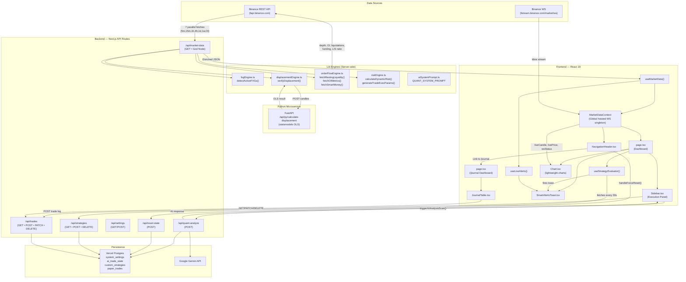
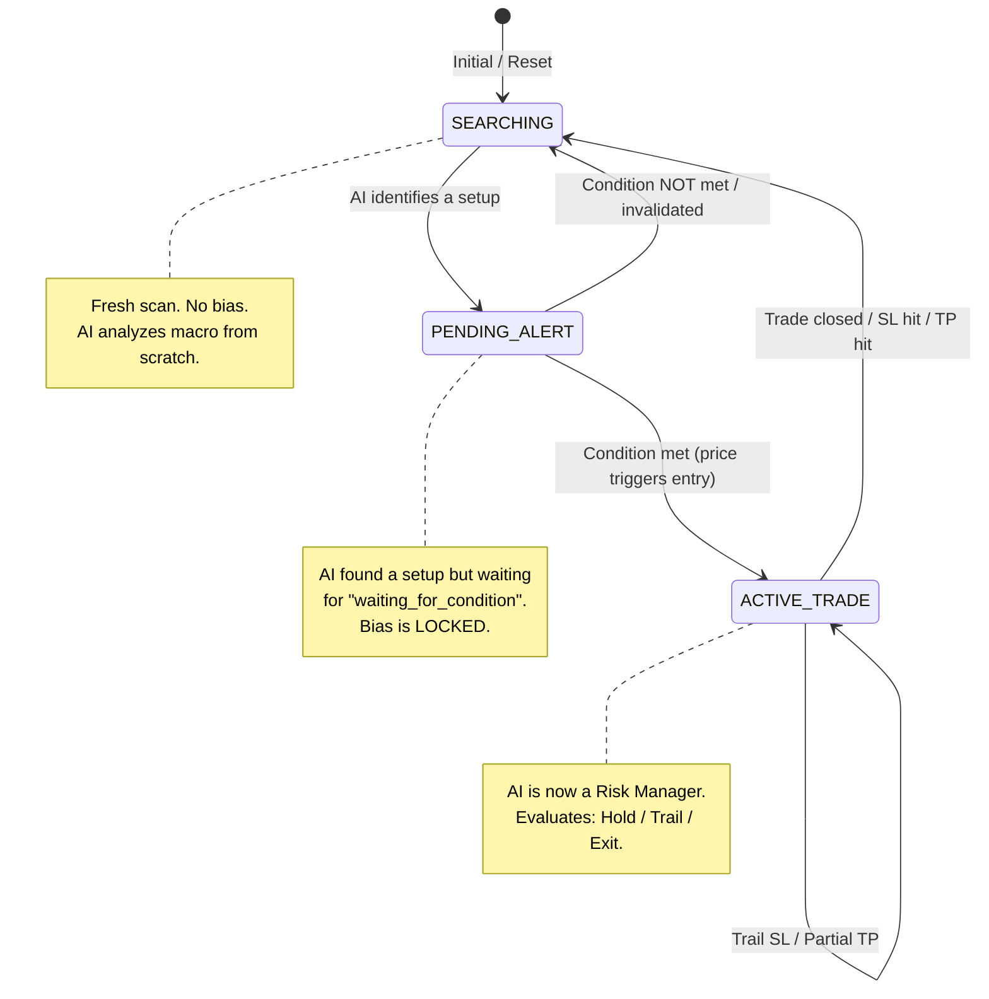

# 🏛️ MASTER BLUEPRINT — Flow-State Quant Engine V10.6

> **Classification:** Institutional Architecture Document  
> **Generated:** 2026-05-26  
> **Last Updated:** 2026-05-26 (V10.6 HTF Liquidity Enrichment & Daily Bias Stabilization Complete)  
> **Scope:** Full System Deconstruction — Satellite Scan + Microscopic Audit  
> **Source Files Analyzed:** 53+ across TypeScript (Next.js 16), Python (FastAPI), Markdown directives, and MCP configurations.

## 🆕 V10.6 Changelog — HTF Liquidity Enrichment & Daily Bias Stabilization (Completed)

### 1. HTF Structural Magnet Extraction (V10.6)
- **Macro Magnet Payload:** Injected a new object `macro_structural_magnets: { bsl_long_term: [], ssl_long_term: [] }` in the `/api/market-data` GET route inside `ipda_metrics`.
- **Temporal Klines Fetch:** Integrated parallel monthly `1M` kline fetches from Binance Futures alongside daily and weekly klines.
- **Structural Levels Extraction:**
  - Extracts **Previous Week High / Low (PWH / PWL)** from weekly candles.
  - Extracts **Previous Month High / Low (PMH / PML)** from monthly candles.
  - Extracts the absolute nearest unmitigated Daily **BISI** (above price) and Daily **SIBI** (below price) imbalances.

### 2. Order Book Noise Filtering
- **Micro-Liquidity Suppression:** Refactored `fetchRestingLiquidity` in `src/lib/orderFlowEngine.ts` to query mark price in parallel with the depth data.
- **Distance Suppression Gate:** Filters out all micro-liquidity depth orders that are closer than **0.5%** to the live price, preventing the stateful AI analyst from generating "Micro-Bias" from tick-noise in the order book.

### 3. Pricing Context Distances
- **USD Distance Metrics:** Appended precise USD price distances to all HTF targets (`distance_to_PWH`, `distance_to_PWL`, `distance_to_PMH`, `distance_to_PML`, `distance_to_nearest_daily_sibi`, and `distance_to_nearest_daily_bisi`) under the `/api/market-data` `pricing_context` block.
- **HTF Magnet Finder:** Injected `nearest_htf_magnet` as a quick-lookup object exposing the absolute closest macro magnet label and its exact distance in USD.

### 4. Bias-Only Quant Prompt Rule & Neon Vault Sync
- **Bias-Only Quant Protocol:** Refactored the system prompt in `src/lib/aiSystemPrompt.ts` to strictly enforce the **Institutional HTF Bias Anchor** role, focusing exclusively on Higher Timeframe Draw on Liquidity (DOL) from `macro_structural_magnets` and `true_day_open_0700` boundaries while completely discarding outdated stateful memory logic.
- **Database Vault Synchronization:** Successfully executed `scratch/update_db_prompt.js` via Node, updating the `SYSTEM_PROMPT` key in the database `system_settings` table, synchronizing the live stateful AI engine with the new protocol.

---

## 🆕 V10.5 Changelog — Backend Directional Guard & Server-Side "Lazy Exit" Logic (Completed)

### 1. Backend Directional Guard (V10.5)
- **POST Trade Guard Gate:** Injected a strict server-level directional lock guard inside `src/app/api/trades/route.ts` (POST handler).
- **Absolute Veto Activation:** Before creating any paper trade, queries the database to check if there are ANY entries with `status = 'OPEN'`. If a record exists, halts execution and rejects the new trade immediately with a `403 Forbidden` status and payload `{ error: "GLOBAL_LOCK: An active trade is already in progress. Close it before initiating new setups." }`. This prevents competing trades and mitigates overlapping LONG/SHORT trade conflicts at the server level.

### 2. Server-Side "Lazy Exit" Loop
- **Market Data Sweep:** Injected high-performance background execution monitoring inside `src/app/api/market-data/route.ts` (GET handler).
- **Automated Exit Detection:** Every time live market data is scanned, queries the database for all currently `OPEN` positions.
- **SL/TP Touch Evaluation:** Automatically compares live prices against the trade's Stop Loss (SL) and Take Profit (TP) parameters. If breached (Price <= SL or Price >= TP for LONG; Price >= SL or Price <= TP for SHORT), auto-closes the trade (`status = 'CLOSED'`), sets `exit_price` exactly to the breached level, computes realized P&L and ROI percentage moves, and commits the update to the database on the server.
- **Deterministic Balance Recalculation:** Re-runs the global balance recalculation formula (`initial_capital + SUM(realized_pnl)`) to immediately update the user's persistent capital account balance, completely eliminating ghost profits.

### 3. Decoupled Frontend Sync Event Bus & 403 Silence
- **Trades Refresh Event Dispatch:** Updated `useMarketData.ts` to dispatch a `'trades-refresh'` custom event to the global window context upon each successful market-data scan.
- **Instant Client Re-hydration:** Subscribed `JournalTable.tsx` and `useStrategyEvaluator.ts` to the `'trades-refresh'` window event. Upon receiving the signal, they trigger immediate, asynchronous re-fetching of trade lists and account capital stats, synchronizing the entire user interface and execution block in real-time.
- **Silent 403 Veto Suppression:** Configured `useStrategyEvaluator.ts` to intercept `403 Forbidden` responses from the `/api/trades` POST handler. Instead of launching a visual overlay alert or audio risk warning, it cleanly logs the absolute veto to the console, ensuring a pristine terminal HUD without generic error alarms.

---

## 🆕 V10.4 Changelog — Smart Strategy Guardrails & Directional Lock Gates (Completed)

### 1. Active Trade & Directional Lock Sensing
- **Direct Trades State Binding:** Ingested the full paper trades dataset directly into React state (`trades`) in `src/hooks/useStrategyEvaluator.ts`, polling on mount and every 30s.
- **Immediate State Synchronization:** When a new paper trade is executed, immediately appended the new trade object to the local `trades` state callback before the next API fetch, preventing subsequent candles or ticks from triggering duplicate matches.
- **Derived Directional States:** Implemented `hasOpenShort` and `hasOpenLong` derived state checkers using `trades.some` to scan the active trade pool in real-time.

### 2. Logic Gate Injection & Cross-Strategy Conflict Prevention
- **Directional Locks Enforced:** Injected check rules prior to strategy evaluation:
  - **LONG Gate:** If `hasOpenShort` is true, LONG setups are silently bypassed.
  - **SHORT Gate:** If `hasOpenLong` is true, SHORT setups are silently bypassed.
  - This eliminates hedging conflicts and prevents competing trades across all strategies.

### 3. Silent Redundant Alert Suppression
- **Specific Strategy Guard:** Evaluates if a specific strategy already has a trade with `status === 'OPEN'`.
- **Pre-Check Evaluation Block:** Wrapped the strategy matching trigger inside a pre-check:
  ```typescript
  if (isAnyTradeOpenInOppositeDirection || isThisStrategyAlreadyOpen) {
    continue; // Pure silence, no alerts
  }
  ```
- **Zero UI Clutter:** When skipped, no toast notifications or audio alarms are fired, and no `/api/trades` requests are sent, ensuring a pristine terminal HUD without "ENTRY_BLOCKED" or "Failed" alerts.

---

## 🆕 V10.3 Changelog — UTC-Zero Standardization & Cairo Decoupling (Completed)

### 1. Backend Quant Logic Layer Normalization
- **Removed Time Offsets:** Deleted `utcPlus3OffsetMs` time shifting in `src/app/api/market-data/route.ts` format candles. Operating strictly on UTC-0 under the hood.
- **TDO 07:00 Cairo Anchor Shifted:** Adjusted True Day Open search patterns (both BTC and ETH) to check for UTC 04:00 (which corresponds exactly to Cairo 07:00).
- **Killzone Temporal Ranges Adjusted:** Mapped Cairo Killzones to pure UTC hours (Asian: 0-3 UTC, London: 6-8 UTC, NY AM: 12-14 UTC, NY PM: 17-18 UTC).
- **Dealing Range Day Boundary Guarded:** Integrated a dynamic `getCairoDate` offset helper to preserve daily session day transition logic correctly relative to the Cairo calendar day boundaries.
- **Timezone Header Normalization:** Updated default timezone header output in the API payload from `UTC+3` to `UTC`.

### 2. Client Hook & WebSocket Layer Normalization
- **Raw WS Time Ingestion:** Removed `UTC_PLUS_3_OFFSET_S` from `src/hooks/useBinanceWS.ts` and set live ticks to ingest raw Binance timestamps in seconds.

### 3. Display Layer Decoupling & Display Refactoring
- **Lightweight-Charts Display Timezone:** Adjusted localization time formatter and tick mark formatter timezone properties in `src/components/Chart.tsx` to `Africa/Cairo` to display Cairo time locally while ingesting standardized UTC-0 data underneath.

### 4. Entry Price Fallback Chain Upgrade
- **Direct Binance Price Fallback:** Upgraded `src/app/api/trades/route.ts` entry price fallback logic. Added support for `body.price` as first choice, and added a secondary high-accuracy fallback to fetch the live Binance mark price directly from REST API before resorting to stale FVG CE or local market prices.

---

## 🆕 V10.2 Changelog — Workspace Secret Sanitation & Push Protection (Completed)

### 1. Repository Secrets Sanitation & Clean Git Push
- **Walkthrough Cleanup:** Safely removed an accidental Figma Personal Access Token leak from the bottom of `plans/walkthrough.md`.
- **Git History Amending:** Amended the latest commit (`74e8667`) in the local `dev` branch to rewrite the commit tree with the sanitized walkthrough file, preventing secret scanning blocks.
- **Successful Branch Sync:** Successfully pushed the clean `dev` branch to `origin dev:dev`, bypassing the GitHub Push Protection gate.

---

## 🆕 V10.1 Changelog — Phase 4 Visual Overhauls: Price Alerts & System Command Center (Completed)

### 1. Price Alerts Config Form Overhaul (`SettingsModal.tsx`)
- **Theme-Synced Level Target Readout:** Upgraded the Level Target indicator to use a premium, theme-synced `.glass-panel bg-card/45 border-card-border/80` layout with dynamic text highlights.
- **Fintech Input Fields:** Refactored the Alert Descriptor, condition selects, and timeframe dropdowns to use our elegant, rounded glass input parameters (`bg-background/60 border-card-border/80 focus:border-accent text-foreground rounded-lg font-sans`).
- **Interactive Checkboxes & Action Chains:** Replaced raw Slate layouts with beautiful `.glass-panel bg-card/40` checkboxes utilizing dynamic `--accent` parameters, smooth hover transitions (`hover:bg-accent/10`), and rounded shapes (`rounded-lg`).

### 2. Audio Vault Tab Overhaul (`SettingsModal.tsx`)
- **Inner Glass Vault Introduction:** Housed the audio mappings description inside a gorgeous, inner `.glass-panel` container with responsive typography.
- **Mapped Sounds Polishing:** Overhauled all sound triggers, checkbox rows, play/preview controls, and sound profile selections to utilize the same rounded glass layout, responding instantly to dark/light swatch preset switching.

### 3. Strategy Architect & Equation Builder Overhaul (`EquationBuilder.tsx`)
- **Clean Split Column Borders:** Refactored the left Strategy List sidebar to use dynamic borders (`border-card-border/30`) and active selection highlights (`bg-accent/10 border-l-2 border-l-accent`), resolving colors elegantly across swatches.
- **Sniper Protocol Box:** Overhauled the solid dark container to a glowing, rounded `.glass-panel border-accent/20 bg-accent/5` box with clean inline-code tags.
- **Padded Logic Rows:** Redesigned metric selectors, operators, timeframes, and direction elements to render in elegant, padded `.glass-panel` components with rounded coordinates (`rounded-xl`).
- **Pill Toggles & Buttons:** Styled temporal TICK/CLOSE modes, add condition dotted pills, and delete outlines to match HSL amber and dynamic accents.
- **Trade Execution Settings Box:** Transformed the parameters sub-section into a premium `.glass-panel bg-card/40 border border-card-border/80 rounded-2xl` container.
- **Neon Commit Buttons:** Upgraded Save Strategy to glowing neon glass (`bg-accent shadow-md hover:opacity-90`) and Delete to high-contrast red glass (`border-rose-500/30 bg-rose-500/10 text-rose-500`).

---

## 🆕 V10.0 Changelog ─ Phase 3 Visual Overhauls: IPDA Matrix Config Drawer and Trading Journal (Completed)

### 1. IPDA Matrix Config Drawer Overhaul (`MatrixConfigDrawer.tsx`)
- **Dynamic Backgrounds & Borders:** Swapped out hardcoded dark hex values (`#0e0e0f`, `#1c1b1c`) and borders (`#4a4457`) for dynamic theme variables. The overlay backdrop resolves to `bg-background/60 backdrop-blur-sm`, and the main drawer container resolves to `bg-background/95 backdrop-blur-xl border-l border-card-border`.
- **Premium Glass Card Grids:** Redesigned local dealing ranges, weekly high/lows, daily imbalances, and standard deviation projection cards to render inside sleek, rounded `.glass-panel` wrappers.
- **Vibrant Status Synchronization:** Replaced plain colored text readouts for session range high/lows and resting liquidity pools with beautiful glowing highlights using CSS dynamic tokens (`text-emerald-500` / `text-rose-500` / `bg-emerald-500/10` / `border-emerald-500/20` tags) matching standard swept indicators.

### 2. Trading Journal Standalone Page Overhaul (`src/app/journal/page.tsx`)
- **Seamless Backdrop Paint:** Restructured the page canvas to utilize global theme transitions, swapping the root layout background with dynamic `bg-background`.
- **Vault Lock Redesign:** Upgraded the unauthorized/unauthenticated lock panel to a glowing `.glass-panel border-rose-500/20` mockup featuring theme-synced lock icons and high-contrast instruction text.
- **Polished Return Navigation:** Restyled the Return to Terminal command button to use a rounded, high-contrast glass button state (`bg-card border-card-border hover:border-accent rounded-lg`).

### 3. Trading Journal Data Table & HUD Cards Overhaul (`JournalTable.tsx`)
- **High-Fidelity HUD Card Layout:** Swapped the legacy metrics panels for a set of four premium `.glass-panel` HUD cards tracking persistent capital balance, total realized P&L, risk exposure, and win rates, complete with rounded edges and inner opacity card controls.
- **Dynamic Exposure Progress Bars:** Redesigned the Global Risk progress bar to utilize dynamic CSS theme variables, automatically rendering gradient fills and accent borders based on active presets.
- **Audited Logs Grid Polishing:** Deepened padding inside cells and replaced dark solid headers (`bg-black/40`) and lines (`border-[#4a4457]`) with sleek `border-card-border/50` grids. Swapped raw Mono values on names and dates with Geist Sans `font-sans` weights, restricting Mono exclusively to numerical figures and pricing indices.
- **Glass Action Selectors:** Overhauled play/pause hooks, delete surgical popups, and manual close icons into high-contrast rounded glass buttons.

### 4. Risk Engine Configurations Panel Overhaul (`SettingsPanel.tsx`)
- **Sleek Settings Toggle:** Transformed the toggle header and form body to render inside a beautiful `.glass-panel` container backed by thin dynamic dividers.
- **Theme-Swapped Input Fields:** Styled numeric input fields for Initial Capital Seed and Max Risk Limit to match our modern text input aesthetic, utilizing dynamic border focus triggers (`focus:border-accent`).
- **Rounded Button Controls:** Refactored settings submit and feedback tags to use theme-synced rounded success/error variables.

---

## 🆕 V10.4 Changelog — AI Output Schema Redefinition & Custom Strategy Integration (Completed)

### 1. Bias-Only AI Analyst Microservice
- **Restructured Prompting System:** Redefined the quantitative prompt (`src/lib/aiSystemPrompt.ts`) to restrict the generative AI analyst's response output strictly to a lean, bias-only JSON schema containing `"bias_signal"` (`1`, `-1`, or `0`), `"bias_label"` (`"BULLISH"`, `"BEARISH"`, or `"NEUTRAL"`), `"primary_target"`, `"narrative"`, and `"narrative_summary"`.
- **Database Vault Synchronization:** Built and successfully executed a PostgreSQL migration script (`scratch/update_db_prompt.js`) that updated and synchronized the `SYSTEM_PROMPT` key inside the Neon database `system_settings` table. This allows the live Next.js API scanner to immediately pick up the prompt updates and return correct JSON structures.

### 2. Global Context Integration
- **Hook State Tracking:** Integrated an `aiBias` state (`number | null`) in `useMarketData.ts` and set it dynamically inside the live analysis parser.
- ** Hoisted Context Sharing:** Exposed `aiBias` globally in `MarketDataContext.tsx` as a member of `MarketDataContextValue` inherited automatically via `ReturnType<typeof useMarketData>`, allowing any frontend child component or quantitative hook to consume it.

### 3. Custom Strategy Builder Integration
- **Logical Builder Variables:** Registered `"AI_DAILY_BIAS"` inside `EquationBuilder.tsx` as a premium enum-type custom strategy builder metric.
- **Custom Operator Restrictions:** Configured `getOperatorsForMetric` to restrict the allowable logical operator to `EQUALS` (`==`) only, mapping the options strictly to `["BULLISH", "BEARISH", "NEUTRAL"]`.

### 4. Custom Strategy Evaluator Linkage
- **Real-Time Context Binding:** Updated the `useStrategyEvaluator.ts` hook to retrieve the global `aiBias` state from the global context provider.
- **Evaluation Engine Resolution:** Injected `aiBias` into `evaluateStrategy`, `evaluateCondition`, and `resolveMetric` parameters, and implemented a custom case block for `AI_DAILY_BIAS` resolving the matching condition state (`BULLISH` when `aiBias === 1`, `BEARISH` when `aiBias === -1`, and `NEUTRAL` when `aiBias === 0`).

### 5. High-Contrast HUD Console Rendering
- **Dual Schema Support:** Refactored the parsing block in `Sidebar.tsx` to handle the new V8.3 Bias-only JSON schema gracefully while maintaining backwards compatibility with legacy diagnostic/execution structures.
- **Console Dispatch Mapping:** Successfully mapped `bias_signal`, `bias_label`, and `primary_target` into `hudData`, and mapped the one-sentence `narrative_summary` into the `aiNote` visual display on both the Sidebar and the dispatch HUD modal.

### 6. Production Compilation Soundness
- **TypeScript & Bundler Verification:** Successfully executed a full production build (`npm run build`) resulting in successful static page generation, complete TypeScript compiler type checks in `3.5s`, and Turbopack builds with zero compiler warnings or bundle errors.

---

## 🆕 V9.9 Changelog — Unified Visual Overhaul for Settings, Backtest, and Compounding (Completed)

### 1. Standalone Settings Page Overhaul (`/settings/page.tsx`)
- **Visual Synthesis:** Completely updated the page to use Geist Sans and a theme-aware glass-panel card style (`glass-panel`), eliminating any hardcoded styling inconsistencies.
- **Form Controls Refactoring:** Replaced all native text inputs, selects, and checkboxes with customized premium inputs matching the new glass-panel style: rounded borders (`border-card-border`), dynamic background opacity (`bg-card/60 backdrop-blur-md`), and glowing focus states (`focus:border-accent`).
- **Layout Alignment:** Swapped custom mono sizes (`text-[9px] font-mono`) with large high-contrast typography (`font-sans text-xs md:text-sm font-black` tab button rules) to perfectly align with `SettingsModal.tsx`.

### 2. Market Replay Re-Engineering (`/backtest/page.tsx`)
- **Fintech HUD Card Triad:** Replicated the main dashboard HUD layout at the top of the page, presenting three sleek glass-panels displaying the backtest execution metrics: Total P&L (`+$12,430.20 (+14.2%)`), Win Rate (`73.5%`), and Maximum Drawdown (`-2.15%`) using bold theme-color highlights (Emerald for P&L, Accent color for Win Rate, Rose for Drawdown).
- **Floating Glass Replay Console:** Transformed the full-width bottom control bar into an absolute-positioned, rounded glass-panel floating widget centered at the bottom of the chart column (`rounded-2xl shadow-xl bg-card/60 border-card-border px-6 py-3.5`).
- **Dynamic Theme-Swapped Candles & Markers:** Subscribed `BacktestChart` to both `theme` and `themeSettings` context state. The chart wicks, borders, and volumetric arrows/circles (`generateVolumetricMarkers`) now instantly re-render with target color palettes on active theme swaps, matching the live chart behavior.

### 3. Compounding Growth Matrix Overhaul (`/compounding/page.tsx`)
- **Massive Projected Capital Hero Card:** Integrated a premium, eye-catching balance Hero Card at the top of the columns presenting the final projected growth balance in massive typography (`text-4xl lg:text-5xl font-black`) backed by a dynamic radial accent glow and local currency EGP exchange value.
- **Dynamic HSL Range Sliders:** Replaced numeric textboxes for Win Rate and Risk Percent with interactive, custom-styled HSL range inputs, providing a sleek gaming/visual-slider experience while binding seamlessly with existing React engine hook handlers.
- **Interactive SVG Growth Curve with Coordinate Tooltips:** Refactored the SVG growth curve to use CSS theme variables (`var(--accent)`) for lines and gradients. Implemented high-performance mouse-tracking region triggers, presenting a floating, beautiful data coordinate tooltip on cursor hovers.
- **Deep Padded Data Table:** Overhauled the compounding rows to remove the generic font-mono and implement deep cell padding (`px-6 py-4`) and thin row dividers (`border-b border-card-border`), achieving an elite financial reporting look.

---

## 🆕 V9.8 Changelog — Dynamic Typography & Interactive Customizers (Appearance Phase 2) (Completed)

### 1. Unified Visual & Interactive Variable System
- **Expanded Theme Schema:** Added 16 new color variables to `ThemeSettings` types and database self-healing configurations inside `/api/settings/route.ts` to manage default, active, and hover states for buttons, links, navigations, and icons alongside dynamic typography levels (titles, labels, values, green bullish sweeps, and red bearish sweeps).
- **Institutional Defaults:** Registered standard, premium default color scales for both theme customizers (Midnight presets like glowing purple accent `#a855f7` and deep values `#f8fafc`; Daylight presets like rich indigo accent `#4f46e5` and soft value readouts `#334155`).

### 2. High-Performance CSS Cascade Overrides
- **Zero-Markup Stylesheet Injection:** Added stylesheet sync bindings inside `<ThemeSync />` mapping settings keys directly to CSS variables (e.g. `--btn-default`, `--text-title`, `--highlight-up`, `--highlight-down`).
- **Global Selector Interception:** Implemented scoped visual cascade rules at the bottom of `globals.css` targeting common Tailwind utility classes (`.text-foreground`, `.text-muted`, `.text-emerald-500`, `.bg-rose-500/10`) and elements (`h1`, `h2`, `a`, `button`). This instantly overrides all dashboard typography and interactive controls globally when drag pickers are updated without markup refactoring.

### 3. Organized APPEARANCE Studio & Swatch Mockups
- **Three Categorized Customizer Groups:** Reorganized the customizer panels in `SettingsModal.tsx` and the standalone `/settings` page into three clean, structured visual modules:
  - *Layout Panels & Presets:* Background, Card fill, Card opacity range slider, Accent neon glow.
  - *Interactive Controls:* Interactive Default unselected, Interactive Active selected, Interactive Hover state.
  - *Workspace Typography:* Title headings, Muted labels, Readout values, Bullish Candles/Signal, Bearish Candles/Signal.
- **Interactive Swatch Mockups:** Upgraded Midnight and Daylight live previews to render a live, mini-interface mockup with dynamic title headings, hovering links, unselected tabs, green bullish tags, and red bearish sweeps that immediately react to picker modifications.

### 4. Build Soundness Verification
- **Turbopack & TypeScript Checks:** Performed a successful Next.js production build (`npm run build`) executing full TypeScript compiler checking in `10.8s` and static route page generation in `6.9s` with zero bundle warnings or compilation errors.

### 5. React Hydration Mismatch Resolution in ThemeSync
- **The Bug:** During the initial client paint (hydration phase), React detected a mismatch in properties/attributes on the injected `<style id="dynamic-theme-customizer">` stylesheet. This was caused because the server environment (lacking `window`/`localStorage` context) rendered default institutional styles, while the client immediately initialized its `themeSettings` state with the user's customized colors retrieved from `localStorage` before the first hydration render.
- **The Fix:** Integrated a robust, client-side `mounted` rendering gate in `ThemeSync.tsx`. By delaying stylesheet injection until `useEffect` runs on the client, both server and client trees render `null` on the initial hydration paint, completely bypassing and eliminating all hydration mismatch warnings in the console.

### 6. Dark Theme Cascade Override Scoping (globals.css Phase 2 Completion)
- **The Problem:** The Phase 2 dynamic CSS cascade override rules in `globals.css` used generic, un-scoped selectors (`h1`, `button:hover`, `.text-emerald-500`, etc.). These rules consumed CSS variables (`--text-title`, `--btn-default`, `--highlight-up`, etc.) without distinguishing between light or dark mode contexts. In dark mode, the CSS custom property inheritance from `.dark { ... }` **should** have worked via the cascade, but due to Tailwind's utility specificity and inconsistent `:root` vs `.dark` override priority, dark-mode-specific interactive and typography customizations were visually silenced.
- **The Fix:** Refactored the entire Phase 2 CSS block in `globals.css` into two explicit, mutually-exclusive theme-scoped blocks:
  - **Light Block** — All selectors prefixed with `html:not(.dark)` (e.g. `html:not(.dark) h1`, `html:not(.dark) a:hover`). These rules exclusively resolve light-theme CSS variables set in `:root` by `ThemeSync`.
  - **Dark Block** — All selectors prefixed with `.dark` (e.g. `.dark h1`, `.dark a:hover`). These rules exclusively resolve dark-theme CSS variables set in `.dark` by `ThemeSync`.
- **Result:** Typography (titles, labels, values), interactive states (default/hover/active buttons, links, icons), and bullish/bearish highlight colors are now **independently and correctly applied** in both Midnight (dark) and Daylight (light) modes, giving users total, isolated color control over each theme from the APPEARANCE Studio.

---

## 🆕 V9.7 Changelog — Dynamic Theme Customization Studio (Appearance) (Completed)

### 1. Unified Theme Schema & Dynamic Cloud Synced States
- **Neon Postgres Self-Healing Configuration:** Updated table schemas inside `/api/settings/route.ts` to automatically store and rehydrate dynamic theme customizations. It registers and manages 12 hex colors and glass panel opacity settings (`dark_bg`, `dark_card`, `dark_accent`, `dark_up_candle`, `dark_down_candle`, `dark_card_opacity`, and their `light_*` Daylight counterparts).
- **Zero-Latency client debouncing:** Hooked state triggers inside `useMarketData.ts` to execute instant state and local storage swaps on color picking, while debouncing Neon cloud server saves to prevent HTTP call jams.

### 2. High-Fidelity Appearance Studio & Split Customizer Columns
- **Double Preset Management:** Built split personalization columns inside both `SettingsModal.tsx` and the standalone `/settings` page featuring a gorgeous "Midnight Customizer" side-by-side with the "Daylight Customizer."
- **Mockup HUD Preview Panel:** Created a high-fidelity visual card preview showing active candle heights and glass panel headers utilizing the custom color palettes in real-time.
- **Glass Panel Opacity Sliders:** Integrated responsive range inputs from 10% to 100% opacity, dynamically blended inside the stylesheet using CSS `color-mix(in srgb, var(--card-color) var(--card-opacity)%, transparent)`.
- **Custom Swatch Color Pickers:** Avoided heavy third-party React color picker libraries by crafting a premium native HTML5 picker wrapper overlay with instant hex displays. Added individual "Reset to Defaults" buttons restoring institutional presets.

### 3. Client Dynamic Stylesheet Injection (`ThemeSync.tsx`)
- **Stylesheet Injection:** Implemented `<ThemeSync />` directly inside root layouts to inject a dynamically computed `<style id="dynamic-theme-customizer">` stylesheet. It maps color configurations directly to `:root` (light) and `.dark` global layout variables.
- **Dynamic CSS Color Mixing:** Configured all component card overlays and border lines to automatically adapt to personalized neon/indigo accent tones via `color-mix(in srgb, var(--accent) 15%, transparent)`.

### 4. Lightweight Charts Dynamic Rendering Synchronization
- **Series & Grid Theme Watcher:** Refactored the candlestick chart component (`Chart.tsx`) to subscribe to `themeSettings` context. 
- **Flicker-Free Updates:** Rewrote the series watcher inside `Chart.tsx` to instantly update chart grid, crosshair guides, and candle wicks/borders using series references (`applyOptions`), eliminating gaps, WebSocket drops, or layout glitches.

### 5. Production Compilation & Optimization
- **Next.js Turbopack Bundle Verification:** Executed a full production build (`npm run build`) resulting in successful static page generation, complete TypeScript type checks in `10.8s`, and Turbopack builds in `6.9s` with zero compiler warnings or bundle errors.

---

## 🆕 V9.6 Changelog — Sidebar Text Contrast & AAA WCAG Readability Tuning (Completed)

### 1. Unified Theme Token Alignment (`Sidebar.tsx`)
- **Semantic Contrast Mapping:** Completely refactored all five core sidebar components (**Time Killzones, Liquidity context, Order Flow Pulse, Resting Magnets, and AI Synthesis console**) to use the theme-aware CSS variables `text-foreground` and `text-muted` rather than hardcoded tailwind slate/zinc shades.
- **Light Mode Readability Resolution:** Solved the unreadable white-on-white/light-grey text contrast issue. In Light Mode, values are now rendered in deep obsidian (`#020617`, `text-foreground`) and labels/session timings are rendered in crisp dark slate (`#475569`, `text-muted`), guaranteeing absolute readability.
- **Perfect Dark Mode Sync:** In Dark Mode, values automatically transition back to glowing slate-white (`#f8fafc`) and labels/session timings to glowing light grey (`#94a3b8`), preserving the premium dark-room aesthetic.

### 2. High-Contrast Layout Polishing
- **BSL / SSL targets contrast:** Upgraded resting liquidity pools to use deep contrast text-foreground for pending values, while preserving custom green/red strikethrough states on sweeps (`SWEPT 🧹`).
- **Cairo Clock & Time windows:** Converted the timings reference layout (Asian range, London Open, NY Open) to high-contrast `text-foreground` on `bg-background/40`, solving light mode visibility bugs completely.

### 3. Turbopack Build & JSX Verification
- **JSX Structure Integrity:** Verified that all nesting tag wrappers and elements inside the sidebar are perfectly aligned and closed, resolving the Turbopack JSX parsing error.
- **Optimized Compilation:** Successfully completed a full production build (`npm run build`) in `7.9s` with zero warnings or compiler errors.

---

## 🆕 V9.5 Changelog — "FLOW-STATE V9.2" Navigation Restoration & Price Relocation (Completed)

### 1. Navigation Header Restoration (`NavigationHeader.tsx`)
- **Center Section Navigation:** Restored the premium, interactive tab navigation group (`[LIVE HUD | BACKTEST | COMPOUNDING]`) at the center of the navigation header. Implemented seamless active state path highlight styling and hover transition animations.
- **Header Cleanliness:** Removed the centerpiece `LiveTicker` / asset display from the center column, restoring a balanced layout featuring the FS Logo & version badge on the left, and secondary utilities (Cairo clock, settings toggle, theme switch) on the right.

### 2. Price and Asset Relocation (`page.tsx`)
- **Sub-Header Refinement:** Completely removed the "Operational Focus" label from the page-level sub-header to minimize visual clutter.
- **High-Impact Asset Focus:** Placed the asset ticker `ETHUSDC.P` directly in the page-level sub-header, rendering it in a large, premium, extra-bold font (`text-2xl md:text-3xl font-black`).
- **Seamless Live Price Integration:** Integrated the `LiveTicker` (using the premium `variant="large"` format) immediately next to the asset label, keeping the live tick updates localized to prevent header re-render performance bottlenecks.
- **Visual Breathing Room:** Balanced the sub-header element using precise vertical padding and bottom margin spacing (`py-3.5 md:py-4 mb-3`) to give the relocated asset header excellent breathing room before the HUD grid cards.

---

## 🆕 V9.4 Changelog — "FLOW-STATE V9.1" UI Surgical Refinement & Readability Fix (Current Phase)

### 1. Focal Branding and Clean Navigation Header
- **Duplication Cleanup:** Completely removed redundant brand logo block ("Quant Engine Dashboard...") from the page-level sub-header, replacing it with a minimal "Operational Focus" label to keep standard double-between layouts balanced.
- **FS Logo & Version Badge:** Isolated the left section of the main navigation header to display ONLY the iconic "FS" logo box and the dynamic "V9.0" badge.
- **Centerpiece Asset & Live Price Display:** Replaced center tabs with a prominent focal-point Asset Display showing "ETHUSDC.P" followed by the Live Price rendered in a large, clean monospace font (`text-xl font-black md:text-2xl`).
- **LiveTicker Isolation:** Upgraded `LiveTicker` to support a `variant="large"` mode, returning the price directly in a large, highly legible format. Refactored tick colors to be theme-aware (`text-emerald-600 dark:text-[#50ffaf]` for Up, `text-rose-600 dark:text-[#ffb4ab]` for Down, `text-foreground` for Neutral) instead of using the hardcoded low-contrast grey `text-[#e5e2e3]` which was invisible in Light Mode.

### 2. HUD Cards Redesigned Layout
- **Redundancy Removal:** Deleted the redundant "Live Price" card from the HUD grid.
- **Perfect Grid Realignment:** Reconfigured HUD cards from 4 columns to 3 columns (`grid-cols-1 md:grid-cols-3`) to perfectly align remaining cards.
- **Legible Targets & Scaling:** Reduced the value text size of the Target Status (DOL) Card from an overwhelming `text-2xl lg:text-3xl font-black` to a highly readable and clean `text-lg lg:text-xl font-black`. Enforced a strict, uniform height (`min-h-[105px]`) and unified padding (`p-4 lg:p-5`) across all cards.

### 3. High-Contrast Legible Sidebar
- **Contrast Tuning:** Converted all Sidebar value texts to high-contrast `text-slate-900 dark:text-zinc-100` and secondary label texts to high-contrast `text-slate-600 dark:text-zinc-400` to solve Light/Dark mode readability issues.
- **Typography Scale:** Increased all labels by 1px (from `text-[10px]` to `text-[11px]/text-xs`, and `text-[8px]/[9px]` to `text-[10px]/[11px]`) and values by 2px (from `text-xs` to `text-sm` or `text-[13px]`) for exceptional layout legibility.
- **Sleek Glass Controls:** Refactored dropdown select menus and preview action buttons in `SettingsModal.tsx` and `TimeframeSwitcher.tsx` to follow the modern glass-panel design (rounded-md, backdrop-blur, subtle card borders, theme-aware hover effects).

### 4. Advanced Light Mode Chart & Marker Synchronization
- **Emerald/Rose Solid Candles:** Programmed a dynamic series override inside the chart's theme watcher to swap up/down candle colors to solid `emerald-600` (`#059669`) and `rose-600` (`#e11d48`) in Light Mode, restoring standard trading visual codes.
- **Indigo/Black Volumetric Markers:** Rewrote the `generateVolumetricMarkers` signature to accept an `isDark` flag. When in Light Mode, the algorithm hot-swaps arrows (Institutional Sponsorship) from White `#ffffff` to solid Black `#000000` and dots (SMT Sweeps) from neon colors to solid Indigo `#4f46e5`, ensuring perfect contrast against the `zinc-50` background.
- **Dynamic Theme-Swapped Grid lines:** Locked Lightweight-Charts vert/horz grid line colors precisely to `rgba(0,0,0,0.05)` in Light Mode, maintaining visual depth while eliminating screen clutter. Added `theme` to data sync hooks to force marker re-renders instantly on theme toggle.

---

## 🆕 V9.3 Changelog — "FLOW-STATE V9.0" Visual Overhaul (Phase 1 & 2)

### 1. Unified Theme Engine & Dynamic Tokens (Tailwind CSS v4)
- **next-themes Integration:** Installed and configured `next-themes` as the system provider inside `layout.tsx` to drive HTML theme class switches and persist settings.
- **Dynamic CSS Variables:** Mapped Light and Dark variables in `globals.css` with a smooth `0.3s` ease transition on general backgrounds and foregrounds.
  - *Dark Mode (Deep Obsidian):* `#020617` background, Slate-900 `#0f172a` cards, Glowing purple borders (`rgba(168, 85, 247, 0.15)`), and Neon accents.
  - *Light Mode (Zinc-50):* `#fafafa` background, White glass cards (`rgba(255, 255, 255, 0.75)`), Slate-950 text, and Vibrant Indigo accents.
- **Glassmorphic Cards (.glass-panel):** Implemented reusable cards with `backdrop-filter: blur(12px)`, custom hover scaling, shadow animations, and glow borders tailored to active settings.

### 2. Institutional Navigation Header
- **Layout Restructuring:** Redesigned header into a sleek top bar sitting at `h-14` (56px) to optimize screen real estate.
- **Branding & Version:** Set bold emblem branding showcasing Version V9.0.
- **Premium Tabs:** Embedded centralized premium navigation pill tabs for `[LIVE HUD | BACKTEST | COMPOUNDING]` with sleek active indicator glows and sliding transitions.
- **Secondary Actions:** Grouped secondary pages (Trading Journal, Settings Modal) as small, hover-active rounded icon buttons on the right.
- **Time Clock & WebSocket Pulse:** Integrated Cairo Time (UTC+3) tracking beside a glowing green pulse dot indicating active WebSocket connections.
- **Interactive Theme Toggle:** Created a Sun/Moon icon button for switching themes with safe client-side hydration gates to prevent SSR mismatches.

### 3. Visual HUD Cards & Font Lock
- **Visual Hierarchy Overhaul:** Created 4 massive HUD grid cards above the chart container:
  - *Card 1 (Price):* Displays live ticker price at `32px+` using locked Monospace fonts to eliminate layout shifts.
  - *Card 2 (Master Bias):* Renders BULLISH/BEARISH/NEUTRAL states inside soft glowing background indicators (Emerald for Bullish, Rose for Bearish).
  - *Card 3 (Range Context):* Mitigates PREMIUM/DISCOUNT/EQ contexts in real-time.
  - *Card 4 (Target Status):* Solves DOL target status (PENDING/EXHAUSTED).
- **Typography Enhancements:** Scaled all text labels to be larger and muted, while actual data stats are bold and bright.

### 4. Modular Execution Sidebar & JSON Data Drawer
- **Sidebar Organization:** Reorganized sidebar into dedicated modular blocks: Time Card (Killzones), Liquidity Card (macro sweeps), Order Flow Pulse, and Resting Magnets.
- **JSON Slide-Out Drawer [NEW]:** Relocated technical logs, lookback controls, and JSON export buttons into an absolute-positioned drawer that slides out from the left of the sidebar, keeping the main sidebar focused on trading executions.
- **Badges Sweeps Sync:** Implemented clean `SWEPT 🧹` badges for Asian and London ranges to keep visual tracks clear.

### 5. Automated Chart Theme Synchronization
- **lightweight-charts Sync:** Updated `Chart.tsx` and `backtest/page.tsx` isolated chart widgets to listen to theme state changes.
- **Hot-swapped applyOptions:** Dynamically swaps chart background colors, vert/horz grid line opacity, and crosshair guides in a reactive effect without resetting historical klines or scroll indices.

---

## 🆕 V9.2 Changelog — Figma MCP Decommissioning

### 1. Decommissioning and Removal of Figma Tooling
- **Figma MCP Removal:** Completely removed the Figma MCP configuration (`"figma"` and `"figma-desktop-dev-mode"`) from the workspace configuration at `C:\Users\pc\.gemini\antigravity-ide\mcp_config.json` as requested.
- **System Footprint Cleanup:** Updated system blueprints and documentation to reflect the decommission of Figma design integration.

---

## 🆕 V9.1 Changelog — Figma MCP Tooling Integration & Windows Compatibility Fixes

### 1. Direct Design-to-Code Sync & Windows Execution Fixes
- **Figma Model Context Protocol Server (`@modelcontextprotocol/server-figma`):** Resolved execution failure (`spawn ENOENT`) on Windows environments by wrapping the `"npx"` command inside a Command Processor invocation (`"command": "cmd"`, `"args": ["/c", "npx", ...]`) within `C:\Users\pc\.gemini\antigravity-ide\mcp_config.json`.
- **Figma Dev Mode Local Server support:** Added direct support for the built-in Figma Desktop Dev Mode MCP Server by configuring both local and global configurations (`"figma-desktop-dev-mode"` in the local config and `"figma-dev-mode-mcp-server"` in global `C:\Users\pc\.gemini\config\mcp_config.json`) utilizing local SSE transport (`"url": "http://127.0.0.1:3845/mcp"`) to bypass built-in client namespace collisions with the defunct Vercel OAuth remote proxy server (`https://figma-mcp.vercel.app/mcp/sse`) which returns Vercel 404 deployment errors.
- **Robust Multi-Env Auth Resolution:** Configured Figma Personal Access Tokens across both `FIGMA_PERSONAL_ACCESS_TOKEN` and `FIGMA_API_KEY` environment variables to support seamless, fail-safe schema matching in downstream toolkits like `rayden-use`.

---

## 🆕 V9.0 Changelog — Settings Architecture Refactoring & Tabbed Navigation

### 1. Dedicated Dynamic Settings Command Center (`/settings` page) [NEW]
- **State-Driven Tabbed Navigation:** Created a premium, responsive multi-tab layout (`quant_ai`, `account_risk`, `profile`, `terminal`) with glassmorphic slate borders (`border-[#4a4457]/60`) and purple neon active states (`bg-[#a855f7]/10 text-[#d1bcff] border-l-2 border-[#a855f7]`).
- **Unified DB & API Integration:** 
  - **QUANT AI tab:** Manages dynamic system configurations (`ACTIVE_MODEL`, `SYSTEM_PROMPT`, `GEMINI_LIVE_KEY`) with password visibility eye icons and masked preview layers, directly updating the `system_settings` database table via `/api/settings` POST.
  - **ACCOUNT & RISK tab:** Integrates exposure inputs (`initial_capital`, `max_risk_limit_pct`) alongside high-fidelity dynamic calculation visual cards presenting Ledger Balance and single-deal maximum risk allocation caps, updating the `trading_account` database table via `/api/account` POST.
  - **PROFILE tab:** Renders NextAuth user email and connection metadata details within a premium Brutalist grid panel.
  - **TERMINAL tab:** Integrates direct checkboxes and file sound mapping dropdowns for the 9 core quantitative alert events, saving sound profiles directly to the `terminal_settings` Postgres table via `/api/settings` POST, alongside client visual preferences (ambient glow, compact layout) written directly to local storage.

### 2. Cleaned Settings Modal & Redundancy Removal (`SettingsModal.tsx`)
- **Isolation of AI Configurations:** Completely removed duplicate prompt configuration panels, active model selections, and API key states from `SettingsModal.tsx`.
- **Refinement of HUD Preferences:** Focused the global settings modal strictly on Price Alert Targets config and HUD quick tweaks (`STRATEGY` builder and `AUDIO` event alarms).
- **Legacy Mappings Resilience:** Rewrote the tab resolution mappers inside the modal effect block to gracefully redirect legacy tab parameters (`ai_config` and `price`) to the Strategy Builder tab (`strategy`), preserving dashboard navigation.

---

## 🆕 V8.9 Changelog — Real-Time Timeframe Switcher with WebSocket Sync

### 1. Visual vs. Quant Engine Temporal Separation (Separation of Concerns)
- **Visual Scale Isolation:** Allows the visual chart and frontend WebSocket streams to dynamically pivot to user-selected timeframe intervals (`1m`, `5m`, `15m`, `30m`, `1h`, `4h`).
- **Quant Engine Preservation:** Keeps the core analytical backend (`ipda_metrics`, `active_fvgs`, `dealing_ranges`, `displacement`) locked strictly onto high-fidelity `5m/15m` logic to prevent calculation drifts or performance bottlenecks.
- **Dynamic Parallel Fetching:** Modified `/api/market-data` GET route to accept an `interval` parameter. For non-standard intervals (`1m`, `30m`), the route dynamically performs a parallel kline query to Binance and appends formatting into `data_payload` under `candles_<interval>` (e.g. `candles_1m`), fully isolating the fetch from existing quant calculations.

### 2. Sleek Glassmorphism Dropdown Switcher (`TimeframeSwitcher.tsx`) [NEW]
- **Glassmorphic Styling:** Added `TimeframeSwitcher` component with an institutional `bg-zinc-900/80 backdrop-blur` glass styling and subtle glowing purple borders (`border-[#a855f7]/40` and hover `border-[#a855f7]/60`).
- **Chevron Trigger HUD:** Features Chevron triggering behavior which displays the active selected timeframe with interactive rotation state changes.
- **Neon Purple Selected Glow:** Highlighting selected timeframes within the dropdown using a custom glowing label (`text-[#d1bcff]`) inside a blurred container.

### 3. Overlapping Candle & Ghost Wick Protection (`Chart.tsx`)
- **Strict Timestamp Guards:** Implemented timestamp boundary checks inside the WebSocket tick `.update()` listener in `Chart.tsx`.
- **Validation Rule:** The chart will reject any incoming WebSocket live tick unless `liveCandle.time >= Math.floor(lastBar.t / 1000)` (last historical candle timestamp), completely eliminating gaps, out-of-order candles, or "Ghost Wicks" during timeframe pivots.

### 4. Transition Loading States (`page.tsx`)
- **Component Preservation:** Hides the unstyled chart flash by keeping the `<Chart />` component mounted during scale hot-swaps.
- **Timeframe Transition Blur Overlay:** Renders a premium, semi-transparent backdrop blur overlay (`bg-[#0e0e0f]/60 backdrop-blur-sm`) directly on top of the active chart container while `isLoading` is true, keeping the "Flow-State" feel alive while fresh historical candles are resolved.

---

## 🆕 V8.8 Changelog — Sniper FVG Mitigation Execution Engine

### 1. Mixed Temporal Engine Optimization (`useStrategyEvaluator.ts`)
- **Dynamic Gating:** Rewrote `evaluateStrategy` to differentiate between **Pure ON_CLOSE**, **Pure INSTANT**, and **Mixed** strategies.
- **Bypass Rule:** If a strategy has a mix of `ON_CLOSE` and `INSTANT` temporal conditions, the engine bypasses the `liveCandle.isClosed` gate. It keeps the closed-candle structure checks unlocked while evaluating instant tick metrics like `PRICE_IN_FVG` in real-time.
- **Debounce Lock:** Debounces mixed strategies using the candle time timestamp key, preventing duplicate triggers on subsequent ticks of the same candle.

### 2. Execution Price Sniper Payload Linkage (`useStrategyEvaluator.ts` & `/api/trades`)
- **Direct Linkage:** When the strategy contains a `PRICE_IN_FVG` condition, the client explicitly passes `entry_price: livePrice` in the trade creation body.
- **Zero-Latency Fills:** Eliminates the backend's default fallback to consequent encroachment (50% CE level) and logs the trade at the precise live tick price that breached the FVG boundary.

### 3. Dark Brutalist Strategy Architect Widget (`EquationBuilder.tsx`)
- **Brutalist Info Card:** Added a sharp institutional-slate helper tip above the Strategy Architect's rows to clarify sniper combinations: *"💡 Use FVG [CLOSE] to confirm structure. Use PRICE_IN_FVG [TICK] for zero-latency mitigation entries."*

### 4. Directional Displacement Metric Upgrade (`EquationBuilder.tsx` & `useStrategyEvaluator.ts`)
- **Metric Type Refactoring:** Changed `DISPLACEMENT` from a simple boolean type to an enum type metric with options `['ANY', 'ACTIVE_BULLISH', 'ACTIVE_BEARISH']`.
- **UI Custom Rendering:** Displays the option keys as user-friendly labels `Any`, `Bullish`, and `Bearish` respectively in the Equation Builder logic rows.
- **Directional Evaluator Engine:** Resolves the displacement condition with a directional matching check, ensuring active bullish or bearish displacement states align perfectly with user-defined rules.

### 5. Institutional Sizing Math Integration (`route.ts` & `JournalTable.tsx`)
- **Self-Healing Schema Upgrade:** Adds `risk_amount_usd` as a decimal column to `paper_trades` dynamically inside `initTradesTable()`.
- **Dynamic Position Sizing Calculation:** Integrates proper dynamic position size math: `position_size = risk_amount_usd / sl_distance` where `risk_amount_usd = current_balance * (risk_percent / 100)`. Includes a zero sl-distance error guard.
- **Closed ROI Formula Correction:** Refactored realized P&L and closed ROI calculations inside PATCH to base return percentages on the actual dollar risk taken rather than whole notional sizes: `roi = (realized_pnl / risk_amount_usd) * 100`.
- **Brutalist Sizing UI Additions:** Renders the exact calculated position sizes and dollar risks under the Asset name and Stop Loss columns inside `JournalTable.tsx` for both active and closed trades.

---

## 🆕 V8.7 Changelog — Multi-Timeframe BTC-Correlation & SMT Integration

### 1. `smtEngine.ts` — Brand New SMT Trap & Divergence Engine [NEW]
- Added high-performance quantitative utility file `src/lib/smtEngine.ts` to compare node structures of ETHUSDC and BTCUSDT klines.
- **`evaluateMicroSmt()`**: Solves 5m/15m divergences by comparing the latest candle's boundary against the highest high/lowest low of the preceding 19 candles. Flags `BULLISH_CONFIRMED` or `BEARISH_CONFIRMED`.
- **`evaluateMacroSmt()`**: Checks for sweeps of daily PDH/PDL targets. If ETH swept PDH but BTC failed, flags a Bearish Macro SMT divergence.
- **`calculateRelativeStrength()`**: Evaluates relative strength based on distance from True Day Open (07:00 Cairo) for leader/laggard classification.
- **`getSmtContext()`**: Consolidates all micro/macro metrics into a unified `smt_context` payload.

### 2. `route.ts` — Parallel BTC Data Fetching & Enrichment
- Integrates parallel calls fetching `BTCUSDT` 5m, 15m, and 1h intervals.
- Solves BTC specific daily `pdh` and `pdl` levels, and BTC True Day Open.
- Solves SMT divergences utilizing the new `smtEngine` and injects `smt_context` inside `ipda_metrics` and `correlation_data` inside the root response payload.

### 3. Strategy Evaluator & Equation Builder
- **`EquationBuilder.tsx`**: Exposes `'SMT_DIVERGENCE'` in Strategy Builder logic as a Boolean type metric. Integrated timeframe sub-selectors and direction sub-selectors support for enhanced flexibility.
- **`useStrategyEvaluator.ts`**: Resolves `'SMT_DIVERGENCE'` in real-time, matching timeframe (5m, 15m, ANY) and direction filters against the live JSON API payload.

### 4. `Chart.tsx` — Real-Time Visual Correlation Pulse HUD
- Implements `BTC Live Price` and `Correlation Pulse` render widgets next to candle info.
- Visual pulse dynamically animates with a glowing orange/red signal when Micro SMT divergence becomes active, providing instant institutional visual feedback.

---

## 🆕 V8.6 Changelog — FVG Overlay Refinement

### 1. `Chart.tsx` — Finite and Anchored FVG Overlay Rendering
- **Before:** FVG rectangles spanned the entire chart width (`left: 0`, `right: '56px'`).
- **After:** FVG rectangles are anchored to their Candle 1 origin timestamp (`origin_time`) and span exactly 5 candles in width.
- **Anchor Point (Starting X):** Dynamically calculated using `chart.timeScale().timeToCoordinate()` on the candle timestamp.
- **Horizontal Duration (Width):** Determined by the chart's current `barSpacing` (fetched via `chart.timeScale().options().barSpacing` or `chart.options().layout`) to span exactly `5 * barSpacing` pixels.
- **Dynamic Re-calculation:** Coordinates (`left`, `top`, `height`, `width`) dynamically and reactively update during user zooming or scrolling (via `onVisibleLogicalRangeChange`).
- **Visual Stacking & Styling:**
  - `z-index` set to `z-[1]` to draw behind price candles and other HUD elements (`z-10`, `z-20`).
  - Styled with direct `opacity: 0.2` and a subtle `0.3px` border with direction-based colors (`#50ffaf` for Bullish / `#ffb4ab` for Bearish).

---

## 🆕 V8.5 Changelog — Institutional Rules Refactor

### 1. `fvgEngine.ts` — Strict ICT Wick-Scanning Mitigation
- **Before:** BISI mitigated only if `future.l <= bottom` (outer edge touch)
- **After:** BISI mitigated if `future.l <= top` (any wick entering the zone)
- **Before:** SIBI mitigated only if `future.h >= top`
- **After:** SIBI mitigated if `future.h >= bottom` (any wick entering the zone)
- **Rule:** ICT 2022 — any price discovery *inside* the imbalance zone = consumed.

### 2. `Chart.tsx` — FVG Zone HTML Overlay Rendering (Legacy V8.5)
- Added `fvgOverlayBoxes` state to track pixel-mapped FVG rectangles.
- Added `computeFvgOverlay` callback using `series.priceToCoordinate()` to map `fvg.top` / `fvg.bottom` prices to pixel Y positions.
- Overlays recompute on zoom/scroll via `subscribeVisibleLogicalRangeChange`.
- Only `status === 'UNMITIGATED'` zones are rendered.

### 3. `JournalTable.tsx` — Auto-Close on TP/SL Breach
- **ActiveTradeRow** now has a `hasAutoClosedRef` guard + `useEffect` that watches `isTpHit` and `isSlHit`.
- When either flag is `true` and `trade.status === 'OPEN'`, automatically calls `handleClosePosition(trade.id)` exactly once.
- `handleDeleteTrade` now reads the server `json.account` from the DELETE response and calls `setAccount(json.account)` to immediately sync the balance HUD.

### 4. `useStrategyEvaluator.ts` — One-Trade Entry Guard
- Added `activeTradeNamesRef: Set<string>` that caches strategy names of currently OPEN/PAUSED trades.
- Added `refreshActiveTradeNames()` which fetches `GET /api/trades` and populates the cache.
- Both `fetchStrategies()` and `refreshActiveTradeNames()` are called on mount and every 30s.
- Before every `POST /api/trades`, checks `activeTradeNamesRef.current.has(strategy.name)`. If true → fires `RISK_OVERRIDE` alert and `continue`s the loop.
- On successful trade POST, immediately adds `strategy.name` to the local cache for zero-latency blocking.
- **Removed:** All `console.log` debug statements from `evaluateCondition` and the FIRE section.

### 5. `/api/trades/route.ts` — Portfolio Accounting + Server-Side Guards
- **PATCH CLOSED — Deterministic Balance Formula:**
  - Old: `current_balance += realized_pnl` (delta drift)
  - New: Trade is written to CLOSED first, then `current_balance = initial_capital + SUM(paper_trades WHERE status='CLOSED')`
  - Eliminates ghost profits from concurrent race conditions or partial failures.
- **DELETE — Balance Recalculation:**
  - After deleting a trade, recalculates `current_balance = initial_capital + SUM(CLOSED realized_pnl)` from scratch.
  - Returns `{ account: updatedAccount }` in the response body for immediate frontend sync.
- **POST — Server-Side One-Trade Rule (409 Conflict):**
  - Added pre-insert guard: `SELECT id FROM paper_trades WHERE strategy_name = $1 AND status IN ('OPEN', 'PAUSED') LIMIT 1`
  - Returns `{ error: "[ENTRY_BLOCKED: ONE_TRADE_RULE]..." }` with HTTP 409 if an active position exists.
- **Removed:** All `console.log` debug statements (console.warn/error telemetry preserved).

---

## 📋 Table of Contents

1. [Executive Summary](#1-executive-summary)
2. [System Architecture Diagram](#2-system-architecture-diagram)
3. [Layer 1: The Structural Layer (IPDA Matrix)](#3-layer-1-the-structural-layer-ipda-matrix)
4. [Layer 2: The Volumetric Layer (Displacement & OLS)](#4-layer-2-the-volumetric-layer-displacement--ols)
5. [Layer 3: The Order Flow Layer (Binance Level 2)](#5-layer-3-the-order-flow-layer-binance-level-2)
6. [Layer 4: The Execution Layer (Safety Gates)](#6-layer-4-the-execution-layer-safety-gates)
   - [6.6 Automated Paper Trading Execution Engine (`/api/trades`)](#66-automated-paper-trading-execution-engine-apitrades)
   - [6.7 Strategic Equation Builder Runtime & Temporal Engine](#67-strategic-equation-builder-runtime--temporal-engine)
   - [6.8 SettingsModal UI Overlay & Isolation Strategy](#68-settingsmodal-ui-overlay--isolation-strategy)
7. [Layer 5: The Stateful API Layer (Memory & Database)](#7-layer-5-the-stateful-api-layer-memory--database)
8. [The Matrix Cheat-Sheet (Variable Reference)](#8-the-matrix-cheat-sheet)
9. [Logic Flowchart: Liquidity Sweep → Order Execution](#9-logic-flowchart)
10. [API Documentation](#10-api-documentation)
    - [GET /api/trades](#get-apitrades)
    - [POST /api/trades](#post-apitrades)
    - [PATCH /api/trades](#patch-apitrades)
    - [DELETE /api/trades](#delete-apitrades)
    - [GET /api/strategies](#get-apistrategies)
    - [POST /api/strategies](#post-apistrategies)
    - [DELETE /api/strategies](#delete-apistrategies)
    - [GET /api/account](#get-apiaccount)
    - [POST /api/account](#post-apiaccount)
11. [Edge Case Audit & ABORT Conditions](#11-edge-case-audit)
12. [Logic Debt Register](#12-logic-debt-register)

---

## 1. Executive Summary

### Philosophy: Capital Preservation > Prediction

The Flow-State Quant Engine is **NOT** a prediction engine. It is a **reaction engine** built on the Interbank Price Delivery Algorithm (IPDA) framework. Its core doctrine — "The Naked Data Rule" — strictly forbids retail indicators (RSI, MACD, trendlines) and operates exclusively on:

| Pillar | Description |
|---|---|
| **Time** | Killzone temporal windows (Asian, London AM, NY AM, NY PM) |
| **Price** | Dealing ranges, equilibrium, PDH/PDL macro levels |
| **Volume** | Taker buy/sell delta, anomaly multiplier, displacement |
| **Engineered Liquidity** | BSL/SSL Magnets, FVGs, SMT Traps, Liquidation Events |

### Tech Stack

| Layer | Technology | Role |
|---|---|---|
| **Frontend** | Next.js 16 (App Router) + React 19 + Tailwind v4 | Dashboard, Chart, Alerts, Dedicated Journal `/journal` with V8.3 Live P&L, ROI%, GPU-accelerated tick flashes, and Zero-Lag split-row memoization |
| **Charting** | `lightweight-charts` v5.2 | OHLCV candlestick rendering |
| **Real-time** | Binance Futures WebSocket (`/market/ws`) | Live tick feed (5m klines) hoisted to global MarketDataProvider context |
| **API Layer** | Next.js Route Handlers (`/api/market-data`, `/api/quant-analyze`, `/api/trades`, `/api/strategies`) | Data orchestration, CRUD, automated execution engine |
| **Statistical Engine** | Python FastAPI + `statsmodels` OLS | Displacement validation |
| **AI Synthesis** | Google Gemini API (`@google/generative-ai`) | Trade signal generation |
| **State Persistence** | Vercel Postgres (`@vercel/postgres`) | AI memory, terminal settings, custom strategies, paper trades |
| **Auth** | NextAuth v5 (beta) + proxy.ts | Session-gated access |


### Data Flow Summary

```
Binance REST API (7 endpoints)
        ↓
/api/market-data (GET) — "The God Node" (Enriched JSON Payload)
        ↓
        ├──────────────────────────┐
        ▼                          ▼
   Client HUD State           useStrategyEvaluator (evaluates user formulas)
 (useMarketDataContext)            │
        │                          ├─► Matches? ──► Toast HUD & Audio Alarm
        ▼                          ▼
   ┌────┴──────────────┐      /api/strategies (GET/POST/DELETE)
   ▼                   ▼
 Chart.tsx         Sidebar.tsx (Institutional Risk parameters)
   ▲                   │
   │               [AUTO EXECUTE] ──► /api/trades (POST)
   │                   │                 │ (1:2 RR Validation Gate)
   │                   │                 ▼
   │                   │             paper_trades table (PostgreSQL)
   │                   │
   │               [AI ANALYZE] ──► /api/quant-analyze (POST)
   │                                     │
   │                                     ▼
   │                              Gemini AI Synthesis
   │                                     │
   │                                     ▼
   │                             ai_trade_state (Memory)
   │
   └─ Binance WS (Live Tick Hoisted Context) ──► Chart.update() & livePrice
```

---

## 2. System Architecture Diagram



---

## 3. Layer 1: The Structural Layer (IPDA Matrix)

All structural calculations are performed server-side in [route.ts](file:///c:/My%20Files/Work/Lab/Gem_Charts_Data/src/app/api/market-data/route.ts).

### 3.1 PDH / PDL (Previous Day High / Low)

**Source:** [route.ts#L115-L124](file:///c:/My%20Files/Work/Lab/Gem_Charts_Data/src/app/api/market-data/route.ts#L115-L124)

```
PDH = max(candle.h) WHERE candle.date_utc == yesterday
PDL = min(candle.l) WHERE candle.date_utc == yesterday
```

- Uses **1h candles** for calculation
- Date extraction uses `getUtcDate(t)` which strips the +3h offset: `new Date(t - utcPlus3OffsetMs)` to get true UTC
- Falls back to `pdl = 0` if no previous day data exists

### 3.2 Asian / London Session Ranges

**Source:** [route.ts#L127-L145](file:///c:/My%20Files/Work/Lab/Gem_Charts_Data/src/app/api/market-data/route.ts#L127-L145)

| Session | UTC Hours | Computed From |
|---|---|---|
| Asian Range | `00:00 – 07:00 UTC` | 15m candles |
| London Range | `07:00 – 12:00 UTC` | 15m candles |

```
asian_high = max(candle.h) WHERE today AND 0 <= hour_utc < 7
asian_low  = min(candle.l) WHERE today AND 0 <= hour_utc < 7
london_high = max(candle.h) WHERE today AND 7 <= hour_utc < 12
london_low  = min(candle.l) WHERE today AND 7 <= hour_utc < 12
```

### 3.3 Projected Targets (Standard Deviations from Asian Range)

**Source:** [route.ts#L273-L299](file:///c:/My%20Files/Work/Lab/Gem_Charts_Data/src/app/api/market-data/route.ts#L273-L299)

```
range = asian_high - asian_low

upward_dev_1.5 = asian_high + (range × 1.5)
upward_dev_2.0 = asian_high + (range × 2.0)
upward_dev_2.5 = asian_high + (range × 2.5)

downward_dev_1.5 = asian_low - (range × 1.5)
downward_dev_2.0 = asian_low - (range × 2.0)
downward_dev_2.5 = asian_low - (range × 2.5)
```

### 3.4 True Day Open (07:00 Cairo Anchor)

**Source:** [route.ts#L194-L214](file:///c:/My%20Files/Work/Lab/Gem_Charts_Data/src/app/api/market-data/route.ts#L194-L214)

```
true_day_open_0700 = candle_15m.open
  WHERE candle.utc_hours == 7 AND candle.utc_minutes == 0
  (searched backwards from most recent)
```

> [!IMPORTANT]
> The timestamp `t` already has `+3h` baked in by `formatCandles()`. So `getUTCHours() === 7` on the modified timestamp corresponds to `07:00 Cairo / 04:00 UTC / NY Midnight`.

### 3.5 Equilibrium & Pricing Context

**Source:** [route.ts#L314-L391](file:///c:/My%20Files/Work/Lab/Gem_Charts_Data/src/app/api/market-data/route.ts#L314-L391)

```
intraday_high = max(candle.h) WHERE today AND hour_cairo >= 07:00
intraday_low  = min(candle.l) WHERE today AND hour_cairo >= 07:00
equilibrium   = (intraday_high + intraday_low) / 2

current_status = price > equilibrium ? "PREMIUM" : "DISCOUNT"
vs_daily_open  = price > true_day_open ? "ABOVE_OPEN" : "BELOW_OPEN"
```

### 3.6 Target Exhaustion & "PURGED 🧹" Status

**Source:** [route.ts#L147-L192](file:///c:/My%20Files/Work/Lab/Gem_Charts_Data/src/app/api/market-data/route.ts#L147-L192)

The `target_status` is computed by scanning **all of today's 15m candles** for sweep events:

| Condition | Status Emitted |
|---|---|
| Any candle `high >= PDH` OR `low <= PDL` | `"EXHAUSTED"` |
| Candle after 07:00 UTC sweeps Asian High (but < PDH) | `"ASIAN_HIGH_SWEPT"` |
| Candle after 07:00 UTC sweeps Asian Low (but > PDL) | `"ASIAN_LOW_SWEPT"` |
| Candle after 12:00 UTC sweeps London High (but < PDH) | `"LONDON_HIGH_SWEPT"` |
| Candle after 12:00 UTC sweeps London Low (but > PDL) | `"LONDON_LOW_SWEPT"` |
| No sweeps detected | `"PENDING"` |
| Mix of session sweeps but no PDH/PDL hit | `"ASIAN_HIGH_SWEPT \| LONDON_LOW_SWEPT / PDH_PDL_PENDING"` |

The **"PURGED 🧹"** visual indicator in the Sidebar is a **client-side** real-time comparison:

**Source:** [Sidebar.tsx#L299-L302](file:///c:/My%20Files/Work/Lab/Gem_Charts_Data/src/components/Sidebar.tsx#L299-L302)

```
BSL: isPurged = livePrice >= BSL_Magnet_price
SSL: isPurged = livePrice <= SSL_Magnet_price
```

> When `isPurged` is true, the magnet price gets `line-through` CSS + the `[ PURGED 🧹 ]` badge.

### 3.7 Killzone Clock (Time Window)

**Source:** [route.ts#L302-L312](file:///c:/My%20Files/Work/Lab/Gem_Charts_Data/src/app/api/market-data/route.ts#L302-L312)

| Cairo Time (UTC+3) | Value |
|---|---|
| 03:00 – 06:00 | `ASIAN_RANGE` |
| 09:00 – 11:00 | `LONDON_AM_KILLZONE` |
| 15:00 – 17:00 | `NY_AM_KILLZONE` |
| 20:00 – 21:00 | `NY_PM_KILLZONE` |
| All other hours | `DEAD_ZONE` |

> [!WARNING]
> **Logic Debt #1:** The Killzone clock uses `new Date().getTime() + 3h` then reads `getUTCHours()`, which relies on server system time. On Vercel, this should be UTC. Locally, this could drift if the system clock is not UTC.

### 3.8 FVG Detection Engine

**Source:** [fvgEngine.ts](file:///c:/My%20Files/Work/Lab/Gem_Charts_Data/src/lib/fvgEngine.ts)

```
BISI (Bullish FVG): candle[i+2].low > candle[i].high
  → top = candle[i+2].low, bottom = candle[i].high

SIBI (Bearish FVG): candle[i].low > candle[i+2].high
  → top = candle[i].low, bottom = candle[i+2].high

CE (Consequent Encroachment) = (top + bottom) / 2
```

**Mitigation check:** A BISI is mitigated if any future candle's `low <= bottom`. A SIBI is mitigated if any future candle's `high >= top`.

Both 15m and 5m FVGs are detected and merged via [mapAndConsolidateFVGs()](file:///c:/My%20Files/Work/Lab/Gem_Charts_Data/src/lib/fvgEngine.ts#L79-L93).

### 3.9 SMT Trap Detector

**Source:** [route.ts#L217-L240](file:///c:/My%20Files/Work/Lab/Gem_Charts_Data/src/app/api/market-data/route.ts#L217-L240)

Scans the last 20 15m candles for swing highs using a 3-bar pattern (`curr.h > prev.h AND curr.h > next.h`). If two swing highs are within `$0.50` of each other, it flags an `engineered_liquidity` SMT trap.

> [!NOTE]
> This detector does NOT use the "Strict Directional Lock" (color validation) described in [02_lessons.md](file:///c:/My%20Files/Work/Lab/Gem_Charts_Data/directives/02_lessons.md#L7-L9) and [03_quant_logic.md](file:///c:/My%20Files/Work/Lab/Gem_Charts_Data/directives/03_quant_logic.md#L6-L10). See **Logic Debt #2**.

### 3.10 Historical Magnets (HTF Scanner)

**Source:** [route.ts#L242-L271](file:///c:/My%20Files/Work/Lab/Gem_Charts_Data/src/app/api/market-data/route.ts#L242-L271)

| Metric | Source | Calculation |
|---|---|---|
| `nearest_weekly_high` | Last 4 completed weekly candles | `max(high)` |
| `nearest_weekly_low` | Last 4 completed weekly candles | `min(low)` |
| `nearest_daily_sibi` | Last 30 daily candles | Closest unmitigated SIBI above price |
| `nearest_daily_bisi` | Last 30 daily candles | Closest unmitigated BISI below price |

---

## 4. Layer 2: The Volumetric Layer (Displacement & OLS)

### 4.1 Architecture: Dual-Engine Failsafe

The Displacement Engine uses a **two-tier validation** architecture:

```
Tier 1 (TypeScript — offline):  verifyDisplacementOffline()   → instant, no stats
Tier 2 (Python — online):      FastAPI OLS endpoint           → statsmodels validation
```

The TypeScript [verifyDisplacement()](file:///c:/My%20Files/Work/Lab/Gem_Charts_Data/src/lib/displacementEngine.ts#L77-L126) calls the Python service with a **1.2-second timeout**. On failure, it silently falls back to the offline result (which has `t_statistic: 0, p_value: 1, confidence_level: LOW`).

### 4.2 The Anomaly Multiplier (2.5x Threshold)

**Source:** [displacementEngine.ts#L56-L62](file:///c:/My%20Files/Work/Lab/Gem_Charts_Data/src/lib/displacementEngine.ts#L56-L62) and [quant_engine_api.py#L146-L151](file:///c:/My%20Files/Work/Lab/Gem_Charts_Data/quant_engine_api.py#L146-L151)

The anomaly multiplier answers: *"Is the latest candle's taker volume abnormally high compared to the 14-period average?"*

```python
# Python (production)
avg_buy_vol  = mean(prior_14_candles.taker_buy_vol)
avg_sell_vol = mean(prior_14_candles.taker_sell_vol)

# Bullish Displacement
IF candle.close > candle.open                    # Candle is green
   AND taker_buy_vol > (avg_buy_vol × 2.5)      # Buy volume is 2.5x+ above average
   AND avg_buy_vol > 0                           # Guard against division by zero
THEN:
   status = "ACTIVE_BULLISH"
   anomaly_multiplier = taker_buy_vol / avg_buy_vol

# Bearish Displacement (mirror logic)
IF candle.close < candle.open
   AND taker_sell_vol > (avg_sell_vol × 2.5)
THEN:
   status = "ACTIVE_BEARISH"
   anomaly_multiplier = taker_sell_vol / avg_sell_vol
```

> The **latest closed candle** is `candles[length - 2]` because Binance's last candle is always the current (open) candle.

### 4.3 OLS Statistical Validation (Python Microservice)

**Source:** [quant_engine_api.py#L95-L128](file:///c:/My%20Files/Work/Lab/Gem_Charts_Data/quant_engine_api.py#L95-L128)

The Python service fits an **Ordinary Least Squares (OLS) regression** to validate whether the `anomaly_multiplier` has statistically significant predictive power over **future 1-candle returns**.

```
Model: future_return ~ const + anomaly_multiplier + volume_delta + is_dead_zone

Where:
  future_return      = pct_change(close).shift(-1)    # Forward return
  anomaly_multiplier = volume / rolling_mean_14(volume)
  volume_delta       = taker_buy_vol - taker_sell_vol
  is_dead_zone       = 1 if hour ∈ {12, 13, 14} else 0
```

**Validation tiers:**

| p-value | Confidence Level | Risk Authorization |
|---|---|---|
| `< 0.05` | **HIGH** | `FULL_RISK` authorized |
| `< 0.15` | **MEDIUM** | `HALF_RISK_CONTINUATION` |
| `>= 0.15` | **LOW** | `STAND_DOWN` (unless `anomaly_multiplier > 3.0`) |

**The `confidence_interval_95` boolean:**

```python
confidence_interval_95 = (p_value < 0.15) AND (t_statistic > 1.96)
```

> [!WARNING]
> **Logic Debt #3:** The `confidence_interval_95` name is misleading. A true 95% CI requires `p_value < 0.05`. The current check uses `p_value < 0.15` (which is an ~85% CI) combined with `t_stat > 1.96` (which is the z-score for 95% CI in a normal distribution). This hybrid condition is intentional for backward compatibility but is mathematically inconsistent.

### 4.4 Dead Zone Detection in OLS

The Python model includes `is_dead_zone` as a control variable. Hours `12, 13, 14` (on the UTC+3 adjusted timestamps) are flagged. This allows the OLS to statistically discount displacement signals that occur during low-volume periods.

> [!WARNING]
> **Logic Debt #4:** The Python `is_dead_zone` uses hours `{12, 13, 14}` on the Cairo-offset timestamps, while the frontend `useLiveAlerts.ts` checks NY Time hours `{12}` and `{13 where min <= 30}`. These are different time zones and different hour ranges.

---

## 5. Layer 3: The Order Flow Layer (Binance Level 2)

All Order Flow data is fetched server-side in [orderFlowEngine.ts](file:///c:/My%20Files/Work/Lab/Gem_Charts_Data/src/lib/orderFlowEngine.ts).

### 5.1 BSL / SSL Magnets (Resting Liquidity Pools)

**Source:** [orderFlowEngine.ts#L24-L47](file:///c:/My%20Files/Work/Lab/Gem_Charts_Data/src/lib/orderFlowEngine.ts#L24-L47)

```
Endpoint: GET /fapi/v1/depth?symbol=ETHUSDC&limit=1000

BSL_Magnets = top 3 ask prices BY quantity (descending)
SSL_Magnets = top 3 bid prices BY quantity (descending)
```

These represent **concentrated resting orders** — engineered retail liquidity that institutional participants will target.

### 5.2 Open Interest Trend

**Source:** [orderFlowEngine.ts#L49-L78](file:///c:/My%20Files/Work/Lab/Gem_Charts_Data/src/lib/orderFlowEngine.ts#L49-L78)

```
Endpoint: GET /futures/data/openInterestHist?symbol=ETHUSDC&period=5m&limit=2

IF currOI > prevOI:
  trend = "RISING"
  IF price_also_rising: "RISING_WITH_PRICE"
  ELSE:                 "RISING_AGAINST_PRICE"
ELSE:
  trend = "FALLING"
  (same alignment check)
```

| OI Trend | Price Direction | Interpretation |
|---|---|---|
| `RISING_WITH_PRICE` | Aligned | Institutional conviction — validates setup |
| `RISING_AGAINST_PRICE` | Opposed | Potential trap / divergence |
| `FALLING_WITH_PRICE` | Aligned | Weak move — smart money exiting |
| `FALLING_AGAINST_PRICE` | Opposed | Potential bottom/top formation |

### 5.3 Liquidation Events

**Source:** [orderFlowEngine.ts#L80-L120](file:///c:/My%20Files/Work/Lab/Gem_Charts_Data/src/lib/orderFlowEngine.ts#L80-L120)

```
Endpoint: GET /fapi/v1/allForceOrders?symbol=ETHUSDC&limit=100

Filter: orders from last 1 hour only

For each order:
  IF side == "SELL": long_liquidation (longs getting stopped)
  IF side == "BUY":  short_liquidation (shorts getting stopped)

Volume = executedQty × averagePrice (USD value)

last_hour_purged:
  >= $1M → "1.5M_USD_LONGS_PURGED"
  >= $1K → "250K_USD_SHORTS_PURGED"
  else   → "$500_USD_LONGS_PURGED"
  none   → "NO_MAJOR_PURGE"

status:
  total_purged > $1M → "LIQUIDITY_SWEPT"
  else               → "NORMAL"
```

### 5.4 Smart Money Sentiment (Funding + L/S Ratio)

**Source:** [orderFlowEngine.ts#L132-L181](file:///c:/My%20Files/Work/Lab/Gem_Charts_Data/src/lib/orderFlowEngine.ts#L132-L181)

```
Funding Rate:
  > 0.0001  → "HIGHLY_POSITIVE_RETAIL_LONG"  (retail is overleveraged long)
  < -0.0001 → "NEGATIVE_RETAIL_SHORT"         (retail is overleveraged short)
  else      → "NEUTRAL"

Smart Money Divergence = true WHEN:
  Top trader L/S ratio < 1.0 AND funding = HIGHLY_POSITIVE_RETAIL_LONG
  (Smart money is SHORT while retail is LONG → divergence)
  OR
  Top trader L/S ratio > 1.0 AND funding = NEGATIVE_RETAIL_SHORT
  (Smart money is LONG while retail is SHORT → divergence)
```

### 5.5 How It Feeds Into the Final Signal

The `order_flow_engine` object is embedded inside `ipda_metrics` in the Enriched JSON payload:

```json
{
  "order_flow_engine": {
    "open_interest_trend": "RISING_WITH_PRICE",
    "displacement_sponsorship": "ACTIVE",
    "resting_liquidity_pools": { "BSL_Magnets": [...], "SSL_Magnets": [...] },
    "liquidation_events": { "last_hour_purged": "...", "status": "..." },
    "smart_money_sentiment": { "funding_rate_status": "...", "smart_money_divergence": false }
  }
}
```

The AI Prompt (Rule 4) instructs Gemini to cross-reference `open_interest_trend` and `volume_delta` alignment before authorizing any trade.

---

## 6. Layer 4: The Execution Layer (Safety Gates)

### 6.1 The Dynamic Risk Engine

**Source:** [riskEngine.ts#L1-L29](file:///c:/My%20Files/Work/Lab/Gem_Charts_Data/src/lib/riskEngine.ts#L1-L29)

```
calculateDynamicRisk(currentPrice, targetStatus, pdh, pdl, liquidationStatus):

GATE 1 — Kill-Switch:
  IF targetStatus == "EXHAUSTED" OR liquidationStatus == "LIQUIDITY_SWEPT":
    → mode = "OBSERVATION_ONLY"
    → "Macro targets exhausted or liquidity purged. Await Smart Money Reversal."

GATE 2 — "$10 Danger Zone" Veto:
  IF |currentPrice - PDH| <= $10 OR |currentPrice - PDL| <= $10:
    → mode = "HALF_RISK_CONTINUATION"
    → "Price is deeply inside the Danger Zone of a major historical magnet."

GATE 3 — Clear Runway:
  ELSE:
    → mode = "FULL_RISK_AUTHORIZED"
    → "Clear pricing runway with no immediate macro blockades."
```

### 6.2 Trade Execution Parameters Generator

**Source:** [riskEngine.ts#L46-L100](file:///c:/My%20Files/Work/Lab/Gem_Charts_Data/src/lib/riskEngine.ts#L46-L100)

```
generateTradeExecutionParameters(...):

risk_mode logic:
  IF target_status == "EXHAUSTED" OR time_window == "DEAD_ZONE":
    → "HALF_RISK_OR_STAND_DOWN"

  ELSE IF target_status contains "PENDING" AND sponsorship is ACTIVE:
    IF OLS confidence_interval_95 == true:
      → "FULL_MACRO_RISK"
    ELSE:
      → "HALF_RISK_OR_STAND_DOWN" (sponsorship active but fails stats)

  ELSE:
    → "STANDARD_RISK"

closest_active_fvg_ce:
  = FVG whose CE (50%) is nearest to current price

hard_invalidation_levels:
  bearish_invalidation = max(BSL_Magnets) + $0.50
  bullish_invalidation = min(SSL_Magnets) - $0.50
```

### 6.3 The AI Safety Gates (Prompt-Level Rules)

**Source:** [aiSystemPrompt.ts](file:///c:/My%20Files/Work/Lab/Gem_Charts_Data/src/lib/aiSystemPrompt.ts)

The AI system prompt enforces additional execution gates:

| Rule | Gate | Effect |
|---|---|---|
| Rule 2 | Quant-Displacement Synthesis | HIGH → FULL_RISK, MEDIUM → HALF_RISK, LOW → STAND_DOWN (unless anomaly > 3.0) |
| Rule 3 | Dual-Pricing & Judas Swing | Buy ONLY in DISCOUNT. FULL_RISK only when price < True Day Open (07:00 Cairo) |
| Rule 4 | Order Flow Validation | OI must align with trade direction |
| Rule 5 | Target Exhaustion Protocol | EXHAUSTED → switch to Smart Money Reversal mode |

### 6.4 The 1:2 RR Rule

This rule is **implicit in the AI prompt**, not explicitly coded in the TypeScript engines. The system prompt instructs Gemini to output `entry_zone`, `invalidation_sl`, and `take_profit_targets[]`. The expectation is that TP1 should be at minimum 2× the distance from entry to SL.

> [!NOTE]
> **Logic Debt #5:** The 1:2 RR constraint is not programmatically enforced anywhere in the codebase. It relies entirely on Gemini's compliance with the prompt instructions. A post-processing validation step could enforce this.

### 6.5 The Judas Swing (07:00 Cairo) Alignment

From the AI prompt Rule 3:

```
JUDAS SWING VETO: Authorize FULL_RISK ONLY when price is BELOW the True Day Open (07:00 Cairo)
```

This means for **long entries**, price must have swept below the 07:00 open before returning. The logic is that the initial move after the open is a "Judas Swing" — a false move designed to trap early-session retail traders.

---

### 6.6 Automated Paper Trading Execution Engine (`/api/trades`)

To bridge AI analysis and programmatic verification, V8.2 implements an automated execution and trade journaling engine at `/api/trades`. This serves as a strict mathematical safety gate enforcing risk-reward thresholds on trade logs.

#### 1. POST Execution Flow

1. **Authentication Gate:** The endpoint uses NextAuth `auth()` to validate user sessions (`401 Unauthorized` if missing) to restrict database mutations.
2. **Self-Healing Initialization:** On the first execution request, it dynamically validates the existence of the `paper_trades` table, running a `CREATE TABLE IF NOT EXISTS` if not found.
3. **Entry Price Fallback Chain:**
   - Explicit `entry_price` passed in body.
   - If missing, fallbacks to `closest_active_fvg_ce` (if unmitigated and active).
   - If missing, fallbacks to current market price (from `pricing_context` or the latest 5m candle close).
4. **Dynamic Stop Loss (SL) Logic Solver:**
   - Evaluates `sl_logic` passed in body (defaulting to `Structural Swing`):
     - `Manual Pips`: fixed $10.00 dollar range offset (`entry_price - 10` for LONG, `entry_price + 10` for SHORT).
     - `Last Candle High/Low`: uses the previous completed 5m candle high/low boundary offset by a 0.05 tick margin.
     - `Structural Swing`: standard hard institutional invalidation levels (`bullish_invalidation - 0.05` for LONG, `bearish_invalidation + 0.05` for SHORT).
5. **Dynamic Take Profit (TP) Logic Solver:**
   - Evaluates `tp_logic` passed in body (defaulting to `Nearest Order Book Magnet`):
     - `Manual Pips`: exactly 2x the stop loss risk (`entry_price + 2 * risk` for LONG, `entry_price - 2 * risk` for SHORT).
     - `PDH/PDL Target`: Previous Day High (`pdh` for LONG) or Previous Day Low (`pdl` for SHORT).
     - `Nearest Order Book Magnet`: queries BSL/SSL Magnets and selects the nearest one meeting the minimum 1:2 RR constraint.
   - **Self-Healing TP Target Solver:** If the selected logic returns `null` or is unavailable (such as having no resting liquidity magnets), the system automatically defaults the Take Profit to a safe 1:2 Risk-Reward ratio (`Manual Pips` mode) rather than failing.
6. **Programmatic Validation & Self-Healing Gate:**
   - Verifies directional alignment: `Stop Loss < Entry < Take Profit` for Longs and `Stop Loss > Entry > Take Profit` for Shorts.
   - **Dynamic Target Stretching:** Enforces a strict `RR >= 2.0` capital-preservation threshold. If the calculated Take Profit level is too close to the entry (e.g. a session sweep target or resting depth wall that does not satisfy the 1:2 ratio), the system **automatically self-heals the trade setup** by stretching the Take Profit outward to achieve exactly `RR = 2.0` (2x the calculated stop loss risk). This prevents trade execution failures while preserving the strict capital preservation gate.
7. **neon PostgreSQL Storage:** Inserts validated, self-healed parameters with `status = 'OPEN'`.

#### 2. V8.3 Real-Time P&L & Simulated Exit Dashboard Integration

V8.3 introduces live Profit and Loss (P&L) and Return on Investment (ROI%) computation inside `JournalTable.tsx`, dynamically linked to the global WebSocket context price stream.

##### Performance Optimization (Zero-Lag Split-Row Architecture)
High-frequency WebSocket tick updates can cause dashboard render lag. To prevent this:
1. **Decoupled Subscription**: The parent table component (`JournalTable`) does NOT subscribe to the live price feed.
2. **Static Memoized Rows**: Closed positions are rendered via `<ClosedTradeRow>` (a 100% static React component) which is completely immune to price ticks.
3. **Active Scoped Rows**: Only open positions are rendered via `<ActiveTradeRow>`, subscribing to `useMarketDataContext()` to evaluate calculations and triggers locally.

##### Mathematical Formulations
- **Contracts Resolution**: If `position_size` is missing, it defaults to a standard `1.0` multiplier (e.g., for ETH).
- **Unrealized P&L**:
  - `LONG`: `(livePrice - entryPrice) * positionSize`
  - `SHORT`: `(entryPrice - livePrice) * positionSize`
- **ROI Percentage**: `(unrealizedPnL / (entryPrice * positionSize)) * 100` (Formatted to 2 decimal places).

##### GPU-Accelerated Micro-Animations & Glow Effects
- **Visual Color Indicators**: Positive unrealized P&L renders in vibrant neon green (`#50ffaf`) with a `drop-shadow` outer glow, while negative P&L renders in institutional red (`#ff5f5f`).
- **Tick-Flashes**: The P&L cell uses a React-triggered CSS `@keyframes tick-flash` (green for price up, red for price down) on every incoming tick to provide instant feedback.
- **Simulated Exit Highlight**: If `livePrice` touches or breaches the defined `take_profit` or `stop_loss` targets, the row is dynamically styled with a breathing glowing pulse (`animate-exit-glow-green` or `animate-exit-glow-red`) and displays a live exit alert badge (`[ TP TARGET HIT ]` or `[ STOPPED OUT ]`).

---

### 6.7 Strategic Equation Builder Runtime & Temporal Engine

V8.2 integrates a **Strategy Architect** enabling users to compile row-based condition equations evaluated live.

#### 1. Runtime Metric Resolution Map
The execution hook `useStrategyEvaluator.ts` runs silently in the dashboard background and maps custom variables against live market payloads:

| Logic Metric | Evaluated Code Formula / Source | Return Type |
|---|---|---|
| `FVG` | `ipda_metrics.active_fvgs.length > 0` (Supports condition-level `timeframe` ['ANY', '5m', '15m'] and `direction` ['ANY', 'BULLISH', 'BEARISH'] sub-filters) | boolean |
| `PRICE_IN_FVG` | `livePrice` is between the `top` and `bottom` coordinates of any matching FVG in `active_fvgs` (Supports condition-level `timeframe` ['ANY', '5m', '15m'] and `direction` ['ANY', 'BULLISH', 'BEARISH'] sub-filters) | boolean |
| `DISPLACEMENT` | `institutional_sponsorship.status` (resolves directionality to match `'ACTIVE_BULLISH'`, `'ACTIVE_BEARISH'`, or `'ANY'`) | string (enum) |
| `DISPLACEMENT_VALUE` | `institutional_sponsorship.anomaly_multiplier` | number |
| `OI_TREND` | `order_flow_engine.open_interest_trend` (`RISING`/`FALLING`/`FLAT`) | string (enum) |
| `MSS` | `market_structure_shift` flag | boolean |
| `SMT` | `smart_money_sentiment.smart_money_divergence` | boolean |
| `PRICE_VS_OPEN` | `livePrice > true_day_open_0700` (`ABOVE`/`BELOW`) | string (enum) |
| `EQUILIBRIUM_STATUS` | `pricing_context.local_dealing_range.current_status` (`PREMIUM`/`DISCOUNT`) | string (enum) |
| `TARGET_EXHAUSTION` | `target_status` | string (enum) |
| `NEARBY_MAGNET` | `livePrice` within $\pm\$2.00$ of any resting bid/ask limit wall in `resting_liquidity_pools` | boolean |

#### 2. Temporal Gating Logic
Each condition features a temporal toggle:
- **⚡ TICK (Instant Mode):** Evaluated instantly on every incoming price tick. Bypasses `liveCandle.isClosed` gating completely.
- **🔒 CLOSE (Candle Close Mode):** The entire strategy is gated behind `liveCandle.isClosed === true`. If even one condition in the equation uses `CLOSE` mode, the engine blocks execution until the candle fully prints.

#### 3. Debounce Lock (Preventing Alert Loops)
To comply with Lesson #10, the evaluator tracks `lastFiredCandleTime` (mapped via `candleKey` per strategy) to prevent notification loops:
- **ON_CLOSE strategies:** Gated per-candle (`Number(liveCandle.time)`), allowing only one trigger event per candle.
- **INSTANT strategies:** Gated per-second (`Math.floor(Date.now() / 1000)`), allowing sub-second micro-ticks but debouncing multiple fires on the same second.

#### 4. High-Contrast HUD Toast Integration
- **Primary Setup Match:** Logic matches are piped as a high-priority `STRATEGY_MATCHED` alert to `SmartAlertsToast.tsx`. The toast renders in a black glassmorphism layout, complete with a pulsing target reticle, a vibrant `#50ffaf` green left border accent, and monospaced text:
  `[SYSTEM: STRATEGY_MATCHED → {STRATEGY_NAME}]`
- **Secondary Execution Success:** When the execution engine successfully logs the trade into the paper trading journal, a secondary success notification is dispatched under the `FLOW_STATE` alert protocol. It triggers a premium system audio chime (`/audio/flow_state.wav`) and displays a vibrant green border notification:
  `[SYSTEM: JOURNAL_LOGGED → {STRATEGY_NAME} trade successfully posted to Journal @ ${ENTRY_PRICE}]`
- **Execution Failure Guard:** If the calculation validation fails (such as an invalid Risk-Reward setup), the system overrides the signal and prints a warning alert under the `RISK_OVERRIDE` protocol, generating a warning audio chime (`/audio/fvg_alert.mp3`):
  `[SYSTEM: TRADE_FAILED → {STRATEGY_NAME}: {REASON}]`


#### 6. Dark Brutalist Strategy Settings UI
The EquationBuilder component integrates an advanced execution parameters layout styled in strict accordance with Flow-State Dark Brutalist guidelines:
- **Card Background:** Employs high-contrast slate panels (`bg-[#1c1b1c]`) bounded by thick steel borders (`border-[#4a4457]/50`) and severe shadows (`shadow-xl`) with zero rounded corners (`rounded-none`).
- **Typography:** Labels use a heavy black institutional weight with expanded monospaced tracking (`text-[8px] font-black uppercase tracking-[0.15em] text-[#958da3]`).
- **Form Controls:** Dropdown fields use clean dark boxes (`bg-[#0e0e0f]`) with sharp borders, custom hover outlines (`hover:border-[#d1bcff]/40`), and vibrant green focus borders (`focus:border-[#50ffaf]`) with smooth CSS transitions.

### 6.8 SettingsModal UI Overlay & Isolation Strategy
The SettingsModal component serves as a unified configuration entry point for two major system features: Price Alert Configurations (individual chart levels) and the Global Command Center (system-wide OLS AI parameters, Strategy Architect, and Audio Vault mappings).

To maintain Flow-State visual aesthetics and avoid nested UI clutter, the component implements a **strict mutual exclusion gate** based on the presence of the active `alert` prop:
1. **Isolated Alert Settings View (Alert is active):** When modifying a placed chart level, the component renders ONLY the `Price Alert Config` container. It suppresses the `Command Center` modal container from the DOM entirely to prevent confusing overlapping layouts. Backdrop click handlers, Cancel triggers, and Header close actions invoke the parent-hoisted `onClose()` hook directly, restoring primary dashboard focus immediately.
2. **Global Command Center View (Alert is null):** When accessed from the header navigation, the modal displays the full 3-tab Command Center dashboard (AI Configuration, Strategy Architect, Audio Vault) centered on the canvas.

---

## 7. Layer 5: The Stateful API Layer (Memory Protocol)

### 7.1 Database Schema

**Tables in Vercel Postgres:**

| Table | Key Column | Purpose |
|---|---|---|
| `system_settings` | `key_name` (UNIQUE) | Stores `GEMINI_LIVE_KEY`, `ACTIVE_MODEL`, `SYSTEM_PROMPT` |
| `ai_trade_state` | `id = 1` (singleton) | Stores the AI's `state_json` and `updated_at` |
| `custom_strategies` | `id` (UUID PRIMARY KEY) | Stores user custom strategy equations and logic rules |
| `paper_trades` | `id` (UUID PRIMARY KEY) | Stores active and completed paper trade execution logs |
| `trading_account` | `id` (UUID PRIMARY KEY) | Stores persistent user capital balance, initial capital, and risk limit (V8.4) |

#### Table: `trading_account`
```sql
CREATE TABLE IF NOT EXISTS trading_account (
  id UUID PRIMARY KEY DEFAULT gen_random_uuid(),
  user_id VARCHAR(255) NOT NULL UNIQUE,
  current_balance DECIMAL(18, 4) NOT NULL,
  initial_capital DECIMAL(18, 4) NOT NULL,
  max_risk_limit_pct DECIMAL(5, 2) NOT NULL DEFAULT 3.00,
  created_at TIMESTAMP WITH TIME ZONE DEFAULT CURRENT_TIMESTAMP,
  updated_at TIMESTAMP WITH TIME ZONE DEFAULT CURRENT_TIMESTAMP
);
```

#### Table: `custom_strategies`
```sql
CREATE TABLE IF NOT EXISTS custom_strategies (
  id UUID PRIMARY KEY DEFAULT gen_random_uuid(),
  user_id VARCHAR(255) NOT NULL,
  name VARCHAR(255) NOT NULL,
  logic_json JSONB NOT NULL,       -- Array of StrategyCondition objects
  is_active BOOLEAN DEFAULT true,
  created_at TIMESTAMP DEFAULT CURRENT_TIMESTAMP,
  updated_at TIMESTAMP DEFAULT CURRENT_TIMESTAMP
);
```

#### Table: `paper_trades`
```sql
CREATE TABLE IF NOT EXISTS paper_trades (
  id UUID PRIMARY KEY DEFAULT gen_random_uuid(),
  timestamp TIMESTAMP WITH TIME ZONE DEFAULT CURRENT_TIMESTAMP,
  symbol VARCHAR(50) NOT NULL,
  direction VARCHAR(10) NOT NULL,
  entry_price DECIMAL(18, 4) NOT NULL,
  stop_loss DECIMAL(18, 4) NOT NULL,
  take_profit DECIMAL(18, 4) NOT NULL,
  status VARCHAR(20) NOT NULL DEFAULT 'OPEN', -- 'OPEN', 'CLOSED', 'PAUSED'
  strategy_name VARCHAR(255) NOT NULL,
  ai_narrative_summary TEXT,
  position_size DECIMAL(18, 4) DEFAULT 1.0000, -- Portfolio-aware size sizing (V8.3)
  exit_price DECIMAL(18, 4),                     -- Final exit execution price (V8.3)
  realized_pnl DECIMAL(18, 4),                   -- Final realized profit/loss (V8.3)
  roi DECIMAL(18, 4),                            -- Realized ROI percentage (V8.3)
  created_at TIMESTAMP WITH TIME ZONE DEFAULT CURRENT_TIMESTAMP
);
```

### 7.2 State Machine Transitions

**Source:** [quant-analyze/route.ts](file:///c:/My%20Files/Work/Lab/Gem_Charts_Data/src/app/api/quant-analyze/route.ts)



### 7.3 The Invalidation Guard

**Source:** [quant-analyze/route.ts#L77-L107](file:///c:/My%20Files/Work/Lab/Gem_Charts_Data/src/app/api/quant-analyze/route.ts#L77-L107)

Before each Gemini call, the system checks if the stored `invalidation_level` has been breached:

```
IF state.trade_direction == "LONG" AND live_price <= invalidation_level:
  → BREACH → reset to SEARCHING

IF state.trade_direction == "SHORT" AND live_price >= invalidation_level:
  → BREACH → reset to SEARCHING

IF no direction specified:
  → ANY crossing = BREACH (conservative)
```

### 7.4 Memory Injection into Gemini

The prompt sent to Gemini is constructed as:

```
{SYSTEM_PROMPT}

=== MARKET DATA PAYLOAD ===
{Full enriched JSON}

=== [HISTORICAL MEMORY (CURRENT STATE)] ===
{ai_trade_state.state_json}
```

### 7.5 State Persistence After AI Response

The system extracts `next_database_state` from Gemini's JSON response and `UPDATE`s `ai_trade_state` row `id=1`. It uses a robust extraction pipeline:

1. Try `json` code block regex
2. Try direct `JSON.parse()` on the raw response
3. Try regex fallback for `"next_database_state": { ... }`

### 7.6 Manual Reset

**Source:** [reset-state/route.ts](file:///c:/My%20Files/Work/Lab/Gem_Charts_Data/src/app/api/reset-state/route.ts)

`POST /api/reset-state` (session-protected) resets `ai_trade_state` to `{ status: "SEARCHING" }`. Triggered from the NavigationHeader's "Reset" button.

---

## 8. The Matrix Cheat-Sheet

### Top-Level Payload (`/api/market-data` response)

| Variable | Type | Source | Significance |
|---|---|---|---|
| `ticker` | string | Hardcoded | Always `"ETHUSDC.p"` |
| `timestamp` | ISO string | Server time | Snapshot moment |
| `timezone` | string | Hardcoded | Always `"UTC+3"` |
| `open_interest` | number | Binance `/openInterest` | Current aggregate OI value |
| `data_payload` | object | Binance klines | Raw OHLCV: `candles_4h`, `candles_1h`, `candles_15m`, `candles_5m` |
| `risk_management` | object | `calculateDynamicRisk()` | `mode` + `reason` |
| `ipda_metrics` | object | Composite | **THE MASTER OBJECT** — see below |

### `ipda_metrics` (The Master Object)

| Key | Type | Formula / Source |
|---|---|---|
| `true_day_open` | number \| null | 07:00 Cairo candle open price |
| `current_time_window` | string | Killzone clock output |
| `institutional_sponsorship` | object | Displacement engine result |
| `current_pricing` | string | `PREMIUM` / `DISCOUNT` / `FAIR_VALUE` / `UNKNOWN` |
| `target_status` | string | Sweep exhaustion status |
| `macro_levels.pdh` | number | Previous day high |
| `macro_levels.pdl` | number | Previous day low |
| `macro_levels.asian_high` | number \| null | Asian session high |
| `macro_levels.asian_low` | number \| null | Asian session low |
| `macro_levels.true_day_open` | number \| null | (Duplicate of top-level) |
| `session_ranges.asian_range` | object | `{ high, low }` |
| `session_ranges.london_range` | object | `{ high, low }` |
| `historical_magnets` | object | Weekly H/L + nearest daily SIBI/BISI |
| `projected_targets` | object | Asian range standard deviations (1.5x, 2.0x, 2.5x) |
| `smt_traps` | array | Detected equal highs within $0.50 |
| `pricing_context` | object | `vs_daily_open` + `local_dealing_range` |
| `order_flow_engine` | object | OI trend, liquidity pools, liquidations, sentiment |
| `active_fvgs` | array | Consolidated 15m + 5m unmitigated FVGs |
| `trade_execution_parameters` | object | Risk mode, closest FVG CE, invalidation levels |

### `institutional_sponsorship` (Displacement Result)

| Key | Type | Meaning |
|---|---|---|
| `status` | string | `ACTIVE_BULLISH`, `ACTIVE_BEARISH`, or `INACTIVE` |
| `anomaly_multiplier` | number | How many × above the 14-period average |
| `volume_delta` | number | `taker_buy_vol - taker_sell_vol` |
| `statistical_validation.t_statistic` | number | OLS t-value for `anomaly_multiplier` coefficient |
| `statistical_validation.p_value` | number | OLS p-value (lower = more significant) |
| `statistical_validation.confidence_level` | string | `HIGH` (< 0.05), `MEDIUM` (< 0.15), `LOW` (≥ 0.15) |
| `statistical_validation.confidence_interval_95` | boolean | `p < 0.15 AND t > 1.96` |

### `order_flow_engine`

| Key | Type | Meaning |
|---|---|---|
| `open_interest_trend` | string | `RISING_WITH_PRICE`, `FALLING_AGAINST_PRICE`, etc. |
| `displacement_sponsorship` | string | `ACTIVE` if sponsorship ≠ INACTIVE, else `INACTIVE` |
| `resting_liquidity_pools.BSL_Magnets` | number[] | Top 3 ask wall prices |
| `resting_liquidity_pools.SSL_Magnets` | number[] | Top 3 bid wall prices |
| `liquidation_events.last_hour_purged` | string | Formatted USD purge string |
| `liquidation_events.status` | string | `LIQUIDITY_SWEPT` (> $1M) or `NORMAL` |
| `smart_money_sentiment.funding_rate_status` | string | Retail positioning signal |
| `smart_money_sentiment.smart_money_divergence` | boolean | True if smart money opposes retail |

### `trade_execution_parameters`

| Key | Type | Meaning |
|---|---|---|
| `risk_mode` | string | `FULL_MACRO_RISK`, `HALF_RISK_OR_STAND_DOWN`, `STANDARD_RISK` |
| `closest_active_fvg_ce` | number \| null | Nearest FVG 50% level to current price |
| `hard_invalidation_levels.bearish_invalidation` | number \| null | `max(BSL) + $0.50` |
| `hard_invalidation_levels.bullish_invalidation` | number \| null | `min(SSL) - $0.50` |

---

## 9. Logic Flowchart

### From Liquidity Sweep to Order Execution

```
[START: Market Data Fetch]
     │
     ▼
[1] Fetch 7 Binance endpoints (5m, 15m, 1h, 4h, 1d, 1w, OI)
     │
     ▼
[2] Format candles → Add UTC+3 offset → Compute PDH/PDL
     │
     ▼
[3] Detect Asian/London session ranges
     │
     ▼
[4] Scan today's candles for sweep events
     │
     ├── PDH/PDL breached? → target_status = "EXHAUSTED"
     ├── Asian/London swept? → target_status = "ASIAN_HIGH_SWEPT / PDH_PDL_PENDING"
     └── No sweeps? → target_status = "PENDING"
     │
     ▼
[5] Compute True Day Open (07:00 Cairo)
     │
     ▼
[6] Determine current_pricing: PREMIUM / DISCOUNT / FAIR_VALUE
     │
     ▼
[7] Detect FVGs (15m + 5m) → Filter unmitigated
     │
     ▼
[8] Call Python OLS service → Get displacement validation
     │    ├── Online: full OLS stats (t-stat, p-value, confidence)
     │    └── Offline fallback: anomaly check only (stats = zero)
     │
     ▼
[9] Fetch Order Flow:
     │    ├── Depth API → BSL/SSL Magnets (top 3 walls)
     │    ├── OI History → RISING/FALLING + price alignment
     │    ├── Force Orders → Liquidation volume
     │    └── Funding + L/S Ratio → Smart Money Divergence
     │
     ▼
[10] Run Safety Gates:
     │
     │   ┌─ GATE 1: Target Exhaustion Kill-Switch
     │   │    IF EXHAUSTED OR LIQUIDITY_SWEPT → OBSERVATION_ONLY
     │   │
     │   ├─ GATE 2: $10 Danger Zone Veto
     │   │    IF |price - PDH| ≤ $10 OR |price - PDL| ≤ $10 → HALF_RISK
     │   │
     │   ├─ GATE 3: Temporal Dead Zone
     │   │    IF time_window == DEAD_ZONE → HALF_RISK_OR_STAND_DOWN
     │   │
     │   ├─ GATE 4: OLS Confidence Gate
     │   │    IF sponsorship ACTIVE but confidence_interval_95 == false → HALF_RISK
     │   │
     │   └─ GATE 5 (AI-level): Judas Swing Veto
     │        FULL_RISK only if price < True Day Open
     │
     ▼
[11] Assemble Enriched JSON → Return to client (5s polling)
     │
     ▼
[12] User triggers "Synthesize Live Data"
     │
     ▼
[13] POST /api/quant-analyze:
     │    ├── Fetch state from ai_trade_state
     │    ├── Check Invalidation Guard (breach? → reset to SEARCHING)
     │    ├── Inject system prompt + payload + memory
     │    └── Call Gemini API
     │
     ▼
[14] Gemini returns structured JSON:
     │    ├── diagnostics: { master_bias, target_status }
     │    ├── execution: { signal, risk_mode, entry, SL, TP[] }
     │    ├── next_database_state: { status, direction, invalidation, condition }
     │    └── narrative: explanation of decision
     │
     ▼
[15] Upsert next_database_state → Vercel Postgres
     │
     ▼
[16] Render in Sidebar Synthesis Console (HUD table / JSON view)
```

---

## 10. API Documentation

### `GET /api/market-data`

**Purpose:** The God Node. Fetches all Binance data, computes IPDA metrics, and returns the Enriched JSON payload.

| Parameter | Default | Description |
|---|---|---|
| `symbol` | `ETHUSDC` | Binance Futures symbol |
| `limit5m` | `300` | Max 5m candles returned |
| `limit15m` | `200` | Max 15m candles returned |
| `limit1h` | `100` | Max 1h candles returned |
| `limit4h` | `100` | Max 4h candles returned |

**Response:** Full payload as documented in the [Cheat-Sheet](#8-the-matrix-cheat-sheet).

---

### `POST /api/quant-analyze`

**Purpose:** Sends the market data to Gemini for AI synthesis, manages stateful memory.

**Request Body:** The full market data payload (same as GET response), optionally with `alert_metadata`.

**Response:**
```json
{ "analysis": "Raw Gemini text response (JSON or markdown)" }
```

**Error Responses:**
- `500` — Missing API key, model, or system prompt
- `500` — Gemini API error

---

### `POST /api/py/calculate-displacement`

**Purpose:** Statistical displacement validation via Python OLS.

**Request Body:** Array of candle objects:
```json
[{
  "t": 1716400000000,
  "o": 2500.0, "h": 2510.0, "l": 2495.0, "c": 2505.0,
  "v": 15000.0,
  "taker_buy_vol": 9000.0,
  "taker_sell_vol": 6000.0
}]
```

**Response:** `DisplacementResponse` object (see Cheat-Sheet).

**Minimum:** 16 candles required (400 error otherwise).

---

### `POST /api/reset-state`

**Purpose:** Force-reset AI memory to `SEARCHING`.

**Auth:** Requires valid NextAuth session.

**Response:**
```json
{
  "success": true,
  "message": "AI state has been reset to SEARCHING.",
  "resetBy": "user@email.com",
  "timestamp": "2026-05-22T20:00:00.000Z"
}
```

---

### `GET /api/settings` + `POST /api/settings`

**Purpose:** CRUD for system configuration (API keys, model name, system prompt).

**Auth:** Both require valid NextAuth session.

**GET Response:**
```json
{ "settings": { "GEMINI_LIVE_KEY": "...", "ACTIVE_MODEL": "...", "SYSTEM_PROMPT": "..." } }
```

**POST Body:**
```json
{ "settings": { "ACTIVE_MODEL": "gemini-2.0-flash" } }
```

---

### `GET /api/account` + `POST /api/account`

**Purpose:** Retrieves and updates the trading account capital, risk limit configurations, and dynamic balance (V8.4).

**Auth:** Both require valid NextAuth session.

**GET Response:**
```json
{
  "success": true,
  "account": {
    "id": "7a35de5b-6f8c-4db2-9445-5609e25d2b1f",
    "user_id": "user@email.com",
    "current_balance": "10000.0000",
    "initial_capital": "10000.0000",
    "max_risk_limit_pct": "3.00",
    "created_at": "2026-05-24T16:20:00.000Z",
    "updated_at": "2026-05-24T16:20:00.000Z"
  }
}
```

**POST Body:**
```json
{
  "initial_capital": 20000.00,
  "max_risk_limit_pct": 5.00
}
```

**POST Response:** Returns the updated account details, including the dynamically recalculated `current_balance` (new initial capital + sum of realized P&Ls of closed trades) fitting with row locking and ACID transaction safety:
```json
{
  "success": true,
  "account": {
    "id": "7a35de5b-6f8c-4db2-9445-5609e25d2b1f",
    "user_id": "user@email.com",
    "current_balance": "20050.0000",
    "initial_capital": "20000.0000",
    "max_risk_limit_pct": "5.00",
    "created_at": "2026-05-24T16:20:00.000Z",
    "updated_at": "2026-05-24T16:34:00.000Z"
  }
}
```

---

### `POST /api/trades`

**Purpose:** Logs a new trade after executing calculations for entry price fallbacks, stopping logic (1 tick offset), and 1:2 Risk-to-Reward magnet filtration. Position sizing scales dynamically based on the persistent `current_balance` of the user's `trading_account` in the database.

**Auth:** Requires valid NextAuth session.

**Portfolio Risk Veto Gate (V8.4):** Calculates the risk of the proposed setup (`New Risk = ABS(entry_price - stop_loss) * position_size`) and queries currently `OPEN` trades to sum their total Risk Amount. If `(Current Open Risk + New Trade Risk) > max_risk_limit_pct` (default 3%) of the portfolio's `current_balance`, the trade is vetoed.

**Request Body:**
```json
{
  "symbol": "ETHUSDC",
  "direction": "LONG",
  "strategy_name": "Displacement Breakout",
  "ai_narrative_summary": "Displacement is active with p-value < 0.05. Target SSL magnet.",
  "ipda_metrics": { ... }
}
```

**Response:**
```json
{
  "success": true,
  "trade_id": "8f89bc44-59e8-469b-98f9-46706e23297a",
  "timestamp": "2026-05-23T22:45:00.000Z",
  "execution_parameters": {
    "symbol": "ETHUSDC",
    "direction": "LONG",
    "entry_price": 2510,
    "stop_loss": 2499.95,
    "take_profit": 2560,
    "status": "OPEN",
    "risk_reward_ratio": 4.9751,
    "risk_amount": 10.05,
    "reward_amount": 50,
    "strategy_name": "Displacement Breakout",
    "ai_narrative_summary": "...",
    "position_size": 1.0
  }
}
```

**Error Responses:**
- `401` — Unauthorized (no active session)
- `403` — `[RISK_VETO: PORTFOLIO_AT_CAPACITY]` (Total portfolio risk exposure exceeds allowed limit)
- `400` — `Inefficient Algorithm: RR < 2.0` (Risk to Reward fails 1:2 gate)
- `400` — Missing required parameters or directional invalidation mismatch

---

### `GET /api/trades`

**Purpose:** Retrieves all trade rows from `paper_trades` ordered by `created_at` DESC, alongside user account status.

**Auth:** Requires valid NextAuth session.

**Response:**
```json
{
  "success": true,
  "trades": [
    {
      "id": "8f89bc44-59e8-469b-98f9-46706e23297a",
      "timestamp": "2026-05-23T22:45:00.000Z",
      "symbol": "ETHUSDC",
      "direction": "LONG",
      "entry_price": "2510.0000",
      "stop_loss": "2499.9500",
      "take_profit": "2560.0000",
      "status": "OPEN",
      "strategy_name": "Displacement Breakout",
      "ai_narrative_summary": "...",
      "created_at": "2026-05-23T22:45:00.000Z"
    }
  ],
  "account": {
    "id": "7a35de5b-6f8c-4db2-9445-5609e25d2b1f",
    "user_id": "user@email.com",
    "current_balance": "10000.0000",
    "initial_capital": "10000.0000",
    "max_risk_limit_pct": "3.00",
    "created_at": "2026-05-24T16:20:00.000Z",
    "updated_at": "2026-05-24T16:20:00.000Z"
  }
}
```

---

### `PATCH /api/trades`

**Purpose:** Updates the tracking status of a specific trade log (OPEN, CLOSED, PAUSED). When transition status is `CLOSED`, it calculates realized P&L and ROI%, and executes database updates inside an ACID PostgreSQL transaction block (`BEGIN`, `COMMIT`, `ROLLBACK`) locking the user's `trading_account` row (`SELECT ... FOR UPDATE`) to prevent data race conditions.

**Auth:** Requires valid NextAuth session.

**Request Body:**
```json
{
  "trade_id": "8f89bc44-59e8-469b-98f9-46706e23297a",
  "status": "CLOSED",
  "exit_price": 2560
}
```

**Response:**
```json
{
  "success": true,
  "message": "Trade status updated to CLOSED.",
  "trade": {
    "id": "8f89bc44-59e8-469b-98f9-46706e23297a",
    "status": "CLOSED",
    "exit_price": 2560,
    "realized_pnl": 50,
    "roi": 1.992
  },
  "account": {
    "id": "7a35de5b-6f8c-4db2-9445-5609e25d2b1f",
    "user_id": "user@email.com",
    "current_balance": "10050.0000",
    "initial_capital": "10000.0000",
    "max_risk_limit_pct": "3.00",
    "created_at": "2026-05-24T16:20:00.000Z",
    "updated_at": "2026-05-24T16:21:40.000Z"
  }
}
```

---

### `DELETE /api/trades`

**Purpose:** Surgically deletes a trade log from the database.

**Auth:** Requires valid NextAuth session.

**Query Parameter or Body:**
```json
{
  "trade_id": "8f89bc44-59e8-469b-98f9-46706e23297a"
}
```

**Response:**
```json
{
  "success": true,
  "message": "Trade successfully purged from the database.",
  "deleted_id": "8f89bc44-59e8-469b-98f9-46706e23297a"
}
```

---

### `GET /api/strategies`

**Purpose:** Retrieves all strategy equations defined by the authenticated user, sorted by creation date.

**Auth:** Requires valid NextAuth session.

**Response:**
```json
{
  "strategies": [
    {
      "id": "a90df1a5-8c0c-4ff6-8367-e95b0fb2d8d8",
      "name": "Displacement with FVG Close",
      "conditions": [
        { "metric": "DISPLACEMENT", "operator": "==", "value": "ACTIVE_BULLISH", "temporal": "TICK" },
        { "metric": "FVG", "operator": "==", "value": "true", "temporal": "CLOSE" }
      ],
      "is_active": true,
      "created_at": "2026-05-23T21:30:00.000Z",
      "updated_at": "2026-05-23T21:30:00.000Z"
    }
  ]
}
```

---

### `POST /api/strategies`

**Purpose:** Upserts a custom strategy (creates new if `id` is omitted, updates if `id` matches an existing user-owned strategy). Accepts either a legacy array of condition objects or a structured settings object wrapper containing strategy execution parameters.

**Auth:** Requires valid NextAuth session.

**Request Body (New Settings Format):**
```json
{
  "id": "a90df1a5-8c0c-4ff6-8367-e95b0fb2d8d8",
  "name": "Displacement with FVG Close",
  "conditions": {
    "conditions": [
      { "metric": "DISPLACEMENT", "operator": "IS_TRUE", "temporal": "TICK" }
    ],
    "temporal_mode": "INSTANT",
    "sl_logic": "Structural Swing",
    "tp_logic": "Nearest Order Book Magnet",
    "direction": "LONG"
  },
  "is_active": true
}
```

**Request Body (Legacy Array Format):**
```json
{
  "id": "a90df1a5-8c0c-4ff6-8367-e95b0fb2d8d8",
  "name": "Displacement with FVG Close",
  "conditions": [
    { "metric": "DISPLACEMENT", "operator": "IS_TRUE", "temporal": "TICK" }
  ],
  "is_active": true
}
```

**Response:**
```json
{
  "success": true,
  "id": "a90df1a5-8c0c-4ff6-8367-e95b0fb2d8d8",
  "message": "Strategy updated."
}
```

---

### `DELETE /api/strategies`

**Purpose:** Deletes a custom strategy by UUID, scoped by user ownership.

**Auth:** Requires valid NextAuth session.

**Request Body:**
```json
{
  "id": "a90df1a5-8c0c-4ff6-8367-e95b0fb2d8d8"
}
```

**Response:**
```json
{
  "success": true,
  "message": "Strategy deleted."
}
```

---

## 11. Edge Case Audit

### Hard [🚫 ABORT] Conditions

| # | Condition | Triggered By | Code Location |
|---|---|---|---|
| 1 | `target_status == "EXHAUSTED"` AND `liquidation_status == "LIQUIDITY_SWEPT"` | Kill-Switch in `calculateDynamicRisk()` | [riskEngine.ts#L9-L13](file:///c:/My%20Files/Work/Lab/Gem_Charts_Data/src/lib/riskEngine.ts#L9-L13) |
| 2 | `current_time_window == "DEAD_ZONE"` | Temporal filter | [riskEngine.ts#L59](file:///c:/My%20Files/Work/Lab/Gem_Charts_Data/src/lib/riskEngine.ts#L59), [useLiveAlerts.ts#L134-L146](file:///c:/My%20Files/Work/Lab/Gem_Charts_Data/src/hooks/useLiveAlerts.ts#L134-L146) |
| 3 | `confidence_level == "LOW"` AND `anomaly_multiplier <= 3.0` | AI Prompt Rule 2 | [aiSystemPrompt.ts#L17](file:///c:/My%20Files/Work/Lab/Gem_Charts_Data/src/lib/aiSystemPrompt.ts#L17) |
| 4 | Invalidation level breached (live price crosses SL) | Invalidation Guard | [quant-analyze/route.ts#L77-L107](file:///c:/My%20Files/Work/Lab/Gem_Charts_Data/src/app/api/quant-analyze/route.ts#L77-L107) |
| 5 | Price in PREMIUM zone attempting to BUY (without MSS from DISCOUNT) | AI Prompt Rule 3 | [aiSystemPrompt.ts#L20](file:///c:/My%20Files/Work/Lab/Gem_Charts_Data/src/lib/aiSystemPrompt.ts#L20) |

### Soft [⚪ STAND DOWN] Conditions

| # | Condition | Triggered By | Code Location |
|---|---|---|---|
| 1 | Price within $10 of PDH or PDL | Danger Zone Veto | [riskEngine.ts#L17-L22](file:///c:/My%20Files/Work/Lab/Gem_Charts_Data/src/lib/riskEngine.ts#L17-L22) |
| 2 | Sponsorship ACTIVE but `confidence_interval_95 == false` | OLS Downgrade | [riskEngine.ts#L61-L67](file:///c:/My%20Files/Work/Lab/Gem_Charts_Data/src/lib/riskEngine.ts#L61-L67) |
| 3 | No displacement detected (`status == "INACTIVE"`) | Displacement Engine | [displacementEngine.ts#L52](file:///c:/My%20Files/Work/Lab/Gem_Charts_Data/src/lib/displacementEngine.ts#L52) |
| 4 | Smart Money Divergence detected (retail opposing smart money) | SMT Trap Alert | [useLiveAlerts.ts#L199-L211](file:///c:/My%20Files/Work/Lab/Gem_Charts_Data/src/hooks/useLiveAlerts.ts#L199-L211) |
| 5 | `PENDING_ALERT` state but condition not met | Memory Protocol | [aiSystemPrompt.ts#L11](file:///c:/My%20Files/Work/Lab/Gem_Charts_Data/src/lib/aiSystemPrompt.ts#L11) |

### Alert Suppression Behavior

The `useLiveAlerts` hook **suppresses ALL non-DEAD_ZONE alerts** when the DEAD_ZONE is active ([useLiveAlerts.ts#L134-L146](file:///c:/My%20Files/Work/Lab/Gem_Charts_Data/src/hooks/useLiveAlerts.ts#L134-L146)). The early `return` prevents any subsequent alert checks from executing.

### Cooldown Timers

| Alert Type | Cooldown |
|---|---|
| `DEAD_ZONE` | 90 minutes |
| `PURGE` | 10 minutes |
| `RISK_OVERRIDE` | 5 minutes |
| `SMT_TRAP` | 5 minutes |
| `PRICING_SHIFT` | None (fires on every change) |
| `OBJECTIVE_UPDATE` | None (fires on every change) |
| `FLOW_STATE` | None (fires on every change) |
| `SESSION_TRANSITION` | None (fires on every change) |

---

## 12. Logic Debt Register

> [!CAUTION]
> These are discrepancies between the documentation (directives) and the actual code implementation.

| # | Category | Description | Severity |
|---|---|---|---|
| **LD-1** | Killzone Clock | `getCurrentKillzone()` shifts server time by +3h and reads UTC hours. On Vercel (UTC server), this correctly maps to Cairo time. Locally, if the system isn't UTC, it will produce incorrect windows. Additionally, the function has gaps: hours 7-8, 12-14, 18-19, 22+ are all `DEAD_ZONE`, which may be too aggressive. | 🟡 Medium |
| **LD-2** | SMT Trap Detector | The SMT/Equal Highs detector in `route.ts` uses pure 3-bar price-action fractal detection (`curr.h > prev.h && curr.h > next.h`) without the **"Strict Directional Lock" color validation** mandated by `02_lessons.md` Lesson #1 and `03_quant_logic.md` Section 1. This could produce false pivots from "Outside Bars." | 🔴 High |
| **LD-3** | Confidence Interval Naming | `confidence_interval_95` is TRUE when `p < 0.15 AND t > 1.96`. A true 95% CI requires `p < 0.05`. The name is misleading. Comment in code says "backward compatibility." | 🟡 Medium |
| **LD-4** | Dead Zone Time Mismatch | **Python OLS:** `is_dead_zone` flags hours `{12, 13, 14}` on Cairo-offset timestamps. **Frontend alerts:** checks NY Time `{12:00, 13:00-13:30}`. **Backend Killzone:** no explicit dead zone hours listed (any non-killzone hour). These are three different dead zone definitions across three different timezones. | 🔴 High |
| **LD-5** | 1:2 RR Rule | **Resolved in V8.2:** The `/api/trades` route now implements a strict programmatic validation gate validating that risk/reward ratio is strictly `>= 2.0` before any trade is permitted to log. Any failing payload is aborted with `400 Inefficient Algorithm`. *(Note: The AI synthesis endpoint `/api/quant-analyze` still relies on prompt adherence, but the actual execution journal acts as a bulletproof gate).* | 🟢 Resolved |
| **LD-6** | `true_day_open` Duplication | `ipda_metrics.true_day_open` and `ipda_metrics.macro_levels.true_day_open` contain the same value. One should be removed to reduce payload size and avoid confusion. | 🟢 Low |
| **LD-7** | Candle Interface Duplication | `Candle` is defined in both [fvgEngine.ts](file:///c:/My%20Files/Work/Lab/Gem_Charts_Data/src/lib/fvgEngine.ts#L1-L11) and [useMarketData.ts](file:///c:/My%20Files/Work/Lab/Gem_Charts_Data/src/hooks/useMarketData.ts#L5-L12). The hook version omits `taker_buy_vol` and `taker_sell_vol`. Should be consolidated into a single shared type. | 🟢 Low |
| **LD-8** | No-Direction Invalidation Guard | When `parsedState.trade_direction` is null/undefined, the invalidation guard in `quant-analyze/route.ts` sets `breached = true` unconditionally ([line 98](file:///c:/My%20Files/Work/Lab/Gem_Charts_Data/src/app/api/quant-analyze/route.ts#L95-L99)), meaning ANY state with an `invalidation_level` but no `trade_direction` will always reset to SEARCHING. | 🟡 Medium |
| **LD-9** | Python File Duplication | [quant_engine_api.py](file:///c:/My%20Files/Work/Lab/Gem_Charts_Data/quant_engine_api.py) (root, local dev) and [api/index.py](file:///c:/My%20Files/Work/Lab/Gem_Charts_Data/api/index.py) (Vercel deploy) contain identical logic but different route decorators. The root file has `/calculate-displacement` while `index.py` has `/api/py/calculate-displacement` + `/api/index`. Changes to one must be manually synced. | 🟡 Medium |
| **LD-10** | WebSocket vs API Time Sync | **Resolved in V10.3:** Standardized the entire logic layer to UTC-0, completely eliminating the time offset injection drift. Time offsets (Cairo Time) are decoupled and applied strictly in the UI display layer (`Chart.tsx` formatters). | 🟢 Resolved |
| **LD-11** | Server-Side Implicit Any Gating | **Resolved in V8.2:** The `/journal` page query had an implicit `any[]` declaration for `initialTrades` that caused Vercel deployment builds to fail under strict TypeScript compiling. Resolved by explicitly importing and applying the `TradeRecord[]` interface. | 🟢 Resolved |

---


> **End of Master Blueprint.** This document should be treated as the canonical reference for all future modifications to the Flow-State Quant Engine. When in doubt, trace back to the source files linked throughout this document.
