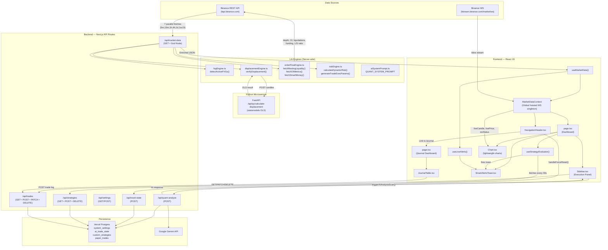
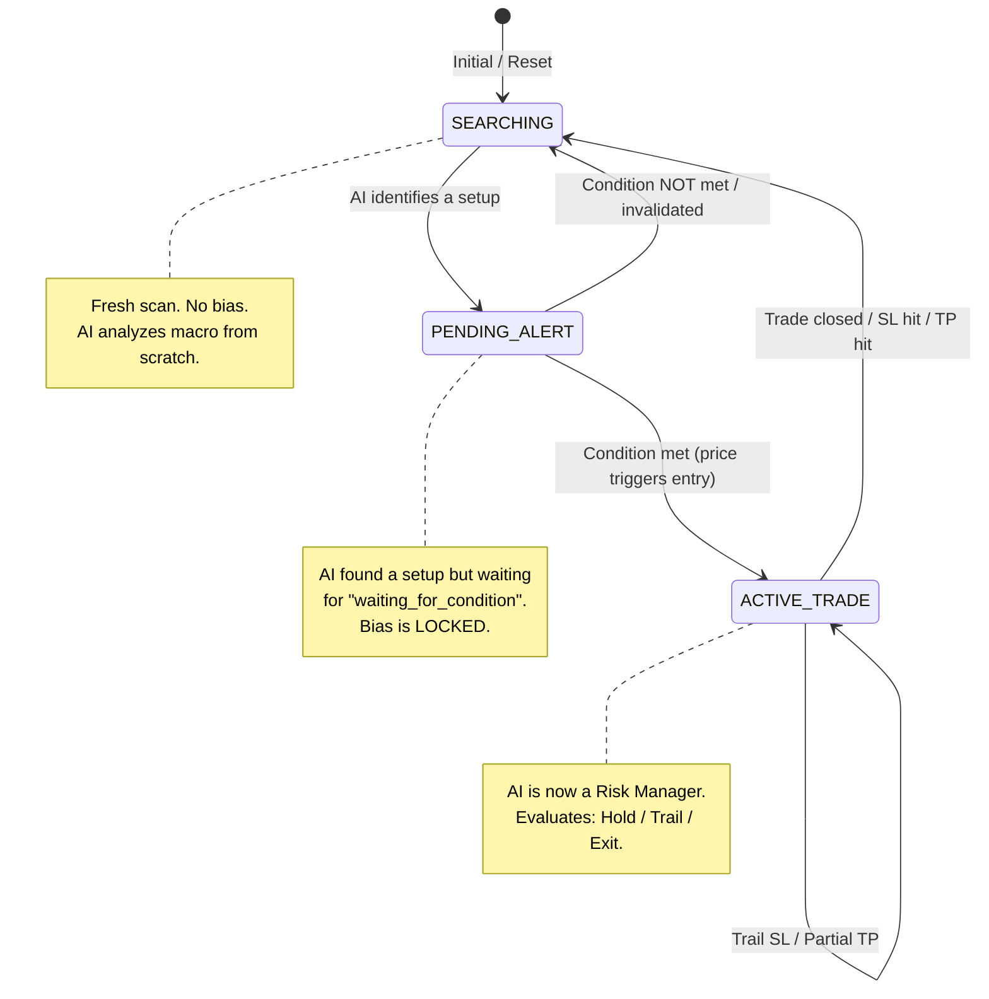

# 🏛️ MASTER BLUEPRINT — Flow-State Quant Engine V8.2

> **Classification:** Institutional Architecture Document  
> **Generated:** 2026-05-22  
> **Scope:** Full System Deconstruction — Satellite Scan + Microscopic Audit  
> **Source Files Analyzed:** 30+ across TypeScript (Next.js 16), Python (FastAPI), and Markdown directives.

---

## 📋 Table of Contents

1. [Executive Summary](#1-executive-summary)
2. [System Architecture Diagram](#2-system-architecture-diagram)
3. [Layer 1: The Structural Layer (IPDA Matrix)](#3-layer-1-the-structural-layer-ipda-matrix)
4. [Layer 2: The Volumetric Layer (Displacement & OLS)](#4-layer-2-the-volumetric-layer-displacement--ols)
5. [Layer 3: The Order Flow Layer (Binance Level 2)](#5-layer-3-the-order-flow-layer-binance-level-2)
6. [Layer 4: The Execution Layer (Safety Gates)](#6-layer-4-the-execution-layer-safety-gates)
   - [6.6 Automated Paper Trading Execution Engine (`/api/trades`)](#66-automated-paper-trading-execution-engine-apitrades)
   - [6.7 Strategic Equation Builder Runtime & Temporal Engine](#67-strategic-equation-builder-runtime--temporal-engine)
7. [Layer 5: The Stateful API Layer (Memory & Database)](#7-layer-5-the-stateful-api-layer-memory--database)
8. [The Matrix Cheat-Sheet (Variable Reference)](#8-the-matrix-cheat-sheet)
9. [Logic Flowchart: Liquidity Sweep → Order Execution](#9-logic-flowchart)
10. [API Documentation](#10-api-documentation)
    - [GET /api/trades](#get-apitrades)
    - [POST /api/trades](#post-apitrades)
    - [PATCH /api/trades](#patch-apitrades)
    - [DELETE /api/trades](#delete-apitrades)
    - [GET /api/strategies](#get-apistrategies)
    - [POST /api/strategies](#post-apistrategies)
    - [DELETE /api/strategies](#delete-apistrategies)
11. [Edge Case Audit & ABORT Conditions](#11-edge-case-audit)
12. [Logic Debt Register](#12-logic-debt-register)

---

## 1. Executive Summary

### Philosophy: Capital Preservation > Prediction

The Flow-State Quant Engine is **NOT** a prediction engine. It is a **reaction engine** built on the Interbank Price Delivery Algorithm (IPDA) framework. Its core doctrine — "The Naked Data Rule" — strictly forbids retail indicators (RSI, MACD, trendlines) and operates exclusively on:

| Pillar | Description |
|---|---|
| **Time** | Killzone temporal windows (Asian, London AM, NY AM, NY PM) |
| **Price** | Dealing ranges, equilibrium, PDH/PDL macro levels |
| **Volume** | Taker buy/sell delta, anomaly multiplier, displacement |
| **Engineered Liquidity** | BSL/SSL Magnets, FVGs, SMT Traps, Liquidation Events |

### Tech Stack

| Layer | Technology | Role |
|---|---|---|
| **Frontend** | Next.js 16 (App Router) + React 19 + Tailwind v4 | Dashboard, Chart, Alerts, Dedicated Journal `/journal` |
| **Charting** | `lightweight-charts` v5.2 | OHLCV candlestick rendering |
| **Real-time** | Binance Futures WebSocket (`/market/ws`) | Live tick feed (5m klines) hoisted to global MarketDataProvider context |
| **API Layer** | Next.js Route Handlers (`/api/market-data`, `/api/quant-analyze`, `/api/trades`, `/api/strategies`) | Data orchestration, CRUD, automated execution engine |
| **Statistical Engine** | Python FastAPI + `statsmodels` OLS | Displacement validation |
| **AI Synthesis** | Google Gemini API (`@google/generative-ai`) | Trade signal generation |
| **State Persistence** | Vercel Postgres (`@vercel/postgres`) | AI memory, terminal settings, custom strategies, paper trades |
| **Auth** | NextAuth v5 (beta) + proxy.ts | Session-gated access |

### Data Flow Summary

```
Binance REST API (7 endpoints)
        ↓
/api/market-data (GET) — "The God Node" (Enriched JSON Payload)
        ↓
        ├──────────────────────────┐
        ▼                          ▼
   Client HUD State           useStrategyEvaluator (evaluates user formulas)
 (useMarketDataContext)            │
        │                          ├─► Matches? ──► Toast HUD & Audio Alarm
        ▼                          ▼
   ┌────┴──────────────┐      /api/strategies (GET/POST/DELETE)
   ▼                   ▼
 Chart.tsx         Sidebar.tsx (Institutional Risk parameters)
   ▲                   │
   │               [AUTO EXECUTE] ──► /api/trades (POST)
   │                   │                 │ (1:2 RR Validation Gate)
   │                   │                 ▼
   │                   │             paper_trades table (PostgreSQL)
   │                   │
   │               [AI ANALYZE] ──► /api/quant-analyze (POST)
   │                                     │
   │                                     ▼
   │                              Gemini AI Synthesis
   │                                     │
   │                                     ▼
   │                             ai_trade_state (Memory)
   │
   └─ Binance WS (Live Tick Hoisted Context) ──► Chart.update() & livePrice
```

---

## 2. System Architecture Diagram



---

## 3. Layer 1: The Structural Layer (IPDA Matrix)

All structural calculations are performed server-side in [route.ts](file:///c:/My%20Files/Work/Lab/Gem_Charts_Data/src/app/api/market-data/route.ts).

### 3.1 PDH / PDL (Previous Day High / Low)

**Source:** [route.ts#L115-L124](file:///c:/My%20Files/Work/Lab/Gem_Charts_Data/src/app/api/market-data/route.ts#L115-L124)

```
PDH = max(candle.h) WHERE candle.date_utc == yesterday
PDL = min(candle.l) WHERE candle.date_utc == yesterday
```

- Uses **1h candles** for calculation
- Date extraction uses `getUtcDate(t)` which strips the +3h offset: `new Date(t - utcPlus3OffsetMs)` to get true UTC
- Falls back to `pdl = 0` if no previous day data exists

### 3.2 Asian / London Session Ranges

**Source:** [route.ts#L127-L145](file:///c:/My%20Files/Work/Lab/Gem_Charts_Data/src/app/api/market-data/route.ts#L127-L145)

| Session | UTC Hours | Computed From |
|---|---|---|
| Asian Range | `00:00 – 07:00 UTC` | 15m candles |
| London Range | `07:00 – 12:00 UTC` | 15m candles |

```
asian_high = max(candle.h) WHERE today AND 0 <= hour_utc < 7
asian_low  = min(candle.l) WHERE today AND 0 <= hour_utc < 7
london_high = max(candle.h) WHERE today AND 7 <= hour_utc < 12
london_low  = min(candle.l) WHERE today AND 7 <= hour_utc < 12
```

### 3.3 Projected Targets (Standard Deviations from Asian Range)

**Source:** [route.ts#L273-L299](file:///c:/My%20Files/Work/Lab/Gem_Charts_Data/src/app/api/market-data/route.ts#L273-L299)

```
range = asian_high - asian_low

upward_dev_1.5 = asian_high + (range × 1.5)
upward_dev_2.0 = asian_high + (range × 2.0)
upward_dev_2.5 = asian_high + (range × 2.5)

downward_dev_1.5 = asian_low - (range × 1.5)
downward_dev_2.0 = asian_low - (range × 2.0)
downward_dev_2.5 = asian_low - (range × 2.5)
```

### 3.4 True Day Open (07:00 Cairo Anchor)

**Source:** [route.ts#L194-L214](file:///c:/My%20Files/Work/Lab/Gem_Charts_Data/src/app/api/market-data/route.ts#L194-L214)

```
true_day_open_0700 = candle_15m.open
  WHERE candle.utc_hours == 7 AND candle.utc_minutes == 0
  (searched backwards from most recent)
```

> [!IMPORTANT]
> The timestamp `t` already has `+3h` baked in by `formatCandles()`. So `getUTCHours() === 7` on the modified timestamp corresponds to `07:00 Cairo / 04:00 UTC / NY Midnight`.

### 3.5 Equilibrium & Pricing Context

**Source:** [route.ts#L314-L391](file:///c:/My%20Files/Work/Lab/Gem_Charts_Data/src/app/api/market-data/route.ts#L314-L391)

```
intraday_high = max(candle.h) WHERE today AND hour_cairo >= 07:00
intraday_low  = min(candle.l) WHERE today AND hour_cairo >= 07:00
equilibrium   = (intraday_high + intraday_low) / 2

current_status = price > equilibrium ? "PREMIUM" : "DISCOUNT"
vs_daily_open  = price > true_day_open ? "ABOVE_OPEN" : "BELOW_OPEN"
```

### 3.6 Target Exhaustion & "PURGED 🧹" Status

**Source:** [route.ts#L147-L192](file:///c:/My%20Files/Work/Lab/Gem_Charts_Data/src/app/api/market-data/route.ts#L147-L192)

The `target_status` is computed by scanning **all of today's 15m candles** for sweep events:

| Condition | Status Emitted |
|---|---|
| Any candle `high >= PDH` OR `low <= PDL` | `"EXHAUSTED"` |
| Candle after 07:00 UTC sweeps Asian High (but < PDH) | `"ASIAN_HIGH_SWEPT"` |
| Candle after 07:00 UTC sweeps Asian Low (but > PDL) | `"ASIAN_LOW_SWEPT"` |
| Candle after 12:00 UTC sweeps London High (but < PDH) | `"LONDON_HIGH_SWEPT"` |
| Candle after 12:00 UTC sweeps London Low (but > PDL) | `"LONDON_LOW_SWEPT"` |
| No sweeps detected | `"PENDING"` |
| Mix of session sweeps but no PDH/PDL hit | `"ASIAN_HIGH_SWEPT \| LONDON_LOW_SWEPT / PDH_PDL_PENDING"` |

The **"PURGED 🧹"** visual indicator in the Sidebar is a **client-side** real-time comparison:

**Source:** [Sidebar.tsx#L299-L302](file:///c:/My%20Files/Work/Lab/Gem_Charts_Data/src/components/Sidebar.tsx#L299-L302)

```
BSL: isPurged = livePrice >= BSL_Magnet_price
SSL: isPurged = livePrice <= SSL_Magnet_price
```

> When `isPurged` is true, the magnet price gets `line-through` CSS + the `[ PURGED 🧹 ]` badge.

### 3.7 Killzone Clock (Time Window)

**Source:** [route.ts#L302-L312](file:///c:/My%20Files/Work/Lab/Gem_Charts_Data/src/app/api/market-data/route.ts#L302-L312)

| Cairo Time (UTC+3) | Value |
|---|---|
| 03:00 – 06:00 | `ASIAN_RANGE` |
| 09:00 – 11:00 | `LONDON_AM_KILLZONE` |
| 15:00 – 17:00 | `NY_AM_KILLZONE` |
| 20:00 – 21:00 | `NY_PM_KILLZONE` |
| All other hours | `DEAD_ZONE` |

> [!WARNING]
> **Logic Debt #1:** The Killzone clock uses `new Date().getTime() + 3h` then reads `getUTCHours()`, which relies on server system time. On Vercel, this should be UTC. Locally, this could drift if the system clock is not UTC.

### 3.8 FVG Detection Engine

**Source:** [fvgEngine.ts](file:///c:/My%20Files/Work/Lab/Gem_Charts_Data/src/lib/fvgEngine.ts)

```
BISI (Bullish FVG): candle[i+2].low > candle[i].high
  → top = candle[i+2].low, bottom = candle[i].high

SIBI (Bearish FVG): candle[i].low > candle[i+2].high
  → top = candle[i].low, bottom = candle[i+2].high

CE (Consequent Encroachment) = (top + bottom) / 2
```

**Mitigation check:** A BISI is mitigated if any future candle's `low <= bottom`. A SIBI is mitigated if any future candle's `high >= top`.

Both 15m and 5m FVGs are detected and merged via [mapAndConsolidateFVGs()](file:///c:/My%20Files/Work/Lab/Gem_Charts_Data/src/lib/fvgEngine.ts#L79-L93).

### 3.9 SMT Trap Detector

**Source:** [route.ts#L217-L240](file:///c:/My%20Files/Work/Lab/Gem_Charts_Data/src/app/api/market-data/route.ts#L217-L240)

Scans the last 20 15m candles for swing highs using a 3-bar pattern (`curr.h > prev.h AND curr.h > next.h`). If two swing highs are within `$0.50` of each other, it flags an `engineered_liquidity` SMT trap.

> [!NOTE]
> This detector does NOT use the "Strict Directional Lock" (color validation) described in [02_lessons.md](file:///c:/My%20Files/Work/Lab/Gem_Charts_Data/directives/02_lessons.md#L7-L9) and [03_quant_logic.md](file:///c:/My%20Files/Work/Lab/Gem_Charts_Data/directives/03_quant_logic.md#L6-L10). See **Logic Debt #2**.

### 3.10 Historical Magnets (HTF Scanner)

**Source:** [route.ts#L242-L271](file:///c:/My%20Files/Work/Lab/Gem_Charts_Data/src/app/api/market-data/route.ts#L242-L271)

| Metric | Source | Calculation |
|---|---|---|
| `nearest_weekly_high` | Last 4 completed weekly candles | `max(high)` |
| `nearest_weekly_low` | Last 4 completed weekly candles | `min(low)` |
| `nearest_daily_sibi` | Last 30 daily candles | Closest unmitigated SIBI above price |
| `nearest_daily_bisi` | Last 30 daily candles | Closest unmitigated BISI below price |

---

## 4. Layer 2: The Volumetric Layer (Displacement & OLS)

### 4.1 Architecture: Dual-Engine Failsafe

The Displacement Engine uses a **two-tier validation** architecture:

```
Tier 1 (TypeScript — offline):  verifyDisplacementOffline()   → instant, no stats
Tier 2 (Python — online):      FastAPI OLS endpoint           → statsmodels validation
```

The TypeScript [verifyDisplacement()](file:///c:/My%20Files/Work/Lab/Gem_Charts_Data/src/lib/displacementEngine.ts#L77-L126) calls the Python service with a **1.2-second timeout**. On failure, it silently falls back to the offline result (which has `t_statistic: 0, p_value: 1, confidence_level: LOW`).

### 4.2 The Anomaly Multiplier (2.5x Threshold)

**Source:** [displacementEngine.ts#L56-L62](file:///c:/My%20Files/Work/Lab/Gem_Charts_Data/src/lib/displacementEngine.ts#L56-L62) and [quant_engine_api.py#L146-L151](file:///c:/My%20Files/Work/Lab/Gem_Charts_Data/quant_engine_api.py#L146-L151)

The anomaly multiplier answers: *"Is the latest candle's taker volume abnormally high compared to the 14-period average?"*

```python
# Python (production)
avg_buy_vol  = mean(prior_14_candles.taker_buy_vol)
avg_sell_vol = mean(prior_14_candles.taker_sell_vol)

# Bullish Displacement
IF candle.close > candle.open                    # Candle is green
   AND taker_buy_vol > (avg_buy_vol × 2.5)      # Buy volume is 2.5x+ above average
   AND avg_buy_vol > 0                           # Guard against division by zero
THEN:
   status = "ACTIVE_BULLISH"
   anomaly_multiplier = taker_buy_vol / avg_buy_vol

# Bearish Displacement (mirror logic)
IF candle.close < candle.open
   AND taker_sell_vol > (avg_sell_vol × 2.5)
THEN:
   status = "ACTIVE_BEARISH"
   anomaly_multiplier = taker_sell_vol / avg_sell_vol
```

> The **latest closed candle** is `candles[length - 2]` because Binance's last candle is always the current (open) candle.

### 4.3 OLS Statistical Validation (Python Microservice)

**Source:** [quant_engine_api.py#L95-L128](file:///c:/My%20Files/Work/Lab/Gem_Charts_Data/quant_engine_api.py#L95-L128)

The Python service fits an **Ordinary Least Squares (OLS) regression** to validate whether the `anomaly_multiplier` has statistically significant predictive power over **future 1-candle returns**.

```
Model: future_return ~ const + anomaly_multiplier + volume_delta + is_dead_zone

Where:
  future_return      = pct_change(close).shift(-1)    # Forward return
  anomaly_multiplier = volume / rolling_mean_14(volume)
  volume_delta       = taker_buy_vol - taker_sell_vol
  is_dead_zone       = 1 if hour ∈ {12, 13, 14} else 0
```

**Validation tiers:**

| p-value | Confidence Level | Risk Authorization |
|---|---|---|
| `< 0.05` | **HIGH** | `FULL_RISK` authorized |
| `< 0.15` | **MEDIUM** | `HALF_RISK_CONTINUATION` |
| `>= 0.15` | **LOW** | `STAND_DOWN` (unless `anomaly_multiplier > 3.0`) |

**The `confidence_interval_95` boolean:**

```python
confidence_interval_95 = (p_value < 0.15) AND (t_statistic > 1.96)
```

> [!WARNING]
> **Logic Debt #3:** The `confidence_interval_95` name is misleading. A true 95% CI requires `p_value < 0.05`. The current check uses `p_value < 0.15` (which is an ~85% CI) combined with `t_stat > 1.96` (which is the z-score for 95% CI in a normal distribution). This hybrid condition is intentional for backward compatibility but is mathematically inconsistent.

### 4.4 Dead Zone Detection in OLS

The Python model includes `is_dead_zone` as a control variable. Hours `12, 13, 14` (on the UTC+3 adjusted timestamps) are flagged. This allows the OLS to statistically discount displacement signals that occur during low-volume periods.

> [!WARNING]
> **Logic Debt #4:** The Python `is_dead_zone` uses hours `{12, 13, 14}` on the Cairo-offset timestamps, while the frontend `useLiveAlerts.ts` checks NY Time hours `{12}` and `{13 where min <= 30}`. These are different time zones and different hour ranges.

---

## 5. Layer 3: The Order Flow Layer (Binance Level 2)

All Order Flow data is fetched server-side in [orderFlowEngine.ts](file:///c:/My%20Files/Work/Lab/Gem_Charts_Data/src/lib/orderFlowEngine.ts).

### 5.1 BSL / SSL Magnets (Resting Liquidity Pools)

**Source:** [orderFlowEngine.ts#L24-L47](file:///c:/My%20Files/Work/Lab/Gem_Charts_Data/src/lib/orderFlowEngine.ts#L24-L47)

```
Endpoint: GET /fapi/v1/depth?symbol=ETHUSDC&limit=1000

BSL_Magnets = top 3 ask prices BY quantity (descending)
SSL_Magnets = top 3 bid prices BY quantity (descending)
```

These represent **concentrated resting orders** — engineered retail liquidity that institutional participants will target.

### 5.2 Open Interest Trend

**Source:** [orderFlowEngine.ts#L49-L78](file:///c:/My%20Files/Work/Lab/Gem_Charts_Data/src/lib/orderFlowEngine.ts#L49-L78)

```
Endpoint: GET /futures/data/openInterestHist?symbol=ETHUSDC&period=5m&limit=2

IF currOI > prevOI:
  trend = "RISING"
  IF price_also_rising: "RISING_WITH_PRICE"
  ELSE:                 "RISING_AGAINST_PRICE"
ELSE:
  trend = "FALLING"
  (same alignment check)
```

| OI Trend | Price Direction | Interpretation |
|---|---|---|
| `RISING_WITH_PRICE` | Aligned | Institutional conviction — validates setup |
| `RISING_AGAINST_PRICE` | Opposed | Potential trap / divergence |
| `FALLING_WITH_PRICE` | Aligned | Weak move — smart money exiting |
| `FALLING_AGAINST_PRICE` | Opposed | Potential bottom/top formation |

### 5.3 Liquidation Events

**Source:** [orderFlowEngine.ts#L80-L120](file:///c:/My%20Files/Work/Lab/Gem_Charts_Data/src/lib/orderFlowEngine.ts#L80-L120)

```
Endpoint: GET /fapi/v1/allForceOrders?symbol=ETHUSDC&limit=100

Filter: orders from last 1 hour only

For each order:
  IF side == "SELL": long_liquidation (longs getting stopped)
  IF side == "BUY":  short_liquidation (shorts getting stopped)

Volume = executedQty × averagePrice (USD value)

last_hour_purged:
  >= $1M → "1.5M_USD_LONGS_PURGED"
  >= $1K → "250K_USD_SHORTS_PURGED"
  else   → "$500_USD_LONGS_PURGED"
  none   → "NO_MAJOR_PURGE"

status:
  total_purged > $1M → "LIQUIDITY_SWEPT"
  else               → "NORMAL"
```

### 5.4 Smart Money Sentiment (Funding + L/S Ratio)

**Source:** [orderFlowEngine.ts#L132-L181](file:///c:/My%20Files/Work/Lab/Gem_Charts_Data/src/lib/orderFlowEngine.ts#L132-L181)

```
Funding Rate:
  > 0.0001  → "HIGHLY_POSITIVE_RETAIL_LONG"  (retail is overleveraged long)
  < -0.0001 → "NEGATIVE_RETAIL_SHORT"         (retail is overleveraged short)
  else      → "NEUTRAL"

Smart Money Divergence = true WHEN:
  Top trader L/S ratio < 1.0 AND funding = HIGHLY_POSITIVE_RETAIL_LONG
  (Smart money is SHORT while retail is LONG → divergence)
  OR
  Top trader L/S ratio > 1.0 AND funding = NEGATIVE_RETAIL_SHORT
  (Smart money is LONG while retail is SHORT → divergence)
```

### 5.5 How It Feeds Into the Final Signal

The `order_flow_engine` object is embedded inside `ipda_metrics` in the Enriched JSON payload:

```json
{
  "order_flow_engine": {
    "open_interest_trend": "RISING_WITH_PRICE",
    "displacement_sponsorship": "ACTIVE",
    "resting_liquidity_pools": { "BSL_Magnets": [...], "SSL_Magnets": [...] },
    "liquidation_events": { "last_hour_purged": "...", "status": "..." },
    "smart_money_sentiment": { "funding_rate_status": "...", "smart_money_divergence": false }
  }
}
```

The AI Prompt (Rule 4) instructs Gemini to cross-reference `open_interest_trend` and `volume_delta` alignment before authorizing any trade.

---

## 6. Layer 4: The Execution Layer (Safety Gates)

### 6.1 The Dynamic Risk Engine

**Source:** [riskEngine.ts#L1-L29](file:///c:/My%20Files/Work/Lab/Gem_Charts_Data/src/lib/riskEngine.ts#L1-L29)

```
calculateDynamicRisk(currentPrice, targetStatus, pdh, pdl, liquidationStatus):

GATE 1 — Kill-Switch:
  IF targetStatus == "EXHAUSTED" OR liquidationStatus == "LIQUIDITY_SWEPT":
    → mode = "OBSERVATION_ONLY"
    → "Macro targets exhausted or liquidity purged. Await Smart Money Reversal."

GATE 2 — "$10 Danger Zone" Veto:
  IF |currentPrice - PDH| <= $10 OR |currentPrice - PDL| <= $10:
    → mode = "HALF_RISK_CONTINUATION"
    → "Price is deeply inside the Danger Zone of a major historical magnet."

GATE 3 — Clear Runway:
  ELSE:
    → mode = "FULL_RISK_AUTHORIZED"
    → "Clear pricing runway with no immediate macro blockades."
```

### 6.2 Trade Execution Parameters Generator

**Source:** [riskEngine.ts#L46-L100](file:///c:/My%20Files/Work/Lab/Gem_Charts_Data/src/lib/riskEngine.ts#L46-L100)

```
generateTradeExecutionParameters(...):

risk_mode logic:
  IF target_status == "EXHAUSTED" OR time_window == "DEAD_ZONE":
    → "HALF_RISK_OR_STAND_DOWN"

  ELSE IF target_status contains "PENDING" AND sponsorship is ACTIVE:
    IF OLS confidence_interval_95 == true:
      → "FULL_MACRO_RISK"
    ELSE:
      → "HALF_RISK_OR_STAND_DOWN" (sponsorship active but fails stats)

  ELSE:
    → "STANDARD_RISK"

closest_active_fvg_ce:
  = FVG whose CE (50%) is nearest to current price

hard_invalidation_levels:
  bearish_invalidation = max(BSL_Magnets) + $0.50
  bullish_invalidation = min(SSL_Magnets) - $0.50
```

### 6.3 The AI Safety Gates (Prompt-Level Rules)

**Source:** [aiSystemPrompt.ts](file:///c:/My%20Files/Work/Lab/Gem_Charts_Data/src/lib/aiSystemPrompt.ts)

The AI system prompt enforces additional execution gates:

| Rule | Gate | Effect |
|---|---|---|
| Rule 2 | Quant-Displacement Synthesis | HIGH → FULL_RISK, MEDIUM → HALF_RISK, LOW → STAND_DOWN (unless anomaly > 3.0) |
| Rule 3 | Dual-Pricing & Judas Swing | Buy ONLY in DISCOUNT. FULL_RISK only when price < True Day Open (07:00 Cairo) |
| Rule 4 | Order Flow Validation | OI must align with trade direction |
| Rule 5 | Target Exhaustion Protocol | EXHAUSTED → switch to Smart Money Reversal mode |

### 6.4 The 1:2 RR Rule

This rule is **implicit in the AI prompt**, not explicitly coded in the TypeScript engines. The system prompt instructs Gemini to output `entry_zone`, `invalidation_sl`, and `take_profit_targets[]`. The expectation is that TP1 should be at minimum 2× the distance from entry to SL.

> [!NOTE]
> **Logic Debt #5:** The 1:2 RR constraint is not programmatically enforced anywhere in the codebase. It relies entirely on Gemini's compliance with the prompt instructions. A post-processing validation step could enforce this.

### 6.5 The Judas Swing (07:00 Cairo) Alignment

From the AI prompt Rule 3:

```
JUDAS SWING VETO: Authorize FULL_RISK ONLY when price is BELOW the True Day Open (07:00 Cairo)
```

This means for **long entries**, price must have swept below the 07:00 open before returning. The logic is that the initial move after the open is a "Judas Swing" — a false move designed to trap early-session retail traders.

---

### 6.6 Automated Paper Trading Execution Engine (`/api/trades`)

To bridge AI analysis and programmatic verification, V8.2 implements an automated execution and trade journaling engine at `/api/trades`. This serves as a strict mathematical safety gate enforcing risk-reward thresholds on trade logs.

#### 1. POST Execution Flow

1. **Authentication Gate:** The endpoint uses NextAuth `auth()` to validate user sessions (`401 Unauthorized` if missing) to restrict database mutations.
2. **Self-Healing Initialization:** On the first execution request, it dynamically validates the existence of the `paper_trades` table, running a `CREATE TABLE IF NOT EXISTS` if not found.
3. **Entry Price Fallback Chain:**
   - Explicit `entry_price` passed in body.
   - If missing, fallbacks to `closest_active_fvg_ce` (if unmitigated and active).
   - If missing, fallbacks to current market price (from `pricing_context` or the latest 5m candle close).
4. **Strict Stop Loss (SL) Offset:**
   - **LONG direction:** `bullish_invalidation - 0.05` (1 tick below bullish invalidation).
   - **SHORT direction:** `bearish_invalidation + 0.05` (1 tick above bearish invalidation).
   - Prevents floating-point discrepancies via specific mapping to `.toFixed(4)`.
5. **Take Profit (TP) Magnet Matching:**
   - Queries `BSL_Magnets` (for LONG) or `SSL_Magnets` (for SHORT).
   - Sequentially filters out resting liquidity price levels that fail to provide at least a **1:2 Risk-to-Reward (RR)** ratio from the Entry/Stop Loss dealing range.
   - Selects the nearest eligible magnet satisfying the condition.
6. **Programmatic Validation Gate:**
   - Verifies directional alignment: `Stop Loss < Entry < Take Profit` for Longs and `Stop Loss > Entry > Take Profit` for Shorts.
   - Enforces a strict `RR >= 2.0` threshold.
   - Rejects failing logs immediately with `400 Bad Request` and error payload `"Inefficient Algorithm: RR < 2.0"`.
7. **neon PostgreSQL Storage:** Inserts validated parameters with `status = 'OPEN'`.

---

### 6.7 Strategic Equation Builder Runtime & Temporal Engine

V8.2 integrates a **Strategy Architect** enabling users to compile row-based condition equations evaluated live.

#### 1. Runtime Metric Resolution Map
The execution hook `useStrategyEvaluator.ts` runs silently in the dashboard background and maps custom variables against live market payloads:

| Logic Metric | Evaluated Code Formula / Source | Return Type |
|---|---|---|
| `FVG` | `ipda_metrics.active_fvgs.length > 0` | boolean |
| `PRICE_IN_FVG` | `livePrice` is between the `top` and `bottom` coordinates of any FVG in `active_fvgs` | boolean |
| `DISPLACEMENT` | `institutional_sponsorship.status === 'ACTIVE_BULLISH' || status === 'ACTIVE_BEARISH' || status === 'ACTIVE'` | boolean |
| `DISPLACEMENT_VALUE` | `institutional_sponsorship.anomaly_multiplier` | number |
| `OI_TREND` | `order_flow_engine.open_interest_trend` (`RISING`/`FALLING`/`FLAT`) | string (enum) |
| `MSS` | `market_structure_shift` flag | boolean |
| `SMT` | `smart_money_sentiment.smart_money_divergence` | boolean |
| `PRICE_VS_OPEN` | `livePrice > true_day_open_0700` (`ABOVE`/`BELOW`) | string (enum) |
| `EQUILIBRIUM_STATUS` | `pricing_context.local_dealing_range.current_status` (`PREMIUM`/`DISCOUNT`) | string (enum) |
| `TARGET_EXHAUSTION` | `target_status` | string (enum) |
| `NEARBY_MAGNET` | `livePrice` within $\pm\$2.00$ of any resting bid/ask limit wall in `resting_liquidity_pools` | boolean |

#### 2. Temporal Gating Logic
Each condition features a temporal toggle:
- **⚡ TICK (Instant Mode):** Evaluated instantly on every incoming price tick. Bypasses `liveCandle.isClosed` gating completely.
- **🔒 CLOSE (Candle Close Mode):** The entire strategy is gated behind `liveCandle.isClosed === true`. If even one condition in the equation uses `CLOSE` mode, the engine blocks execution until the candle fully prints.

#### 3. Debounce Lock (Preventing Alert Loops)
To comply with Lesson #10, the evaluator tracks `lastFiredCandleTime` (mapped via `candleKey` per strategy) to prevent notification loops:
- **ON_CLOSE strategies:** Gated per-candle (`Number(liveCandle.time)`), allowing only one trigger event per candle.
- **INSTANT strategies:** Gated per-second (`Math.floor(Date.now() / 1000)`), allowing sub-second micro-ticks but debouncing multiple fires on the same second.

#### 4. High-Contrast HUD Toast Integration
Matches are piped as `STRATEGY_MATCHED` alert types to `SmartAlertsToast.tsx`, rendering with a pulsing crosshair icon, high-contrast black glassmorphism, and a vibrant `#50ffaf` green left accent border:
`[SYSTEM: STRATEGY_MATCHED → {STRATEGY_NAME}]`

---

## 7. Layer 5: The Stateful API Layer (Memory Protocol)

### 7.1 Database Schema

**Tables in Vercel Postgres:**

| Table | Key Column | Purpose |
|---|---|---|
| `system_settings` | `key_name` (UNIQUE) | Stores `GEMINI_LIVE_KEY`, `ACTIVE_MODEL`, `SYSTEM_PROMPT` |
| `ai_trade_state` | `id = 1` (singleton) | Stores the AI's `state_json` and `updated_at` |
| `custom_strategies` | `id` (UUID PRIMARY KEY) | Stores user custom strategy equations and logic rules |
| `paper_trades` | `id` (UUID PRIMARY KEY) | Stores active and completed paper trade execution logs |

#### Table: `custom_strategies`
```sql
CREATE TABLE IF NOT EXISTS custom_strategies (
  id UUID PRIMARY KEY DEFAULT gen_random_uuid(),
  user_id VARCHAR(255) NOT NULL,
  name VARCHAR(255) NOT NULL,
  logic_json JSONB NOT NULL,       -- Array of StrategyCondition objects
  is_active BOOLEAN DEFAULT true,
  created_at TIMESTAMP DEFAULT CURRENT_TIMESTAMP,
  updated_at TIMESTAMP DEFAULT CURRENT_TIMESTAMP
);
```

#### Table: `paper_trades`
```sql
CREATE TABLE IF NOT EXISTS paper_trades (
  id UUID PRIMARY KEY DEFAULT gen_random_uuid(),
  timestamp TIMESTAMP WITH TIME ZONE DEFAULT CURRENT_TIMESTAMP,
  symbol VARCHAR(50) NOT NULL,
  direction VARCHAR(10) NOT NULL,
  entry_price DECIMAL(18, 4) NOT NULL,
  stop_loss DECIMAL(18, 4) NOT NULL,
  take_profit DECIMAL(18, 4) NOT NULL,
  status VARCHAR(20) NOT NULL DEFAULT 'OPEN', -- 'OPEN', 'CLOSED', 'PAUSED'
  strategy_name VARCHAR(255) NOT NULL,
  ai_narrative_summary TEXT,
  created_at TIMESTAMP WITH TIME ZONE DEFAULT CURRENT_TIMESTAMP
);
```

### 7.2 State Machine Transitions

**Source:** [quant-analyze/route.ts](file:///c:/My%20Files/Work/Lab/Gem_Charts_Data/src/app/api/quant-analyze/route.ts)



### 7.3 The Invalidation Guard

**Source:** [quant-analyze/route.ts#L77-L107](file:///c:/My%20Files/Work/Lab/Gem_Charts_Data/src/app/api/quant-analyze/route.ts#L77-L107)

Before each Gemini call, the system checks if the stored `invalidation_level` has been breached:

```
IF state.trade_direction == "LONG" AND live_price <= invalidation_level:
  → BREACH → reset to SEARCHING

IF state.trade_direction == "SHORT" AND live_price >= invalidation_level:
  → BREACH → reset to SEARCHING

IF no direction specified:
  → ANY crossing = BREACH (conservative)
```

### 7.4 Memory Injection into Gemini

The prompt sent to Gemini is constructed as:

```
{SYSTEM_PROMPT}

=== MARKET DATA PAYLOAD ===
{Full enriched JSON}

=== [HISTORICAL MEMORY (CURRENT STATE)] ===
{ai_trade_state.state_json}
```

### 7.5 State Persistence After AI Response

The system extracts `next_database_state` from Gemini's JSON response and `UPDATE`s `ai_trade_state` row `id=1`. It uses a robust extraction pipeline:

1. Try `json` code block regex
2. Try direct `JSON.parse()` on the raw response
3. Try regex fallback for `"next_database_state": { ... }`

### 7.6 Manual Reset

**Source:** [reset-state/route.ts](file:///c:/My%20Files/Work/Lab/Gem_Charts_Data/src/app/api/reset-state/route.ts)

`POST /api/reset-state` (session-protected) resets `ai_trade_state` to `{ status: "SEARCHING" }`. Triggered from the NavigationHeader's "Reset" button.

---

## 8. The Matrix Cheat-Sheet

### Top-Level Payload (`/api/market-data` response)

| Variable | Type | Source | Significance |
|---|---|---|---|
| `ticker` | string | Hardcoded | Always `"ETHUSDC.p"` |
| `timestamp` | ISO string | Server time | Snapshot moment |
| `timezone` | string | Hardcoded | Always `"UTC+3"` |
| `open_interest` | number | Binance `/openInterest` | Current aggregate OI value |
| `data_payload` | object | Binance klines | Raw OHLCV: `candles_4h`, `candles_1h`, `candles_15m`, `candles_5m` |
| `risk_management` | object | `calculateDynamicRisk()` | `mode` + `reason` |
| `ipda_metrics` | object | Composite | **THE MASTER OBJECT** — see below |

### `ipda_metrics` (The Master Object)

| Key | Type | Formula / Source |
|---|---|---|
| `true_day_open` | number \| null | 07:00 Cairo candle open price |
| `current_time_window` | string | Killzone clock output |
| `institutional_sponsorship` | object | Displacement engine result |
| `current_pricing` | string | `PREMIUM` / `DISCOUNT` / `FAIR_VALUE` / `UNKNOWN` |
| `target_status` | string | Sweep exhaustion status |
| `macro_levels.pdh` | number | Previous day high |
| `macro_levels.pdl` | number | Previous day low |
| `macro_levels.asian_high` | number \| null | Asian session high |
| `macro_levels.asian_low` | number \| null | Asian session low |
| `macro_levels.true_day_open` | number \| null | (Duplicate of top-level) |
| `session_ranges.asian_range` | object | `{ high, low }` |
| `session_ranges.london_range` | object | `{ high, low }` |
| `historical_magnets` | object | Weekly H/L + nearest daily SIBI/BISI |
| `projected_targets` | object | Asian range standard deviations (1.5x, 2.0x, 2.5x) |
| `smt_traps` | array | Detected equal highs within $0.50 |
| `pricing_context` | object | `vs_daily_open` + `local_dealing_range` |
| `order_flow_engine` | object | OI trend, liquidity pools, liquidations, sentiment |
| `active_fvgs` | array | Consolidated 15m + 5m unmitigated FVGs |
| `trade_execution_parameters` | object | Risk mode, closest FVG CE, invalidation levels |

### `institutional_sponsorship` (Displacement Result)

| Key | Type | Meaning |
|---|---|---|
| `status` | string | `ACTIVE_BULLISH`, `ACTIVE_BEARISH`, or `INACTIVE` |
| `anomaly_multiplier` | number | How many × above the 14-period average |
| `volume_delta` | number | `taker_buy_vol - taker_sell_vol` |
| `statistical_validation.t_statistic` | number | OLS t-value for `anomaly_multiplier` coefficient |
| `statistical_validation.p_value` | number | OLS p-value (lower = more significant) |
| `statistical_validation.confidence_level` | string | `HIGH` (< 0.05), `MEDIUM` (< 0.15), `LOW` (≥ 0.15) |
| `statistical_validation.confidence_interval_95` | boolean | `p < 0.15 AND t > 1.96` |

### `order_flow_engine`

| Key | Type | Meaning |
|---|---|---|
| `open_interest_trend` | string | `RISING_WITH_PRICE`, `FALLING_AGAINST_PRICE`, etc. |
| `displacement_sponsorship` | string | `ACTIVE` if sponsorship ≠ INACTIVE, else `INACTIVE` |
| `resting_liquidity_pools.BSL_Magnets` | number[] | Top 3 ask wall prices |
| `resting_liquidity_pools.SSL_Magnets` | number[] | Top 3 bid wall prices |
| `liquidation_events.last_hour_purged` | string | Formatted USD purge string |
| `liquidation_events.status` | string | `LIQUIDITY_SWEPT` (> $1M) or `NORMAL` |
| `smart_money_sentiment.funding_rate_status` | string | Retail positioning signal |
| `smart_money_sentiment.smart_money_divergence` | boolean | True if smart money opposes retail |

### `trade_execution_parameters`

| Key | Type | Meaning |
|---|---|---|
| `risk_mode` | string | `FULL_MACRO_RISK`, `HALF_RISK_OR_STAND_DOWN`, `STANDARD_RISK` |
| `closest_active_fvg_ce` | number \| null | Nearest FVG 50% level to current price |
| `hard_invalidation_levels.bearish_invalidation` | number \| null | `max(BSL) + $0.50` |
| `hard_invalidation_levels.bullish_invalidation` | number \| null | `min(SSL) - $0.50` |

---

## 9. Logic Flowchart

### From Liquidity Sweep to Order Execution

```
[START: Market Data Fetch]
     │
     ▼
[1] Fetch 7 Binance endpoints (5m, 15m, 1h, 4h, 1d, 1w, OI)
     │
     ▼
[2] Format candles → Add UTC+3 offset → Compute PDH/PDL
     │
     ▼
[3] Detect Asian/London session ranges
     │
     ▼
[4] Scan today's candles for sweep events
     │
     ├── PDH/PDL breached? → target_status = "EXHAUSTED"
     ├── Asian/London swept? → target_status = "ASIAN_HIGH_SWEPT / PDH_PDL_PENDING"
     └── No sweeps? → target_status = "PENDING"
     │
     ▼
[5] Compute True Day Open (07:00 Cairo)
     │
     ▼
[6] Determine current_pricing: PREMIUM / DISCOUNT / FAIR_VALUE
     │
     ▼
[7] Detect FVGs (15m + 5m) → Filter unmitigated
     │
     ▼
[8] Call Python OLS service → Get displacement validation
     │    ├── Online: full OLS stats (t-stat, p-value, confidence)
     │    └── Offline fallback: anomaly check only (stats = zero)
     │
     ▼
[9] Fetch Order Flow:
     │    ├── Depth API → BSL/SSL Magnets (top 3 walls)
     │    ├── OI History → RISING/FALLING + price alignment
     │    ├── Force Orders → Liquidation volume
     │    └── Funding + L/S Ratio → Smart Money Divergence
     │
     ▼
[10] Run Safety Gates:
     │
     │   ┌─ GATE 1: Target Exhaustion Kill-Switch
     │   │    IF EXHAUSTED OR LIQUIDITY_SWEPT → OBSERVATION_ONLY
     │   │
     │   ├─ GATE 2: $10 Danger Zone Veto
     │   │    IF |price - PDH| ≤ $10 OR |price - PDL| ≤ $10 → HALF_RISK
     │   │
     │   ├─ GATE 3: Temporal Dead Zone
     │   │    IF time_window == DEAD_ZONE → HALF_RISK_OR_STAND_DOWN
     │   │
     │   ├─ GATE 4: OLS Confidence Gate
     │   │    IF sponsorship ACTIVE but confidence_interval_95 == false → HALF_RISK
     │   │
     │   └─ GATE 5 (AI-level): Judas Swing Veto
     │        FULL_RISK only if price < True Day Open
     │
     ▼
[11] Assemble Enriched JSON → Return to client (5s polling)
     │
     ▼
[12] User triggers "Synthesize Live Data"
     │
     ▼
[13] POST /api/quant-analyze:
     │    ├── Fetch state from ai_trade_state
     │    ├── Check Invalidation Guard (breach? → reset to SEARCHING)
     │    ├── Inject system prompt + payload + memory
     │    └── Call Gemini API
     │
     ▼
[14] Gemini returns structured JSON:
     │    ├── diagnostics: { master_bias, target_status }
     │    ├── execution: { signal, risk_mode, entry, SL, TP[] }
     │    ├── next_database_state: { status, direction, invalidation, condition }
     │    └── narrative: explanation of decision
     │
     ▼
[15] Upsert next_database_state → Vercel Postgres
     │
     ▼
[16] Render in Sidebar Synthesis Console (HUD table / JSON view)
```

---

## 10. API Documentation

### `GET /api/market-data`

**Purpose:** The God Node. Fetches all Binance data, computes IPDA metrics, and returns the Enriched JSON payload.

| Parameter | Default | Description |
|---|---|---|
| `symbol` | `ETHUSDC` | Binance Futures symbol |
| `limit5m` | `300` | Max 5m candles returned |
| `limit15m` | `200` | Max 15m candles returned |
| `limit1h` | `100` | Max 1h candles returned |
| `limit4h` | `100` | Max 4h candles returned |

**Response:** Full payload as documented in the [Cheat-Sheet](#8-the-matrix-cheat-sheet).

---

### `POST /api/quant-analyze`

**Purpose:** Sends the market data to Gemini for AI synthesis, manages stateful memory.

**Request Body:** The full market data payload (same as GET response), optionally with `alert_metadata`.

**Response:**
```json
{ "analysis": "Raw Gemini text response (JSON or markdown)" }
```

**Error Responses:**
- `500` — Missing API key, model, or system prompt
- `500` — Gemini API error

---

### `POST /api/py/calculate-displacement`

**Purpose:** Statistical displacement validation via Python OLS.

**Request Body:** Array of candle objects:
```json
[{
  "t": 1716400000000,
  "o": 2500.0, "h": 2510.0, "l": 2495.0, "c": 2505.0,
  "v": 15000.0,
  "taker_buy_vol": 9000.0,
  "taker_sell_vol": 6000.0
}]
```

**Response:** `DisplacementResponse` object (see Cheat-Sheet).

**Minimum:** 16 candles required (400 error otherwise).

---

### `POST /api/reset-state`

**Purpose:** Force-reset AI memory to `SEARCHING`.

**Auth:** Requires valid NextAuth session.

**Response:**
```json
{
  "success": true,
  "message": "AI state has been reset to SEARCHING.",
  "resetBy": "user@email.com",
  "timestamp": "2026-05-22T20:00:00.000Z"
}
```

---

### `GET /api/settings` + `POST /api/settings`

**Purpose:** CRUD for system configuration (API keys, model name, system prompt).

**Auth:** Both require valid NextAuth session.

**GET Response:**
```json
{ "settings": { "GEMINI_LIVE_KEY": "...", "ACTIVE_MODEL": "...", "SYSTEM_PROMPT": "..." } }
```

**POST Body:**
```json
{ "settings": { "ACTIVE_MODEL": "gemini-2.0-flash" } }
```

---

### `POST /api/trades`

**Purpose:** Logs a new trade after executing calculations for entry price fallbacks, stopping logic (1 tick offset), and 1:2 Risk-to-Reward magnet filtration.

**Auth:** Requires valid NextAuth session.

**Request Body:**
```json
{
  "symbol": "ETHUSDC",
  "direction": "LONG",
  "strategy_name": "Displacement Breakout",
  "ai_narrative_summary": "Displacement is active with p-value < 0.05. Target SSL magnet.",
  "ipda_metrics": { ... }
}
```

**Response:**
```json
{
  "success": true,
  "trade_id": "8f89bc44-59e8-469b-98f9-46706e23297a",
  "timestamp": "2026-05-23T22:45:00.000Z",
  "execution_parameters": {
    "symbol": "ETHUSDC",
    "direction": "LONG",
    "entry_price": 2510,
    "stop_loss": 2499.95,
    "take_profit": 2560,
    "status": "OPEN",
    "risk_reward_ratio": 4.9751,
    "risk_amount": 10.05,
    "reward_amount": 50,
    "strategy_name": "Displacement Breakout",
    "ai_narrative_summary": "..."
  }
}
```

**Error Responses:**
- `401` — Unauthorized (no active session)
- `400` — `Inefficient Algorithm: RR < 2.0` (Risk to Reward fails 1:2 gate)
- `400` — Missing required parameters or directional invalidation mismatch

---

### `GET /api/trades`

**Purpose:** Retrieves all trade rows from `paper_trades` ordered by `created_at` DESC.

**Auth:** Requires valid NextAuth session.

**Response:**
```json
{
  "success": true,
  "trades": [
    {
      "id": "8f89bc44-59e8-469b-98f9-46706e23297a",
      "timestamp": "2026-05-23T22:45:00.000Z",
      "symbol": "ETHUSDC",
      "direction": "LONG",
      "entry_price": "2510.0000",
      "stop_loss": "2499.9500",
      "take_profit": "2560.0000",
      "status": "OPEN",
      "strategy_name": "Displacement Breakout",
      "ai_narrative_summary": "...",
      "created_at": "2026-05-23T22:45:00.000Z"
    }
  ]
}
```

---

### `PATCH /api/trades`

**Purpose:** Updates the tracking status of a specific trade log (OPEN, CLOSED, PAUSED).

**Auth:** Requires valid NextAuth session.

**Request Body:**
```json
{
  "trade_id": "8f89bc44-59e8-469b-98f9-46706e23297a",
  "status": "PAUSED"
}
```

**Response:**
```json
{
  "success": true,
  "message": "Trade status updated to PAUSED.",
  "trade": {
    "id": "8f89bc44-59e8-469b-98f9-46706e23297a",
    "status": "PAUSED"
  }
}
```

---

### `DELETE /api/trades`

**Purpose:** Surgically deletes a trade log from the database.

**Auth:** Requires valid NextAuth session.

**Query Parameter or Body:**
```json
{
  "trade_id": "8f89bc44-59e8-469b-98f9-46706e23297a"
}
```

**Response:**
```json
{
  "success": true,
  "message": "Trade successfully purged from the database.",
  "deleted_id": "8f89bc44-59e8-469b-98f9-46706e23297a"
}
```

---

### `GET /api/strategies`

**Purpose:** Retrieves all strategy equations defined by the authenticated user, sorted by creation date.

**Auth:** Requires valid NextAuth session.

**Response:**
```json
{
  "strategies": [
    {
      "id": "a90df1a5-8c0c-4ff6-8367-e95b0fb2d8d8",
      "name": "Displacement with FVG Close",
      "conditions": [
        { "metric": "DISPLACEMENT", "operator": "==", "value": "ACTIVE_BULLISH", "temporal": "TICK" },
        { "metric": "FVG", "operator": "==", "value": "true", "temporal": "CLOSE" }
      ],
      "is_active": true,
      "created_at": "2026-05-23T21:30:00.000Z",
      "updated_at": "2026-05-23T21:30:00.000Z"
    }
  ]
}
```

---

### `POST /api/strategies`

**Purpose:** Upserts a custom strategy (creates new if `id` is omitted, updates if `id` matches an existing user-owned strategy).

**Auth:** Requires valid NextAuth session.

**Request Body:**
```json
{
  "id": "a90df1a5-8c0c-4ff6-8367-e95b0fb2d8d8",
  "name": "Displacement with FVG Close",
  "conditions": [
    { "metric": "DISPLACEMENT", "operator": "==", "value": "ACTIVE_BULLISH", "temporal": "TICK" }
  ],
  "is_active": true
}
```

**Response:**
```json
{
  "success": true,
  "id": "a90df1a5-8c0c-4ff6-8367-e95b0fb2d8d8",
  "message": "Strategy updated."
}
```

---

### `DELETE /api/strategies`

**Purpose:** Deletes a custom strategy by UUID, scoped by user ownership.

**Auth:** Requires valid NextAuth session.

**Request Body:**
```json
{
  "id": "a90df1a5-8c0c-4ff6-8367-e95b0fb2d8d8"
}
```

**Response:**
```json
{
  "success": true,
  "message": "Strategy deleted."
}
```

---

## 11. Edge Case Audit

### Hard [🚫 ABORT] Conditions

| # | Condition | Triggered By | Code Location |
|---|---|---|---|
| 1 | `target_status == "EXHAUSTED"` AND `liquidation_status == "LIQUIDITY_SWEPT"` | Kill-Switch in `calculateDynamicRisk()` | [riskEngine.ts#L9-L13](file:///c:/My%20Files/Work/Lab/Gem_Charts_Data/src/lib/riskEngine.ts#L9-L13) |
| 2 | `current_time_window == "DEAD_ZONE"` | Temporal filter | [riskEngine.ts#L59](file:///c:/My%20Files/Work/Lab/Gem_Charts_Data/src/lib/riskEngine.ts#L59), [useLiveAlerts.ts#L134-L146](file:///c:/My%20Files/Work/Lab/Gem_Charts_Data/src/hooks/useLiveAlerts.ts#L134-L146) |
| 3 | `confidence_level == "LOW"` AND `anomaly_multiplier <= 3.0` | AI Prompt Rule 2 | [aiSystemPrompt.ts#L17](file:///c:/My%20Files/Work/Lab/Gem_Charts_Data/src/lib/aiSystemPrompt.ts#L17) |
| 4 | Invalidation level breached (live price crosses SL) | Invalidation Guard | [quant-analyze/route.ts#L77-L107](file:///c:/My%20Files/Work/Lab/Gem_Charts_Data/src/app/api/quant-analyze/route.ts#L77-L107) |
| 5 | Price in PREMIUM zone attempting to BUY (without MSS from DISCOUNT) | AI Prompt Rule 3 | [aiSystemPrompt.ts#L20](file:///c:/My%20Files/Work/Lab/Gem_Charts_Data/src/lib/aiSystemPrompt.ts#L20) |

### Soft [⚪ STAND DOWN] Conditions

| # | Condition | Triggered By | Code Location |
|---|---|---|---|
| 1 | Price within $10 of PDH or PDL | Danger Zone Veto | [riskEngine.ts#L17-L22](file:///c:/My%20Files/Work/Lab/Gem_Charts_Data/src/lib/riskEngine.ts#L17-L22) |
| 2 | Sponsorship ACTIVE but `confidence_interval_95 == false` | OLS Downgrade | [riskEngine.ts#L61-L67](file:///c:/My%20Files/Work/Lab/Gem_Charts_Data/src/lib/riskEngine.ts#L61-L67) |
| 3 | No displacement detected (`status == "INACTIVE"`) | Displacement Engine | [displacementEngine.ts#L52](file:///c:/My%20Files/Work/Lab/Gem_Charts_Data/src/lib/displacementEngine.ts#L52) |
| 4 | Smart Money Divergence detected (retail opposing smart money) | SMT Trap Alert | [useLiveAlerts.ts#L199-L211](file:///c:/My%20Files/Work/Lab/Gem_Charts_Data/src/hooks/useLiveAlerts.ts#L199-L211) |
| 5 | `PENDING_ALERT` state but condition not met | Memory Protocol | [aiSystemPrompt.ts#L11](file:///c:/My%20Files/Work/Lab/Gem_Charts_Data/src/lib/aiSystemPrompt.ts#L11) |

### Alert Suppression Behavior

The `useLiveAlerts` hook **suppresses ALL non-DEAD_ZONE alerts** when the DEAD_ZONE is active ([useLiveAlerts.ts#L134-L146](file:///c:/My%20Files/Work/Lab/Gem_Charts_Data/src/hooks/useLiveAlerts.ts#L134-L146)). The early `return` prevents any subsequent alert checks from executing.

### Cooldown Timers

| Alert Type | Cooldown |
|---|---|
| `DEAD_ZONE` | 90 minutes |
| `PURGE` | 10 minutes |
| `RISK_OVERRIDE` | 5 minutes |
| `SMT_TRAP` | 5 minutes |
| `PRICING_SHIFT` | None (fires on every change) |
| `OBJECTIVE_UPDATE` | None (fires on every change) |
| `FLOW_STATE` | None (fires on every change) |
| `SESSION_TRANSITION` | None (fires on every change) |

---

## 12. Logic Debt Register

> [!CAUTION]
> These are discrepancies between the documentation (directives) and the actual code implementation.

| # | Category | Description | Severity |
|---|---|---|---|
| **LD-1** | Killzone Clock | `getCurrentKillzone()` shifts server time by +3h and reads UTC hours. On Vercel (UTC server), this correctly maps to Cairo time. Locally, if the system isn't UTC, it will produce incorrect windows. Additionally, the function has gaps: hours 7-8, 12-14, 18-19, 22+ are all `DEAD_ZONE`, which may be too aggressive. | 🟡 Medium |
| **LD-2** | SMT Trap Detector | The SMT/Equal Highs detector in `route.ts` uses pure 3-bar price-action fractal detection (`curr.h > prev.h && curr.h > next.h`) without the **"Strict Directional Lock" color validation** mandated by `02_lessons.md` Lesson #1 and `03_quant_logic.md` Section 1. This could produce false pivots from "Outside Bars." | 🔴 High |
| **LD-3** | Confidence Interval Naming | `confidence_interval_95` is TRUE when `p < 0.15 AND t > 1.96`. A true 95% CI requires `p < 0.05`. The name is misleading. Comment in code says "backward compatibility." | 🟡 Medium |
| **LD-4** | Dead Zone Time Mismatch | **Python OLS:** `is_dead_zone` flags hours `{12, 13, 14}` on Cairo-offset timestamps. **Frontend alerts:** checks NY Time `{12:00, 13:00-13:30}`. **Backend Killzone:** no explicit dead zone hours listed (any non-killzone hour). These are three different dead zone definitions across three different timezones. | 🔴 High |
| **LD-5** | 1:2 RR Rule | **Resolved in V8.2:** The `/api/trades` route now implements a strict programmatic validation gate validating that risk/reward ratio is strictly `>= 2.0` before any trade is permitted to log. Any failing payload is aborted with `400 Inefficient Algorithm`. *(Note: The AI synthesis endpoint `/api/quant-analyze` still relies on prompt adherence, but the actual execution journal acts as a bulletproof gate).* | 🟢 Resolved |
| **LD-6** | `true_day_open` Duplication | `ipda_metrics.true_day_open` and `ipda_metrics.macro_levels.true_day_open` contain the same value. One should be removed to reduce payload size and avoid confusion. | 🟢 Low |
| **LD-7** | Candle Interface Duplication | `Candle` is defined in both [fvgEngine.ts](file:///c:/My%20Files/Work/Lab/Gem_Charts_Data/src/lib/fvgEngine.ts#L1-L11) and [useMarketData.ts](file:///c:/My%20Files/Work/Lab/Gem_Charts_Data/src/hooks/useMarketData.ts#L5-L12). The hook version omits `taker_buy_vol` and `taker_sell_vol`. Should be consolidated into a single shared type. | 🟢 Low |
| **LD-8** | No-Direction Invalidation Guard | When `parsedState.trade_direction` is null/undefined, the invalidation guard in `quant-analyze/route.ts` sets `breached = true` unconditionally ([line 98](file:///c:/My%20Files/Work/Lab/Gem_Charts_Data/src/app/api/quant-analyze/route.ts#L95-L99)), meaning ANY state with an `invalidation_level` but no `trade_direction` will always reset to SEARCHING. | 🟡 Medium |
| **LD-9** | Python File Duplication | [quant_engine_api.py](file:///c:/My%20Files/Work/Lab/Gem_Charts_Data/quant_engine_api.py) (root, local dev) and [api/index.py](file:///c:/My%20Files/Work/Lab/Gem_Charts_Data/api/index.py) (Vercel deploy) contain identical logic but different route decorators. The root file has `/calculate-displacement` while `index.py` has `/api/py/calculate-displacement` + `/api/index`. Changes to one must be manually synced. | 🟡 Medium |
| **LD-10** | WebSocket vs API Time Sync | The WS hook bakes in `UTC_PLUS_3_OFFSET_S` (10,800s) to match the backend's `utcPlus3OffsetMs`. If either offset changes independently, the chart will show a 3-hour gap or overlap between historical bars and live ticks. No runtime validation ensures they match. | 🟡 Medium |
| **LD-11** | Server-Side Implicit Any Gating | **Resolved in V8.2:** The `/journal` page query had an implicit `any[]` declaration for `initialTrades` that caused Vercel deployment builds to fail under strict TypeScript compiling. Resolved by explicitly importing and applying the `TradeRecord[]` interface. | 🟢 Resolved |

---


> **End of Master Blueprint.** This document should be treated as the canonical reference for all future modifications to the Flow-State Quant Engine. When in doubt, trace back to the source files linked throughout this document.
