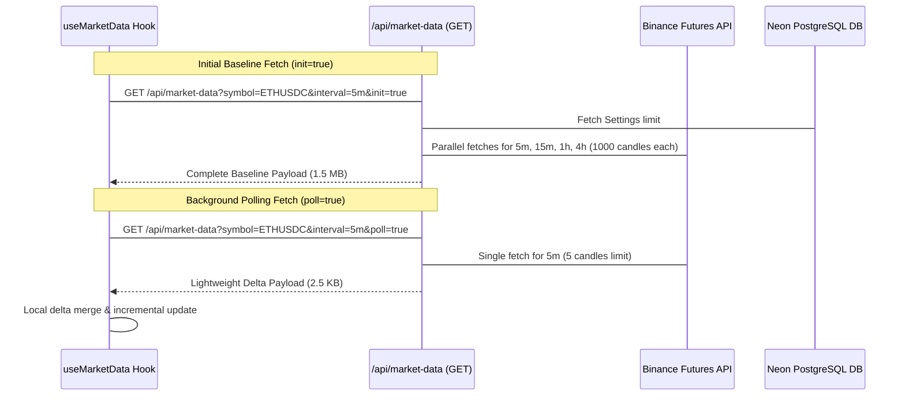

# Quantitative Performance Optimization Plan — Phase 1: Ingest & Payload Pruning

This document details the surgical, non-destructive implementation plan for **Phase 1: Ingest & Payload Pruning**, targeting the loading bottlenecks and network overhead of the Flow-State Quant Trading Engine.

---

## 1. Problem Definition & Architectural Audit

The current market data pipeline suffers from **Monolithic Payload Bloat**. Background REST polling occurs every 5 seconds, pulling up to 1,000 candles for four timeframes (`5m`, `15m`, `1h`, `4h`), background HTF scales (`1d`, `1w`, `1M`), and BTC correlation series. 

This results in:
* **2.0 MB uncompressed JSON payloads** transmitted over the network every 5 seconds.
* **10+ parallel REST fetches to Binance** per poll request, triggering geographical rate limits and forcing the engine into offline simulation mode.
* **Client-Side Discarding:** During background polling (`isPolling: true`), the client-side hook [useMarketData.ts](file:///c:/My%20Files/Work/Lab/Gem_Charts_Data/src/hooks/useMarketData.ts#L673-L678) discards the new `data_payload` and `ipda_metrics` to prevent the Lightweight-Charts canvas from re-triggering. This wastes server CPU resources and network bandwidth.

---

## 2. Proposed Changes

### A. Timeframe Gating (API Route)
We will introduce query parameters (`timeframeGated=true` and `activeInterval=<tf>`) to the `/api/market-data` endpoint in [route.ts](file:///c:/My%20Files/Work/Lab/Gem_Charts_Data/src/app/api/market-data/route.ts#L138).

* **Baseline Load (`init=true`):** The server returns the full multi-timeframe historical context trunk (4,000 candles, full FVG arrays, and macro structural indicators) to populate the client-side state.
* **Gated Polling (`timeframeGated=true`):** The server bypasses fetching high-timeframe candle arrays (`15m`, `1h`, `4h`, `1d`, `1w`, `1M` and `btc_15m` / `btc_1h`) if they are not the active interval. It only fetches the active visual timeframe's candles to perform OLS displacement and structural shift detection.
* **Downstream Alignment:** The server maps and returns only the active timeframe's FVG mitigation and market structure models, bypassing the other three inactive scales.

### B. Delta Compression Protocol (Client-Server Sync)
We will introduce a dynamic delta synchronization mechanism to bypass full historical transfers on background polls.

#### 1. Server-Side Delta Structure
When `poll=true` is requested, the endpoint GET handler in [route.ts](file:///c:/My%20Files/Work/Lab/Gem_Charts_Data/src/app/api/market-data/route.ts#L138) will:
* Restrict Binance REST limits for the active timeframe to the last **5 candles** (instead of 1,000).
* Skip all PostgreSQL transaction queries for trade monitoring unless the active candle's time interval boundaries have crossed (a new candle has closed).
* Package and serialize a lightweight JSON structure containing:
  ```typescript
  interface MarketDataDeltaPayload {
    isDelta: true;
    timestamp: string;
    open_interest: number;
    risk_management: any;
    correlation_data: {
      btc_live_price: number;
    };
    delta_candles: Candle[]; // Only the last 5 active timeframe candles
    order_flow_engine: {
      open_interest_trend: string;
      resting_liquidity_pools: { BSL_Magnets: number[]; SSL_Magnets: number[] };
      liquidation_events: any;
      smart_money_sentiment: any;
    };
    delta_structure?: {
      latestMSS: any;
      latestInternalMSS: any;
      currentTrend: string;
      dealingRange: any;
    };
  }
  ```

#### 2. Client-Side Smart Merge
In [useMarketData.ts](file:///c:/My%20Files/Work/Lab/Gem_Charts_Data/src/hooks/useMarketData.ts#L668-L685), instead of discarding the incoming payload during polling, we will perform a non-destructive merge:
* If the payload is a delta (`isDelta: true`), extract `delta_candles` and update the active timeframe's candle array.
* Merge the new `order_flow_engine` metrics, `open_interest`, and `risk_management` properties.
* Update `ipda_metrics` incrementally without mutating reference keys unless a candle has closed or a structural breach has occurred. This keeps the chart's visual indicators fresh (resolving the static layout bug) while preventing the visual canvas from flashing or re-triggering layers unnecessarily.

---

## 3. Detailed File Modifications [Planned]



---

### [Component: API Route Handlers]

#### [MODIFY] [route.ts](file:///c:/My%20Files/Work/Lab/Gem_Charts_Data/src/app/api/market-data/route.ts)
* **Add `poll` and `timeframeGated` URL search parameter checks.**
* **Optimize candle fetch limits dynamically:**
  * If `poll === 'true'`, set active timeframe fetch limits to `5` and disable fetching of inactive candle arrays (`candles_4h`, `candles_1h`, `candles_15m` if they are not the active interval).
  * If `timeframeGated === 'true'` and it is not an initial load (`init !== 'true'`), bypass loading and processing high-timeframe arrays.
* **Conditional OLS / Python Bridge:** Only run OLS statistical validation if `poll !== 'true'` or when a candle close event is detected (to avoid hitting statsmodels on intermediate tick refreshes).
* **Return the delta JSON schema:** If `poll === 'true'`, strip all nested static arrays and return the optimized `MarketDataDeltaPayload` structure.

---

### [Component: Client State & Hooks]

#### [MODIFY] [useMarketData.ts](file:///c:/My%20Files/Work/Lab/Gem_Charts_Data/src/hooks/useMarketData.ts)
* **Modify `fetchData` call parameters:** Pass `&poll=true` when `isPolling` is `true`. Pass `&timeframeGated=true` and `&activeInterval=${selectedInterval}` on subsequent fetches.
* **Implement the `mergeDeltaPayload` utility:**
  ```typescript
  function mergeDeltaPayload(
    prev: MarketDataPayload,
    delta: MarketDataDeltaPayload,
    activeInterval: string
  ): MarketDataPayload {
    const activeKey = `candles_${activeInterval}`;
    const prevCandles = prev.data_payload[activeKey] || [];
    
    // Merge only the last few candles, matching by timestamp
    const candleMap = new Map(prevCandles.map(c => [c.t, c]));
    delta.delta_candles.forEach(c => candleMap.set(c.t, c));
    const mergedCandles = Array.from(candleMap.values()).sort((a, b) => a.t - b.t);

    return {
      ...prev,
      open_interest: delta.open_interest,
      risk_management: delta.risk_management || prev.risk_management,
      correlation_data: {
        ...prev.correlation_data,
        btc_live_price: delta.correlation_data?.btc_live_price || prev.correlation_data?.btc_live_price,
      },
      ipda_metrics: {
        ...prev.ipda_metrics,
        order_flow_engine: {
          ...prev.ipda_metrics?.order_flow_engine,
          ...delta.order_flow_engine,
        },
        // Update structural delta components if available
        ...(delta.delta_structure ? {
          market_structure_shift: delta.delta_structure.currentTrend !== prev.ipda_metrics?.current_trend,
          current_trend: delta.delta_structure.currentTrend,
          full_structure_map: {
            ...prev.ipda_metrics?.full_structure_map,
            latestMSS: delta.delta_structure.latestMSS,
            latestInternalMSS: delta.delta_structure.latestInternalMSS,
            currentTrend: delta.delta_structure.currentTrend,
            dealingRange: delta.delta_structure.dealingRange,
          }
        } : {})
      },
      data_payload: {
        ...prev.data_payload,
        [activeKey]: mergedCandles,
      },
    };
  }
  ```
* **Hook into `setData`:** If `isPolling` is `true` and the backend returns a delta, apply `mergeDeltaPayload` to state. This updates the resting BSL/SSL targets and balance metrics dynamically, resolving the static UI bug.

---

## 4. Downstream & Backward Compatibility Guardrails

To ensure that pruning the payload does not disrupt downstream quantitative components, we will establish these safety gates:

1. **Downstream strategy evaluator (`useStrategyEvaluator`):**
   * The strategy evaluator [useStrategyEvaluator.ts](file:///c:/My%20Files/Work/Lab/Gem_Charts_Data/src/hooks/useStrategyEvaluator.ts#L423) reads variables from the global context: `data`, `livePrice`, and `liveCandle`.
   * Since our `mergeDeltaPayload` outputs a complete, fully matching `MarketDataPayload` interface, the evaluator receives the exact structure it expects.
   * If a strategy utilizes multi-timeframe conditions (such as checking `15m` FVGs while on the `5m` chart), the baseline values remain populated from the initial load trunk. The delta stream continues to update the active timeframe's candles to ensure entry accuracy.
2. **Replay Backtest Engine (`useBacktestEngine`):**
   * The historical replay engine in [useBacktestEngine.ts](file:///c:/My%20Files/Work/Lab/Gem_Charts_Data/src/hooks/useBacktestEngine.ts) loads days from Binance and constructs its own `enrichedPayload` inside local client memory.
   * Because the backtest engine does not poll `/api/market-data` dynamically during replay runs, it is completely isolated from REST delta updates. It will continue to run its mock payload simulations without any structural changes.
3. **TypeScript Interface Parity:**
   * No fields will be deleted from the `MarketDataPayload` interface.
   * High-timeframe fields in `data_payload` (e.g. `candles_1h`) will remain as valid arrays, preventing undefined errors in downstream components.

---

## 5. Verification Plan

### Automated Verification
* Run compilation tests to verify type compatibility:
  ```powershell
  npm run build
  ```
* Run a local backend request script to verify payload sizes:
  ```powershell
  # Check baseline size
  (Invoke-WebRequest -Uri "http://127.0.0.1:3000/api/market-data?symbol=ETHUSDC&interval=5m&init=true").Content.Length
  # Check delta size (should be < 5KB)
  (Invoke-WebRequest -Uri "http://127.0.0.1:3000/api/market-data?symbol=ETHUSDC&interval=5m&poll=true").Content.Length
  ```

### Manual Verification
* Deploy the gated route changes to local server boundaries (`127.0.0.1:3000`), launch the live chart, and observe client network telemetry via chrome devtools.
* Verify that changing chart timeframe intervals triggers a complete baseline fetch, and that regular background polling receives delta compression packets without causing flashes, gaps, or visual glitches on the Lightweight-Charts canvas.
