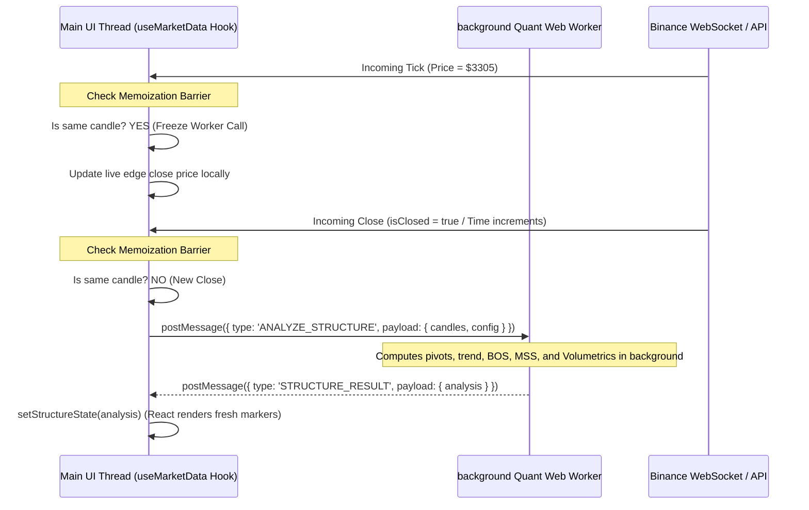

# Quantitative Performance Optimization Plan — Phase 2: Main-Thread Memoization & Worker Spawning

This document details the surgical, non-destructive implementation plan for **Phase 2: Main-Thread Memoization & Worker Spawning**, targeting main-thread blocking and UI render loop lags during high-frequency volatility spikes.

---

## 1. Architectural Audit & Main-Thread Blocking Analysis

During active market conditions, the client receives ticking updates from the Binance WebSocket stream via [useBinanceWS.ts](file:///c:/My%20Files/Work/Lab/Gem_Charts_Data/src/hooks/useBinanceWS.ts) multiple times per second. 
Under the current architecture:
1. **Historical Recalculations:** On every price tick, the client-side state is updated, which re-triggers the `useEffect` inside [useMarketData.ts](file:///c:/My%20Files/Work/Lab/Gem_Charts_Data/src/hooks/useMarketData.ts#L718-L746).
2. **Heavy Execution Footprint:** This effect runs `analyzeMarketStructure()`, which instantiates `MarketStructureAPI` and runs loops to detect swing pivots (5-Bar directional locks), BOS/MSS shifts, and structural dealing ranges over arrays of up to 1,000 candles.
3. **Volumetric Overhead:** In parallel, the rendering utils (like `generateVolumetricMarkers`) iterate through all candles using `annotateCandlesWithVolumetricSignals` on every canvas pass, blocking browser paint events.
4. **UI Degradation:** Running these heavy O(N) multi-bar scans on the UI render loop causes browser frame drops (down to 15-20 FPS) and introduces interactive delays in order placement, TP/SL drags, and workspace navigation.

---

## 2. Proposed Changes

### A. Closed-Candle Memoization Barrier
Since structural pivot configurations (swing highs/lows, BOS, MSS, and Dealing Ranges) require confirming candles, they are **mathematically static** for historical bars. A new pivot cannot form until the active candle actually closes. 
Therefore, we will implement a caching barrier to bypass scans during intermediate ticks:
* **Telemetry Update Mode (Intermediate Ticks):** When a WebSocket tick updates the active candle's close price, we bypass the heavy structural recalculation loop. We simply update the last index price in the existing structure cache and update the HUD telemetry.
* **Full Scan Trigger (Candle Closed):** We only trigger the full multi-bar structural scan when a new candle boundary is crossed (meaning `liveCandle.isClosed === true` or when the oldest closed candle timestamp in the client payload increments).

### B. Web Worker Decoupling Scaffolding
We will offload the structural engine (`analyzeMarketStructure`) and the volumetric annotation calculations (`annotateCandlesWithVolumetricSignals`) to a background Web Worker thread (`quantEngine.worker.ts`). This guarantees that the main thread handles only lightweight state updates and lightweight-charts canvas paints, maintaining a fluid **60 FPS** performance.



---

## 3. Detailed File Modifications [Planned]

### [NEW] `src/workers/quantEngine.worker.ts`
We will create a background worker script containing the computation loops:
```typescript
import { analyzeMarketStructure } from '@/lib/structureEngine';
import { annotateCandlesWithVolumetricSignals } from '@/utils/generateChartMarkers';

addEventListener('message', (event) => {
  const { type, payload } = event.data;

  if (type === 'ANALYZE_STRUCTURE') {
    try {
      const { candles, currentPrice, displacementStatus, contextAnchorTimestamp, globalAnchors, config } = payload;
      
      // 1. Annotate candles with volumetric signals
      const annotatedCandles = annotateCandlesWithVolumetricSignals([...candles]);

      // 2. Perform centralized structural analysis
      const analysis = analyzeMarketStructure(
        annotatedCandles,
        currentPrice,
        displacementStatus,
        contextAnchorTimestamp,
        globalAnchors,
        config
      );

      postMessage({
        type: 'STRUCTURE_RESULT',
        payload: {
          analysis,
          annotatedCandles
        }
      });
    } catch (err: any) {
      postMessage({
        type: 'ERROR',
        error: err.message || 'Worker analysis failed'
      });
    }
  }
});
```

---

### [MODIFY] [useMarketData.ts](file:///c:/My%20Files/Work/Lab/Gem_Charts_Data/src/hooks/useMarketData.ts)
* **Instantiate the Worker:** Initialize the worker in a client-side `useEffect` and attach an `onmessage` listener to receive the async calculations.
* **Maintain Local Closed-Candle Cache Refs:**
  * Add `lastProcessedClosedTimestampRef = useRef<number | null>(null)` to keep track of the last processed closed candle.
* **Refactor the Structure Synchronization Effect:**
  * Intercept incoming updates: Compare the second-to-last candle's timestamp (`activeCandles[activeCandles.length - 2].t`) with the ref.
  * If equal, bypass postMessage. Simply update `structureState`'s trailing price values locally to keep the HUD live edge price updated.
  * If different, update `lastProcessedClosedTimestampRef.current` and call `worker.postMessage(...)` to perform the background structural recalculation.

```typescript
  // Web Worker Ref and lifecycle setup
  const workerRef = useRef<Worker | null>(null);
  const lastProcessedClosedTimestampRef = useRef<number | null>(null);

  useEffect(() => {
    if (typeof window !== 'undefined') {
      workerRef.current = new Worker(new URL('../workers/quantEngine.worker.ts', import.meta.url));
      
      workerRef.current.onmessage = (event) => {
        const { type, payload, error } = event.data;
        if (type === 'STRUCTURE_RESULT') {
          setStructureState(payload.analysis);
          
          // Optionally update payload candles with volumetric annotations
          setData((prev) => {
            if (!prev) return null;
            const activeKey = `candles_${selectedInterval}`;
            return {
              ...prev,
              data_payload: {
                ...prev.data_payload,
                [activeKey]: payload.annotatedCandles
              }
            };
          });
        } else if (type === 'ERROR') {
          console.error('[QuantWorker] Error:', error);
        }
      };
    }

    return () => {
      workerRef.current?.terminate();
    };
  }, [selectedInterval]);
```

---

### [MODIFY] [generateChartMarkers.ts](file:///c:/My%20Files/Work/Lab/Gem_Charts_Data/src/utils/generateChartMarkers.ts)
* Ensure `annotateCandlesWithVolumetricSignals` checks if signals are already populated before executing iterations to avoid duplicate computation passes.
* Optimize the marker extraction loop in `generateVolumetricMarkers` to consume pre-calculated arrays returned by the background Web Worker.

---

## 4. Downstream & Safety Guardrails

1. **Fallback for Server-Side Rendering (SSR):**
   * Since `Worker` does not exist during SSR/prerendering, all Web Worker instantiations will be gated behind `if (typeof window !== 'undefined')` checks.
   * If worker spawning fails (due to browser policy or strict CSP parameters), the hook will gracefully fall back to executing `analyzeMarketStructure` synchronously on the main thread, maintaining 100% functionality.
2. **Consistent Anchor Preservation:**
   * The worker payload will strictly receive and preserve the `contextAnchorTimestamp` and `globalAnchors` parameters, preventing index shifts or coordinate misalignment on timeframe switches.
3. **No Direct DOM Manipulation inside Worker:**
   * All Web Worker operations are pure mathematical iterations. No Canvas, DOM, or document contexts will be referenced inside the worker code.

---

## 5. Verification Plan

### Automated Verification
* Verify compiler health under Next.js configuration rules:
  ```powershell
  npx tsc --noEmit
  ```
* Ensure Web Worker files compile correctly into separate webpack chunks without breaking client page routes.

### Manual Verification
* Deploy route/worker files, open the HUD panel, and monitor Chrome DevTools performance traces.
* Compare frame rendering times (FPS) before and after Web Worker integration under volatile WebSocket ticking flows.
* Confirm that changing intervals cleans up the active worker threads and starts fresh runs seamlessly.
