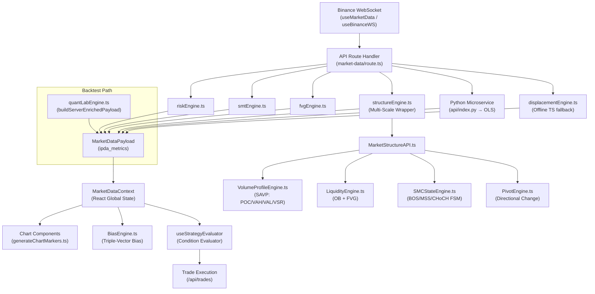
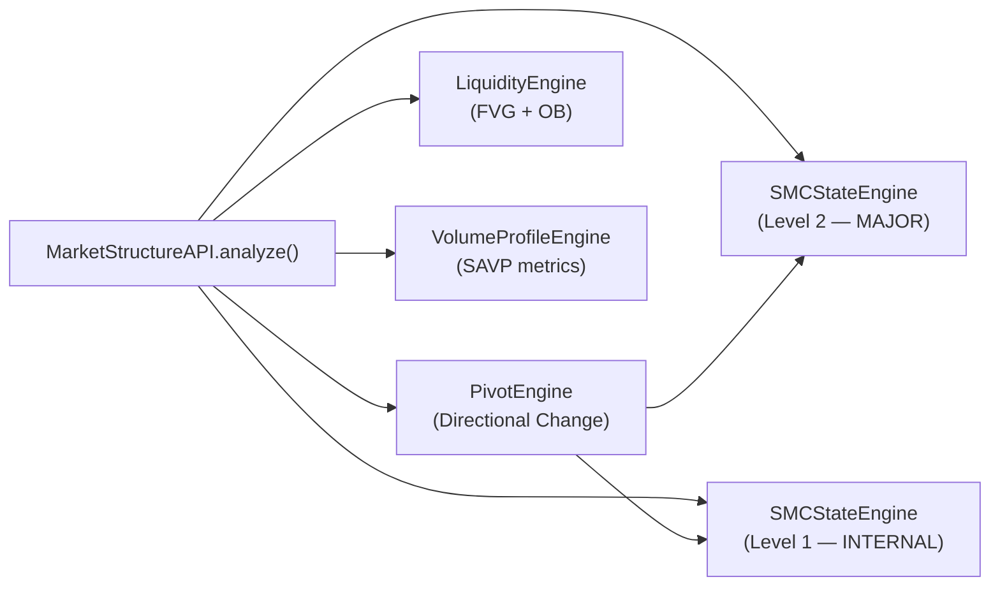

# Quant Engine Data Dictionary & Calculation Map

> **Ground-Truth Technical Reference — Flow-State Quant Engine v10.23**
> Audited from source: `Gem_Charts_Data` workspace. Zero hallucination policy.

---

## Table of Contents

1. [Data Pipeline Architecture](#1-data-pipeline-architecture)
2. [Core Candle Schema](#2-core-candle-schema)
3. [Displacement Engine (Volumetric Sponsorship)](#3-displacement-engine-volumetric-sponsorship)
4. [OLS Statistical Validation Backend (Python)](#4-ols-statistical-validation-backend-python)
5. [Market Structure Engine (Multi-Scale)](#5-market-structure-engine-multi-scale)
6. [FVG Engine (Fair Value Gaps)](#6-fvg-engine-fair-value-gaps)
7. [Risk Engine](#7-risk-engine)
8. [BiasEngine (Triple-Vector Macro Daily Bias)](#8-biasengine-triple-vector-macro-daily-bias)
9. [Volumetric Annotation Engine (Chart Markers)](#9-volumetric-annotation-engine-chart-markers)
10. [Perfect Movement Setup Filter](#10-perfect-movement-setup-filter)
11. [Strategy Evaluator — Metric Resolution Map](#11-strategy-evaluator--metric-resolution-map)
12. [Master Payload Schema (`MarketDataPayload.ipda_metrics`)](#12-master-payload-schema)
13. [Edge Cases & Known Constraints](#13-edge-cases--known-constraints)

---

## 1. Data Pipeline Architecture



### Pipeline Summary

| Stage | File | Role |
|-------|------|------|
| **Ingestion** | [useMarketData.ts](file:///c:/My%20Files/Work/Lab/Gem_Charts_Data/src/hooks/useMarketData.ts) | REST polling from `/api/market-data` |
| **WebSocket** | [useBinanceWS.ts](file:///c:/My%20Files/Work/Lab/Gem_Charts_Data/src/hooks/useBinanceWS.ts) | Live kline stream for sub-candle ticks |
| **Orchestrator** | [route.ts](file:///c:/My%20Files/Work/Lab/Gem_Charts_Data/src/app/api/market-data/route.ts) | Central API handler; calls all engines |
| **Displacement** | [displacementEngine.ts](file:///c:/My%20Files/Work/Lab/Gem_Charts_Data/src/lib/displacementEngine.ts) | Offline TS displacement + Vercel Python call |
| **OLS Backend** | [api/index.py](file:///c:/My%20Files/Work/Lab/Gem_Charts_Data/api/index.py) | Python statsmodels OLS regression |
| **Structure** | [structureEngine.ts](file:///c:/My%20Files/Work/Lab/Gem_Charts_Data/src/lib/structureEngine.ts) → [MarketStructureAPI.ts](file:///c:/My%20Files/Work/Lab/Gem_Charts_Data/src/lib/quantEngine/MarketStructureAPI.ts) | Multi-scale market structure analysis |
| **FVG** | [fvgEngine.ts](file:///c:/My%20Files/Work/Lab/Gem_Charts_Data/src/lib/fvgEngine.ts) | Multi-timeframe FVG detection |
| **Risk** | [riskEngine.ts](file:///c:/My%20Files/Work/Lab/Gem_Charts_Data/src/lib/riskEngine.ts) | Dynamic risk mode + ATR invalidation |
| **Bias** | [BiasEngine.ts](file:///c:/My%20Files/Work/Lab/Gem_Charts_Data/src/lib/quantEngine/BiasEngine.ts) | Triple-vector convergence resolver |
| **SMT** | [smtEngine.ts](file:///c:/My%20Files/Work/Lab/Gem_Charts_Data/src/lib/smtEngine.ts) | BTC/ETH divergence correlation |
| **Backtest** | [quantLabEngine.ts](file:///c:/My%20Files/Work/Lab/Gem_Charts_Data/src/lib/quantLabEngine.ts) | Headless server-side payload builder |
| **Strategy** | [useStrategyEvaluator.ts](file:///c:/My%20Files/Work/Lab/Gem_Charts_Data/src/hooks/useStrategyEvaluator.ts) | Metric resolver + condition evaluator |
| **Markers** | [generateChartMarkers.ts](file:///c:/My%20Files/Work/Lab/Gem_Charts_Data/src/utils/generateChartMarkers.ts) | Volumetric signal annotation + PM filter |

---

## 2. Core Candle Schema

> **Source of Truth:** [fvgEngine.ts → `Candle`](file:///c:/My%20Files/Work/Lab/Gem_Charts_Data/src/lib/fvgEngine.ts#L1-L13)

```typescript
interface Candle {
  t: number;              // Unix timestamp (ms)
  o: number;              // Open price
  h: number;              // High price
  l: number;              // Low price
  c: number;              // Close price
  v: number;              // Total volume
  taker_buy_vol: number;  // Taker buy volume (aggressive buyers)
  taker_sell_vol: number; // Taker sell volume (aggressive sellers)
  isClosed?: boolean;     // true = fully closed candle, false = forming
  volumetric_signal?: 'ARROW_UP' | 'ARROW_DOWN' | 'CIRCLE_UP' | 'CIRCLE_DOWN' | null;
  [key: string]: any;     // Extensible for additional metadata
}
```

> [!IMPORTANT]
> **Dual-Name Convention:** The Binance WebSocket returns short names (`o`, `h`, `l`, `c`, `v`), but `MarketStructureAPI.ts` normalizes to long names (`open`, `high`, `low`, `close`, `volume`) internally. Both accessors are safe within the quant engine pipeline.

---

## 3. Displacement Engine (Volumetric Sponsorship)

> **Source of Truth:** [displacementEngine.ts](file:///c:/My%20Files/Work/Lab/Gem_Charts_Data/src/lib/displacementEngine.ts)
> **Canonical Docs:** [directives/06_volumetric_sponsorship.md](file:///c:/My%20Files/Work/Lab/Gem_Charts_Data/directives/06_volumetric_sponsorship.md)

### 3.1 `InstitutionalSponsorship` Interface

```typescript
interface InstitutionalSponsorship {
  status: 'ACTIVE_BULLISH' | 'ACTIVE_BEARISH' | 'INACTIVE' | 'CONSOLIDATION';
  anomaly_multiplier: number;   // Latest closed candle volume / 14-bar rolling average
  volume_delta: number;         // taker_buy_vol − taker_sell_vol (signed)
  direction: 'BULLISH' | 'BEARISH' | 'NONE';
  statistical_validation: {
    t_statistic: number;        // OLS t-stat for anomaly_multiplier coefficient
    p_value: number;            // OLS p-value for anomaly_multiplier
    confidence_level: 'HIGH' | 'MEDIUM' | 'LOW';
    confidence_interval_95: boolean | 'CONSOLIDATION';
    confidence_interval_95_strict: boolean | 'CONSOLIDATION';
  };
}
```

### 3.2 Offline TypeScript Calculation (`verifyDisplacementOffline`)

**Rolling Window:** 14 candles.  
**Offset Rule:** `length - 2` (excludes the currently forming candle from Binance WS).

#### Mathematical Pipeline

```
Given: candles[0..N], where N = candles.length - 1

Step 1: latest_closed_index = N - 1   (the "minus-2" offset from raw WS data)
Step 2: prior_14_window = candles[N-15 .. N-2]  (14 candles before the closed candle)

Step 3: avg_buy_vol = mean(prior_14.taker_buy_vol)
Step 4: avg_sell_vol = mean(prior_14.taker_sell_vol)

Step 5: latest_buy = candles[N-1].taker_buy_vol
Step 6: latest_sell = candles[N-1].taker_sell_vol

Step 7: is_bullish = candles[N-1].c > candles[N-1].o   (green candle)
Step 8: is_bearish = candles[N-1].c < candles[N-1].o   (red candle)

Step 9: Volatility Filter
  price_range = max(candles.h) - min(candles.l)
  volatility_ratio = price_range / min(candles.l)
  IF volatility_ratio < 0.001 → status = 'CONSOLIDATION', EXIT

Step 10: Dynamic Multiplier Threshold
  IF symbol contains "ETH" → vol_multiplier = 2.0
  ELSE → vol_multiplier = 2.5

Step 11: Classification
  IF is_bullish AND latest_buy > (avg_buy_vol × vol_multiplier):
    status = 'ACTIVE_BULLISH'
    anomaly_multiplier = latest_buy / avg_buy_vol
  ELIF is_bearish AND latest_sell > (avg_sell_vol × vol_multiplier):
    status = 'ACTIVE_BEARISH'
    anomaly_multiplier = latest_sell / avg_sell_vol
  ELSE:
    status = 'INACTIVE'
    anomaly_multiplier = 0.0

Step 12: volume_delta = latest_buy - latest_sell  (signed)
```

### 3.3 Four-Gate Classification Pipeline (Visual Markers)

The displacement engine also feeds the **4-gate volumetric annotation system** documented in Section 9. The gates are:

| Gate | Name | Logic |
|------|------|-------|
| **Gate 1** | Structural Swing | 3-bar pivot: `mid.l < prev.l AND mid.l < curr.l` (or High equivalent) |
| **Gate 2** | Color Lock | Bullish shift: swing low + mid candle green + prev candle red |
| **Gate 3** | Volumetric Math | Directional volume = `V × body_ratio`. Compare `dirVol_mid > dirVol_prev` |
| **Gate 4** | Signal Assignment | `isDirVolIncrease` → ARROW. `isRawVolIncrease` only → CIRCLE |

> [!WARNING]
> **Marker Placement:** Markers are placed on `candles[i-1]` (the swing/middle candle), NOT on the confirming candle `candles[i]`. This is a deliberate anchoring decision.

---

## 4. OLS Statistical Validation Backend (Python)

> **Source of Truth:** [api/index.py](file:///c:/My%20Files/Work/Lab/Gem_Charts_Data/api/index.py)
> **Runtime:** FastAPI on Vercel Serverless / Uvicorn local (port 8000)
> **Timeout:** 1.2s hard timeout from TypeScript caller; failure triggers `verifyDisplacementOffline` fallback.

### 4.1 Endpoint

```
POST /api/py/calculate-displacement
POST /api/index
```

### 4.2 Input Schema (`CandleInput`)

```python
class CandleInput(BaseModel):
    t: int          # Unix timestamp (ms)
    o: float        # Open
    h: float        # High
    l: float        # Low
    c: float        # Close
    v: Optional[float]  # Total volume (defaults to buy + sell if None)
    taker_buy_vol: float
    taker_sell_vol: float
```

> **Minimum Input Requirement:** 16 candles. Below this → HTTP 400.

### 4.3 Full Mathematical Pipeline

```
Step 1: DataFrame Construction
  df['volume_delta'] = taker_buy_vol − taker_sell_vol
  df['rolling_vol_14'] = df['v'].rolling(window=14, min_periods=1).mean()
  df['anomaly_multiplier'] = df['v'] / (rolling_vol_14 + 1e-5)

Step 2: NY Dead Zone Detection
  Convert timestamps → America/New_York timezone
  df['is_dead_zone'] = 1 if (hour == 12) OR (hour == 13 AND minute <= 30), else 0

Step 3: Forward Return Target
  df['future_return'] = df['c'].pct_change().shift(-1)
  NOTE: This is the 1-candle forward close-to-close return.

Step 4: Volatility Consolidation Filter
  price_min = min(df['l'])
  price_max = max(df['h'])
  volatility_range = (price_max − price_min) / (price_min + 1e-9)
  IF volatility_range < 0.001 → is_consolidation = TRUE → all stats zeroed

Step 5: OLS Regression (statsmodels)
  Warmup: drop first 14 rows + last 1 row (incomplete future_return)
  reg_df = df[14:-1].dropna()

  IF len(reg_df) >= 10 AND NOT is_consolidation:
    X = [anomaly_multiplier, volume_delta, is_dead_zone] + constant
    y = future_return
    model = OLS(y, X).fit()
    
    t_statistic = results.tvalues['anomaly_multiplier']
    p_value = results.pvalues['anomaly_multiplier']

Step 6: Confidence Level Classification
  IF p_value < 0.05  →  confidence_level = 'HIGH'
  IF p_value < 0.15  →  confidence_level = 'MEDIUM'
  ELSE               →  confidence_level = 'LOW'

Step 7: Backward-Compatible CI Flags
  confidence_interval_95 = (p_value < 0.15 AND t_statistic > 1.96)
  confidence_interval_95_strict = (p_value < 0.05 AND t_statistic > 1.96)

Step 8: Sponsorship Status (same algorithm as offline TS)
  Dynamic multiplier: 2.0 for ETH, 2.5 otherwise
  Same candle color lock + volume comparison logic as Section 3.2

Step 9: NaN/Inf Safety
  IF isnan(t_statistic) OR isinf(t_statistic) → t_statistic = 0.0
  IF isnan(p_value) OR isinf(p_value) → p_value = 1.0, confidence_level = 'LOW'
```

### 4.4 Output Schema (`DisplacementResponse`)

```python
class DisplacementResponse(BaseModel):
    status: str              # ACTIVE_BULLISH | ACTIVE_BEARISH | INACTIVE | CONSOLIDATION
    anomaly_multiplier: float
    volume_delta: float
    statistical_validation: dict  # { t_statistic, p_value, confidence_level, confidence_interval_95, confidence_interval_95_strict }
```

### 4.5 OLS Veto Gate in Strategy Evaluator

The OLS output flows into the **Strategy Evaluator** as a veto gate:

| Sensitivity | t-stat Threshold | p-value Threshold | Effect |
|---|---|---|---|
| `STRICT` | `\|t\| >= 1.96` | `p < 0.05` | Strategy vetoed if either fails |
| `RELAXED` | `\|t\| >= 1.65` | `p < 0.15` | Strategy vetoed if either fails |
| `OFF` | — | — | OLS validation bypassed entirely |

> **Source:** [useStrategyEvaluator.ts L484-L501](file:///c:/My%20Files/Work/Lab/Gem_Charts_Data/src/hooks/useStrategyEvaluator.ts#L484-L501)

---

## 5. Market Structure Engine (Multi-Scale)

> **Entry Point:** [structureEngine.ts](file:///c:/My%20Files/Work/Lab/Gem_Charts_Data/src/lib/structureEngine.ts) → [MarketStructureAPI.ts](file:///c:/My%20Files/Work/Lab/Gem_Charts_Data/src/lib/quantEngine/MarketStructureAPI.ts)

### 5.1 Sub-Engine Architecture



### 5.2 PivotEngine — Fractal Detection

> **Source:** [PivotEngine.ts](file:///c:/My%20Files/Work/Lab/Gem_Charts_Data/src/lib/quantEngine/PivotEngine.ts)

**Algorithm:** Standard N-bar fractal pivot detection. A pivot requires `lookback` candles on each side where the central candle's high (or low) is strictly greater (or less) than all neighbors.

| Level | Grade | Default Lookback | Structural Role |
|-------|-------|-----------------|-----------------|
| 0 | `INNER` | 3 bars | Micro waves (visual only) |
| 1 | `INTERNAL` | 5 bars | Child waves (internal structure) |
| 2 | `MAJOR` | 15 bars | Parent range (macro dealing range anchors) |

```
Pivot Interface:
{
  type: 'SWING_HIGH' | 'SWING_LOW',
  index: number,         // Candle array index
  price: number,         // High or Low price at the pivot
  confirmed: boolean,    // Always true after processing (requires left+right bars)
  timestamp: number,     // Unix ms
  level: 0 | 1 | 2,
  colorValidated: boolean  // Always true in PivotEngine (strict validation done elsewhere)
}
```

> [!NOTE]
> **Color Validation:** `PivotEngine.ts` sets `colorValidated = true` by default. The external directional color lock (from `06_volumetric_sponsorship.md`) is applied in the visual annotation layer, NOT in the pivot detection layer.

### 5.3 SMCStateEngine — Break of Structure FSM

> **Source:** [SMCStateEngine.ts](file:///c:/My%20Files/Work/Lab/Gem_Charts_Data/src/lib/quantEngine/SMCStateEngine.ts)

**State Machine:** Two states — `BULLISH_SWING` and `BEARISH_SWING`.

#### Structural Event Types

```typescript
interface StructuralEvent {
  type: 'BOS' | 'MSS' | 'CHoCH' | 'SWING_HIGH_CONFIRMED' | 'SWING_LOW_CONFIRMED' | 'SWEEP';
  direction: 'BULLISH' | 'BEARISH';
  level: number;           // Price level that was broken
  index: number;           // Candle index of the break
  timestamp: number;
  sharp_departure_confirmed?: boolean;
  sharp_departure_failed?: boolean;
  invalidated?: boolean;
}
```

#### Classification Logic

**In `BULLISH_SWING` state:**

| Condition | Event | Transition |
|-----------|-------|------------|
| `candle.close > active_swing_high` | **BOS** (Bullish) | Stay `BULLISH_SWING` |
| `candle.high > active_swing_high` (no close above) | **SWEEP** (Bullish) | Stay (wick probe) |
| `candle.close < protected_low` | **MSS** or **CHoCH** (Bearish) | → `BEARISH_SWING` |
| `candle.low < protected_low` (no close below) | **SWEEP** (Bearish) | Stay (wick probe) |

**MSS vs CHoCH Classification:**

```
body_ratio = |close − open| / (high − low)
volume_sma_20 = SMA(volume, 20)
volume_expansion = candle.volume / volume_sma_20

IF body_ratio >= 0.70 AND volume_expansion >= 1.50:
  event = 'MSS'   (Market Structure Shift — displaced)
ELSE:
  event = 'CHoCH'  (Change of Character — undisplaced)
```

| Config Param | Default | Meaning |
|---|---|---|
| `mssBodyRatio` | 0.70 | Minimum body-to-range ratio for MSS |
| `displacementVef` | 1.50 | Minimum volume expansion factor for MSS |
| `sharpDepartureMult` | 1.50 | ATR multiplier for sharp departure confirmation |

#### Sharp Departure Momentum Filter

After a BOS/MSS/CHoCH event is registered, it enters a **pending departure check** for up to 5 candles:

```
FOR each pending break (max 5 candles after event):
  distance = |candle.close − broken_level|
  IF distance >= sharpDepartureMult × ATR:
    event.sharp_departure_confirmed = true  → VALID break
  IF 5 candles pass without confirmation:
    event.sharp_departure_failed = true
    event.invalidated = true
```

### 5.4 ZigZag Construction

> **Source:** [MarketStructureAPI.ts L161-L208](file:///c:/My%20Files/Work/Lab/Gem_Charts_Data/src/lib/quantEngine/MarketStructureAPI.ts#L161-L208)

```typescript
interface ZigZagSegment {
  from: StructuralSwing;        // Start pivot
  to: StructuralSwing;          // End pivot (must alternate HIGH↔LOW)
  label: 'BOS' | 'MSS' | 'INTERNAL';
  trendBefore: 'BULLISH' | 'BEARISH' | 'UNSET';
  trendAfter: 'BULLISH' | 'BEARISH' | 'UNSET';
  displacementConfirmed: boolean; // true only for MSS + NOT sharp_departure_failed
  brokenLevel?: number;
}
```

**Key Rule:** `displacementConfirmed = (label === 'MSS') AND (!sharp_departure_failed)`. This means a CHoCH that later gets invalidated will NOT be marked as displacement-confirmed.

### 5.5 Dealing Range Construction

> **Source:** [MarketStructureAPI.ts L210-L317](file:///c:/My%20Files/Work/Lab/Gem_Charts_Data/src/lib/quantEngine/MarketStructureAPI.ts#L210-L317)

```typescript
interface StructuralDealingRange {
  high: number | string;          // 'AWAITING_IDM_SWEEP' if empty state
  low: number | string;
  equilibrium: number | string;   // (high + low) / 2
  current_status: 'PREMIUM' | 'DISCOUNT' | 'AWAITING_IDM_SWEEP';
  anchor_high_swing: StructuralSwing | null;
  anchor_low_swing: StructuralSwing | null;
  profile_metrics?: VolumeProfileMetrics | null;
}
```

**Anchoring Logic:**
- In `BULLISH_SWING`: High = `active_swing_high` (or highest candle high since protected low), Low = `protected_low`
- In `BEARISH_SWING`: High = `protected_high`, Low = `active_swing_low` (or lowest candle low since protected high)
- `equilibrium = (high + low) / 2`
- `current_status = price > equilibrium ? 'PREMIUM' : 'DISCOUNT'`

### 5.6 Volume Profile Engine (SAVP)

> **Source:** [VolumeProfileEngine.ts](file:///c:/My%20Files/Work/Lab/Gem_Charts_Data/src/lib/quantEngine/VolumeProfileEngine.ts)

**Algorithm:** Swing-Anchored Volume Profile with fractional overlap binning.

```typescript
interface VolumeProfileMetrics {
  poc: number | null;   // Point of Control (highest-volume bin midpoint)
  vah: number | null;   // Value Area High (upper 70% volume boundary)
  val: number | null;   // Value Area Low (lower 70% volume boundary)
  vsr: number | null;   // Volumetric Sponsorship Ratio
}
```

#### POC Calculation

```
numBins = 50
binSize = (high − low) / 50

FOR each candle in rangeCandles:
  FOR each bin i:
    overlap = max(0, min(candleHigh, binHigh) − max(candleLow, binLow))
    fraction = overlap / (candleHigh − candleLow)
    binVolumes[i] += candleVolume × fraction

pocIdx = argmax(binVolumes)
poc = low + pocIdx × binSize + binSize / 2
```

#### Value Area (70% Volume Coverage)

```
Start from POC bin. Alternately expand up/down, adding the higher-volume neighbor:
WHILE currentVol < totalVol × 0.70:
  IF volBelow >= volAbove: expand downward
  ELSE: expand upward

val = low + valIdx × binSize
vah = low + (vahIdx + 1) × binSize
```

#### Volumetric Sponsorship Ratio (VSR)

```
Split dealing range into 4 quadrants (Q1 lowest, Q4 highest).
Distribute volume across quadrants using same fractional overlap method.

IF bullish leg (low swing before high swing):
  VSR = Q1_volume / Q4_volume   (Origin / Termination)
ELIF bearish leg:
  VSR = Q4_volume / Q1_volume   (Origin / Termination)
```

> [!TIP]
> **Interpretation:** VSR > 1.0 means more volume was transacted at the origin of the move (where institutions entered) than at the termination (where retail enters). This signals institutional commitment.

---

## 6. FVG Engine (Fair Value Gaps)

> **Source:** [fvgEngine.ts](file:///c:/My%20Files/Work/Lab/Gem_Charts_Data/src/lib/fvgEngine.ts)

### 6.1 Detection Algorithm

```
FOR i in 0..len(candles)-2:
  c1 = candles[i]      // First candle
  c3 = candles[i + 2]  // Third candle

  Bullish FVG (BISI): c3.low > c1.high  (gap up)
    top = c3.low, bottom = c1.high

  Bearish FVG (SIBI): c1.low > c3.high  (gap down)
    top = c1.low, bottom = c3.high

  CE (Consequent Encroachment) = (top + bottom) / 2
```

### 6.2 Mitigation (Wick-Scanning V8.5)

```
FOR j in (i+3)..end:
  BISI mitigated IF future_candle.low <= top   (wick enters gap)
  SIBI mitigated IF future_candle.high >= bottom
```

> [!WARNING]
> **Wick-Based Mitigation:** V8.5 uses wick-touch mitigation, NOT body-close mitigation. Any candle whose wick enters the FVG zone marks it as consumed. This is stricter than some retail implementations.

### 6.3 Multi-Timeframe Consolidation (`MappedFVG`)

```typescript
interface MappedFVG {
  timeframe: string;     // '5m' | '15m' | '1h'
  type: 'BULLISH' | 'BEARISH';  // Mapped from BISI/SIBI
  top: number;
  bottom: number;
  ce: number;            // (top + bottom) / 2
  status: 'UNMITIGATED' | 'MITIGATED' | 'PENDING';
  origin_time: number;
}
```

**Name Mapping:** `BISI → BULLISH`, `SIBI → BEARISH`

---

## 7. Risk Engine

> **Source:** [riskEngine.ts](file:///c:/My%20Files/Work/Lab/Gem_Charts_Data/src/lib/riskEngine.ts)

### 7.1 ATR Calculation (Wilder's Method)

```
TR[0] = high − low
TR[i] = max(high − low, |high − prev_close|, |low − prev_close|)

IF len(TRs) <= period:
  ATR = mean(TRs)
ELSE:
  ATR_initial = mean(TR[0..period-1])
  ATR[i] = (ATR[i-1] × (period − 1) + TR[i]) / period   (Wilder's smoothing)
```

**Default period:** 14

### 7.2 Dynamic Risk Mode

```typescript
interface TradeExecutionParameters {
  risk_mode: 'HALF_RISK_OR_STAND_DOWN' | 'FULL_MACRO_RISK' | 'STANDARD_RISK';
  closest_active_fvg_ce: number | null;
  hard_invalidation_levels: {
    bearish_invalidation: number | null;  // max(BSL_Magnets) + buffer
    bullish_invalidation: number | null;  // min(SSL_Magnets) − buffer
  };
}
```

| Condition | Risk Mode |
|-----------|-----------|
| `target_status == EXHAUSTED` OR `time_window == DEAD_ZONE` | `HALF_RISK_OR_STAND_DOWN` |
| `target_status contains PENDING` AND sponsorship `ACTIVE` AND `confidence_interval_95 == true` | `FULL_MACRO_RISK` |
| Sponsorship active but OLS fails | `HALF_RISK_OR_STAND_DOWN` |
| Default | `STANDARD_RISK` |

### 7.3 Hard Invalidation Levels

```
buffer = (candles provided AND atr > 0) ? 0.2 × ATR : 0.50
bearish_invalidation = max(BSL_Magnets) + buffer
bullish_invalidation = min(SSL_Magnets) − buffer
```

### 7.4 Simple Risk Calculator (`calculateDynamicRisk`)

```
Rule 1 (Kill Switch): EXHAUSTED or LIQUIDITY_SWEPT → OBSERVATION_ONLY
Rule 2 (Danger Zone): |price − PDH| <= 10 OR |price − PDL| <= 10 → HALF_RISK_CONTINUATION
Rule 3 (Clear): → FULL_RISK_AUTHORIZED
```

---

## 8. BiasEngine (Triple-Vector Macro Daily Bias)

> **Source:** [BiasEngine.ts](file:///c:/My%20Files/Work/Lab/Gem_Charts_Data/src/lib/quantEngine/BiasEngine.ts)

### 8.1 Three Vectors

| Vector | Name | Bullish Condition | Bearish Condition |
|--------|------|-------------------|-------------------|
| **V1** | Time/AMD (Judas Swing) | `livePrice < true_day_open_0700` | `livePrice > true_day_open_0700` |
| **V2** | Structure (HTF Magnet) | Nearest magnet ∈ {`PWH`, `PMH`, `DAILY_SIBI`} | Nearest magnet ∈ {`PWL`, `PML`, `DAILY_BISI`} |
| **V3** | Volume/Liquidity | `livePrice >= activeSwingPOC AND sweepOccurred` | `livePrice <= activeSwingPOC AND sweepOccurred` |

### 8.2 Convergence Rule

```
sweep_occurred = (liquidation_status == 'LIQUIDITY_SWEPT')
                 OR (target_status NOT IN {'PENDING', 'UNKNOWN'} AND target_status != '')

IF all three bullish → 'CONFIRMED_BULLISH'
IF all three bearish → 'CONFIRMED_BEARISH'
ELSE → 'NEUTRAL'
```

> [!NOTE]
> All three vectors must agree for bias confirmation. Any null input (true_day_open, livePrice, nearest_htf_magnet, activeSwingPOC) forces `NEUTRAL`.

---

## 9. Volumetric Annotation Engine (Chart Markers)

> **Source:** [generateChartMarkers.ts → `annotateCandlesWithVolumetricSignals`](file:///c:/My%20Files/Work/Lab/Gem_Charts_Data/src/utils/generateChartMarkers.ts#L48-L103)

### 9.1 Signal Classification Table

| Signal | Marker | Condition |
|--------|--------|-----------|
| `ARROW_UP` | ↑ belowBar | Swing low + bullish color shift + `dirVol_mid > dirVol_prev` |
| `ARROW_DOWN` | ↓ aboveBar | Swing high + bearish color shift + `dirVol_mid > dirVol_prev` |
| `CIRCLE_UP` | ● belowBar | Swing low + bullish color shift + `rawVol increase` only |
| `CIRCLE_DOWN` | ● aboveBar | Swing high + bearish color shift + `rawVol increase` only |

### 9.2 Directional Volume Formula

```
body_ratio = |close − open| / (high − low)
directional_volume = volume × body_ratio
```

**Classification:**
- `isDirVolIncrease` (directional volume up) → **ARROW** (strong institutional signal)
- `isRawVolIncrease` only (total volume up, but dirVol didn't increase) → **CIRCLE** (weaker signal)

---

## 10. Perfect Movement Setup Filter

> **Source:** [generateChartMarkers.ts → `checkPerfectMovementSetup`](file:///c:/My%20Files/Work/Lab/Gem_Charts_Data/src/utils/generateChartMarkers.ts#L105-L254)

### 10.1 Three-Phase Gate

| Phase | Name | Purpose |
|-------|------|---------|
| **Phase 1** | Structural Proximity & Liquidity Sweep | Confirms a sweep of a structural level within `pmSweepLookback` candles |
| **Phase 2** | Volumetric Anatomy (Catalyst) | Validates the signal candle's body ratio, volume, and taker delta |
| **Phase 3** | Delayed Confirmation | Ensures the confirmation candle continues the move without excess retracement |

### 10.2 Phase 1 — Liquidity Sweep Validation

```
Sweep Levels Checked:
  - PDH / PDL (Previous Day High/Low)
  - Asian Session High/Low
  - London Session High/Low
  - Prior swing levels (last 8, all grades)

Tolerance: 0.3 × ATR (proximity sweep allowed)

FOR LONG: wick pierced BELOW level AND closed back ABOVE
FOR SHORT: wick pierced ABOVE level AND closed back BELOW
```

### 10.3 Phase 2 — Volumetric Anatomy

```
Signal Candle (S) at signalIdx:

1. Range Check: S.range >= pmAtrMultiplier × ATR   (default 0.5×)
2. Volume Check: S.volume > SMA(volume, pmVolumeSmaPeriod)  (default 10-bar)
3. Body Ratio: |S.close − S.open| / S.range >= pmMinBodyRatio  (default 0.3)
4. Wick Filter (LONG): upper_wick / range <= pmMaxWickRatio  (default 0.5)
5. Color Lock: LONG requires green candle (S.c > S.o)
6. Taker Delta: LONG requires (taker_buy_vol − taker_sell_vol) > 0
```

### 10.4 Phase 3 — Delayed Confirmation

```
Confirmation Candle (C) at signalIdx + 1:

LONG:
  C.close > S.open   (closes above signal open)
  C.low >= S.close − pmMaxRetracementLimit × S.body  (no excess pullback)
  No opposing volumetric signal on S or C

SHORT:
  C.close < S.open
  C.high <= S.close + pmMaxRetracementLimit × S.body
  No opposing volumetric signal on S or C
```

### 10.5 Default Configuration

| Param | Default | Description |
|-------|---------|-------------|
| `pmAtrMultiplier` | 0.5 | Min signal range as ATR fraction |
| `pmVolumeSmaPeriod` | 10 | Volume SMA lookback |
| `pmMinBodyRatio` | 0.3 | Min body/range ratio |
| `pmMaxWickRatio` | 0.5 | Max wick/range ratio |
| `pmMaxRetracementLimit` | 0.7 | Max confirmation retracement |
| `pmSweepLookback` | 5 | Candles before signal to check for sweep |

---

## 11. Strategy Evaluator — Metric Resolution Map

> **Source:** [useStrategyEvaluator.ts → `resolveMetric`](file:///c:/My%20Files/Work/Lab/Gem_Charts_Data/src/hooks/useStrategyEvaluator.ts#L19-L404)
> **Server Parity:** [quantLabEngine.ts → `resolveServerMetric`](file:///c:/My%20Files/Work/Lab/Gem_Charts_Data/src/lib/quantLabEngine.ts#L311-L589)

### 11.1 Complete Metric Key Map

| MetricKey | Return Type | Data Source | Description |
|-----------|-------------|-------------|-------------|
| `AI_DAILY_BIAS` | enum: `BULLISH\|BEARISH\|NEUTRAL` | `aiBias` (AI model output) | Gemini/AI model directional prediction |
| `MACRO_BIAS` | enum | `ipda.macro_daily_bias` | Triple-vector bias engine result |
| `PRICE_VS_POC` | enum: `ABOVE_POC\|BELOW_POC\|INSIDE_VALUE_AREA` | `dealingRange.profile_metrics` | Price relative to SAVP Point of Control |
| `FVG` | boolean | `ipda.active_fvgs[]` | Any active FVG exists (filterable by TF/direction) |
| `PRICE_IN_FVG` | boolean | `ipda.active_fvgs[]` + `livePrice` | Price is inside an FVG zone |
| `DISPLACEMENT` | enum: `ACTIVE_BULLISH\|ACTIVE_BEARISH\|INACTIVE\|ANY` | `ipda.institutional_sponsorship.status` | Displacement sponsorship state |
| `DISPLACEMENT_VALUE` | number | `ipda.institutional_sponsorship.anomaly_multiplier` | Raw anomaly multiplier value |
| `OI_TREND` | enum: `RISING\|FALLING\|FLAT` | `order_flow_engine.open_interest_trend` | Open interest direction |
| `MSS` | boolean | `structural_events[]` filtered by `MSS\|CHoCH` | Latest MSS/CHoCH event (direction + confirmation filters) |
| `SMT` | boolean | `order_flow_engine.smart_money_sentiment` | Smart money divergence detected |
| `SMT_DIVERGENCE` | boolean | `ipda.smt_context` | BTC/ETH divergence (m5 or m15 timeframe) |
| `PRICE_VS_OPEN` | enum: `ABOVE\|BELOW` | `ipda.true_day_open_0700` | Price vs True Day Open |
| `EQUILIBRIUM_STATUS` | enum: `PREMIUM\|DISCOUNT\|UNKNOWN` | `ipda.global_anchors.current_status` | Macro dealing range zone |
| `TARGET_EXHAUSTION` | string | `ipda.target_status` | DOL sweep status |
| `NEARBY_MAGNET` | boolean | `resting_liquidity_pools` | Any BSL/SSL within $2.00 of price |
| `MARKET_TREND` | enum: `BULLISH\|BEARISH\|UNSET` | `ipda.global_anchors.current_trend` | Major trend (Level 2) |
| `SUB_TREND` | enum | `ipda.global_anchors.sub_trend` | Sub-trend classification |
| `INTERNAL_TREND` | enum | `ipda.internal_context.trend` | Internal wave trend (Level 1) |
| `INTERNAL_MSS` | boolean | `ipda.internal_context.market_structure_shift` | Internal MSS detected |
| `INTERNAL_PRICING` | enum | `ipda.internal_context.pricing_status` | Internal dealing range zone |
| `LOCAL_PRICING` | enum | `internal_context\|internalDealingRange` | Local pricing (with momentum override) |
| `MSS_CONFIRMED` | boolean | `ipda.market_structure_shift` | Legacy: top-level MSS flag |
| `BOS` | boolean | `full_structure_map.zigzag` | Latest zigzag segment is BOS |
| `PRICE_IN_OTE` | boolean | `dealingRange` + Fibonacci | Price inside Optimal Trade Entry zone |
| `MARKET_VELOCITY` | number | `ipda.market_velocity` | Market velocity metric |
| `STRUCTURE_TYPE` | enum: `MAJOR\|INTERNAL\|INNER` | `full_structure_map.swings` | Latest swing's hierarchy |
| `LIQUIDATION_STATUS` | string | `order_flow_engine.liquidation_events.status` | Liquidation event state |
| `SMART_MONEY_SYNC` | boolean | NOT `smart_money_divergence` | Inverse of SMT divergence |
| `BTC_RELATIVE_STRENGTH` | string | `ipda.smt_context.btc_relative_strength` | BTC correlation strength |
| `HTF_MAGNET_DIST` | number | `pricing_context.nearest_htf_magnet.distance` | Distance to nearest HTF magnet |
| `HIGH_VOLUME_SESSION` | boolean | `current_time_window != DEAD_ZONE` | Currently in a killzone |
| `CURRENT_SESSION` | string | `ipda.current_time_window` | Active session window name |

### 11.2 Fibonacci Retracement Zones (`PRICE_IN_OTE`)

```
BULLISH OTE Zone:
  min = high − 0.79 × (high − low)   [79% retracement]
  max = high − 0.62 × (high − low)   [62% retracement]
  MATCH: price >= min AND price <= max

Supported Zones: OTE, FIB_50, FIB_60, FIB_705, FIB_79
```

### 11.3 Condition Operators

| Operator | Applies To | Logic |
|----------|-----------|-------|
| `IS_TRUE` | boolean metrics | `resolved === true` |
| `IS_FALSE` | boolean metrics | `resolved === false` |
| `EQUALS` | enum/string/number | `resolved === value` |
| `NOT_EQUALS` | enum/string/number | `resolved !== value` |
| `GREATER_THAN` | number metrics | `resolved > value` |
| `LESS_THAN` | number metrics | `resolved < value` |

### 11.4 Temporal Gating

| Mode | Behavior |
|------|----------|
| `INSTANT` | Fires mid-candle on every tick |
| `ON_CLOSE` | Fires only when `liveCandle.isClosed === true` |
| Mixed | If strategy has both INSTANT and ON_CLOSE conditions, NOT gated (INSTANT fires mid-candle) |

### 11.5 Strategy-Level Safety Gates

| Gate | Logic | Source |
|------|-------|--------|
| **OLS Veto** | Vetoes if t-stat/p-value fail thresholds | L484-L501 |
| **Perfect Movement Filter** | Phase 1+2+3 must pass if enabled | L503-L542 |
| **Timeframe Lock** | Strategy only fires on matching interval | L706-L709 |
| **Directional Lock** | Blocks LONG if SHORT is open (and vice versa) | L713-L728 |
| **One-Trade Rule** | Blocks if this strategy already has OPEN/PAUSED position | L777-L787 |
| **Debounce Lock** | Per-strategy per-candle (ON_CLOSE) or per-second (INSTANT) | L744-L751 |

---

## 12. Master Payload Schema

> **Source:** [quantLabEngine.ts → `buildServerEnrichedPayload`](file:///c:/My%20Files/Work/Lab/Gem_Charts_Data/src/lib/quantLabEngine.ts#L24-L307)

```typescript
{
  ticker: string,
  timezone: 'UTC',
  ipda_metrics: {
    true_day_open: number | null,
    true_day_open_0700: number | null,
    current_time_window: 'ASIAN_RANGE' | 'LONDON_AM_KILLZONE' | 'NY_AM_KILLZONE' | 'NY_PM_KILLZONE' | 'DEAD_ZONE',
    current_pricing: 'PREMIUM' | 'DISCOUNT' | 'FAIR_VALUE' | 'UNKNOWN',
    target_status: string,
    market_structure_shift: boolean,
    market_structure_shift_direction: 'BULLISH' | 'BEARISH' | 'UNSET' | null,
    current_trend: 'BULLISH' | 'BEARISH' | 'UNSET',
    internal_market_trend: 'BULLISH' | 'BEARISH' | 'UNSET',
    internal_structure_shift: boolean,
    internal_context: {
      trend: string,
      high: number, low: number, equilibrium: number,
      pricing_status: string,
      anchor_high_swing: StructuralSwing | null,
      anchor_low_swing: StructuralSwing | null
    },
    expansion_mode: 'NORMAL' | 'RUNAWAY',
    market_velocity: number,
    runaway_origin_price: number | null,
    full_structure_map: MarketStructureAnalysis | null,
    active_fvgs: MappedFVG[],
    macro_levels: {
      pdh: number, pdl: number,
      asian_high: number | null, asian_low: number | null,
      true_day_open: number | null
    },
    session_ranges: {
      asian_range: { high: number | null, low: number | null },
      london_range: { high: number | null, low: number | null }
    },
    pricing_context: {
      vs_daily_open: 'ABOVE_OPEN' | 'BELOW_OPEN' | 'UNKNOWN',
      local_dealing_range: StructuralDealingRange,
      nearest_htf_magnet?: { label: string, distance: number }
    },
    order_flow_engine: {
      open_interest_trend: 'RISING' | 'FALLING' | 'FLAT',
      displacement_sponsorship: 'ACTIVE' | 'INACTIVE',
      smart_money_sentiment: { smart_money_divergence: boolean },
      resting_liquidity_pools: {
        BSL_Magnets: number[],
        SSL_Magnets: number[]
      },
      liquidation_events?: { status: string }
    },
    institutional_sponsorship: InstitutionalSponsorship,
    trade_execution_parameters: TradeExecutionParameters,
    macro_daily_bias?: string,
    global_anchors?: {
      current_trend: string,
      sub_trend: string,
      current_status: string,
      high: number, low: number
    },
    smt_context?: {
      m5_divergence: string,
      m15_divergence: string,
      btc_relative_strength: string
    }
  },
  data_payload: {
    candles_1h: ServerBtCandle[],
    candles_15m: ServerBtCandle[],
    candles_5m: ServerBtCandle[]
  }
}
```

---

## 13. Edge Cases & Known Constraints

### 13.1 Critical Edge Cases

| # | Area | Edge Case | Impact | Mitigation |
|---|------|-----------|--------|------------|
| **EC-1** | OLS Backend | Python microservice timeout (>1.2s) | Falls back to `verifyDisplacementOffline` (TS) which produces NO OLS stats | `statistical_validation` returns default `{t: 0, p: 1.0, level: LOW}`. Strategies with `STRICT` sensitivity will be vetoed. |
| **EC-2** | OLS Backend | `NaN`/`Inf` from singular matrix (collinear predictors) | t-stat and p-value become unreliable | Explicit `isnan`/`isinf` guards zero them out → `confidence_level = LOW` |
| **EC-3** | Displacement | Consolidation regime (`volatility < 0.001`) | All sponsorship detection is bypassed | Status forced to `CONSOLIDATION`. CI flags set to string `'CONSOLIDATION'` instead of boolean. |
| **EC-4** | PivotEngine | Insufficient history | Level-2 pivots need 15+15=30 candles minimum | Fewer than 30 candles → no MAJOR pivots → empty dealing range → `AWAITING_IDM_SWEEP` |
| **EC-5** | Volume Profile | Zero-range candle (`high == low`) | Division by zero in fractional overlap | Handled: single-price candles assigned to one bin directly |
| **EC-6** | FVG Mitigation | Wick-touch mitigation (V8.5) is strict | FVGs consumed faster than body-close methods | Intentional design: reduces false active FVG count |
| **EC-7** | MarketStructureAPI | Empty candle array | All engines return empty/default state | `createEmptyState()` returns safe defaults with `AWAITING_IDM_SWEEP` |
| **EC-8** | Sharp Departure | 5-candle window expiry | Break events that don't depart within 5 candles are invalidated | `sharp_departure_failed = true`, `invalidated = true` |
| **EC-9** | BiasEngine | Any null input parameter | Forces NEUTRAL regardless of other vectors | Early return guard at [BiasEngine.ts L34-L42](file:///c:/My%20Files/Work/Lab/Gem_Charts_Data/src/lib/quantEngine/BiasEngine.ts#L34-L42) |
| **EC-10** | Strategy Evaluator | MSS lookup dual-path | Client uses `structural_events[]`, server uses `zigzag[]` for MSS | Different confirmation semantics: client checks `sharp_departure_confirmed`, server checks `displacementConfirmed` |

### 13.2 Live vs Backtest Asymmetries

| Feature | Live (Client) | Backtest (Server) |
|---------|--------------|-------------------|
| **AI_DAILY_BIAS** | Real Gemini model output | Always `NEUTRAL` (hardcoded) |
| **Temporal Mode** | `ON_CLOSE` requires `isClosed` tick event | All candles treated as closed in sequential loop |
| **Price for evaluation** | `livePrice` (mid-candle tick) | LONG: `liveCandle.low`, SHORT: `liveCandle.high` (worst-case fill simulation) |
| **Perfect Movement filter** | ✅ Enabled | ❌ Not implemented in `evaluateServerStrategy` |
| **Structure state source** | `context.structureState` (React context) | `data.ipda_metrics.full_structure_map` |
| **OLS source** | Python API (live) or TS fallback | TS offline only (no Python call in backtest) |

### 13.3 Type Safety Observations

| Field | Declared Type | Actual Runtime Type | Note |
|-------|--------------|---------------------|------|
| `dealingRange.high` | `number \| string` | `number` (normal) or `"AWAITING_IDM_SWEEP"` (empty) | String check required before arithmetic |
| `StructuralSwing.price` | `number \| string` | Usually `number` but cast needed | `Number(s.price)` used in comparisons |
| `confidence_interval_95` | `boolean \| string` | `boolean` (normal) or `"CONSOLIDATION"` (string) | Cannot be used as direct boolean in consolidation regime |

### 13.4 Session Time Windows

| Window | UTC Hours | NY Equivalent |
|--------|-----------|---------------|
| `ASIAN_RANGE` | 00:00 – 03:00 | — |
| `LONDON_AM_KILLZONE` | 06:00 – 08:00 | ~01:00 – 03:00 |
| `NY_AM_KILLZONE` | 12:00 – 14:00 | ~07:00 – 09:00 |
| `NY_PM_KILLZONE` | 17:00 – 18:00 | ~12:00 – 13:00 |
| `DEAD_ZONE` | Everything else + NY 12:00–13:30 | NY Lunch |

> [!CAUTION]
> **Dead Zone Override:** Even if the UTC hour falls within a killzone, the NY-local lunch check (12:00 PM – 1:30 PM ET) will force `DEAD_ZONE`. This is evaluated FIRST in `quantLabEngine.ts`.

---

> **Document generated by Quant Engine Audit — v10.23**
> No code was modified during this audit. All formulas extracted directly from source.
