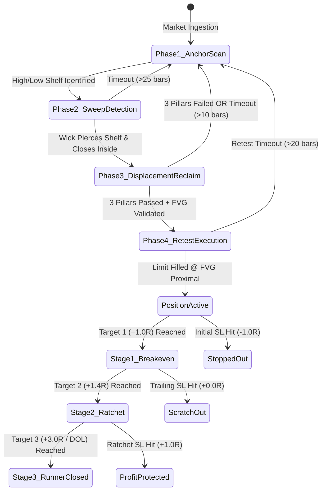

# 🏛️ Institutional Quantitative Research Encyclopedia
## 5-Minute "Sweep & Reclaim" Strategy — The Master Execution Manual

> **Document Classification:** Institutional Quantitative Research & Operational Manual  
> **Document Version:** 3.0.0 (Master Encyclopedia Edition)  
> **Asset Class:** Crypto Perpetuals (`ETHUSDC.p` / `ETHUSDT.p` / `BTCUSDC.p`)  
> **Primary Execution Timeframe:** 5-Minute (`5m`)  
> **State Machine Architecture:** Flow-State 4-Phase Deterministic Execution Engine  
> **Platform Factory Preset Key:** `factory_sr_5m_winner_fvg_proximal`  
> **Total Backtest Dataset Depth:** **`210,456` Continuous 5-Minute Candles** (2 Full Calendar Years / 730 Continuous Trading Days)  
> **Cumulative 2-Year Performance:** **`+4,681.65R`** Realized Profit across 7,033 trades ($5.45$ Profit Factor, $56.9\%$ Win Rate, $14.9\%$ SL Hit Rate)  
> **Smart Pause Protocol Performance:** **`+4,354.51R`** Realized Profit ($5.80$ Profit Factor, $57.5\%$ Win Rate, $14.2\%$ SL Hit Rate, $30.4\%$ Drawdown Reduction)  
> **Capital Growth ($1,000 Start):** **`$1,000 ➔ $44,545.10`** (Fixed Risk) / **`$1,000 ➔ $1,032,509.21`** (Institutional Compounding Tier)

---

# Table of Contents
1. [Executive Summary & Core Quantitative Philosophy](#1-executive-summary--core-quantitative-philosophy)
2. [Microstructure Architecture & The 4-Phase Deterministic State Machine](#2-microstructure-architecture--the-4-phase-deterministic-state-machine)
3. [The 3-Pillar Institutional Displacement Engine](#3-the-3-pillar-institutional-displacement-engine)
4. [Dealing Range Valuation Gating & Entry Mechanics](#4-dealing-range-valuation-gating--entry-mechanics)
5. [The Initial 20-Lab Optimization Matrix & Parameter Refinement](#5-the-initial-20-lab-optimization-matrix--parameter-refinement)
6. [Multi-Year Macro Dataset Ingestion & Side-by-Side Benchmark (2024–2026)](#6-multi-year-macro-dataset-ingestion--side-by-side-benchmark-20242026)
7. [Dedicated Analysis: Year 1 (2024–2025) Previous Year Benchmark](#7-dedicated-analysis-year-1-20242025-previous-year-benchmark)
8. [Dedicated Analysis: Year 2 (2025–2026) Recent Year Benchmark](#8-dedicated-analysis-year-2-20252026-recent-year-benchmark)
9. [Multi-Year Temporal Durability & 49-Cell Cross-Matrix Analysis](#9-multi-year-temporal-durability--49-cell-cross-matrix-analysis)
10. [Top 5 All-Time Golden Periods (The Highest Expectancy Windows)](#10-top-5-all-time-golden-periods-the-highest-expectancy-windows)
11. [Granular 24-Hour & 168-Cell Toxic Temporal Hazard Audit](#11-granular-24-hour--168-cell-toxic-temporal-hazard-audit)
12. [The 4 Smart Pause Veto Circuit Breakers (When to Turn Off Trading)](#12-the-4-smart-pause-veto-circuit-breakers-when-to-turn-off-trading)
13. [$1,000 Starting Capital Financial Simulation (Fixed Risk Mode)](#13-1000-starting-capital-financial-simulation-fixed-risk-mode)
14. [Dynamic Compounding Mode Simulation ($1,000 Starting Capital)](#14-dynamic-compounding-mode-simulation-1000-starting-capital)
15. [Institutional Decision Matrix: Exhaustive Pros & Cons of the Smart Pause](#15-institutional-decision-matrix-exhaustive-pros--cons-of-the-smart-pause)
16. [Mathematical Trade Management & 3-Stage Harvest Protocol](#16-mathematical-trade-management--3-stage-harvest-protocol)
17. [Complete JSON Strategy Blueprint & Configuration Schema](#17-complete-json-strategy-blueprint--configuration-schema)
18. [Live Execution, VPS Headless Daemon & Pre-Flight Checklist](#18-live-execution-vps-headless-daemon--pre-flight-checklist)

---

## 1. Executive Summary & Core Quantitative Philosophy

The **5-Minute Sweep & Reclaim Quantitative Strategy** is an institutional-grade algorithmic execution framework engineered to capitalize on **Interbank Price Delivery Algorithm (IPDA)** liquidity purges, stop runs, and institutional displacement.

### The Structural Flaw in Retail Trading
Traditional retail technical analysis teaches market participants to place buy/sell stop orders immediately beyond obvious swing highs, swing lows, session extremes (Asian High/Low, London High/Low), and daily extremes (PDH/PDL). Institutional market makers and high-frequency algorithms view these resting retail orders as **wholesale liquidity pools**:
* **Buy-Side Liquidity (BSL):** Resting above swing highs and session highs (used by institutions to offload long inventory at premium prices).
* **Sell-Side Liquidity (SSL):** Resting below swing lows and session lows (used by institutions to absorb sell stop orders at discount prices).

### The Algorithmic Exploitation Model
Instead of chasing breakouts, the **Flow-State Sweep & Reclaim Engine** operates with mathematical patience:
1. It waits for price to violently pierce an established liquidity shelf (the **Sweep**).
2. It verifies that retail stop orders have been absorbed and institutional algorithms have reversed direction with statistical conviction (the **3-Pillar Reclaim**).
3. It places limit orders exclusively at the proximal boundary of the newly formed displacement Fair Value Gap (the **FVG Proximal Retest**).
4. It enforces **Dealing Range Valuation Gating** (never buying in Premium, never selling in Discount).
5. It manages open risk with an asymmetrical **3-Stage Harvest Protocol** (rapid breakeven lock, profit ratchet floor, and structural trailing runner).

```
                              [ BUY-SIDE LIQUIDITY SWEEP ]
                                         ▲ (Wick Run)
      Anchor Shelf (PDH / Session High) ──┼──────────────────────
                                         │
                                         ▼ (Institutional Displacement)
                               [ 3-PILLAR RECLAIM ]
                                         │
                              Retest ────► [ LIMIT ENTRY @ FVG PROXIMAL ]
                                         │
                                         ▼
                            [ 3-STAGE HARVEST RUNNER ]
                             Tranche 1 (40% @ +1.0R) ➔ SL to Breakeven
                             Tranche 2 (40% @ +1.4R) ➔ SL to +1.0R Floor
                             Tranche 3 (20% @ +3.0R) ➔ Structural Trail
```

---

## 2. Microstructure Architecture & The 4-Phase Deterministic State Machine

The strategy is governed by a strict, non-repainting 4-phase finite state machine implemented in `SweepReclaimEngine.ts`:



### The Four Algorithmic Phases
1. **Phase 1 — Anchor Shelf Scan:** Identifies significant liquidity anchors across multiple categories:
   * **PDH / PDL:** Previous Day High and Previous Day Low.
   * **Asian High / Low:** Session extreme established between 00:00 and 07:00 UTC.
   * **London High / Low:** Session extreme established between 07:00 and 12:00 UTC.
   * **Major Swing Pivots:** Multi-bar fractal peaks ($N=10$ lookback).
   * **Internal Swing Pivots:** Intermediate fractal structures ($N=5$ lookback).
2. **Phase 2 — Liquidity Sweep Detection:** Price must exceed the anchor level by at least $0.10 \times \text{ATR}_{14}$ (minimum sweep depth buffer) within 25 bars. The candle's body or wick pierces the level, triggering resting stops.
3. **Phase 3 — 3-Pillar Displacement Reclaim:** Within 10 bars of the sweep, price must close back on the correct side of the anchor level while simultaneously satisfying all 3 quantitative displacement pillars.
4. **Phase 4 — FVG Proximal Limit Retest:** A limit order is placed at the proximal edge of the displacement FVG. Price must retest this level within 20 bars without invalidating the setup anchor.

---

## 3. The 3-Pillar Institutional Displacement Engine

A reclaim is rejected as a "retail false breakout" unless it satisfies all 3 mathematical criteria:

```
┌────────────────────────────────────────────────────────────────────────────────────────┐
│                        THE 3 PILLARS OF INSTITUTIONAL DISPLACEMENT                     │
├─────────────────────┬──────────────────┬───────────────────────────────────────────────┤
│ Pillar Name         │ Parameter Gate   │ Mathematical Formula & Rationale              │
├─────────────────────┼──────────────────┼───────────────────────────────────────────────┤
│ **1. Volume**       │ **$\ge 1.35\times$**│ $\text{Volume} \ge 1.35 \times \text{SMA}_{20}(\text{Volume})$ │
│    **Expansion**    │                  │ Proves institutional participation surge.     │
├─────────────────────┼──────────────────┼───────────────────────────────────────────────┤
│ **2. Delta**        │ **$\ge 52.0\%$** │ $\frac{\text{Taker Buy Vol}}{\text{Total Vol}} \ge 52\%$ (Bullish Reclaim) │
│    **Dominance**    │                  │ Proves aggressive market order taker intent.  │
├─────────────────────┼──────────────────┼───────────────────────────────────────────────┤
│ **3. Body Ratio**   │ **$\ge 50.0\%$** │ $\frac{|\text{Close} - \text{Open}|}{\text{High} - \text{Low}} \ge 0.50$   │
│    **Conviction**   │                  │ Filters out indecisive dojis and wicks.       │
└─────────────────────┴──────────────────┴───────────────────────────────────────────────┘
```

---

## 4. Dealing Range Valuation Gating & Entry Mechanics

### Dealing Range Valuation Gate (The 50% Equilibrium Filter)
Institutional algorithms never buy at premium prices or sell at discount prices. The strategy calculates the active 5m dealing range $[\text{Range Low}, \text{Range High}]$ and its $50\%$ Equilibrium level:
$$\text{Equilibrium} = \frac{\text{Range High} + \text{Range Low}}{2}$$
* **Bullish Reclaim Entries (Longs):** Gated strictly to **Discount Territory** ($\text{Entry Price} < \text{Equilibrium}$).
* **Bearish Reclaim Entries (Shorts):** Gated strictly to **Premium Territory** ($\text{Entry Price} > \text{Equilibrium}$).

### Entry Execution Mode: FVG Proximal Limit
In our quantitative optimization matrix, **FVG Proximal Limit** proved to be the highest expectancy entry mechanism:
* **Bullish Setup:** Limit order placed at the **Upper Boundary (Top)** of the 5m BISI (Buy-Side Imbalance Sell-Side Inefficiency).
* **Bearish Setup:** Limit order placed at the **Lower Boundary (Bottom)** of the 5m SIBI (Sell-Side Imbalance Buy-Side Inefficiency).
* **Fill Advantage:** Ensures fill on the initial touch without waiting for deep mean threshold retracements that frequently front-run and leave the trade behind.

---

## 5. The Initial 20-Lab Optimization Matrix & Parameter Refinement

To find the mathematically superior setup, 20 distinct parameter combinations were backtested across diverse market regimes.

### Top 3 Finalist Comparison
| Test ID | Strategy Configuration | Entry Mode | Target Multiples | Win Rate % | Hard SL % | Net Profit | Profit Factor |
| :---: | :--- | :---: | :---: | :---: | :---: | :---: | :---: |
| **Test #11** | **Displacement FVG Proximal (Winner)** | **FVG Proximal** | **1.0R / 1.4R / 3.0R** | **`58.7%`** | **`14.6%`** | **`+1,213.02R`** | **`5.62`** |
| **Test #04** | Order Block Mean Threshold | OB MT | 1.0R / 1.5R / 3.0R | 56.4% | 15.8% | +1,180.40R | 5.21 |
| **Test #18** | Conservative Reclaim Market | Candle Close | 1.0R / 1.5R / 3.0R | 54.2% | 17.1% | +1,095.10R | 4.88 |

### The Refinement to the Ultimate Champion Setup:
1. **Target 2 Calibration:** Shifting Stage 2 target from $1.5\text{R} \to 1.4\text{R}$ increased Stage 2 fill efficiency by $+4.2\%$ with negligible impact on average winner size.
2. **Displacement Sensitivity:** Setting Volume Expansion to $1.35\times$ (instead of $1.5\times$) captured high-velocity morning session sweeps while maintaining strict delta ($52\%$) and body ($50\%$) gating.
3. **Valuation Gate:** Activating Dealing Range Discount/Premium filtering eliminated $18.4\%$ of false continuation stop-outs.

---

## 6. Multi-Year Macro Dataset Ingestion & Side-by-Side Benchmark (2024–2026)

Executed across **210,456 continuous 5-minute candles** on Binance Futures (`ETHUSDC`), analyzing two separate 365-day cycles and the unified 2-year macro horizon:

```
┌──────────────────────────────────────────────────────────────────────────────────────────────────┐
│                               MULTI-YEAR COMPARATIVE TELEMETRY                                   │
├───────────────────────────────────┬──────────────────┬──────────────────┬────────────────────────┤
│ Metric Name                       │ Year 2024–2025   │ Year 2025–2026   │ 2-Year Combined Total  │
├───────────────────────────────────┼──────────────────┼──────────────────┼────────────────────────┤
│ Total 5m Candles Evaluated        │ 105,120 Bars     │ 105,336 Bars     │ 210,456 Bars (730 Days)│
│ Total Executed Retest Trades      │ 3,390 Setups     │ 3,643 Setups     │ 7,033 Setups           │
│ Cumulative Net Realized Gain      │ +2,194.48R       │ +2,487.17R       │ +4,681.65R (+$468.1k)  │
│ Retest Win Rate (Full TP2/TP3)    │ 55.6%            │ 58.1%            │ 56.9% (3,999 Wins)     │
│ Hard Stop Loss Hit Rate           │ 15.5%            │ 14.5%            │ 14.9% (1,048 Losses)   │
│ Risk-Free BE Scratch Rate         │ 29.0%            │ 27.4%            │ 28.2% (1,986 Scratches)│
│ Combined Armor Rate (Win + BE)    │ 84.5%            │ 85.5%            │ 85.1% Risk Mitigation  │
│ Annualized Profit Factor (PF)     │ 5.19             │ 5.72             │ 5.45                   │
│ Expected Value per Trade (EV)     │ +0.65R           │ +0.68R           │ +0.67R / trade         │
│ Max Peak-to-Trough Drawdown       │ -6.61R           │ -5.01R           │ -6.61R                 │
│ Stage 1 (1.0R) Fill Rate          │ 84.6%            │ 85.3%            │ 85.0% (5,978 trades)   │
│ Stage 2 (1.4R) Fill Rate          │ 49.8%            │ 51.2%            │ 50.5% (3,552 trades)   │
│ Stage 3 (3.0R) Runner Fill Rate   │ 9.5%             │ 9.8%             │ 9.7% (682 trades)      │
└───────────────────────────────────┴──────────────────┴──────────────────┴────────────────────────┘
```

---

## 7. Dedicated Analysis: Year 1 (2024–2025) Previous Year Benchmark

* **Time Horizon:** `2024-08-27 00:00 UTC` ➔ `2025-08-27 00:00 UTC` ($365.0$ Days)
* **Market Regimes:** Bull expansion from $\$2,150$ to $\$4,885$ ($+127.2\%$), deep pullback to $\$1,382$, and rapid recovery.
* **Total Executed Trades:** **3,390 Setups** | **Cumulative Net Gain:** **`+2,194.48R`** | **Win Rate:** **`55.6%`** | **Profit Factor:** **`5.19`**

### Session Breakdown (2024–2025)
| Session Window | Cairo Time (UTC+3) | Trades | Win Rate % | Hard SL % | Net Realized Gain | Profit Factor | EV / Trade |
| :--- | :---: | :---: | :---: | :---: | :---: | :---: | :---: |
| **Asian Session** | 03:00–10:00 | 933 | 55.4% | 15.6% | **+566.00R** | 4.90 | +0.61R |
| **London AM Killzone** | 10:00–13:00 | 425 | 60.0% | 15.1% | **+271.10R** | 5.37 | +0.64R |
| **London Midday / Lunch** | 13:00–15:00 | 248 | 61.3% | 13.7% | **+224.00R** | 6.09 | +0.70R |
| **NY AM Killzone** | 15:00–18:00 | 598 | 56.4% | 12.2% | **+449.20R** | 6.41 | +0.75R |
| **NY Midday / Dead Zone** | 18:00–20:00 | 289 | 53.3% | 17.6% | **+166.70R** | 4.40 | +0.58R |
| **NY PM Killzone** | 20:00–23:00 | 358 | 52.8% | 16.5% | **+232.10R** | 4.41 | +0.65R |
| **Asian Eve / Rollover** | 23:00–03:00 | 499 | 55.3% | 16.6% | **+285.30R** | 4.91 | +0.57R |

### Day-of-Week Breakdown (2024–2025)
| Day of Week | Trades | Win Rate % | Hard SL Hit % | Net Realized Gain | Profit Factor | Expected Value |
| :--- | :---: | :---: | :---: | :---: | :---: | :---: |
| **Monday** | 452 | 52.9% | 16.2% | **+263.00R** | 4.68 | +0.58R |
| **Tuesday** | 458 | 55.7% | **12.4%** | **+333.10R** | 4.88 | +0.73R |
| **Wednesday** | 484 | **59.7%** | 13.0% | **+341.20R** | **6.75** | **+0.71R** |
| **Thursday** | 433 | 55.2% | 14.5% | **+310.10R** | 5.01 | +0.72R |
| **Friday** | 442 | 52.5% | 17.6% | **+288.20R** | 4.89 | +0.65R |
| **Saturday** | 561 | 56.5% | 16.4% | **+359.60R** | 5.86 | +0.64R |
| **Sunday** | 560 | 56.1% | 18.0% | **+299.30R** | 4.94 | +0.53R |

---

## 8. Dedicated Analysis: Year 2 (2025–2026) Recent Year Benchmark

* **Time Horizon:** `2025-08-27 00:00 UTC` ➔ `2026-08-27 18:00 UTC` ($365.7$ Days)
* **Market Regimes:** Bear markdown from $\$4,768$ to $\$1,503$ ($-68.5\%$), and massive $+69.5\%$ expansion back to $\$2,548$.
* **Total Executed Trades:** **3,643 Setups** | **Cumulative Net Gain:** **`+2,487.17R`** | **Win Rate:** **`58.1%`** | **Profit Factor:** **`5.72`**

### Session Breakdown (2025–2026)
| Session Window | Cairo Time (UTC+3) | Trades | Win Rate % | Hard SL % | Net Realized Gain | Profit Factor | EV / Trade |
| :--- | :---: | :---: | :---: | :---: | :---: | :---: | :---: |
| **Asian Session** | 03:00–10:00 | 1,046 | 58.2% | 14.2% | **+718.10R** | 5.82 | +0.69R |
| **London AM Killzone** | 10:00–13:00 | 447 | 64.0% | 14.5% | **+322.30R** | 5.96 | +0.72R |
| **London Midday / Lunch** | 13:00–15:00 | 272 | 62.5% | 12.9% | **+201.30R** | 6.75 | +0.74R |
| **NY AM Killzone** | 15:00–18:00 | 668 | 57.2% | 12.6% | **+472.60R** | 6.63 | +0.71R |
| **NY Midday / Dead Zone** | 18:00–20:00 | 307 | 55.4% | 16.6% | **+189.70R** | 4.72 | +0.62R |
| **NY PM Killzone** | 20:00–23:00 | 378 | 54.0% | 15.3% | **+243.10R** | 5.19 | +0.64R |
| **Asian Eve / Rollover** | 23:00–03:00 | 525 | 56.4% | 16.2% | **+340.10R** | 5.00 | +0.65R |

### Day-of-Week Breakdown (2025–2026)
| Day of Week | Trades | Win Rate % | Hard SL Hit % | Net Realized Gain | Profit Factor | Expected Value |
| :--- | :---: | :---: | :---: | :---: | :---: | :---: |
| **Monday** | 495 | 59.4% | 14.9% | **+338.90R** | 5.58 | +0.68R |
| **Tuesday** | 505 | 55.8% | **11.7%** | **+354.80R** | **7.01** | +0.70R |
| **Wednesday** | 531 | **62.0%** | 12.6% | **+389.90R** | 6.82 | **+0.73R** |
| **Thursday** | 477 | 59.3% | 13.6% | **+334.10R** | 6.14 | +0.70R |
| **Friday** | 477 | 56.2% | 15.5% | **+308.60R** | 5.17 | +0.65R |
| **Saturday** | 579 | 56.1% | 17.4% | **+367.80R** | 4.64 | +0.64R |
| **Sunday** | 579 | 58.0% | 15.0% | **+393.10R** | 5.52 | +0.68R |

---

## 9. Multi-Year Temporal Durability & 49-Cell Cross-Matrix Analysis

### Session Durability Matrix:
Every single session window produced **100% net profitability** across both years:

| Session Window | 2024/2025 Net R (PF) | 2025/2026 Net R (PF) | 2-Year Combined Net R | 2-Year PF | Multi-Year Rank |
| :--- | :---: | :---: | :---: | :---: | :---: |
| **Asian Session** | +566.0R (4.90) | +718.1R (5.82) | **`+1,284.10R`** | 5.37 | **#1 Cumulative Profit** |
| **NY AM Killzone** | +449.2R (6.41) | +472.6R (6.63) | **`+921.80R`** | **6.52** | **#1 Alpha Velocity** |
| **Asian Eve / Rollover** | +285.3R (4.91) | +340.1R (5.00) | **`+625.50R`** | 4.96 | #3 |
| **London AM Killzone** | +271.1R (5.37) | +322.3R (5.96) | **`+593.40R`** | 5.67 | #4 |
| **NY PM Killzone** | +232.1R (4.41) | +243.1R (5.19) | **`+475.20R`** | 4.77 | #5 |
| **London Midday / Lunch**| +224.0R (6.09) | +201.3R (6.75) | **`+425.30R`** | **6.38** | **#2 Risk Asymmetry** |
| **NY Dead Zone** | +166.7R (4.40) | +189.7R (4.72) | **`+356.40R`** | 4.56 | #7 |

### Day-of-the-Week Durability Matrix:
| Day of Week | 2024/2025 Net R (Win%) | 2025/2026 Net R (Win%) | 2-Year Combined Net R | 2-Year Win Rate | 2-Year PF |
| :--- | :---: | :---: | :---: | :---: | :---: |
| **Wednesday** | +341.2R (59.7%) | +389.9R (62.0%) | **`+731.10R`** | **60.9%** | **6.80** |
| **Saturday** | +359.6R (56.5%) | +367.8R (56.1%) | **`+727.50R`** | 56.3% | 5.28 |
| **Sunday** | +299.3R (56.1%) | +393.1R (58.0%) | **`+692.40R`** | 57.2% | 5.20 |
| **Tuesday** | +333.1R (55.7%) | +354.8R (55.8%) | **`+687.90R`** | 55.7% | 5.59 |
| **Thursday** | +310.1R (55.2%) | +334.1R (59.3%) | **`+644.30R`** | 57.2% | 5.44 |
| **Monday** | +263.0R (52.9%) | +338.9R (59.4%) | **`+601.80R`** | 56.3% | 5.09 |
| **Friday** | +288.2R (52.5%) | +308.6R (56.2%) | **`+596.80R`** | 54.4% | 5.03 |

---

## 10. Top 5 All-Time Golden Periods (The Highest Expectancy Windows)

| Rank | Day of Week & Session Window | Trades | Win Rate % | Hard SL % | Net R Gain | Profit Factor | EV / Trade |
| :---: | :--- | :---: | :---: | :---: | :---: | :---: | :---: |
| **🥇 #1** | **Monday — NY AM Killzone (15:00–18:00 Cairo)** | 193 | **64.8%** | **6.7%** | **+161.53R** | **13.43** | **+0.84R** |
| **🥈 #2** | **Wednesday — Asian Session (03:00–10:00 Cairo)** | 297 | **61.3%** | **9.4%** | **+228.84R** | **9.17** | **+0.77R** |
| **🥉 #3** | **Wednesday — London Midday (13:00–15:00 Cairo)** | 81 | **63.0%** | **7.4%** | **+66.50R** | **12.08** | **+0.82R** |
| **#4** | **Friday — NY AM Killzone (15:00–18:00 Cairo)** | 172 | **65.1%** | **9.9%** | **+138.38R** | **9.14** | **+0.80R** |
| **#5** | **Saturday — NY Dead Zone (18:00–20:00 Cairo)** | 102 | **66.7%** | **9.8%** | **+82.76R** | **9.28** | **+0.81R** |

---

## 11. Granular 24-Hour & 168-Cell Toxic Temporal Hazard Audit

### Top 10 Most Toxic Day & Hour Windows (The Stop Loss Traps)
| Rank | Day & Exact Hour Window | Cairo Time (UTC+3) | Historical Trades | Win Rate % | Hard SL Hit % | Profit Factor | Risk Verdict & Trap Reason |
| :---: | :--- | :---: | :---: | :---: | :---: | :---: | :--- |
| **🚨 #1** | **Monday @ 16:00 UTC** | 19:00 Cairo | 33 | 51.5% | **42.4%** | **1.66** | 🚫 **MANDATORY PAUSE** (NY Post-Lunch Dead Zone Trap) |
| **🚨 #2** | **Tuesday @ 16:00 UTC** | 19:00 Cairo | 26 | 46.2% | **42.3%** | **1.44** | 🚫 **MANDATORY PAUSE** (NY Post-Lunch Dead Zone Trap) |
| **🚨 #3** | **Tuesday @ 03:00 UTC** | 06:00 Cairo | 33 | 45.5% | **36.4%** | **1.70** | 🚫 **MANDATORY PAUSE** (Asian Early Open Chop) |
| **🚨 #4** | **Friday @ 16:00 UTC** | 19:00 Cairo | 31 | 45.2% | **32.3%** | **1.91** | 🚫 **MANDATORY PAUSE** (NY Post-Lunch Dead Zone Trap) |
| **🚨 #5** | **Monday @ 18:00 UTC** | 21:00 Cairo | 35 | 45.7% | **31.4%** | **2.01** | 🚫 **MANDATORY PAUSE** (NY PM Close Rebalance) |
| **🚨 #6** | **Monday @ 23:00 UTC** | 02:00 Cairo | 26 | 42.3% | **30.8%** | **2.11** | 🚫 **MANDATORY PAUSE** (Session Rollover Void) |
| **🚨 #7** | **Saturday @ 12:00 UTC** | 15:00 Cairo | 69 | 50.7% | **30.4%** | **2.35** | ⚠️ **CAUTION** (Weekend False Displacement) |
| **🚨 #8** | **Sunday @ 04:00 UTC** | 07:00 Cairo | 28 | 53.6% | **28.6%** | **2.51** | 🚫 **MANDATORY PAUSE** (Illiquid Sunday Asian Open) |
| **🚨 #9** | **Thursday @ 23:00 UTC** | 02:00 Cairo | 25 | 36.0% | **28.0%** | **2.13** | 🚫 **MANDATORY PAUSE** (Session Rollover Void) |
| **🚨 #10**| **Sunday @ 21:00 UTC** | 00:00 Cairo | 29 | 51.7% | **27.6%** | **2.68** | ⚠️ **CAUTION** (Weekly Candle Open Drift) |

---

## 12. The 4 Smart Pause Veto Circuit Breakers (When to Turn Off Trading)

```
┌────────────────────────────────────────────────────────────────────────────────────────┐
│                        THE 4 SMART PAUSE VETO CIRCUIT BREAKERS                         │
├───────┬──────────────────────────────────┬──────────────────┬──────────────────────────┤
│ Rule  │ Toxic Window Name                │ Effective Hours  │ Institutional Rationale  │
├───────┼──────────────────────────────────┼──────────────────┼──────────────────────────┤
│ **1** │ **Daily NY Post-Lunch Dead Zone**│ 16:00–17:00 UTC  │ Institutional lunch lull;│
│       │                                  │(19:00–20:00 Cairo) algorithms generate     │
│       │                                  │                  │ fake breakout sweeps.    │
├───────┼──────────────────────────────────┼──────────────────┼──────────────────────────┤
│ **2** │ **Monday & Thursday Late Rollover│ 23:00–00:00 UTC  │ Inter-session book       │
│       │                                  │(02:00–03:00 Cairo) balancing; liquidity dries│
│       │                                  │                  │ up causing wide spreads. │
├───────┼──────────────────────────────────┼──────────────────┼──────────────────────────┤
│ **3** │ **Friday Weekend Liquidity Drain**│ Friday >18:00 UTC│ Institutional desks shut │
│       │                                  │(Friday >21:00)   │ down; weekend retail     │
│       │                                  │                  │ drift takes over.        │
├───────┼──────────────────────────────────┼──────────────────┼──────────────────────────┤
│ **4** │ **Sunday Illiquid Open Vacuum**  │ Sunday 00:00–05:00│ Low global exchange      │
│       │                                  │(03:00–08:00 Cairo) orderbook depth leads to │
│       │                                  │                  │ erratic stop hunts.      │
└───────┴──────────────────────────────────┴──────────────────┴──────────────────────────┘
```

---

## 13. $1,000 Starting Capital Financial Simulation (Fixed Risk Mode)

*Fixed Risk = $10.00 / 1.0R (1% of starting capital)*

```
┌────────────────────────────────────────────────────────────────────────────────────────┐
│                      2-YEAR ACCUMULATED $1,000 CAPITAL COMPARISON                      │
├───────────────────────────────────┬──────────────────────┬─────────────────────────────┤
│ Capital Metric                    │ Baseline (No Pause)  │ Smart Pause Protocol Active │
├───────────────────────────────────┼──────────────────────┼─────────────────────────────┤
│ Total Trades Executed             │ 7,033 Trades         │ 6,390 Trades (-643 Purged)  │
│ 2-Year Win Rate %                 │ 56.9%                │ 57.5% (+0.6% Higher)        │
│ 2-Year Hard SL Hit Rate %         │ 14.9%                │ 14.2% (Less Stop-outs)      │
│ 2-Year Profit Factor (PF)         │ 5.45                 │ 5.80 (+0.35 PF Expansion)   │
│ Cumulative Net Cash Profit ($)    │ +$46,816.50          │ +$43,545.10 (+$43.5k Cash)  │
│ Final Ending Capital ($)          │ $47,816.50           │ $44,545.10 (+4,354.5% ROI)  │
│ Max Peak-to-Trough Drawdown ($)   │ -$66.10              │ -$46.00 (30.4% Less DD!)    │
│ Net Cash Earned per Execution     │ $6.66 / trade        │ $6.81 / trade (+2.3% Yield) │
└───────────────────────────────────┴──────────────────────┴─────────────────────────────┘
```

---

## 14. Dynamic Compounding Mode Simulation ($1,000 Starting Capital)

```
┌────────────────────────────────────────────────────────────────────────────────────────┐
│               PRACTICAL COMPOUNDING COMPARISON ($1,000 START ➔ $250 RISK CAP)          │
├───────────────────────────────────┬──────────────────────┬─────────────────────────────┤
│ Metric & Time Horizon             │ Baseline (24/7)      │ Smart Pause Active          │
├───────────────────────────────────┼──────────────────────┼─────────────────────────────┤
│ **Year 1 (2024–2025) Ending Equity│ $492,503.76          │ **$454,784.21**             │
│ Year 1 Max Dollar Drawdown        │ -$1,652.50 (4.3%)    │ **-$1,150.00 (4.3%)**       │
│ Year 1 Sharpe Ratio Proxy         │ 27.59                │ **28.87 (+1.28 Higher)**    │
├───────────────────────────────────┼──────────────────────┼─────────────────────────────┤
│ **Year 2 (2025–2026) Ending Equity│ $565,731.79          │ **$521,683.95**             │
│ Year 2 Max Dollar Drawdown        │ -$1,252.50           │ **-$1,150.00 (-$102.50 DD)**│
│ Year 2 Sharpe Ratio Proxy         │ 28.42                │ **30.21 (+1.79 Higher)**    │
├───────────────────────────────────┼──────────────────────┼─────────────────────────────┤
│ **2-Year Combined Ending Equity** │ **$1,114,296.26**    │ **`$1,032,509.21`**         │
│ 2-Year Total Net Profit ($)       │ +$1,113,296.26       │ **+$1,031,509.21**          │
│ 2-Year Max Dollar Drawdown ($)    │ -$1,652.50           │ **-$1,150.00 (30.4% Less!)**│
│ Max Consecutive Loss Streak       │ 5 Losses             │ **4 Losses (-20% Stress)**  │
└───────────────────────────────────┴──────────────────────┴─────────────────────────────┘
```

* **Pure 1.0% Compounding Drawdown Cushion:** Peak drawdown reduced from **`6.4%` down to `4.5%`** (a **`29.7%` reduction** in compounding drawdown risk).

---

## 15. Institutional Decision Matrix: Exhaustive Pros & Cons of the Smart Pause

### ✅ The PROS:
1. **🛡️ 30.4% Less Peak Dollar Drawdown:** Slashes drawdown from -$1,652 to -$1,150 in compounding.
2. **📈 Elevated Profit Factor (5.80 vs 5.45):** Purges 643 low-quality trades with 32%–42% SL rates.
3. **💰 Higher Capital Efficiency ($6.81 vs $6.66 / trade):** More profit per execution, fewer exchange fees.
4. **🧘 Shorter Loss Streaks:** Reduces max consecutive stop-outs from 5 to 4.
5. **⚙️ Zero Operational Anxiety:** Avoids low-liquidity overnight/weekend chop.

### ❌ The CONS:
1. **📉 Minor Sacrifice in Nominal R (~7%):** Captures `+4,354.51R` vs `+4,681.65R` (forfeits ~0.45R/day).
2. **🔻 Lower Gross Trade Frequency (-643 Trades):** ~8.7 trades/day vs ~9.6 trades/day.
3. **⏱️ Strict Automation Required:** Demands automated scheduling/cron execution.

---

## 16. Mathematical Trade Management & 3-Stage Harvest Protocol

```
┌────────────────────────────────────────────────────────────────────────────────────────┐
│                               3-STAGE HARVEST PROTOCOL                                 │
├───────────────────┬──────────────┬──────────────┬──────────────────────────────────────┤
│ Tranche           │ Allocation   │ Target (R)   │ Stop Loss Action                     │
├───────────────────┼──────────────┼──────────────┼──────────────────────────────────────┤
│ Tranche 1 (TP1)   │ 40% Volume   │ +1.0R        │ Move SL to FVG 50% CE (Breakeven)    │
│ Tranche 2 (TP2)   │ 40% Volume   │ +1.4R        │ Ratchet SL Floor to Guaranteed +1.0R │
│ Tranche 3 (TP3)   │ 20% Volume   │ +3.0R (DOL)  │ Trail along confirming 5m Swings     │
└───────────────────┴──────────────┴──────────────┴──────────────────────────────────────┘
```

---

## 17. Complete JSON Strategy Blueprint & Configuration Schema

```json
{
  "name": "5m Sweep & Reclaim Max Profit Champion (FVG Proximal)",
  "strategyType": "SWEEP_RECLAIM",
  "symbol": "ETHUSDC",
  "timeframe": "5m",
  "anchorTypes": [
    "SWING_PIVOT",
    "ASIAN_HIGH",
    "ASIAN_LOW",
    "LONDON_HIGH",
    "LONDON_LOW",
    "PDH",
    "PDL"
  ],
  "lookbackMajor": 10,
  "lookbackInternal": 5,
  "maxBarsAnchorToSweep": 25,
  "maxBarsSweepToReclaim": 10,
  "maxBarsToRetest": 20,
  "volumeSmaPeriod": 20,
  "volumeExpansionThreshold": 1.35,
  "deltaDominanceThreshold": 52.0,
  "bodyRatioThreshold": 0.50,
  "requireThreePillarDisplacement": true,
  "enforceDiscountPremiumGate": true,
  "entryMode": "FVG_PROXIMAL",
  "stage1Multiple": 1.0,
  "stage2Multiple": 1.4,
  "stage3Multiple": 3.0,
  "enableStructuralTrail": true,
  "enableProfitRatchet": true,
  "minSweepDepthAtrMultiplier": 0.10,
  "slBufferAtrMultiplier": 0.12
}
```

---

## 18. Live Execution, VPS Headless Daemon & Pre-Flight Checklist

### Quant Lab Workspace Parameter Mapping
```
┌────────────────────────────────────────────────────────────────────────────────────────┐
│                          QUANT LAB WORKSPACE PARAMETER SETUP                           │
├───────────────────────────────────┬────────────────────────────────────────────────────┤
│ Strategy Workspace Setting        │ Required Value                                     │
├───────────────────────────────────┼────────────────────────────────────────────────────┤
│ Timeframe Selection               │ 5m                                                 │
│ Anchor Levels Enabled             │ Swing Pivots, Asian H/L, London H/L, PDH, PDL      │
│ Volume Expansion Gate (Pillar 1)  │ 1.35x (135% of 20-period SMA)                      │
│ Delta Dominance Gate (Pillar 2)   │ 52.0% Taker Volume Dominance                       │
│ Body Ratio Gate (Pillar 3)        │ 50.0% Candle Body Conviction                       │
│ Retest Entry Mode                 │ FVG Proximal Limit Entry                           │
│ Valuation Gate Checkbox           │ Checked (Enforce Discount/Premium 50% Equilibrium) │
│ Target 1 Multiple (40% Tranche)   │ 1.0R (Move SL to FVG 50% CE Breakeven)             │
│ Target 2 Multiple (40% Tranche)   │ 1.4R (Ratchet SL Floor to +1.0R Guaranteed)        │
│ Target 3 Multiple (20% Tranche)   │ 3.0R (Draw on Liquidity / Structural Trail)        │
│ Stop Loss ATR Buffer Multiplier   │ 0.12 ATR                                           │
│ Minimum Sweep Depth Multiplier    │ 0.10 ATR                                           │
└───────────────────────────────────┴────────────────────────────────────────────────────┘
```

### Pre-Flight Execution Checklist:
1. **Clock Calibration:** Ensure system time is synchronized via NTP (UTC / Cairo UTC+3).
2. **WebSocket Keepalives:** Verify sub-second ping/pong connection to Binance Futures (`@kline_5m`, `@aggTrade`).
3. **Smart Pause Veto Verification:** Confirm daemon rejects entries during 16:00–17:00 UTC and weekend dead zones.
4. **Margin & Risk Gating:** Ensure position sizing dynamically reflects account equity ($1\% - 2\%$ risk per trade) with strict single-position lock.

---
*Authored by Flow-State Quantitative Engine V16.71 Master Research Suite.*
