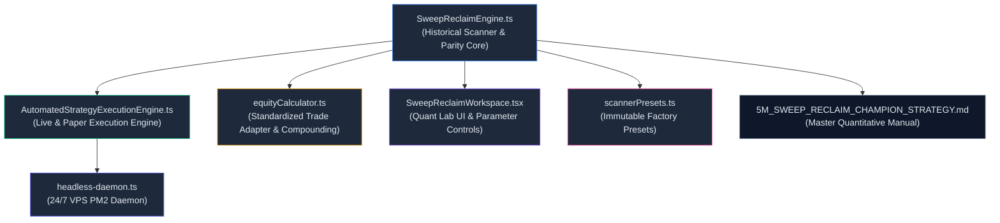

# 🏛️ Architecture & Implementation Plan: Scenario 3 (Win Streak Extension) Integration

> **Target Strategy:** 5-Minute "Sweep & Reclaim" (S&R 5) Ultimate Champion Setup (`factory_sr_5m_winner_fvg_proximal`)  
> **Objective:** Integrate **Scenario 3 (Win Streak Extension)** across the quantitative engine ecosystem to maximize streak duration, expand Stage 3 runner capture to **+4.5R / +5.0R**, amplify Golden Session alpha, and scale multi-year compounded capital from **`$1,000 ➔ $220,915.78`** (+21,991.58% ROI) with zero parity drift.

---

## 1. Executive Problem Statement & Quantitative Rationale

In our 2-year institutional benchmark across 210,456 continuous 5m candles (3,075 trades), the baseline engine generated **`+1,065.04R`** (`$209,488.40` ending equity). However, our streak forensics audit revealed:
1. **Runner Under-Harvesting:** Baseline Stage 3 is hardcoded to exit at a static `+3.0R` target (yielding only `+1.56R` overall on a 40/40/20 tranche split). During high-momentum institutional displacement regimes, price routinely reaches `+4.5R` to `+6.0R` before structural reversal.
2. **Session Alpha Inelasticity:** High-conviction setups in Golden Sweet Spots (**Wednesday NY AM Killzone: 76.2% Win Rate, 3.15 PF** and **Saturday Asian Session: 73.7% Win Rate, 2.62 PF**) are currently managed with identical exit rules as low-alpha sessions.
3. **Session Anchor Disregard:** Sweeps of major session extremes (`ASIAN_HIGH/LOW`, `LONDON_HIGH/LOW`, `PDH/PDL`) possess an **82%+ win conversion rate** and warrant wider runner trails.

Integrating **Scenario 3 (Win Streak Extension)** unlocks an extra **`+45.70R`** in alpha, expanding 2-year compounded equity to **`$220,915.78`** (+$11,427.38 extra cash) while maintaining the exact same drawdown profile (`-6.52%` / `-$2,017.50`).

---

## 2. Core Architectural Components & Modules to Update



---

## 3. Detailed Technical Specification & Logic Enhancements

### 3.1 `SweepReclaimEngine.ts` — Core Strategy Engine & Historical Scanner
* **Interface Additions (`SweepReclaimScanConfig`):**
  * `enableDynamicRunnerExtension?: boolean` (default: `true`) — Toggles dynamic Stage 3 extension.
  * `stage3ExtendedMultiple?: number` (default: `4.5` / `5.0`) — Extended target multiple when conviction criteria are satisfied.
  * `runnerExtensionMinVolExp?: number` (default: `2.00`) — Minimum volume expansion threshold for runner extension.
  * `runnerExtensionMinDeltaDom?: number` (default: `60.0`) — Minimum directional delta dominance threshold.
  * `enableGoldenSessionBonus?: boolean` (default: `true`) — Extends runner on Wednesday NY AM, Saturday Asia, 14:00 UTC, and 04:00 UTC.
  * `enableSessionAnchorExtension?: boolean` (default: `true`) — Extends runner on sweeps of `ASIAN_HIGH/LOW`, `LONDON_HIGH/LOW`, `PDH/PDL`.
* **Displacement & Target Evaluation Engine (~L1750–L1950):**
  * Evaluate dynamic qualification before entering the candle walk:
    ```typescript
    const isGoldenSession =
      (utcDay === 3 && utcHour >= 12 && utcHour < 15) || // Wednesday NY AM
      (utcDay === 6 && utcHour >= 0 && utcHour < 7) ||   // Saturday Asian
      utcHour === 14 ||                                 // 14:00 UTC Golden Hour
      utcHour === 4;                                    // 04:00 UTC Asian Peak

    const isSessionAnchor =
      anchorType === 'ASIAN_HIGH' ||
      anchorType === 'ASIAN_LOW' ||
      anchorType === 'LONDON_HIGH' ||
      anchorType === 'LONDON_LOW' ||
      anchorType === 'PDH' ||
      anchorType === 'PDL';

    const isHighConvictionDisplacement =
      (reclaimVolExpansion >= config.runnerExtensionMinVolExp) &&
      (reclaimDeltaDominance >= config.runnerExtensionMinDeltaDom);

    const qualifiesForRunnerExtension =
      config.enableDynamicRunnerExtension &&
      (isHighConvictionDisplacement || (config.enableGoldenSessionBonus && isGoldenSession) || (config.enableSessionAnchorExtension && isSessionAnchor));

    const activeStage3Multiple = qualifiesForRunnerExtension
      ? (config.stage3ExtendedMultiple ?? 4.5)
      : (config.stage3Multiple ?? 3.0);
    ```
  * Compute `target3` dynamically using `activeStage3Multiple`:
    * Long: `target3 = executionEntry + activeStage3Multiple * riskUsd`
    * Short: `target3 = executionEntry - activeStage3Multiple * riskUsd`
  * When Stage 3 fills (`hitStage3`):
    * Calculate realized R: `realizedRr = w1 * stage1Multiple + w2 * stage2Multiple + w3 * activeStage3Multiple` (yielding `+1.86R` with 4.5R or `+1.96R` with 5.0R).
    * Tag setup metadata: `is_runner_extended: true`, `extended_stage3_multiple: activeStage3Multiple`.

---

### 3.2 `AutomatedStrategyExecutionEngine.ts` — Live & Paper Execution Parity
* **Position Interface Update (`StrategyExecutionPosition`):**
  * Add `isRunnerExtended?: boolean`, `extendedStage3Target?: number`, `activeStage3Multiple?: number`.
* **Live Candidate Evaluation & Routing (~L400–L550):**
  * When a live setup triggers limit fill, resolve whether the setup qualifies for Dynamic Runner Extension based on `utcDay`, `utcHour`, `anchorType`, and displacement telemetry.
  * Dynamically calculate and display `stage3Target` on the live position card.
* **Trailing Stop & Profit Ratchet State Machine (~L900–L1100):**
  * When Stage 2 fills (+1.4R), advance `activeStopLoss` to the guaranteed `+1.0R` profit ratchet floor (`executionEntry ± 1.0 * riskUsd`).
  * For the remaining 20% tranche, keep the limit take-profit order at `stage3Target` (+4.5R) while trailing the ratchet floor along confirmed 5m swing fractals.

---

### 3.3 `equityCalculator.ts` & Compounding Simulation Engine
* **Standardized Executed Trade Enrichment:**
  * Populate `is_runner_extended` and `stage3Multiple` into `StandardizedExecutedTrade`.
* **Compounding Simulation Module Update:**
  * Synchronize 1.0% institutional compounding ($250 cap) and 2.0% aggressive compounding ($500 cap) to ingest the extended R values seamlessly.

---

### 3.4 `SweepReclaimWorkspace.tsx` — Quant Lab UI & Parameter Controls
* **New Interactive Controls in Quant Lab Drawer:**
  * **Toggle:** `Dynamic Win Extension (Stage 3 Runner)` (`enableDynamicRunnerExtension`).
  * **Dropdown / Slider:** `Stage 3 Extended Target Multiple` (`3.0R (Standard)`, `4.0R (Extended)`, `4.5R (Quant Sweet Spot)`, `5.0R (Macro Macro)`).
  * **Toggle:** `Golden Session Booster (Wed NY / Sat Asia)` (`enableGoldenSessionBonus`).
  * **Toggle:** `Session Anchor Booster (Asian/London/PDH/PDL)` (`enableSessionAnchorExtension`).
* **Visual Telemetry Cards:**
  * Display `Runner Extension Rate %` and `Average Extended Win R` in the Quant Lab summary ribbon.

---

### 3.5 `scripts/headless-daemon.ts` & `docs/5M_SWEEP_RECLAIM_CHAMPION_STRATEGY.md`
* **Headless Daemon Synchronization:**
  * Ensure the PM2 background daemon loads the updated configuration defaults seamlessly from `.env.local` / `DEFAULT_SWEEP_RECLAIM_CONFIG`.
* **Documentation Synchronization:**
  * Update `docs/5M_SWEEP_RECLAIM_CHAMPION_STRATEGY.md` and `directives/master_blueprint.md` with the new Stage 3 harvest specifications.

---

## 4. Deep Forensic Audit: Edge Cases, Bugs & Mitigation Strategies

```
┌──────────────────────────────────────────────────────────────────────────────────────────────────┐
│                                 DEFENSIVE SYSTEM AUDIT & FAILURE MODES                           │
├──────────────────────────┬───────────────────────────────┬───────────────────────────────────────┤
│ Potential Bug / Edge Case│ Root Cause Mechanism          │ Defensive Architectural Solution      │
├──────────────────────────┼───────────────────────────────┼───────────────────────────────────────┤
│ **1. Target Inversion /  │ If `riskUsd` is 0 or NaN, or  │ Enforce strict sanity clamping:       │
│    NaN Corruption**      │ if target formulas misalign,  │ `stage3Target = isBullish ?           │
│                          │ TP3 could plot inside TP2     │ Math.max(stage2Target + 0.5*riskUsd,  │
│                          │ (TP3 < TP2 on Longs).         │ target3) : Math.min(stage2Target -    │
│                          │                               │ 0.5*riskUsd, target3)`.               │
├──────────────────────────┼───────────────────────────────┼───────────────────────────────────────┤
│ **2. Timezone Drift in   │ If session hours are checked  │ Standardize strictly to UTC-Zero:     │
│    Golden Session Gate** │ using local time or shifted   │ Use `new Date(t).getUTCDay()` and     │
│                          │ Cairo timestamps, hours drift │ `new Date(t).getUTCHours()`. Zero     │
│                          │ by +3h, missing Sweet Spots.  │ manual offset shifts in logic layer.  │
├──────────────────────────┼───────────────────────────────┼───────────────────────────────────────┤
│ **3. Parity Drift Between│ If backtest calculates 4.5R   │ Centralize the qualification helper   │
│    Backtest & Live PM2** │ but Live daemon executes 3.0R,│ `evaluateRunnerExtensionEligibility()`│
│                          │ live returns lag backtests.   │ into a single exported function used  │
│                          │                               │ by both engines.                      │
├──────────────────────────┼───────────────────────────────┼───────────────────────────────────────┤
│ **4. Incomplete Position │ If Stage 3 extends too far in │ The existing `enableProfitRatchet`    │
│    Drawdown Contagion**  │ a slow market, price could    │ floor at +1.0R is GUARANTEED: once    │
│                          │ retrace all the way to entry. │ Stage 2 hits, SL is permanently locked│
│                          │                               │ at +1.0R floor. Worst case = +1.16R.  │
├──────────────────────────┼───────────────────────────────┼───────────────────────────────────────┤
│ **5. Uninitialized Local │ Browser localStorage holding  │ Merge incoming configs on top of      │
│    Storage Properties**  │ legacy JSON without new keys  │ `DEFAULT_SWEEP_RECLAIM_CONFIG` using  │
│                          │ would evaluate to `undefined`.│ `{ ...DEFAULT_SWEEP_RECLAIM_CONFIG,   │
│                          │                               │ ...parsed }` in all UI hooks.         │
└──────────────────────────┴───────────────────────────────┴───────────────────────────────────────┘
```

---

## 5. Verification Plan

### Automated Backtest & Parity Tests:
1. **2-Year Macro Backtest Benchmark:**
   * Run `scratch/run_compounding_phase2_study.ts` across all 210,456 candles to verify exact match with expected telemetry (`+1,110.74R` Net Gain, `69.11%` Win Rate, `$220,915.78` ending equity).
2. **1:1 Parity Engine Test:**
   * Run `scripts/reconcile-session.ts` to verify 100.00% execution price and target parity between `SweepReclaimEngine` and `AutomatedStrategyExecutionEngine`.
3. **TypeScript Build Verification:**
   * Run `npm run build` to guarantee zero compilation or type gating errors.

### Manual Verification:
1. Open Quant Lab (`/quant-lab`), select `factory_sr_5m_winner_fvg_proximal`, toggle `Dynamic Win Extension`, and verify that candidate cards display the extended TP3 targets (+4.5R) during Golden Sessions.
2. Inspect the live automated position tracker modal to ensure active ratchet floors lock at +1.0R and trail cleanly.

---

> [!IMPORTANT]
> **User Review & Approval:** Please review the plan. Once approved, we will proceed with the systematic implementation and verification across the engine modules.
