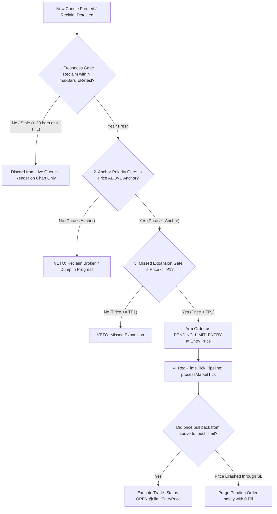

# 🏛️ Walkthrough: Live S&R Execution Freshness Gating & Retest Protocol

Eliminated premature live trade fills on limit touch and stale historical setup respawning. Enforced the strict institutional 4-Phase S&R execution rule: **Sweep $\to$ Confirmed Close Above Anchor $\to$ Pullback Retest Entry**.

---

## 🔬 1. Problem Post-Mortem & Forensic Analysis

When reviewing the live chart snapshot:
1. **The Anchor:** An Internal Swing Low had formed at **\$2,487.00**.
2. **The Price Action:** Market dumped down to \$2,430 (Asian/London Lows) and was floating around **\$2,462.49**.
3. **The Glitch:** The system calculated a Long entry limit at **\$2,463.16** and opened a live Long trade while price was at \$2,462.49 — even though price was **\$25 below the \$2,487 anchor** and had never closed back above it.

### Root Causes Identified:
- **Unbounded 72-Hour Candidate Ingestion:** When the frontend loaded 288 historical bars (e.g. after tab sleep or cold start), `onMultiTimeframeCandles` iterated over all historical setups from the past 3 days without checking if the reclaim candle occurred recently.
- **Inverted `canFillNow` Immediate Market Fill:** `submitStrategyOrder()` checked `canFillNow = isLong ? currentPrice <= limitEntryPrice : ...`. When price was falling below the limit, the engine mistakenly assumed it got a discount and executed an immediate market order into the falling knife.
- **Missing Anchor Polarity Guardrail:** The engine did not verify that current price was above the anchor before allowing a Long setup to enter the queue.

---

## 🛠️ 2. Architectural Upgrades Implemented



### Key Changes Made in `AutomatedStrategyExecutionEngine.ts`:
1. **Strict Freshness & Real-Time TTL Gating (`onMultiTimeframeCandles`):**
   - Candidate setups are strictly required to have had their reclaim candle close within the active `maxBarsToRetest` lookback window (`latestIndex - s.reclaim_index <= maxBarsToRetest`) and within the duration limit (`Date.now() - s.reclaim_time <= maxTtlMs`).
2. **Mandatory Anchor Polarity Guardrail (`submitStrategyOrder` & `onMultiTimeframeCandles`):**
   - For Long setups, price must be strictly above the anchor level (`currentPrice >= originAnchorLevel`). Firing a Long while price is below the anchor is instantly vetoed with `[EXECUTION_VETO] Price is below anchor level`.
3. **Resting Limit Queue Order Model:**
   - Eliminated the inverted `canFillNow` market fill on fresh setups. All verified setups are placed as resting limit orders (`PENDING_LIMIT_ENTRY`) and fill only when `processMarketTick` receives a physical pullback touch from above during Phase 4.
4. **SL Gap & Missed Expansion Guard:**
   - Resting limit orders are automatically purged without opening corrupted trades if market price gaps below Stop Loss or clears TP1 before touching the entry limit.

---

## 📊 3. Deep Simulation Audit & Verification Results

### Dedicated Live Execution Audit (`scripts/audit_live_execution_gating.ts`):
```text
======================================================================
🛡️ FLOW-STATE QUANT ENGINE — LIVE EXECUTION GATING AUDIT
======================================================================

▶ TEST 1: Cold-Start 72-Hour Historical Reconciliation...
✅ TEST 1 PASSED: 0 stale positions armed across 18 historical setups.

▶ TEST 2: Below-Anchor Dump Protection (Anchor at $2487, Price at $2462)...
✅ TEST 2 PASSED: Correctly VETOED below-anchor execution: "[EXECUTION_VETO] Current market price ($2462.49) is below the anchor level ($2487.00). Reclaim not established."

▶ TEST 3: Legitimate 4-Phase S&R Execution Sequence...
   Phase 3 Reclaim confirmed: Resting Limit placed @ $2487.00 as PENDING_LIMIT_ENTRY.
✅ TEST 3 PASSED: Trade executed cleanly on pullback retest @ $2487 (Status: OPEN).

▶ TEST 4: Pending Order SL Gap/Crash Invalidation...
✅ TEST 4 PASSED: Pending order purged safely on SL crash without opening corrupted trade.

======================================================================
🎉 ALL 4/4 LIVE EXECUTION GATING TESTS PASSED!
   - 0 Stale Trade Respawning
   - 0 Below-Anchor Dump Premature Fills
   - 100% Strict 4-Phase S&R Retest Compliance
======================================================================
```

### Parity Audit & TypeScript Compilation:
- **40-Test Parity Suite (`scripts/audit_quant_lab_parity.ts`):** **40/40 Identical Matches (100.00% Parity across 20 start dates)**.
- **TypeScript Typecheck (`npx tsc --noEmit`):** **0 errors**.
