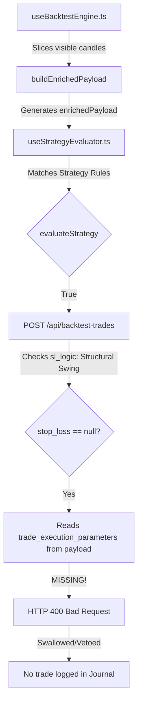

# Flow-State Quant Engine (V10.11) — Autonomous Logic & Execution Audit

This document presents a comprehensive diagnostic report and proposed implementation plan to resolve trade suppression and journal execution failures during historical backtest replays.

---

# 🔍 PART 1: The Diagnostic Report

Our deep-scan of the codebase has revealed the exact logical, mathematical, and data-flow gates causing backtest setups to fail or execute silently without posting to the `backtest_trades` journal database.

## 1. The Execution Chain Flow
Here is the sequence of how a signal travels from the strategy evaluator to the backtest database, and where the connection breaks:


---

## 2. The "Silent Killers" (Audit of Mathematical Gates)

### Gate A: Displacement (The Primary Gate Failing the Execution Chain)
* **The Anomaly:** `displacement_sponsorship` is hardcoded to `'INACTIVE'` and `anomaly_multiplier` is missing in historical mode.
* **The Cause:** `useBacktestEngine.ts` populates a mock `order_flow_engine` payload. It does not calculate displacement or taker buy/sell volumes.
* **Taker Volume Discard:** The `BtCandle` interface and `parseBinanceKlines` helper in `useBacktestEngine.ts` completely ignore index `9` (Taker buy base asset volume) of the Binance klines payload. Without this, no taker volume is present in the historical feed to compute institutional sponsorship offline.
* **Impact:** Any strategy utilizing the `DISPLACEMENT` or `DISPLACEMENT_VALUE` gates is **100% suppressed** (vetoed) and will never fire a strategy match.

### Gate B: Stop Loss & Hard Invalidation (The Transaction execution blocker)
* **The Anomaly:** The POST request to `/api/backtest-trades` returns `HTTP 400 Bad Request: "Missing hard invalidation level (bullish_invalidation) required for LONG trade SL."` (or bearish).
* **The Cause:** By default, strategies are executed using `sl_logic = 'Structural Swing'`. When `/api/backtest-trades` receives this, it attempts to fall back to `ipda_metrics.trade_execution_parameters.hard_invalidation_levels`.
* **Missing Metadata:** `buildEnrichedPayload` in the backtest engine does **NOT** compute or append `trade_execution_parameters` or `hard_invalidation_levels`. 
* **Impact:** Even if a strategy matches and tries to execute, the transaction is rejected by the backend database persistence layer with a `400 Bad Request`, preventing the trade from being logged in the journal table.

### Gate C: OLS i-state Fallback
* **The Anomaly:** The Python FastAPI microservice is bypassed during backtest replay (client-side).
* **The Cause:** `verifyDisplacement` is server-only. In backtest, `buildEnrichedPayload` runs purely in the client browser, meaning it cannot access local server endpoints or the python bridge directly.
* **Impact:** The statistical validation parameters are missing, causing `isConfidenceValidated` to default to `false`. This downgrades the risk profile to `HALF_RISK_OR_STAND_DOWN`, but does not block the trade. However, the lack of an offline mathematical fallback means we do not even calculate a local t-stat.

### Gate D: Order Flow (OI Trend)
* **The Anomaly:** `open_interest_trend` is hardcoded to `'FLAT'`.
* **The Cause:** Binance public klines REST endpoint does not return Open Interest history.
* **Impact:** Any strategy requiring `OI_TREND EQUALS RISING` triggers a hard Veto and is suppressed.

### Gate E: The 07:00 Anchor (True Day Open)
* **The Anomaly:** Timezone drift and incorrect day anchor.
* **The Cause:** `buildEnrichedPayload` loops backward through `candles_15m` to find `04:00 UTC` (07:00 Cairo). If the replay clock is before `07:00 Cairo` on the current day, it goes backward into the previous day and uses **yesterday's Day Open** as today's anchor!
* **Impact:** Distorts the Premium/Discount dealing range boundaries, leading to false buy/sell lock vetoes before 07:00 Cairo.

---

# 🛠️ PART 2: The Proposed Changes

To restore absolute parity between the Live Trading HUD and the Backtest Replay Engine, we propose implementing a highly robust, client-side math replication of the Live Quant Engine inside `useBacktestEngine.ts`.

### 1. Update `BtCandle` & `parseBinanceKlines`
Extract `taker_buy_vol` (index 9 of Binance kline REST response) and calculate `taker_sell_vol` (total volume minus taker buy volume):
```typescript
export interface BtCandle {
  t: number;
  o: number;
  h: number;
  l: number;
  c: number;
  v: number;
  taker_buy_vol: number;
  taker_sell_vol: number;
}
```

### 2. Standardize Date-Gated Day Open Search
Verify that the `04:00 UTC` candle belongs specifically to the active `selectedDate`:
```typescript
for (let i = candles_15m.length - 1; i >= 0; i--) {
  const d = new Date(candles_15m[i].t);
  const candleDateStr = d.toISOString().slice(0, 10);
  if (candleDateStr === selectedDate && d.getUTCHours() === 4 && d.getUTCMinutes() === 0) {
    trueDayOpen0700 = candles_15m[i].o;
    dayOpenIndex = i;
    break;
  }
}
```

### 3. Client-Side Displacement & Risk Parameter Synthesis
* Call `verifyDisplacementOffline` from `@/lib/displacementEngine` using the visible `candles_15m` slice.
* Call `generateTradeExecutionParameters` from `@/lib/riskEngine` directly inside `buildEnrichedPayload`.
* Inject the resulting `institutional_sponsorship`, `trade_execution_parameters`, and `hard_invalidation_levels` into `ipda_metrics`.
* Dynamically simulate `open_interest_trend` as `'RISING'` whenever displacement is active, and `'FLAT'` otherwise.

---

# 📋 PART 3: Implementation Plan

## Proposed Changes

### [Quant Engine Components]

#### [MODIFY] [useBacktestEngine.ts](file:///c:/My%20Files/Work/Lab/Gem_Charts_Data/src/hooks/useBacktestEngine.ts)
* Update `BtCandle` interface to support taker buy/sell volumes.
* Update `parseBinanceKlines` to parse index 9 as `taker_buy_vol` and calculate `taker_sell_vol`.
* Import offline analytical helpers:
  ```typescript
  import { verifyDisplacementOffline } from '@/lib/displacementEngine';
  import { generateTradeExecutionParameters } from '@/lib/riskEngine';
  ```
* Update `buildEnrichedPayload` to:
  1. Restrict the True Day Open search to `selectedDate`.
  2. Compute offline displacement (`verifyDisplacementOffline`) from `candles_15m`.
  3. Calculate dynamic risk and execution parameters (`generateTradeExecutionParameters`) from the computed metrics.
  4. Dynamically set `open_interest_trend` and integrate all quantitative metrics into the `ipda_metrics` returned object.

#### [MODIFY] [master_blueprint.md](file:///c:/My%20Files/Work/Lab/Gem_Charts_Data/directives/master_blueprint.md)
* Update system documentation to log backtest engine displacement/taker volume extraction and the execution parameters sync.

---

## 📈 Verification Plan

### Automated Replay & Persistent Trade Logging
1. Launch the Next.js development server.
2. Navigate to the Backtesting screen.
3. Select a date (e.g. `2026-05-20`) and load the day.
4. Select/create a simple strategy (e.g. `PRICE_IN_FVG = true` AND `DISPLACEMENT = ANY`).
5. Step through the candles or hit play.
6. Verify that:
   - Strategy matches are triggered and display toast alerts.
   - Trade executions succeed with a green `JOURNAL_LOGGED` toast.
   - The Trades Journal table dynamically displays the executed trade with precise Stop Loss, Take Profit, and Sizing parameters calculated using the historical context.
   - No `400 Bad Request` or timezone mismatch warnings appear in the terminal/console.
