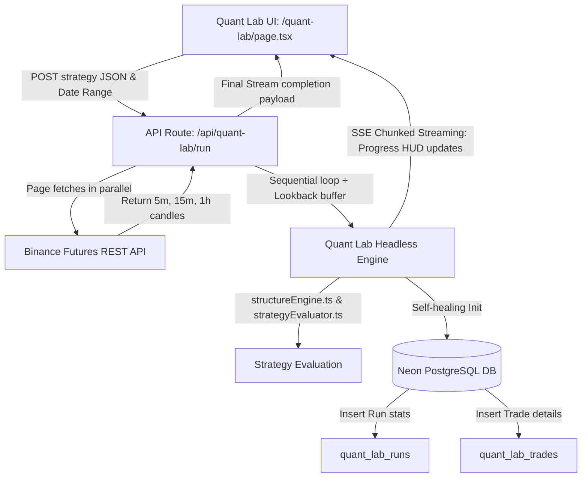

# Implementation Plan: Quant Lab (Automated Backtest Suite)

Create a high-performance, entirely decoupled quantitative backtesting module named **"Quant Lab"**. This module enables users to upload custom strategy configurations (JSON), fetch historical candlestick data from Binance, process the candles sequentially with zero look-ahead bias, evaluate strategies using the SMC/ICT `structureEngine.ts` and `strategyEvaluator.ts` rules, persist results to a Neon SQL database, stream live execution updates via Server-Sent Events (SSE), and export "surgical" JSON reports optimized for Gemini AI analysis.

---

## 1. Architectural Blueprint & Data Flow

To ensure high performance and prevent UI lag or logic bleeding, Quant Lab is completely decoupled from the manual Market Replay system.



---

## 2. Database Schema (Neon SQL / Vercel Postgres)

We will use the `@vercel/postgres` library with raw SQL commands to create and query two new self-healing tables:

### Table 1: `quant_lab_runs`
Stores run metadata, strategy config, and overall performance stats.
```sql
CREATE TABLE IF NOT EXISTS quant_lab_runs (
  id UUID PRIMARY KEY DEFAULT gen_random_uuid(),
  name VARCHAR(255) NOT NULL,
  strategy_config JSONB NOT NULL,
  symbol VARCHAR(50) NOT NULL,
  start_date TIMESTAMP WITH TIME ZONE NOT NULL,
  end_date TIMESTAMP WITH TIME ZONE NOT NULL,
  initial_balance DECIMAL(18, 4) NOT NULL,
  final_balance DECIMAL(18, 4) NOT NULL,
  total_trades INT NOT NULL DEFAULT 0,
  winning_trades INT NOT NULL DEFAULT 0,
  losing_trades INT NOT NULL DEFAULT 0,
  win_rate_pct DECIMAL(5, 2) NOT NULL DEFAULT 0,
  total_pnl DECIMAL(18, 4) NOT NULL DEFAULT 0,
  created_at TIMESTAMP WITH TIME ZONE DEFAULT CURRENT_TIMESTAMP
);
```

### Table 2: `quant_lab_trades`
Stores every individual trade generated by a backtest run.
```sql
CREATE TABLE IF NOT EXISTS quant_lab_trades (
  id UUID PRIMARY KEY DEFAULT gen_random_uuid(),
  run_id UUID REFERENCES quant_lab_runs(id) ON DELETE CASCADE,
  timestamp TIMESTAMP WITH TIME ZONE NOT NULL,
  direction VARCHAR(10) NOT NULL,
  entry_price DECIMAL(18, 4) NOT NULL,
  exit_price DECIMAL(18, 4),
  stop_loss DECIMAL(18, 4) NOT NULL,
  take_profit DECIMAL(18, 4) NOT NULL,
  realized_pnl DECIMAL(18, 4),
  roi DECIMAL(18, 4),
  position_size DECIMAL(18, 4) NOT NULL,
  status VARCHAR(20) NOT NULL DEFAULT 'CLOSED',
  exit_timestamp TIMESTAMP WITH TIME ZONE,
  logic_trigger VARCHAR(255),
  ipda_metrics_at_entry JSONB NOT NULL,
  created_at TIMESTAMP WITH TIME ZONE DEFAULT CURRENT_TIMESTAMP
);
```

---

## 3. Mathematical Parity & Rules (Zero Look-Ahead Bias)

### 3.1 Zero Look-Ahead Bias Gating
1. **Paging Fetches:** For the selected date range `[Start Date, End Date]`, the engine fetches `5m`, `15m`, and `1h` candles starting **4 days prior** to `Start Date` (the lookback buffer) to pre-calculate and stabilize swing fractals, ATR, and Fair Value Gaps.
2. **Sequential Loop:** The engine starts loop index `idx` from the first `5m` candle belonging to `Start Date`.
3. **Array Slices:** At each index `idx`, the engine ONLY sees `candles_5m.slice(0, idx + 1)`.
4. **Higher Timeframe Alignment:** The engine filters HTF candles (`15m` and `1h`) to exclude any bar whose open time plus its duration exceeds the current `5m` candle's close boundary time: `boundaryMs = candle_5m.t + 5 * 60 * 1000`.
   - `visible15m = candles_15m.filter(c => c.t + 15 * 60 * 1000 <= boundaryMs)`
   - `visible1h = candles_1h.filter(c => c.t + 60 * 60 * 1000 <= boundaryMs)`

### 3.2 Position Sizing & P&L Parity
We will use the exact equations verified in `master_blueprint.md` and `riskEngine.ts`:
- **Account Sizing:**
  - `risk_amount_usd = current_balance * (risk_percent / 100)`
  - `sl_distance = Math.abs(entry_price - stop_loss)`
  - `position_size = risk_amount_usd / sl_distance` (rounded to 4 decimal places)
- **Trade Exit Invalidation Checks (Evaluated on subsequent candle wicks):**
  - **LONG Trade:**
    - If `candle.l <= stop_loss` and `candle.h >= take_profit`: Assume **Stop Loss** hit first (conservative default).
    - Else if `candle.l <= stop_loss`: Exit at `stop_loss` (Realized P&L = `(stop_loss - entry_price) * position_size`).
    - Else if `candle.h >= take_profit`: Exit at `take_profit` (Realized P&L = `(take_profit - entry_price) * position_size`).
  - **SHORT Trade:**
    - If `candle.h >= stop_loss` and `candle.l <= take_profit`: Assume **Stop Loss** hit first (conservative default).
    - Else if `candle.h >= stop_loss`: Exit at `stop_loss` (Realized P&L = `(entry_price - stop_loss) * position_size`).
    - Else if `candle.l <= take_profit`: Exit at `take_profit` (Realized P&L = `(entry_price - take_profit) * position_size`).

- **Return on Investment (ROI):**
  - `roi = (realized_pnl / risk_amount_usd) * 100`

---

## 4. UI/UX Design (Brutalist Glassmorphism)

The UI will be situated at `/quant-lab/page.tsx` and implement the **"Midnight"** and **"Light"** harmonic styling themes.

```
┌────────────────────────────────────────────────────────────────────────────────────────┐
│  QUANT LAB ── AUTOMATED STRATEGY BACKTEST SUITE                       [ COMMAND CENTER ]│
├──────────────────────────────────────┬─────────────────────────────────────────────────┤
│ HISTORICAL RUNS                      │ WORKSPACE: EXECUTION LEDGER                     │
│ ┌──────────────────────────────────┐ │ ┌─────────────────────────────────────────────┐ │
│ │ FVG Sniper Run #1                │ │ │ Strategy Name: [ ETH 5m Breakout           ]│ │
│ │ Date: 2026-04-01 - 2026-05-15    │ │ │ Date Range:    [ 2026-04-01 ] to [ 2026-05-15 ]│ │
│ │ Win Rate: 64.2%  PnL: +$2,450    │ │ │ Strategy JSON:                              │ │
│ ├──────────────────────────────────┤ │ │ ┌─────────────────────────────────────────┐ │ │
│ │ Silver Bullet Retest             │ │ │ │ 💾 Drag & drop strategy JSON here or     │ │ │
│ │ Date: 2026-03-10 - 2026-04-20    │ │ │ │    click to upload strategy config        │ │ │
│ │ Win Rate: 58.7%  PnL: +$1,120    │ │ │ └─────────────────────────────────────────┘ │ │
│ ├──────────────────────────────────┤ │ │                  [⚡ RUN QUANT ENGINE ]     │ │
│ │                                  │ │ └─────────────────────────────────────────────┘ │
│ │                                  │ │ ┌─────────────────────────────────────────────┐ │
│ │                                  │ │ │ PROCESSING HUD:                             │ │
│ │                                  │ │ │ Day: 2026-04-15 | Equity: $10,420 | Trades: 12│ │
│ │                                  │ │ └─────────────────────────────────────────────┘ │
│ │                                  │ │ ┌─────────────────────────────────────────────┐ │
│ │                                  │ │ │ TRADES LEDGER            [ EXPORT FOR AI ]   │ │
│ │                                  │ │ │ ┌─────────────────────────────────────────┐ │ │
│ │                                  │ │ │ │ Time  │ Dir  │ Entry │ Exit  │ SL/TP │ PnL │ │ │
│ │                                  │ │ │ ├───────┼──────┼───────┼───────┼───────┼─────┤ │ │
│ │                                  │ │ │ │ 04-15 │ LONG │ 2110  │ 2135  │ SL..  │ +$25│ │ │
│ │                                  │ │ │ └───────┴──────┴───────┴───────┴───────┴─────┘ │ │
│ └──────────────────────────────────┘ │ └─────────────────────────────────────────────┘ │
└──────────────────────────────────────┴─────────────────────────────────────────────────┘
```

### Key UI Elements & Interactive Touches
- **Sidebar (Historical Runs):** Styled with `.glass-panel` and smooth transitions. Left margin is reserved for previous backtest execution metadata, which is selectable to load past trades.
- **Controls Panel:** Dropzone input for Strategy JSON with dynamic drag-and-drop support and a monospace config visualizer. Modern calendar date selector for range boundaries.
- **Processing HUD:** A bright, interactive neon HUD displaying real-time metrics during backtest streaming: `[Active Date Being Analyzed]` | `[Dynamic Portfolio Equity]` | `[Trade Execution Count]`.
- **Trades Table:** Displays trades generated by the run, decorated with indicator badges for LONG/SHORT directions and color-coded green/red PnL readouts.

---

## 5. Surgical AI-Ready Data Export

The **`[EXPORT FOR ANALYSIS]`** button produces an enriched JSON payload optimized specifically for Gemini AI.

### Export JSON Schema
```json
{
  "run_metadata": {
    "name": "FVG Sniper 5m",
    "symbol": "ETHUSDC",
    "start_date": "2026-04-01",
    "end_date": "2026-05-15",
    "win_rate_pct": 64.2,
    "total_pnl_usd": 2450.00
  },
  "strategy_logic": {
    "name": "FVG Sniper 5m",
    "conditions": [
      { "metric": "MARKET_TREND", "operator": "EQUALS", "value": "BULLISH" },
      { "metric": "PRICE_IN_FVG", "timeframe": "5m", "direction": "BULLISH", "operator": "IS_TRUE" }
    ]
  },
  "trade_records": [
    {
      "timestamp": "2026-04-15T09:30:00.000Z",
      "exit_timestamp": "2026-04-15T11:15:00.000Z",
      "duration_minutes": 105,
      "direction": "LONG",
      "entry_price": 2110.00,
      "exit_price": 2135.00,
      "stop_loss": 2095.00,
      "take_profit": 2140.00,
      "realized_pnl_usd": 250.00,
      "roi_pct": 166.67,
      "position_size": 10.00,
      "logic_trigger": "FVG Sniper 5m",
      "ipda_metrics_at_entry": {
        "trend": "BULLISH",
        "ols_p_value": 0.012,
        "displacement": 4.8,
        "premium_discount_status": "DISCOUNT"
      }
    }
  ]
}
```

---

## 6. Proposed File Changes

### 6.1 [NEW] `/src/lib/chartLayers/types.ts` (Extend)
We will add `QuantLabRun` and `QuantLabTrade` interfaces here to maintain unified typing.

### 6.2 [NEW] `/src/app/api/quant-lab/run/route.ts`
The primary server-side headless backtest processor. Implements:
- Table creation self-healing checks on request.
- Public Binance historical kline pages aggregator.
- In-memory candle iterator with lookback filters and SMC/ICT engines.
- Incremental SSE chunked stream responses for client HUD updating.
- Persists full execution summaries and individual trades to Neon.

### 6.3 [NEW] `/src/app/api/quant-lab/runs/route.ts`
Handles retrieval of past runs list (`GET`) and individual run purges (`DELETE`).

### 6.4 [NEW] `/src/app/api/quant-lab/trades/route.ts`
Retrieves trades for a specific backtest run (`GET /api/quant-lab/trades?run_id=UUID`).

### 6.5 [NEW] `/src/app/quant-lab/page.tsx`
The full Brutalist Glassmorphic dashboard. Implements strategy builder controls, JSON drops, neon trigger buttons, streaming SSE reader hooks, dynamic Processing HUD displays, and AI-ready JSON exports.

---

## 7. Verification Plan

### 7.1 Automated Integration Verification
- Validate the API endpoints using Node.js script tests inside `scratch/test-quant-lab.ts`.
- Run compiler lint checks to verify Next.js 16/TypeScript type safety:
  ```bash
  npm run lint
  ```

### 7.2 Manual UI Verification
- Verify the drag-and-drop dropzone works smoothly and parses Strategy JSON.
- Verify the date range picker sets boundaries correctly.
- Verify clicking the Neon Run button starts the backtest and updates the Processing HUD dynamically in real-time as the chunks stream in.
- Verify the Historical Runs sidebar renders previous backtests correctly.
- Verify clicking a historical run loads its trades ledger instantly into the ledger table.
- Verify the exported AI JSON file contains surgical data structures with entry `ipda_metrics`.
