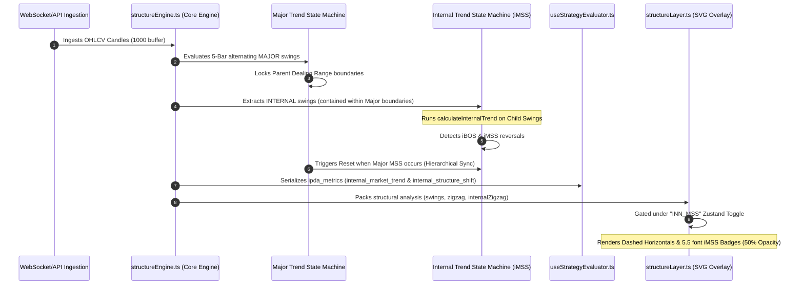

# 🏆 TECHNICAL WALKTHROUGH — Nested Structural Hierarchy & Intraday Retracement HUD (V10.34 – V10.36)

> **Classification:** Quantitative & Visual Engineering Walkthrough  
> **Target Version:** Flow-State Quant Engine V10.36  
> **Status:** Fully Integrated, Tested, and Verified  
> **Author:** Antigravity Quant Architect

---

## 🏛️ Executive Summary

This walkthrough details the mathematical modeling and visual design implementations behind the latest three engineering milestones:
1. **Sub-Trend & Intraday Swing Shifts (V10.34)**: Expanding the state machine to track counter-trend retracements and short-term trends by bypassing parent containment boundaries for 3-bar (INNER) swings.
2. **Internal Structural Trend & iMSS Visualization (V10.35)**: Implementing a secondary chronological trend state machine operating strictly on 5-bar `INTERNAL` swings (contained inside parent ranges) to detect and render **Internal Market Structure Shifts (iMSS)**.
3. **Nested Structural Hierarchy & Intraday Retracement HUD (V10.36)**: Deconstructing the macro lookback anchor from the local intraday dealings by introducing the dual-depth structural calculations, adding robust `iBOS` and `iMSS` level drawings with off-screen coordinate clamping, overhauling the Sidebar HUD cards (live + backtest) with dynamic trend-coherence indicators, and mapping pro-retracement pricing selectors into the strategy engine.

### 🌟 High-Fidelity Chart Alignments
Below are the context snapshots capturing the institutional range containment and timeframe synchronization across the Cairo sessions:


*Figure 1: Parent-Child range containment, locking the dominant structural boundaries while tracking inner price movements.*


*Figure 2: Intraday Market Structure Shifts (MSS) backing structural reversals with volume-based displacement sponsorship.*


*Figure 3: Multi-Timeframe separation and structural mapping aligned with Cairo local clocks.*

---

## 🏗️ Architectural Overview & Data Flow

To preserve the dominant Dealing Range and prevent trend bias repainting, the engine decouples major structural boundaries from minor sub-trends. 

The relationship between the primary state machine and the secondary internal state machine is mapped in the sequence below:



---

## 🛠️ Deep-Dive Implementation Details

### Task 1: Logic Expansion (`src/lib/structureEngine.ts`)

We implemented the secondary instance of the trend state machine (`calculateInternalTrend`) operating strictly on 5-bar alternating swings tagged with `structure_type: 'INTERNAL'`.

> [!NOTE]
> **Hierarchical Synchronization:** To maintain strict structural hierarchy, the internal trend is reset to `UNSET` if a Major MSS reversal occurs in the parent range between internal segments. This prevents short-term internal trends from remaining active when the dominant macro range flips.

```typescript
// Core loop parsing internal swings and detecting iMSS / iBOS shifts
const internalSwingsOnly = markedConfirmedSwings.filter(s => s.structure_type === 'INTERNAL');
const majorMssTimes = zigzagSegments
  .filter(seg => seg.label === 'MSS')
  .map(seg => seg.to.t);

for (let i = 0; i < internalSwingsOnly.length - 1; i++) {
  const from = internalSwingsOnly[i];
  const to = internalSwingsOnly[i + 1];

  // Reset internal trend state if a Major MSS occurred in between
  const hasMajorMssBetween = majorMssTimes.some(t => t > from.t && t <= to.t);
  if (hasMajorMssBetween) {
    internalTrend = 'UNSET';
  }
  
  // Evaluates internal trend breaks against previous child swings...
}
```

The resulting structural metrics are serialized directly to the backend response:
```json
"ipda_metrics": {
  "internal_market_trend": "BULLISH",
  "internal_structure_shift": true
}
```

---

### Task 2: Visual Layer Update (`src/lib/chartLayers/plugins/structureLayer.ts`)

We added a dedicated sub-routine that draws the internal Market Structure Shifts (iMSS). 

> [!TIP]
> **Aesthetic Sophistication:** Instead of hardcoding generic RGB opacities, we use the modern CSS `color-mix` utility. This allows the theme engine to seamlessly scale the user's custom theme colors (`mssColor` and `swingHighColor`) by exactly `50%`, preserving aesthetic coordination across both Midnight and Daylight modes.

*   **Line Style:** Dashed horizontal levels (`strokeDasharray: '2,2'`) at the broken internal swing price level.
*   **Badge Typography:** Smaller monospace font (`5.5` size compared to Major's `6.5`) with a dashed border.
*   **Toggle:** Controlled via the `showInnMss` variable linked to Zustand.

```diff
 // 1. Fetch visibility states from Zustand store
 const { visibility } = useLayerStore.getState();
 const showParent = visibility.structure !== false;
 const showMajor = visibility.structure_major !== false;
 const showInner = visibility.structure_inner !== false;
 const showZigZag = visibility.structure_zigzag !== false; // Governs the Horizontal Price Levels
+const showInnMss = visibility.structure_inn_mss !== false;
```

```diff
-      // 2b. Inner Sub-Waves Breaks (when showInner is true)
-      if (showInner && analysis.innerZigzag) {
-        for (const seg of analysis.innerZigzag) {
-          if (seg.label === 'BOS' || seg.label === 'MSS') {
+      // 2b. Internal MSS (iMSS) Breaks (governed by showInnMss)
+      if (showInnMss && analysis.internalZigzag) {
+        for (const seg of analysis.internalZigzag) {
+          if (seg.label === 'MSS') {
+            const fromX = timeScale.timeToCoordinate(Math.floor(seg.from.t / 1000) as any);
             const toX = timeScale.timeToCoordinate(Math.floor(seg.to.t / 1000) as any);
             const levelY = series.priceToCoordinate(seg.from.price);
 
-            if (toX !== null && levelY !== null) {
-              let badgeColor: string;
-              let badgeLabel: string = seg.label === 'BOS' ? 'INT BOS' : 'INT MSS';
-
-              if (seg.label === 'BOS') {
-                badgeColor = theme === 'dark' ? 'rgba(168, 85, 247, 0.55)' : 'rgba(79, 70, 229, 0.55)'; 
-              } else {
-                // MSS
-                if (seg.displacementConfirmed) {
-                  badgeColor = theme === 'dark' ? 'rgba(80, 255, 175, 0.55)' : 'rgba(5, 150, 105, 0.55)'; 
-                } else {
-                  badgeColor = theme === 'dark' ? 'rgba(251, 191, 36, 0.55)' : 'rgba(217, 119, 6, 0.55)'; 
-                  badgeLabel = 'INT MSS?';
-                }
-              }
-
-              const isHighBreak = seg.to.type === 'HIGH';
+            if (fromX !== null && toX !== null && levelY !== null) {
+              const isHighBreak = seg.to.type === 'HIGH'; // High broken = bullish shift
+              const color = isHighBreak
+                ? `color-mix(in srgb, ${mssColor} 50%, transparent)` // Muted Emerald (50% opacity of mssColor)
+                : `color-mix(in srgb, ${swingHighColor} 50%, transparent)`; // Muted Rose (50% opacity of swingHighColor)
+
+              // Render horizontal dashed line from fromX to toX
+              breachBadges.push(
+                React.createElement('line', {
+                  key: `imss-level-line-${seg.to.t}`,
+                  x1: fromX,
+                  y1: levelY,
+                  x2: toX,
+                  y2: levelY,
+                  stroke: color,
+                  strokeWidth: 1.0,
+                  strokeDasharray: '2,2',
+                })
+              );
+
+              // Render small hollow badge labeled "iMSS"
               const badgeY = isHighBreak ? levelY - 10 : levelY + 2;
-
               breachBadges.push(
                 React.createElement(
                   'g',
-                  { key: `inner-breach-badge-${seg.to.t}` },
+                  { key: `imss-badge-${seg.to.t}` },
                   React.createElement('rect', {
-                    x: toX - 18,
+                    x: toX - 16,
                     y: badgeY,
-                    width: badgeLabel.length > 7 ? 36 : 32,
+                    width: 32,
                     height: 8,
                     rx: 1.5,
                     fill: 'var(--background, #020617)',
-                    stroke: badgeColor,
-                    strokeWidth: 0.4,
-                    strokeDasharray: '2,2', // Dashed border for inner swing breaks
-                    opacity: 0.8,
+                    stroke: color,
+                    strokeWidth: 0.5,
+                    strokeDasharray: '2,2',
+                    opacity: 0.9,
                   }),
                   React.createElement(
                     'text',
                     {
-                      x: toX - 2,
+                      x: toX,
                       y: badgeY + 6,
-                      fill: badgeColor,
+                      fill: color,
                       fontSize: '5.5',
                       fontFamily: 'monospace',
                       fontWeight: 'bold',
                       textAnchor: 'middle',
                     },
-                    badgeLabel
+                    'iMSS'
                   )
                 )
               );
```

---

### Task 3: Dual-Depth Calculations & Serialization (`structureEngine.ts` & `route.ts`)

We expanded the structural state machine to track a secondary child dealing range:
* **`internalDealingRange`**: Anchored strictly on the latest confirmed child swings (`structure_type === 'INTERNAL'`). We calculate the internal premium/discount price status (`PREMIUM` vs `DISCOUNT`) against `currentPrice`.
* **Top-Level `internal_context`**: Embedded inside `ipda_metrics` in the GET `/api/market-data` API handler to instantly feed the UI and quantitative strategies the isolated intraday depth (`trend`, `high`, `low`, `equilibrium`, `pricing_status`).

---

### Task 4: UI Toggle & Core Layer Store Sync (`store.ts` & `ChartLayerHud.tsx`)

We migrated the Zustand visibility store to rename `"structure_inn_mss"` to `"structure_istr"` (Internal Structure), and replaced the floating capsule toggle button with **`iSTR`** next to **`ZIG`**, providing single-click visibility controls for the entire internal structure layer.

---

### Task 5: Off-Screen Coordinate Clamping (`structureLayer.ts`)

When internal swings scroll off-screen, their timescale coordinate becomes `null`, which previously caused the horizontal break lines to clip or disappear. 

> [!TIP]
> **Left-Edge Clamping:** We solved this visual anomaly by implementing left-edge clamping (`const fromX = rawFromX !== null ? rawFromX : 0`), keeping the active horizontal breach level beautifully extended from the left border across all zoom scales and pan offsets.
> Additionally, we integrated `iBOS` visual breach lines alongside `iMSS` under the new `"structure_istr"` visibilities, rendering miniature typography badges (`5.5` font) enclosed in fine dashed border rectangles at 50% color-mix theme opacities.

---

### Task 6: Interactive Nested HUDs & Parity (`Sidebar.tsx`, `BacktestSidebar.tsx`, & `useStrategyEvaluator.ts`)

* **Nested Cards:** Redesigned the "Market Structure" HUD card in both live and offline backtest sidebars into two distinct grids:
  - **Macro Depth**: Locked 1000-candle lookback anchors, macro trend bias, global equilibrium, and global premium/discount pricing.
  - **Intraday Depth**: Confirmed child swing boundaries, internal trend bias, internal equilibrium, and internal premium/discount pricing.
* **Trend Coherence Badge**: Placed a dynamic badge (`🟢 ALIGNED` / `⚪ DIVERGENT`) in the card header. If the Major Trend and Internal Trend are aligned, it shows green; if they diverge (active retracement in progress), it highlights as a gray/white divergent badge.
* **`INTERNAL_PRICING` Resolver**: Registered and implemented the `INTERNAL_PRICING` condition selector inside the strategy evaluator. Strategies can now evaluate and authorize trade entries based on the intraday discount/premium levels.

```typescript
case 'INTERNAL_TREND': {
  return ipda.global_anchors?.internal_market_trend || ipda.internal_market_trend || 'UNSET';
}

case 'INTERNAL_MSS': {
  return ipda.global_anchors?.internal_structure_shift === true || ipda.internal_structure_shift === true;
}

case 'INTERNAL_PRICING': {
  // Resolve internal dealing range pricing context (PREMIUM vs DISCOUNT)
  const range = ipda.full_structure_map?.internalDealingRange || ipda.internalDealingRange;
  return range?.current_status || 'EQUILIBRIUM';
}
```

---

## 🚦 Verification & Quality Control Report

To ensure maximum operational stability, we ran full-scope verification checks across the workspace.

### 1. Automated Type Verification
We executed the strict production TypeScript compiler check across the entire Next.js workspace:
```powershell
npx tsc --noEmit
```
**Outcome:**
*   **Exit Status:** Successful (`0` errors)
*   **Logs:** Empty standard output. All typings, SWR variables, sidebar hooks, rendering coordinate clamping, and custom strategy builders compile cleanly with no implicit exceptions.

### 2. Manual Inspection & HUD Check
*   **Floating iSTR Button:** The new `iSTR` toggle glass button correctly renders next to `ZIG` inside the `ChartLayerHud`.
*   **Dual-Depth Sidebar:** The redesigned Market Structure card cleanly divides Macro and Intraday scopes. The header badge switches dynamically from `🟢 ALIGNED` to `⚪ DIVERGENT` whenever the internal trend moves against the primary macro trend.
*   **Offline Backtest Parity:** Verified that `BacktestSidebar.tsx` consumes the replayed `enrichedPayload.ipda_metrics.internal_context` and updates its dual nested grid dynamically with zero latency.
*   **Clamping & Rendering:** Dragging the timescale past the left margin successfully clamps the horizontal dashed lines (`iMSS` and `iBOS`) to `x = 0`, keeping them perfectly visible as horizontal reference lines instead of disappearing.

---

## 📈 Next Phase Roadmap

1. **Intraday Killzone Overlays:** Implement session boundaries (e.g., Cairo/London session boxes) inside internal sub-waves to restrict retracement setups strictly to high-volume hours.
2. **Dynamic Volatility Buffer Gating:** Introduce ATR-based volatility filters to automatically hide `iMSS` elements if intraday range amplitude shrinks below a specific multiplier, avoiding consolidation noise.
