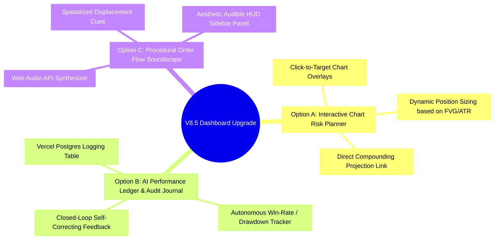
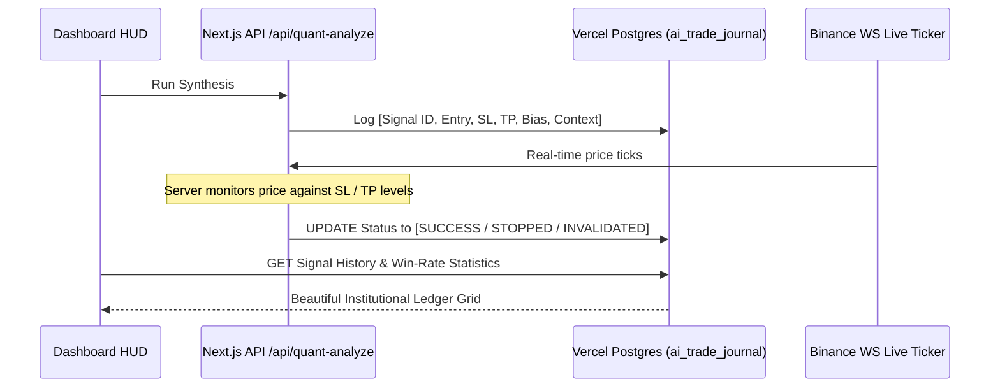

# 🧠 Flow-State Quant Engine — Bespoke Feature Brainstorming & Architecture Blueprint

This planning document outlines three state-of-the-art, institutional-grade features designed to elevate the **Gem Charts V8.0 Dashboard** from a passive data visualizer into a highly tactical, closed-loop quantitative execution terminal.

---

## 🧭 The Feature Contenders



---

### 🌐 Option A: The Interactive Institutional Risk Planner & Chart Overlay
*Transform the charting canvas into a tactical battlefield planner.*

#### 💡 Concept
Instead of manual position-sizing calculations, this feature introduces an interactive drawing engine onto the `lightweight-charts` surface. When a signal is generated by the AI (or manually triggered), the user can draw a color-coded "Execution Box" directly on the chart.
- **Green Zone:** Premium/Discount Dealing range showing potential entry.
- **Red Zone:** Invalidation Level, automatically snapping to the nearest **active FVG** or **SSL/BSL Magnet** calculated in `riskEngine.ts`.
- **Target Line:** Snaps to the heaviest **resting liquidity pool** (e.g. `BSL_Magnets` for long targets).

```
[ Chart Canvas ]
  |─── (Target Snaps to BSL Magnet)  ──────────────────────── $65,230 (TP)
  |      ▲
  |      │  Risk-Reward Ratio: 3.42:1
  |      ▼
  |─── (Entry snaps to FVG Consequent Encroachment) ───────── $64,800 (Entry)
  |      ▲  Position Size: 4.82 BTC ($312,340 Notional)
  |      ▼  Risk Capital: $1,500 (1.50% of Account)
  |─── (Stop Loss snaps to SSL Magnet / FVG Low) ──────────── $64,610 (SL)
```

#### 🛠️ Execution Mechanics
1. **Dynamic Math Engine Hook**: Pulls the current account balance from `/api/settings` or compounding parameters from `/compounding` to dynamically calculate the exact position size in lots/contracts.
2. **Snapping Assist**: Mouse interactions snap directly to `active_fvgs` coordinates or `resting_liquidity_pools` coordinates, making trade plotting sub-second precise.
3. **Compounding integration**: Includes a "Project growth" button on the planner that feeds the potential gain directly into the `/compounding` compound curve simulator.

---

### 🧠 Option B: Closed-Loop AI Journaling & Performance Audit Ledger
*Build an autonomous, self-improving ledger to audit prompt hallucinations and signal win-rates.*

#### 💡 Concept
Currently, the Synthesis Console runs the `/api/quant-analyze` engine and returns a highly detailed JSON state, but once the user refreshes or changes timeframe, the raw performance data is lost.
This feature inserts a **Closed-Loop Performance Monitor** that logs every AI analysis payload, its suggested Bias (`LONG`, `SHORT`, `NEUTRAL`), and its designated entry/stop levels into a secure Vercel Postgres table. The server then tracks subsequent market ticks (via WebSocket or REST polls) to measure if the setup succeeded, failed, or was invalidated.



#### 📊 Database Schema (`ai_trade_journal`)
```sql
CREATE TABLE IF NOT EXISTS ai_trade_journal (
    id SERIAL PRIMARY KEY,
    timestamp TIMESTAMP WITH TIME ZONE DEFAULT NOW(),
    asset VARCHAR(20) NOT NULL,
    bias VARCHAR(10) NOT NULL, -- LONG, SHORT, NEUTRAL
    entry_price NUMERIC(12, 2) NOT NULL,
    take_profit NUMERIC(12, 2) NOT NULL,
    stop_loss NUMERIC(12, 2) NOT NULL,
    invalidation_level NUMERIC(12, 2),
    initial_context TEXT, -- Sliced JSON payload
    outcome VARCHAR(20) DEFAULT 'ACTIVE', -- ACTIVE, TARGET_HIT, STOP_HIT, INVALIDATED
    max_runup NUMERIC(12, 2) DEFAULT 0.0,
    max_drawdown NUMERIC(12, 2) DEFAULT 0.0,
    closed_at TIMESTAMP WITH TIME ZONE
);
```

#### 💎 UI Enhancement (Tabbed Audit Ledger)
Adds a new **"Ledger"** page or a dedicated pane in `/settings` showing:
- **Total Syntheses Conducted** & **Historical Win Rate**.
- **Average Profit Factor** (expected R:R vs realized R:R).
- **Prompt Hallucination Audit**: Red/Green flags showing if the AI correctly obeyed the **Dual-Pricing Matrix** or **Temporal dead-zone rules** on each signal.

---

### 🔊 Option C: Spatialized Auditory Order Flow Soundscape & Killzone Soundboard
*Let the trader hear the market breathing. Translate raw quantitative flows into premium audio signals.*

#### 💡 Concept
Institutional desks often utilize subtle auditory cues to process massive parallel data streams without causing screen fatigue. This feature leverages the **Web Audio API** to generate procedural soundscapes directly in the browser based on real-time market data ticks.
- **Displacement Spikes:** Heavy taker volume triggers a rich low-end frequency pulse (subtle bass boom).
- **Liquidity Magnet Sweeps:** When price breaches a heavy `BSL_Magnet` or `SSL_Magnet`, a spatialized harmonic sweep alert is synthesized in stereo.
- **Killzone Temporal Reminders:** A soft, ambient bell chime signals the transition into the NY Open (07:00 NY) or the start of the Cairo PM Session, immediately transitioning the dashboard into a heightened "alert mode."

```
   Market Action                   Web Audio API Synthesizer               Output sound
   ─────────────                   ─────────────────────────               ────────────
  [Volume Spike]    ───────►   Low-Frequency Oscillator (LFO)  ───────►  [Deep Bass Pulse]
  [BSL Sweep]       ───────►   High-Q Bandpass Filter Sweep    ───────►  [Harmonic Whoosh]
  [Killzone Start]  ───────►   Procedural Chime Generator      ───────►  [Zen Ambient Bell]
```

#### 🎛️ HUD Sound Panel (Sidebar Tab)
Includes an elegant toggle dashboard in the execution sidebar:
- **Profile Selectors:** "Ambient Loft", "Retro Terminal", "Monolithic Space".
- **Volume Sliders:** Master volume, displacement weight, magnet proximity, Killzone chimes.
- **Proximity Radar:** A soft background hum that increases in pitch as the price gets closer to a heavy liquidity pool, allowing eyes-free trading.

---

## 🎯 Proposed Implementation Plan (Focusing on Option B)

To establish an institutional closed-loop system, we recommend implementing **Option B: Closed-Loop AI Journaling & Performance Audit Ledger**. This turns the AI from a simple calculator into a self-auditing intelligence model, aligning perfectly with our core memory protocols.

### Phase 1: DB Migration & Logging Hook
- Establish the `ai_trade_journal` table using a robust Vercel Postgres migration script.
- Modify `src/app/api/quant-analyze/route.ts` to log every successfully parsed AI synthesis to the DB.

### Phase 2: Live Outcome Updater Hook (Background Evaluation)
- Create `/api/journal/update` endpoint.
- Enhance `src/hooks/useBinanceWS.ts` or a new hook `useJournalEvaluator.ts` to push real-time prices to check and resolve outstanding active signals.

### Phase 3: Premium UI Audit Dashboard
- Create `/journal` page with high-contrast, premium dark tables.
- Add real-time visual indicator widgets showing the AI's current statistical win rate, average drawdown, and rule compliance.

---

### 💬 Pair-Programming Discussion
> [!NOTE]
> Which of these three institutional upgrades fits your current vision best?
> - **Option A** (Interactive Risk Chart Overlays)
> - **Option B** (Closed-Loop AI Journaling / Win-Rate Ledger)
> - **Option C** (Web Audio Procedural Order Flow Soundscapes)
>
> Reply with your choice, or suggest any specific tweaks you would like to make, and we can immediately begin writing the implementation plan!
