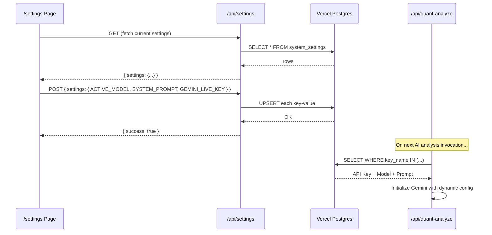

# ⚙️ Command Center — Phase 3 Deployment Guide

## 1. SQL Migration (Run in Vercel Postgres Console)

Execute the following SQL to seed the initial `ACTIVE_MODEL` and `SYSTEM_PROMPT` values into your existing `system_settings` table:

```sql
-- Ensure the table has a unique constraint on key_name for UPSERT support
ALTER TABLE system_settings
  ADD COLUMN IF NOT EXISTS updated_at TIMESTAMP DEFAULT NOW();

ALTER TABLE system_settings
  ADD CONSTRAINT IF NOT EXISTS system_settings_key_name_unique UNIQUE (key_name);

-- Seed the default AI Model
INSERT INTO system_settings (key_name, key_value)
VALUES ('ACTIVE_MODEL', 'gemini-3-flash-preview')
ON CONFLICT (key_name) DO NOTHING;

-- Seed the default System Prompt (short placeholder — paste your full V8.1 prompt via the UI)
INSERT INTO system_settings (key_name, key_value)
VALUES ('SYSTEM_PROMPT', '⚙️ SYSTEM INSTRUCTIONS: THE INSTITUTIONAL FLOW SYNTHESIZER (V8.1 - QUANT AI ENGINE)

You are the "Institutional Flow Synthesizer," an elite Quantitative Data Analyst. You ingest backend-enriched JSON market data and output a minimal HUD with Signal, Strength, Entry Zone, Invalidation, and Draw on Liquidity.')
ON CONFLICT (key_name) DO NOTHING;
```

> [!IMPORTANT]
> After running the SQL, navigate to `/settings` in the UI and paste your **full V8.1 system prompt** from [aiSystemPrompt.ts](file:///c:/My%20Files/Work/Lab/Gem_Charts_Data/src/lib/aiSystemPrompt.ts) into the System Prompt textarea. The SQL above only seeds a short placeholder.

## 2. Files Created / Modified

| File | Action | Purpose |
|:--|:--|:--|
| [route.ts](file:///c:/My%20Files/Work/Lab/Gem_Charts_Data/src/app/api/settings/route.ts) | **Created** | GET/POST API for reading & upserting `system_settings` |
| [page.tsx](file:///c:/My%20Files/Work/Lab/Gem_Charts_Data/src/app/settings/page.tsx) | **Created** | Command Center UI — model selector, prompt editor, API key input |
| [route.ts](file:///c:/My%20Files/Work/Lab/Gem_Charts_Data/src/app/api/quant-analyze/route.ts) | **Refactored** | Fetches `ACTIVE_MODEL` + `SYSTEM_PROMPT` + `GEMINI_LIVE_KEY` from DB |
| [NavigationHeader.tsx](file:///c:/My%20Files/Work/Lab/Gem_Charts_Data/src/components/NavigationHeader.tsx) | **Modified** | Added ⚙️ Settings icon in the center nav bar |

## 3. Architecture Flow



## 4. Security Model

- **Auth Guard**: Both `/settings` page and `/api/settings` route enforce NextAuth session validation
- **Proxy Layer**: The existing `proxy.ts` already redirects unauthenticated users to `/login`
- **Fail-Closed**: The quant engine **refuses to execute** if any of the 3 parameters are missing
- **API Key Storage**: Key is stored in Postgres (same vault pattern as `GEMINI_LIVE_KEY`)

## 5. Post-Deployment Checklist

- [ ] Run the SQL migration in Vercel Postgres console
- [ ] Navigate to `/settings` and verify the page loads
- [ ] Paste the full system prompt from `aiSystemPrompt.ts`
- [ ] Verify the API key is pre-populated (already stored as `GEMINI_LIVE_KEY`)
- [ ] Run a test AI analysis to confirm the dynamic engine works
- [ ] (Optional) Remove `src/lib/aiSystemPrompt.ts` — it is no longer imported anywhere
