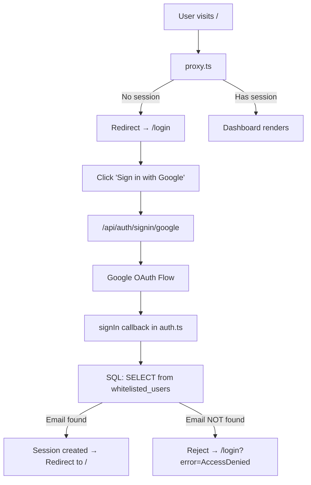

# 🔐 NextAuth v5 + Vercel Postgres Whitelisting — Implementation Summary

## Architecture Overview



## Files Created / Modified

| File | Purpose |
|------|---------|
| [auth.config.ts](file:///c:/My%20Files/Work/Lab/Gem_Charts_Data/src/auth.config.ts) | Edge-compatible config (providers only, no DB) — used by proxy.ts |
| [auth.ts](file:///c:/My%20Files/Work/Lab/Gem_Charts_Data/src/auth.ts) | Full auth config with `signIn` callback + Vercel Postgres whitelist query |
| [proxy.ts](file:///c:/My%20Files/Work/Lab/Gem_Charts_Data/src/proxy.ts) | Next.js 16 route protection (renamed from `middleware.ts`) |
| [route.ts](file:///c:/My%20Files/Work/Lab/Gem_Charts_Data/src/app/api/auth/%5B...nextauth%5D/route.ts) | NextAuth API route handler |
| [login/page.tsx](file:///c:/My%20Files/Work/Lab/Gem_Charts_Data/src/app/login/page.tsx) | Custom login page with institutional design |
| [login/layout.tsx](file:///c:/My%20Files/Work/Lab/Gem_Charts_Data/src/app/login/layout.tsx) | Login layout (hides NavigationHeader) |
| [AuthProvider.tsx](file:///c:/My%20Files/Work/Lab/Gem_Charts_Data/src/components/AuthProvider.tsx) | Client-side SessionProvider wrapper |
| [layout.tsx](file:///c:/My%20Files/Work/Lab/Gem_Charts_Data/src/app/layout.tsx) | Root layout — wrapped with AuthProvider |

## 🗃️ SQL: Create the `whitelisted_users` Table

> [!IMPORTANT]
> Run this SQL command in the **Vercel Postgres console** (Dashboard → Storage → Your DB → Query).

```sql
CREATE TABLE IF NOT EXISTS whitelisted_users (
    id SERIAL PRIMARY KEY,
    email VARCHAR(255) UNIQUE NOT NULL,
    name VARCHAR(255),
    added_at TIMESTAMP WITH TIME ZONE DEFAULT NOW(),
    notes TEXT
);

-- Create index for fast email lookups during sign-in
CREATE INDEX IF NOT EXISTS idx_whitelisted_users_email 
ON whitelisted_users (email);

-- Insert your whitelisted users
INSERT INTO whitelisted_users (email, name, notes) VALUES
    ('your-email@gmail.com', 'Your Name', 'Primary admin'),
    ('trusted-partner@gmail.com', 'Partner Name', 'Trading partner')
ON CONFLICT (email) DO NOTHING;
```

## 🔑 Environment Variables

> [!CAUTION]
> Add these to your `.env.local` (local dev) and Vercel Project Settings (production). **Never commit secrets to git.**

```bash
# ── NextAuth Core ──
AUTH_SECRET="generate-with: npx auth secret"
AUTH_URL="http://localhost:4000"  # Change to your production URL on Vercel

# ── Google OAuth Provider ──
# Create at: https://console.cloud.google.com/apis/credentials
GOOGLE_CLIENT_ID="your-google-client-id.apps.googleusercontent.com"
GOOGLE_CLIENT_SECRET="your-google-client-secret"

# ── Vercel Postgres (auto-populated when you link a Vercel Postgres DB) ──
POSTGRES_URL="postgres://..."
POSTGRES_PRISMA_URL="postgres://..."
POSTGRES_URL_NON_POOLING="postgres://..."
POSTGRES_USER="..."
POSTGRES_HOST="..."
POSTGRES_PASSWORD="..."
POSTGRES_DATABASE="..."
```

### Generate AUTH_SECRET:
```bash
npx auth secret
```

### Google OAuth Setup:
1. Go to [Google Cloud Console → Credentials](https://console.cloud.google.com/apis/credentials)
2. Create an **OAuth 2.0 Client ID** (Web Application)
3. Set **Authorized redirect URIs**:
   - Local: `http://localhost:4000/api/auth/callback/google`
   - Production: `https://your-domain.vercel.app/api/auth/callback/google`

## ⚠️ Next.js 16 Breaking Change: `proxy.ts` not `middleware.ts`

> [!WARNING]
> In Next.js 16, `middleware.ts` has been **deprecated and renamed** to `proxy.ts`. The exported function must be named `proxy` (or be a default export). The Auth.js `auth()` function returns a valid default export.
>
> If you have an existing `middleware.ts`, delete it and use `proxy.ts` instead. A codemod is available: `npx @next/codemod@canary middleware-to-proxy .`

## Security Model

| Layer | Check | Blocks |
|-------|-------|--------|
| **proxy.ts** | JWT cookie exists? | Unauthenticated page views |
| **signIn callback** | Email in `whitelisted_users`? | Unauthorized Google accounts |
| **Fail-closed** | DB error → deny access | Database outages |
