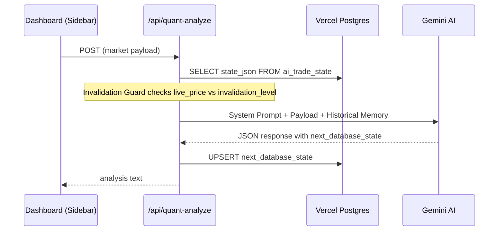

# Phase 4: Memory Bank & Stateful Quant Engine

## 🧠 Architecture



## 1. SQL Migration

Execute this in the **Vercel Postgres SQL Console**:

```sql
-- Phase 4: Memory Bank — Single Row State Architecture
CREATE TABLE IF NOT EXISTS ai_trade_state (
    id INT PRIMARY KEY,
    state_json TEXT NOT NULL DEFAULT '{"status": "SEARCHING"}',
    updated_at TIMESTAMP WITH TIME ZONE DEFAULT NOW()
);

-- Seed the default state row
INSERT INTO ai_trade_state (id, state_json)
VALUES (1, '{"status": "SEARCHING"}')
ON CONFLICT (id) DO NOTHING;
```

## 2. Files Modified

| File | Change |
|------|--------|
| `src/app/api/quant-analyze/route.ts` | + DB fetch, invalidation guard, context injection, DB upsert |
| `src/app/api/reset-state/route.ts` | **NEW** — NextAuth-protected force reset endpoint |
| `src/components/NavigationHeader.tsx` | + Force Reset State button with toast feedback |

## 3. Invalidation Guard Logic

```
IF historical_memory.invalidation_level EXISTS:
    IF live_price >= invalidation_level (for SHORT trades):
        → RESET to { status: "SEARCHING" }
    IF live_price <= invalidation_level (for LONG trades):
        → RESET to { status: "SEARCHING" }
```

> [!IMPORTANT]
> The invalidation guard is direction-agnostic: it simply checks if `live_price` has crossed the `invalidation_level` in either direction. The AI's `next_database_state` should include both `invalidation_level` and `trade_direction` for smarter invalidation. For now, we use a simple breach check.

## 4. Gemini Response Parsing

The route handles Gemini's markdown-wrapped JSON:
- Strips ` ```json ... ``` ` wrappers
- Falls back gracefully if `next_database_state` is missing
- Preserves the existing state if parsing fails
